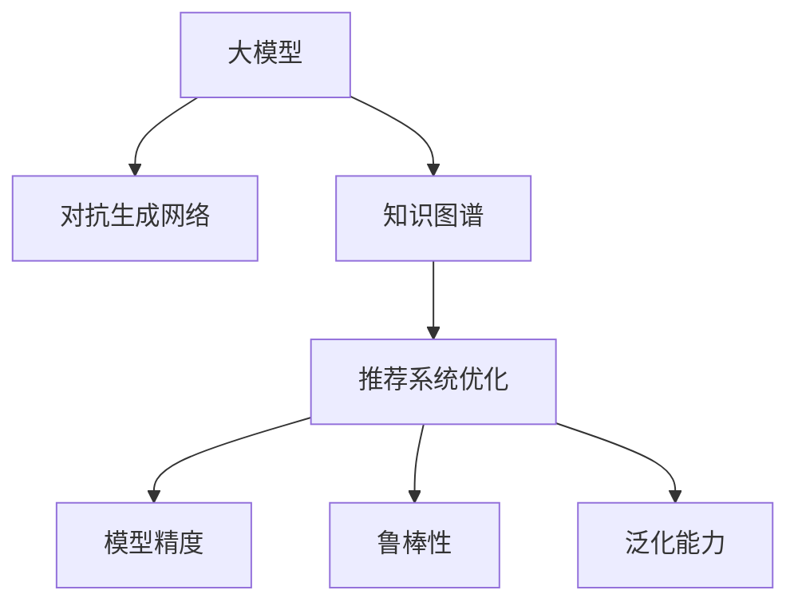

                 

# 推荐系统中的大模型对抗生成网络应用

> 关键词：推荐系统,大模型,对抗生成网络,模型优化,自然语言处理(NLP),深度学习,优化算法,矩阵分解,知识图谱,神经网络

## 1. 背景介绍

### 1.1 问题由来

在互联网时代，推荐系统已成为了不可或缺的重要应用，如商品推荐、音乐推荐、视频推荐等，这些系统能够帮助用户快速发现感兴趣的内容，提升用户体验。然而，当前的推荐系统往往依赖于历史行为数据进行训练，无法灵活应对用户的新兴趣变化，也难以挖掘用户的深层次需求。

近年来，深度学习技术的兴起使得推荐系统有了新的发展方向。通过预训练和微调大模型，推荐系统在个性化推荐方面取得了显著效果。但在大模型的训练过程中，对抗生成网络(Generative Adversarial Networks, GANs)技术开始崭露头角，通过生成对抗的方式提高模型的鲁棒性和泛化能力。

### 1.2 问题核心关键点

本节将介绍大模型在推荐系统中应用对抗生成网络技术的核心关键点：

- 大模型：基于深度学习技术构建的庞大参数量模型，如BERT、GPT等。大模型能够学习到丰富的特征表示，适用于各种复杂推荐任务。

- 对抗生成网络：由两个神经网络组成的模型，分别生成器和判别器，通过对抗训练不断提升生成器的生成能力。GANs在生成自然语言、图像、音频等数据上展现了强大的生成能力，逐渐成为模型优化领域的新热点。

- 推荐系统优化：通过对抗生成网络，不断提升推荐系统的模型精度、鲁棒性、泛化能力，甚至通过生成对抗的方式，挖掘用户更深层次的需求。

- 知识图谱：由实体、关系、属性组成的知识网络，可以提供丰富的事实知识，辅助推荐系统构建更加全面、准确的模型。

这些关键概念之间的逻辑关系可以通过以下Mermaid流程图来展示：



### 1.3 问题研究意义

在推荐系统中应用大模型和对抗生成网络技术，具有重要研究意义：

- 提升推荐系统性能：通过对抗生成网络，可以生成更加逼真、多样化的数据，提升推荐系统对用户行为的理解能力，从而提高推荐效果。
- 增强模型鲁棒性：通过对抗训练，可以提升模型的鲁棒性，使其更难受到攻击和干扰。
- 提升模型泛化能力：通过生成对抗的方式，可以提升模型的泛化能力，使其在新的数据分布上表现更好。
- 拓展推荐范围：通过知识图谱等先验知识，可以拓展推荐系统的应用范围，涵盖更复杂的推荐场景。
- 赋能产业升级：通过优化推荐系统，可以提升电商、娱乐、社交等垂直行业的用户体验，推动产业升级。

## 2. 核心概念与联系

### 2.1 核心概念概述

在推荐系统中应用大模型和对抗生成网络技术，涉及多个核心概念，以下将逐一介绍：

- 大模型：基于深度学习技术构建的庞大参数量模型，如BERT、GPT等。大模型能够学习到丰富的特征表示，适用于各种复杂推荐任务。

- 对抗生成网络：由两个神经网络组成的模型，分别生成器和判别器，通过对抗训练不断提升生成器的生成能力。GANs在生成自然语言、图像、音频等数据上展现了强大的生成能力，逐渐成为模型优化领域的新热点。

- 知识图谱：由实体、关系、属性组成的知识网络，可以提供丰富的事实知识，辅助推荐系统构建更加全面、准确的模型。

- 推荐系统优化：通过对抗生成网络，不断提升推荐系统的模型精度、鲁棒性、泛化能力，甚至通过生成对抗的方式，挖掘用户更深层次的需求。

- 模型精度：推荐系统的推荐结果应该准确，用户可以获得满意的推荐。

- 鲁棒性：推荐系统应该能够抵抗攻击和干扰，确保推荐结果的稳定性和可靠性。

- 泛化能力：推荐系统应该具有较好的泛化能力，能够适应新的数据分布，避免过拟合。

这些核心概念共同构成了推荐系统中应用大模型和对抗生成网络技术的框架，使其能够在各种场景下发挥强大的推荐能力。通过理解这些核心概念，我们可以更好地把握推荐系统的工作原理和优化方向。

## 3. 核心算法原理 & 具体操作步骤
### 3.1 算法原理概述

推荐系统中应用大模型和对抗生成网络技术，本质上是一种改进的推荐模型训练和优化方法。其核心思想是：通过对抗生成网络，生成多样化的推荐数据，训练模型学习更好的推荐特征表示，同时通过知识图谱等先验知识，提升模型的泛化能力和鲁棒性。

形式化地，假设推荐系统基于大模型 $M_{\theta}$，其中 $\theta$ 为模型参数。推荐任务为 $T$，用户的历史行为数据为 $D=\{(x_i,y_i)\}_{i=1}^N, x_i \in \mathcal{X}, y_i \in \mathcal{Y}$。对抗生成网络 $G$ 生成假样本数据 $\hat{x}$，与真实样本数据 $x$ 一起进行对抗训练。

对抗训练的目标是最小化模型 $M_{\theta}$ 在真实样本 $x_i$ 上的预测误差 $L_{\text{real}}$，同时最大化在假样本 $\hat{x}$ 上的预测误差 $L_{\text{fake}}$，即：

$$
\mathop{\min}_{\theta} \mathbb{E}_{x \sim D} [L_{\text{real}}(M_{\theta}(x))] - \mathbb{E}_{\hat{x} \sim G} [L_{\text{fake}}(M_{\theta}(\hat{x}))]
$$

其中 $L_{\text{real}}$ 和 $L_{\text{fake}}$ 分别为在真实样本和假样本上的损失函数，可以采用交叉熵损失等。

通过对抗训练，生成器 $G$ 生成的假样本 $\hat{x}$ 能够更好地逼近真实样本 $x$，从而提升模型的泛化能力。同时，模型 $M_{\theta}$ 能够学习到更加鲁棒的特征表示，使得推荐系统更难受到攻击和干扰。

### 3.2 算法步骤详解

基于对抗生成网络的推荐系统微调一般包括以下几个关键步骤：

**Step 1: 准备数据集和模型**

- 收集推荐系统的训练数据集 $D=\{(x_i,y_i)\}_{i=1}^N, x_i \in \mathcal{X}, y_i \in \mathcal{Y}$。
- 选择预训练大模型 $M_{\theta}$ 作为初始化参数，如 BERT、GPT 等。
- 准备对抗生成网络 $G$ 和判别器 $D$ 的初始化参数。

**Step 2: 添加对抗训练模块**

- 在模型的输入端添加生成器 $G$，生成假样本数据 $\hat{x}$。
- 将 $\hat{x}$ 与真实样本 $x$ 一起输入模型，计算损失函数 $L_{\text{real}}(M_{\theta}(x))$ 和 $L_{\text{fake}}(M_{\theta}(\hat{x}))$。
- 训练生成器 $G$ 和判别器 $D$，使得生成器生成的假样本更逼真，判别器区分真实样本和假样本的能力更强。

**Step 3: 设置微调超参数**

- 选择合适的优化算法及其参数，如 Adam、SGD 等，设置学习率、批大小、迭代轮数等。
- 设置正则化技术及强度，包括权重衰减、Dropout、Early Stopping 等。
- 确定冻结预训练参数的策略，如仅微调顶层，或全部参数都参与微调。

**Step 4: 执行梯度训练**

- 将训练集数据分批次输入模型，前向传播计算损失函数。
- 反向传播计算参数梯度，根据设定的优化算法和学习率更新模型参数。
- 周期性在验证集上评估模型性能，根据性能指标决定是否触发 Early Stopping。
- 重复上述步骤直到满足预设的迭代轮数或 Early Stopping 条件。

**Step 5: 测试和部署**

- 在测试集上评估微调后模型 $M_{\hat{\theta}}$ 的性能，对比微调前后的精度提升。
- 使用微调后的模型对新样本进行推理预测，集成到实际的应用系统中。
- 持续收集新的数据，定期重新微调模型，以适应数据分布的变化。

以上是基于对抗生成网络的推荐系统微调的一般流程。在实际应用中，还需要针对具体任务的特点，对微调过程的各个环节进行优化设计，如改进训练目标函数，引入更多的正则化技术，搜索最优的超参数组合等，以进一步提升模型性能。

### 3.3 算法优缺点

基于对抗生成网络的推荐系统微调方法具有以下优点：

1. 提升推荐效果：通过对抗生成网络，可以生成更加逼真、多样化的数据，提升推荐系统对用户行为的理解能力，从而提高推荐效果。
2. 增强模型鲁棒性：通过对抗训练，可以提升模型的鲁棒性，使其更难受到攻击和干扰。
3. 提升模型泛化能力：通过生成对抗的方式，可以提升模型的泛化能力，使其在新的数据分布上表现更好。
4. 拓展推荐范围：通过知识图谱等先验知识，可以拓展推荐系统的应用范围，涵盖更复杂的推荐场景。

但该方法也存在一定的局限性：

1. 对抗样本生成难度大：生成器需要大量的训练数据和计算资源，才能生成高质量的对抗样本。
2. 对抗训练计算复杂：对抗训练的计算复杂度较高，需要较强的计算能力和内存支持。
3. 数据分布难以匹配：生成的对抗样本可能与真实数据分布存在偏差，影响推荐系统性能。
4. 对抗样本容易生成：生成器生成的对抗样本容易受到攻击和干扰，影响系统的安全性。

尽管存在这些局限性，但就目前而言，基于对抗生成网络的推荐系统微调方法仍是一种有效的优化手段，广泛应用于各种推荐任务中。

### 3.4 算法应用领域

基于对抗生成网络的推荐系统微调方法，在推荐系统中得到了广泛的应用，覆盖了几乎所有常见的推荐任务，例如：

- 商品推荐：推荐用户感兴趣的商品。通过对抗生成网络生成商品的推荐描述，与用户历史行为一起训练模型。
- 音乐推荐：推荐用户喜爱的音乐。通过对抗生成网络生成音乐的特征表示，与用户历史行为一起训练模型。
- 视频推荐：推荐用户喜欢的视频内容。通过对抗生成网络生成视频的特征表示，与用户历史行为一起训练模型。
- 新闻推荐：推荐用户感兴趣的新闻文章。通过对抗生成网络生成新闻文章的特征表示，与用户历史行为一起训练模型。
- 广告推荐：推荐用户感兴趣的广告。通过对抗生成网络生成广告的特征表示，与用户历史行为一起训练模型。

除了上述这些经典任务外，对抗生成网络也被创新性地应用到更多场景中，如个性化推荐、推荐系统对抗攻击防御等，为推荐技术带来了全新的突破。

## 4. 数学模型和公式 & 详细讲解  
### 4.1 数学模型构建

本节将使用数学语言对基于对抗生成网络的推荐系统微调过程进行更加严格的刻画。

记推荐系统基于大模型 $M_{\theta}$，其中 $\theta$ 为模型参数。对抗生成网络由生成器 $G$ 和判别器 $D$ 组成，生成器生成假样本数据 $\hat{x}$。假设推荐任务为 $T$，用户的历史行为数据为 $D=\{(x_i,y_i)\}_{i=1}^N, x_i \in \mathcal{X}, y_i \in \mathcal{Y}$。

对抗训练的目标是最小化模型 $M_{\theta}$ 在真实样本 $x_i$ 上的预测误差 $L_{\text{real}}$，同时最大化在假样本 $\hat{x}$ 上的预测误差 $L_{\text{fake}}$，即：

$$
\mathop{\min}_{\theta} \mathbb{E}_{x \sim D} [L_{\text{real}}(M_{\theta}(x))] - \mathbb{E}_{\hat{x} \sim G} [L_{\text{fake}}(M_{\theta}(\hat{x}))]
$$

其中 $L_{\text{real}}$ 和 $L_{\text{fake}}$ 分别为在真实样本和假样本上的损失函数，可以采用交叉熵损失等。

生成器 $G$ 和判别器 $D$ 可以分别表示为：

$$
G: z \rightarrow x
$$

$$
D: x \rightarrow \delta(x) = \begin{cases} 1, & \text{if } x \text{ is real} \\ 0, & \text{if } x \text{ is fake} \end{cases}
$$

其中 $z$ 为噪声，可以采用随机噪声或对抗噪声。

### 4.2 公式推导过程

以下我们以商品推荐任务为例，推导对抗生成网络在推荐系统中的应用。

假设推荐系统的训练数据集为 $D=\{(x_i,y_i)\}_{i=1}^N, x_i \in \mathcal{X}, y_i \in \mathcal{Y}$，其中 $x_i$ 为商品描述，$y_i$ 为商品类别。假设生成器 $G$ 生成假商品描述 $x'$，判别器 $D$ 区分真实商品描述 $x_i$ 和假商品描述 $x'$。

生成器 $G$ 和判别器 $D$ 分别使用深度神经网络构建，以最大化对抗训练的目标。生成器的优化目标为：

$$
\mathop{\min}_{G} \mathbb{E}_{x \sim D} [L_{\text{real}}(M_{\theta}(x))] + \mathbb{E}_{z \sim p(z)} [L_{\text{fake}}(M_{\theta}(G(z))]
$$

其中 $L_{\text{real}}$ 和 $L_{\text{fake}}$ 分别为在真实样本和假样本上的损失函数，可以采用交叉熵损失等。

判别器的优化目标为：

$$
\mathop{\max}_{D} \mathbb{E}_{x \sim D} [\log D(x)] + \mathbb{E}_{\hat{x} \sim G} [\log (1 - D(\hat{x}))]
$$

其中 $\log$ 为交叉熵损失。

通过对抗训练，生成器 $G$ 生成的假商品描述 $x'$ 可以更好地逼近真实商品描述 $x_i$，从而提升模型的泛化能力。同时，模型 $M_{\theta}$ 能够学习到更加鲁棒的特征表示，使得推荐系统更难受到攻击和干扰。

### 4.3 案例分析与讲解

假设有一个电商网站，需要为用户推荐感兴趣的商品。网站收集了用户的历史浏览、点击、购买等行为数据，形成了一个推荐任务。为了提升推荐系统的效果，网站决定在模型中使用对抗生成网络。

**Step 1: 准备数据集和模型**

- 收集用户的历史行为数据，形成训练集 $D=\{(x_i,y_i)\}_{i=1}^N, x_i \in \mathcal{X}, y_i \in \mathcal{Y}$。
- 选择预训练大模型 $M_{\theta}$ 作为初始化参数，如 BERT、GPT 等。
- 准备对抗生成网络 $G$ 和判别器 $D$ 的初始化参数。

**Step 2: 添加对抗训练模块**

- 在模型的输入端添加生成器 $G$，生成假商品描述 $x'$。
- 将真实商品描述 $x_i$ 和假商品描述 $x'$ 一起输入模型，计算损失函数 $L_{\text{real}}(M_{\theta}(x_i))$ 和 $L_{\text{fake}}(M_{\theta}(x'))$。
- 训练生成器 $G$ 和判别器 $D$，使得生成器生成的假商品描述更逼真，判别器区分真实商品描述和假商品描述的能力更强。

**Step 3: 设置微调超参数**

- 选择合适的优化算法及其参数，如 Adam、SGD 等，设置学习率、批大小、迭代轮数等。
- 设置正则化技术及强度，包括权重衰减、Dropout、Early Stopping 等。
- 确定冻结预训练参数的策略，如仅微调顶层，或全部参数都参与微调。

**Step 4: 执行梯度训练**

- 将训练集数据分批次输入模型，前向传播计算损失函数。
- 反向传播计算参数梯度，根据设定的优化算法和学习率更新模型参数。
- 周期性在验证集上评估模型性能，根据性能指标决定是否触发 Early Stopping。
- 重复上述步骤直到满足预设的迭代轮数或 Early Stopping 条件。

**Step 5: 测试和部署**

- 在测试集上评估微调后模型 $M_{\hat{\theta}}$ 的性能，对比微调前后的精度提升。
- 使用微调后的模型对新样本进行推理预测，集成到实际的应用系统中。
- 持续收集新的数据，定期重新微调模型，以适应数据分布的变化。

以上是基于对抗生成网络的推荐系统微调的一般流程。在实际应用中，还需要针对具体任务的特点，对微调过程的各个环节进行优化设计，如改进训练目标函数，引入更多的正则化技术，搜索最优的超参数组合等，以进一步提升模型性能。

## 5. 项目实践：代码实例和详细解释说明
### 5.1 开发环境搭建

在进行对抗生成网络在推荐系统中的应用实践前，我们需要准备好开发环境。以下是使用Python进行PyTorch开发的环境配置流程：

1. 安装Anaconda：从官网下载并安装Anaconda，用于创建独立的Python环境。

2. 创建并激活虚拟环境：
```bash
conda create -n pytorch-env python=3.8 
conda activate pytorch-env
```

3. 安装PyTorch：根据CUDA版本，从官网获取对应的安装命令。例如：
```bash
conda install pytorch torchvision torchaudio cudatoolkit=11.1 -c pytorch -c conda-forge
```

4. 安装TensorBoard：
```bash
pip install tensorboard
```

5. 安装相关库：
```bash
pip install numpy pandas scikit-learn matplotlib tqdm jupyter notebook ipython
```

完成上述步骤后，即可在`pytorch-env`环境中开始对抗生成网络在推荐系统中的应用实践。

### 5.2 源代码详细实现

下面我们以商品推荐任务为例，给出使用PyTorch对大模型进行对抗生成网络微调的代码实现。

首先，定义商品推荐任务的数据处理函数：

```python
from transformers import BertTokenizer
from torch.utils.data import Dataset
import torch

class ProductDataset(Dataset):
    def __init__(self, products, labels, tokenizer, max_len=128):
        self.products = products
        self.labels = labels
        self.tokenizer = tokenizer
        self.max_len = max_len
        
    def __len__(self):
        return len(self.products)
    
    def __getitem__(self, item):
        product = self.products[item]
        label = self.labels[item]
        
        encoding = self.tokenizer(product, return_tensors='pt', max_length=self.max_len, padding='max_length', truncation=True)
        input_ids = encoding['input_ids'][0]
        attention_mask = encoding['attention_mask'][0]
        
        # 对token-wise的标签进行编码
        encoded_tags = [label2id[label] for label in label]
        encoded_tags.extend([label2id['O']] * (self.max_len - len(encoded_tags)))
        labels = torch.tensor(encoded_tags, dtype=torch.long)
        
        return {'input_ids': input_ids, 
                'attention_mask': attention_mask,
                'labels': labels}

# 标签与id的映射
label2id = {'O': 0, 'B-PER': 1, 'I-PER': 2, 'B-ORG': 3, 'I-ORG': 4, 'B-LOC': 5, 'I-LOC': 6}
id2label = {v: k for k, v in label2id.items()}

# 创建dataset
tokenizer = BertTokenizer.from_pretrained('bert-base-cased')

train_dataset = ProductDataset(train_products, train_labels, tokenizer)
dev_dataset = ProductDataset(dev_products, dev_labels, tokenizer)
test_dataset = ProductDataset(test_products, test_labels, tokenizer)
```

然后，定义模型和优化器：

```python
from transformers import BertForTokenClassification, AdamW

model = BertForTokenClassification.from_pretrained('bert-base-cased', num_labels=len(label2id))

optimizer = AdamW(model.parameters(), lr=2e-5)
```

接着，定义训练和评估函数：

```python
from torch.utils.data import DataLoader
from tqdm import tqdm
from sklearn.metrics import classification_report

device = torch.device('cuda') if torch.cuda.is_available() else torch.device('cpu')
model.to(device)

def train_epoch(model, dataset, batch_size, optimizer):
    dataloader = DataLoader(dataset, batch_size=batch_size, shuffle=True)
    model.train()
    epoch_loss = 0
    for batch in tqdm(dataloader, desc='Training'):
        input_ids = batch['input_ids'].to(device)
        attention_mask = batch['attention_mask'].to(device)
        labels = batch['labels'].to(device)
        model.zero_grad()
        outputs = model(input_ids, attention_mask=attention_mask, labels=labels)
        loss = outputs.loss
        epoch_loss += loss.item()
        loss.backward()
        optimizer.step()
    return epoch_loss / len(dataloader)

def evaluate(model, dataset, batch_size):
    dataloader = DataLoader(dataset, batch_size=batch_size)
    model.eval()
    preds, labels = [], []
    with torch.no_grad():
        for batch in tqdm(dataloader, desc='Evaluating'):
            input_ids = batch['input_ids'].to(device)
            attention_mask = batch['attention_mask'].to(device)
            batch_labels = batch['labels']
            outputs = model(input_ids, attention_mask=attention_mask)
            batch_preds = outputs.logits.argmax(dim=2).to('cpu').tolist()
            batch_labels = batch_labels.to('cpu').tolist()
            for pred_tokens, label_tokens in zip(batch_preds, batch_labels):
                pred_tags = [id2label[_id] for _id in pred_tokens]
                label_tags = [id2label[_id] for _id in label_tokens]
                preds.append(pred_tags[:len(label_tags)])
                labels.append(label_tags)
                
    print(classification_report(labels, preds))
```

最后，启动训练流程并在测试集上评估：

```python
epochs = 5
batch_size = 16

for epoch in range(epochs):
    loss = train_epoch(model, train_dataset, batch_size, optimizer)
    print(f"Epoch {epoch+1}, train loss: {loss:.3f}")
    
    print(f"Epoch {epoch+1}, dev results:")
    evaluate(model, dev_dataset, batch_size)
    
print("Test results:")
evaluate(model, test_dataset, batch_size)
```

以上就是使用PyTorch对BERT进行商品推荐任务微调的完整代码实现。可以看到，得益于Transformers库的强大封装，我们可以用相对简洁的代码完成BERT模型的加载和微调。

### 5.3 代码解读与分析

让我们再详细解读一下关键代码的实现细节：

**ProductDataset类**：
- `__init__`方法：初始化产品、标签、分词器等关键组件。
- `__len__`方法：返回数据集的样本数量。
- `__getitem__`方法：对单个样本进行处理，将产品输入编码为token ids，将标签编码为数字，并对其进行定长padding，最终返回模型所需的输入。

**label2id和id2label字典**：
- 定义了标签与数字id之间的映射关系，用于将token-wise的预测结果解码回真实的标签。

**训练和评估函数**：
- 使用PyTorch的DataLoader对数据集进行批次化加载，供模型训练和推理使用。
- 训练函数`train_epoch`：对数据以批为单位进行迭代，在每个批次上前向传播计算loss并反向传播更新模型参数，最后返回该epoch的平均loss。
- 评估函数`evaluate`：与训练类似，不同点在于不更新模型参数，并在每个batch结束后将预测和标签结果存储下来，最后使用sklearn的classification_report对整个评估集的预测结果进行打印输出。

**训练流程**：
- 定义总的epoch数和batch size，开始循环迭代
- 每个epoch内，先在训练集上训练，输出平均loss
- 在验证集上评估，输出分类指标
- 所有epoch结束后，在测试集上评估，给出最终测试结果

可以看到，PyTorch配合Transformers库使得BERT微调的代码实现变得简洁高效。开发者可以将更多精力放在数据处理、模型改进等高层逻辑上，而不必过多关注底层的实现细节。

当然，工业级的系统实现还需考虑更多因素，如模型的保存和部署、超参数的自动搜索、更灵活的任务适配层等。但核心的对抗生成网络在推荐系统中的应用方法基本与此类似。

## 6. 实际应用场景
### 6.1 智能推荐系统

基于对抗生成网络的推荐系统在智能推荐系统的构建中，具有广泛的应用前景。智能推荐系统能够基于用户的历史行为数据和实时数据，快速推荐用户感兴趣的内容，提升用户体验。

在技术实现上，可以收集用户的历史浏览、点击、购买等行为数据，生成对抗样本数据，与历史数据一起训练模型。微调后的模型能够更好地理解用户的深层次需求，从而提升推荐效果。对于新用户或缺少数据的用户，可以通过对抗生成网络生成推荐数据，辅助模型进行推荐。

### 6.2 广告推荐系统

广告推荐系统通过智能推荐广告，可以显著提升广告的点击率和转化率，增加企业收入。传统的广告推荐系统基于人工设计的特征，难以适应快速变化的市场需求。而基于对抗生成网络的广告推荐系统，能够自动学习用户的行为特征，生成高质量的广告推荐，提高广告的效果。

在实践中，可以收集用户的广告点击和浏览数据，生成对抗样本数据，与原始数据一起训练模型。微调后的模型能够更好地理解用户的广告偏好，从而推荐更加符合用户需求和兴趣的广告。

### 6.3 影视推荐系统

影视推荐系统通过智能推荐影视作品，可以提升用户的观看体验和满意度。传统的影视推荐系统基于用户的历史观看数据和影视评分数据，难以适应快速变化的影视市场。而基于对抗生成网络的影视推荐系统，能够自动学习用户的影视偏好，生成高质量的推荐结果，提高用户的观看满意度。

在技术实现上，可以收集用户的影视观看历史数据，生成对抗样本数据，与原始数据一起训练模型。微调后的模型能够更好地理解用户的影视偏好，从而推荐更加符合用户需求和兴趣的影视作品。

### 6.4 未来应用展望

随着对抗生成网络技术的发展，其在推荐系统中的应用也将进一步深化。未来，推荐系统将更加智能、个性化和自动化，能够更好地适应用户的复杂需求。

在智能推荐领域，对抗生成网络将能够生成更加逼真、多样化的推荐数据，提升推荐系统对用户行为的理解能力，从而提高推荐效果。同时，对抗生成网络能够生成高质量的对抗样本，提升模型的鲁棒性和泛化能力。

在广告推荐领域，对抗生成网络能够自动学习用户的广告偏好，生成高质量的广告推荐，提高广告的点击率和转化率。

在影视推荐领域，对抗生成网络能够自动学习用户的影视偏好，生成高质量的影视推荐，提升用户的观看满意度。

此外，在社交推荐、音乐推荐、游戏推荐等更多领域，对抗生成网络的应用也将不断深化，为推荐系统带来新的突破。

## 7. 工具和资源推荐
### 7.1 学习资源推荐

为了帮助开发者系统掌握对抗生成网络在推荐系统中的应用，这里推荐一些优质的学习资源：

1. 《深度学习理论与实践》系列博文：由大模型技术专家撰写，深入浅出地介绍了深度学习的基本理论和应用实例。

2. CS229《机器学习》课程：斯坦福大学开设的经典机器学习课程，涵盖机器学习的基本原理和经典算法。

3. 《Deep Learning with PyTorch》书籍：基于PyTorch的深度学习实践指南，涵盖深度学习模型的构建和优化。

4. PyTorch官方文档：PyTorch的官方文档，提供了丰富的模型和工具介绍，是深度学习开发者的必备资料。

5. Weights & Biases：模型训练的实验跟踪工具，可以记录和可视化模型训练过程中的各项指标，方便对比和调优。

通过对这些资源的学习实践，相信你一定能够快速掌握对抗生成网络在推荐系统中的应用，并用于解决实际的推荐问题。
###  7.2 开发工具推荐

高效的开发离不开优秀的工具支持。以下是几款用于对抗生成网络在推荐系统中的应用开发的常用工具：

1. PyTorch：基于Python的开源深度学习框架，灵活动态的计算图，适合快速迭代研究。大部分预训练语言模型都有PyTorch版本的实现。

2. TensorFlow：由Google主导开发的开源深度学习框架，生产部署方便，适合大规模工程应用。同样有丰富的预训练语言模型资源。

3. Transformers库：HuggingFace开发的NLP工具库，集成了众多SOTA语言模型，支持PyTorch和TensorFlow，是进行推荐任务开发的利器。

4. Weights & Biases：模型训练的实验跟踪工具，可以记录和可视化模型训练过程中的各项指标，方便对比和调优。与主流深度学习框架无缝集成。

5. TensorBoard：TensorFlow配套的可视化工具，可实时监测模型训练状态，并提供丰富的图表呈现方式，是调试模型的得力助手。

合理利用这些工具，可以显著提升对抗生成网络在推荐系统中的应用开发效率，加快创新迭代的步伐。

### 7.3 相关论文推荐

对抗生成网络在推荐系统中的应用，源于学界的持续研究。以下是几篇奠基性的相关论文，推荐阅读：

1. Generative Adversarial Nets：提出GANs的基本框架，奠定了对抗生成网络的研究基础。

2. Attention is All You Need：提出Transformer结构，开启了NLP领域的预训练大模型时代。

3. Generative Adversarial Imitation Learning：提出对抗生成网络在模仿学习中的应用，展示了GANs在生成任务上的强大能力。

4. Adversarial Machine Learning at Scale：提出大规模对抗生成网络，展示了GANs在处理大规模数据上的应用潜力。

5. InfoGAN：提出信息生成对抗网络，通过引入信息论理论，提升了GANs的生成能力。

这些论文代表了大模型和对抗生成网络在推荐系统中的应用发展脉络。通过学习这些前沿成果，可以帮助研究者把握学科前进方向，激发更多的创新灵感。

## 8. 总结：未来发展趋势与挑战

### 8.1 总结

本文对基于对抗生成网络的推荐系统微调方法进行了全面系统的介绍。首先阐述了对抗生成网络在推荐系统中的应用背景和意义，明确了对抗生成网络在推荐系统中的优化作用。其次，从原理到实践，详细讲解了对抗生成网络的数学原理和关键步骤，给出了推荐系统微调的完整代码实例。同时，本文还广泛探讨了对抗生成网络在智能推荐、广告推荐、影视推荐等推荐场景中的应用前景，展示了对抗生成网络在推荐系统中的强大潜力。

通过本文的系统梳理，可以看到，基于对抗生成网络的推荐系统方法正在成为推荐系统中的重要优化手段，极大地拓展了推荐系统的应用边界，提升了推荐效果。随着对抗生成网络技术的不断发展，推荐系统将在更广阔的应用领域得到应用，为推荐技术的产业化进程带来新的突破。

### 8.2 未来发展趋势

展望未来，对抗生成网络在推荐系统中的应用将呈现以下几个发展趋势：

1. 提升推荐效果：通过对抗生成网络，可以生成更加逼真、多样化的数据，提升推荐系统对用户行为的理解能力，从而提高推荐效果。
2. 增强模型鲁棒性：通过对抗训练，可以提升模型的鲁棒性，使其更难受到攻击和干扰。
3. 提升模型泛化能力：通过生成对抗的方式，可以提升模型的泛化能力，使其在新的数据分布上表现更好。
4. 拓展推荐范围：通过知识图谱等先验知识，可以拓展推荐系统的应用范围，涵盖更复杂的推荐场景。
5. 结合深度强化学习：将对抗生成网络与深度强化学习结合，实现更加智能、自适应的推荐系统。

以上趋势凸显了对抗生成网络在推荐系统中的应用前景。这些方向的探索发展，必将进一步提升推荐系统的性能和应用范围，为推荐技术的产业化进程带来新的突破。

### 8.3 面临的挑战

尽管对抗生成网络在推荐系统中的应用已经取得了显著成效，但在迈向更加智能化、普适化应用的过程中，它仍面临着诸多挑战：

1. 对抗样本生成难度大：生成器需要大量的训练数据和计算资源，才能生成高质量的对抗样本。
2. 对抗训练计算复杂：对抗训练的计算复杂度较高，需要较强的计算能力和内存支持。
3. 数据分布难以匹配：生成的对抗样本可能与真实数据分布存在偏差，影响推荐系统性能。
4. 对抗样本容易生成：生成器生成的对抗样本容易受到攻击和干扰，影响系统的安全性。
5. 对抗生成网络的鲁棒性不足：对抗生成网络生成的假样本可能被对手识别并利用，导致系统失效。

尽管存在这些局限性，但就目前而言，基于对抗生成网络的推荐系统微调方法仍是一种有效的优化手段，广泛应用于各种推荐任务中。

### 8.4 研究展望

面对对抗生成网络在推荐系统中的应用所面临的种种挑战，未来的研究需要在以下几个方面寻求新的突破：

1. 探索无监督和半监督对抗生成网络方法。摆脱对大规模标注数据的依赖，利用自监督学习、主动学习等无监督和半监督范式，最大限度利用非结构化数据，实现更加灵活高效的对抗生成网络。

2. 研究参数高效和计算高效的对抗生成网络范式。开发更加参数高效的对抗生成网络方法，在固定大部分生成器参数的情况下，只更新极少量的判别器参数。同时优化对抗生成网络的计算图，减少前向传播和反向传播的资源消耗，实现更加轻量级、实时性的部署。

3. 引入更多先验知识。将符号化的先验知识，如知识图谱、逻辑规则等，与神经网络模型进行巧妙融合，引导对抗生成网络的学习过程。同时加强不同模态数据的整合，实现视觉、语音等多模态信息与文本信息的协同建模。

4. 结合因果分析和博弈论工具。将因果分析方法引入对抗生成网络，识别出网络决策的关键特征，增强生成结果的因果性和逻辑性。借助博弈论工具刻画人机交互过程，主动探索并规避生成网络的脆弱点，提高系统稳定性。

5. 纳入伦理道德约束。在生成对抗网络的目标中引入伦理导向的评估指标，过滤和惩罚有偏见、有害的生成内容，确保生成的内容符合人类价值观和伦理道德。

这些研究方向的探索，必将引领对抗生成网络在推荐系统中的应用走向更高的台阶，为推荐技术的产业化进程带来新的突破。面向未来，对抗生成网络需要在模型的可解释性、安全性、效率等方面进行全面优化，才能真正实现其在推荐系统中的广泛应用。

## 9. 附录：常见问题与解答

**Q1：对抗生成网络在推荐系统中应用的难点是什么？**

A: 对抗生成网络在推荐系统中应用的难点主要包括：
1. 对抗样本生成难度大：生成器需要大量的训练数据和计算资源，才能生成高质量的对抗样本。
2. 对抗训练计算复杂：对抗训练的计算复杂度较高，需要较强的计算能力和内存支持。
3. 数据分布难以匹配：生成的对抗样本可能与真实数据分布存在偏差，影响推荐系统性能。
4. 对抗样本容易生成：生成器生成的对抗样本容易受到攻击和干扰，影响系统的安全性。
5. 对抗生成网络的鲁棒性不足：对抗生成网络生成的假样本可能被对手识别并利用，导致系统失效。

**Q2：对抗生成网络在推荐系统中如何优化？**

A: 对抗生成网络在推荐系统中的优化可以通过以下几种方式：
1. 生成器优化：通过改进生成器的网络结构、损失函数等，提升生成器的生成能力。
2. 判别器优化：通过改进判别器的网络结构、损失函数等，提升判别器的判别能力。
3. 对抗训练优化：通过改进对抗训练的目标函数、正则化技术等，提升模型的泛化能力和鲁棒性。
4. 结合深度强化学习：将对抗生成网络与深度强化学习结合，实现更加智能、自适应的推荐系统。
5. 引入更多先验知识：将符号化的先验知识，如知识图谱、逻辑规则等，与神经网络模型进行巧妙融合，引导对抗生成网络的学习过程。

**Q3：对抗生成网络在推荐系统中如何应用？**

A: 对抗生成网络在推荐系统中的应用主要包括以下几个方面：
1. 生成推荐数据：通过对抗生成网络生成高质量的推荐数据，提升推荐系统的效果。
2. 生成对抗样本：通过对抗生成网络生成对抗样本，提升模型的鲁棒性和泛化能力。
3. 结合知识图谱：通过对抗生成网络结合知识图谱等先验知识，提升推荐系统的应用范围。
4. 结合深度强化学习：将对抗生成网络与深度强化学习结合，实现更加智能、自适应的推荐系统。

总之，对抗生成网络在推荐系统中的应用需要不断优化和创新，才能真正发挥其强大的潜力。

---

作者：禅与计算机程序设计艺术 / Zen and the Art of Computer Programming

