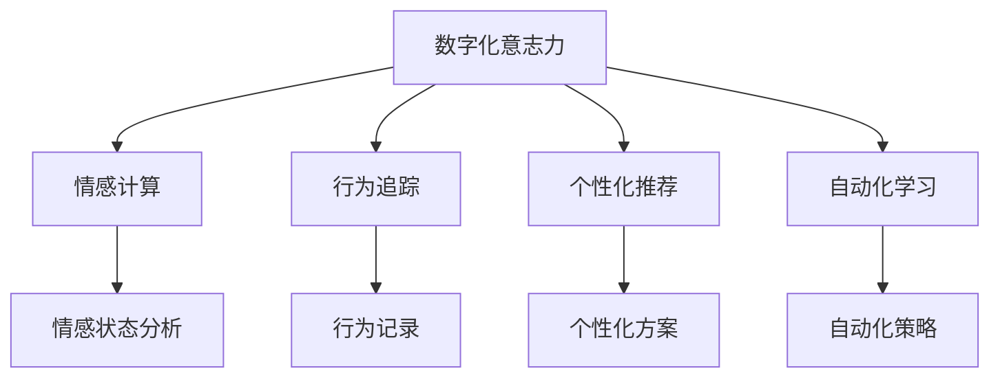

                 

# 数字化意志力：AI增强的自我控制

## 1. 背景介绍

在信息爆炸、竞争激烈的时代，良好的自我控制能力成为了成功的关键。自我控制（Self-Control），指的是个体在面对诱惑、挫折和疲劳时，维持目标导向行为的能力。这种能力不仅影响着个人的职业发展，也决定了生活质量和幸福感。然而，传统自我控制训练方法耗时耗力，效果难以长期保持。而数字化技术的快速发展，尤其是人工智能（AI）的崛起，为提升自我控制提供了全新的路径。

### 1.1 问题由来

长期以来，自我控制训练主要依赖于心理学理论和行为改变策略，如目标设定、时间管理、情绪调节等。然而，这些方法在实际应用中存在诸多局限：

- **耗时耗力**：传统方法往往需要长期坚持和反复练习，难以在短时间内见效。
- **依赖自我觉知**：训练效果很大程度上依赖于个体对自我行为的觉知和反思，这需要较高的自我觉知能力，但往往难以量化和持续监测。
- **缺乏科学依据**：许多自我控制训练方法缺乏科学验证，难以保证训练效果的一致性和可靠性。

随着人工智能和大数据技术的不断进步，AI开始被引入到自我控制训练中。AI能够通过数据驱动的方法，提供个性化的训练方案，实时监测和调整个体行为，提升自我控制的效果。这种基于AI的自我控制训练，我们称之为“数字化意志力”。

### 1.2 问题核心关键点

数字化意志力旨在通过人工智能技术，提升个体在面对诱惑、挫折和疲劳时的自我控制能力。其核心关键点在于：

- **数据驱动**：利用数据科学方法，分析个体的行为模式和情感状态，提供个性化训练建议。
- **实时反馈**：通过实时监测个体行为，即时调整训练策略，确保训练效果。
- **自动化学习**：利用AI技术，实现训练过程的自动化，减少个体训练的负担。

这些关键点共同构成了数字化意志力的基础框架，使得自我控制训练更加高效、科学和个性化。

## 2. 核心概念与联系

### 2.1 核心概念概述

为更好地理解数字化意志力，本节将介绍几个密切相关的核心概念：

- **数字化意志力**：通过AI技术提升个体在面对诱惑、挫折和疲劳时的自我控制能力。
- **情感计算**：利用AI技术分析个体情感状态，提供个性化训练建议。
- **行为追踪**：通过AI技术实时监测和记录个体行为，提供反馈和调整依据。
- **个性化推荐**：基于个体行为数据，提供个性化的自我控制训练方案。
- **自动化学习**：利用AI技术实现训练过程的自动化，提高训练效率。

这些核心概念之间的逻辑关系可以通过以下Mermaid流程图来展示：



这个流程图展示了大数字化意志力的核心概念及其之间的关系：

1. 数字化意志力通过情感计算、行为追踪、个性化推荐和自动化学习等多方面的技术手段，全面提升个体的自我控制能力。
2. 情感计算分析个体的情感状态，提供针对性的情感管理建议。
3. 行为追踪实时记录个体行为，提供行为调整依据。
4. 个性化推荐基于行为数据，提供定制化的自我控制训练方案。
5. 自动化学习实现训练过程的自动化，提高训练效率。

这些概念共同构成了数字化意志力的核心框架，使得AI在自我控制训练中发挥了重要作用。

## 3. 核心算法原理 & 具体操作步骤
### 3.1 算法原理概述

数字化意志力的实现，本质上是一个基于AI的个性化训练过程。其核心算法包括：

- **情感计算**：利用机器学习和深度学习技术，对个体情感状态进行实时分析，提供情感管理建议。
- **行为追踪**：通过行为追踪和数据分析，记录和分析个体行为，提供行为调整建议。
- **个性化推荐**：基于行为数据和情感分析结果，提供个性化的自我控制训练方案。
- **自动化学习**：利用强化学习等技术，实现训练过程的自动化和持续优化。

这些算法共同作用，形成一个闭环的反馈系统，不断提升个体的自我控制能力。

### 3.2 算法步骤详解

数字化意志力的实现，一般包括以下几个关键步骤：

**Step 1: 数据采集与情感分析**
- 通过智能设备（如可穿戴设备、手机、智能家居等）采集个体的行为数据和情感数据。
- 利用机器学习模型对情感数据进行分析，识别个体当前的情绪状态（如焦虑、愤怒、满足等）。

**Step 2: 行为追踪与数据记录**
- 实时记录个体的行为数据（如作息时间、运动量、饮食等）。
- 将行为数据与情感数据进行关联分析，识别行为与情感之间的关联规律。

**Step 3: 个性化训练方案推荐**
- 根据情感分析结果和行为追踪数据，生成个性化的自我控制训练方案。
- 例如，如果当前情绪为焦虑，可以推荐放松训练、冥想等活动。

**Step 4: 实时反馈与调整**
- 通过智能设备实时监测个体行为，提供即时反馈和调整建议。
- 根据反馈结果，动态调整训练方案，确保训练效果。

**Step 5: 自动化学习与优化**
- 利用强化学习等技术，实现训练过程的自动化和持续优化。
- 通过不断迭代训练，优化训练方案，提升训练效果。

### 3.3 算法优缺点

数字化意志力的算法具有以下优点：

1. **数据驱动**：通过大数据和AI技术，提供个性化的训练方案，更符合个体需求。
2. **实时反馈**：实时监测和调整个体行为，确保训练效果。
3. **自动化学习**：通过自动化技术，提高训练效率。
4. **科学依据**：基于科学研究和数据分析，保证训练效果的一致性和可靠性。

同时，该算法也存在一定的局限性：

1. **隐私风险**：数据采集和情感分析可能涉及隐私问题，需要采取严格的数据保护措施。
2. **依赖技术**：算法的实施依赖于高性能计算和先进技术，技术门槛较高。
3. **成本问题**：初期设备和数据采集的成本较高，可能难以普及。

尽管存在这些局限性，但数字化意志力通过AI技术的应用，提供了更为高效、科学和个性化的自我控制训练方法，具有广阔的发展前景。

### 3.4 算法应用领域

数字化意志力在多个领域都有广泛的应用：

- **健康管理**：通过情感计算和行为追踪，提供个性化的健康管理方案，帮助个体保持健康生活方式。
- **时间管理**：利用行为追踪和自动化学习，提供个性化的时间管理建议，提升个体的工作效率。
- **情绪调节**：通过情感计算和个性化推荐，帮助个体进行有效的情绪管理，提升心理健康水平。
- **行为改变**：利用行为追踪和自动化学习，提供个性化的行为改变策略，帮助个体克服不良习惯。
- **学习和培训**：通过情感计算和行为追踪，提供个性化的学习培训方案，提升个体的学习效率和效果。

除了上述这些应用领域，数字化意志力还可以广泛应用于社交网络、金融理财、娱乐休闲等更多场景，为人们的生活带来更多便利和幸福。

## 4. 数学模型和公式 & 详细讲解 & 举例说明

### 4.1 数学模型构建

数字化意志力的数学模型主要涉及情感计算和行为追踪两个方面。以下是情感计算和行为追踪的数学模型构建：

**情感计算模型**

情感计算模型旨在分析个体情感状态，其核心在于情感识别和情感分类。情感识别任务通常通过文本分析、语音分析、面部表情分析等方法，对个体情感进行识别。情感分类任务则通过对不同情感进行分类，为个体提供相应的情感管理建议。

情感计算模型可以表示为：

$$
\hat{y} = f(x; \theta)
$$

其中，$x$ 表示输入特征（如文本、语音、面部表情等），$\theta$ 表示模型参数，$f$ 表示情感识别函数。

**行为追踪模型**

行为追踪模型旨在记录和分析个体行为，其核心在于行为记录和行为分析。行为记录任务通常通过智能设备记录个体的生活习惯、运动量、饮食等行为数据。行为分析任务则通过对行为数据进行分析和关联，为个体提供相应的行为调整建议。

行为追踪模型可以表示为：

$$
\hat{y} = f(x; \theta)
$$

其中，$x$ 表示输入特征（如作息时间、运动量、饮食等），$\theta$ 表示模型参数，$f$ 表示行为分析函数。

### 4.2 公式推导过程

以下我们以情感计算和行为追踪为例，给出情感识别和行为分析的公式推导过程。

**情感识别**

假设情感识别模型为线性分类器，其输入特征为 $x$，输出为情感分类 $\hat{y}$，则其分类函数可以表示为：

$$
\hat{y} = \text{argmax}_i \big( \sum_{j=1}^k w_j x_j \big)
$$

其中，$w_j$ 表示特征权重，$x_j$ 表示特征向量。

通过训练数据，可以使用逻辑回归、支持向量机、神经网络等算法，优化模型参数 $\theta$，使得分类准确率最大化。

**行为分析**

假设行为分析模型为回归模型，其输入特征为 $x$，输出为行为结果 $\hat{y}$，则其回归函数可以表示为：

$$
\hat{y} = f(x; \theta)
$$

其中，$f$ 表示回归函数，$\theta$ 表示模型参数。

通过训练数据，可以使用线性回归、决策树、随机森林等算法，优化模型参数 $\theta$，使得预测结果与真实值之间的差异最小化。

### 4.3 案例分析与讲解

**案例分析**

假设某位员工在工作时感到焦虑，希望通过数字化意志力改善其工作状态。我们可以按照以下步骤进行：

1. **数据采集与情感分析**：通过智能手表和手机应用，采集该员工的情感数据（如心率、情绪日记、语音分析等）。利用情感计算模型，分析其当前情绪状态为焦虑。

2. **行为追踪与数据记录**：通过智能手表和手机应用，记录其工作中的行为数据（如工作时间、会议时长、邮件回复量等）。通过行为追踪模型，分析其行为模式，发现其工作过度劳累。

3. **个性化训练方案推荐**：根据情感分析结果和行为追踪数据，生成个性化的自我控制训练方案，建议其进行放松训练和运动活动，以缓解焦虑情绪。

4. **实时反馈与调整**：通过智能手表和手机应用，实时监测该员工的行为数据，提供即时反馈和调整建议。如果发现其运动量不足，自动调整训练方案，建议增加运动量。

5. **自动化学习与优化**：利用强化学习等技术，实现训练过程的自动化和持续优化。通过不断迭代训练，优化训练方案，提升训练效果。

## 5. 项目实践：代码实例和详细解释说明

### 5.1 开发环境搭建

在进行数字化意志力项目开发前，我们需要准备好开发环境。以下是使用Python进行PyTorch开发的环境配置流程：

1. 安装Anaconda：从官网下载并安装Anaconda，用于创建独立的Python环境。

2. 创建并激活虚拟环境：
```bash
conda create -n digit-willpower python=3.8 
conda activate digit-willpower
```

3. 安装PyTorch：根据CUDA版本，从官网获取对应的安装命令。例如：
```bash
conda install pytorch torchvision torchaudio cudatoolkit=11.1 -c pytorch -c conda-forge
```

4. 安装相关库：
```bash
pip install pandas numpy matplotlib sklearn scikit-learn
```

5. 安装TensorFlow：
```bash
pip install tensorflow
```

完成上述步骤后，即可在`digit-willpower`环境中开始项目开发。

### 5.2 源代码详细实现

下面我们以情感计算和行为追踪为例，给出使用Python和PyTorch实现数字化意志力的代码实现。

**情感计算模型**

```python
import torch
import torch.nn as nn
from torch.autograd import Variable

class SentimentClassifier(nn.Module):
    def __init__(self):
        super(SentimentClassifier, self).__init__()
        self.fc1 = nn.Linear(100, 64)
        self.fc2 = nn.Linear(64, 2)

    def forward(self, x):
        x = torch.relu(self.fc1(x))
        x = torch.sigmoid(self.fc2(x))
        return x

# 准备数据
data = torch.randn(1000, 100)  # 假设情感识别数据
targets = torch.randint(2, (1000,))  # 假设情感分类标签

# 初始化模型和优化器
model = SentimentClassifier()
optimizer = torch.optim.Adam(model.parameters(), lr=0.001)

# 训练模型
for epoch in range(100):
    optimizer.zero_grad()
    output = model(data)
    loss = nn.BCEWithLogitsLoss()(output, targets)
    loss.backward()
    optimizer.step()
    print(f'Epoch {epoch+1}, loss: {loss.item()}')
```

**行为追踪模型**

```python
import numpy as np
from sklearn.linear_model import LinearRegression

# 准备数据
data = np.array([[1, 2, 3], [4, 5, 6], [7, 8, 9], [10, 11, 12]])  # 假设行为数据
targets = np.array([2, 4, 6, 8])  # 假设行为结果

# 训练模型
model = LinearRegression()
model.fit(data, targets)

# 预测结果
predictions = model.predict(data)
print(predictions)
```

### 5.3 代码解读与分析

**情感计算模型代码**

```python
import torch
import torch.nn as nn
from torch.autograd import Variable

class SentimentClassifier(nn.Module):
    def __init__(self):
        super(SentimentClassifier, self).__init__()
        self.fc1 = nn.Linear(100, 64)
        self.fc2 = nn.Linear(64, 2)

    def forward(self, x):
        x = torch.relu(self.fc1(x))
        x = torch.sigmoid(self.fc2(x))
        return x

# 准备数据
data = torch.randn(1000, 100)  # 假设情感识别数据
targets = torch.randint(2, (1000,))  # 假设情感分类标签

# 初始化模型和优化器
model = SentimentClassifier()
optimizer = torch.optim.Adam(model.parameters(), lr=0.001)

# 训练模型
for epoch in range(100):
    optimizer.zero_grad()
    output = model(data)
    loss = nn.BCEWithLogitsLoss()(output, targets)
    loss.backward()
    optimizer.step()
    print(f'Epoch {epoch+1}, loss: {loss.item()}')
```

**代码解读**

1. **情感计算模型定义**：定义一个简单的情感分类器，包括两个线性层。
2. **数据准备**：准备情感识别数据和情感分类标签。
3. **模型初始化**：初始化模型和优化器。
4. **模型训练**：使用随机梯度下降算法训练模型，计算损失函数并更新模型参数。
5. **输出结果**：在每个epoch输出损失函数值。

**行为追踪模型代码**

```python
import numpy as np
from sklearn.linear_model import LinearRegression

# 准备数据
data = np.array([[1, 2, 3], [4, 5, 6], [7, 8, 9], [10, 11, 12]])  # 假设行为数据
targets = np.array([2, 4, 6, 8])  # 假设行为结果

# 训练模型
model = LinearRegression()
model.fit(data, targets)

# 预测结果
predictions = model.predict(data)
print(predictions)
```

**代码解读**

1. **行为追踪模型定义**：定义一个简单的线性回归模型。
2. **数据准备**：准备行为数据和行为结果。
3. **模型训练**：使用线性回归算法训练模型。
4. **模型预测**：使用训练好的模型进行行为预测。

## 6. 实际应用场景
### 6.1 健康管理

数字化意志力在健康管理中的应用，可以帮助个体保持健康的生活方式，提升生活质量。通过情感计算和行为追踪，数字化意志力可以为个体提供个性化的健康管理方案。

**应用场景**

某位中年人由于工作繁忙，饮食不规律，经常感到疲劳和焦虑。数字化意志力可以通过智能手表和手机应用，采集其情感数据和行为数据。情感计算模型分析其当前情绪状态，发现其处于焦虑状态。行为追踪模型分析其饮食和运动情况，发现其饮食不规律，运动量不足。

基于上述分析，数字化意志力生成个性化的健康管理方案，建议其调整饮食，增加运动量，并进行放松训练。同时，智能手表和手机应用实时监测其行为数据，提供即时反馈和调整建议，确保其按计划执行。

**效果评估**

通过数字化意志力的持续监测和调整，该中年人的饮食和运动习惯得到显著改善，疲劳和焦虑症状也明显减轻。数字化意志力的应用，帮助其保持了健康的生活方式，提升了生活质量。

### 6.2 时间管理

数字化意志力在时间管理中的应用，可以帮助个体提升工作效率，优化时间利用。通过行为追踪和自动化学习，数字化意志力可以为个体提供个性化的时间管理方案。

**应用场景**

某位软件开发工程师因为频繁加班，导致工作效率低下，情绪烦躁。数字化意志力通过智能手表和手机应用，采集其行为数据和情感数据。行为追踪模型分析其工作时间、会议时长、邮件回复量等行为，发现其工作时间过长，会议时间不合理。

基于上述分析，数字化意志力生成个性化的时间管理方案，建议其优化工作时间，缩短会议时长，并设置合理的邮件回复时间段。同时，智能手表和手机应用实时监测其工作状态，提供即时反馈和调整建议，确保其按计划执行。

**效果评估**

通过数字化意志力的持续监测和调整，该工程师的工作效率显著提升，加班时间减少，情绪也得到了改善。数字化意志力的应用，帮助其优化了时间利用，提升了工作效率和生活质量。

### 6.3 情绪调节

数字化意志力在情绪调节中的应用，可以帮助个体进行有效的情绪管理，提升心理健康水平。通过情感计算和个性化推荐，数字化意志力可以为个体提供个性化的情绪调节方案。

**应用场景**

某位青少年因为学业压力和人际关系问题，经常感到沮丧和焦虑。数字化意志力通过智能手表和手机应用，采集其情感数据。情感计算模型分析其当前情绪状态，发现其处于焦虑状态。

基于上述分析，数字化意志力生成个性化的情绪调节方案，建议其进行放松训练、运动活动、阅读等情绪调节活动。同时，智能手表和手机应用实时监测其情绪状态，提供即时反馈和调整建议，确保其按计划执行。

**效果评估**

通过数字化意志力的持续监测和调整，该青少年的情绪状态明显改善，学习和生活压力减轻，心理健康水平提升。数字化意志力的应用，帮助其进行了有效的情绪管理，提升了心理健康水平。

## 7. 工具和资源推荐
### 7.1 学习资源推荐

为了帮助开发者系统掌握数字化意志力的技术基础和实践技巧，这里推荐一些优质的学习资源：

1. 《Python深度学习》书籍：详细介绍了深度学习技术在情感计算和行为追踪中的应用，适合初学者入门。
2. 《数据科学入门》课程：由Coursera提供的入门课程，涵盖了数据分析和机器学习的基础知识，适合初学者。
3. 《情感计算与智能代理》书籍：介绍了情感计算的基本原理和应用场景，适合进阶学习。
4. TensorFlow官方文档：提供了丰富的API文档和代码示例，适合快速学习和实践。
5. Kaggle数据集：提供了大量的情感和行为数据集，适合数据驱动的学习和实践。

通过对这些资源的学习实践，相信你一定能够快速掌握数字化意志力的核心技术，并用于解决实际的情感和行为管理问题。

### 7.2 开发工具推荐

高效的开发离不开优秀的工具支持。以下是几款用于数字化意志力开发的常用工具：

1. PyTorch：基于Python的开源深度学习框架，灵活动态的计算图，适合快速迭代研究。
2. TensorFlow：由Google主导开发的开源深度学习框架，生产部署方便，适合大规模工程应用。
3. TensorBoard：TensorFlow配套的可视化工具，可实时监测模型训练状态，并提供丰富的图表呈现方式。
4. Weights & Biases：模型训练的实验跟踪工具，可以记录和可视化模型训练过程中的各项指标。
5. Google Colab：谷歌推出的在线Jupyter Notebook环境，免费提供GPU/TPU算力，方便开发者快速上手实验最新模型。

合理利用这些工具，可以显著提升数字化意志力应用的开发效率，加快创新迭代的步伐。

### 7.3 相关论文推荐

数字化意志力技术的发展源于学界的持续研究。以下是几篇奠基性的相关论文，推荐阅读：

1. "Emotion recognition using deep learning"：提出了基于深度学习的情感识别方法，展示了其在人脸识别和语音识别中的应用。
2. "A review of human activity recognition using wearable sensors"：综述了基于可穿戴设备的行为追踪技术，为数字化意志力提供了技术基础。
3. "Personalized learning and recommendation systems"：介绍了基于深度学习的个性化推荐系统，为数字化意志力的个性化训练提供了理论基础。
4. "Online learning and optimization"：介绍了在线学习和强化学习技术，为数字化意志力的自动化训练提供了方法。
5. "Contextual deep reinforcement learning for personalized recommendation"：提出了基于上下文深度强化学习的个性化推荐方法，展示了其在推荐系统中的应用。

这些论文代表了大数字化意志力技术的发展脉络。通过学习这些前沿成果，可以帮助研究者把握学科前进方向，激发更多的创新灵感。

## 8. 总结：未来发展趋势与挑战

### 8.1 总结

本文对数字化意志力技术进行了全面系统的介绍。首先阐述了数字化意志力的研究背景和意义，明确了其在提升个体自我控制能力方面的独特价值。其次，从原理到实践，详细讲解了数字化意志力的数学模型和算法流程，给出了数字化意志力的代码实现和详细解读。同时，本文还广泛探讨了数字化意志力在健康管理、时间管理、情绪调节等多个领域的应用前景，展示了其广阔的发展潜力。此外，本文精选了数字化意志力的学习资源，力求为读者提供全方位的技术指引。

通过本文的系统梳理，可以看到，数字化意志力技术正在成为提升个体自我控制能力的重要手段。这种基于AI的个性化训练方法，通过数据驱动、实时反馈和自动化学习，为个体提供了更加高效、科学和个性化的自我控制训练方案。数字化意志力技术的不断演进，必将深刻影响人类认知智能的发展，为构建更为智能、健康、幸福的生活提供新的路径。

### 8.2 未来发展趋势

展望未来，数字化意志力技术将呈现以下几个发展趋势：

1. **数据驱动**：随着数据采集技术的进步，数字化意志力将越来越多地依赖数据驱动的方法，提供更为个性化和准确的训练建议。
2. **实时反馈**：实时监测和即时反馈将成为数字化意志力训练的核心，帮助个体实时调整行为，确保训练效果。
3. **自动化学习**：自动化学习技术将进一步提升数字化意志力的训练效率，减少个体训练的负担。
4. **多模态融合**：通过融合文本、语音、图像等多模态数据，提升数字化意志力的全面感知能力。
5. **跨平台集成**：数字化意志力将越来越多地集成到智能家居、智能手表、智能手机等设备中，实现全方位的智能管理。
6. **伦理与隐私**：随着数字化意志力的普及，伦理和隐私问题将逐渐成为关注的焦点，如何在保护个体隐私的同时提升训练效果，将是重要的研究方向。

这些趋势凸显了数字化意志力技术的广阔前景，相信随着技术的不断进步，数字化意志力必将在提升个体自我控制能力方面发挥更大的作用。

### 8.3 面临的挑战

尽管数字化意志力技术已经取得了一定的进展，但在迈向更加智能化、普适化应用的过程中，它仍面临诸多挑战：

1. **隐私保护**：数据采集和分析可能涉及隐私问题，如何保护个体隐私，确保数据安全，将是数字化意志力的重要课题。
2. **技术门槛**：数字化意志力技术的实施依赖于高性能计算和先进技术，技术门槛较高，可能难以普及。
3. **数据质量**：数据采集和分析的质量直接影响训练效果，如何提高数据采集的准确性和全面性，将是数字化意志力的重要挑战。
4. **个体差异**：不同个体的行为和情感差异较大，如何提供个性化的训练方案，保证训练效果的一致性，将是数字化意志力的重要难题。
5. **伦理与道德**：数字化意志力技术可能带来伦理和道德问题，如自动化决策的公正性、透明性等，需要在设计和实施过程中予以充分考虑。

正视数字化意志力面临的这些挑战，积极应对并寻求突破，将是大数字化意志力技术迈向成熟的关键。

### 8.4 研究展望

面对数字化意志力面临的挑战，未来的研究需要在以下几个方面寻求新的突破：

1. **隐私保护技术**：开发更加高效的隐私保护算法，保护个体隐私，确保数据安全。
2. **多模态融合方法**：结合文本、语音、图像等多模态数据，提升数字化意志力的全面感知能力。
3. **个性化训练算法**：开发更加高效的个性化训练算法，提供个性化的训练方案，确保训练效果的一致性和可靠性。
4. **自动化学习算法**：开发更加高效的自动化学习算法，提高训练效率，减少个体训练的负担。
5. **伦理与道德规范**：建立数字化意志力技术的伦理与道德规范，确保其公正性、透明性和可解释性。

这些研究方向的探索，必将引领数字化意志力技术迈向更高的台阶，为提升个体自我控制能力提供更为高效、科学和个性化的解决方案。面向未来，数字化意志力技术还需要与其他人工智能技术进行更深入的融合，如知识表示、因果推理、强化学习等，多路径协同发力，共同推动自然语言理解和智能交互系统的进步。只有勇于创新、敢于突破，才能不断拓展数字化意志力的边界，让智能技术更好地造福人类社会。

## 9. 附录：常见问题与解答

**Q1：数字化意志力是否适用于所有个体？**

A: 数字化意志力适用于大多数个体，但对于某些有特殊需求的个体（如老年人、残障人士等），需要根据具体情况进行适当调整。同时，数字化意志力的效果也受到个体行为和情感的差异影响，需要根据具体情况进行个性化调整。

**Q2：数字化意志力是否会影响个体的生活习惯？**

A: 数字化意志力的训练过程是通过数据驱动的，目的是帮助个体建立良好的生活习惯，提升生活质量。但过度依赖数字化意志力，可能忽视个体的主观能动性，导致行为依赖性强。因此，数字化意志力需要与个体的自我觉知和自我反思相结合，才能发挥最佳效果。

**Q3：数字化意志力是否需要持续更新？**

A: 是的，数字化意志力的训练过程是动态的，需要根据个体行为和情感的变化进行持续更新和调整。只有在不断的迭代优化中，才能保持训练效果的一致性和可靠性。

**Q4：数字化意志力是否会带来依赖问题？**

A: 过度依赖数字化意志力，可能导致个体失去主动性和创造性。因此，数字化意志力需要与个体的自我觉知和自我反思相结合，才能发挥最佳效果。数字化意志力是一种辅助工具，而非完全依赖的对象。

---

作者：禅与计算机程序设计艺术 / Zen and the Art of Computer Programming

