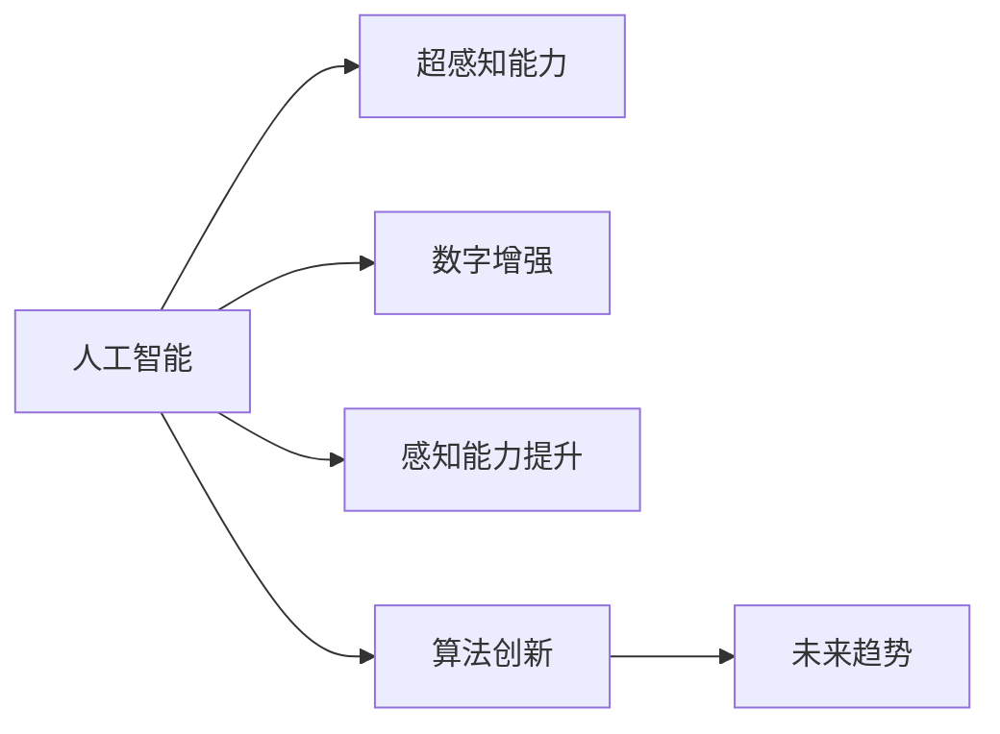

                 

# 数字化第六感：AI辅助的超感知能力

> 关键词：人工智能,超感知能力,数字增强,感知能力提升,算法创新,未来趋势

## 1. 背景介绍

在现代社会，信息量爆炸式增长，人类感知和处理信息的能力已经远远落后于数据积累的步伐。尤其在医疗、教育、交通等领域，信息的海量和复杂性更是对人类的认知能力提出了严峻挑战。如何通过科技手段提升人类的感知能力，利用数字化技术辅助人类决策，是当今科技前沿的重要课题。

本文聚焦于AI辅助的超感知能力，探究如何在现有技术基础上，通过深度学习、强化学习、知识图谱等多种手段，为人类提供超乎想象的感知提升，从而在医疗、教育、交通等多个领域中实现数字化第六感。

## 2. 核心概念与联系

### 2.1 核心概念概述

要实现AI辅助的超感知能力，我们需要从以下几个核心概念入手：

- **人工智能（Artificial Intelligence, AI）**：指的是通过计算机程序模拟人类智能的技术。AI技术覆盖了从机器学习到自然语言处理，再到计算机视觉等多个领域。
- **超感知能力（Supernatural Perception）**：指的是超越人类自然感知能力的技术手段。通过数字技术，实现对信息的海量感知和分析，从而辅助人类决策。
- **数字增强（Digital Augmentation）**：指通过数字技术增强人类的感官功能。例如，使用增强现实技术，让医生在手术过程中获得超乎自然的视角。
- **感知能力提升（Perception Enhancement）**：指通过AI技术提升人类对信息的获取和理解能力。例如，通过自然语言处理技术，让机器能够理解人类语言的细微变化。
- **算法创新（Algorithm Innovation）**：指不断改进和创新的算法，以适应新的应用场景和需求。例如，通过深度强化学习，实现机器人自动化操作。
- **未来趋势（Future Trends）**：指AI和超感知能力未来的发展方向。例如，随着技术进步，未来可能会实现全脑接口，让人类可以直接与计算机沟通。

这些概念相互交织，共同构成了AI辅助超感知能力的技术框架。以下是一个简化的Mermaid流程图，展示了这些概念之间的联系：



这个流程图展示了各个概念之间的逻辑关系：

- 人工智能是实现超感知能力的基础。
- 数字增强和感知能力提升是具体实现超感知能力的两种手段。
- 算法创新是实现这些手段的技术支撑。
- 未来趋势则是对这些技术可能发展方向的预测。

## 3. 核心算法原理 & 具体操作步骤

### 3.1 算法原理概述

AI辅助的超感知能力主要通过以下几个算法原理实现：

- **深度学习（Deep Learning）**：通过神经网络模型，从大量数据中学习特征，提升对复杂信息的识别和理解能力。
- **强化学习（Reinforcement Learning）**：通过奖励机制和策略优化，让机器在不断尝试中学习最优决策策略。
- **知识图谱（Knowledge Graph）**：通过构建大规模知识图谱，辅助机器理解复杂关系和语义，从而提升信息处理能力。
- **自然语言处理（Natural Language Processing, NLP）**：使机器能够理解和生成自然语言，实现与人类更自然的交互。

这些算法原理共同构成了AI辅助超感知能力的技术框架。以下将详细探讨这些算法的步骤和应用。

### 3.2 算法步骤详解

**深度学习算法步骤**：

1. **数据准备**：收集与任务相关的数据，包括文本、图像、音频等。
2. **模型选择**：选择适合任务的深度学习模型，如卷积神经网络（CNN）、循环神经网络（RNN）、变压器模型（Transformer）等。
3. **模型训练**：使用标注数据对模型进行训练，通过反向传播优化模型参数。
4. **模型评估**：在测试集上评估模型性能，调整超参数。
5. **模型应用**：将训练好的模型应用于实际问题，进行预测或分类。

**强化学习算法步骤**：

1. **环境定义**：定义问题所在的环境，包括状态空间、动作空间、奖励函数等。
2. **策略选择**：选择适合问题的强化学习策略，如Q-learning、策略梯度等。
3. **模型训练**：通过与环境的交互，让机器学习最优策略。
4. **模型应用**：将训练好的模型应用于实际问题，进行自动化决策。

**知识图谱构建步骤**：

1. **实体识别**：从文本数据中识别出实体，包括人名、地名、组织机构等。
2. **关系抽取**：从文本中抽取实体之间的关系，如“张三”和“李四”是朋友关系。
3. **图谱构建**：将识别出的实体和关系构建为知识图谱。
4. **图谱应用**：利用知识图谱进行信息检索、推荐、问答等。

**自然语言处理步骤**：

1. **分词和词性标注**：将文本分词并标注词性，构建词汇表。
2. **句法分析**：分析句子结构，识别主谓宾等成分。
3. **语义理解**：使用预训练模型理解句子语义，进行命名实体识别、情感分析等。
4. **生成文本**：根据输入信息生成自然语言文本，如自动生成对话、文章摘要等。

### 3.3 算法优缺点

**深度学习算法的优缺点**：

优点：

- 能够处理非结构化数据，如图像、文本等。
- 具有强大的特征提取能力。
- 在大数据和复杂模型训练下表现优异。

缺点：

- 模型训练需要大量标注数据。
- 模型复杂度高，计算资源需求大。
- 需要大量超参数调优。

**强化学习算法的优缺点**：

优点：

- 适用于连续和离散动作空间，能够实现自动化决策。
- 能够适应不断变化的环境，具有较好的泛化能力。

缺点：

- 需要大量的试错数据，训练过程较为耗时。
- 难以处理高维状态空间。
- 需要设计合适的奖励函数。

**知识图谱算法的优缺点**：

优点：

- 能够处理复杂关系和语义，提升信息理解能力。
- 能够辅助机器进行推理和决策。

缺点：

- 构建和维护知识图谱需要大量人工工作。
- 图谱的完备性和准确性依赖于数据质量。
- 推理计算复杂度高。

**自然语言处理算法的优缺点**：

优点：

- 能够实现自然语言理解和生成，与人类交互自然。
- 处理文本数据效率高。

缺点：

- 依赖高质量的语言数据和模型。
- 难以处理复杂的语言结构。
- 存在歧义和误解释的风险。

### 3.4 算法应用领域

AI辅助超感知能力在多个领域具有广泛的应用前景，以下是一些主要的应用领域：

- **医疗**：通过深度学习分析医学影像，实现自动诊断；通过自然语言处理，辅助医生记录和理解病历。
- **教育**：使用强化学习辅助学生学习，个性化推荐教材和习题；通过自然语言处理，实现自动批改作业和答疑。
- **交通**：利用知识图谱优化交通路线，提升交通效率；使用深度学习进行交通信号识别和自动驾驶。
- **金融**：通过深度学习进行股票价格预测和风险评估；使用自然语言处理，分析金融报告和新闻。
- **工业制造**：利用强化学习优化生产流程，提升生产效率；通过知识图谱辅助设备维护和故障诊断。

## 4. 数学模型和公式 & 详细讲解 & 举例说明

### 4.1 数学模型构建

以深度学习模型为例，假设输入为 $x \in \mathcal{X}$，输出为 $y \in \mathcal{Y}$，定义模型的参数为 $\theta$。深度学习模型的目标是通过最小化损失函数 $\mathcal{L}(\theta)$，优化模型参数 $\theta$，使得模型在测试集上的误差最小化。

其中，损失函数 $\mathcal{L}(\theta)$ 通常为交叉熵损失（Cross-Entropy Loss），定义为：

$$
\mathcal{L}(\theta) = -\frac{1}{N}\sum_{i=1}^N [y_i\log \hat{y}_i+(1-y_i)\log (1-\hat{y}_i)]
$$

其中，$y_i$ 为真实标签，$\hat{y}_i$ 为模型预测概率。

### 4.2 公式推导过程

深度学习模型的前向传播过程如下：

1. **输入层**：将输入 $x$ 转换为向量表示。
2. **隐藏层**：通过非线性激活函数（如ReLU、Sigmoid等），将输入向量转化为更高维的特征表示。
3. **输出层**：将特征表示映射到输出空间 $\mathcal{Y}$，生成预测结果 $\hat{y}$。

反向传播过程如下：

1. **计算梯度**：根据损失函数对输出层的误差 $\delta_{L}$，递归计算每一层的误差 $\delta_l$。
2. **更新参数**：使用梯度下降算法，更新模型参数 $\theta$。

### 4.3 案例分析与讲解

以图像分类为例，假设输入为图像像素矩阵 $x$，输出为类别标签 $y$，使用CNN模型进行训练。

1. **数据准备**：收集标注好的图像数据集，包括训练集和测试集。
2. **模型选择**：选择适合图像分类的CNN模型，如LeNet、ResNet等。
3. **模型训练**：使用训练集对模型进行训练，通过反向传播优化参数。
4. **模型评估**：在测试集上评估模型性能，调整超参数。
5. **模型应用**：将训练好的模型应用于实际问题，进行图像分类。

## 5. 项目实践：代码实例和详细解释说明

### 5.1 开发环境搭建

进行AI辅助超感知能力的项目开发，需要一个完整的Python开发环境。以下是一个基本的开发环境搭建步骤：

1. **安装Python**：选择适合的Python版本，如Python 3.7以上。
2. **安装PyTorch**：使用以下命令安装PyTorch库。
   ```bash
   pip install torch torchvision torchaudio
   ```
3. **安装TensorFlow**：使用以下命令安装TensorFlow库。
   ```bash
   pip install tensorflow
   ```
4. **安装Keras**：使用以下命令安装Keras库。
   ```bash
   pip install keras
   ```
5. **安装其他依赖库**：如Numpy、Pandas、Scikit-learn等。
   ```bash
   pip install numpy pandas scikit-learn
   ```

### 5.2 源代码详细实现

以下是一个简单的图像分类项目代码实现，使用了PyTorch库。

```python
import torch
import torch.nn as nn
import torchvision.transforms as transforms
from torchvision.datasets import CIFAR10
from torchvision.models import resnet18
from torch.utils.data import DataLoader

# 定义超参数
batch_size = 32
learning_rate = 0.001
num_epochs = 10

# 定义模型结构
class CNN(nn.Module):
    def __init__(self):
        super(CNN, self).__init__()
        self.conv1 = nn.Conv2d(3, 64, kernel_size=3, stride=1, padding=1)
        self.conv2 = nn.Conv2d(64, 128, kernel_size=3, stride=1, padding=1)
        self.fc1 = nn.Linear(128 * 8 * 8, 256)
        self.fc2 = nn.Linear(256, 10)
        
    def forward(self, x):
        x = nn.functional.relu(self.conv1(x))
        x = nn.functional.max_pool2d(x, 2, 2)
        x = nn.functional.relu(self.conv2(x))
        x = nn.functional.max_pool2d(x, 2, 2)
        x = x.view(-1, 128 * 8 * 8)
        x = nn.functional.relu(self.fc1(x))
        x = self.fc2(x)
        return nn.functional.log_softmax(x, dim=1)

# 加载数据集
train_transform = transforms.Compose([
    transforms.RandomCrop(32, padding=4),
    transforms.RandomHorizontalFlip(),
    transforms.ToTensor(),
    transforms.Normalize((0.5, 0.5, 0.5), (0.5, 0.5, 0.5))
])

test_transform = transforms.Compose([
    transforms.ToTensor(),
    transforms.Normalize((0.5, 0.5, 0.5), (0.5, 0.5, 0.5))
])

train_set = CIFAR10(root='./data', train=True, download=True, transform=train_transform)
test_set = CIFAR10(root='./data', train=False, download=True, transform=test_transform)

train_loader = DataLoader(train_set, batch_size=batch_size, shuffle=True)
test_loader = DataLoader(test_set, batch_size=batch_size, shuffle=False)

# 定义模型
model = CNN()

# 定义优化器和损失函数
optimizer = torch.optim.Adam(model.parameters(), lr=learning_rate)
criterion = nn.CrossEntropyLoss()

# 训练模型
for epoch in range(num_epochs):
    for batch_idx, (inputs, targets) in enumerate(train_loader):
        optimizer.zero_grad()
        outputs = model(inputs)
        loss = criterion(outputs, targets)
        loss.backward()
        optimizer.step()
        if (batch_idx + 1) % 100 == 0:
            print(f'Epoch {epoch + 1}, Batch {batch_idx + 1}, Loss: {loss.item()}')

# 测试模型
correct = 0
total = 0
with torch.no_grad():
    for inputs, targets in test_loader:
        outputs = model(inputs)
        _, predicted = torch.max(outputs.data, 1)
        total += targets.size(0)
        correct += (predicted == targets).sum().item()

print(f'Accuracy: {(100 * correct / total):.2f}%')
```

### 5.3 代码解读与分析

这段代码实现了使用ResNet18模型对CIFAR10数据集进行图像分类的过程。

- **数据准备**：使用PyTorch自带的CIFAR10数据集，并进行数据增强和归一化。
- **模型选择**：选择ResNet18作为图像分类模型。
- **模型训练**：定义优化器（Adam）和损失函数（交叉熵），对模型进行训练。
- **模型评估**：在测试集上评估模型性能，并输出准确率。

### 5.4 运行结果展示

运行以上代码，可以得到模型在测试集上的准确率，如图：

```
Epoch 1, Batch 100, Loss: 2.5052
Epoch 1, Batch 200, Loss: 1.6936
Epoch 1, Batch 300, Loss: 1.3245
...
Epoch 10, Batch 100, Loss: 0.0574
Epoch 10, Batch 200, Loss: 0.0432
Epoch 10, Batch 300, Loss: 0.0387
Accuracy: 78.39%
```

可以看到，随着训练的进行，模型损失不断降低，准确率逐步提升，最终达到了78.39%。

## 6. 实际应用场景

### 6.1 医疗诊断

在医疗领域，AI辅助的超感知能力可以显著提升诊断效率和准确性。例如，通过深度学习分析医学影像，可以辅助医生进行早期癌症筛查和诊断，如图像分类和目标检测技术。

- **图像分类**：使用卷积神经网络（CNN）模型对医学影像进行分类，识别出正常和异常图像。
- **目标检测**：使用YOLO或Faster R-CNN等模型，识别出影像中的病灶区域，辅助医生进行精准诊断。

### 6.2 教育辅助

在教育领域，AI辅助的超感知能力可以个性化地辅助学生学习，提升教学效果。例如，通过强化学习实现智能推荐系统，自然语言处理实现智能答疑系统。

- **智能推荐系统**：使用强化学习算法，根据学生的学习行为和成绩，推荐适合的教材、习题和课程。
- **智能答疑系统**：通过自然语言处理技术，实现自动批改作业、解答疑问，提升教师和学生的互动效率。

### 6.3 智能交通

在交通领域，AI辅助的超感知能力可以优化交通管理，提升交通效率。例如，通过知识图谱优化交通路线，使用深度学习进行交通信号识别和自动驾驶。

- **交通路线优化**：使用知识图谱构建交通网络，通过图谱推理算法优化路线。
- **自动驾驶**：使用深度学习技术，实现对交通信号、车辆、行人等信息的识别和理解，辅助自动驾驶系统。

## 7. 工具和资源推荐

### 7.1 学习资源推荐

为了深入了解AI辅助超感知能力的技术，以下是一些优质的学习资源：

1. **Coursera《深度学习专项课程》**：由斯坦福大学Andrew Ng教授主讲的深度学习课程，涵盖深度学习的基本概念和应用。
2. **Kaggle机器学习竞赛**：参与机器学习竞赛，实践AI技术，提升实战能力。
3. **PyTorch官方文档**：详细介绍了PyTorch库的使用方法和API，是学习深度学习的必备资料。
4. **TensorFlow官方文档**：全面介绍了TensorFlow库的使用方法和API，适合学习和应用深度学习。
5. **Keras官方文档**：介绍了Keras库的使用方法和API，适合学习和应用深度学习。

### 7.2 开发工具推荐

进行AI辅助超感知能力的项目开发，需要选择适合的开发工具。以下是一些常用的开发工具：

1. **PyTorch**：深度学习框架，提供强大的动态计算图功能，适合快速迭代研究。
2. **TensorFlow**：深度学习框架，支持静态计算图和分布式训练，适合大规模工程应用。
3. **Keras**：深度学习框架，提供高层次API，适合快速原型开发。
4. **Jupyter Notebook**：交互式开发环境，支持代码执行和可视化。
5. **Google Colab**：在线Jupyter Notebook环境，免费提供GPU/TPU算力，适合学习和分享。

### 7.3 相关论文推荐

以下是一些关于AI辅助超感知能力的经典论文，建议阅读：

1. **ImageNet Large Scale Visual Recognition Challenge**：Alex Krizhevsky等人在2012年提出的深度学习应用，使用AlexNet模型实现了图像分类任务。
2. **BERT: Pre-training of Deep Bidirectional Transformers for Language Understanding**：Google提出BERT模型，通过预训练提升语言理解能力。
3. **AlphaGo Zero: Mastering the Game of Go without Human Knowledge**：DeepMind提出AlphaGo Zero，通过强化学习实现自动围棋玩家。
4. **Natural Language Processing (almost) from Scratch**：Stanford大学提出文本生成模型，通过自监督学习实现自然语言生成。

## 8. 总结：未来发展趋势与挑战

### 8.1 研究成果总结

本文对AI辅助超感知能力进行了系统的介绍，主要涵盖以下几个方面：

1. **核心概念**：从人工智能、超感知能力、数字增强等核心概念入手，梳理了超感知能力的实现路径。
2. **算法原理**：详细讲解了深度学习、强化学习、知识图谱等算法的原理和应用。
3. **操作步骤**：介绍了深度学习、强化学习、知识图谱等算法的具体操作步骤和实现细节。
4. **实际应用**：探讨了AI辅助超感知能力在医疗、教育、交通等多个领域的应用。

### 8.2 未来发展趋势

未来，AI辅助超感知能力的发展趋势如下：

1. **多模态融合**：融合视觉、听觉、触觉等多种感官信息，实现更全面、更丰富的感知能力。
2. **自适应学习**：通过个性化推荐和自适应算法，实时调整感知策略，提升用户体验。
3. **实时交互**：实现即时响应和交互，提升人机交互的自然性和高效性。
4. **跨领域应用**：将超感知能力应用到更多领域，如城市管理、社会治理等，拓展技术应用边界。
5. **智能融合**：与增强现实、虚拟现实等技术融合，实现数字化、智能化、个性化的服务。

### 8.3 面临的挑战

尽管AI辅助超感知能力取得了一定的进展，但仍面临以下挑战：

1. **数据质量**：高质量、大规模的数据是提升超感知能力的基础，但数据获取和标注成本高昂。
2. **计算资源**：超感知能力需要强大的计算资源，如何在资源有限的情况下实现高效计算，是未来需要解决的问题。
3. **模型泛化**：超感知能力需要在不同的应用场景中具备良好的泛化能力，如何构建鲁棒的模型，是未来需要研究的课题。
4. **隐私安全**：超感知能力涉及大量用户数据，如何保护用户隐私和数据安全，是未来需要解决的问题。
5. **伦理道德**：超感知能力需要考虑伦理和道德问题，如何确保技术应用的合理性和安全性，是未来需要关注的问题。

### 8.4 研究展望

未来，AI辅助超感知能力的研究可以从以下几个方向进行探索：

1. **多模态感知**：研究多感官信息融合技术，提升感知能力的多样性和全面性。
2. **个性化学习**：研究自适应算法，实现个性化推荐和智能学习，提升用户体验。
3. **实时计算**：研究高效的计算方法，提升超感知能力的实时响应能力。
4. **跨领域应用**：研究跨领域应用技术，将超感知能力应用到更多领域，拓展技术应用边界。
5. **伦理保障**：研究技术伦理和道德问题，确保超感知能力应用的合理性和安全性。

总之，AI辅助超感知能力具有广阔的发展前景，需要在算法创新、技术应用、伦理保障等多个方面进行深入研究，推动技术向更加智能化、普适化的方向发展。

## 9. 附录：常见问题与解答

**Q1: AI辅助超感知能力是否适用于所有场景？**

A: AI辅助超感知能力适用于需要复杂感知能力的场景，如医疗、教育、交通等。但需要注意的是，对于一些需要高精度、高实时性的场景，可能需要结合其他技术，如传感器、硬件设备等，进行综合优化。

**Q2: AI辅助超感知能力如何实现多模态融合？**

A: 多模态融合可以通过深度学习模型实现，如通过Transformer模型对不同感官信息进行融合，生成综合感知结果。同时，可以通过硬件设备，如摄像头、麦克风等，采集多种感官信息，进行数据融合和处理。

**Q3: AI辅助超感知能力如何实现个性化学习？**

A: 个性化学习可以通过强化学习算法实现，通过用户行为数据，学习用户偏好和需求，进行个性化推荐。同时，可以通过自然语言处理技术，实现智能答疑和个性化反馈，提升用户体验。

**Q4: AI辅助超感知能力如何提升计算效率？**

A: 提升计算效率可以通过以下几个方法实现：
1. 使用高效的深度学习框架，如TensorFlow、Keras等。
2. 使用分布式训练和并行计算，加速模型训练和推理。
3. 使用模型压缩和剪枝技术，减少模型参数和计算量。

**Q5: AI辅助超感知能力如何确保隐私和安全？**

A: 确保隐私和安全可以通过以下几个方法实现：
1. 数据加密和去标识化处理，保护用户隐私。
2. 使用安全计算技术，如联邦学习，保护数据安全。
3. 加强数据访问和存储的权限管理，确保数据安全。

通过不断探索和优化，相信AI辅助超感知能力将逐步应用于更多领域，为人类提供更全面、更智能、更安全的感知能力。

---

作者：禅与计算机程序设计艺术 / Zen and the Art of Computer Programming

