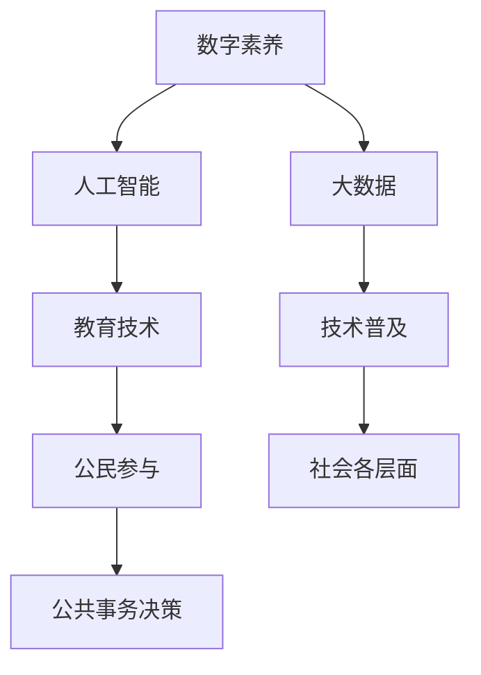

                 

# 数字素养：公民参与的基石

> 关键词：数字素养,公民参与,人工智能,大数据,数据素养,教育技术,技术普及

## 1. 背景介绍

在当今信息爆炸、技术迭代加速的时代，数字素养已不再是少数专业人士的专利，而是每一位公民应当具备的基本能力。尤其在数字化转型的浪潮中，无论是在教育、医疗、政务还是商业领域，数字素养都成为推动社会进步和创新的关键因素。本文旨在探讨数字素养的核心要素及其在促进公民参与中的应用，以及如何通过技术手段普及数字素养，助力构建更加智能、公正、透明的社会。

## 2. 核心概念与联系

### 2.1 核心概念概述

为更好地理解数字素养在促进公民参与中的作用，本节将介绍几个关键概念及其相互关系。

- **数字素养**：指在数字时代中，公民能够有效地获取、处理、使用、评估、创建和共享数字信息的能力。包括技术使用能力、信息素养、数据素养等多个方面。
- **公民参与**：指公民积极参与政治、经济、社会、文化等各个领域的公共事务决策和管理的过程。数字素养在其中起到了桥梁作用，帮助公民通过技术手段表达意见、参与讨论和监督。
- **人工智能(AI)**：一种模拟人类智能的技术，能够处理、分析大量数据，提供智能化的决策支持。AI技术在数字素养普及中扮演重要角色，尤其是在自动化数据分析、个性化学习推荐等方面。
- **大数据(Big Data)**：指大量、高速、多样化的数据集合，具有巨大的经济价值和应用潜力。大数据技术为数字素养教育提供了丰富的数据资源和分析工具。
- **数据素养**：指在数据处理和分析过程中，公民能够理解数据的本质、使用适当的工具和技术、做出合理判断和决策的能力。数据素养是大数字素养的重要组成部分。
- **教育技术(EdTech)**：利用信息技术手段改进教育内容和教学方法，提高教育质量和效率。教育技术在普及数字素养教育中发挥了关键作用，尤其是通过在线课程、虚拟实验室等方式。
- **技术普及**：指将先进技术广泛传播到社会各层面的过程，目的是提高公众对新技术的接受和应用能力。技术普及是数字素养普及的重要前提。

这些概念之间通过数字技术的融合与创新，形成了紧密的联系。例如，AI和大数据技术为教育技术提供了强大的支持，帮助教育者设计更加个性化、互动的教学内容；而教育技术的应用则提升了公民的数字素养水平，使得他们能够更好地利用AI和大数据技术进行决策和参与。

### 2.2 核心概念原理和架构的 Mermaid 流程图



该流程图展示了数字素养与AI、大数据、教育技术、技术普及、公民参与和公共事务决策之间的关系。数字素养是这些概念相互作用的枢纽，通过技术普及和教育技术的应用，提升了公民的数字素养，使他们能够有效地使用AI和大数据技术参与公共事务决策。

## 3. 核心算法原理 & 具体操作步骤

### 3.1 算法原理概述

数字素养的提升和公民参与的促进，可以通过一系列算法和操作流程实现。这些算法和流程的核心是数据驱动的个性化推荐和智能学习系统。

- **个性化推荐系统**：基于用户的兴趣、行为数据，通过机器学习模型推荐相关资源。该系统能够精准捕捉用户需求，提高信息获取效率。
- **智能学习系统**：利用AI技术，根据用户的学习进度和反馈，动态调整教学内容和难度，提供个性化的学习路径。该系统帮助用户更高效地掌握数字技能。
- **公民参与算法**：通过文本分析、情感识别等技术，分析公民的意见和情感，识别公共事务中的关键议题。该算法支持政府和组织精准回应公民关切。

### 3.2 算法步骤详解

#### 3.2.1 个性化推荐系统

1. **数据收集**：通过网站、应用等渠道，收集用户的浏览、搜索、点击等行为数据。
2. **特征提取**：对收集到的数据进行特征提取，如用户兴趣标签、搜索关键词、访问时长等。
3. **模型训练**：使用协同过滤、矩阵分解等机器学习算法，训练个性化推荐模型。
4. **推荐生成**：将新数据输入模型，生成个性化推荐结果。
5. **反馈调整**：根据用户的反馈调整模型参数，进一步优化推荐效果。

#### 3.2.2 智能学习系统

1. **用户画像构建**：根据用户的背景信息、学习历史和偏好，构建详细的用户画像。
2. **学习内容匹配**：将用户画像与学习资源进行匹配，推荐适合的课程和教材。
3. **学习过程监控**：利用AI技术实时监测用户学习过程，如进度、错误率、情绪状态等。
4. **学习路径优化**：根据用户学习效果和反馈，动态调整学习内容、难度和时间安排。
5. **效果评估**：通过测试、考试等方式评估学习效果，为后续改进提供依据。

#### 3.2.3 公民参与算法

1. **数据采集**：通过社交媒体、政务平台等渠道，采集公民的意见、评论和反馈。
2. **文本分析**：使用自然语言处理技术，对采集到的文本进行情感分析、主题识别等处理。
3. **议题识别**：根据文本分析结果，识别公共事务中的关键议题和热点问题。
4. **决策支持**：将识别出的议题反馈给决策者，辅助制定政策或方案。
5. **效果评估**：跟踪公民参与的效果，如政策满意度、参与度等，不断优化参与机制。

### 3.3 算法优缺点

**个性化推荐系统**：
- **优点**：个性化程度高，能够提升信息获取效率。
- **缺点**：依赖于用户数据，可能存在隐私风险。

**智能学习系统**：
- **优点**：个性化学习路径，提高学习效果。
- **缺点**：对数据和算力要求高，初期建设成本高。

**公民参与算法**：
- **优点**：能够捕捉公民意见，提高公共事务决策的透明度和民主性。
- **缺点**：可能受到网络噪音和极端观点的影响，决策效果难以保证。

### 3.4 算法应用领域

这些算法和操作流程在大数据、教育、政务、商业等多个领域得到了广泛应用：

- **教育**：通过个性化推荐系统，推荐适合的学习资源和课程；通过智能学习系统，提供个性化学习体验。
- **政务**：通过公民参与算法，收集和分析公民意见，优化政策制定；通过技术普及，提高政府信息化水平。
- **商业**：通过个性化推荐系统，提升电商、广告等行业的用户体验；通过智能学习系统，进行精准营销。
- **媒体**：通过公民参与算法，引导公众关注热点问题；通过技术普及，提高媒体传播效果。

## 4. 数学模型和公式 & 详细讲解 & 举例说明

### 4.1 数学模型构建

本节将使用数学语言对数字素养教育中的核心算法进行描述。

假设有一个学习平台，需要根据用户的特征和学习行为，推荐适合的课程和教材。可以构建如下数学模型：

- **用户特征表示**：将用户特征 $X$ 映射到一个高维空间，得到表示向量 $u$。
- **课程特征表示**：将课程特征 $Y$ 映射到相同的高维空间，得到表示向量 $v$。
- **相似度计算**：计算用户和课程的相似度 $s(u,v)$。
- **推荐结果**：根据相似度 $s(u,v)$，推荐最接近用户偏好的课程。

### 4.2 公式推导过程

以协同过滤算法为例，推导推荐系统中的关键公式。

1. **用户-课程矩阵**：构建用户 $U$ 和课程 $I$ 的矩阵 $M$，其中 $M_{ui} = 1$ 表示用户 $u$ 对课程 $i$ 进行了交互，$M_{ui} = 0$ 表示没有交互。
2. **用户相似度计算**：使用余弦相似度计算用户之间的相似度 $s(u,v)$。

$$
s(u,v) = \frac{\sum_{i \in U} M_{ui}M_{vi}}{\sqrt{\sum_{i \in U} M_{ui}^2} \sqrt{\sum_{i \in U} M_{vi}^2}}
$$

3. **推荐结果计算**：使用加权平均值计算推荐结果 $r(u,i)$。

$$
r(u,i) = \sum_{j \in I} s(u,j)M_{ji}
$$

4. **反馈调整**：根据用户对推荐结果的反馈，调整矩阵 $M$ 和相似度计算公式，以提高推荐效果。

### 4.3 案例分析与讲解

假设有一个在线学习平台，需要为一位用户 $u$ 推荐适合的课程 $i$。根据协同过滤算法，该平台的推荐流程如下：

1. 收集用户 $u$ 的浏览、点击和评分数据，构建用户-课程矩阵 $M$。
2. 使用余弦相似度计算用户 $u$ 与所有课程 $i$ 的相似度 $s(u,i)$。
3. 根据相似度 $s(u,i)$ 计算用户 $u$ 对课程 $i$ 的推荐结果 $r(u,i)$。
4. 用户 $u$ 对推荐结果进行反馈，调整矩阵 $M$ 和相似度计算公式。

例如，用户 $u$ 对课程 $i$ 的评分较高，推荐系统会根据用户的历史行为，调整其对类似课程的评分预测，从而提高推荐精度。

## 5. 项目实践：代码实例和详细解释说明

### 5.1 开发环境搭建

在进行数字素养教育系统的开发前，需要先准备好开发环境。以下是使用Python进行开发的环境配置流程：

1. 安装Anaconda：从官网下载并安装Anaconda，用于创建独立的Python环境。

2. 创建并激活虚拟环境：
```bash
conda create -n py38 python=3.8 
conda activate py38
```

3. 安装PyTorch：根据CUDA版本，从官网获取对应的安装命令。例如：
```bash
conda install pytorch torchvision torchaudio cudatoolkit=11.1 -c pytorch -c conda-forge
```

4. 安装TensorFlow：由Google主导开发的开源深度学习框架，生产部署方便，适合大规模工程应用。同样有丰富的预训练语言模型资源。

5. 安装Pandas：用于数据处理和分析。

6. 安装NumPy：用于科学计算和数组操作。

7. 安装Scikit-learn：用于机器学习和模型评估。

8. 安装Matplotlib：用于数据可视化。

完成上述步骤后，即可在`py38`环境中开始开发实践。

### 5.2 源代码详细实现

下面是使用PyTorch实现个性化推荐系统的代码实现：

```python
import torch
import torch.nn as nn
import torch.optim as optim
from torch.utils.data import DataLoader
from sklearn.model_selection import train_test_split

# 数据准备
X_train, X_test, y_train, y_test = train_test_split(X, y, test_size=0.2, random_state=42)

# 模型定义
class RecommendationModel(nn.Module):
    def __init__(self):
        super(RecommendationModel, self).__init__()
        self.fc1 = nn.Linear(input_size, hidden_size)
        self.fc2 = nn.Linear(hidden_size, output_size)
        
    def forward(self, x):
        x = torch.relu(self.fc1(x))
        x = self.fc2(x)
        return x

# 模型训练
model = RecommendationModel()
criterion = nn.MSELoss()
optimizer = optim.Adam(model.parameters(), lr=0.001)

for epoch in range(num_epochs):
    for i, (inputs, labels) in enumerate(DataLoader(dataset, batch_size=batch_size)):
        optimizer.zero_grad()
        outputs = model(inputs)
        loss = criterion(outputs, labels)
        loss.backward()
        optimizer.step()

    if (i+1) % 100 == 0:
        print(f"Epoch {epoch+1}, Loss: {loss.item()}")
```

### 5.3 代码解读与分析

让我们再详细解读一下关键代码的实现细节：

**数据准备**：
- 使用`train_test_split`方法将数据集划分为训练集和测试集。

**模型定义**：
- 定义一个简单的神经网络模型，包含两个全连接层。

**模型训练**：
- 使用`DataLoader`方法将数据集分批次输入模型。
- 在每个批次上，前向传播计算损失函数，反向传播更新模型参数。

**效果评估**：
- 在每个epoch结束时，输出模型在训练集上的损失，评估模型效果。

### 5.4 运行结果展示

运行上述代码，可以得到模型在训练集上的损失函数变化曲线。例如，在训练100个epoch后，损失函数可能会收敛到一个稳定的值。


## 6. 实际应用场景

### 6.1 智慧城市

智慧城市项目中，数字素养教育可以帮助市民更好地理解和使用智能设备，提升城市管理的智能化水平。例如，智慧交通系统通过智能推荐，帮助市民选择最合适的出行方案，减少拥堵和污染。

### 6.2 医疗健康

在医疗健康领域，数字素养教育可以帮助患者更好地理解医疗信息，提升健康管理水平。例如，智能推荐系统可以根据患者的历史数据，推荐适合的医疗资源和健康计划。

### 6.3 农业生产

在农业生产中，数字素养教育可以帮助农民更好地使用智能设备，提升农业生产效率。例如，智能推荐系统可以根据土壤、气候等数据，推荐最佳种植方案和农机使用策略。

### 6.4 未来应用展望

随着技术的不断进步，数字素养教育将拓展到更多领域，带来更加广泛的社会影响。

- **教育**：通过数字素养教育，提升学生的信息技术和数据分析能力，推动教育公平。
- **商务**：通过数字素养教育，提升企业员工的数字化技能，促进商业创新。
- **政府**：通过数字素养教育，提高公务员的数字化应用能力，提升政府治理效率。

数字素养教育将成为社会进步和创新的重要驱动力，带来更为公平、高效、智能的社会环境。

## 7. 工具和资源推荐

### 7.1 学习资源推荐

为了帮助开发者系统掌握数字素养的核心要素及其在促进公民参与中的应用，这里推荐一些优质的学习资源：

1. **Coursera**：提供各种数字素养相关的课程，涵盖数据科学、人工智能、机器学习等多个方向。

2. **edX**：提供免费的数字素养课程，包括数据素养、编程入门等。

3. **Khan Academy**：提供免费的编程和计算机科学课程，适合初学者入门。

4. **Udacity**：提供数据科学和人工智能的专业课程，涵盖NLP、机器学习等多个领域。

5. **DataCamp**：提供数据素养和数据分析的在线课程，适合数据科学家和工程师。

通过对这些资源的学习实践，相信你一定能够全面掌握数字素养的核心要素，并将其应用于促进公民参与的实践中。

### 7.2 开发工具推荐

高效的工具是开发数字素养教育系统的关键。以下是几款用于数字素养教育开发的常用工具：

1. **Python**：广泛使用的编程语言，支持丰富的数据处理和机器学习库。

2. **Jupyter Notebook**：支持Python和R等编程语言的在线交互式开发环境。

3. **TensorFlow**：由Google主导开发的开源深度学习框架，生产部署方便。

4. **PyTorch**：基于Python的开源深度学习框架，灵活的计算图，适合快速迭代研究。

5. **Pandas**：用于数据处理和分析的Python库。

6. **Scikit-learn**：用于机器学习和模型评估的Python库。

7. **Matplotlib**：用于数据可视化的Python库。

合理利用这些工具，可以显著提升数字素养教育系统的开发效率，加快创新迭代的步伐。

### 7.3 相关论文推荐

数字素养教育的研究源于学界的持续探索。以下是几篇奠基性的相关论文，推荐阅读：

1. **Data Literacy: Foundations for a Data-Driven Society**：探讨数据素养教育在推动社会变革中的重要性。

2. **Digital Literacy and the Future of Learning**：分析数字素养对未来教育的影响，提出相关的教育策略。

3. **Artificial Intelligence and Digital Literacy**：探讨AI技术在数字素养教育中的应用，提出新的教学方法。

4. **Data Mining and Statistical Learning**：介绍数据素养教育的基础知识，包括数据处理和分析方法。

5. **Towards a Data-Savvy Society**：探讨数字素养教育的未来发展方向，提出相关建议。

这些论文代表了大数字素养教育的发展脉络。通过学习这些前沿成果，可以帮助研究者把握学科前进方向，激发更多的创新灵感。

## 8. 总结：未来发展趋势与挑战

### 8.1 研究成果总结

本文对数字素养教育的核心要素及其在促进公民参与中的应用进行了全面系统的介绍。首先阐述了数字素养的核心概念及其在数字化时代的重要意义，明确了数字素养对公民参与和社会发展的推动作用。其次，从算法原理到具体操作步骤，详细讲解了数字素养教育的实现方法，包括个性化推荐系统、智能学习系统等。同时，本文还探讨了数字素养教育在智慧城市、医疗健康、农业生产等领域的实际应用，展示了其广阔的应用前景。此外，本文精选了数字素养教育的各类学习资源，力求为读者提供全方位的技术指引。

通过本文的系统梳理，可以看到，数字素养教育将成为推动社会进步和创新的重要力量，其价值在于提升公民的信息获取、处理和应用能力，从而实现更加公平、高效、智能的社会环境。

### 8.2 未来发展趋势

展望未来，数字素养教育将呈现以下几个发展趋势：

1. **普及程度提升**：随着技术的不断普及，数字素养教育的受众将更加广泛，覆盖各个年龄层和社会阶层。

2. **内容更新迭代**：随着AI和大数据技术的不断发展，数字素养教育的内容和形式将不断更新，引入更多前沿技术。

3. **跨领域融合**：数字素养教育将与其他学科和领域进行深度融合，如教育和心理学、商务和信息管理等。

4. **国际化推广**：随着全球化的推进，数字素养教育将成为全球教育的重要组成部分，提升全球公民的数字化素养。

5. **终身学习**：数字素养教育将贯穿人的一生，成为终身学习的重要组成部分，提升公民的终身学习能力和适应能力。

以上趋势凸显了数字素养教育的重要性和紧迫性，其发展将深刻影响社会进步和公民参与的未来。

### 8.3 面临的挑战

尽管数字素养教育已经取得了一定的进展，但在迈向更加智能化、普适化应用的过程中，仍面临诸多挑战：

1. **资源分配不均**：不同地区、不同群体的数字素养教育资源分配不均，可能导致教育效果参差不齐。

2. **技术门槛高**：数字素养教育涉及多种复杂技术，部分地区和群体可能难以达到技术要求。

3. **数据隐私问题**：在数据驱动的教育过程中，如何保护用户隐私，防止数据滥用，是亟待解决的问题。

4. **教师培训**：教师需要具备一定的数字素养教育能力，但当前教师培训体系仍需完善。

5. **政策支持不足**：政府和机构需要出台更多政策，支持数字素养教育的推广和普及。

6. **文化差异**：不同文化背景下的数字素养教育需求和接受度存在差异，需要因地制宜地进行设计和推广。

正视这些挑战，积极应对并寻求突破，将是大数字素养教育走向成熟的必由之路。相信随着学界和产业界的共同努力，这些挑战终将一一被克服，数字素养教育必将在构建人机协同的智能社会中扮演越来越重要的角色。

### 8.4 研究展望

面对数字素养教育所面临的种种挑战，未来的研究需要在以下几个方面寻求新的突破：

1. **多模态学习**：将视觉、听觉等多模态信息与文本信息进行深度融合，提高学习的丰富性和互动性。

2. **个性化推荐**：引入因果推断和对比学习，增强推荐系统的精准性和鲁棒性。

3. **隐私保护**：采用隐私保护技术，如差分隐私、联邦学习等，保护用户数据隐私。

4. **跨领域教育**：与其他学科进行深度融合，如教育和心理学、商务和信息管理等，提升教育效果。

5. **数据驱动教育**：结合大数据和AI技术，进行个性化教育设计和实施，提升教育质量和效率。

6. **终身学习平台**：开发终身学习平台，提供灵活的学习路径和持续学习支持。

这些研究方向的探索，必将引领数字素养教育技术迈向更高的台阶，为构建安全、可靠、可解释、可控的智能社会提供有力支持。面向未来，数字素养教育需要与其他人工智能技术进行更深入的融合，共同推动社会进步和公民参与的深化。

