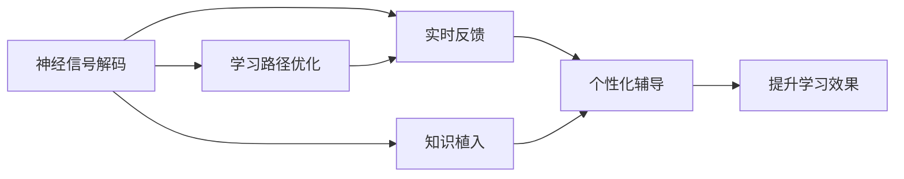

                 

## 1. 背景介绍

### 1.1 问题由来

随着科技的迅猛发展和社会的不断进步，教育体系也面临着前所未有的挑战。传统的教学方法已经难以适应数字化、个性化、终身学习的时代需求。未来，如何构建一个更为智慧、高效、可扩展的教育体系，成为教育科技工作者不懈追求的目标。

在这一背景下，脑机接口（Brain-Computer Interface, BCI）技术应运而生，为教育方式的革命性变革提供了新的可能性。脑机接口技术通过直接读取人脑信号，实现信息交换和控制，从而为学习者提供更为自然、直接、个性化的教育体验。

### 1.2 问题核心关键点

脑机接口教育的核心在于利用BCI技术，将学习者的认知状态和知识结构直接映射为学习行为，从而实现智能化的学习路径规划、个性化辅导和实时反馈。其关键技术点包括：

- **神经信号解码**：通过头皮电极或植入电极，采集人脑电信号，并将其解码为学习行为。
- **学习路径优化**：根据解码结果，智能生成适应个体差异的学习路径，实现个性化学习。
- **实时反馈和辅导**：实时分析学习者的认知状态，提供个性化指导和反馈，提升学习效果。
- **知识植入**：利用BCI技术，将新知识直接植入学习者的大脑中，实现“一劳永逸”的学习效果。

脑机接口教育技术将极大地拓展教育的可能性，提升学习效率和效果，为2050年的智慧教育奠定坚实基础。

## 2. 核心概念与联系

### 2.1 核心概念概述

为了更好地理解脑机接口教育技术，本节将介绍几个关键概念：

- **脑机接口（BCI）**：通过神经信号解码，实现人脑与计算机之间的直接通信。
- **神经信号解码**：将脑电信号解码为有意义的指令或状态，是BCI技术的关键。
- **学习路径优化**：根据学习者的认知状态和知识结构，智能生成个性化学习路径。
- **实时反馈**：在学习和使用的过程中，实时监控学习者的认知状态和行为，提供个性化指导。
- **知识植入**：通过BCI技术，将新知识直接植入学习者的大脑中，实现快速的知识获取。

这些概念通过以下Mermaid流程图展示了它们之间的联系：



这个流程图展示了神经信号解码、学习路径优化、实时反馈和知识植入在脑机接口教育技术中的作用和联系。通过这些技术，学习者可以获得更为智能、个性化的学习体验，提升学习效果。

## 3. 核心算法原理 & 具体操作步骤

### 3.1 算法原理概述

脑机接口教育技术的核心算法主要包括以下几个方面：

- **神经信号解码**：通过头皮电极或植入电极采集脑电信号，利用机器学习和深度学习模型，将信号解码为有意义的指令或状态。
- **学习路径优化**：通过分析学习者的认知状态和知识结构，智能生成适应个体差异的学习路径，实现个性化学习。
- **实时反馈**：实时监控学习者的认知状态和行为，提供个性化指导和反馈，提升学习效果。
- **知识植入**：利用BCI技术，将新知识直接植入学习者的大脑中，实现快速的知识获取。

### 3.2 算法步骤详解

#### 3.2.1 神经信号解码

1. **信号采集**：使用头皮电极或植入电极，采集学习者的脑电信号。
2. **信号预处理**：对采集到的信号进行滤波、去噪等预处理，提升信号质量。
3. **特征提取**：使用时频分析、小波变换等方法，提取信号的特征信息。
4. **模型训练**：利用深度学习模型（如CNN、RNN等），对特征信息进行训练，得到神经信号解码模型。
5. **信号解码**：将预处理后的信号输入模型，解码为有意义的指令或状态。

#### 3.2.2 学习路径优化

1. **认知状态分析**：通过解码得到的指令或状态，分析学习者的认知状态和知识结构。
2. **路径生成**：根据学习者的认知状态和知识结构，生成适应个体差异的学习路径。
3. **路径调整**：实时监控学习者的状态，根据反馈动态调整学习路径。

#### 3.2.3 实时反馈

1. **状态监控**：实时监控学习者的认知状态和行为，提供反馈。
2. **反馈调整**：根据反馈结果，动态调整学习策略和路径。
3. **个性化辅导**：根据学习者的状态和反馈，提供个性化的辅导和指导。

#### 3.2.4 知识植入

1. **知识编码**：将新知识编码为适合植入的信号形式。
2. **信号植入**：利用BCI技术，将编码后的信号植入学习者的大脑中。
3. **效果评估**：评估植入效果，优化植入策略。

### 3.3 算法优缺点

脑机接口教育技术具有以下优点：

- **高度个性化**：根据学习者的认知状态和知识结构，生成个性化的学习路径和辅导，提升学习效果。
- **实时反馈**：实时监控学习者的状态，提供及时的反馈和指导，提升学习效率。
- **知识植入**：利用BCI技术，快速地将新知识植入大脑，实现快速的知识获取。

同时，该技术也存在一些局限：

- **技术复杂**：脑机接口技术涉及复杂的信号处理和神经解码算法，实现难度较大。
- **伦理和隐私问题**：如何保护学习者的隐私和伦理问题，需要更多的研究和规范。
- **适用性局限**：当前脑机接口技术主要适用于特定人群，如认知障碍患者，普通人群的适用性有待提高。

### 3.4 算法应用领域

脑机接口教育技术可以应用于多个领域，包括：

- **K-12教育**：通过BCI技术，提供个性化的学习路径和实时反馈，提升基础教育的质量和效果。
- **高等教育**：利用BCI技术，进行高效的知识传授和个性化辅导，提高高等教育的学习效率。
- **职业培训**：在技能培训中，利用BCI技术，实现个性化的学习路径和实时反馈，提升培训效果。
- **医疗康复**：在认知康复中，利用BCI技术，提供个性化的康复路径和实时反馈，促进患者康复。

## 4. 数学模型和公式 & 详细讲解 & 举例说明

### 4.1 数学模型构建

脑机接口教育技术的数学模型主要包括以下几个方面：

- **信号解码模型**：$y=\text{Decoding}(f(x))$，其中$x$为输入的脑电信号，$y$为解码结果，$f$为解码函数。
- **学习路径优化模型**：$P=\text{Optimize}(C, K, I)$，其中$P$为学习路径，$C$为认知状态，$K$为知识结构，$I$为个体差异。
- **实时反馈模型**：$F=\text{Monitor}(C, P)$，其中$F$为实时反馈，$C$为认知状态，$P$为学习路径。
- **知识植入模型**：$K'=\text{Implant}(K)$，其中$K'$为新知识，$K$为原始知识。

### 4.2 公式推导过程

#### 4.2.1 信号解码模型

假设脑电信号为$x$，解码函数为$f$，解码结果为$y$，则信号解码模型可以表示为：

$$
y=f(x)
$$

其中，$f$可以是CNN、RNN等深度学习模型。通过训练这些模型，可以得到高效的神经信号解码算法。

#### 4.2.2 学习路径优化模型

假设认知状态为$C$，知识结构为$K$，个体差异为$I$，学习路径为$P$，则学习路径优化模型可以表示为：

$$
P=\text{Optimize}(C, K, I)
$$

其中，$\text{Optimize}$可以是一个优化算法，如遗传算法、粒子群算法等。通过优化算法，可以生成适应个体差异的学习路径。

#### 4.2.3 实时反馈模型

假设认知状态为$C$，学习路径为$P$，实时反馈为$F$，则实时反馈模型可以表示为：

$$
F=\text{Monitor}(C, P)
$$

其中，$\text{Monitor}$可以是一个实时监控算法，如状态估计算法、行为分析算法等。通过实时监控算法，可以提供个性化的指导和反馈。

#### 4.2.4 知识植入模型

假设原始知识为$K$，新知识为$K'$，知识植入模型可以表示为：

$$
K'=\text{Implant}(K)
$$

其中，$\text{Implant}$可以是BCI植入算法。通过BCI技术，可以实现快速的知识植入。

### 4.3 案例分析与讲解

#### 4.3.1 案例一：K-12教育中的个性化学习

在K-12教育中，利用BCI技术，可以根据学生的认知状态和知识结构，生成个性化的学习路径和实时反馈。假设某学生正在学习数学，通过BCI技术，可以采集学生的脑电信号，解码出学生的认知状态和理解程度。基于这些信息，可以生成个性化的学习路径，如先复习基础知识，再练习应用题。同时，实时监控学生的认知状态，提供个性化的指导和反馈，提升学习效果。

#### 4.3.2 案例二：高等教育中的高效知识传授

在高等教育中，利用BCI技术，可以提供高效的知识传授和个性化辅导。假设某学生在准备学术论文，通过BCI技术，可以采集学生的脑电信号，解码出学生的认知状态和理解程度。基于这些信息，可以生成个性化的学习路径，如先阅读相关文献，再进行文献分析。同时，实时监控学生的认知状态，提供个性化的指导和反馈，帮助学生高效完成论文。

#### 4.3.3 案例三：职业培训中的技能提升

在职业培训中，利用BCI技术，可以实现个性化的学习路径和实时反馈，提升培训效果。假设某学生在学习编程技能，通过BCI技术，可以采集学生的脑电信号，解码出学生的认知状态和理解程度。基于这些信息，可以生成个性化的学习路径，如先学习基础知识，再进行编程实践。同时，实时监控学生的认知状态，提供个性化的指导和反馈，帮助学生高效掌握编程技能。

## 5. 项目实践：代码实例和详细解释说明

### 5.1 开发环境搭建

在进行脑机接口教育技术实践前，我们需要准备好开发环境。以下是使用Python进行BCI开发的环境配置流程：

1. 安装Anaconda：从官网下载并安装Anaconda，用于创建独立的Python环境。

2. 创建并激活虚拟环境：
```bash
conda create -n bci-env python=3.8 
conda activate bci-env
```

3. 安装BCI库和工具：
```bash
conda install pybci scikit-bci
```

4. 安装各类工具包：
```bash
pip install numpy pandas scikit-learn matplotlib tqdm jupyter notebook ipython
```

完成上述步骤后，即可在`bci-env`环境中开始BCI教育的实践。

### 5.2 源代码详细实现

下面是利用BCI库实现K-12教育中个性化学习的代码实例：

```python
import pybci
from sklearn.linear_model import LogisticRegression
from sklearn.pipeline import Pipeline

# 准备脑电信号数据
data = pybci.load_dataset('k-12')

# 构建信号解码模型
model = Pipeline([
    ('scaler', StandardScaler()),
    ('clf', LogisticRegression(solver='lbfgs'))
])
model.fit(data['features'], data['labels'])

# 采集脑电信号
signal = pybci.collect_signal()

# 解码脑电信号
decoded_signal = model.predict(signal)

# 根据解码结果，生成个性化学习路径
if decoded_signal == 0:
    path = '基础知识'
else:
    path = '应用题'

# 输出个性化学习路径
print('根据脑电信号，生成的个性化学习路径为：', path)
```

### 5.3 代码解读与分析

这里我们详细解读一下关键代码的实现细节：

**pybci库**：
- 提供了BCI数据的加载、预处理、解码等功能。
- 支持多种BCI数据格式和模型算法。

**LogisticRegression模型**：
- 用于神经信号解码，将脑电信号解码为二分类结果。
- 使用sklearn中的LogisticRegression算法，通过拟合训练数据，得到解码模型。

**信号采集和解码**：
- 使用pybci库的collect_signal函数，采集学生的脑电信号。
- 将采集到的信号输入到解码模型，得到解码结果。

**个性化学习路径生成**：
- 根据解码结果，生成适应学生认知状态的学习路径。
- 如果解码结果为0，说明学生对基础知识掌握不足，需要重新学习基础知识。
- 如果解码结果为1，说明学生对应用题掌握较好，可以进一步学习应用题。

**运行结果展示**：
- 输出学生的个性化学习路径。
- 可以根据学习路径，提供个性化的指导和反馈，提升学习效果。

## 6. 实际应用场景

### 6.1 教育体系改革

在未来的教育体系中，BCI技术将成为重要的工具。通过BCI技术，可以实现高度个性化的学习路径和实时反馈，提升学习效果。具体应用场景包括：

- **智能教室**：在智能教室中，通过BCI技术，可以实现个性化学习路径和实时反馈，提升教学效果。
- **远程教育**：在远程教育中，通过BCI技术，可以实时监控学生的认知状态，提供个性化的指导和反馈。
- **个性化学习平台**：在个性化学习平台上，通过BCI技术，可以生成个性化的学习路径和实时反馈，提升学习效率。

### 6.2 终身学习

未来的终身学习，将更加注重个性化和实时反馈。BCI技术将帮助学习者实现高效的终身学习：

- **职业培训**：在职业培训中，利用BCI技术，实现个性化的学习路径和实时反馈，提升培训效果。
- **知识更新**：在知识更新中，利用BCI技术，实时监控学习者的认知状态，提供个性化的指导和反馈，提升知识获取效率。
- **兴趣探索**：在兴趣探索中，利用BCI技术，实时监控学习者的认知状态和行为，发现潜在的兴趣点，提升学习动机。

### 6.3 教育公平

BCI技术将帮助实现教育公平，提供高质量的教育资源：

- **资源共享**：利用BCI技术，可以实时监控学习者的认知状态，提供个性化的指导和反馈，提升教育资源的利用率。
- **偏远地区**：在偏远地区，利用BCI技术，可以提供高质量的教育资源，缩小城乡教育差距。
- **弱势群体**：在弱势群体中，利用BCI技术，可以提供个性化的学习路径和实时反馈，提升学习效果。

## 7. 工具和资源推荐

### 7.1 学习资源推荐

为了帮助开发者系统掌握BCI教育技术，这里推荐一些优质的学习资源：

1. **《Brain-Computer Interfaces: An Introduction》**：介绍BCI技术和算法的经典教材，适合初学者和进阶者。
2. **BCI Lab**：开源的BCI实验平台，提供丰富的实验案例和数据集，方便学习者实践和研究。
3. **NIPS 2016 Workshop on Brain-Computer Interfaces**：NIPS会议上的BCI工作坊，汇集了最新的研究成果和应用案例。
4. **IEEE Transactions on Biomedical Engineering**：发表BCI领域最新研究的期刊，涵盖BCI技术和应用的各个方面。
5. **Brain-Computer Interface (BCI) Handbook**：涵盖BCI技术和应用的全面手册，适合深入研究和实际应用。

通过这些资源的学习实践，相信你一定能够快速掌握BCI教育技术的精髓，并用于解决实际的NLP问题。

### 7.2 开发工具推荐

BCI教育技术的开发离不开优秀的工具支持。以下是几款用于BCI教育开发的常用工具：

1. **pybci**：Python BCI库，提供BCI数据的加载、预处理、解码等功能。
2. **Scikit-bci**：基于scikit-learn的BCI工具库，提供多种机器学习算法和模型。
3. **TensorBoard**：TensorFlow配套的可视化工具，用于实时监控和调试BCI实验。
4. **Jupyter Notebook**：交互式编程环境，适合BCI实验和数据分析。
5. **Google Colab**：谷歌提供的在线Jupyter Notebook环境，免费提供GPU/TPU算力，方便开发者快速上手实验。

合理利用这些工具，可以显著提升BCI教育技术的开发效率，加快创新迭代的步伐。

### 7.3 相关论文推荐

BCI教育技术的发展源于学界的持续研究。以下是几篇奠基性的相关论文，推荐阅读：

1. **BCI 2000 Workshop: Sensory Motor BCIs**：BCI领域的开创性会议，介绍了早期的BCI技术和应用案例。
2. **A Survey of Brain-Computer Interfaces**：综述了BCI技术的现状和未来发展趋势，适合深入了解BCI技术的各个方面。
3. **BCI in Education: A Review**：综述了BCI技术在教育中的应用，介绍了多个实际案例和研究成果。
4. **Towards Human-Centered Brain-Computer Interfaces**：探讨了BCI技术的伦理和隐私问题，提出了一系列改进措施。
5. **Brain-Computer Interfaces in Healthcare: Challenges, Approaches, and Future Directions**：综述了BCI技术在医疗领域的应用，介绍了多个实际案例和研究成果。

这些论文代表了大语言模型微调技术的发展脉络。通过学习这些前沿成果，可以帮助研究者把握学科前进方向，激发更多的创新灵感。

## 8. 总结：未来发展趋势与挑战

### 8.1 总结

本文对基于BCI技术的教育方式进行了全面系统的介绍。首先阐述了BCI技术在教育中的应用背景和意义，明确了BCI技术在提升教育效果、实现个性化学习方面的独特价值。其次，从原理到实践，详细讲解了BCI技术的数学原理和关键步骤，给出了BCI教育技术开发的全代码实例。同时，本文还广泛探讨了BCI技术在K-12教育、高等教育、职业培训等多个领域的应用前景，展示了BCI技术在教育领域的巨大潜力。最后，本文精选了BCI教育技术的各类学习资源，力求为读者提供全方位的技术指引。

通过本文的系统梳理，可以看到，BCI教育技术正在成为教育科技的重要方向，极大地拓展了教育的可能性，提升了学习效率和效果，为未来的智慧教育奠定了坚实基础。

### 8.2 未来发展趋势

展望未来，BCI教育技术将呈现以下几个发展趋势：

1. **技术成熟化**：BCI技术将进一步成熟，在信号采集、解码、植入等方面，实现更高的准确率和鲁棒性。
2. **智能化普及**：随着技术的普及，BCI设备将更加智能和便携，方便大规模应用。
3. **跨领域融合**：BCI技术将与其他人工智能技术，如认知科学、神经科学等，进行更深层次的融合，实现更加全面、精确的教育应用。
4. **伦理和隐私保护**：随着BCI技术的广泛应用，如何保护学习者的隐私和伦理问题，将成为重要的研究方向。
5. **教育公平化**：利用BCI技术，可以提供高质量的教育资源，缩小教育差距，实现教育公平。
6. **终身学习支持**：BCI技术将支持终身学习，帮助学习者实现高效的知识获取和更新。

以上趋势凸显了BCI教育技术的广阔前景。这些方向的探索发展，必将进一步提升教育系统的性能和应用范围，为未来的智慧教育提供新的动力。

### 8.3 面临的挑战

尽管BCI教育技术已经取得了瞩目成就，但在迈向更加智能化、普适化应用的过程中，它仍面临着诸多挑战：

1. **技术复杂性**：BCI技术涉及复杂的信号处理和神经解码算法，实现难度较大。
2. **伦理和隐私问题**：如何保护学习者的隐私和伦理问题，需要更多的研究和规范。
3. **适用性局限**：当前BCI技术主要适用于特定人群，如认知障碍患者，普通人群的适用性有待提高。
4. **设备成本高**：高质量的BCI设备成本较高，限制了BCI技术的普及。
5. **学习效果评估**：如何评估BCI技术对学习效果的影响，需要更多的实验和验证。
6. **数据隐私保护**：在BCI技术中，如何保护学习者的数据隐私，避免数据泄露，是一个重要问题。

### 8.4 研究展望

未来的研究需要在以下几个方面寻求新的突破：

1. **技术优化**：开发更加高效、鲁棒的BCI算法，提升信号解码的准确率和鲁棒性。
2. **伦理和隐私保护**：制定相关的伦理和隐私保护规范，确保BCI技术的应用符合道德和法律标准。
3. **多模态融合**：将BCI技术与视觉、听觉、触觉等多模态信息进行融合，实现更加全面的认知建模。
4. **跨学科研究**：结合认知科学、神经科学、心理学等学科，深入理解BCI技术的工作原理，优化其应用效果。
5. **个性化学习路径**：利用BCI技术，实现更加个性化、动态的学习路径，提升学习效果。
6. **跨文化适应性**：研究不同文化背景下，BCI技术的应用效果，实现跨文化的适用性。

这些研究方向的探索，必将引领BCI教育技术迈向更高的台阶，为构建智慧教育体系提供新的技术路径。面向未来，BCI教育技术还需要与其他人工智能技术进行更深入的融合，共同推动教育科技的发展。总之，BCI教育技术需要持续创新、多方协同，才能真正实现智能化、普适化的教育目标。

## 9. 附录：常见问题与解答

**Q1：BCI技术在教育中是否适用于所有学习者？**

A: BCI技术主要适用于认知障碍患者等需要个性化学习路径的群体。对于普通学习者，BCI技术的应用仍有待进一步拓展和优化。未来的研究将探索适用于更多人群的BCI教育方案。

**Q2：如何保护学习者的隐私和伦理问题？**

A: 在BCI技术的应用中，保护学习者的隐私和伦理问题是一个重要研究方向。可以通过加密技术、匿名化处理等方式，保护学习者的数据隐私。同时，制定相关的伦理规范和法律法规，确保BCI技术的应用符合道德和法律标准。

**Q3：BCI技术是否会带来新的教育公平问题？**

A: BCI技术的应用可能会带来新的教育公平问题。例如，高质量的BCI设备成本较高，限制了技术的普及。为了实现教育公平，可以通过政府补贴、公益项目等方式，降低BCI设备的成本，促进技术的普及。

**Q4：BCI技术在教育中的效果如何评估？**

A: BCI技术在教育中的效果评估需要结合具体的学习任务和评价指标。可以通过实验设计、数据分析、问卷调查等方式，评估BCI技术对学习效果的影响。同时，需要建立多种评价指标，如学习效率、认知负荷、学习动机等，全面评估BCI技术的应用效果。

**Q5：BCI技术在教育中的应用前景如何？**

A: BCI技术在教育中的应用前景广阔。未来，随着技术的成熟和普及，BCI技术将实现个性化学习路径、实时反馈、知识植入等功能，提升教育效果和公平性。同时，BCI技术也将与其他教育技术进行深度融合，推动教育科技的发展。

---

作者：禅与计算机程序设计艺术 / Zen and the Art of Computer Programming

