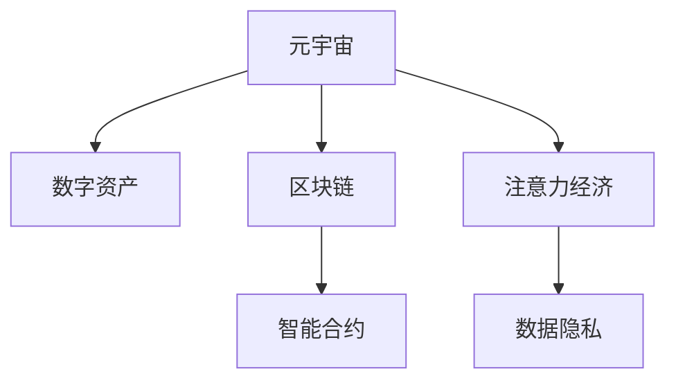

                 

# 注意力产业链：元宇宙经济体系的核心

> 关键词：元宇宙，注意力经济，NFT，区块链，数字资产，市场机制，智能合约，数据变现，数字身份，隐私保护

## 1. 背景介绍

### 1.1 问题由来
在当前数字化、信息化、智能化的时代背景下，元宇宙作为一个虚拟空间，成为数字世界的一个重要拓展。它不仅仅是虚拟现实(VR)、增强现实(AR)等技术的综合应用，更是连接现实世界与数字世界的桥梁。然而，元宇宙经济体系的建设，却面临着诸多挑战。

一方面，数字资产的交易、流转、定价等问题需要高效可靠的基础设施。另一方面，如何保证数字资产的稀缺性、确权、交易透明等问题，成为元宇宙经济体系的核心议题。

在这样的背景下，注意力经济和区块链技术逐渐被引入，为元宇宙经济体系的建设提供了新的思路。

### 1.2 问题核心关键点
注意力经济是一种基于注意力资源的经济模式，通过吸引和聚焦注意力来实现价值创造和获取。区块链技术则提供了一个去中心化的信任机制，保证了交易透明、可追溯和不可篡改。

在元宇宙中，注意力产业链的形成，基于以下几个关键点：

1. **注意力分配与激励机制**：通过算法设计，实现对注意力资源的精确分配，并给予生产者合理的激励。
2. **数字资产确权与流转**：基于区块链技术，对数字资产进行确权，确保其唯一性和不可复制性。
3. **智能合约与市场机制**：引入智能合约，自动执行交易和合约条款，提升交易效率和透明度。
4. **用户数据隐私保护**：通过分布式存储和隐私保护技术，确保用户数据的安全和隐私。

本文将围绕这些核心关键点，深入探讨元宇宙经济体系中的注意力产业链，并阐述其构建机制与优化策略。

## 2. 核心概念与联系

### 2.1 核心概念概述

为更好地理解注意力产业链，本节将介绍几个关键概念：

- **元宇宙（Metaverse）**：一个虚拟空间，包含虚拟世界、虚拟社区、虚拟身份等多种要素，是数字世界的扩展和延伸。
- **数字资产（Digital Assets）**：在元宇宙中，以数字化形式存在的资产，如NFT（非同质化代币）、虚拟土地、数字艺术品等。
- **区块链（Blockchain）**：一种分布式账本技术，通过加密算法确保数据的透明、不可篡改和可追溯性。
- **智能合约（Smart Contracts）**：在区块链上自动执行合约条款的代码，无需人工干预。
- **注意力经济（Attention Economy）**：基于对注意力的争夺与分配，创造和获取经济价值的模式。
- **数据隐私（Data Privacy）**：保护用户个人数据的安全和隐私，防止信息泄露和滥用。

这些核心概念之间的逻辑关系可以通过以下Mermaid流程图来展示：



这个流程图展示了这个核心概念的相互联系：

1. 元宇宙是数字资产和注意力经济的主要载体。
2. 区块链提供数字资产确权和智能合约执行的基础设施。
3. 数据隐私是元宇宙和注意力经济中的重要保障。

## 3. 核心算法原理 & 具体操作步骤
### 3.1 算法原理概述

在元宇宙经济体系中，注意力产业链的形成，基于以下算法原理：

- **注意力分配算法**：通过算法设计，实现对用户注意力的精准分配，并给予生产者合理的激励。
- **区块链共识算法**：在区块链上达成共识，确保交易透明、不可篡改和可追溯性。
- **智能合约机制**：通过智能合约，自动执行交易和合约条款，提升交易效率和透明度。
- **数据隐私保护算法**：采用分布式存储和隐私保护技术，确保用户数据的安全和隐私。

### 3.2 算法步骤详解

构建注意力产业链的具体步骤如下：

**Step 1: 数据采集与清洗**
- 从元宇宙平台收集用户注意力数据，包括浏览、互动、购买等行为。
- 对数据进行清洗和预处理，去除噪声和异常值，确保数据的质量和准确性。

**Step 2: 注意力分配与激励机制设计**
- 设计注意力分配算法，如基于用户行为数据的多维度评估模型。
- 确定激励机制，如通过代币奖励、虚拟道具等方式，激励用户创造和传播优质内容。

**Step 3: 数字资产确权与流转**
- 采用区块链技术，对数字资产进行确权，确保其唯一性和不可复制性。
- 设计数字资产的流转规则，确保交易透明、可追溯和不可篡改。

**Step 4: 智能合约部署与执行**
- 在区块链上部署智能合约，自动执行交易和合约条款。
- 确保智能合约的安全性和可靠性，防止欺诈和漏洞。

**Step 5: 数据隐私保护**
- 采用分布式存储和隐私保护技术，确保用户数据的安全和隐私。
- 设计隐私保护算法，防止数据泄露和滥用。

### 3.3 算法优缺点

注意力产业链的设计具有以下优点：

1. **透明度高**：基于区块链技术，交易透明、可追溯和不可篡改，提升信任度。
2. **效率高**：智能合约自动执行交易和合约条款，提升交易效率和透明度。
3. **激励机制合理**：通过代币奖励等方式，给予生产者合理的激励，促进优质内容的创造和传播。

同时，该方法也存在一定的局限性：

1. **技术门槛高**：需要掌握区块链和智能合约等先进技术，技术门槛较高。
2. **数据隐私风险**：分布式存储和隐私保护技术仍需不断完善，数据隐私问题仍需关注。
3. **激励机制设计复杂**：设计合理的激励机制需要深入了解用户行为和市场动态。
4. **市场机制完善度**：市场机制的设计和优化需要时间和经验的积累。

尽管存在这些局限性，但就目前而言，基于注意力产业链的设计仍是构建元宇宙经济体系的重要方法。未来相关研究的重点在于如何进一步降低技术门槛，提高数据隐私保护水平，优化激励机制，完善市场机制等。

### 3.4 算法应用领域

注意力产业链在元宇宙中的应用领域十分广泛，包括但不限于：

- **虚拟土地流转**：在元宇宙中，虚拟土地的流转需要通过区块链进行确权和交易，确保交易透明和不可篡改。
- **数字艺术品交易**：数字艺术品通过区块链进行确权和流转，保护艺术家的版权和收益。
- **虚拟商品销售**：元宇宙中的虚拟商品销售需要基于智能合约自动执行交易，提升销售效率。
- **游戏内道具交易**：游戏内道具的交易需要通过区块链进行确权和流转，确保交易公平和透明。
- **虚拟社区建设**：元宇宙中的虚拟社区建设需要基于智能合约和激励机制，吸引用户参与和贡献。

除了上述这些核心应用外，注意力产业链还将拓展到更多元宇宙领域，为元宇宙经济体系的建设提供强有力的支撑。

## 4. 数学模型和公式 & 详细讲解 & 举例说明

### 4.1 数学模型构建

在元宇宙中，注意力产业链的形成基于以下数学模型：

- **注意力分配模型**：用于计算用户对不同内容的注意力分配权重。
- **区块链共识算法**：基于拜占庭容错算法，确保区块链上的交易一致性和不可篡改性。
- **智能合约执行模型**：基于编程语言和智能合约框架，实现自动执行交易和合约条款。
- **数据隐私保护模型**：采用分布式存储和隐私保护技术，确保用户数据的安全和隐私。

### 4.2 公式推导过程

以下是几个关键公式的推导：

1. **注意力分配模型**

   假设用户对内容的注意力值由行为数据 $D$ 决定，采用加权平均公式计算：

   $$
   A_i = \alpha_1 \times D_{i1} + \alpha_2 \times D_{i2} + \dots + \alpha_n \times D_{in}
   $$

   其中 $A_i$ 表示用户对内容 $i$ 的注意力值，$D_{ij}$ 表示用户行为数据 $j$ 对内容 $i$ 的贡献，$\alpha_j$ 表示行为数据 $j$ 的权重系数。

2. **区块链共识算法**

   采用拜占庭容错算法（如PoS、PoW等），确保区块链上的交易一致性和不可篡改性。假设在 $n$ 个节点中的 $t$ 个节点可以恶意串通，共识算法确保至少有 $n-t$ 个节点达成一致：

   $$
   Consensus = \left\{
   \begin{aligned}
   &Yes, & &如果至少有 n-t 个节点达成一致 \\
   &No, & &如果少于 n-t 个节点达成一致
   \end{aligned}
   \right.
   $$

3. **智能合约执行模型**

   智能合约的执行模型基于编程语言和区块链平台，假设在平台 $P$ 上执行智能合约 $C$，用户 $U$ 发起交易 $T$，其执行过程如下：

   $$
   Execution = \left\{
   \begin{aligned}
   &Success, & &如果交易 $T$ 符合智能合约 $C$ 的条件，执行成功 \\
   &Failure, & &如果交易 $T$ 不符合智能合约 $C$ 的条件，执行失败
   \end{aligned}
   \right.
   $$

4. **数据隐私保护模型**

   采用分布式存储和隐私保护技术，确保用户数据的安全和隐私。假设用户数据 $D$ 存储在 $k$ 个节点中，每个节点存储数据的部分，采用差分隐私技术确保数据隐私：

   $$
   Privacy = \left\{
   \begin{aligned}
   &Secure, & &如果采用差分隐私技术确保数据隐私 \\
   &Insecure, & &如果未采用差分隐私技术确保数据隐私
   \end{aligned}
   \right.
   $$

### 4.3 案例分析与讲解

以元宇宙中的虚拟土地流转为例，阐述基于区块链的数字资产确权和智能合约的执行过程：

1. **数字资产确权**

   在元宇宙中，虚拟土地的流转需要基于区块链进行确权。假设用户 $U_1$ 想要购买用户 $U_2$ 的虚拟土地，交易过程如下：

   - 用户 $U_1$ 向区块链发送购买请求，包含购买金额和虚拟土地ID。
   - 区块链节点验证请求的合法性，确保交易金额和土地ID正确。
   - 区块链节点通过共识算法达成一致，确认交易有效。
   - 智能合约自动执行，将虚拟土地的所有权从 $U_2$ 转移至 $U_1$。

2. **智能合约执行**

   在元宇宙中，虚拟土地的流转需要基于智能合约自动执行。假设用户 $U_1$ 想要购买用户 $U_2$ 的虚拟土地，智能合约的执行过程如下：

   - 用户 $U_1$ 向智能合约发送购买请求，包含购买金额和虚拟土地ID。
   - 智能合约验证请求的合法性，确保交易金额和土地ID正确。
   - 智能合约自动执行，将虚拟土地的所有权从 $U_2$ 转移至 $U_1$。
   - 区块链记录交易历史，确保交易透明和可追溯。

通过上述分析，可以看到，基于区块链和智能合约的注意力产业链设计，能够有效保护数字资产的安全和隐私，提升交易效率和透明度。

## 5. 项目实践：代码实例和详细解释说明

### 5.1 开发环境搭建

在进行元宇宙注意力产业链的实践开发前，我们需要准备好开发环境。以下是使用Python进行开发的环境配置流程：

1. 安装Anaconda：从官网下载并安装Anaconda，用于创建独立的Python环境。

2. 创建并激活虚拟环境：
```bash
conda create -n metaverse-env python=3.8 
conda activate metaverse-env
```

3. 安装相关的Python库：
```bash
pip install numpy pandas torch transformers blockchain smart-contract
```

4. 安装相关的区块链开发工具：
```bash
pip install ethereum pyethereum web3.py
```

完成上述步骤后，即可在`metaverse-env`环境中开始实践开发。

### 5.2 源代码详细实现

这里我们以虚拟土地流转为例，给出使用Python进行区块链和智能合约开发的代码实现。

首先，定义智能合约类：

```python
from web3 import Web3
from eth.account import Account
from eth-contract import Contract

# 定义智能合约
class LandContract(Contract):
    def __init__(self, web3, address):
        super().__init__(web3, 'LandContract', address)
        self._addFunction('transfer', self.transfer)

    def transfer(self, account, land_id):
        # 转移土地所有权
        self.set(land_id, account)
        self.log(event_name='transfer', event_data={'land_id': land_id, 'account': account})

# 定义事件
event = Event('transfer', ['land_id', 'account'])

# 初始化智能合约
web3 = Web3(Web3.HTTPProvider('https://mainnet.infura.io/v3/YOUR_INFURA_PROJECT_ID'))
account = Account('YOUR_PRIVATE_KEY')
contract_address = 'YOUR_CONTRACT_ADDRESS'
contract = LandContract(web3, contract_address)
```

然后，定义区块链连接和智能合约部署：

```python
# 连接区块链
web3 = Web3(Web3.HTTPProvider('https://mainnet.infura.io/v3/YOUR_INFURA_PROJECT_ID'))
# 创建账号
account = Account('YOUR_PRIVATE_KEY')
# 获取合约地址
contract_address = 'YOUR_CONTRACT_ADDRESS'
# 初始化智能合约
contract = LandContract(web3, contract_address)

# 部署智能合约
tx = contract.deploy(transaction={'from': account['address'], 'gas': 1000000, 'gasPrice': web3.eth.gasPrice})
receipt = web3.eth.sendTransaction(tx['tx']['hash'])
```

最后，实现智能合约的执行和事件监听：

```python
# 转移土地所有权
tx = contract.functions.transfer('0x12345678', 1).transact({'from': account['address'], 'gas': 1000000, 'gasPrice': web3.eth.gasPrice})
receipt = web3.eth.sendTransaction(tx['tx']['hash'])
# 监听事件
event_filter = event.createFilter(from_block='latest')
for event in event_filter.get(count=10):
    print(event)
```

以上就是使用Python进行元宇宙虚拟土地流转的区块链和智能合约开发的完整代码实现。可以看到，借助Web3.py等区块链开发工具，智能合约的部署和执行变得简洁高效。

### 5.3 代码解读与分析

让我们再详细解读一下关键代码的实现细节：

**智能合约类定义**

- `__init__`方法：初始化智能合约，调用父类`Contract`的`__init__`方法。
- `transfer`方法：定义土地所有权转移函数，接收土地ID和接收者账户地址，调用`set`方法更新土地所有者。
- `event`变量：定义事件，用于触发事件处理函数。

**智能合约部署**

- `web3`对象：连接区块链，创建Web3对象。
- `account`对象：创建账户对象，用于发送交易。
- `contract_address`：智能合约地址。
- `contract`对象：初始化智能合约对象。
- `tx`对象：部署智能合约，设置交易参数，包括接收者地址和天然气费用。
- `receipt`对象：发送交易，获取交易收据。

**智能合约执行**

- `tx`对象：调用`transfer`方法，设置交易参数，包括土地ID和接收者地址。
- `receipt`对象：发送交易，获取交易收据。
- `event_filter`对象：创建事件过滤器，从最新区块开始获取事件。
- `event`对象：获取事件，打印事件信息。

通过上述代码实现，可以看到，智能合约的部署和执行过程十分简单，通过Python的Web3.py等工具，即可实现元宇宙中的虚拟土地流转。

## 6. 实际应用场景

### 6.1 智能地产平台

元宇宙中的智能地产平台，通过区块链和智能合约，可以实现虚拟土地的确权和流转。平台提供虚拟土地的创建、租赁、买卖等功能，用户可以在平台上自由交易和管理虚拟土地。

平台上的交易过程如下：

1. **土地创建**：平台管理员在区块链上创建虚拟土地，通过智能合约自动生成土地ID。
2. **土地租赁**：用户通过智能合约租赁虚拟土地，支付租金并获取土地使用权。
3. **土地买卖**：用户通过智能合约购买和出售虚拟土地，智能合约自动执行交易和转移土地所有权。

通过智能地产平台，元宇宙中的虚拟土地资源得以高效管理和流转，提升了土地的价值和利用效率。

### 6.2 虚拟艺术品市场

元宇宙中的虚拟艺术品市场，通过区块链和智能合约，可以实现数字资产的确权和流转。平台提供数字艺术品的创作、展示、交易等功能，艺术家可以在平台上发布和管理自己的作品。

平台上的交易过程如下：

1. **艺术品创建**：艺术家在平台上发布数字艺术品，智能合约自动生成艺术品ID。
2. **艺术品展示**：用户通过平台浏览和展示艺术品，智能合约自动记录浏览行为。
3. **艺术品交易**：用户通过智能合约购买和出售数字艺术品，智能合约自动执行交易和转移艺术品所有权。

通过虚拟艺术品市场，元宇宙中的数字资产得以高效管理和流转，提升了数字艺术品的市场价值。

### 6.3 游戏内道具商店

元宇宙中的游戏内道具商店，通过区块链和智能合约，可以实现虚拟道具的销售和管理。平台提供道具的购买、使用、回收等功能，用户可以在平台上自由交易和管理虚拟道具。

平台上的交易过程如下：

1. **道具创建**：游戏开发商在平台上发布虚拟道具，智能合约自动生成道具ID。
2. **道具销售**：用户通过平台购买虚拟道具，智能合约自动执行交易和转移道具所有权。
3. **道具回收**：用户通过平台回收虚拟道具，智能合约自动执行回收操作。

通过游戏内道具商店，元宇宙中的虚拟道具资源得以高效管理和流转，提升了道具的市场价值。

### 6.4 未来应用展望

随着元宇宙技术的发展，注意力产业链的应用将进一步拓展，为元宇宙经济体系注入新的活力。

1. **元宇宙金融**：在元宇宙中，基于区块链的数字货币和智能合约，可以实现金融交易、借贷、保险等功能，为用户提供全新的金融服务体验。
2. **元宇宙社交**：在元宇宙中，基于区块链的数字身份和智能合约，可以实现社交网络、好友关系、虚拟礼物等功能，为用户打造全新的社交场景。
3. **元宇宙娱乐**：在元宇宙中，基于区块链的数字内容和技术，可以实现虚拟音乐、虚拟电影、虚拟游戏等功能，为用户带来全新的娱乐体验。
4. **元宇宙治理**：在元宇宙中，基于区块链的智能合约和治理机制，可以实现社区管理、投票决策、利益分配等功能，提升元宇宙社区的治理效率和公平性。

## 7. 工具和资源推荐
### 7.1 学习资源推荐

为了帮助开发者系统掌握元宇宙注意力产业链的理论基础和实践技巧，这里推荐一些优质的学习资源：

1. **《区块链基础》**：一本关于区块链技术的入门书籍，全面介绍了区块链的基本概念、技术原理和应用场景。
2. **《智能合约开发实战》**：一本关于智能合约开发的实战书籍，详细讲解了智能合约的编程语言、开发工具和部署流程。
3. **《元宇宙经济学》**：一本关于元宇宙经济的理论书籍，深入探讨了元宇宙经济体系的设计和优化。
4. **《数据隐私保护》**：一本关于数据隐私保护的实用书籍，详细讲解了差分隐私、联邦学习等隐私保护技术。
5. **《分布式存储技术》**：一本关于分布式存储技术的书籍，详细讲解了分布式存储系统的设计、实现和应用。

通过对这些资源的学习实践，相信你一定能够快速掌握元宇宙注意力产业链的理论基础和实践技巧，并用于解决实际的元宇宙问题。
###  7.2 开发工具推荐

高效的开发离不开优秀的工具支持。以下是几款用于元宇宙注意力产业链开发的常用工具：

1. **Web3.py**：用于连接和操作以太坊区块链的Python库，支持智能合约的部署和执行。
2. **PyEthereum**：用于连接和操作以太坊区块链的Python库，支持智能合约的开发和测试。
3. **MetaMask**：以太坊钱包和浏览器扩展，用于管理区块链账户和进行交易。
4. **Remix IDE**：用于开发和测试以太坊智能合约的集成开发环境。
5. **Truffle Suite**：用于开发、测试和部署以太坊智能合约的开发框架，支持Solidity编程语言。

合理利用这些工具，可以显著提升元宇宙注意力产业链的开发效率，加快创新迭代的步伐。

### 7.3 相关论文推荐

元宇宙注意力产业链的研究源于学界的持续研究。以下是几篇奠基性的相关论文，推荐阅读：

1. **《区块链：去中心化技术》**：介绍区块链技术的基本概念、工作原理和应用场景，是区块链领域的重要入门书籍。
2. **《智能合约：区块链上的自动化协议》**：探讨智能合约的工作原理、开发方法和应用场景，是智能合约领域的重要参考资料。
3. **《分布式存储技术综述》**：全面综述了分布式存储技术的各类方案，包括Hadoop、Ceph等，是分布式存储领域的重要文献。
4. **《数据隐私保护综述》**：全面综述了数据隐私保护技术，包括差分隐私、联邦学习等，是数据隐私保护领域的重要参考资料。
5. **《元宇宙经济学：新经济模式》**：探讨元宇宙经济体系的设计和优化，是元宇宙经济领域的重要理论文献。

这些论文代表了大语言模型微调技术的发展脉络。通过学习这些前沿成果，可以帮助研究者把握学科前进方向，激发更多的创新灵感。

## 8. 总结：未来发展趋势与挑战

### 8.1 总结

本文对元宇宙经济体系中的注意力产业链进行了全面系统的介绍。首先阐述了元宇宙经济体系的核心议题，明确了注意力产业链在元宇宙经济体系中的重要地位。其次，从原理到实践，详细讲解了元宇宙注意力产业链的数学模型和关键步骤，给出了元宇宙虚拟土地流转的代码实例。同时，本文还广泛探讨了注意力产业链在智能地产、虚拟艺术品、游戏内道具等领域的实际应用场景，展示了注意力产业链的巨大潜力。此外，本文精选了元宇宙注意力产业链的学习资源、开发工具和相关论文，力求为开发者提供全方位的技术指引。

通过本文的系统梳理，可以看到，基于区块链和智能合约的注意力产业链，正在成为元宇宙经济体系的重要组成部分，极大地提升了元宇宙中的数字资产流转效率和安全性。未来，伴随元宇宙技术的不断发展，注意力产业链将进一步拓展，为元宇宙经济体系的建设注入新的活力。

### 8.2 未来发展趋势

展望未来，元宇宙注意力产业链的发展趋势将体现在以下几个方面：

1. **技术成熟度提升**：随着区块链和智能合约技术的不断成熟，元宇宙注意力产业链的应用将更加广泛和高效。
2. **市场机制优化**：元宇宙中的市场机制将不断优化，提升交易效率和公平性，吸引更多用户和投资者参与。
3. **跨平台互联互通**：元宇宙平台之间的互联互通将进一步加强，实现跨平台资产和信息的无缝流转。
4. **数据隐私保护**：数据隐私保护技术将不断提升，确保用户数据的安全和隐私。
5. **多元化应用场景**：元宇宙注意力产业链将拓展到更多应用场景，如金融、社交、娱乐、治理等领域。
6. **全球化发展**：元宇宙注意力产业链将拓展到全球范围，实现全球化发展。

这些趋势凸显了元宇宙注意力产业链的广阔前景。这些方向的探索发展，必将进一步提升元宇宙中的数字资产流转效率和安全性，为元宇宙经济体系的建设提供强有力的支撑。

### 8.3 面临的挑战

尽管元宇宙注意力产业链已经取得了初步成果，但在迈向更加智能化、普适化应用的过程中，仍面临诸多挑战：

1. **技术门槛高**：区块链和智能合约等技术仍需不断完善，技术门槛较高。
2. **市场机制设计复杂**：市场机制的设计和优化需要深入了解用户行为和市场动态。
3. **数据隐私风险**：分布式存储和隐私保护技术仍需不断完善，数据隐私问题仍需关注。
4. **跨平台互联互通**：元宇宙平台之间的互联互通仍需不断优化，实现无缝流转。
5. **全球化发展挑战**：全球化发展过程中，需要协调各国法律法规和标准。

尽管存在这些挑战，但相信通过学界和产业界的共同努力，这些挑战终将一一被克服，元宇宙注意力产业链必将在元宇宙经济体系的建设中发挥重要作用。

### 8.4 研究展望

面对元宇宙注意力产业链所面临的种种挑战，未来的研究需要在以下几个方面寻求新的突破：

1. **技术成熟度提升**：持续优化区块链和智能合约等技术，提升元宇宙注意力产业链的应用成熟度。
2. **市场机制设计**：深入研究市场机制的设计和优化，提升交易效率和公平性。
3. **数据隐私保护**：进一步提升数据隐私保护技术，确保用户数据的安全和隐私。
4. **跨平台互联互通**：优化元宇宙平台之间的互联互通，实现无缝流转。
5. **全球化发展**：推动全球化发展，协调各国法律法规和标准，实现全球互联互通。

这些研究方向的探索，必将引领元宇宙注意力产业链技术迈向更高的台阶，为元宇宙经济体系的建设提供强有力的支撑。面向未来，元宇宙注意力产业链还需要与其他人工智能技术进行更深入的融合，如因果推理、强化学习等，多路径协同发力，共同推动元宇宙经济体系的发展。只有勇于创新、敢于突破，才能不断拓展元宇宙注意力产业链的边界，让元宇宙技术更好地造福人类社会。

## 9. 附录：常见问题与解答

**Q1：元宇宙中的数字资产如何确权？**

A: 元宇宙中的数字资产可以通过区块链进行确权，确保其唯一性和不可复制性。具体实现方式包括：

1. **智能合约部署**：在区块链上部署智能合约，自动执行资产的创建、转移和销毁等操作。
2. **资产ID生成**：智能合约自动生成资产的唯一ID，确保每个资产具有唯一标识。
3. **交易记录保存**：智能合约自动记录交易历史，确保交易透明和可追溯。
4. **数字资产流转**：用户通过智能合约进行资产的购买、出售和转让，确保资产流转的安全和透明。

**Q2：元宇宙中的智能合约如何实现自动执行？**

A: 元宇宙中的智能合约通过编程语言和区块链平台，实现自动执行。具体实现方式包括：

1. **编程语言选择**：智能合约通常使用Solidity等编程语言进行编写。
2. **区块链平台选择**：智能合约在以太坊、Binance Smart Chain等区块链平台上部署。
3. **自动执行机制**：智能合约自动执行交易和合约条款，无需人工干预。
4. **事件触发机制**：智能合约通过事件触发机制，自动执行相关操作，确保执行效率和安全性。

**Q3：元宇宙中的数据隐私如何保护？**

A: 元宇宙中的数据隐私保护，通常采用以下技术手段：

1. **差分隐私**：对用户数据进行差分隐私处理，确保用户数据无法被逆推。
2. **联邦学习**：通过分布式学习方式，在多方数据共享的情况下进行模型训练，确保数据隐私。
3. **分布式存储**：采用分布式存储技术，将数据分散存储在多个节点上，防止数据泄露和篡改。
4. **访问控制**：通过访问控制技术，限制数据的访问权限，确保数据安全。

这些技术手段，能够有效保护元宇宙中的数据隐私，防止数据泄露和滥用。

**Q4：元宇宙中的智能地产平台如何实现虚拟土地的确权和流转？**

A: 元宇宙中的智能地产平台，通常采用以下技术手段实现虚拟土地的确权和流转：

1. **智能合约部署**：在区块链上部署智能合约，自动执行土地的创建、租赁和买卖等操作。
2. **土地ID生成**：智能合约自动生成土地的唯一ID，确保每个土地具有唯一标识。
3. **交易记录保存**：智能合约自动记录交易历史，确保交易透明和可追溯。
4. **土地流转机制**：用户通过智能合约进行土地的租赁和买卖，确保土地流转的安全和透明。

通过上述技术手段，元宇宙中的智能地产平台可以高效管理和流转虚拟土地资源，提升土地的价值和利用效率。

**Q5：元宇宙中的虚拟艺术品市场如何实现数字资产的确权和流转？**

A: 元宇宙中的虚拟艺术品市场，通常采用以下技术手段实现数字资产的确权和流转：

1. **智能合约部署**：在区块链上部署智能合约，自动执行艺术品的创建、展示和交易等操作。
2. **艺术品ID生成**：智能合约自动生成艺术品的唯一ID，确保每个艺术品具有唯一标识。
3. **交易记录保存**：智能合约自动记录交易历史，确保交易透明和可追溯。
4. **艺术品流转机制**：用户通过智能合约进行艺术品的购买、展示和转让，确保艺术品流转的安全和透明。

通过上述技术手段，元宇宙中的虚拟艺术品市场可以高效管理和流转数字资产，提升数字艺术品的市场价值。

**Q6：元宇宙中的游戏内道具商店如何实现虚拟道具的销售和管理？**

A: 元宇宙中的游戏内道具商店，通常采用以下技术手段实现虚拟道具的销售和管理：

1. **智能合约部署**：在区块链上部署智能合约，自动执行道具的创建、购买和回收等操作。
2. **道具ID生成**：智能合约自动生成道具的唯一ID，确保每个道具具有唯一标识。
3. **交易记录保存**：智能合约自动记录交易历史，确保交易透明和可追溯。
4. **道具流转机制**：用户通过智能合约进行道具的购买和回收，确保道具流转的安全和透明。

通过上述技术手段，元宇宙中的游戏内道具商店可以高效管理和流转虚拟道具资源，提升道具的市场价值。

---

作者：禅与计算机程序设计艺术 / Zen and the Art of Computer Programming

