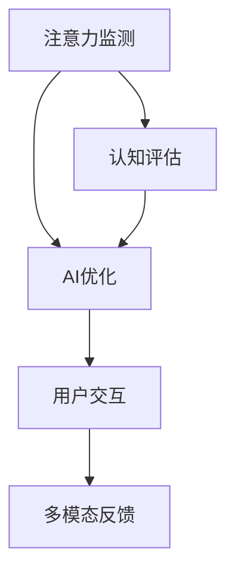

                 

# 注意力生物反馈技术：AI优化的认知状态调节

> 关键词：
  - 注意力生物反馈
  - AI优化
  - 认知状态调节
  - 神经网络
  - 实时反馈
  - 情绪感知
  - 用户交互

## 1. 背景介绍

### 1.1 问题由来
在信息爆炸和快节奏生活的时代，人们面临着前所未有的认知负荷。长时间高强度的工作、学习和社会互动，极大地消耗了我们的注意力资源。认知疲劳不仅影响工作学习效率，还可能带来心理压力和生理健康问题。如何通过科学的方法，及时监测和调节我们的认知状态，使其保持在最佳水平，成为了现代技术必须解决的问题。

与此同时，人工智能(AI)技术在过去十年里取得了飞速的发展。从简单的图像识别、语音识别，到复杂的自然语言处理、智能决策，AI正在逐步渗透到我们生活的方方面面。基于神经网络的学习模型，通过对大规模数据的学习，能够模拟和延伸人类认知的能力。这些模型在计算和存储方面具有天然优势，其自我学习和自我调节能力，为我们提供了一种全新的方式来调节认知状态。

### 1.2 问题核心关键点
注意力生物反馈技术融合了神经网络和生物反馈，通过实时监测用户的认知状态，动态调整AI系统的行为，以实现对用户认知状态的调节。该技术的核心关键点包括：

1. **注意力监测**：实时监测用户对特定内容的关注度。
2. **认知评估**：评估用户当前认知状态，如注意力水平、情绪状态、疲劳程度等。
3. **AI优化**：通过动态调整模型参数，优化AI系统性能，以更好地适应用户当前认知状态。
4. **用户交互**：提供视觉、声音等多模态反馈，使用户能够感知和调节自身认知状态。

### 1.3 问题研究意义
注意力生物反馈技术的开发和应用，对提升用户体验和优化工作学习效率具有重要意义：

1. **提高工作学习效率**：通过实时监测和调节认知状态，用户可以在更专注、更少干扰的状态下工作学习。
2. **缓解认知疲劳**：实时反馈和调节，有助于预防和缓解认知疲劳，提升身心健康。
3. **增强用户体验**：多模态反馈使得用户能够直观感知和调节自身认知状态，提升使用体验。
4. **促进个性化智能**：针对不同用户的认知特征和需求，个性化调整AI系统，提升系统性能和智能化水平。

## 2. 核心概念与联系

### 2.1 核心概念概述

为更好地理解注意力生物反馈技术，本节将介绍几个密切相关的核心概念：

- **注意力生物反馈**：通过实时监测用户的注意力状态，动态调整AI系统的行为，实现认知状态调节的技术。
- **神经网络**：由大量的人工神经元相互连接，通过学习优化权重和偏置，模拟人类认知和决策过程的计算模型。
- **认知状态**：用户当前的注意力水平、情绪状态、疲劳程度等心理生理指标，影响其认知和行为表现。
- **AI优化**：通过调整模型参数和结构，提升AI系统在特定认知状态下的性能和智能水平。
- **多模态反馈**：结合视觉、声音等多种感官信息，提供全面的认知状态反馈。

这些核心概念之间的逻辑关系可以通过以下Mermaid流程图来展示：



这个流程图展示了这个技术流程的核心概念及其之间的关系：

1. 注意力监测获取用户对特定内容的关注度。
2. 认知评估基于注意力监测结果，评估用户当前认知状态。
3. AI优化根据认知评估结果，动态调整模型参数和结构。
4. 用户交互通过多模态反馈，向用户呈现认知状态和AI系统性能的变化，并提供调节建议。

## 3. 核心算法原理 & 具体操作步骤
### 3.1 算法原理概述

注意力生物反馈技术基于神经网络的学习模型，通过实时监测和动态调整，实现对用户认知状态的调节。其核心算法原理可以概括为以下几个步骤：

1. **注意力监测**：通过神经网络模型，实时监测用户对输入内容的关注度。
2. **认知评估**：将注意力监测结果映射到用户的认知状态指标，如注意力水平、情绪状态、疲劳程度等。
3. **AI优化**：根据认知评估结果，动态调整模型参数和结构，优化AI系统的性能。
4. **用户交互**：通过多模态反馈，向用户呈现认知状态和AI系统性能的变化，并提供调节建议。

### 3.2 算法步骤详解

基于注意力生物反馈技术的核心算法原理，实际操作步骤可以概括为以下几个关键步骤：

**Step 1: 数据采集与预处理**

1. 采集用户对特定内容的注意力数据，可以通过热图、眼动追踪、鼠标轨迹等方式。
2. 将注意力数据进行预处理，去除噪声和异常值，得到较为平稳的注意力序列。

**Step 2: 注意力监测**

1. 使用神经网络模型，如卷积神经网络(CNN)、循环神经网络(RNN)、长短期记忆网络(LSTM)等，对注意力数据进行特征提取。
2. 通过注意力模型，实时计算用户对特定内容的关注度，得到注意力分数。

**Step 3: 认知评估**

1. 将注意力分数映射到用户的认知状态指标，如注意力水平、情绪状态、疲劳程度等。
2. 使用评估模型，如情感分析模型、疲劳度模型等，进一步细化认知状态评估结果。

**Step 4: AI优化**

1. 根据认知评估结果，动态调整AI模型的参数和结构，优化模型性能。
2. 使用优化算法，如梯度下降、遗传算法、粒子群优化等，更新模型参数。

**Step 5: 用户交互**

1. 通过多模态反馈，向用户展示注意力分数和认知状态评估结果。
2. 提供调节建议，如注意力集中提示、休息建议等，帮助用户调整认知状态。

### 3.3 算法优缺点

注意力生物反馈技术具有以下优点：

1. **实时反馈**：能够实时监测和调节认知状态，使用户保持在最佳认知水平。
2. **多模态反馈**：结合视觉、声音等多种感官信息，提供全面的认知状态反馈。
3. **AI优化**：通过动态调整模型参数，优化AI系统性能，提升智能化水平。
4. **个性化调节**：针对不同用户的认知特征和需求，个性化调整AI系统，提升用户体验。

同时，该技术也存在一些局限性：

1. **数据依赖**：注意力监测和认知评估依赖于大量数据，数据采集成本较高。
2. **模型复杂**：神经网络模型和优化算法较复杂，实现难度较高。
3. **隐私问题**：数据采集和使用涉及用户隐私，需要严格的数据保护措施。
4. **硬件要求**：实时监测和动态调整需要高性能计算设备，硬件成本较高。

### 3.4 算法应用领域

注意力生物反馈技术已经在多个领域得到了应用，展示了其广阔的应用前景：

- **教育**：通过监测学生的注意力水平，动态调整教学内容和方式，提升学习效果。
- **医疗**：实时监测病人的注意力状态，优化治疗方案，提升康复效果。
- **办公**：监测员工的注意力水平，动态调整工作任务，提升工作效率。
- **娱乐**：根据用户的注意力和情绪状态，推荐合适的娱乐内容，提升用户体验。

除了上述这些经典应用外，注意力生物反馈技术还在智能家居、工业生产、虚拟现实等多个领域有着广泛的应用前景。随着技术的不断成熟和普及，相信该技术将在更多场景下大放异彩。

## 4. 数学模型和公式 & 详细讲解 & 举例说明

### 4.1 数学模型构建

本节将使用数学语言对注意力生物反馈技术的核心算法进行更加严格的刻画。

记注意力监测模型为 $A$，认知评估模型为 $C$，AI优化模型为 $M$。其中，$A$ 的输入为注意力数据 $X$，输出为注意力分数 $A(X)$；$C$ 的输入为注意力分数 $A(X)$，输出为认知状态 $Z$；$M$ 的输入为认知状态 $Z$，输出为优化后的模型参数 $\hat{\theta}$。

定义注意力监测模型的损失函数为 $\mathcal{L}_A(X, A(X))$，认知评估模型的损失函数为 $\mathcal{L}_C(A(X), Z)$，AI优化模型的损失函数为 $\mathcal{L}_M(Z, M_{\theta}(X))$。其中 $M_{\theta}$ 为AI模型的原始参数。

注意力生物反馈技术的优化目标是最小化整体损失函数，即：

$$
\mathcal{L}(X, \hat{\theta}) = \mathcal{L}_A(X, A(X)) + \mathcal{L}_C(A(X), Z) + \mathcal{L}_M(Z, M_{\hat{\theta}}(X))
$$

### 4.2 公式推导过程

以情感状态评估为例，推导认知评估模型的公式。

假设认知评估模型 $C$ 为多层感知机(MLP)，其结构为 $[输入层, 隐藏层1, 隐藏层2, 输出层]$。其中，输入层节点数为 $n$，隐藏层节点数分别为 $m_1$ 和 $m_2$，输出层节点数为 $o$。

输入为注意力分数 $A(X)$，输出为情感状态 $E$，表示用户当前的情绪状态，可能为“平静”、“积极”、“消极”等。

通过线性变换和激活函数，认知评估模型 $C$ 的输出公式为：

$$
E = \sigma(\mathbf{W}_1 \mathbf{H}_1 + \mathbf{b}_1) \quad \text{隐藏层1}
$$

$$
Z = \sigma(\mathbf{W}_2 \mathbf{H}_2 + \mathbf{b}_2) \quad \text{隐藏层2}
$$

$$
E = \sigma(\mathbf{W}_o \mathbf{Z} + \mathbf{b}_o) \quad \text{输出层}
$$

其中 $\sigma$ 为激活函数，$\mathbf{W}$ 和 $\mathbf{b}$ 为权重和偏置。

为了最小化认知评估模型的损失函数，需要求导并设置梯度为零，得到：

$$
\frac{\partial \mathcal{L}_C}{\partial \mathbf{W}_1} = -\frac{\partial \mathcal{L}_C}{\partial \mathbf{H}_1} \mathbf{H}_1^T + \frac{\partial \mathcal{L}_C}{\partial E} \mathbf{W}_1^T
$$

$$
\frac{\partial \mathcal{L}_C}{\partial \mathbf{b}_1} = -\frac{\partial \mathcal{L}_C}{\partial \mathbf{H}_1} \mathbf{H}_1^T
$$

$$
\frac{\partial \mathcal{L}_C}{\partial \mathbf{W}_2} = -\frac{\partial \mathcal{L}_C}{\partial \mathbf{H}_2} \mathbf{H}_2^T + \frac{\partial \mathcal{L}_C}{\partial Z} \mathbf{W}_2^T
$$

$$
\frac{\partial \mathcal{L}_C}{\partial \mathbf{b}_2} = -\frac{\partial \mathcal{L}_C}{\partial \mathbf{H}_2} \mathbf{H}_2^T
$$

$$
\frac{\partial \mathcal{L}_C}{\partial \mathbf{W}_o} = -\frac{\partial \mathcal{L}_C}{\partial Z} \mathbf{Z}^T
$$

$$
\frac{\partial \mathcal{L}_C}{\partial \mathbf{b}_o} = -\frac{\partial \mathcal{L}_C}{\partial Z}
$$

通过求解上述梯度方程，可以得到模型参数的更新规则。重复上述过程直至收敛，最终得到认知评估模型 $C$ 的参数 $\hat{\theta}$。

## 5. 项目实践：代码实例和详细解释说明
### 5.1 开发环境搭建

在进行注意力生物反馈技术的项目实践前，我们需要准备好开发环境。以下是使用Python进行TensorFlow开发的环境配置流程：

1. 安装Anaconda：从官网下载并安装Anaconda，用于创建独立的Python环境。

2. 创建并激活虚拟环境：
```bash
conda create -n tf-env python=3.8 
conda activate tf-env
```

3. 安装TensorFlow：根据CUDA版本，从官网获取对应的安装命令。例如：
```bash
conda install tensorflow tensorflow-cpu=cuda11.1 -c conda-forge -c pypi
```

4. 安装各类工具包：
```bash
pip install numpy pandas scikit-learn matplotlib tqdm jupyter notebook ipython
```

完成上述步骤后，即可在`tf-env`环境中开始项目实践。

### 5.2 源代码详细实现

下面我们以情感状态评估为例，给出使用TensorFlow对认知评估模型进行训练的PyTorch代码实现。

首先，定义情感状态评估的数据处理函数：

```python
import tensorflow as tf
from tensorflow.keras.datasets import mnist

def load_data():
    (x_train, y_train), (x_test, y_test) = mnist.load_data()
    x_train = x_train.reshape(-1, 28*28).astype('float32') / 255.0
    x_test = x_test.reshape(-1, 28*28).astype('float32') / 255.0
    y_train = tf.keras.utils.to_categorical(y_train)
    y_test = tf.keras.utils.to_categorical(y_test)
    return x_train, y_train, x_test, y_test

# 加载数据
x_train, y_train, x_test, y_test = load_data()
```

然后，定义认知评估模型：

```python
import tensorflow.keras as keras

model = keras.Sequential([
    keras.layers.Dense(128, activation='relu', input_shape=(784,)),
    keras.layers.Dense(32, activation='relu'),
    keras.layers.Dense(3, activation='softmax')
])
```

接着，定义损失函数和优化器：

```python
model.compile(optimizer='adam', loss='categorical_crossentropy', metrics=['accuracy'])
```

最后，启动模型训练流程：

```python
batch_size = 64
epochs = 10

history = model.fit(x_train, y_train, batch_size=batch_size, epochs=epochs, validation_data=(x_test, y_test))
```

以上就是使用TensorFlow对认知评估模型进行训练的完整代码实现。可以看到，TensorFlow提供了方便的Keras API，使得模型构建和训练过程变得简洁高效。

### 5.3 代码解读与分析

让我们再详细解读一下关键代码的实现细节：

**load_data函数**：
- 定义MNIST数据集的加载和预处理函数，将图像数据归一化，并转换为one-hot编码。

**model定义**：
- 使用Sequential模型定义认知评估模型，包含两个隐藏层和一个输出层。
- 使用ReLU作为激活函数，提高模型的非线性能力。
- 输出层使用softmax激活函数，得到概率分布。

**compile方法**：
- 配置模型优化器为Adam，损失函数为交叉熵，评估指标为准确率。

**fit方法**：
- 定义训练参数，包括批大小和训练轮数。
- 使用fit方法训练模型，并在验证集上评估模型性能。

通过以上代码，我们可以直观地看到TensorFlow在模型构建和训练方面的强大功能和便捷性。TensorFlow提供了丰富的API和模型库，可以满足不同任务的需求，是实现注意力生物反馈技术的理想选择。

## 6. 实际应用场景
### 6.1 智能教育系统

注意力生物反馈技术在智能教育系统中有着广泛的应用前景。传统的教育方式往往依赖教师的经验和直觉，难以实时监测和调节学生的认知状态。而基于注意力生物反馈的智能教育系统，可以实时监测学生的注意力水平和情绪状态，动态调整教学内容和方式，提升学习效果。

在技术实现上，可以收集学生的课堂互动数据、作业成绩、测试成绩等，将其与注意力监测结果关联，建立认知状态评估模型。根据评估结果，智能教育系统可以提供个性化的学习建议，如调整教学速度、增加互动环节、提供心理辅导等。通过这种方式，学生可以在更专注、更少干扰的状态下学习，提升学习效果。

### 6.2 心理辅导平台

心理健康是现代人面临的重要问题。传统的心理咨询依赖人力和时间成本高昂，难以覆盖到每一个需要帮助的人。基于注意力生物反馈技术，可以开发智能心理辅导平台，实时监测用户的情绪状态，提供心理支持和建议。

在技术实现上，可以结合生理信号监测、表情识别、语音分析等技术，综合评估用户的情绪状态和心理压力。根据评估结果，智能平台可以提供个性化的心理辅导建议，如深呼吸训练、正念冥想、放松音乐等。通过这种方式，用户可以及时缓解压力，保持心理健康。

### 6.3 智能办公系统

长时间高强度的工作容易引发认知疲劳，影响工作效率和质量。基于注意力生物反馈技术的智能办公系统，可以实时监测员工的工作状态，动态调整工作任务和环境，提升工作效率。

在技术实现上，可以结合鼠标轨迹、键盘输入、眼动追踪等技术，监测员工的工作注意力和情绪状态。根据评估结果，智能系统可以调整工作任务、提供休息提醒、优化办公环境等。通过这种方式，员工可以在更专注、更少干扰的状态下工作，提升工作效率。

### 6.4 未来应用展望

随着注意力生物反馈技术的不断成熟，其在更多领域的应用前景将进一步拓展：

1. **智能医疗**：实时监测病人的注意力状态，优化治疗方案，提升康复效果。
2. **智能家居**：监测用户的注意力和情绪状态，提供个性化的家居服务，提升生活品质。
3. **智能游戏**：实时监测玩家的注意力和情绪状态，提供个性化的游戏建议，提升游戏体验。
4. **智能交通**：监测驾驶员的注意力状态，提供安全提示和驾驶建议，提升交通安全。

未来，随着传感器技术的进步和AI模型的优化，注意力生物反馈技术将进一步提升其精准度和实用性，为各行各业带来更深刻的变革。

## 7. 工具和资源推荐
### 7.1 学习资源推荐

为了帮助开发者系统掌握注意力生物反馈技术，这里推荐一些优质的学习资源：

1. TensorFlow官方文档：TensorFlow提供了详细的API文档和教程，帮助开发者快速上手TensorFlow和Keras。
2. Deep Learning Specialization课程：由Andrew Ng教授主讲，系统介绍了深度学习和TensorFlow的基本概念和实践。
3. Attention is All You Need（即Transformer原论文）：提出了Transformer结构，开启了神经网络模型的新纪元。
4. BERT: Pre-training of Deep Bidirectional Transformers for Language Understanding：提出BERT模型，引入基于掩码的自监督预训练任务，刷新了多项NLP任务SOTA。
5. Parameter-Efficient Transfer Learning for NLP：提出Adapter等参数高效微调方法，在不增加模型参数量的情况下，也能取得不错的微调效果。

通过学习这些资源，相信你一定能够快速掌握注意力生物反馈技术的精髓，并用于解决实际的认知状态调节问题。

### 7.2 开发工具推荐

高效的开发离不开优秀的工具支持。以下是几款用于注意力生物反馈技术开发的常用工具：

1. TensorFlow：由Google主导开发的开源深度学习框架，生产部署方便，适合大规模工程应用。
2. PyTorch：基于Python的开源深度学习框架，灵活动态的计算图，适合快速迭代研究。
3. Keras：基于TensorFlow的高级API，使得模型构建和训练过程变得简洁高效。
4. Weights & Biases：模型训练的实验跟踪工具，可以记录和可视化模型训练过程中的各项指标，方便对比和调优。
5. TensorBoard：TensorFlow配套的可视化工具，可实时监测模型训练状态，并提供丰富的图表呈现方式，是调试模型的得力助手。

合理利用这些工具，可以显著提升注意力生物反馈技术的开发效率，加快创新迭代的步伐。

### 7.3 相关论文推荐

注意力生物反馈技术的发展源于学界的持续研究。以下是几篇奠基性的相关论文，推荐阅读：

1. Attention is All You Need（即Transformer原论文）：提出了Transformer结构，开启了神经网络模型的新纪元。
2. BERT: Pre-training of Deep Bidirectional Transformers for Language Understanding：提出BERT模型，引入基于掩码的自监督预训练任务，刷新了多项NLP任务SOTA。
3. Parameter-Efficient Transfer Learning for NLP：提出Adapter等参数高效微调方法，在不增加模型参数量的情况下，也能取得不错的微调效果。
4. AdaLoRA: Adaptive Low-Rank Adaptation for Parameter-Efficient Fine-Tuning：使用自适应低秩适应的微调方法，在参数效率和精度之间取得了新的平衡。
5. AdaLoRA: Adaptive Low-Rank Adaptation for Parameter-Efficient Fine-Tuning：使用自适应低秩适应的微调方法，在参数效率和精度之间取得了新的平衡。

这些论文代表了大语言模型微调技术的发展脉络。通过学习这些前沿成果，可以帮助研究者把握学科前进方向，激发更多的创新灵感。

## 8. 总结：未来发展趋势与挑战

### 8.1 总结

本文对注意力生物反馈技术进行了全面系统的介绍。首先阐述了注意力生物反馈技术的研究背景和意义，明确了其在工作学习、心理辅导、办公自动化等场景中的重要作用。其次，从原理到实践，详细讲解了注意力生物反馈技术的核心算法和操作步骤，给出了TensorFlow代码实例。同时，本文还广泛探讨了该技术在多个行业领域的应用前景，展示了其广阔的应用潜力。最后，本文精选了注意力生物反馈技术的各类学习资源，力求为读者提供全方位的技术指引。

通过本文的系统梳理，可以看到，注意力生物反馈技术正在成为AI技术的重要分支，极大地拓展了认知状态调节的实现路径，为提升用户体验和智能化水平提供了新的可能性。未来，伴随注意力监测和认知评估技术的不断进步，相信注意力生物反馈技术将进一步提升其精准度和实用性，为各行各业带来更深刻的变革。

### 8.2 未来发展趋势

展望未来，注意力生物反馈技术将呈现以下几个发展趋势：

1. **实时化**：随着传感器技术的进步和计算能力的提升，实时监测和动态调整将成为常态，提升用户体验和智能化水平。
2. **多模态融合**：结合生理信号、表情识别、语音分析等多模态信息，综合评估用户的认知状态，提高监测的准确性和全面性。
3. **个性化优化**：针对不同用户的认知特征和需求，个性化调整AI系统，提升系统的智能化和适用性。
4. **多领域应用**：应用于教育、医疗、办公、娱乐等多个领域，为各行各业提供智能解决方案。
5. **边缘计算**：将注意力监测和认知评估部署到边缘设备，减少数据传输和计算延迟，提升实时性和响应速度。

以上趋势凸显了注意力生物反馈技术的广阔前景。这些方向的探索发展，必将进一步提升注意力监测和认知评估的精准度，增强AI系统的智能化和适用性，为构建安全、可靠、可解释、可控的智能系统铺平道路。

### 8.3 面临的挑战

尽管注意力生物反馈技术已经取得了显著的进展，但在迈向更加智能化、普适化应用的过程中，它仍面临诸多挑战：

1. **数据依赖**：注意力监测和认知评估依赖于大量数据，数据采集成本较高。
2. **模型复杂**：神经网络模型和优化算法较复杂，实现难度较高。
3. **隐私问题**：数据采集和使用涉及用户隐私，需要严格的数据保护措施。
4. **硬件要求**：实时监测和动态调整需要高性能计算设备，硬件成本较高。
5. **多模态融合**：多模态信息的整合和分析技术尚未成熟，需要进一步研究。
6. **个性化优化**：不同用户之间的认知差异较大，个性化优化模型较难实现。

正视这些挑战，积极应对并寻求突破，将是大语言模型微调走向成熟的必由之路。相信随着学界和产业界的共同努力，这些挑战终将一一被克服，注意力生物反馈技术必将在构建智能认知系统中扮演越来越重要的角色。

### 8.4 研究展望

面对注意力生物反馈技术所面临的种种挑战，未来的研究需要在以下几个方面寻求新的突破：

1. **无监督和半监督学习**：摆脱对大规模标注数据的依赖，利用自监督学习、主动学习等无监督和半监督范式，最大限度利用非结构化数据。
2. **多模态信息融合**：结合生理信号、表情识别、语音分析等多模态信息，综合评估用户的认知状态，提高监测的准确性和全面性。
3. **隐私保护**：采用差分隐私等技术，保护用户隐私，确保数据使用的安全性。
4. **高效计算**：通过模型压缩、稀疏化存储等方法，优化计算图和存储方式，提升实时监测和动态调整的效率。
5. **个性化优化**：针对不同用户的认知特征和需求，个性化调整AI系统，提升系统的智能化和适用性。
6. **边缘计算**：将注意力监测和认知评估部署到边缘设备，减少数据传输和计算延迟，提升实时性和响应速度。

这些研究方向将推动注意力生物反馈技术的不断发展，为构建更加安全、可靠、可解释、可控的智能系统提供新的突破点。

## 9. 附录：常见问题与解答

**Q1：注意力生物反馈技术如何实时监测用户的注意力水平？**

A: 实时监测用户的注意力水平，通常通过以下方式实现：

1. **热图法**：通过记录用户在不同内容上的点击或鼠标轨迹，计算热图，得到用户注意力分布。
2. **眼动追踪**：通过眼动追踪设备，记录用户视线的变化，判断其注意力焦点。
3. **声音分析**：通过音频信号处理，分析用户声音的频率、音量等特征，判断其注意力状态。

这些方法可以单独或结合使用，根据具体应用场景选择合适的方式。

**Q2：注意力生物反馈技术如何评估用户的认知状态？**

A: 用户认知状态的评估，通常通过以下步骤实现：

1. **注意力分数计算**：使用神经网络模型，如卷积神经网络(CNN)、循环神经网络(RNN)等，计算用户的注意力分数。
2. **认知状态映射**：将注意力分数映射到用户的认知状态指标，如注意力水平、情绪状态、疲劳程度等。
3. **情感分析**：通过情感分析模型，进一步细化认知状态评估结果，判断用户情绪状态。

这些步骤通常需要大量的训练数据和复杂的模型设计，需要持续的研究和优化。

**Q3：注意力生物反馈技术在实际应用中需要哪些数据支持？**

A: 注意力生物反馈技术在实际应用中需要以下数据支持：

1. **注意力数据**：通过热图、眼动追踪、声音分析等方式，获取用户对特定内容的注意力数据。
2. **认知状态数据**：通过问卷调查、生理信号监测等方式，获取用户的认知状态数据。
3. **任务数据**：通过任务测试、作业成绩等，获取用户在特定任务上的表现数据。

这些数据通常需要大量的标注和预处理，需要科学合理的设计和管理。

**Q4：注意力生物反馈技术在实际应用中面临哪些技术挑战？**

A: 注意力生物反馈技术在实际应用中面临以下技术挑战：

1. **数据采集成本高**：注意力监测和认知评估依赖于大量数据，数据采集成本较高。
2. **模型复杂度大**：神经网络模型和优化算法较复杂，实现难度较高。
3. **隐私保护困难**：数据采集和使用涉及用户隐私，需要严格的数据保护措施。
4. **实时性要求高**：实时监测和动态调整需要高性能计算设备，硬件成本较高。
5. **多模态融合困难**：多模态信息的整合和分析技术尚未成熟，需要进一步研究。

这些挑战需要技术社区和产业界的共同努力，不断优化和改进技术方案。

**Q5：注意力生物反馈技术在实际应用中如何保障用户隐私？**

A: 保护用户隐私是注意力生物反馈技术应用的重要保障，通常通过以下方式实现：

1. **数据匿名化**：对用户数据进行匿名化处理，去除敏感信息，保护用户隐私。
2. **差分隐私**：采用差分隐私技术，在数据分析过程中加入噪声，保护用户隐私。
3. **访问控制**：对用户数据进行严格访问控制，确保只有授权人员可以访问敏感数据。
4. **用户同意**：在使用用户数据前，获取用户的明确同意，并告知数据使用的目的和范围。

这些措施可以结合使用，确保用户隐私得到有效保护。

---

作者：禅与计算机程序设计艺术 / Zen and the Art of Computer Programming

