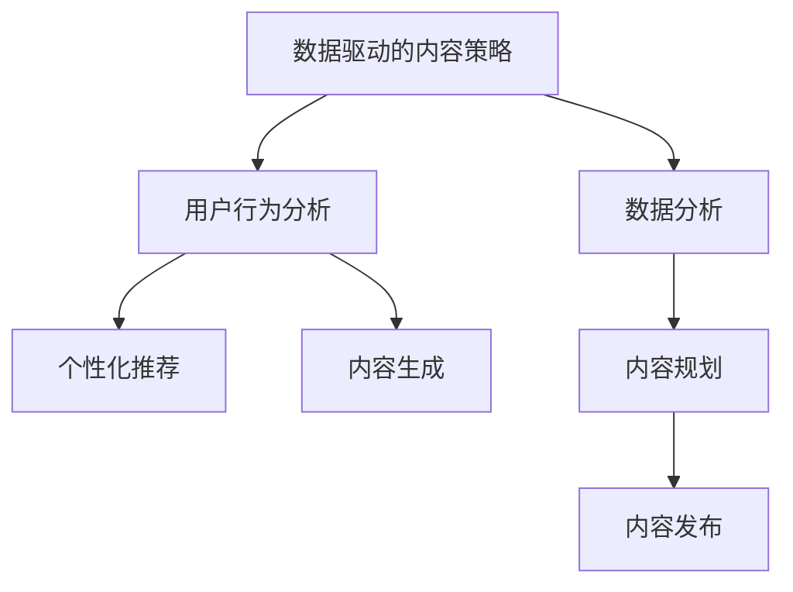

                 

# 注意力经济与内容策略规划与实践：为受众创建有影响力的内容

> 关键词：注意力经济,内容策略,数据驱动,用户行为,个性化推荐,内容生成

## 1. 背景介绍

### 1.1 问题由来

随着互联网技术的飞速发展，信息过载和注意力稀缺已经成为不可回避的现实。如何在海量信息中脱颖而出，吸引并保持用户的注意力，成为内容创作者和平台运营商共同面临的重大挑战。传统的内容策略主要依赖于经验判断和人工编辑，往往无法精准捕捉用户的真实需求和行为模式，导致资源浪费和用户流失。

为了解决这一问题，数据驱动的内容策略应运而生。借助先进的数据挖掘和机器学习技术，可以有效分析用户行为，预测用户偏好，从而制定更加精准、高效的内容策略，最大化用户参与度和价值转化率。同时，内容生成技术也取得了显著进展，能够根据用户偏好自动生成高质量的内容，实现内容智能化生产。

本文旨在深入探讨基于数据驱动的内容策略，以及如何通过先进的技术手段，实现内容的高效规划和智能化生成，为受众创建有影响力的内容。

### 1.2 问题核心关键点

本文聚焦于以下几个核心关键点：
- 数据驱动的内容策略：如何利用数据挖掘和机器学习技术，分析用户行为，预测用户偏好。
- 用户行为分析：用户如何获取、阅读和互动内容，以及这些行为背后的规律和模式。
- 个性化推荐：如何根据用户历史行为和实时兴趣，推送定制化的内容。
- 内容生成技术：如何利用先进的技术手段，自动化生成高质量的内容。

## 2. 核心概念与联系

### 2.1 核心概念概述

为更好地理解基于数据驱动的内容策略，本节将介绍几个密切相关的核心概念：

- 数据驱动的内容策略（Data-Driven Content Strategy）：通过数据挖掘和机器学习技术，分析用户行为，预测用户需求，制定内容发布和运营策略的过程。
- 用户行为分析（User Behavior Analysis）：通过数据收集和分析，揭示用户如何获取、阅读和互动内容，以及这些行为背后的规律和模式。
- 个性化推荐（Personalized Recommendation）：根据用户历史行为和实时兴趣，推送定制化的内容，提升用户参与度和满意度。
- 内容生成（Content Generation）：通过算法自动生成文本、图像、视频等形式的内容，提高内容生产效率和多样化程度。

这些核心概念之间的逻辑关系可以通过以下Mermaid流程图来展示：



这个流程图展示了大数据驱动内容策略的核心理念：
1. 通过数据驱动，制定内容策略。
2. 分析用户行为，预测用户偏好。
3. 结合个性化推荐和内容生成技术，实现内容智能化生产。
4. 通过数据分析和内容规划，优化内容发布效果。

## 3. 核心算法原理 & 具体操作步骤
### 3.1 算法原理概述

数据驱动的内容策略涉及多方面的技术和方法，主要包括数据挖掘、用户行为分析、个性化推荐和内容生成等。其核心思想是通过数据分析和机器学习，挖掘用户行为模式，预测用户偏好，制定高效的内容策略。

### 3.2 算法步骤详解

#### 3.2.1 数据收集与处理

数据驱动的内容策略首先需要收集用户行为数据，包括但不限于：
- 浏览记录：用户访问过的网页、文章、视频等。
- 交互数据：用户在页面上的点击、滑动、评论、分享等互动行为。
- 搜索记录：用户输入的搜索关键词、使用的搜索工具等。
- 交易数据：用户的购买记录、支付记录等。

这些数据通常以结构化或非结构化的形式存储在数据库或日志文件中，需要通过爬虫、API接口等方式进行收集。

#### 3.2.2 数据分析与建模

数据收集完成后，需要对数据进行清洗、筛选、归一化等预处理，以便于后续分析。常用的数据处理方法包括：
- 数据清洗：去除噪声、重复、异常值等数据。
- 数据归一化：将不同特征的数据转换到相同的量纲。
- 特征工程：构造新的特征，提升模型的预测能力。

处理完成后，可以进行初步的分析，探索数据的基本规律和趋势。常用的分析方法包括：
- 可视化分析：使用图表、热力图等可视化工具，展示数据特征和趋势。
- 统计分析：使用均值、方差、频率等统计指标，评估数据的分布情况。
- 关联分析：使用Apriori算法、关联规则挖掘等方法，探索不同特征之间的关联关系。

#### 3.2.3 用户行为建模

用户行为分析的核心在于构建用户行为模型，揭示用户行为的规律和模式。常用的用户行为模型包括：
- 用户兴趣模型：使用协同过滤、矩阵分解等方法，分析用户对不同内容的高低兴趣程度。
- 用户行为轨迹模型：使用序列模式挖掘、时间序列分析等方法，揭示用户的访问顺序、停留时间等行为轨迹。
- 用户社交网络模型：使用图神经网络等方法，分析用户的社交关系和社交影响力。

#### 3.2.4 个性化推荐

个性化推荐系统可以根据用户历史行为和实时兴趣，推送定制化的内容。常用的推荐算法包括：
- 协同过滤：基于用户和内容的相似度，推荐相关内容。
- 基于内容的推荐：分析内容特征，推荐相似内容。
- 混合推荐：结合多种推荐算法，提升推荐效果。

#### 3.2.5 内容生成

内容生成技术可以通过算法自动生成高质量的内容，提升内容生产效率和多样化程度。常用的内容生成技术包括：
- 文本生成：使用GPT、BERT等模型，自动生成文章、新闻、评论等文本内容。
- 图像生成：使用GAN、VAE等模型，自动生成图片、图标、漫画等视觉内容。
- 视频生成：使用StyleGAN、Time-Slice等模型，自动生成视频、动画、广告等多媒体内容。

### 3.3 算法优缺点

基于数据驱动的内容策略具有以下优点：
- 数据驱动：通过数据分析和机器学习，制定科学合理的内容策略。
- 用户导向：以用户需求和行为为导向，提升用户体验和满意度。
- 高效精准：自动化内容生成和推荐，提高内容生产效率和精准度。
- 实时响应：动态调整内容策略，及时响应市场变化和用户需求。

同时，该方法也存在一定的局限性：
- 数据隐私：用户行为数据涉及隐私保护，需要严格遵守法律法规。
- 数据质量：数据质量直接影响分析结果和策略制定，需确保数据准确、全面。
- 模型复杂：推荐和生成算法通常较为复杂，需要高性能计算资源支持。
- 用户多样性：不同用户有不同的偏好和需求，个性化推荐难以覆盖所有用户。

尽管存在这些局限性，但就目前而言，数据驱动的内容策略已成为内容创作和运营的主要手段。未来相关研究的重点在于如何进一步提升数据质量和模型性能，同时兼顾用户隐私和道德伦理。

### 3.4 算法应用领域

数据驱动的内容策略已经在内容平台、电商、社交媒体等众多领域得到了广泛应用，具体包括：
- 内容平台：如YouTube、抖音等，通过个性化推荐和内容生成，提升用户黏性和参与度。
- 电商网站：如Amazon、淘宝等，通过推荐系统优化商品展示和推荐，提高转化率和满意度。
- 社交媒体：如微博、微信等，通过数据分析和行为建模，优化用户互动和内容传播效果。
- 在线教育：如Coursera、Khan Academy等，通过个性化推荐和内容生成，提升学习体验和效果。

## 4. 数学模型和公式 & 详细讲解  
### 4.1 数学模型构建

为了更系统地理解数据驱动的内容策略，本节将使用数学语言对相关模型进行深入推导。

#### 4.1.1 用户兴趣模型

用户兴趣模型是预测用户对不同内容兴趣程度的模型，通常使用协同过滤或矩阵分解方法。以下以协同过滤为例，介绍用户兴趣模型的构建过程：

假设用户集合为 $U=\{u_1,u_2,...,u_N\}$，内容集合为 $V=\{v_1,v_2,...,v_M\}$，用户对内容的评分矩阵为 $R \in \mathbb{R}^{N \times M}$，其中 $R_{iu}$ 表示用户 $u_i$ 对内容 $v_u$ 的评分。

用户兴趣模型可以表示为：
$$
\hat{R}_{iu} = \text{Embed}(u) \cdot \text{Embed}(v_u)
$$
其中，$\text{Embed}(u)$ 和 $\text{Embed}(v_u)$ 分别为用户 $u$ 和内容 $v_u$ 的嵌入表示，$\cdot$ 表示点积。

协同过滤算法通过计算用户和内容之间的相似度，找到最相似的内容推荐给用户。具体算法流程如下：
1. 对于每个用户 $u_i$，计算其与其他用户 $u_j$ 的相似度：
$$
\text{sim}(u_i,u_j) = \text{Embed}(u_i) \cdot \text{Embed}(u_j)
$$
2. 对于每个用户 $u_i$，找到与其相似度最高的 $K$ 个用户 $u_{j_1},...,u_{j_K}$。
3. 对于每个内容 $v_u$，计算其与相似用户 $u_{j_1},...,u_{j_K}$ 的评分平均值：
$$
\text{avg}(v_u) = \frac{1}{K}\sum_{k=1}^K \hat{R}_{j_ku}
$$
4. 对于每个用户 $u_i$，根据评分平均值生成内容推荐：
$$
\text{Recommend}(v_u) = \text{avg}(v_u) \cdot \text{Embed}(u_i)
$$

#### 4.1.2 内容生成模型

内容生成模型通常使用语言模型，如GPT、BERT等。以下以GPT为例，介绍内容生成模型的构建过程：

假设文本序列为 $X=\{x_1,x_2,...,x_T\}$，其中 $x_t$ 表示第 $t$ 个单词或子序列。内容生成模型可以表示为：
$$
P(X|X_{<t}) = \prod_{t=1}^T P(x_t|x_{<t})
$$
其中，$P(x_t|x_{<t})$ 表示给定前 $t-1$ 个单词或子序列，第 $t$ 个单词或子序列的概率。

GPT模型通过自回归方式，生成文本序列。其核心思想是，每个单词或子序列的条件概率 $P(x_t|x_{<t})$ 可以通过训练得到的语言模型参数 $W$ 进行预测。具体算法流程如下：
1. 初始化模型参数 $W$，并输入第一个单词或子序列 $x_1$。
2. 对于每个位置 $t$，根据前 $t-1$ 个单词或子序列 $x_{<t}$，预测下一个单词或子序列 $x_t$ 的概率分布。
3. 通过采样或搜索，选择下一个单词或子序列 $x_t$。
4. 重复步骤2和3，直到生成完整的文本序列 $X$。

## 5. 项目实践：代码实例和详细解释说明
### 5.1 开发环境搭建

在进行数据驱动的内容策略实践前，我们需要准备好开发环境。以下是使用Python进行TensorFlow开发的环境配置流程：

1. 安装Anaconda：从官网下载并安装Anaconda，用于创建独立的Python环境。

2. 创建并激活虚拟环境：
```bash
conda create -n tf-env python=3.8 
conda activate tf-env
```

3. 安装TensorFlow：根据CUDA版本，从官网获取对应的安装命令。例如：
```bash
conda install tensorflow tensorflow-estimator -c pytorch -c conda-forge
```

4. 安装Flask：用于构建API接口，方便数据和模型交互。
```bash
pip install flask
```

5. 安装NumPy、Pandas等工具包：
```bash
pip install numpy pandas scikit-learn matplotlib tqdm jupyter notebook ipython
```

完成上述步骤后，即可在`tf-env`环境中开始项目实践。

### 5.2 源代码详细实现

下面我们以推荐系统为例，给出使用TensorFlow实现个性化推荐的PyTorch代码实现。

首先，定义推荐系统的模型：

```python
import tensorflow as tf
from tensorflow.keras.layers import Input, Embedding, DotProduct

# 用户嵌入层
user_input = Input(shape=(1,), name='user')
user_embedding = Embedding(input_dim=N, output_dim=D, name='user_embedding')(user_input)
# 内容嵌入层
content_input = Input(shape=(M,), name='content')
content_embedding = Embedding(input_dim=M, output_dim=D, name='content_embedding')(content_input)
# 计算相似度
similarity = DotProduct([user_embedding, content_embedding])
```

然后，定义损失函数和优化器：

```python
from tensorflow.keras.losses import MeanSquaredError

# 计算损失
loss = MeanSquaredError()(y_true, similarity)
# 定义优化器
optimizer = tf.keras.optimizers.Adam(learning_rate=0.001)
```

接着，定义训练和评估函数：

```python
@tf.function
def train_step(user_input, content_input, label):
    with tf.GradientTape() as tape:
        similarity = model([user_input, content_input])
        loss_value = loss(labels=label, predictions=similarity)
    gradients = tape.gradient(loss_value, model.trainable_variables)
    optimizer.apply_gradients(zip(gradients, model.trainable_variables))

@tf.function
def evaluate(model, test_data):
    similarity = model(test_data)
    return similarity
```

最后，启动训练流程并在测试集上评估：

```python
epochs = 10
batch_size = 32

for epoch in range(epochs):
    for batch in train_data:
        train_step(user_input=batch['user'], content_input=batch['content'], label=batch['label'])
    test_similarity = evaluate(model, test_data)
    print(f'Epoch {epoch+1}, test similarity: {test_similarity.numpy()}')
```

以上就是使用TensorFlow实现个性化推荐系统的完整代码实现。可以看到，TensorFlow的高级API使得模型构建和训练变得简单高效。

### 5.3 代码解读与分析

让我们再详细解读一下关键代码的实现细节：

**模型定义**：
- `Input`：定义输入层，`user_input` 和 `content_input` 分别表示用户ID和内容ID。
- `Embedding`：定义嵌入层，将用户ID和内容ID映射为高维向量。
- `DotProduct`：定义点积层，计算用户和内容的相似度。

**损失函数和优化器**：
- `MeanSquaredError`：定义均方误差损失函数，用于计算推荐误差。
- `Adam`：定义Adam优化器，用于更新模型参数。

**训练和评估函数**：
- `train_step`：定义训练函数，计算损失和梯度，并更新模型参数。
- `evaluate`：定义评估函数，计算测试集上的相似度。

**训练流程**：
- 循环迭代`epochs`次，每次迭代遍历训练集`train_data`。
- 在每个批次上调用`train_step`函数进行训练。
- 在测试集上调用`evaluate`函数进行评估，并输出测试集上的相似度。

可以看出，TensorFlow的高级API和函数式编程特性，使得模型构建和训练过程简洁高效。开发者可以更专注于模型设计和算法实现，而不必过多关注底层的细节。

当然，工业级的系统实现还需考虑更多因素，如模型的保存和部署、超参数的自动搜索、更灵活的任务适配层等。但核心的内容策略流程基本与此类似。

## 6. 实际应用场景
### 6.1 电商网站个性化推荐

基于数据驱动的内容策略，电商网站可以通过个性化推荐系统，提升商品展示和推荐的精准度，提高用户的购买转化率。

在技术实现上，可以收集用户的浏览、点击、购买等行为数据，构建用户兴趣模型和行为轨迹模型，基于这些模型生成个性化的商品推荐列表。推荐系统可以根据用户历史行为和实时兴趣，实时更新推荐内容，实现个性化推荐。

### 6.2 在线教育个性化学习

在线教育平台可以通过个性化推荐系统，提升学习资源的匹配度和用户体验。

在技术实现上，可以收集用户的浏览、点击、学习时间等行为数据，构建用户兴趣模型和行为轨迹模型，基于这些模型生成个性化的学习资源推荐。推荐系统可以根据用户历史行为和实时兴趣，实时更新推荐内容，实现个性化学习推荐。

### 6.3 社交媒体内容推广

社交媒体平台可以通过数据驱动的内容策略，优化内容的推广效果，提升用户互动和平台活跃度。

在技术实现上，可以收集用户的点赞、评论、分享等行为数据，构建用户兴趣模型和行为轨迹模型，基于这些模型生成个性化内容推荐。推荐系统可以根据用户历史行为和实时兴趣，实时更新推荐内容，实现个性化内容推广。

## 7. 工具和资源推荐
### 7.1 学习资源推荐

为了帮助开发者系统掌握数据驱动的内容策略的理论基础和实践技巧，这里推荐一些优质的学习资源：

1. 《深度学习与数据挖掘》系列博文：由大模型技术专家撰写，深入浅出地介绍了深度学习在数据挖掘中的应用，包括用户行为分析、推荐系统等。

2. CS231n《深度学习基础》课程：斯坦福大学开设的深度学习明星课程，涵盖深度学习基础和高级应用，适合初学者和进阶者。

3. 《自然语言处理与深度学习》书籍：深度学习在自然语言处理中的应用，全面介绍了语言模型、推荐系统、文本生成等前沿话题。

4. HuggingFace官方文档：TensorFlow的官方文档，提供了丰富的API接口和样例代码，是上手实践的必备资料。

5. Kaggle竞赛平台：全球最大的数据竞赛平台，提供大量开源数据集和竞赛任务，助力开发者锻炼技能，积累经验。

通过对这些资源的学习实践，相信你一定能够快速掌握数据驱动的内容策略的精髓，并用于解决实际的NLP问题。

### 7.2 开发工具推荐

高效的开发离不开优秀的工具支持。以下是几款用于数据驱动的内容策略开发的常用工具：

1. TensorFlow：基于Python的开源深度学习框架，灵活的计算图和丰富的API接口，适合快速迭代研究。TensorFlow的高级API使得模型构建和训练变得简单高效。

2. PyTorch：基于Python的开源深度学习框架，灵活动态的计算图和强大的GPU支持，适合高性能计算和大规模模型训练。

3. Scikit-learn：基于Python的机器学习库，提供丰富的算法和工具，方便数据处理和模型训练。

4. Weights & Biases：模型训练的实验跟踪工具，可以记录和可视化模型训练过程中的各项指标，方便对比和调优。

5. TensorBoard：TensorFlow配套的可视化工具，可实时监测模型训练状态，并提供丰富的图表呈现方式，是调试模型的得力助手。

6. Jupyter Notebook：交互式Python开发环境，支持代码、文本和图表的混合展示，方便协作和分享。

合理利用这些工具，可以显著提升数据驱动的内容策略的开发效率，加快创新迭代的步伐。

### 7.3 相关论文推荐

数据驱动的内容策略发展源于学界的持续研究。以下是几篇奠基性的相关论文，推荐阅读：

1. "Collaborative Filtering for Implicit Feedback Datasets"：提出协同过滤算法，基于用户和内容的相似度进行推荐。

2. "Generating Sequences With Recurrent Neural Networks"：提出循环神经网络，用于序列数据的建模和生成。

3. "Learning Word Embeddings via Dependency Parse Trees"：提出词嵌入方法，将词义信息转化为高维向量。

4. "Attention Is All You Need"：提出Transformer模型，引入注意力机制，提升序列建模能力。

5. "Exploring the Limits of Transfer Learning with a Unified Text-to-Text Transformer"：提出BERT模型，引入掩码语言模型任务，提升预训练语言模型的通用性。

这些论文代表了大数据驱动内容策略的发展脉络。通过学习这些前沿成果，可以帮助研究者把握学科前进方向，激发更多的创新灵感。

## 8. 总结：未来发展趋势与挑战

### 8.1 总结

本文对基于数据驱动的内容策略进行了全面系统的介绍。首先阐述了数据驱动内容策略的研究背景和意义，明确了个性化推荐、内容生成等技术在提升用户体验和平台价值方面的独特价值。其次，从原理到实践，详细讲解了用户行为分析、个性化推荐、内容生成等核心技术的数学原理和操作步骤，给出了推荐系统的完整代码实例。同时，本文还广泛探讨了数据驱动内容策略在电商、教育、社交媒体等多个行业领域的应用前景，展示了数据驱动内容策略的广泛应用和巨大潜力。此外，本文精选了数据驱动内容策略的学习资源和开发工具，力求为读者提供全方位的技术指引。

通过本文的系统梳理，可以看到，数据驱动内容策略正在成为内容创作和运营的主要手段，极大地提升了用户体验和平台价值。未来，伴随数据质量提升和算法优化，基于数据驱动的内容策略必将进一步推动内容创作和运营的智能化进程，为构建人机协同的智能内容生态铺平道路。

### 8.2 未来发展趋势

展望未来，数据驱动内容策略将呈现以下几个发展趋势：

1. 数据质量提升：随着数据采集和处理技术的进步，数据质量将显著提升，用户行为模型的预测精度也将随之提高。

2. 模型算法优化：未来的推荐算法将更加复杂，结合深度学习、强化学习、自然语言处理等技术，提升推荐效果。

3. 跨领域数据融合：内容生成将更多地结合多模态数据，如文本、图像、语音等，实现更加全面、多样化的内容生产。

4. 用户个性化增强：未来的个性化推荐系统将更加精细，结合用户的实时行为和兴趣，动态生成个性化内容。

5. 模型可解释性增强：未来的推荐和生成模型将更加透明，具备可解释性，便于用户理解和信任。

6. 算法自动化优化：未来的内容策略将更多地结合自动化优化技术，如超参数搜索、模型压缩等，提升模型效率和性能。

以上趋势凸显了数据驱动内容策略的广阔前景。这些方向的探索发展，必将进一步提升内容策略的智能化水平，为构建人机协同的智能内容生态提供新的动力。

### 8.3 面临的挑战

尽管数据驱动内容策略已经取得了瞩目成就，但在迈向更加智能化、普适化应用的过程中，它仍面临诸多挑战：

1. 数据隐私保护：用户行为数据涉及隐私保护，需要严格遵守法律法规。如何保护用户隐私，同时充分利用数据价值，是未来的一大难题。

2. 数据质量提升：数据采集和处理技术需要进一步提升，保证数据准确、全面，以提升用户行为模型的预测精度。

3. 算法复杂度提升：未来的推荐和生成算法将更加复杂，需要高性能计算资源支持。如何优化算法，提高计算效率，是未来的一大挑战。

4. 用户个性化不足：虽然个性化推荐取得了一定进展，但仍难以覆盖所有用户，如何实现更加精细化的个性化推荐，是未来的一大挑战。

5. 内容多样性不足：当前内容生成仍以通用性文本为主，如何实现更加多样化的内容生成，是未来的一大挑战。

6. 算法透明性不足：推荐和生成算法通常较为复杂，难以解释其内部工作机制，如何提升算法的透明性，增强用户信任，是未来的一大挑战。

这些挑战凸显了数据驱动内容策略在推广应用中的复杂性，未来需要从数据、算法、工程、伦理等多个维度协同发力，方能真正实现智能化内容策略的目标。

### 8.4 研究展望

面对数据驱动内容策略所面临的挑战，未来的研究需要在以下几个方面寻求新的突破：

1. 探索数据隐私保护技术：结合隐私保护技术，如差分隐私、联邦学习等，保护用户隐私，同时充分利用数据价值。

2. 研究高质量数据采集和处理技术：提升数据采集和处理技术，保证数据准确、全面，提升用户行为模型的预测精度。

3. 开发高效推荐算法：结合深度学习、强化学习、自然语言处理等技术，优化推荐算法，提高计算效率和推荐效果。

4. 研究多样化的内容生成技术：结合多模态数据，实现文本、图像、视频等多形式的内容生成，提升内容的多样性和丰富性。

5. 增强算法的透明性和可解释性：结合可解释性技术，如因果推断、透明度提升等，增强算法的透明性和可解释性，增强用户信任。

这些研究方向的探索，必将引领数据驱动内容策略技术迈向更高的台阶，为构建人机协同的智能内容生态提供新的动力。面向未来，数据驱动内容策略还需要与其他人工智能技术进行更深入的融合，如知识表示、因果推理、强化学习等，多路径协同发力，共同推动内容创作和运营的智能化进程。只有勇于创新、敢于突破，才能不断拓展内容策略的边界，让智能内容技术更好地造福人类社会。

## 9. 附录：常见问题与解答

**Q1：数据驱动的内容策略是否适用于所有NLP任务？**

A: 数据驱动的内容策略在大多数NLP任务上都能取得不错的效果，特别是对于数据量较小的任务。但对于一些特定领域的任务，如医学、法律等，仅仅依靠通用语料预训练的模型可能难以很好地适应。此时需要在特定领域语料上进一步预训练，再进行微调，才能获得理想效果。此外，对于一些需要时效性、个性化很强的任务，如对话、推荐等，微调方法也需要针对性的改进优化。

**Q2：如何进行数据驱动的内容策略建模？**

A: 数据驱动的内容策略建模主要分为以下几个步骤：
1. 数据收集：收集用户行为数据，如浏览记录、交互数据、搜索记录、交易数据等。
2. 数据预处理：对收集到的数据进行清洗、筛选、归一化等预处理，确保数据质量。
3. 数据分析：使用可视化分析、统计分析、关联分析等方法，探索数据特征和规律。
4. 用户行为建模：构建用户兴趣模型和行为轨迹模型，揭示用户行为的规律和模式。
5. 个性化推荐：使用协同过滤、基于内容的推荐、混合推荐等算法，根据用户历史行为和实时兴趣，生成个性化内容。

这些步骤可以采用Python、R、TensorFlow等工具实现，通常需要综合运用统计学、机器学习、深度学习等技术。

**Q3：数据驱动的内容策略有哪些优缺点？**

A: 数据驱动的内容策略具有以下优点：
- 数据驱动：通过数据分析和机器学习，制定科学合理的内容策略。
- 用户导向：以用户需求和行为为导向，提升用户体验和满意度。
- 高效精准：自动化内容生成和推荐，提高内容生产效率和精准度。
- 实时响应：动态调整内容策略，及时响应市场变化和用户需求。

同时，该方法也存在一定的局限性：
- 数据隐私：用户行为数据涉及隐私保护，需要严格遵守法律法规。
- 数据质量：数据质量直接影响分析结果和策略制定，需确保数据准确、全面。
- 模型复杂：推荐和生成算法通常较为复杂，需要高性能计算资源支持。
- 用户多样性：不同用户有不同的偏好和需求，个性化推荐难以覆盖所有用户。

尽管存在这些局限性，但就目前而言，数据驱动的内容策略已成为内容创作和运营的主要手段。未来相关研究的重点在于如何进一步提升数据质量和模型性能，同时兼顾用户隐私和道德伦理。

**Q4：如何优化数据驱动的内容策略？**

A: 优化数据驱动的内容策略可以从以下几个方面入手：
1. 数据质量提升：提升数据采集和处理技术，保证数据准确、全面，提升用户行为模型的预测精度。
2. 算法优化：结合深度学习、强化学习、自然语言处理等技术，优化推荐算法，提高计算效率和推荐效果。
3. 用户个性化增强：结合用户的实时行为和兴趣，动态生成个性化内容，提升用户体验。
4. 模型透明性增强：增强算法的透明性和可解释性，增强用户信任。
5. 多模态数据融合：结合文本、图像、语音等多模态数据，实现更加全面、多样化的内容生成。
6. 跨领域数据融合：结合不同领域的数据，提升内容的多样性和丰富性。

这些优化方向需要从数据、算法、工程、伦理等多个维度协同发力，方能真正实现智能化内容策略的目标。

**Q5：如何评估数据驱动的内容策略效果？**

A: 评估数据驱动的内容策略效果可以从以下几个方面入手：
1. 用户满意度：通过调查问卷、用户反馈等方式，评估用户对推荐内容的满意度。
2. 用户参与度：通过点击率、停留时间、互动率等指标，评估用户对推荐内容的参与度。
3. 业务效果：通过转化率、营收、留存率等指标，评估推荐系统对业务效果的提升。
4. 内容多样性：通过内容分布、用户覆盖率等指标，评估内容策略的多样性和覆盖面。
5. 算法效果：通过损失函数、准确率、召回率等指标，评估推荐和生成算法的预测效果。

这些评估指标需要结合具体的业务场景和用户需求，灵活选择和使用，以全面评估内容策略的效果。

---

作者：禅与计算机程序设计艺术 / Zen and the Art of Computer Programming

