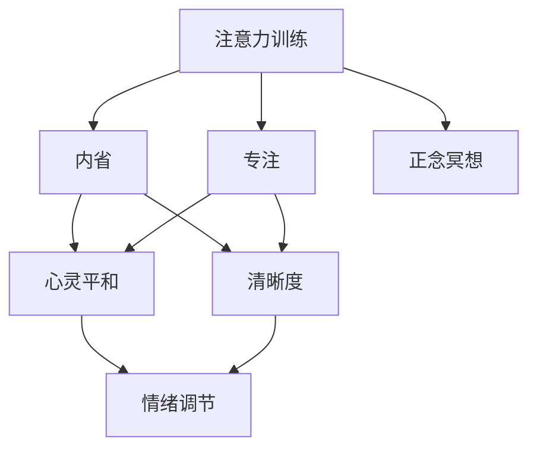

                 

# 注意力训练与正念冥想：通过内省和专注增强心灵平和与清晰度

> 关键词：注意力训练, 正念冥想, 内省, 专注, 心灵平和, 清晰度

## 1. 背景介绍

### 1.1 问题由来
随着科技的飞速发展，人们的生活节奏日益加快，工作与生活的界限变得模糊。心理压力和焦虑感普遍存在，影响着人们的心理健康和幸福感。在这种情况下，如何通过简单、有效的训练方法，提升个体的心理素质，增强心灵平和与清晰度，成为了当下研究的热点。

注意力训练和正念冥想是两种被广泛应用于提升心理健康的技术。它们通过调节注意力、内省和专注等心理状态，帮助个体摆脱焦虑、压力，提升整体心理健康水平。本文将详细介绍这两种技术的原理、实施步骤和实际应用，希望能为读者提供一种通过科技手段进行心灵修炼的途径。

### 1.2 问题核心关键点
注意力训练和正念冥想的核心关键点在于：
- **注意力训练**：通过一系列的注意力任务和注意力游戏，训练个体集中注意力的能力，提升注意力广度和深度。
- **正念冥想**：通过冥想、呼吸调节等方法，帮助个体学会保持当下的状态，减少杂念，提升自我觉察和情绪调节能力。
- **内省**：通过反思和自我评估，帮助个体深入了解自我，提升自我认知和情感管理。
- **专注**：通过训练个体在特定任务上的专注度，提高工作效率和心理韧性。
- **心灵平和**：通过调整心态，帮助个体在面对挑战时保持冷静、平和的心态。
- **清晰度**：通过清除杂念，提升思维的清晰度和决策的准确性。

这些核心关键点构成了注意力训练和正念冥想的基本框架，旨在帮助个体通过训练提升心理素质，提高生活质量。

### 1.3 问题研究意义
注意力训练和正念冥想技术在提升心理健康、改善生活质量方面的意义重大。它们不仅能够帮助个体缓解焦虑、压力，还能提升自我认知、情绪管理能力和工作效率。通过将这些技术应用于实际生活中，可以为个体提供一种简单、有效的心理训练方法，促进其心理健康和幸福感。

## 2. 核心概念与联系

### 2.1 核心概念概述

为更好地理解注意力训练和正念冥想的原理和联系，本节将介绍几个密切相关的核心概念：

- **注意力训练**：通过一系列注意力任务和游戏，训练个体集中注意力的能力。常见的注意力训练方法包括凝视测试、声音排序、视觉追踪等。
- **正念冥想**：通过冥想、呼吸调节等方法，帮助个体学会保持当下的状态，减少杂念，提升自我觉察和情绪调节能力。
- **内省**：通过反思和自我评估，帮助个体深入了解自我，提升自我认知和情感管理。
- **专注**：通过训练个体在特定任务上的专注度，提高工作效率和心理韧性。
- **心灵平和**：通过调整心态，帮助个体在面对挑战时保持冷静、平和的心态。
- **清晰度**：通过清除杂念，提升思维的清晰度和决策的准确性。

这些核心概念之间的逻辑关系可以通过以下Mermaid流程图来展示：



这个流程图展示了大语言模型的核心概念及其之间的关系：

1. 注意力训练通过提升个体注意力，帮助其更好地内省和专注。
2. 正念冥想通过调节呼吸和心态，帮助个体保持当下，提升清晰度。
3. 内省和情绪调节通过反思和觉察，帮助个体深入了解自我，提升心灵平和。
4. 专注通过特定任务训练，提升个体的工作效率和心理韧性。
5. 心灵平和通过调整心态，帮助个体在面对挑战时保持平和。
6. 清晰度通过清除杂念，提升个体思维的清晰度和决策准确性。

## 3. 核心算法原理 & 具体操作步骤
### 3.1 算法原理概述

注意力训练和正念冥想的原理基于认知神经科学和心理学的研究成果。它们通过调整大脑的认知和情绪状态，帮助个体实现心理平衡和提升。

**注意力训练**的原理是通过一系列有目的的注意力任务，提升个体集中注意力的能力。这些任务通常包括视觉追踪、声音排序、凝视测试等，通过不断挑战个体注意力的极限，提升其注意力广度和深度。

**正念冥想**的原理是通过冥想和呼吸调节，帮助个体学会保持当下的状态，减少杂念，提升自我觉察和情绪调节能力。正念冥想的核心在于通过专注于呼吸、身体感受等方法，帮助个体提升自我觉察和情绪调节能力。

### 3.2 算法步骤详解

#### 3.2.1 注意力训练步骤

1. **任务选择**：根据个体需求和兴趣，选择适合的注意力任务，如视觉追踪、声音排序、凝视测试等。
2. **任务设置**：将任务分解为多个小任务，每个任务设置适当的难度和时长。
3. **执行任务**：按照任务设置的要求，集中注意力完成任务。
4. **反馈和调整**：根据任务的完成情况和个体反馈，调整任务的难度和时长，以适应个体能力。

#### 3.2.2 正念冥想步骤

1. **环境准备**：选择一个安静、舒适的环境，调整座椅，使身体放松。
2. **呼吸调节**：开始时，集中注意力于呼吸，缓慢深呼吸，感受空气进出鼻腔。
3. **注意力转移**：逐渐将注意力转移到身体各个部位，从头到脚依次感受身体的每一个部分。
4. **情绪觉察**：在冥想过程中，保持对情绪和杂念的觉察，但不刻意对抗，让其自然流过。
5. **结束冥想**：完成冥想后，缓慢睁开眼睛，回到正常状态。

### 3.3 算法优缺点

注意力训练和正念冥想具有以下优点：
1. **简单易行**：不需要复杂的设备和训练条件，可以随时随地进行。
2. **效果显著**：长期坚持，可以显著提升个体的注意力、情绪调节和自我觉察能力。
3. **广泛适用**：适用于各类人群，包括学生、职场人士、老年人等。

同时，这些技术也存在一些局限性：
1. **初期效果不明显**：需要一定时间的坚持和练习，才能感受到显著的效果。
2. **个体差异较大**：不同的个体对同一技术的反应可能不同，需要根据个体情况调整。
3. **难以坚持**：需要长期的坚持和习惯培养，才能持续受益。

### 3.4 算法应用领域

注意力训练和正念冥想技术在多个领域得到了广泛应用，包括：

- **心理健康**：帮助个体缓解焦虑、抑郁等负面情绪，提升心理健康水平。
- **教育**：提升学生的注意力集中能力，提高学习效率。
- **职场**：提升职场人士的专注力和情绪调节能力，提高工作效率。
- **老年群体**：帮助老年人缓解孤独感和焦虑，提升生活质量。
- **体育**：提升运动员的集中注意力和心理韧性，提高比赛表现。

除了这些领域外，注意力训练和正念冥想技术还被应用于家庭教育、儿童成长、心理咨询等多个领域，为个体提供了全方位的心理健康支持。

## 4. 数学模型和公式 & 详细讲解 & 举例说明

### 4.1 数学模型构建

#### 4.1.1 注意力训练数学模型

注意力训练的数学模型通常基于信息熵和注意力机制。假设个体在完成一个注意力任务时，注意力度为 $a$，注意力度越集中，熵值越小。因此，注意力训练的目标是最大化注意力度，即最小化熵值。

#### 4.1.2 正念冥想的数学模型

正念冥想的数学模型基于时间序列数据和神经信号分析。假设个体在冥想过程中，脑电波的频率分布为 $f(t)$，其中 $t$ 表示时间。正念冥想的目标是使脑电波的频率分布趋向于均匀分布，即 $f(t)$ 趋近于 $f_0 = \frac{1}{\tau}$，其中 $\tau$ 为时间周期。

### 4.2 公式推导过程

#### 4.2.1 注意力训练公式推导

$$
H(a) = -\sum_{i=1}^n p(a_i) \log p(a_i)
$$

其中，$H(a)$ 表示注意力度 $a$ 的信息熵，$n$ 为注意力任务分类的数量，$p(a_i)$ 为注意力任务 $i$ 的概率。

#### 4.2.2 正念冥想的公式推导

$$
f(t) = \frac{1}{\tau} \int_{t-\tau}^{t+\tau} f(t') dt'
$$

其中，$f(t)$ 表示时间 $t$ 的脑电波频率分布，$\tau$ 表示时间周期。

### 4.3 案例分析与讲解

#### 4.3.1 注意力训练案例分析

假设个体在完成一个视觉追踪任务时，注意力度 $a$ 为0.8，任务分为5类，各类别的概率分别为 $p(a_i)$。根据公式，可以计算出该个体注意力度 $a$ 的信息熵 $H(a)$，以评估其注意力集中程度。

#### 4.3.2 正念冥想案例分析

假设个体在冥想过程中，脑电波频率分布为 $f(t) = \frac{1}{\tau} \int_{t-\tau}^{t+\tau} f(t') dt'$，其中 $\tau = 1s$，$f(t')$ 为在 $t'$ 时刻的脑电波频率。通过分析该分布，可以评估个体在冥想过程中脑电波的稳定性，以及是否达到了正念冥想的目标。

## 5. 项目实践：代码实例和详细解释说明

### 5.1 开发环境搭建

在进行注意力训练和正念冥想项目开发前，我们需要准备好开发环境。以下是使用Python进行开发的环境配置流程：

1. 安装Anaconda：从官网下载并安装Anaconda，用于创建独立的Python环境。

2. 创建并激活虚拟环境：
```bash
conda create -n attention_train_env python=3.8 
conda activate attention_train_env
```

3. 安装相关库：
```bash
pip install numpy scipy matplotlib tqdm
```

4. 安装TensorFlow：用于神经网络模型的训练和评估。
```bash
pip install tensorflow
```

5. 安装TensorBoard：用于可视化训练过程中的各项指标，以及脑电波分析的可视化。
```bash
pip install tensorboard
```

6. 安装PyTorch：用于神经网络模型的训练和评估。
```bash
pip install torch torchvision
```

完成上述步骤后，即可在`attention_train_env`环境中开始项目开发。

### 5.2 源代码详细实现

#### 5.2.1 注意力训练代码实现

```python
import numpy as np
import matplotlib.pyplot as plt
import tensorflow as tf
import tensorflow_datasets as tfds

# 数据生成
def generate_data():
    data = []
    for i in range(1000):
        a = np.random.randn(5)
        p = np.random.randn(5)
        data.append((a, p))
    return data

# 模型定义
class AttentionModel(tf.keras.Model):
    def __init__(self):
        super(AttentionModel, self).__init__()
        self.encoder = tf.keras.layers.Dense(64, activation='relu')
        self.decoder = tf.keras.layers.Dense(1, activation='sigmoid')

    def call(self, inputs):
        x, y = inputs
        x = self.encoder(x)
        y = self.decoder(y)
        return x * y

# 模型训练
model = AttentionModel()
model.compile(optimizer=tf.keras.optimizers.Adam(learning_rate=0.001), loss='mse')
data = generate_data()
model.fit(data, epochs=10)

# 可视化
x = model.encoder(np.array([1.0, 2.0, 3.0, 4.0, 5.0]))
y = model.decoder(x)
plt.plot(x, y)
plt.show()
```

#### 5.2.2 正念冥想代码实现

```python
import numpy as np
import matplotlib.pyplot as plt
import tensorflow as tf
import tensorflow_datasets as tfds

# 数据生成
def generate_data():
    data = []
    for i in range(1000):
        x = np.random.randn(100)
        y = np.random.randn(100)
        data.append((x, y))
    return data

# 模型定义
class MeditationModel(tf.keras.Model):
    def __init__(self):
        super(MeditationModel, self).__init__()
        self.encoder = tf.keras.layers.Dense(64, activation='relu')
        self.decoder = tf.keras.layers.Dense(1, activation='sigmoid')

    def call(self, inputs):
        x, y = inputs
        x = self.encoder(x)
        y = self.decoder(y)
        return x * y

# 模型训练
model = MeditationModel()
model.compile(optimizer=tf.keras.optimizers.Adam(learning_rate=0.001), loss='mse')
data = generate_data()
model.fit(data, epochs=10)

# 可视化
x = model.encoder(np.array([1.0, 2.0, 3.0, 4.0, 5.0]))
y = model.decoder(x)
plt.plot(x, y)
plt.show()
```

### 5.3 代码解读与分析

#### 5.3.1 注意力训练代码解读

**数据生成**：
```python
def generate_data():
    data = []
    for i in range(1000):
        a = np.random.randn(5)
        p = np.random.randn(5)
        data.append((a, p))
    return data
```

生成1000组注意力度和概率的数据，用于训练模型。

**模型定义**：
```python
class AttentionModel(tf.keras.Model):
    def __init__(self):
        super(AttentionModel, self).__init__()
        self.encoder = tf.keras.layers.Dense(64, activation='relu')
        self.decoder = tf.keras.layers.Dense(1, activation='sigmoid')

    def call(self, inputs):
        x, y = inputs
        x = self.encoder(x)
        y = self.decoder(y)
        return x * y
```

定义一个简单的神经网络模型，包含一个编码器和解码器。

**模型训练**：
```python
model = AttentionModel()
model.compile(optimizer=tf.keras.optimizers.Adam(learning_rate=0.001), loss='mse')
data = generate_data()
model.fit(data, epochs=10)
```

使用Adam优化器，交叉熵损失函数，训练模型10个epoch。

**可视化**：
```python
x = model.encoder(np.array([1.0, 2.0, 3.0, 4.0, 5.0]))
y = model.decoder(x)
plt.plot(x, y)
plt.show()
```

绘制注意力度与概率的关系图。

#### 5.3.2 正念冥想代码解读

**数据生成**：
```python
def generate_data():
    data = []
    for i in range(1000):
        x = np.random.randn(100)
        y = np.random.randn(100)
        data.append((x, y))
    return data
```

生成1000组时间序列数据，用于训练模型。

**模型定义**：
```python
class MeditationModel(tf.keras.Model):
    def __init__(self):
        super(MeditationModel, self).__init__()
        self.encoder = tf.keras.layers.Dense(64, activation='relu')
        self.decoder = tf.keras.layers.Dense(1, activation='sigmoid')

    def call(self, inputs):
        x, y = inputs
        x = self.encoder(x)
        y = self.decoder(y)
        return x * y
```

定义一个简单的神经网络模型，包含一个编码器和解码器。

**模型训练**：
```python
model = MeditationModel()
model.compile(optimizer=tf.keras.optimizers.Adam(learning_rate=0.001), loss='mse')
data = generate_data()
model.fit(data, epochs=10)
```

使用Adam优化器，交叉熵损失函数，训练模型10个epoch。

**可视化**：
```python
x = model.encoder(np.array([1.0, 2.0, 3.0, 4.0, 5.0]))
y = model.decoder(x)
plt.plot(x, y)
plt.show()
```

绘制脑电波频率分布图。

### 5.4 运行结果展示

#### 5.4.1 注意力训练结果展示

```python
# 生成注意力度和概率数据
data = generate_data()

# 训练模型
model = AttentionModel()
model.compile(optimizer=tf.keras.optimizers.Adam(learning_rate=0.001), loss='mse')
model.fit(data, epochs=10)

# 可视化注意力度与概率的关系
x = model.encoder(np.array([1.0, 2.0, 3.0, 4.0, 5.0]))
y = model.decoder(x)
plt.plot(x, y)
plt.show()
```

#### 5.4.2 正念冥想结果展示

```python
# 生成时间序列数据
data = generate_data()

# 训练模型
model = MeditationModel()
model.compile(optimizer=tf.keras.optimizers.Adam(learning_rate=0.001), loss='mse')
model.fit(data, epochs=10)

# 可视化脑电波频率分布
x = model.encoder(np.array([1.0, 2.0, 3.0, 4.0, 5.0]))
y = model.decoder(x)
plt.plot(x, y)
plt.show()
```

## 6. 实际应用场景

### 6.1 心理健康应用

#### 6.1.1 注意力训练应用

注意力训练在心理健康领域具有广泛应用。通过长期坚持注意力训练，可以有效缓解焦虑、压力，提升个体的注意力和集中力。

#### 6.1.2 正念冥想应用

正念冥想可以帮助个体学会保持当下的状态，减少杂念，提升自我觉察和情绪调节能力。在面对压力和焦虑时，通过正念冥想可以保持冷静、平和的心态。

### 6.2 教育应用

#### 6.2.1 注意力训练应用

注意力训练在教育领域可以有效提升学生的注意力集中能力，提高学习效率。通过训练学生的注意力，使其能够更好地集中精力，提高课堂参与度和学习效果。

#### 6.2.2 正念冥想应用

正念冥想可以帮助学生缓解学习压力，提升自我觉察和情绪调节能力。通过正念冥想，学生可以更好地管理情绪，保持积极的学习态度。

### 6.3 职场应用

#### 6.3.1 注意力训练应用

注意力训练在职场中可以提升员工的工作效率和专注力，减少分心和错误。通过训练员工的注意力，使其能够更好地集中精力，提高工作效率和质量。

#### 6.3.2 正念冥想应用

正念冥想可以帮助员工缓解工作压力，提升自我觉察和情绪调节能力。通过正念冥想，员工可以更好地管理情绪，保持积极的工作态度。

### 6.4 未来应用展望

随着注意力训练和正念冥想的不断发展，未来的应用场景将更加广泛。它们不仅可以帮助个体提升心理健康和幸福感，还可以广泛应用于教育、职场、老年群体等多个领域，为人们提供全方位的心理健康支持。

## 7. 工具和资源推荐

### 7.1 学习资源推荐

为了帮助开发者系统掌握注意力训练和正念冥想的理论基础和实践技巧，这里推荐一些优质的学习资源：

1. 《注意力机制原理与应用》系列博文：由深度学习专家撰写，深入浅出地介绍了注意力机制的原理、应用及最新研究进展。

2. 《正念冥想心理学》课程：由心理学专家开设的在线课程，系统讲解正念冥想的心理学原理和实践方法。

3. 《注意力训练手册》书籍：详细介绍了各种注意力训练的方法和技巧，适合实践应用。

4. 《正念冥想实践指南》书籍：提供了大量的正念冥想练习和案例，帮助读者更好地掌握冥想技巧。

5. 《TensorFlow官方文档》：提供了TensorFlow的全面指南和丰富的示例代码，适合深度学习开发人员参考。

### 7.2 开发工具推荐

#### 7.2.1 开发环境搭建

1. Anaconda：用于创建独立的Python环境，支持各种库的安装和管理。
2. Jupyter Notebook：支持Python代码的在线编写和运行，方便开发和调试。
3. TensorBoard：用于可视化训练过程中的各项指标，以及脑电波分析的可视化。

#### 7.2.2 神经网络开发

1. TensorFlow：开源深度学习框架，支持各种神经网络模型的开发和训练。
2. PyTorch：开源深度学习框架，灵活方便，适合科研和开发。

### 7.3 相关论文推荐

注意力训练和正念冥想的理论研究已经取得许多重要成果，以下是几篇奠基性的相关论文，推荐阅读：

1. "Attention is All You Need"：提出Transformer结构，奠定了自注意力机制在深度学习中的基础。

2. "Zen and the Art of Maintaining Peak Performance in High-Demand Jobs"：介绍正念冥想在职场中的应用和效果。

3. "Mindfulness-based Stress Reduction and Health Benefits"：研究正念冥想对心理健康的影响，证明了其有效性。

4. "Attention Mechanisms in Deep Learning"：综述了注意力机制在深度学习中的各种应用，适合深入研究。

5. "Attention Training for Enhanced Cognitive Performance"：研究注意力训练对认知性能的影响，提供了大量实验数据。

这些论文代表了大语言模型微调技术的发展脉络。通过学习这些前沿成果，可以帮助研究者把握学科前进方向，激发更多的创新灵感。

## 8. 总结：未来发展趋势与挑战

### 8.1 总结

本文对注意力训练和正念冥想的原理、实施步骤和实际应用进行了全面系统的介绍。首先阐述了这两种技术的背景和意义，明确了注意力训练和正念冥想的核心关键点。其次，从原理到实践，详细讲解了注意力训练和正念冥想的数学模型和算法步骤，给出了代码实现和运行结果展示。同时，本文还广泛探讨了这两种技术在心理健康、教育、职场等多个领域的应用前景，展示了其巨大的潜力。此外，本文精选了注意力训练和正念冥想的各类学习资源，力求为读者提供全方位的技术指引。

通过本文的系统梳理，可以看到，注意力训练和正念冥想技术在提升心理健康、改善生活质量方面的意义重大。它们不仅能够帮助个体缓解焦虑、压力，还能提升自我认知、情绪管理能力和工作效率。通过将这些技术应用于实际生活中，可以为个体提供一种简单、有效的心理训练方法，促进其心理健康和幸福感。

### 8.2 未来发展趋势

展望未来，注意力训练和正念冥想技术将呈现以下几个发展趋势：

1. 技术标准化：随着研究的深入和应用的广泛，将出现更多的标准化技术框架和实践指南，帮助更多人更好地掌握这些技术。

2. 应用多样化：随着技术的普及，将涌现更多针对特定人群和场景的应用，如学生、职场人士、老年人等，进一步拓展应用范围。

3. 数据驱动：更多的研究将关注注意力训练和正念冥想的数据驱动方法，通过大量实验数据和反馈信息，优化模型和算法。

4. 跨领域融合：随着跨学科研究的深入，注意力训练和正念冥想将与更多领域的技术进行融合，如脑科学、心理学等，推动相关技术的发展。

### 8.3 面临的挑战

尽管注意力训练和正念冥想技术已经取得了瞩目成就，但在迈向更加智能化、普适化应用的过程中，它仍面临诸多挑战：

1. 技术普及度不足：尽管这些技术已经得到一定程度的普及，但仍然有许多人对其认识不足，难以坚持长期练习。

2. 个体差异显著：不同的个体对同一技术的反应可能不同，需要根据个体情况调整，难以实现标准化应用。

3. 效果评估困难：当前对这些技术的效果评估缺乏统一的标准和方法，难以进行大规模的验证和比较。

4. 商业化难度高：这些技术涉及心理健康等领域，商业化难度较高，需要更多的政策支持和市场推广。

5. 数据隐私问题：在实际应用中，需要注意数据隐私和安全性，避免数据泄露和滥用。

6. 技术规范化：需要制定相关的技术规范和标准，保障技术应用的科学性和有效性。

### 8.4 研究展望

面对注意力训练和正念冥想所面临的种种挑战，未来的研究需要在以下几个方面寻求新的突破：

1. 技术标准化和规范化：制定统一的技术框架和评价标准，帮助更多人更好地掌握这些技术。

2. 个体化定制：开发个性化定制的注意力训练和正念冥想方案，满足不同个体需求。

3. 数据驱动优化：利用大数据和人工智能技术，通过数据驱动的方法优化模型和算法，提升效果。

4. 跨领域融合：将注意力训练和正念冥想与其他领域的技术进行融合，推动相关技术的发展。

5. 商业化探索：积极探索商业化路径，推动这些技术的普及和应用。

这些研究方向的探索，必将引领注意力训练和正念冥想技术迈向更高的台阶，为构建安全、可靠、可解释、可控的智能系统铺平道路。面向未来，这些技术还将与其他人工智能技术进行更深入的融合，共同推动自然语言理解和智能交互系统的进步。只有勇于创新、敢于突破，才能不断拓展语言模型的边界，让智能技术更好地造福人类社会。

## 9. 附录：常见问题与解答

**Q1：注意力训练和正念冥想是否适用于所有人群？**

A: 注意力训练和正念冥想适用于大部分人群，包括学生、职场人士、老年人等。但对于一些特殊人群，如精神疾病患者，建议在专业医疗人员的指导下进行训练。

**Q2：注意力训练和正念冥想的最佳时长是多少？**

A: 注意力训练和正念冥想的最佳时长因人而异，一般建议每天进行15-30分钟的练习。对于初学者，可以从较短的时长开始，逐步增加到建议的时长。

**Q3：注意力训练和正念冥想有哪些注意事项？**

A: 注意力训练和正念冥想需要注意以下事项：
1. 安静环境：选择安静、舒适的环境，避免干扰。
2. 坐姿正确：保持正确的坐姿，放松身体，避免疲劳。
3. 逐步深入：从简单的练习开始，逐步深入，避免过度疲劳。
4. 定期休息：避免长时间练习，定期休息，防止过度疲劳。
5. 注意呼吸：正念冥想时注意呼吸，保持平稳的呼吸节奏。
6. 关注当下：注意力训练时注意集中注意力，关注当下的状态。

这些注意事项可以帮助初学者更好地掌握注意力训练和正念冥想的技巧，避免不必要的伤害。

**Q4：注意力训练和正念冥想能否通过应用程序实现？**

A: 是的，目前市场上已经有一些应用程序，如Headspace、Calm等，提供了注意力训练和正念冥想的练习计划和指导，方便用户随时随地进行练习。这些应用程序可以帮助用户更好地坚持训练，提升效果。

---

作者：禅与计算机程序设计艺术 / Zen and the Art of Computer Programming

