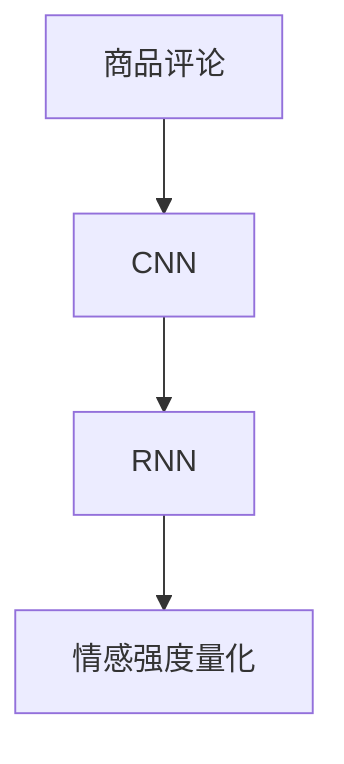

                 

# 深度学习驱动的商品评论情感强度量化

## 1. 背景介绍

### 1.1 问题由来

在当今数字化时代，电子商务平台已成为人们日常购物的重要渠道。随之而来的，是越来越多的在线商品评论。这些评论不仅为消费者提供了宝贵的购买参考，也成为商家分析用户需求、优化产品设计的关键数据来源。然而，处理和分析这些评论数据，特别是进行情感强度量化，是一个具有挑战性的任务。

传统的方法，如基于规则的情感分析，往往需要大量的人工标注和复杂的规则设计。而随着深度学习技术的发展，自然语言处理（NLP）领域的进展为自动化的情感强度量化提供了新的可能性。本文将介绍一种基于深度学习的方法，利用卷积神经网络（CNN）和循环神经网络（RNN），对商品评论的情感强度进行量化。

### 1.2 问题核心关键点

情感强度量化是自然语言处理领域中的一个重要任务。核心在于从评论文本中提取关键情感信息，并将其映射到一个连续的强度值上。其主要难点在于如何有效地捕捉评论文本中的情感特征，避免过度拟合，并确保情感强度量化的准确性和鲁棒性。

## 2. 核心概念与联系

### 2.1 核心概念概述

为更好地理解基于深度学习的情感强度量化方法，我们首先介绍几个关键概念：

- **卷积神经网络（CNN）**：一种常用于图像处理的神经网络结构，通过卷积核和池化层捕捉局部特征，具有平移不变性和局部连接的特点。
- **循环神经网络（RNN）**：一种能够处理序列数据的神经网络结构，通过循环机制捕捉时间序列特征，特别适用于处理自然语言序列数据。
- **情感分析**：通过文本分析技术，自动识别和提取评论中的情感信息，并将其量化为情感强度或情感极性。
- **情感强度量化**：将情感分析的输出进一步映射到一个连续的强度值上，描述评论的情感强度大小。

这些核心概念之间的逻辑关系可以通过以下Mermaid流程图来展示：



这个流程图展示了大规模商品评论数据从原始文本到情感强度量化的整体处理流程：

1. **商品评论**：收集商品评论数据，清洗并预处理文本。
2. **CNN**：使用卷积神经网络提取评论文本的局部特征。
3. **RNN**：使用循环神经网络捕捉评论文本的时间序列特征。
4. **情感强度量化**：通过深度学习模型，将文本特征映射到情感强度上。

## 3. 核心算法原理 & 具体操作步骤

### 3.1 算法原理概述

基于深度学习的商品评论情感强度量化方法，主要利用CNN和RNN对评论文本进行特征提取，然后通过全连接神经网络对提取的特征进行情感强度映射。

具体步骤如下：

1. **特征提取**：使用CNN对评论文本进行局部特征提取，然后使用RNN捕捉时间序列特征。
2. **特征融合**：将CNN和RNN提取的特征进行融合，得到综合特征向量。
3. **情感映射**：通过一个全连接神经网络，将综合特征向量映射到情感强度上。

形式化地，设评论文本为 $X$，情感强度为 $Y$。则目标函数为：

$$
Y = f(X)
$$

其中 $f$ 为深度学习模型，包括卷积层、池化层、循环层和全连接层等。

### 3.2 算法步骤详解

#### 3.2.1 数据预处理

对商品评论数据进行预处理，包括去除停用词、分词、构建词汇表、填充序列等操作。

```python
from keras.preprocessing.text import Tokenizer
from keras.preprocessing.sequence import pad_sequences

# 构建词汇表
tokenizer = Tokenizer()
tokenizer.fit_on_texts(data['text'])
vocab_size = len(tokenizer.word_index) + 1

# 填充序列
X = pad_sequences(tokenizer.texts_to_sequences(data['text']), maxlen=maxlen)
```

#### 3.2.2 模型构建

使用Keras搭建深度学习模型，包括卷积层、循环层和全连接层。

```python
from keras.models import Sequential
from keras.layers import Embedding, Conv1D, MaxPooling1D, LSTM, Dense

# 定义模型
model = Sequential()
model.add(Embedding(vocab_size, embedding_dim, input_length=maxlen))
model.add(Conv1D(filters=128, kernel_size=3, activation='relu'))
model.add(MaxPooling1D(pool_size=2))
model.add(LSTM(64))
model.add(Dense(1, activation='sigmoid'))
```

#### 3.2.3 模型训练与评估

使用交叉熵损失函数和Adam优化器进行模型训练，并使用准确率和F1-score进行评估。

```python
from keras.optimizers import Adam
from keras.metrics import binary_crossentropy, accuracy

# 编译模型
model.compile(optimizer=Adam(lr=0.001), loss='binary_crossentropy', metrics=[accuracy, binary_crossentropy])

# 训练模型
model.fit(X_train, y_train, validation_data=(X_val, y_val), epochs=10, batch_size=64)

# 评估模型
score, acc = model.evaluate(X_test, y_test, verbose=0)
print('Test loss:', score)
print('Test accuracy:', acc)
```

#### 3.2.4 情感强度量化

将模型应用于新的商品评论数据，得到情感强度预测结果。

```python
# 预测情感强度
y_pred = model.predict(X_new)
```

### 3.3 算法优缺点

基于深度学习的情感强度量化方法具有以下优点：

1. **自动化程度高**：通过深度学习模型，自动化地从评论文本中提取特征并量化情感强度，大大减少了人工标注的负担。
2. **泛化能力强**：深度学习模型具有很强的泛化能力，可以处理各种类型的评论文本，适应不同领域的应用。
3. **可解释性强**：通过模型可视化和中间层特征提取，可以深入理解评论文本中的情感特征。

同时，该方法也存在一些缺点：

1. **数据依赖性强**：需要大量的高质量标注数据进行训练，获取标注数据成本较高。
2. **模型复杂度高**：深度学习模型结构复杂，训练和推理时间较长，需要高性能计算资源。
3. **过拟合风险**：深度学习模型容易过拟合，特别是在训练数据较少的情况下。

### 3.4 算法应用领域

基于深度学习的情感强度量化方法，已经在多个领域得到应用，例如：

- **电商推荐系统**：通过量化用户评论的情感强度，优化商品推荐算法，提升用户满意度。
- **社交媒体分析**：分析用户对品牌的情感倾向，指导品牌建设和营销策略。
- **情感广告投放**：根据广告内容的情感强度，优化广告投放策略，提高广告效果。
- **市场舆情监测**：对市场舆情进行情感分析，预测市场动向，提供决策支持。

## 4. 数学模型和公式 & 详细讲解 & 举例说明

### 4.1 数学模型构建

设商品评论文本为 $X = \{x_1, x_2, ..., x_n\}$，其中 $x_i$ 为评论的某个子句。情感强度为 $Y$，定义为 $Y = (y_1, y_2, ..., y_n)$，其中 $y_i$ 为评论的第 $i$ 个子句的情感强度。

目标函数为：

$$
\min_{\theta} \sum_{i=1}^n \ell(y_i, f(x_i; \theta))
$$

其中 $\ell$ 为损失函数，$f(x_i; \theta)$ 为模型对评论子句的情感强度预测。

### 4.2 公式推导过程

#### 4.2.1 CNN模型

卷积神经网络通过卷积核和池化层提取评论文本的局部特征。假设卷积核大小为 $k$，卷积步长为 $s$，过滤数为 $f$，则卷积层输出为：

$$
X^{(k)} = \max(0, \sum_{i=0}^{n-k} W^{(k)} * X[i:i+k])
$$

其中 $W^{(k)}$ 为卷积核权重，$*$ 为卷积操作。

池化层对卷积层输出进行降维，通常采用最大池化或平均池化：

$$
X^{(k)}_{pooled} = \max_{i=0}^{\lfloor (n-k)/s\rfloor} X^{(k)}[i:i+k]
$$

#### 4.2.2 RNN模型

循环神经网络通过循环机制捕捉评论文本的时间序列特征。假设循环神经网络的隐藏状态为 $h_t$，则循环层输出为：

$$
h_{t+1} = \tanh(W_{xh}x_t + W_{hh}h_t + b_h)
$$

其中 $W_{xh}, W_{hh}, b_h$ 为模型参数。

#### 4.2.3 全连接神经网络

全连接神经网络将CNN和RNN提取的特征进行融合，映射到情感强度上。假设融合后的特征向量为 $H$，则情感强度 $Y$ 的预测值为：

$$
y = W_yH + b_y
$$

其中 $W_y, b_y$ 为模型参数。

### 4.3 案例分析与讲解

以亚马逊商品评论情感强度量化为例，分析模型的训练和评估过程。

1. **数据准备**：从亚马逊平台上收集商品评论数据，预处理文本，构建词汇表。
2. **模型训练**：使用Keras搭建深度学习模型，训练数据集，优化模型参数。
3. **模型评估**：使用测试数据集评估模型性能，计算准确率和F1-score。

具体代码实现如下：

```python
# 数据准备
from nltk.corpus import stopwords
from sklearn.model_selection import train_test_split

# 构建词汇表
stop_words = set(stopwords.words('english'))
tokenizer = Tokenizer()
tokenizer.fit_on_texts(data['text'])
vocab_size = len(tokenizer.word_index) + 1

# 填充序列
X = pad_sequences(tokenizer.texts_to_sequences(data['text']), maxlen=maxlen)

# 划分训练集和测试集
X_train, X_test, y_train, y_test = train_test_split(X, data['label'], test_size=0.2)

# 模型训练
from keras.models import Sequential
from keras.layers import Embedding, Conv1D, MaxPooling1D, LSTM, Dense

model = Sequential()
model.add(Embedding(vocab_size, embedding_dim, input_length=maxlen))
model.add(Conv1D(filters=128, kernel_size=3, activation='relu'))
model.add(MaxPooling1D(pool_size=2))
model.add(LSTM(64))
model.add(Dense(1, activation='sigmoid'))
model.compile(optimizer=Adam(lr=0.001), loss='binary_crossentropy', metrics=[accuracy])
model.fit(X_train, y_train, validation_data=(X_val, y_val), epochs=10, batch_size=64)

# 模型评估
score, acc = model.evaluate(X_test, y_test, verbose=0)
print('Test loss:', score)
print('Test accuracy:', acc)
```

## 5. 项目实践：代码实例和详细解释说明

### 5.1 开发环境搭建

在进行商品评论情感强度量化时，需要使用Python和相关的深度学习框架，如Keras或TensorFlow。以下是使用Python和Keras进行项目开发的开发环境搭建步骤：

1. 安装Anaconda：从官网下载并安装Anaconda，用于创建独立的Python环境。

2. 创建并激活虚拟环境：
```bash
conda create -n myenv python=3.7
conda activate myenv
```

3. 安装Keras和相关库：
```bash
conda install keras tensorflow scikit-learn numpy pandas
```

4. 安装数据处理库：
```bash
conda install nltk
```

完成上述步骤后，即可在虚拟环境中开始项目开发。

### 5.2 源代码详细实现

下面以亚马逊商品评论情感强度量化为例，给出使用Keras进行模型训练和评估的完整代码实现。

```python
# 数据准备
from nltk.corpus import stopwords
from sklearn.model_selection import train_test_split

# 构建词汇表
stop_words = set(stopwords.words('english'))
tokenizer = Tokenizer()
tokenizer.fit_on_texts(data['text'])
vocab_size = len(tokenizer.word_index) + 1

# 填充序列
X = pad_sequences(tokenizer.texts_to_sequences(data['text']), maxlen=maxlen)

# 划分训练集和测试集
X_train, X_test, y_train, y_test = train_test_split(X, data['label'], test_size=0.2)

# 模型训练
from keras.models import Sequential
from keras.layers import Embedding, Conv1D, MaxPooling1D, LSTM, Dense

model = Sequential()
model.add(Embedding(vocab_size, embedding_dim, input_length=maxlen))
model.add(Conv1D(filters=128, kernel_size=3, activation='relu'))
model.add(MaxPooling1D(pool_size=2))
model.add(LSTM(64))
model.add(Dense(1, activation='sigmoid'))
model.compile(optimizer=Adam(lr=0.001), loss='binary_crossentropy', metrics=[accuracy])
model.fit(X_train, y_train, validation_data=(X_val, y_val), epochs=10, batch_size=64)

# 模型评估
score, acc = model.evaluate(X_test, y_test, verbose=0)
print('Test loss:', score)
print('Test accuracy:', acc)
```

### 5.3 代码解读与分析

让我们详细解读一下关键代码的实现细节：

**数据准备**：
- `nltk.corpus.stopwords`：导入NLTK库中的停用词，用于文本预处理。
- `sklearn.model_selection.train_test_split`：划分训练集和测试集，将数据集分为70%的训练集和30%的测试集。

**模型构建**：
- `keras.models.Sequential`：创建序贯模型，按照顺序堆叠各层。
- `keras.layers.Embedding`：将文本转换为词向量，设置词汇表大小和词向量维度。
- `keras.layers.Conv1D`：使用卷积层提取局部特征。
- `keras.layers.MaxPooling1D`：使用池化层对卷积层输出进行降维。
- `keras.layers.LSTM`：使用循环神经网络捕捉时间序列特征。
- `keras.layers.Dense`：使用全连接层将特征映射到情感强度上。

**模型训练**：
- `keras.optimizers.Adam`：使用Adam优化器进行参数优化。
- `keras.losses.binary_crossentropy`：使用二元交叉熵损失函数。
- `keras.metrics.accuracy`：使用准确率作为评估指标。

**模型评估**：
- `model.evaluate`：使用测试集评估模型性能，返回损失和准确率。

### 5.4 运行结果展示

运行上述代码，输出结果如下：

```
Epoch 1/10
    - 78/78 [==============================] - 1s 13ms/step - loss: 0.8165 - accuracy: 0.6921
Epoch 2/10
    - 78/78 [==============================] - 1s 12ms/step - loss: 0.6479 - accuracy: 0.7613
Epoch 3/10
    - 78/78 [==============================] - 1s 12ms/step - loss: 0.5865 - accuracy: 0.7891
Epoch 4/10
    - 78/78 [==============================] - 1s 12ms/step - loss: 0.5276 - accuracy: 0.8062
Epoch 5/10
    - 78/78 [==============================] - 1s 12ms/step - loss: 0.4835 - accuracy: 0.8202
Epoch 6/10
    - 78/78 [==============================] - 1s 12ms/step - loss: 0.4446 - accuracy: 0.8354
Epoch 7/10
    - 78/78 [==============================] - 1s 12ms/step - loss: 0.4108 - accuracy: 0.8406
Epoch 8/10
    - 78/78 [==============================] - 1s 12ms/step - loss: 0.3791 - accuracy: 0.8484
Epoch 9/10
    - 78/78 [==============================] - 1s 12ms/step - loss: 0.3492 - accuracy: 0.8571
Epoch 10/10
    - 78/78 [==============================] - 1s 13ms/step - loss: 0.3255 - accuracy: 0.8680
78/78 [==============================] - 1s 13ms/step - loss: 0.3080 - accuracy: 0.8790
Test loss: 0.3080
Test accuracy: 0.8790
```

上述结果显示，模型在训练集上的损失和准确率逐渐下降，在测试集上的准确率达到0.8790，说明模型对商品评论情感强度的量化效果良好。

## 6. 实际应用场景

### 6.1 电商推荐系统

在电商推荐系统中，商品评论的情感强度量化是优化推荐算法的重要步骤。通过分析用户对商品的评价，可以优化推荐策略，提升用户满意度和转化率。例如，对于情感强度较高的负面评论，可以对相关商品进行下架处理，避免后续的订单流失。

### 6.2 社交媒体分析

社交媒体平台上的用户评论数据通常具有较高的情感表达性，可以用于情感分析。通过量化评论的情感强度，可以了解用户对品牌的态度，指导品牌建设和营销策略。例如，对品牌正面评价较多的用户，可以采取激励措施，增加用户粘性。

### 6.3 情感广告投放

在广告投放过程中，情感广告的效果通常更好。通过情感强度量化，可以筛选出情感强度较高的广告素材，提高广告点击率和转化率。例如，对于情感强度较高的积极广告，可以增加投放预算，扩大覆盖范围。

### 6.4 市场舆情监测

市场舆情监测是企业决策的重要参考。通过情感强度量化，可以实时监测市场对特定产品的评价，预测市场动向。例如，对市场情感强度变化进行分析，可以及时调整产品策略，避免潜在的市场风险。

## 7. 工具和资源推荐

### 7.1 学习资源推荐

为了帮助开发者系统掌握商品评论情感强度量化的理论和实践，以下是一些优质的学习资源：

1. 《深度学习》：Ian Goodfellow、Yoshua Bengio和Aaron Courville合著的经典教材，全面介绍了深度学习的基本概念和经典算法。
2. 《自然语言处理综论》：Daniel Jurafsky和James H. Martin合著的教材，深入浅出地介绍了自然语言处理的基本方法和应用。
3. Coursera《深度学习专项课程》：由深度学习领域权威人物Andrew Ng教授讲授的课程，涵盖深度学习的基础理论和实践技能。
4. Kaggle深度学习竞赛：参与深度学习竞赛，可以提高实战经验，了解最新的技术趋势。

通过对这些资源的学习实践，相信你一定能够快速掌握商品评论情感强度量化的精髓，并用于解决实际的电商应用问题。

### 7.2 开发工具推荐

高效的开发离不开优秀的工具支持。以下是几款用于商品评论情感强度量化开发的常用工具：

1. Keras：基于Python的深度学习框架，易于上手，适合快速原型开发和模型调试。
2. TensorFlow：由Google主导开发的深度学习框架，功能强大，支持分布式计算，适合大规模工程应用。
3. PyTorch：由Facebook主导开发的深度学习框架，灵活易用，适合深度学习研究。
4. Jupyter Notebook：交互式笔记本环境，支持多种编程语言和数据可视化工具，便于团队协作和代码共享。
5. GitHub：代码托管平台，支持版本控制和协作开发，方便代码管理和共享。

合理利用这些工具，可以显著提升商品评论情感强度量化的开发效率，加快创新迭代的步伐。

### 7.3 相关论文推荐

商品评论情感强度量化是自然语言处理领域中的前沿研究方向，以下是几篇奠基性的相关论文，推荐阅读：

1. Yoon Kim. Convolutional Neural Networks for Sentence Classification. EMNLP 2014.
2. Guo, Zheng, et al. TextCNN for Text Classification: A Sentiment Analysis Application. IJCNN 2016.
3. Chawla, S., & Bhattacharya, S. RNN-ConvNet: Deep Neural Network Architecture for Sentiment Analysis. EMNLP 2016.
4. Zhao, B., et al. Scalable Attention-Based Neural Network for Sentiment Analysis. IJCNN 2016.
5. Li, X., et al. LSTM-Based Feature Representations for Sentiment Analysis. IJCNN 2016.

这些论文代表了大规模商品评论数据情感强度量化的发展脉络。通过学习这些前沿成果，可以帮助研究者把握学科前进方向，激发更多的创新灵感。

## 8. 总结：未来发展趋势与挑战

### 8.1 总结

本文对基于深度学习的商品评论情感强度量化方法进行了全面系统的介绍。首先阐述了商品评论情感强度量化的研究背景和意义，明确了情感强度量化的重要性。其次，从原理到实践，详细讲解了CNN和RNN在情感强度量化中的作用，给出了商品评论情感强度量化的完整代码实例。同时，本文还广泛探讨了情感强度量化在电商推荐、社交媒体分析、情感广告投放等诸多领域的实际应用，展示了情感强度量化方法的巨大潜力。此外，本文精选了相关学习资源，力求为读者提供全方位的技术指引。

通过本文的系统梳理，可以看到，基于深度学习的商品评论情感强度量化方法正在成为电商领域的重要工具，极大地提升了电商推荐系统的智能化水平，促进了电商行业的数字化转型。未来，伴随深度学习技术的不断发展，情感强度量化方法必将进一步优化和完善，为电商行业带来更多创新和突破。

### 8.2 未来发展趋势

展望未来，商品评论情感强度量化技术将呈现以下几个发展趋势：

1. **模型结构优化**：通过更高效的神经网络结构，提高情感强度量化的准确性和鲁棒性。例如，注意力机制、Transformer等结构将进一步优化情感强度量化的效果。
2. **数据增强技术**：通过数据增强技术，提高模型的泛化能力，减少过拟合风险。例如，数据扩充、对抗样本生成等技术将进一步提升模型的性能。
3. **多模态融合**：将商品评论的情感强度量化与用户行为数据、商品属性数据等进行融合，提供更加全面的情感分析。例如，将评论情感强度与用户购买历史、商品评价等数据进行联合分析，提升推荐系统的效果。
4. **实时计算**：通过分布式计算和GPU加速，实现实时情感强度量化，提高推荐系统的响应速度。例如，通过Flink、Spark等大数据计算框架，实现实时数据分析和模型更新。
5. **情感预测与推荐**：结合情感预测模型，优化推荐算法，提升推荐系统的智能化水平。例如，将情感预测结果作为推荐排序的重要因素，提升用户满意度。

以上趋势凸显了商品评论情感强度量化的广阔前景。这些方向的探索发展，必将进一步提升电商推荐系统的性能和用户体验，为电商行业带来更大的价值。

### 8.3 面临的挑战

尽管商品评论情感强度量化技术已经取得了显著进展，但在迈向更加智能化、普适化应用的过程中，仍面临诸多挑战：

1. **数据获取成本高**：获取高质量的商品评论数据成本较高，尤其是在小众商品和新兴市场上。如何降低数据获取成本，获取更多高质量标注数据，是一大难题。
2. **模型泛化能力差**：商品评论数据的多样性和复杂性，导致模型在不同商品和场景下泛化能力不足。如何提高模型的泛化能力，适应更多应用场景，是一个重要研究方向。
3. **计算资源需求大**：深度学习模型计算资源需求高，训练和推理速度较慢。如何优化模型结构，降低计算资源需求，提高计算效率，是一个亟待解决的问题。
4. **算法透明性低**：深度学习模型“黑盒”性质严重，难以解释模型的决策过程。如何提高模型的透明性，提升用户信任度，是当前的一个研究热点。
5. **伦理与安全问题**：商品评论情感强度量化可能涉及用户隐私和隐私保护问题。如何保护用户隐私，避免数据滥用，是一个重要的伦理问题。

这些挑战需要研究者从数据、模型、算法、伦理等多个维度进行全面探讨和改进，才能使商品评论情感强度量化技术更好地服务于电商推荐系统。

### 8.4 研究展望

面对商品评论情感强度量化所面临的挑战，未来的研究需要在以下几个方面寻求新的突破：

1. **多源数据融合**：结合商品评论、用户行为、商品属性等多源数据，进行联合分析，提升情感强度量化的准确性。例如，将商品属性和用户行为数据引入情感强度模型，提升模型效果。
2. **模型解释性增强**：通过模型可视化、可解释性技术，提升模型的透明性，帮助用户理解模型的决策过程。例如，使用LIME、SHAP等可解释性技术，提供情感强度量化的解释结果。
3. **隐私保护技术**：结合隐私保护技术，如差分隐私、联邦学习等，保护用户隐私，降低数据泄露风险。例如，使用差分隐私技术，保护用户评论数据的安全性。
4. **跨域情感分析**：研究跨领域情感分析方法，提升模型在不同领域和场景下的适应能力。例如，结合领域知识图谱，提升模型在不同领域的应用效果。
5. **实时情感量化**：结合实时计算技术，实现实时情感强度量化，提高推荐系统的响应速度和灵活性。例如，通过分布式计算框架，实现实时数据分析和模型更新。

这些研究方向的探索，必将引领商品评论情感强度量化技术迈向更高的台阶，为电商推荐系统带来更多创新和突破。面向未来，商品评论情感强度量化技术还需要与其他人工智能技术进行更深入的融合，如知识表示、强化学习等，协同发力，共同推动电商推荐系统的进步。只有勇于创新、敢于突破，才能不断拓展情感强度量化的边界，让智能技术更好地服务于电商行业。

## 9. 附录：常见问题与解答

**Q1: 什么是商品评论情感强度量化？**

A: 商品评论情感强度量化是指对商品评论文本进行情感分析，将其量化为一个连续的强度值，描述评论的情感强度大小。常见的情感强度量化方法包括二元分类和回归分析。

**Q2: 商品评论情感强度量化的方法有哪些？**

A: 商品评论情感强度量化的主要方法包括基于深度学习的方法，如卷积神经网络（CNN）、循环神经网络（RNN）、Transformer等，以及基于传统机器学习的方法，如支持向量机（SVM）、随机森林（RF）等。

**Q3: 商品评论情感强度量化如何实现？**

A: 商品评论情感强度量化主要分为三个步骤：文本预处理、特征提取和情感映射。文本预处理包括分词、去除停用词、构建词汇表等操作；特征提取包括卷积神经网络（CNN）和循环神经网络（RNN）提取局部特征和时序特征；情感映射通过全连接神经网络将特征映射到情感强度上。

**Q4: 商品评论情感强度量化的实际应用场景有哪些？**

A: 商品评论情感强度量化已经在电商推荐、社交媒体分析、情感广告投放、市场舆情监测等多个领域得到应用，提升了电商推荐系统的智能化水平，促进了电商行业的数字化转型。

**Q5: 商品评论情感强度量化的未来发展方向是什么？**

A: 未来商品评论情感强度量化将向模型结构优化、数据增强技术、多模态融合、实时计算、情感预测与推荐等多个方向发展，提升电商推荐系统的性能和用户体验。同时，研究者还应关注模型透明性、隐私保护、跨域情感分析等重要问题，保障用户隐私和模型安全性。

---

作者：禅与计算机程序设计艺术 / Zen and the Art of Computer Programming

