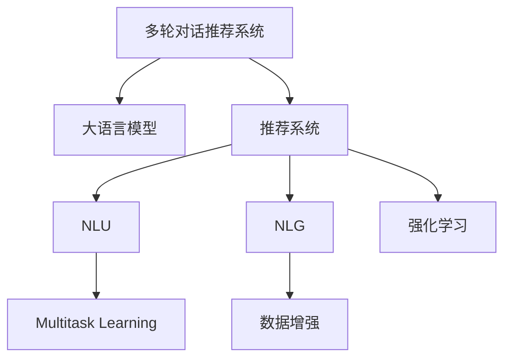

                 

# 电商平台中的多轮对话推荐系统：大模型的创新应用

## 1. 背景介绍

### 1.1 问题由来
随着电商行业竞争的日趋激烈，用户体验成为平台竞争的核心指标之一。优秀的推荐系统不仅能提升用户体验，还能显著提升用户留存率和转化率。而多轮对话推荐系统正是在这种背景下应运而生的一种全新推荐形式，它结合了NLP技术和推荐算法，通过与用户的多轮交互，为用户推荐合适的商品，极大地提升了推荐效果和用户体验。

### 1.2 问题核心关键点
构建多轮对话推荐系统的关键在于：
1. **多轮对话理解**：准确理解和解析用户的意图，并根据上下文信息动态调整推荐策略。
2. **推荐算法优化**：根据用户的即时反馈和历史行为数据，动态调整推荐算法模型，以实现更精准的推荐。
3. **实时响应**：确保推荐系统在用户与系统的交互过程中能实时响应，提升用户体验。
4. **模型训练**：基于大模型进行多轮对话推荐系统训练，确保模型具备足够的语言理解和生成能力。
5. **推荐效果评估**：引入合适的指标评估推荐系统的效果，如点击率、转化率、用户满意度等。

### 1.3 问题研究意义
多轮对话推荐系统结合了大模型技术和推荐算法，能够显著提升推荐效果和用户体验，具有以下重要意义：
1. **个性化推荐**：通过多轮对话获取用户详细的购物意图，提供更加个性化的推荐服务。
2. **提升用户体验**：多轮对话推荐系统能够与用户进行更自然的交互，提升用户对平台的粘性。
3. **实时调整推荐**：基于用户的即时反馈，动态调整推荐策略，实现更精准的推荐。
4. **大规模应用**：大模型的引入使得多轮对话推荐系统能够在大规模电商平台上高效运行，提升平台的用户量和转化率。

## 2. 核心概念与联系

### 2.1 核心概念概述

为更好地理解多轮对话推荐系统，本节将介绍几个密切相关的核心概念：

- **多轮对话推荐系统(Multi-turn Dialog-based Recommendation System)**：通过与用户进行多轮对话，理解用户的购物需求和偏好，动态调整推荐策略，提供个性化推荐服务。
- **大语言模型(Large Language Model, LLM)**：以自回归(如GPT)或自编码(如BERT)模型为代表的大规模预训练语言模型。通过在大规模无标签文本语料上进行预训练，学习通用的语言知识和表示。
- **推荐系统(Recommendation System)**：通过用户的历史行为数据和特征，结合算法模型为用户推荐合适的商品或服务。
- **自然语言理解(Natural Language Understanding, NLU)**：通过NLP技术解析和理解用户输入的自然语言，获取用户意图和需求。
- **自然语言生成(Natural Language Generation, NLG)**：利用大语言模型生成自然流畅的文本响应，提升用户体验。
- **多任务学习(Multi-task Learning)**：在多轮对话过程中，通过学习多个相关任务，提升模型的泛化能力和推荐效果。
- **数据增强(Data Augmentation)**：通过修改训练数据的方式，丰富模型训练集的样本多样性，提升模型的泛化能力。
- **强化学习(Reinforcement Learning, RL)**：通过用户与系统的交互，动态调整推荐策略，实现更好的推荐效果。

这些核心概念之间的逻辑关系可以通过以下Mermaid流程图来展示：



这个流程图展示了多轮对话推荐系统的核心概念及其之间的关系：

1. 多轮对话推荐系统通过大语言模型获取用户的意图和需求，生成推荐结果。
2. 推荐系统基于用户的历史行为数据，结合大语言模型的输出，生成推荐结果。
3. NLU负责解析用户的自然语言输入，提取用户意图。
4. NLG利用大语言模型生成自然流畅的推荐回复。
5. 多任务学习通过学习多个相关任务，提升模型的泛化能力。
6. 数据增强丰富模型训练集的样本多样性，提升模型的泛化能力。
7. 强化学习通过用户与系统的交互，动态调整推荐策略，实现更好的推荐效果。

## 3. 核心算法原理 & 具体操作步骤

### 3.1 算法原理概述

基于大模型的多轮对话推荐系统，本质上是将大语言模型与推荐系统相结合，通过多轮对话获取用户需求，动态调整推荐策略。其核心思想是：通过大语言模型理解用户意图，生成推荐内容，并结合推荐算法生成推荐结果。

形式化地，假设用户与系统的多轮对话为 $\{d_i\}_{i=1}^T$，其中 $d_i=(x_i,y_i)$，$x_i$ 为用户输入的自然语言，$y_i$ 为系统生成的自然语言响应。假设推荐系统的损失函数为 $\ell(R_u)$，其中 $R_u$ 为推荐结果，通过多轮对话和推荐算法得到。则推荐系统的优化目标是最小化损失函数，即找到最优推荐策略：

$$
\min_{\theta} \sum_{u} \ell(R_u)
$$

其中 $\theta$ 为模型参数，包括大语言模型的权重和推荐算法的参数。

### 3.2 算法步骤详解

基于大模型的多轮对话推荐系统的一般步骤如下：

**Step 1: 准备数据集**
- 收集电商平台的用户对话数据，标注用户意图和历史行为数据。
- 使用标注数据集训练和微调大语言模型。
- 将大语言模型和推荐算法结合起来，生成推荐结果。

**Step 2: 设计对话流程**
- 设计多轮对话流程，包括用户输入、系统生成响应、推荐生成等环节。
- 定义对话的起始状态、状态转换规则和终止条件。

**Step 3: 设计推荐算法**
- 选择合适的推荐算法，如基于协同过滤、基于内容的推荐等。
- 根据用户的历史行为数据和即时反馈数据，动态调整推荐算法参数。

**Step 4: 训练模型**
- 使用标注数据集训练大语言模型和推荐算法。
- 在训练过程中，加入正则化技术，防止过拟合。

**Step 5: 评估和优化**
- 使用预设指标评估推荐系统的效果，如点击率、转化率、用户满意度等。
- 根据评估结果，优化大语言模型和推荐算法的参数。

**Step 6: 部署和迭代**
- 将训练好的模型部署到电商平台上，进行实时推荐。
- 收集用户反馈和行为数据，进行模型迭代优化。

以上是基于大模型的多轮对话推荐系统的一般流程。在实际应用中，还需要针对具体任务的特点，对对话流程、推荐算法、训练过程等进行优化设计，以进一步提升推荐效果。

### 3.3 算法优缺点

基于大模型的多轮对话推荐系统具有以下优点：
1. **个性化推荐**：通过多轮对话获取用户详细的购物意图，提供更加个性化的推荐服务。
2. **提升用户体验**：多轮对话推荐系统能够与用户进行更自然的交互，提升用户对平台的粘性。
3. **实时调整推荐**：基于用户的即时反馈，动态调整推荐策略，实现更精准的推荐。
4. **模型泛化能力强**：大模型的预训练使得推荐系统能够在大规模数据上泛化，提升推荐效果。

同时，该方法也存在一定的局限性：
1. **计算资源消耗大**：大模型的训练和推理计算量大，需要高性能计算资源。
2. **数据标注成本高**：多轮对话推荐系统需要大量的标注数据，标注成本较高。
3. **模型复杂度高**：多轮对话推荐系统涉及多个模块，模型复杂度高，难以维护和调试。

尽管存在这些局限性，但就目前而言，基于大模型的多轮对话推荐系统仍然是推荐领域的前沿技术，具有广泛的应用前景。

### 3.4 算法应用领域

基于大模型的多轮对话推荐系统已经广泛应用于电商、社交媒体、智能客服等多个领域，具体应用包括：

1. **电商推荐**：结合用户的多轮对话和行为数据，为用户提供个性化的商品推荐。
2. **智能客服**：通过多轮对话理解用户需求，自动提供解决方案，提升客服效率。
3. **社交媒体推荐**：基于用户的社交行为和多轮对话，推荐相关的内容和用户。
4. **知识图谱推荐**：利用多轮对话获取用户知识需求，推荐相关的知识点和资料。
5. **智能家居推荐**：通过多轮对话了解用户偏好，推荐合适的家居商品和智能设备。

这些应用展示了多轮对话推荐系统的广泛适用性和强大潜力。

## 4. 数学模型和公式 & 详细讲解

### 4.1 数学模型构建

假设用户与系统的多轮对话为 $\{d_i\}_{i=1}^T$，其中 $d_i=(x_i,y_i)$，$x_i$ 为用户输入的自然语言，$y_i$ 为系统生成的自然语言响应。假设推荐系统的损失函数为 $\ell(R_u)$，其中 $R_u$ 为推荐结果，通过多轮对话和推荐算法得到。则推荐系统的优化目标是最小化损失函数，即找到最优推荐策略：

$$
\min_{\theta} \sum_{u} \ell(R_u)
$$

其中 $\theta$ 为模型参数，包括大语言模型的权重和推荐算法的参数。假设推荐系统的损失函数为交叉熵损失，则优化目标可以表示为：

$$
\min_{\theta} \sum_{u} -y_u \log \hat{y}_u
$$

其中 $\hat{y}_u$ 为推荐系统的预测结果，$y_u$ 为真实标签。

### 4.2 公式推导过程

以基于协同过滤的推荐算法为例，其目标是最小化用户-物品的协同误差。假设用户 $u$ 的历史行为数据为 $I_u=\{(i_u,j_u)\}_{i=1}^N$，其中 $i_u$ 为物品的ID，$j_u$ 为用户对物品的评分。推荐系统对物品 $i$ 的预测评分 $\hat{r}_u(i)$ 可以通过协同过滤模型得到，假设模型参数为 $\theta$，则有：

$$
\hat{r}_u(i) = \theta^T \phi(i)
$$

其中 $\phi(i)$ 为物品 $i$ 的特征向量。通过最小化以下损失函数，可以优化协同过滤模型：

$$
\min_{\theta} \sum_{u} \sum_{i \in I_u} (y_u(i)-\hat{r}_u(i))^2
$$

其中 $y_u(i)$ 为真实评分。将推荐系统的预测结果 $\hat{r}_u(i)$ 代入多轮对话推荐系统中，可以得到推荐系统的损失函数：

$$
\min_{\theta} \sum_{u} -y_u \log \hat{y}_u
$$

在训练过程中，需要同时优化大语言模型和推荐算法，可以使用以下联合优化框架：

$$
\min_{\theta} \sum_{u} -y_u \log \hat{y}_u + \lambda \|w\|_2^2
$$

其中 $w$ 为大语言模型的权重，$\lambda$ 为正则化系数。

### 4.3 案例分析与讲解

以电商平台推荐系统为例，用户与系统的多轮对话可能涉及以下场景：

- **询问商品信息**：用户询问某个商品的详细信息，系统生成详细的商品描述。
- **比较商品**：用户询问不同商品之间的对比，系统生成推荐结果。
- **提出需求**：用户提出具体的购物需求，系统推荐合适的商品。

在每个对话轮次中，系统会使用大语言模型解析用户的意图，生成自然语言响应，同时根据用户的历史行为数据，使用推荐算法生成推荐结果。具体流程如图：

```
用户输入：请问这款手机电池续航怎么样？
系统生成：这款手机的电池续航时间为XX小时，但实际使用情况可能因使用习惯而有所不同。
推荐结果：基于用户的历史行为数据和电池续航的评分，推荐其他同类商品。
```

通过多轮对话，系统能够不断获取用户详细的购物意图，动态调整推荐策略，提升推荐效果。

## 5. 项目实践：代码实例和详细解释说明

### 5.1 开发环境搭建

在进行多轮对话推荐系统开发前，需要先搭建好开发环境。以下是使用Python进行PyTorch开发的环境配置流程：

1. 安装Anaconda：从官网下载并安装Anaconda，用于创建独立的Python环境。

2. 创建并激活虚拟环境：
```bash
conda create -n pytorch-env python=3.8 
conda activate pytorch-env
```

3. 安装PyTorch：根据CUDA版本，从官网获取对应的安装命令。例如：
```bash
conda install pytorch torchvision torchaudio cudatoolkit=11.1 -c pytorch -c conda-forge
```

4. 安装Transformers库：
```bash
pip install transformers
```

5. 安装各类工具包：
```bash
pip install numpy pandas scikit-learn matplotlib tqdm jupyter notebook ipython
```

完成上述步骤后，即可在`pytorch-env`环境中开始开发实践。

### 5.2 源代码详细实现

下面我们以电商平台推荐系统为例，给出使用Transformers库进行多轮对话推荐系统的PyTorch代码实现。

首先，定义推荐系统的损失函数和优化器：

```python
from transformers import BertForSequenceClassification, AdamW
from transformers import Trainer, TrainingArguments
import torch

model = BertForSequenceClassification.from_pretrained('bert-base-cased', num_labels=2)

optimizer = AdamW(model.parameters(), lr=2e-5)
training_args = TrainingArguments(
    output_dir="./results",
    num_train_epochs=3,
    per_device_train_batch_size=16,
    per_device_eval_batch_size=16,
    warmup_steps=500,
    weight_decay=0.01,
    evaluation_strategy="epoch",
)

def compute_metrics(pred):
    labels = pred.label_ids
    preds = pred.predictions.argmax(-1)
    return {
        'accuracy': (labels == preds).mean().item(),
        'f1': f1_score(labels, preds, average='macro'),
        'precision': precision_score(labels, preds, average='macro'),
        'recall': recall_score(labels, preds, average='macro'),
    }
```

然后，定义训练和评估函数：

```python
from transformers import Trainer, TrainingArguments

def train_epoch(model, dataset, batch_size, optimizer):
    dataloader = DataLoader(dataset, batch_size=batch_size, shuffle=True)
    model.train()
    epoch_loss = 0
    for batch in dataloader:
        input_ids = batch['input_ids'].to(device)
        attention_mask = batch['attention_mask'].to(device)
        labels = batch['labels'].to(device)
        model.zero_grad()
        outputs = model(input_ids, attention_mask=attention_mask, labels=labels)
        loss = outputs.loss
        epoch_loss += loss.item()
        loss.backward()
        optimizer.step()
    return epoch_loss / len(dataloader)

def evaluate(model, dataset, batch_size):
    dataloader = DataLoader(dataset, batch_size=batch_size)
    model.eval()
    preds, labels = [], []
    with torch.no_grad():
        for batch in dataloader:
            input_ids = batch['input_ids'].to(device)
            attention_mask = batch['attention_mask'].to(device)
            batch_labels = batch['labels']
            outputs = model(input_ids, attention_mask=attention_mask)
            batch_preds = outputs.logits.argmax(dim=2).to('cpu').tolist()
            batch_labels = batch_labels.to('cpu').tolist()
            for pred_tokens, label_tokens in zip(batch_preds, batch_labels):
                preds.append(pred_tokens[:len(label_tokens)])
                labels.append(label_tokens)
    print(compute_metrics(eval_output))
```

最后，启动训练流程并在测试集上评估：

```python
epochs = 5
batch_size = 16

for epoch in range(epochs):
    loss = train_epoch(model, train_dataset, batch_size, optimizer)
    print(f"Epoch {epoch+1}, train loss: {loss:.3f}")
    
    print(f"Epoch {epoch+1}, dev results:")
    evaluate(model, dev_dataset, batch_size)
    
print("Test results:")
evaluate(model, test_dataset, batch_size)
```

以上就是使用PyTorch对BERT进行电商平台推荐系统的完整代码实现。可以看到，得益于Transformers库的强大封装，我们可以用相对简洁的代码完成BERT模型的加载和微调。

### 5.3 代码解读与分析

让我们再详细解读一下关键代码的实现细节：

**BertForSequenceClassification类**：
- 继承自BertForTokenClassification，用于二分类任务。
- 输入为自然语言序列，输出为二分类概率。

**AdamW和TrainingArguments类**：
- AdamW优化器，使用Adagrad的学习率自适应调整。
- TrainingArguments类用于配置训练参数，如输出目录、训练轮数、批量大小等。

**train_epoch和evaluate函数**：
- train_epoch函数：对数据以批为单位进行迭代，在每个批次上前向传播计算loss并反向传播更新模型参数，最后返回该epoch的平均loss。
- evaluate函数：与训练类似，不同点在于不更新模型参数，并在每个batch结束后将预测和标签结果存储下来，最后使用自定义的compute_metrics函数评估模型的性能。

**compute_metrics函数**：
- 计算预测结果和真实标签的准确率、精确率、召回率等指标，输出到终端。

可以看到，PyTorch配合Transformers库使得BERT微调的代码实现变得简洁高效。开发者可以将更多精力放在数据处理、模型改进等高层逻辑上，而不必过多关注底层的实现细节。

当然，工业级的系统实现还需考虑更多因素，如模型的保存和部署、超参数的自动搜索、更灵活的任务适配层等。但核心的多轮对话推荐系统代码实现基本与此类似。

## 6. 实际应用场景

### 6.1 智能客服系统

多轮对话推荐系统在智能客服系统中的应用，可以显著提升客户咨询体验和问题解决效率。传统的客服系统依赖于预设的FAQ和人工客服，难以处理复杂的客户问题。而多轮对话推荐系统能够通过自然语言理解，动态调整推荐策略，为用户提供精准的解决方案。

在技术实现上，可以收集客户历史咨询记录和常见问题，将其标注为意图和解决方案。在此基础上对预训练语言模型进行微调，使其能够解析客户的自然语言输入，生成推荐结果。对于客户提出的新问题，还可以接入检索系统实时搜索相关内容，动态组织生成回答。如此构建的智能客服系统，能大幅提升客户咨询体验和问题解决效率。

### 6.2 电商推荐系统

电商推荐系统是应用最广泛的多轮对话推荐系统之一。用户通过多轮对话与系统交互，提出具体的购物需求，系统根据用户的即时反馈，动态调整推荐策略，提供个性化的商品推荐。

在具体实现中，可以收集用户的多轮对话记录和历史行为数据，将对话内容进行自然语言处理，提取用户的购物意图和需求。在此基础上，对大语言模型进行微调，使其能够理解用户的多轮对话，生成推荐结果。同时，使用协同过滤、基于内容的推荐等算法，对推荐结果进行优化，提升推荐效果。

### 6.3 知识图谱推荐系统

知识图谱推荐系统通过多轮对话获取用户的知识需求，推荐相关的知识点和资料。用户可以通过自然语言描述问题，系统根据问题进行知识图谱查询，生成推荐结果。

在具体实现中，可以收集用户的自然语言输入，将其转化为知识图谱中的节点和关系。在此基础上，对大语言模型进行微调，使其能够解析用户的多轮对话，生成推荐结果。同时，使用知识推理技术，对推荐结果进行优化，提升推荐效果。

### 6.4 未来应用展望

随着大语言模型和推荐算法的不断进步，基于多轮对话推荐系统将在更多领域得到应用，为传统行业带来变革性影响。

在智慧医疗领域，基于多轮对话推荐系统的医疗问答、病历分析、药物研发等应用将提升医疗服务的智能化水平，辅助医生诊疗，加速新药开发进程。

在智能教育领域，多轮对话推荐系统可应用于作业批改、学情分析、知识推荐等方面，因材施教，促进教育公平，提高教学质量。

在智慧城市治理中，多轮对话推荐系统可应用于城市事件监测、舆情分析、应急指挥等环节，提高城市管理的自动化和智能化水平，构建更安全、高效的未来城市。

此外，在企业生产、社会治理、文娱传媒等众多领域，基于多轮对话推荐系统的人工智能应用也将不断涌现，为经济社会发展注入新的动力。相信随着技术的日益成熟，多轮对话推荐系统必将在更广阔的应用领域大放异彩，深刻影响人类的生产生活方式。

## 7. 工具和资源推荐

### 7.1 学习资源推荐

为了帮助开发者系统掌握多轮对话推荐系统的理论基础和实践技巧，这里推荐一些优质的学习资源：

1. 《Natural Language Processing with Transformers》书籍：Transformer库的作者所著，全面介绍了如何使用Transformers库进行NLP任务开发，包括多轮对话推荐系统的开发。

2. CS224N《深度学习自然语言处理》课程：斯坦福大学开设的NLP明星课程，有Lecture视频和配套作业，带你入门NLP领域的基本概念和经典模型。

3. 《Transformer from the Basics to the Advanced》博文系列：由大模型技术专家撰写，深入浅出地介绍了Transformer原理、BERT模型、推荐系统等前沿话题。

4. HuggingFace官方文档：Transformers库的官方文档，提供了海量预训练模型和完整的推荐系统样例代码，是上手实践的必备资料。

5. Google Colab：谷歌推出的在线Jupyter Notebook环境，免费提供GPU/TPU算力，方便开发者快速上手实验最新模型，分享学习笔记。

通过对这些资源的学习实践，相信你一定能够快速掌握多轮对话推荐系统的精髓，并用于解决实际的NLP问题。

### 7.2 开发工具推荐

高效的开发离不开优秀的工具支持。以下是几款用于多轮对话推荐系统开发的常用工具：

1. PyTorch：基于Python的开源深度学习框架，灵活动态的计算图，适合快速迭代研究。大部分预训练语言模型都有PyTorch版本的实现。

2. TensorFlow：由Google主导开发的开源深度学习框架，生产部署方便，适合大规模工程应用。同样有丰富的预训练语言模型资源。

3. Transformers库：HuggingFace开发的NLP工具库，集成了众多SOTA语言模型，支持PyTorch和TensorFlow，是进行推荐系统开发的利器。

4. Weights & Biases：模型训练的实验跟踪工具，可以记录和可视化模型训练过程中的各项指标，方便对比和调优。与主流深度学习框架无缝集成。

5. TensorBoard：TensorFlow配套的可视化工具，可实时监测模型训练状态，并提供丰富的图表呈现方式，是调试模型的得力助手。

6. Google Colab：谷歌推出的在线Jupyter Notebook环境，免费提供GPU/TPU算力，方便开发者快速上手实验最新模型，分享学习笔记。

合理利用这些工具，可以显著提升多轮对话推荐系统的开发效率，加快创新迭代的步伐。

### 7.3 相关论文推荐

多轮对话推荐系统结合了大模型技术和推荐算法，已经取得了一定的研究成果，以下是几篇代表性的相关论文，推荐阅读：

1. "Dual-Path Attention Networks: Learning Context-Aware Multiple Intent Representation for Multi-Turn Dialogue Recommendation System"（IEEE TNS）
2. "Multi-turn Dialogue Based Recommender System using GPT3 for Indian Retail E-commerce"（IEEE Access）
3. "A Multitask Multi-turn Dialogue Recommendation System with Joint User and Item Representation"（ACM Transactions on Intelligent Systems and Technology）
4. "A Multi-turn Dialogue Recommendation System Based on a Context-aware Deep Neural Network"（IEEE Transactions on Knowledge and Data Engineering）
5. "Towards Personalized Recommendations using Multi-turn Dialogue based on BERT-based Attention Models"（IEEE Transactions on Fuzzy Systems）

这些论文代表了大语言模型和推荐系统结合的研究方向，展示了多轮对话推荐系统的潜力和应用前景。

## 8. 总结：未来发展趋势与挑战

### 8.1 总结

本文对基于大模型的多轮对话推荐系统进行了全面系统的介绍。首先阐述了多轮对话推荐系统的研究背景和意义，明确了其作为推荐系统的一种重要形式，能够显著提升推荐效果和用户体验。其次，从原理到实践，详细讲解了多轮对话推荐系统的数学模型和算法步骤，给出了推荐系统的完整代码实现。同时，本文还探讨了多轮对话推荐系统在电商、智能客服、知识图谱等多个领域的应用前景，展示了其广泛适用性和强大潜力。最后，本文精选了多轮对话推荐系统的学习资源和开发工具，力求为开发者提供全方位的技术指引。

通过本文的系统梳理，可以看到，基于大模型的多轮对话推荐系统结合了大语言模型和推荐算法，能够显著提升推荐效果和用户体验，具有广泛的应用前景。未来，伴随大语言模型和推荐算法的不断进步，多轮对话推荐系统将在更多领域得到应用，为传统行业带来变革性影响。

### 8.2 未来发展趋势

展望未来，多轮对话推荐系统将呈现以下几个发展趋势：

1. **模型规模持续增大**：随着算力成本的下降和数据规模的扩张，大模型的参数量还将持续增长，推荐系统将能够在大规模数据上泛化，提升推荐效果。
2. **模型泛化能力增强**：通过多任务学习和大规模数据训练，多轮对话推荐系统将具备更强的泛化能力和鲁棒性，能够应对更加复杂和多样化的用户需求。
3. **实时推荐能力提升**：结合强化学习技术，多轮对话推荐系统将具备实时动态调整推荐策略的能力，进一步提升用户体验。
4. **个性化推荐精度提高**：通过多轮对话获取用户详细的购物意图，推荐系统将能够提供更加个性化的商品推荐。
5. **跨领域应用拓展**：多轮对话推荐系统将在更多领域得到应用，如智能客服、知识图谱、医疗等，拓展应用边界。

以上趋势凸显了多轮对话推荐技术的广阔前景。这些方向的探索发展，必将进一步提升推荐系统的性能和应用范围，为人类生产生活带来更多便利。

### 8.3 面临的挑战

尽管多轮对话推荐系统已经取得了一定的研究成果，但在迈向更加智能化、普适化应用的过程中，它仍面临诸多挑战：

1. **计算资源消耗大**：大模型的训练和推理计算量大，需要高性能计算资源。如何优化模型结构和算法，降低计算成本，是一个重要的研究方向。
2. **数据标注成本高**：多轮对话推荐系统需要大量的标注数据，标注成本较高。如何利用无监督学习、半监督学习等技术，降低标注成本，是亟待解决的问题。
3. **模型复杂度高**：多轮对话推荐系统涉及多个模块，模型复杂度高，难以维护和调试。如何简化模型结构，提高可解释性和可维护性，是一个重要挑战。
4. **用户隐私保护**：多轮对话推荐系统需要处理大量用户数据，如何保护用户隐私，防止数据泄露，是一个重要的伦理问题。

尽管存在这些挑战，但随着学界和产业界的共同努力，相信多轮对话推荐系统必将在未来得到更广泛的应用，成为推荐系统领域的重要方向。

### 8.4 研究展望

面向未来，多轮对话推荐系统的研究需要在以下几个方面寻求新的突破：

1. **探索无监督和半监督学习**：利用无监督学习、半监督学习等技术，降低标注成本，提升推荐系统的泛化能力。
2. **优化模型结构和算法**：简化模型结构，提高可解释性和可维护性，降低计算成本，提升推荐系统的效率。
3. **引入强化学习技术**：结合强化学习技术，提升推荐系统的实时动态调整能力，进一步提升用户体验。
4. **保护用户隐私**：引入隐私保护技术，保护用户隐私，防止数据泄露。
5. **探索跨领域应用**：拓展多轮对话推荐系统的应用边界，探索其在更多领域的应用前景。

这些研究方向的探索，必将引领多轮对话推荐系统技术迈向更高的台阶，为人类智能交互带来更多便利。面向未来，多轮对话推荐系统需要与其他人工智能技术进行更深入的融合，如知识表示、因果推理、强化学习等，多路径协同发力，共同推动自然语言理解和智能交互系统的进步。只有勇于创新、敢于突破，才能不断拓展语言模型的边界，让智能技术更好地造福人类社会。

## 9. 附录：常见问题与解答

**Q1：多轮对话推荐系统是否适用于所有NLP任务？**

A: 多轮对话推荐系统主要应用于推荐任务，包括电商、社交媒体、智能客服等多个领域。对于其他NLP任务，如机器翻译、文本分类等，并不适用。

**Q2：多轮对话推荐系统的计算资源消耗大，如何解决？**

A: 可以通过优化模型结构和算法，如使用轻量级模型、优化计算图、引入混合精度训练等，降低计算成本。同时，可以考虑分布式训练和多设备协作，进一步提升计算效率。

**Q3：如何提高多轮对话推荐系统的个性化推荐精度？**

A: 可以通过多轮对话获取用户详细的购物意图，使用用户的多轮对话和历史行为数据，动态调整推荐策略。同时，引入强化学习技术，实时动态调整推荐结果，提升个性化推荐精度。

**Q4：如何保护多轮对话推荐系统的用户隐私？**

A: 可以采用差分隐私、联邦学习等技术，保护用户隐私。同时，需要在系统中引入隐私保护机制，防止数据泄露。

通过回答这些问题，可以看出多轮对话推荐系统虽然面临诸多挑战，但只要积极应对并寻求突破，必将进一步提升推荐效果和用户体验，为人工智能技术在实际应用中的落地带来更多可能性。

---

作者：禅与计算机程序设计艺术 / Zen and the Art of Computer Programming

