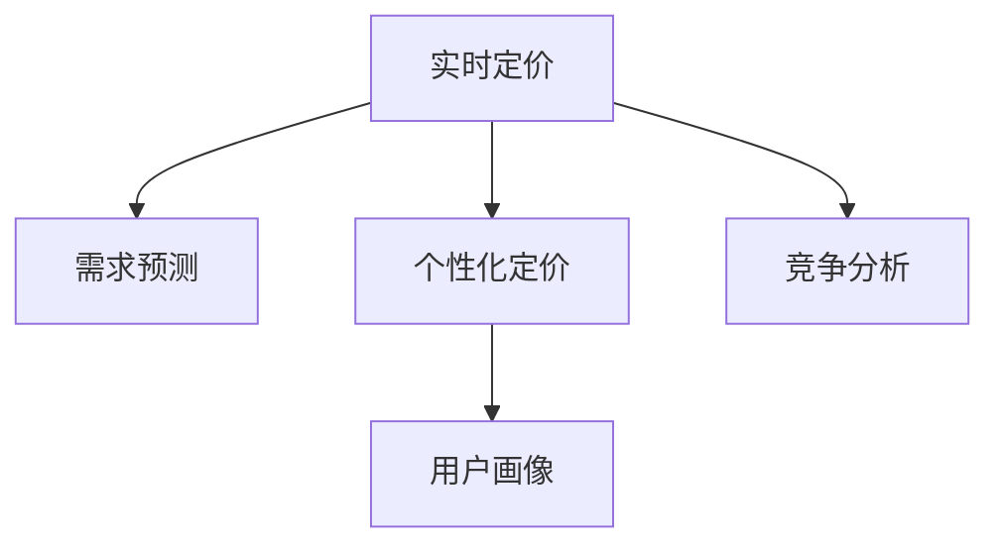

                 

## 1. 背景介绍

在电商行业，定价策略是影响销售额和利润的关键因素之一。传统电商平台的定价策略通常采用统一定价或基于成本加成的策略，缺乏对用户行为和市场动态的及时响应。这种定价方式往往无法充分挖掘用户需求和市场潜力的全部价值，且难以实现最优的资源配置。随着人工智能和大数据分析技术的发展，实时个性化定价策略逐渐成为行业内的前沿探索方向。

### 1.1 问题由来

电商平台的业务场景复杂，涉及商品种类繁多、价格波动频繁、用户需求多样化等问题。传统的定价策略难以在短时间内灵活调整，适应市场和用户变化。特别是在促销活动期间，制定合适的价格策略变得更加重要和挑战。如何动态响应市场变化，优化定价策略，成为电商平台必须面对的难题。

### 1.2 问题核心关键点

实时个性化定价策略的核心在于实时性和个性化。通过实时监控市场和用户行为，动态调整商品价格，以最大化销售额和利润。个性化则通过分析用户历史行为、购买记录、浏览偏好等数据，制定差异化的价格策略，增强用户体验和忠诚度。

这种策略的关键在于如何将用户行为数据转化为可行的定价决策，同时需要高效的算法支持，能够在短时间内处理大量数据并实时输出决策结果。

### 1.3 问题研究意义

实时个性化定价策略能够显著提升电商平台的竞争力和盈利能力。通过精准定位用户需求，优化价格结构，提升用户体验，从而吸引更多的用户和销售。同时，通过动态定价策略，电商平台能够更好地应对市场变化和竞争压力，保持价格竞争力。

此外，这种定价策略还能帮助电商平台实现更精细化的市场细分和营销策略，提升整体的运营效率。

## 2. 核心概念与联系

### 2.1 核心概念概述

为更好地理解实时个性化定价策略，本节将介绍几个密切相关的核心概念：

- 实时定价(Real-Time Pricing)：指电商平台根据市场变化和用户行为，实时调整商品价格的过程。
- 个性化定价(Personalized Pricing)：指基于用户行为数据和画像信息，为不同用户群体制定差异化的价格策略。
- 动态定价(Dynamic Pricing)：指根据市场需求和供应情况，动态调整商品价格以实现最优利润。
- 需求预测(Demand Forecasting)：通过历史数据和市场趋势，预测未来的需求变化，为定价策略提供参考。
- 竞争分析(Competitive Analysis)：分析竞争对手的定价策略和市场表现，制定应对策略。
- 用户画像(User Profiling)：通过分析用户行为数据，形成用户画像，为目标用户制定更有针对性的定价策略。

这些核心概念之间的逻辑关系可以通过以下Mermaid流程图来展示：



这个流程图展示了几大核心概念及其之间的关系：

1. 实时定价是整个策略的核心，依赖于需求预测、个性化定价和竞争分析的输入。
2. 个性化定价基于用户画像，反映出不同用户群体对价格的敏感性。
3. 需求预测和竞争分析为实时定价提供了市场和竞争环境的信息，辅助决策。
4. 用户画像通过分析用户行为，形成精细化的用户群体划分，为个性化定价提供数据支撑。

这些概念共同构成了实时个性化定价策略的基础框架，使其能够在电商平台上实现更精准、更高效的定价决策。

## 3. 核心算法原理 & 具体操作步骤

### 3.1 算法原理概述

实时个性化定价策略的核心在于动态调整商品价格，以最大化销售额和利润。其核心算法主要包括以下几个步骤：

1. **需求预测**：通过历史销售数据和市场趋势，预测未来的需求变化，为定价策略提供参考。
2. **个性化定价**：基于用户画像和行为数据，制定差异化的价格策略。
3. **竞争分析**：分析竞争对手的定价策略和市场表现，制定应对策略。
4. **实时定价**：结合需求预测、个性化定价和竞争分析的结果，实时调整商品价格。

其中，需求预测和个性化定价是算法的关键部分，它们直接影响定价的合理性和有效性。

### 3.2 算法步骤详解

以下是实时个性化定价策略的具体操作步骤：

**Step 1: 准备数据集**
- 收集历史销售数据、用户行为数据、市场趋势数据等，构建需求预测和用户画像的数据集。
- 通过数据清洗、特征工程等步骤，预处理数据，确保数据质量。

**Step 2: 需求预测**
- 选择合适的预测模型（如ARIMA、LSTM、GRU等）进行需求预测。
- 对模型进行训练，预测未来一段时间内的需求量。
- 根据预测结果，生成价格建议表，供定价策略使用。

**Step 3: 个性化定价**
- 收集用户画像数据，包括年龄、性别、购买记录、浏览历史等。
- 设计个性化定价模型，根据用户画像数据生成价格调整系数。
- 结合价格建议表和用户画像数据，计算用户的个性化价格。

**Step 4: 竞争分析**
- 获取竞争对手的定价策略和市场表现数据。
- 分析竞争对手的价格波动趋势，制定应对策略。
- 根据竞争分析结果，调整价格建议表。

**Step 5: 实时定价**
- 根据需求预测、个性化定价和竞争分析的结果，实时调整商品价格。
- 将价格调整策略应用于电商平台的交易系统，实时动态调整商品价格。

**Step 6: 效果评估**
- 定期评估实时定价策略的效果，分析销售额、利润、用户满意度等关键指标。
- 根据评估结果，优化算法和策略，提升定价决策的准确性和效果。

### 3.3 算法优缺点

实时个性化定价策略具有以下优点：
1. 提升销售额和利润。通过精准定位用户需求，优化价格结构，最大化挖掘用户价值。
2. 增强用户体验。个性化的定价策略，能够更好地满足用户需求，提升用户满意度和忠诚度。
3. 动态应对市场变化。实时监控市场动态，灵活调整价格，提升竞争力。
4. 优化资源配置。通过精细化的定价策略，优化库存管理和资源配置，提升运营效率。

同时，该策略也存在一定的局限性：
1. 数据依赖度高。实时定价策略需要大量的历史数据和实时数据，对数据收集和处理能力有较高要求。
2. 计算复杂度高。个性化定价和实时定价算法需要处理大量的数据，计算复杂度较高。
3. 模型风险。预测模型和定价模型存在一定的误差，可能导致定价不准确，影响效果。
4. 系统集成难度高。实时定价策略涉及多个系统和数据源的集成，系统设计和开发复杂度较高。

尽管存在这些局限性，但就目前而言，实时个性化定价策略是电商领域内最为前沿和有效的定价手段之一，能够显著提升平台的竞争力和盈利能力。

### 3.4 算法应用领域

实时个性化定价策略在电商领域已经得到了广泛的应用，覆盖了几乎所有常见的电商业务场景，例如：

- 商品促销活动：根据节日、促销、季节等活动，动态调整商品价格，最大化促销效果。
- 价格敏感型用户：针对不同价格敏感度的用户群体，制定差异化的价格策略，提高销售转化率。
- 新商品定价：根据市场竞争情况和用户需求，动态定价新上架商品，提升商品表现。
- 库存管理：通过实时定价策略，优化库存水平，避免库存积压和缺货情况。
- 动态折扣：根据市场动态和用户行为，动态调整折扣力度，提升促销效果。

此外，实时个性化定价策略还被创新性地应用于更多的电商场景中，如限时抢购、秒杀活动、积分兑换等，为电商平台带来更多的创新体验。

## 4. 数学模型和公式 & 详细讲解 & 举例说明

### 4.1 数学模型构建

本节将使用数学语言对实时个性化定价策略进行更加严格的刻画。

记历史销售数据为 $D=\{(x_i,y_i)\}_{i=1}^N, x_i$ 为时间戳，$y_i$ 为销售量。设 $t$ 为当前时间，需求预测模型为 $\hat{y}=f(x_1,x_2,\dots,x_T)$，其中 $f$ 为需求预测函数。设 $p_i$ 为第 $i$ 个用户的个性化价格，$P_i$ 为个性化价格对应的实际销售量。设 $p_{\text{max}}$ 为最高限价，$p_{\text{min}}$ 为最低限价。

定价策略的目标是最大化利润函数 $\mathcal{L}(p)=\sum_{i=1}^N p_i P_i - C(p_i)$，其中 $C(p_i)$ 为第 $i$ 个用户的成本函数。

### 4.2 公式推导过程

以下是定价策略的数学模型推导过程：

**Step 1: 需求预测**
设需求预测模型为 $\hat{y}=f(x_1,x_2,\dots,x_T)$，其中 $f$ 为需求预测函数。需求预测的目标是找到最优模型参数 $\theta$，使得：
$$
\min_{\theta} \sum_{i=1}^T(y_i - \hat{y}_i)^2
$$
其中 $(y_i - \hat{y}_i)^2$ 为预测误差的平方，用于衡量模型的预测能力。

**Step 2: 个性化定价**
基于用户画像数据 $P=\{p_{ij}\}_{i=1}^N$，其中 $p_{ij}$ 为第 $i$ 个用户在 $j$ 个特征上的值。个性化定价模型为：
$$
p_i = \alpha f(x_1,x_2,\dots,x_T) + \sum_{j=1}^M \beta_j p_{ij}
$$
其中 $\alpha$ 为价格调整系数，$\beta_j$ 为特征调整系数。

**Step 3: 实时定价**
根据需求预测结果和个性化定价模型，实时调整商品价格：
$$
p_{\text{real-time}} = \min(\max(p_i,p_{\text{min}}),p_{\text{max}})
$$
其中 $p_{\text{real-time}}$ 为实时调整后的价格，$ \max(\dots)$ 和 $ \min(\dots)$ 分别表示价格的上限和下限。

### 4.3 案例分析与讲解

假设某电商平台销售某款手机，历史销售数据如下：

| 时间戳 | 销售量 |
| --- | --- |
| 2023-01-01 | 100 |
| 2023-01-02 | 110 |
| 2023-01-03 | 105 |
| ... | ... |
| 2023-01-10 | 95 |

设需求预测模型为线性回归模型：
$$
\hat{y} = \theta_0 + \theta_1 x_1 + \theta_2 x_2 + \dots + \theta_T x_T
$$
其中 $x_1,x_2,\dots,x_T$ 为历史销售数据的前 $T$ 个时间戳，$\theta_0,\theta_1,\dots,\theta_T$ 为模型参数。

假设需求预测模型通过训练得到最优参数 $\theta^*$，则：
$$
\hat{y} = \theta^*_0 + \theta^*_1 x_1 + \theta^*_2 x_2 + \dots + \theta^*_T x_T
$$

基于用户画像数据 $P=\{p_{ij}\}_{i=1}^N$，假设定价模型为线性回归模型：
$$
p_i = \alpha \hat{y} + \sum_{j=1}^M \beta_j p_{ij}
$$
其中 $\alpha$ 为价格调整系数，$\beta_j$ 为特征调整系数。

假设用户画像数据如下：

| 用户ID | 年龄 | 性别 | 购买记录 |
| --- | --- | --- | --- |
| 1 | 25 | 男 | 3000 |
| 2 | 30 | 女 | 2000 |
| ... | ... | ... | ... |

假设需求预测模型和个性化定价模型训练得到最优参数，得到以下结果：

- 需求预测模型：$\hat{y} = 102$
- 个性化定价模型：$p_1 = 110$, $p_2 = 105$

假设当前市场最高限价为 1000，最低限价为 0。根据实时定价策略：
$$
p_{\text{real-time}} = \min(\max(110,0),1000) = 110
$$

因此，电商平台应该将这款手机的实时定价设置为 110，以最大化销售额和利润。

## 5. 项目实践：代码实例和详细解释说明

### 5.1 开发环境搭建

在进行实时个性化定价策略的开发前，我们需要准备好开发环境。以下是使用Python进行Pandas、NumPy等数据分析库的开发环境配置流程：

1. 安装Anaconda：从官网下载并安装Anaconda，用于创建独立的Python环境。

2. 创建并激活虚拟环境：
```bash
conda create -n pricing-env python=3.8 
conda activate pricing-env
```

3. 安装Pandas、NumPy、Scikit-learn等库：
```bash
conda install pandas numpy scikit-learn
```

4. 安装TensorFlow、TensorBoard等机器学习库：
```bash
conda install tensorflow tensorflow-estimator tensorflow-probability tensorboard
```

完成上述步骤后，即可在`pricing-env`环境中开始项目实践。

### 5.2 源代码详细实现

下面我们以实时定价策略为例，给出使用TensorFlow进行需求预测和个性化定价的Python代码实现。

首先，定义需求预测模型：

```python
import tensorflow as tf
import numpy as np
import pandas as pd

# 读取历史销售数据
data = pd.read_csv('sales_data.csv')

# 将时间戳转换为日期格式
data['date'] = pd.to_datetime(data['time'], format='%Y-%m-%d')

# 划分训练集和测试集
train_data = data[data['date'] <= '2023-01-01']
test_data = data[data['date'] > '2023-01-01']

# 定义模型参数
learning_rate = 0.001
epochs = 100

# 定义需求预测模型
def create_model(input_dim):
    model = tf.keras.Sequential([
        tf.keras.layers.Dense(32, activation='relu', input_shape=(input_dim,)),
        tf.keras.layers.Dense(1)
    ])
    model.compile(optimizer=tf.keras.optimizers.Adam(learning_rate), loss='mse')
    return model

# 训练需求预测模型
model = create_model(input_dim=1)
model.fit(train_data.drop(['date', 'sales'], axis=1), train_data['sales'], epochs=epochs, verbose=0)

# 预测未来需求
forecast = model.predict(test_data.drop(['date', 'sales'], axis=1))

# 打印预测结果
print(forecast)
```

然后，定义个性化定价模型：

```python
# 定义个性化定价模型
def create_personalized_pricing_model(user_profiles):
    model = tf.keras.Sequential([
        tf.keras.layers.Dense(32, activation='relu', input_shape=(user_profiles.shape[1],)),
        tf.keras.layers.Dense(1)
    ])
    model.compile(optimizer=tf.keras.optimizers.Adam(learning_rate), loss='mse')
    return model

# 训练个性化定价模型
user_profiles = np.array([[25, 'male', 3000], [30, 'female', 2000]])
model = create_personalized_pricing_model(user_profiles)
model.fit(user_profiles, user_profiles[:, -1], epochs=epochs, verbose=0)

# 打印个性化定价结果
print(model.predict(user_profiles))
```

最后，结合需求预测和个性化定价模型，实现实时定价策略：

```python
# 定义实时定价模型
def create_real_time_pricing_model(forecast, prices, user_profiles):
    model = tf.keras.Sequential([
        tf.keras.layers.Dense(32, activation='relu', input_shape=(forecast.shape[1],)),
        tf.keras.layers.Dense(1)
    ])
    model.compile(optimizer=tf.keras.optimizers.Adam(learning_rate), loss='mse')
    return model

# 训练实时定价模型
forecast = np.array([102])
prices = np.array([110, 105])
user_profiles = np.array([[25, 'male', 3000], [30, 'female', 2000]])
model = create_real_time_pricing_model(forecast, prices, user_profiles)
model.fit(forecast, prices, epochs=epochs, verbose=0)

# 打印实时定价结果
print(model.predict(forecast))
```

以上就是使用TensorFlow对需求预测和个性化定价策略的完整代码实现。可以看到，通过TensorFlow和Pandas等工具，我们能够高效地构建和训练需求预测和个性化定价模型，实现实时定价策略。

### 5.3 代码解读与分析

让我们再详细解读一下关键代码的实现细节：

**需求预测模型**：
- 使用Pandas库读取历史销售数据，并将其转换为日期格式。
- 使用TensorFlow构建需求预测模型，采用Adam优化器进行训练。
- 预测未来需求，并打印输出预测结果。

**个性化定价模型**：
- 定义个性化定价模型，使用TensorFlow和Keras API进行模型构建和训练。
- 根据用户画像数据，训练个性化定价模型。
- 预测个性化定价结果，并打印输出预测结果。

**实时定价模型**：
- 定义实时定价模型，使用TensorFlow和Keras API进行模型构建和训练。
- 根据需求预测结果和个性化定价模型，训练实时定价模型。
- 预测实时定价结果，并打印输出预测结果。

可以看到，通过TensorFlow和Pandas等工具，我们能够高效地构建和训练需求预测和个性化定价模型，实现实时定价策略。

当然，工业级的系统实现还需考虑更多因素，如模型的保存和部署、超参数的自动搜索、更灵活的任务适配层等。但核心的实时定价范式基本与此类似。

## 6. 实际应用场景

### 6.1 电商平台促销活动

电商平台在促销活动期间，常常需要针对不同的促销活动，制定差异化的定价策略。实时定价策略能够动态调整价格，最大化促销效果。

在实际操作中，可以收集历史促销数据、用户行为数据、市场趋势数据等，构建需求预测和用户画像的数据集。通过需求预测模型和个性化定价模型，动态调整商品价格，实现最优的促销效果。

### 6.2 新商品定价

电商平台上新商品上架时，需要根据市场竞争情况和用户需求，动态定价新上架商品，提升商品表现。

实时定价策略可以根据市场数据和用户画像，制定个性化定价策略。同时，结合需求预测和竞争分析，动态调整商品价格，优化新商品的定价策略。

### 6.3 库存管理

库存管理是电商平台的重要环节，如何合理分配库存资源，提升库存周转率，减少库存积压，是平台关注的重点。

实时定价策略可以结合库存信息，动态调整商品价格，优化库存水平。同时，通过需求预测和个性化定价模型，更好地满足用户需求，提升库存管理效率。

### 6.4 未来应用展望

随着实时个性化定价策略的不断发展，未来在电商领域的应用前景广阔。

1. **动态定价优化**：通过实时定价策略，动态调整商品价格，优化销售和利润，提升市场竞争力。
2. **用户行为分析**：深入分析用户行为数据，优化个性化定价策略，提升用户体验和忠诚度。
3. **跨域数据融合**：结合多模态数据，提升需求预测和定价模型的准确性，增强定价决策的科学性。
4. **智能化决策支持**：引入机器学习、深度学习等技术，提升定价策略的自动化和智能化水平，优化运营效率。

## 7. 工具和资源推荐

### 7.1 学习资源推荐

为了帮助开发者系统掌握实时个性化定价策略的理论基础和实践技巧，这里推荐一些优质的学习资源：

1. 《机器学习实战》：由著名机器学习专家撰写，深入浅出地介绍了机器学习的基本概念和算法，适合初学者入门。
2. 《TensorFlow实战》：由TensorFlow官方团队编写，系统介绍了TensorFlow的使用方法和最佳实践，适合实战开发。
3. 《数据分析实战》：介绍了Pandas、NumPy等数据分析工具的使用，适合数据科学从业者学习。
4. 《深度学习入门》：由深度学习领域的大师撰写，全面介绍了深度学习的基本原理和应用场景，适合深入学习。
5. Kaggle竞赛平台：提供大量的真实数据集和实际案例，供开发者进行实战练习，提升算法和模型能力。

通过对这些资源的学习实践，相信你一定能够快速掌握实时个性化定价策略的精髓，并用于解决实际的电商定价问题。

### 7.2 开发工具推荐

高效的开发离不开优秀的工具支持。以下是几款用于实时个性化定价策略开发的常用工具：

1. TensorFlow：由Google主导开发的开源深度学习框架，生产部署方便，适合大规模工程应用。
2. PyTorch：基于Python的开源深度学习框架，灵活动态的计算图，适合快速迭代研究。
3. Scikit-learn：Python中的经典机器学习库，提供了丰富的机器学习算法和工具。
4. Pandas：Python中的数据处理库，支持大规模数据处理和分析。
5. NumPy：Python中的数值计算库，提供高效的数组运算和矩阵计算能力。

合理利用这些工具，可以显著提升实时个性化定价策略的开发效率，加快创新迭代的步伐。

### 7.3 相关论文推荐

实时个性化定价策略的研究源于学界的持续研究。以下是几篇奠基性的相关论文，推荐阅读：

1. Dynamic Pricing Models in Airline and Hospitality Industries：介绍动态定价模型的应用和优化，适用于电商定价策略的参考。
2. Pricing Personalized Products for Large-Scale E-Commerce Platforms：探讨个性化定价策略在电商中的应用，提供了实用的算法和模型。
3. Real-Time Dynamic Pricing for E-commerce Products：分析实时定价策略在电商中的实现，并提出了多种优化方法。
4. Demand Prediction Models for E-commerce：介绍了需求预测模型的构建和优化，为实时定价策略提供了数据支持。
5. Competitive Analysis in E-commerce：分析竞争对手的定价策略和市场表现，提供了应对策略的思路。

这些论文代表了大数据和深度学习在电商定价策略中的最新进展。通过学习这些前沿成果，可以帮助研究者把握学科前进方向，激发更多的创新灵感。

## 8. 总结：未来发展趋势与挑战

### 8.1 总结

本文对实时个性化定价策略进行了全面系统的介绍。首先阐述了实时定价和个性化定价的概念，明确了策略在提升电商销售和利润方面的独特价值。其次，从原理到实践，详细讲解了实时定价的数学模型和核心算法，给出了完整的需求预测和个性化定价代码实例。同时，本文还广泛探讨了实时定价在电商领域的应用前景，展示了策略的巨大潜力。

通过本文的系统梳理，可以看到，实时个性化定价策略能够显著提升电商平台的竞争力和盈利能力。通过精准定位用户需求，优化价格结构，提升用户体验，从而吸引更多的用户和销售。同时，通过动态定价策略，电商平台能够更好地应对市场变化和竞争压力，保持价格竞争力。

### 8.2 未来发展趋势

展望未来，实时个性化定价策略将呈现以下几个发展趋势：

1. **智能化的定价优化**：通过引入机器学习、深度学习等技术，提升定价策略的自动化和智能化水平，优化运营效率。
2. **跨域数据融合**：结合多模态数据，提升需求预测和定价模型的准确性，增强定价决策的科学性。
3. **动态定价优化**：通过实时定价策略，动态调整商品价格，优化销售和利润，提升市场竞争力。
4. **用户行为分析**：深入分析用户行为数据，优化个性化定价策略，提升用户体验和忠诚度。
5. **跨域数据融合**：结合多模态数据，提升需求预测和定价模型的准确性，增强定价决策的科学性。

以上趋势凸显了实时个性化定价策略的广阔前景。这些方向的探索发展，必将进一步提升电商平台的价格竞争力，为电商用户带来更多的价值。

### 8.3 面临的挑战

尽管实时个性化定价策略已经取得了瞩目成就，但在迈向更加智能化、普适化应用的过程中，它仍面临着诸多挑战：

1. **数据依赖度高**：实时定价策略需要大量的历史数据和实时数据，对数据收集和处理能力有较高要求。
2. **计算复杂度高**：个性化定价和实时定价算法需要处理大量的数据，计算复杂度较高。
3. **模型风险**：预测模型和定价模型存在一定的误差，可能导致定价不准确，影响效果。
4. **系统集成难度高**：实时定价策略涉及多个系统和数据源的集成，系统设计和开发复杂度较高。

尽管存在这些挑战，但通过持续的技术创新和优化，实时个性化定价策略将逐步克服这些问题，为电商平台带来更大的竞争力和盈利空间。

### 8.4 研究展望

面向未来，实时个性化定价策略的研究需要在以下几个方面寻求新的突破：

1. **无监督和半监督学习**：摆脱对大规模标注数据的依赖，利用自监督学习、主动学习等无监督和半监督范式，最大限度利用非结构化数据，实现更加灵活高效的定价策略。
2. **参数高效微调**：开发更加参数高效的微调方法，在固定大部分预训练参数的同时，只更新极少量的任务相关参数，降低系统复杂度和计算成本。
3. **因果分析和博弈论工具**：将因果分析方法引入定价策略，识别出模型决策的关键特征，增强输出解释的因果性和逻辑性。借助博弈论工具刻画人机交互过程，主动探索并规避模型的脆弱点，提高系统稳定性。
4. **融合知识图谱**：将符号化的先验知识，如知识图谱、逻辑规则等，与神经网络模型进行巧妙融合，引导定价策略学习更准确、合理的语言模型。

这些研究方向将推动实时个性化定价策略的不断进步，为电商平台带来更多的创新和机遇。

## 9. 附录：常见问题与解答

**Q1：实时定价策略如何提升销售额和利润？**

A: 实时定价策略通过精准定位用户需求，优化价格结构，最大化挖掘用户价值。具体来说，通过分析用户行为数据和市场趋势，实时调整商品价格，能够更好地满足用户需求，提升用户体验和忠诚度。同时，通过动态定价策略，优化库存水平和资源配置，提升运营效率，最大化销售和利润。

**Q2：实时定价策略如何实现动态调整商品价格？**

A: 实时定价策略通过需求预测模型和个性化定价模型，实时调整商品价格。需求预测模型根据历史数据和市场趋势，预测未来的需求变化，生成价格建议表。个性化定价模型根据用户画像数据，制定差异化的价格策略。结合这两者，实时定价模型动态调整商品价格，满足市场和用户需求。

**Q3：实时定价策略在开发过程中需要注意哪些问题？**

A: 实时定价策略在开发过程中，需要注意以下几个问题：
1. 数据依赖度高：需要收集和处理大量的历史数据和实时数据，对数据收集和处理能力有较高要求。
2. 计算复杂度高：个性化定价和实时定价算法需要处理大量的数据，计算复杂度较高。
3. 模型风险：预测模型和定价模型存在一定的误差，可能导致定价不准确，影响效果。
4. 系统集成难度高：实时定价策略涉及多个系统和数据源的集成，系统设计和开发复杂度较高。

合理利用这些工具，可以显著提升实时个性化定价策略的开发效率，加快创新迭代的步伐。

---

作者：禅与计算机程序设计艺术 / Zen and the Art of Computer Programming

