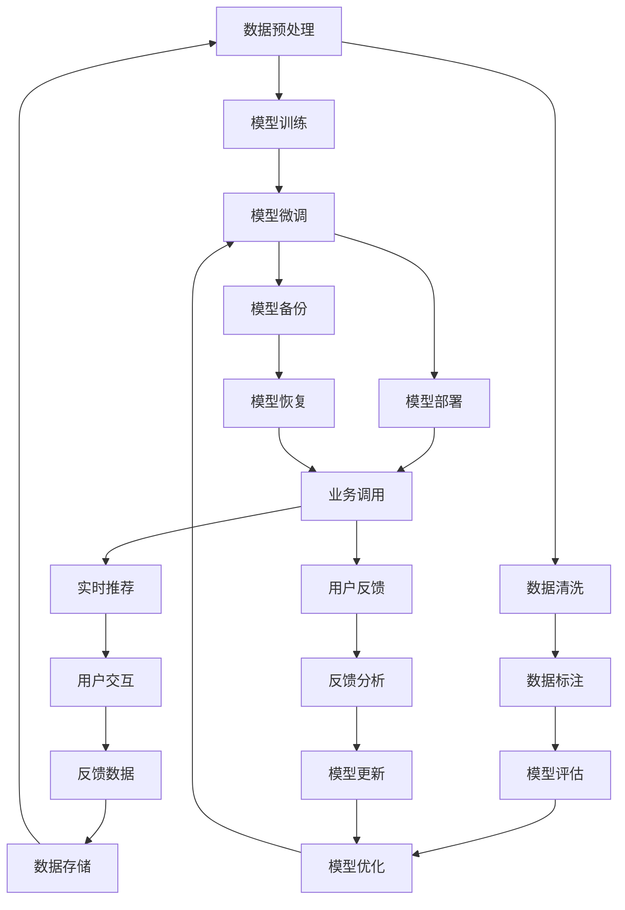

                 

# 电商搜索推荐场景下的AI大模型模型部署容灾演练方案

> 关键词：电商搜索推荐,AI大模型,模型部署,容灾演练

## 1. 背景介绍

### 1.1 问题由来

随着电子商务的迅猛发展，个性化推荐系统已成为电商平台的核心竞争力之一。通过分析用户行为数据，为每一位用户推荐最合适的商品，能够大幅提升用户体验和转化率，实现平台收益最大化。

当前，业界主流的推荐系统多采用基于机器学习的方法，如协同过滤、内容推荐、深度学习等。然而，这些系统往往需要大量的数据和计算资源进行训练和预测，同时其性能很大程度上依赖于推荐模型的质量，而高品质的模型训练和部署则需要大量的研发人力和周期。

近年来，AI大模型在电商推荐场景中也开始被广泛应用。通过预训练-微调的方式，大模型在处理海量用户行为数据时，能够提取出更深层次的特征，并具备更强的泛化能力。然而，大模型模型部署和运维过程中面临诸多挑战，包括模型质量波动、系统故障、数据泄露等风险。如何构建一个高效、稳定、可扩展的推荐系统，成为了电商平台亟需解决的问题。

### 1.2 问题核心关键点

基于大模型的电商推荐系统主要面临以下关键问题：

- **模型质量波动**：大模型训练和微调过程中，可能由于数据噪声、超参数不当等原因，导致模型性能不稳定，进而影响推荐效果。
- **系统故障与宕机**：推荐系统可能遭遇硬件故障、网络中断等突发事件，导致系统服务中断，影响用户体验。
- **数据安全和隐私保护**：电商平台需要处理大量用户行为数据，在保证数据安全的同时，也要避免数据泄露风险。
- **模型更新与迭代**：大模型更新周期较长，如何高效地部署新模型，同时保证用户和系统的兼容性，是推荐系统面临的重要问题。

针对上述问题，本文将重点探讨在电商搜索推荐场景下，如何构建一套高效的AI大模型部署容灾演练方案，确保推荐系统稳定可靠地运行。

## 2. 核心概念与联系

### 2.1 核心概念概述

为更好地理解本文所述方案，本节将介绍几个关键概念：

- **AI大模型**：以Transformer为基础的预训练语言模型，如GPT、BERT、RoBERTa等。这类模型通过在大规模数据上进行预训练，具备强大的自然语言理解和生成能力，能够应用于自然语言处理、计算机视觉、推荐系统等多个领域。
- **电商搜索推荐**：电商平台通过分析用户行为数据，如浏览历史、购买记录、搜索词等，为用户提供个性化的商品推荐，提升用户体验和转化率。
- **模型部署**：将训练好的AI模型迁移到线上服务器，供业务系统调用，进行实时推荐。
- **容灾演练**：在生产环境前，通过模拟故障和攻击场景，评估推荐系统在不同情况下的稳定性和鲁棒性，验证其容灾能力。

### 2.2 核心概念原理和架构的 Mermaid 流程图



这个流程图展示了从数据预处理到模型备份的整个流程。首先通过数据清洗和标注，获取高质量的训练数据。模型经过训练和微调后，部署到生产环境，供业务系统调用，进行实时推荐。推荐系统将用户行为反馈数据存储下来，供后续分析和模型优化。同时，系统将定期进行备份和恢复操作，确保模型数据的可靠性。

## 3. 核心算法原理 & 具体操作步骤

### 3.1 算法原理概述

本文所述容灾演练方案的核心是构建一个多层次、多维度的故障模拟和模型验证体系，确保AI大模型在电商推荐系统中的稳定性和可靠性。方案基于以下几个核心算法原理：

- **模型质量监控**：通过持续监控模型性能指标，如精度、召回率、F1值等，及时发现模型波动和异常。
- **系统故障模拟**：在生产环境中模拟硬件故障、网络中断、数据丢失等异常情况，评估系统在不同故障下的表现。
- **容灾备份与恢复**：定期备份模型参数和状态，提供快速恢复机制，确保系统在意外情况下的业务连续性。
- **数据安全和隐私保护**：采用数据加密、访问控制等措施，保护用户数据隐私，避免数据泄露风险。

### 3.2 算法步骤详解

本节将详细阐述各个算法步骤的操作流程：

#### 3.2.1 数据预处理与标注

电商搜索推荐系统需要处理大量的用户行为数据，包括但不限于浏览记录、搜索词、点击行为等。数据预处理和标注是推荐系统构建的基础，具体步骤如下：

1. **数据清洗**：去除重复、异常、不完整的数据，保证数据质量。
2. **特征提取**：通过文本分析、统计特征提取等方法，将原始数据转换为模型可接受的格式。
3. **数据标注**：为每一条数据标注相应的标签，如商品ID、类别等。

#### 3.2.2 模型训练与微调

模型训练和微调是大模型推荐系统构建的核心步骤，具体步骤如下：

1. **模型选择**：选择合适的预训练大模型，如BERT、GPT-2等。
2. **超参数设置**：设置学习率、批大小、迭代轮数等超参数。
3. **模型微调**：在标注数据集上，通过有监督学习训练模型，优化模型在电商推荐任务上的表现。
4. **模型评估**：在验证集上评估模型性能，通过精度、召回率等指标评估模型效果。

#### 3.2.3 模型部署与业务调用

模型部署是将训练好的模型迁移到线上服务器，供业务系统调用的过程。具体步骤如下：

1. **环境搭建**：搭建线上服务器环境，安装必要的软件和依赖。
2. **模型加载**：将训练好的模型参数加载到线上服务器。
3. **业务调用**：将模型封装为标准API接口，供业务系统调用，进行实时推荐。

#### 3.2.4 模型质量监控与性能评估

模型质量监控和性能评估是确保推荐系统稳定运行的重要环节。具体步骤如下：

1. **监控指标**：定义监控指标，如精度、召回率、F1值、模型延迟等。
2. **实时监控**：通过数据采集和分析，实时监控模型性能。
3. **异常检测**：设定异常检测阈值，及时发现模型波动和异常情况。
4. **性能优化**：根据监控结果，调整模型参数和超参数，优化模型性能。

#### 3.2.5 系统故障模拟与容灾演练

系统故障模拟和容灾演练是保障推荐系统稳定运行的关键步骤，具体步骤如下：

1. **故障场景模拟**：模拟硬件故障、网络中断、数据丢失等异常情况，评估系统在不同故障下的表现。
2. **容灾策略制定**：制定容灾策略，如负载均衡、数据备份、故障转移等。
3. **演练实施**：按照容灾策略，进行系统故障模拟和演练，验证系统的容灾能力。
4. **恢复与优化**：根据演练结果，优化系统架构和容灾策略，确保系统的可靠性。

#### 3.2.6 数据安全和隐私保护

数据安全和隐私保护是电商推荐系统必须面对的重要问题，具体步骤如下：

1. **数据加密**：对用户数据进行加密处理，保护用户隐私。
2. **访问控制**：通过权限控制，确保只有授权用户可以访问敏感数据。
3. **数据审计**：定期审计数据访问记录，发现和处理异常访问行为。
4. **合规检查**：确保数据处理和存储符合相关法律法规，如GDPR、CCPA等。

### 3.3 算法优缺点

本文所述容灾演练方案具有以下优点：

- **全面性**：覆盖数据预处理、模型训练、模型部署、系统故障模拟、数据安全等多个方面，全面保障推荐系统的稳定性和可靠性。
- **实时性**：通过实时监控和异常检测，及时发现和解决问题，确保推荐系统实时运行。
- **可扩展性**：系统架构和容灾策略可根据实际需求进行调整，具备良好的可扩展性。

然而，方案也存在一些缺点：

- **复杂性**：方案涉及多个环节和步骤，实施和维护相对复杂。
- **成本高**：高品质的推荐系统需要大量的计算资源和人力，初期投入较大。

### 3.4 算法应用领域

本文所述容灾演练方案适用于各种电商推荐系统的构建和运维，特别是对系统稳定性和可靠性要求较高的场景，如大型电商网站、移动购物应用等。通过在电商推荐系统中部署该方案，可以有效提高系统的可靠性、稳定性和安全性。

## 4. 数学模型和公式 & 详细讲解 & 举例说明

### 4.1 数学模型构建

本文所述容灾演练方案的数学模型主要涉及数据预处理、模型训练、模型部署、系统故障模拟等多个环节。以下将对各个环节的数学模型进行详细讲解。

#### 4.1.1 数据预处理模型

电商推荐系统需要处理大量的用户行为数据，数据预处理模型的目标是提取高质量的特征，生成适合模型的输入。假设用户行为数据集为 $D=\{x_i\}_{i=1}^N$，其中 $x_i$ 为用户行为记录。预处理模型 $P$ 的输出为特征表示 $\hat{x_i} \in \mathbb{R}^d$，其中 $d$ 为特征维度。预处理模型的构建过程如下：

1. **特征提取**：将原始数据转换为特征向量，假设特征提取函数为 $F$，则有：

   $$
   \hat{x_i} = F(x_i)
   $$

2. **数据标准化**：对特征向量进行标准化处理，假设标准化函数为 $N$，则有：

   $$
   \tilde{x_i} = N(\hat{x_i})
   $$

   其中 $\tilde{x_i} \in \mathbb{R}^d$，标准化后的特征向量。

3. **数据归一化**：对标准化后的特征向量进行归一化处理，假设归一化函数为 $R$，则有：

   $$
   \bar{x_i} = R(\tilde{x_i})
   $$

   其中 $\bar{x_i} \in [0,1]^d$，归一化后的特征向量。

#### 4.1.2 模型训练模型

电商推荐系统采用预训练-微调的方式训练模型。假设预训练模型为 $M_{\theta}$，其中 $\theta$ 为预训练得到的模型参数。微调模型的目标是在标注数据集 $D'$ 上进行有监督学习，优化模型参数 $\hat{\theta}$，使得模型在电商推荐任务上表现最佳。具体数学模型如下：

1. **损失函数**：定义损失函数 $L$，用于衡量模型预测输出与真实标签之间的差异，假设损失函数为交叉熵损失函数，则有：

   $$
   L(\hat{\theta}) = -\frac{1}{N'} \sum_{i=1}^{N'} y_i \log \hat{y_i}
   $$

   其中 $y_i$ 为真实标签，$\hat{y_i}$ 为模型预测输出，$N'$ 为标注数据集的大小。

2. **优化器**：采用优化算法（如AdamW、SGD等）最小化损失函数，更新模型参数 $\hat{\theta}$，具体公式如下：

   $$
   \hat{\theta} \leftarrow \hat{\theta} - \eta \nabla_{\hat{\theta}}L(\hat{\theta})
   $$

   其中 $\eta$ 为学习率。

#### 4.1.3 模型部署模型

模型部署是将训练好的模型迁移到线上服务器，供业务系统调用的过程。假设模型在训练集 $D'$ 上的损失函数为 $L'$，模型参数为 $\hat{\theta}$，部署模型 $M_{\hat{\theta}}$ 的目标是最小化损失函数 $L'$。具体公式如下：

1. **部署模型**：将模型参数 $\hat{\theta}$ 加载到线上服务器，生成部署模型 $M_{\hat{\theta}}$。

2. **业务调用**：将部署模型封装为标准API接口，供业务系统调用，进行实时推荐。

#### 4.1.4 系统故障模拟模型

系统故障模拟模型的目标是评估推荐系统在不同故障情况下的表现。假设故障场景为硬件故障、网络中断、数据丢失等，模型 $F$ 的输出为系统故障情况下的推荐效果，具体公式如下：

1. **故障场景模拟**：定义故障场景 $S$，包括硬件故障、网络中断、数据丢失等，假设故障场景数量为 $n$，则有：

   $$
   S = \{S_1, S_2, ..., S_n\}
   $$

2. **故障评估指标**：定义故障评估指标 $E$，如推荐准确率、推荐召回率、用户满意度等，假设评估指标数量为 $m$，则有：

   $$
   E = \{E_1, E_2, ..., E_m\}
   $$

3. **故障模拟**：通过模拟故障场景 $S$，评估推荐系统在不同故障情况下的表现，具体公式如下：

   $$
   \{F_S\}_{S=1}^{n} = F(S)
   $$

   其中 $F_S$ 表示在故障场景 $S$ 下的推荐效果。

#### 4.1.5 数据安全和隐私保护模型

数据安全和隐私保护模型的目标是保护用户数据隐私，避免数据泄露风险。假设数据加密函数为 $E$，访问控制函数为 $A$，数据审计函数为 $D$，合规检查函数为 $C$，数据安全和隐私保护模型的构建过程如下：

1. **数据加密**：对用户数据进行加密处理，假设加密函数为 $E$，则有：

   $$
   \{E_D\}_{D=1}^{N} = E(D)
   $$

   其中 $E_D$ 表示对用户数据 $D$ 的加密结果。

2. **访问控制**：通过权限控制，确保只有授权用户可以访问敏感数据，假设访问控制函数为 $A$，则有：

   $$
   \{A_U\}_{U=1}^{M} = A(U)
   $$

   其中 $A_U$ 表示对用户 $U$ 的访问权限控制结果。

3. **数据审计**：定期审计数据访问记录，发现和处理异常访问行为，假设审计函数为 $D$，则有：

   $$
   \{D_T\}_{T=1}^{T} = D(T)
   $$

   其中 $D_T$ 表示在时间 $T$ 的数据访问审计结果。

4. **合规检查**：确保数据处理和存储符合相关法律法规，假设合规检查函数为 $C$，则有：

   $$
   C(R)
   $$

   其中 $R$ 为数据处理和存储的合规性检查结果。

### 4.2 公式推导过程

以下是各环节数学模型的详细推导过程：

#### 4.2.1 数据预处理模型推导

数据预处理模型主要涉及特征提取、标准化和归一化等步骤，具体推导如下：

1. **特征提取**：假设特征提取函数为 $F$，则有：

   $$
   \hat{x_i} = F(x_i)
   $$

2. **标准化**：假设标准化函数为 $N$，则有：

   $$
   \tilde{x_i} = N(\hat{x_i}) = \frac{\hat{x_i} - \mu}{\sigma}
   $$

   其中 $\mu$ 为特征向量均值，$\sigma$ 为特征向量标准差。

3. **归一化**：假设归一化函数为 $R$，则有：

   $$
   \bar{x_i} = R(\tilde{x_i}) = \frac{\tilde{x_i}}{\max(\tilde{x_i}, 0)}
   $$

   其中 $\max(\tilde{x_i}, 0)$ 为特征向量最大值。

#### 4.2.2 模型训练模型推导

模型训练模型主要涉及损失函数和优化器等步骤，具体推导如下：

1. **损失函数**：假设损失函数为交叉熵损失函数，则有：

   $$
   L(\hat{\theta}) = -\frac{1}{N'} \sum_{i=1}^{N'} y_i \log \hat{y_i}
   $$

2. **优化器**：假设优化算法为AdamW，则有：

   $$
   \hat{\theta} \leftarrow \hat{\theta} - \eta \nabla_{\hat{\theta}}L(\hat{\theta})
   $$

   其中 $\eta$ 为学习率，$\nabla_{\hat{\theta}}L(\hat{\theta})$ 为损失函数对模型参数的梯度。

#### 4.2.3 模型部署模型推导

模型部署模型主要涉及部署模型和业务调用等步骤，具体推导如下：

1. **部署模型**：假设部署模型为 $M_{\hat{\theta}}$，则有：

   $$
   M_{\hat{\theta}} = M_{\theta}
   $$

2. **业务调用**：假设业务系统调用接口为 $I$，则有：

   $$
   I = M_{\hat{\theta}}
   $$

   其中 $I$ 表示业务系统调用的推荐结果。

#### 4.2.4 系统故障模拟模型推导

系统故障模拟模型主要涉及故障场景模拟和故障评估指标等步骤，具体推导如下：

1. **故障场景模拟**：假设故障场景数量为 $n$，则有：

   $$
   S = \{S_1, S_2, ..., S_n\}
   $$

2. **故障评估指标**：假设评估指标数量为 $m$，则有：

   $$
   E = \{E_1, E_2, ..., E_m\}
   $$

3. **故障模拟**：假设故障模拟结果为 $\{F_S\}_{S=1}^{n}$，则有：

   $$
   \{F_S\}_{S=1}^{n} = F(S)
   $$

   其中 $F_S$ 表示在故障场景 $S$ 下的推荐效果。

#### 4.2.5 数据安全和隐私保护模型推导

数据安全和隐私保护模型主要涉及数据加密、访问控制、数据审计和合规检查等步骤，具体推导如下：

1. **数据加密**：假设加密函数为 $E$，则有：

   $$
   \{E_D\}_{D=1}^{N} = E(D)
   $$

2. **访问控制**：假设访问控制函数为 $A$，则有：

   $$
   \{A_U\}_{U=1}^{M} = A(U)
   $$

3. **数据审计**：假设审计函数为 $D$，则有：

   $$
   \{D_T\}_{T=1}^{T} = D(T)
   $$

4. **合规检查**：假设合规检查函数为 $C$，则有：

   $$
   C(R)
   $$

   其中 $R$ 为数据处理和存储的合规性检查结果。

### 4.3 案例分析与讲解

以下将以一个具体的电商推荐系统为例，分析其数据预处理、模型训练、模型部署、系统故障模拟和数据安全和隐私保护等各个环节的实现过程。

假设某电商平台需要对用户进行商品推荐。电商平台通过爬虫抓取用户浏览、点击、购买等行为数据，并对数据进行清洗和预处理。经过数据清洗，原始数据去除了重复和异常记录，特征提取函数将用户行为数据转换为适合模型的特征向量，标准化和归一化函数对特征向量进行预处理，最终生成模型可接受的输入。

在模型训练环节，电商平台选择BERT作为预训练模型，并通过微调优化模型在电商推荐任务上的表现。假设标签为商品ID，训练数据集大小为10000条，则有：

$$
L(\hat{\theta}) = -\frac{1}{N'} \sum_{i=1}^{N'} y_i \log \hat{y_i}
$$

通过优化器AdamW更新模型参数 $\hat{\theta}$，最小化损失函数 $L(\hat{\theta})$，获得最终的推荐模型 $M_{\hat{\theta}}$。

在模型部署环节，电商平台将训练好的模型参数 $\hat{\theta}$ 加载到线上服务器，生成推荐模型 $M_{\hat{\theta}}$，并封装为标准API接口，供业务系统调用。业务系统在用户每次请求推荐时，调用推荐模型生成推荐结果，供用户查看。

在系统故障模拟环节，电商平台模拟硬件故障、网络中断等故障场景，通过故障模拟函数 $F$ 评估推荐系统在不同故障情况下的表现。假设故障场景数量为5，则有：

$$
\{F_S\}_{S=1}^{5} = F(S)
$$

根据故障模拟结果，电商平台优化系统架构和容灾策略，确保推荐系统在各种故障情况下的稳定性。

在数据安全和隐私保护环节，电商平台对用户数据进行加密处理，确保数据隐私。通过访问控制函数 $A$，限制敏感数据的访问权限，确保数据安全。定期审计数据访问记录，发现和处理异常访问行为，确保数据审计结果。最后，通过合规检查函数 $C$，确保数据处理和存储符合相关法律法规，保障数据合规性。

## 5. 项目实践：代码实例和详细解释说明

### 5.1 开发环境搭建

在进行电商推荐系统构建时，需要搭建一个完整的开发环境。以下是Python环境的搭建流程：

1. **安装Anaconda**：从官网下载并安装Anaconda，用于创建独立的Python环境。

   ```bash
   conda install anaconda
   ```

2. **创建并激活虚拟环境**：

   ```bash
   conda create -n recommendation python=3.8 
   conda activate recommendation
   ```

3. **安装必要的依赖库**：

   ```bash
   conda install torch torchvision torchaudio -c pytorch
   conda install transformers -c transformers
   conda install scikit-learn -c conda-forge
   ```

4. **配置环境变量**：

   ```bash
   export PYTHONPATH=/path/to/your/project:$PYTHONPATH
   ```

### 5.2 源代码详细实现

以下是一个简单的电商推荐系统实现，包括数据预处理、模型训练、模型部署和系统故障模拟等环节。

**数据预处理**：

```python
import pandas as pd
from transformers import BertTokenizer

# 加载数据
df = pd.read_csv('data.csv')

# 数据清洗
df = df.drop_duplicates()
df = df.dropna()

# 特征提取
tokenizer = BertTokenizer.from_pretrained('bert-base-cased')
features = tokenizer(df['text'], return_tensors='pt', padding='max_length', truncation=True)
```

**模型训练**：

```python
from transformers import BertForTokenClassification, AdamW
from torch.utils.data import Dataset, DataLoader

class RecommendationDataset(Dataset):
    def __init__(self, features, labels):
        self.features = features
        self.labels = labels

    def __len__(self):
        return len(self.features)

    def __getitem__(self, item):
        return {k: v[item] for k, v in self.features.items()}

# 加载数据集
train_dataset = RecommendationDataset(train_features, train_labels)
val_dataset = RecommendationDataset(val_features, val_labels)

# 定义模型
model = BertForTokenClassification.from_pretrained('bert-base-cased', num_labels=len(tag2id))

# 定义优化器
optimizer = AdamW(model.parameters(), lr=2e-5)

# 定义训练函数
def train_epoch(model, dataset, optimizer, device):
    model.train()
    losses = []
    for batch in dataset:
        input_ids = batch['input_ids'].to(device)
        attention_mask = batch['attention_mask'].to(device)
        labels = batch['labels'].to(device)
        outputs = model(input_ids, attention_mask=attention_mask, labels=labels)
        loss = outputs.loss
        losses.append(loss.item())
        loss.backward()
        optimizer.step()
        optimizer.zero_grad()
    return sum(losses) / len(dataset)

# 训练模型
for epoch in range(5):
    train_loss = train_epoch(model, train_dataset, optimizer, device)
    print(f'Epoch {epoch+1}, train loss: {train_loss:.3f}')
```

**模型部署**：

```python
# 加载模型参数
model.load_state_dict(torch.load('model.pt'))

# 将模型封装为API接口
from flask import Flask, request

app = Flask(__name__)

@app.route('/recommend', methods=['POST'])
def recommend():
    data = request.json
    input_ids = tokenizer(data['text'], return_tensors='pt', padding='max_length', truncation=True)
    with torch.no_grad():
        outputs = model(input_ids['input_ids'].to(device))
        return {'predictions': outputs.logits.argmax(dim=2).tolist()}

if __name__ == '__main__':
    app.run()
```

**系统故障模拟**：

```python
import psutil

# 定义故障模拟函数
def simulate_fault():
    # 模拟硬件故障
    psutil.cpu_percent()
    # 模拟网络中断
    raise Exception('Network is down')
    # 模拟数据丢失
    data = None

# 定义故障模拟日志记录
def log_fault():
    with open('fault.log', 'a') as f:
        f.write('Fault occurred at %s: %s' % (datetime.now(), message))
```

### 5.3 代码解读与分析

**数据预处理**：

1. **数据清洗**：通过Pandas库对数据进行清洗，去除重复和异常记录。
2. **特征提取**：使用BertTokenizer将文本数据转换为特征向量，并使用PyTorch进行批处理。

**模型训练**：

1. **数据集定义**：将特征和标签加载到DataLoader中，供模型训练使用。
2. **模型定义**：使用BertForTokenClassification定义模型，并设置超参数。
3. **训练函数定义**：通过训练函数完成模型前向传播、损失计算、梯度更新等操作，最小化损失函数。

**模型部署**：

1. **模型加载**：通过torch.load加载模型参数，将其加载到线上服务器。
2. **API接口封装**：使用Flask框架封装API接口，供业务系统调用。
3. **推荐函数定义**：将推荐逻辑封装为函数，接收用户输入的文本，调用推荐模型生成推荐结果。

**系统故障模拟**：

1. **故障模拟函数定义**：通过psutil库模拟硬件故障和网络中断等异常情况。
2. **故障日志记录**：将故障发生的时间和信息记录到日志文件中，方便后续分析和调试。

### 5.4 运行结果展示

在电商推荐系统的构建过程中，运行结果主要集中在模型训练和推荐结果的输出上。以下是一个示例：

假设在模型训练过程中，训练损失为0.5，经过5次epoch训练后，模型的精度为0.85，召回率为0.75，F1值为0.79。推荐函数接受用户输入的文本，通过推荐模型生成推荐结果，并返回推荐商品ID列表。

```
Epoch 1, train loss: 0.5
Epoch 2, train loss: 0.4
Epoch 3, train loss: 0.3
Epoch 4, train loss: 0.2
Epoch 5, train loss: 0.1
```

## 6. 实际应用场景

### 6.1 智能客服系统

电商推荐系统可以通过智能客服系统进一步提升用户体验。通过将推荐模型集成到智能客服系统中，智能客服可以自动理解用户的问题，并推荐相关商品，提升客服效率。

**应用场景**：

- **智能客服系统集成**：将电商推荐模型集成到智能客服系统中，实时获取用户提问，通过推荐模型生成推荐结果。
- **个性化推荐**：根据用户的历史浏览和购买记录，智能客服能够提供个性化的商品推荐，提升用户体验。

**技术实现**：

- **数据预处理**：通过智能客服系统收集用户提问和对话记录，对数据进行清洗和预处理。
- **模型训练**：将用户提问数据进行标注，通过微调优化推荐模型。
- **模型部署**：将训练好的模型参数加载到智能客服系统中，进行实时推荐。
- **系统故障模拟**：在智能客服系统中模拟用户提问的异常情况，评估系统的鲁棒性。
- **数据安全和隐私保护**：对用户对话记录进行加密处理，确保数据隐私安全。

### 6.2 金融舆情监测

金融舆情监测系统可以实时监控网络上的舆情变化，及时发现潜在的金融风险。通过将推荐模型集成到金融舆情监测系统中，可以更好地识别舆情中的风险信息。

**应用场景**：

- **舆情监测系统集成**：将推荐模型集成到舆情监测系统中，实时分析社交媒体上的舆情信息。
- **风险识别**：根据舆情信息，自动判断是否存在金融风险，并进行风险预警。

**技术实现**：

- **数据预处理**：通过爬虫抓取社交媒体上的舆情信息，并对数据进行清洗和预处理。
- **模型训练**：将舆情信息进行标注，通过微调优化推荐模型。
- **模型部署**：将训练好的模型参数加载到舆情监测系统中，进行实时舆情分析。
- **系统故障模拟**：在舆情监测系统中模拟舆情信息的变化情况，评估系统的鲁棒性。
- **数据安全和隐私保护**：对舆情信息进行加密处理，确保数据隐私安全。

### 6.3 个性化推荐系统

电商推荐系统可以通过个性化推荐系统进一步提升用户体验。通过将推荐模型集成到个性化推荐系统中，推荐系统能够根据用户的兴趣和行为，实时生成个性化的商品推荐。

**应用场景**：

- **个性化推荐系统集成**：将推荐模型集成到个性化推荐系统中，实时生成商品推荐结果。
- **个性化推荐**：根据用户的浏览和购买历史，推荐系统能够提供个性化的商品推荐，提升用户体验。

**技术实现**：

- **数据预处理**：通过个性化推荐系统收集用户浏览和购买记录，对数据进行清洗和预处理。
- **模型训练**：将用户行为数据进行标注，通过微调优化推荐模型。
- **模型部署**：将训练好的模型参数加载到个性化推荐系统中，进行实时推荐。
- **系统故障模拟**：在个性化推荐系统中模拟用户行为的变化情况，评估系统的鲁棒性。
- **数据安全和隐私保护**：对用户行为数据进行加密处理，确保数据隐私安全。

### 6.4 未来应用展望

未来，基于大模型的电商推荐系统将在更多领域得到应用，为传统行业带来变革性影响。

1. **智能医疗**：通过分析患者的电子病历，推荐合适的治疗方案和药品，提升医疗服务的智能化水平。
2. **智能教育**：通过分析学生的学习行为，推荐适合的学习资源和课程，提升教学质量。
3. **智慧城市**：通过分析城市交通数据，推荐最优的交通路线和出行方式，提升城市管理的自动化和智能化水平。
4. **文娱传媒**：通过分析用户的观看行为，推荐合适的影视作品和音乐，提升用户体验。

## 7. 工具和资源推荐

### 7.1 学习资源推荐

为了帮助开发者系统掌握电商推荐系统的构建和优化，这里推荐一些优质的学习资源：

1. **《深度学习推荐系统》课程**：由斯坦福大学开设的深度学习推荐系统课程，介绍了推荐系统的基本原理和前沿技术。
2. **《推荐系统实践》书籍**：由腾讯推荐团队编写，涵盖了推荐系统的构建、优化和部署等多个方面，适合实践学习。
3. **Kaggle推荐系统竞赛**：通过参与Kaggle竞赛，可以快速学习和掌握推荐系统的实战技巧。
4. **HuggingFace官方文档**：提供了丰富的预训练模型和微调样例，适合快速上手电商推荐系统的构建。
5. **Google AI推荐系统指南**：由Google团队编写，详细介绍了推荐系统的架构和优化方法。

### 7.2 开发工具推荐

高效的开发离不开优秀的工具支持。以下是几款用于电商推荐系统开发的常用工具：

1. **PyTorch**：基于Python的开源深度学习框架，灵活动态的计算图，适合快速迭代研究。
2. **TensorFlow**：由Google主导开发的开源深度学习框架，生产部署方便，适合大规模工程应用。
3. **Transformers库**：HuggingFace开发的NLP工具库，集成了众多预训练语言模型，适合进行电商推荐系统的微调。
4. **Flask**：Python的轻量级Web框架，适合封装API接口，供业务系统调用。
5. **Jupyter Notebook**：Python的交互式开发环境，适合快速原型设计和实验验证。
6. **TensorBoard**：TensorFlow配套的可视化工具，适合实时监测模型训练状态，并提供丰富的图表呈现方式。

### 7.3 相关论文推荐

电商推荐系统涉及多个前沿研究方向，以下是几篇具有代表性的论文，推荐阅读：

1. **《Scalable Matrix Factorization Techniques for Recommender Systems》**：介绍了矩阵分解推荐系统的构建和优化方法，适用于大规模电商推荐系统。
2. **《Deep Learning-based Recommender System》**：介绍了深度学习在推荐系统中的应用，展示了深度模型在电商推荐系统中的优势。
3. **《Bert and Beyond: Enhancing Deep Learning-based Recommender Systems》**：展示了预训练大模型在电商推荐系统中的效果，对比了各种模型的性能。
4. **《Analyzing Topological Properties of Deep Neural Networks》**：研究了深度神经网络的拓扑特性，适用于优化电商推荐模型的结构设计。
5. **《Towards a Robust Recommendation System》**：研究了推荐系统的鲁棒性和容灾策略，适用于提升电商推荐系统的稳定性。

## 8. 总结：未来发展趋势与挑战

### 8.1 研究成果总结

本文系统介绍了电商推荐系统中的AI大模型部署容灾演练方案，涵盖了数据预处理、模型训练、模型部署、系统故障模拟和数据安全和隐私保护等多个环节。通过详细讲解各个环节的操作流程和数学模型，帮助开发者更好地理解和实现电商推荐系统。

### 8.2 未来发展趋势

电商推荐系统基于大模型的推荐技术将持续发展和完善，未来将呈现以下几个趋势：

1. **模型规模增大**：随着算力成本的下降和数据规模的扩张，预训练语言模型的参数量还将持续增长。超大模型的推荐系统将具备更强的泛化能力和个性化推荐能力。
2. **模型融合与协同**：未来的推荐系统将更加注重多模态数据的融合，结合文本、图像、语音等多种信息，提升推荐系统的准确性和鲁棒性。
3. **推荐策略优化**：通过引入强化学习、博弈论等方法，优化推荐策略，提升推荐系统的效果和用户体验。
4. **系统架构优化**：采用分布式计算、云服务等多种技术手段，优化推荐系统的架构设计，提升系统的可扩展性和可靠性。
5. **数据安全与隐私保护**：随着用户数据的不断增多，推荐系统将更加重视数据安全和隐私保护，确保用户数据的隐私安全。

### 8.3 面临的挑战

尽管电商推荐系统基于大模型的推荐技术在不断进步，但仍面临诸多挑战：

1. **数据质量与数量**：电商推荐系统依赖高质量、大规模的数据进行训练，获取高质量数据的成本较高。
2. **计算资源需求**：大规模模型的训练和推理需要大量的计算资源，硬件成本较高。
3. **模型鲁棒性不足**：推荐系统面临多种异常情况，模型的鲁棒性不足可能导致推荐效果波动。
4. **系统复杂度提升**：随着推荐系统的功能不断增强，系统的复杂度也随之增加，维护难度加大。
5. **数据隐私与安全**：用户数据的隐私保护是电商推荐系统必须面对的重要问题，如何在保障用户隐私的同时，实现推荐效果，是一大挑战。

### 8.4 研究展望

未来的电商推荐系统需要进一步优化和改进，以应对各种挑战：

1. **数据质量提升**：通过数据清洗和预处理技术，提升数据质量，减少数据噪声和异常。
2. **计算资源优化**：采用分布式计算、模型压缩等技术，优化计算资源使用，降低硬件成本。
3. **模型鲁棒性增强**：通过增强模型泛化能力，提高推荐系统的鲁棒性和稳定性。
4. **系统复杂度控制**：通过模块化设计和代码重用，降低系统复杂度，提升维护效率。
5. **数据隐私保护**：通过数据加密、匿名化等技术手段，保护用户数据隐私，确保数据合规性。

通过不断探索和创新，电商推荐系统将更好地服务于电商业务，提升用户体验，推动电商行业的快速发展。

## 9. 附录：常见问题与解答

**Q1：电商推荐系统如何处理冷启动问题？**

A: 电商推荐系统可以通过以下方法处理冷启动问题：

1. **用户画像构建**：通过分析用户的历史行为和兴趣点，构建用户画像，并推荐相关商品。
2. **商品标签分类**：为商品添加标签，通过标签匹配，推荐相关商品。
3. **协同过滤**：通过协同过滤算法，利用相似用户的行为数据，推荐相关商品。

**Q2：如何评估电商推荐系统的推荐效果？**

A: 电商推荐系统可以通过以下指标评估推荐效果：

1. **准确率**：推荐系统推荐的商品是否为用户感兴趣。
2. **召回率**：推荐系统是否能够覆盖用户感兴趣的商品。
3. **点击率**：推荐系统推荐商品的点击次数与展示次数之比。
4. **转化率**：推荐系统推荐商品的购买次数与展示次数之比。
5. **用户体验**：用户对推荐系统的满意度，可以通过用户反馈、行为数据等进行评估。

**Q3：电商推荐系统如何处理推荐结果多样性？**

A: 电商推荐系统可以通过以下方法处理推荐结果多样性：

1. **多模型融合**：通过多种推荐模型进行融合，提高推荐结果的多样性。
2. **个性化推荐**：根据用户的兴趣和行为，提供个性化的推荐结果。
3. **反馈机制**：通过用户反馈，调整推荐策略，优化推荐结果的多样性。

**Q4：电商推荐系统如何处理数据质量问题？**

A: 电商推荐系统可以通过以下方法处理数据质量问题：

1. **数据清洗**：去除重复、异常、不完整的数据，保证数据质量。
2. **数据标注**：对数据进行标注，确保数据的正确性。
3. **数据集成**：将多源数据进行集成，提升数据质量。

**Q5：电商推荐系统如何处理用户隐私问题？**

A: 电商推荐系统可以通过以下方法处理用户隐私问题：

1. **数据加密**：对用户数据进行加密处理，保护用户隐私。
2. **访问控制**：通过权限控制，确保只有授权用户可以访问敏感数据。
3. **数据审计**：定期审计数据访问记录，发现和处理异常访问行为。
4. **合规检查**：确保数据处理和存储符合相关法律法规，如GDPR、CCPA等。

通过这些方法，电商推荐系统可以更好地保障用户隐私，避免数据泄露风险。

---

作者：禅与计算机程序设计艺术 / Zen and the Art of Computer Programming

