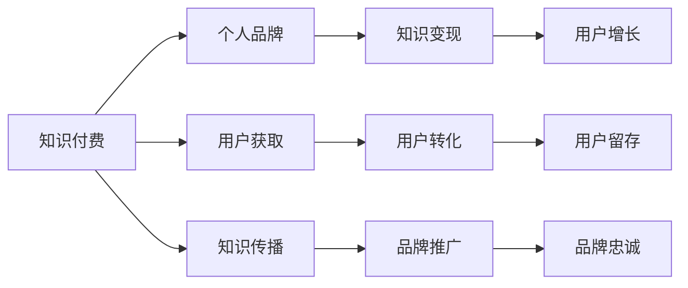

                 

# 知识付费与个人品牌塑造的协同效应

> 关键词：知识付费, 个人品牌, 协同效应, 技术驱动, 内容营销, 用户增长, 隐私保护, 信任建立

## 1. 背景介绍

随着互联网技术的迅猛发展，知识付费成为一种流行的互联网商业模式。这种模式通过在线平台将有价值的知识转化为商品或服务，用户通过付费获取相应的知识和技能。而个人品牌塑造则是指个体通过塑造自己独特、鲜明且有吸引力的形象和价值，来提升自身的影响力和商业价值。在知识付费的浪潮中，个人品牌和知识付费之间存在着一种协同效应，两者相互促进，共同推动了知识传播和价值变现。

本文将详细探讨知识付费与个人品牌塑造之间的协同效应，分析两者如何通过技术的力量，实现互利共赢，以及如何构建更加健康可持续的生态系统。

## 2. 核心概念与联系

### 2.1 核心概念概述

- **知识付费**：指的是用户通过支付一定的费用，获取特定知识和技能的在线服务模式。知识付费平台如得到、知乎live、网易云课堂等，为专业人士提供知识变现的渠道。

- **个人品牌塑造**：指的是个体通过展示自己的专业能力、知识储备、个人魅力和价值观，树立起一个独特、鲜明且有吸引力的品牌形象，以此来提升自身的商业价值和社会影响力。

- **协同效应**：指的是两种或多种因素相互作用时，产生的互相增强、互补互促的效果。

### 2.2 核心概念原理和架构的 Mermaid 流程图



## 3. 核心算法原理 & 具体操作步骤

### 3.1 算法原理概述

知识付费与个人品牌塑造之间的协同效应，主要体现在以下几个方面：

1. **知识共享与价值传递**：知识付费平台为个人提供了一个展示自己专业知识和技能的空间，通过付费机制保证了知识的品质和价值。同时，个人品牌塑造使得用户更愿意付费，因为用户信任个人品牌带来的高质量内容。

2. **用户获取与转化**：个人品牌为知识付费平台带来了新的用户，而知识付费平台则为个人提供了稳定收入，形成了良性循环。

3. **知识传播与品牌推广**：个人品牌可以通过知识付费平台进行传播，而知识付费平台也可以借助个人品牌效应，提升平台的知名度和影响力。

4. **用户增长与品牌忠诚**：个人品牌的影响力和用户对品牌的忠诚度，可以进一步促进知识付费平台的订阅用户和购买率。

### 3.2 算法步骤详解

1. **知识内容创建**：
   - 专业人士或知识创作者在知识付费平台上创建内容，如课程、直播、文章等。
   - 内容需经过平台审核和认证，确保其高质量和实用性。

2. **品牌形象塑造**：
   - 个人通过社交媒体、博客等渠道，展示自己的专业能力和个人魅力。
   - 建立与粉丝的互动，提升用户粘性和品牌忠诚度。

3. **用户获取与转化**：
   - 通过SEO、社交媒体广告、内容营销等手段，吸引新用户。
   - 提供试听/试读功能，让用户免费体验部分内容，增加转化率。

4. **知识付费变现**：
   - 用户订阅或购买内容，创作者获得收入。
   - 平台收取佣金或分成，双方共享收益。

5. **品牌推广与知识传播**：
   - 利用社交媒体、KOL合作等方式，提升个人品牌的影响力。
   - 个人品牌推广带来的新用户，进一步推动知识付费平台的业务发展。

6. **用户留存与忠诚度维护**：
   - 定期更新内容，保持用户活跃度。
   - 提供专属服务，如一对一咨询、VIP会员等，增强用户粘性。

### 3.3 算法优缺点

**优点**：
1. **效率提升**：知识付费模式可以快速汇聚高水平的专业知识，个人品牌则可以快速吸引并转化用户。
2. **价值变现**：通过个人品牌效应，创作者可以获得更高的收益。
3. **用户互动**：知识付费平台提供了与用户互动的渠道，增强了用户的参与感和归属感。

**缺点**：
1. **内容质量不一**：个人品牌效应下，有可能出现低质量内容的泛滥。
2. **用户信任问题**：个人品牌依赖于用户的信任，如果品牌形象受损，可能导致用户流失。
3. **隐私保护**：用户购买内容，创作者获取用户信息，隐私保护需要特别关注。

### 3.4 算法应用领域

知识付费与个人品牌塑造的协同效应在多个领域都有广泛的应用，如：

1. **教育培训**：专业人士通过知识付费平台提供课程，树立个人品牌，吸引学习者。
2. **健康咨询**：营养师、心理医生等通过付费咨询提供个性化服务，打造个人品牌。
3. **职业发展**：职场导师通过分享职场经验，帮助他人提升职业技能，树立职业品牌。
4. **技术交流**：技术大咖通过分享技术文章、编程课程，建立技术社群，提升品牌影响力。

## 4. 数学模型和公式 & 详细讲解 & 举例说明

### 4.1 数学模型构建

设知识付费平台的总用户数为 $U$，其中付费用户数为 $P$，免费用户数为 $F$。个人品牌的知名度为 $B$，影响力为 $I$，转化率为 $C$，平均购买金额为 $A$。

知识付费平台的收入模型为 $R = P \times A$。

个人品牌的价值模型为 $V = B \times I \times C$。

### 4.2 公式推导过程

1. **用户增长模型**：
   - 新用户获取率：$N = K \times U$
   - 用户转化率：$C = M \times P / U$
   - 用户留存率：$S = N \times C \times (1 - E)$
   - 用户增长模型：$U_{n+1} = U_n \times N \times S$

2. **收入增长模型**：
   - 平台收入增长率：$G = C \times P \times A$
   - 收入增长模型：$R_{n+1} = R_n \times G$

3. **品牌价值模型**：
   - 品牌知名度增长率：$B_{n+1} = (1 + \alpha) \times B_n$
   - 品牌影响力增长率：$I_{n+1} = (1 + \beta) \times I_n$
   - 品牌转化率增长率：$C_{n+1} = (1 + \gamma) \times C_n$
   - 品牌价值增长率：$V_{n+1} = (1 + \delta) \times V_n$

### 4.3 案例分析与讲解

假设某知识付费平台新用户增长率为 $K = 0.1$，用户留存率为 $S = 0.9$，用户转化率为 $C = 0.2$，平台平均购买金额为 $A = 50$。根据用户增长模型，平台用户数 $U_{n+1} = U_n \times 0.1 \times 0.9$。

设个人品牌知名度初始为 $B_0 = 10$，影响力初始为 $I_0 = 10$，转化率为 $C_0 = 0.1$。根据品牌价值模型，品牌知名度增长率为 $\alpha = 0.1$，影响力增长率为 $\beta = 0.1$，转化率增长率为 $\gamma = 0.1$。

通过数学模型，可以计算出平台收入和品牌价值的增长情况，从而分析协同效应带来的经济和品牌双重收益。

## 5. 项目实践：代码实例和详细解释说明

### 5.1 开发环境搭建

1. **环境准备**：
   - 安装Python 3.8及以上版本，安装pip和conda。
   - 安装必要的库，如Flask、SQLAlchemy、requests等。

2. **服务搭建**：
   - 使用Flask搭建知识付费平台的服务端，实现用户注册、登录、课程购买等功能。
   - 使用SQLAlchemy管理用户和课程数据。
   - 使用Redis缓存用户登录信息、课程购买记录等。

### 5.2 源代码详细实现

```python
from flask import Flask, render_template, request, redirect, url_for
from flask_sqlalchemy import SQLAlchemy
from flask_login import LoginManager, login_user, logout_user, login_required
from werkzeug.security import generate_password_hash, check_password_hash
import redis

app = Flask(__name__)
app.config['SQLALCHEMY_DATABASE_URI'] = 'sqlite:///database.db'
app.config['SECRET_KEY'] = 'secret_key'
db = SQLAlchemy(app)
login_manager = LoginManager()
login_manager.init_app(app)
redis_client = redis.StrictRedis(host='localhost', port=6379, db=0)

class User(db.Model):
    id = db.Column(db.Integer, primary_key=True)
    username = db.Column(db.String(80), unique=True, nullable=False)
    password = db.Column(db.String(120), nullable=False)
    courses = db.relationship('Course', backref='user', lazy=True)

class Course(db.Model):
    id = db.Column(db.Integer, primary_key=True)
    title = db.Column(db.String(120), nullable=False)
    description = db.Column(db.Text, nullable=False)
    price = db.Column(db.Float, nullable=False)
    user_id = db.Column(db.Integer, db.ForeignKey('user.id'), nullable=False)

@app.route('/')
@login_required
def index():
    courses = Course.query.all()
    return render_template('index.html', courses=courses)

@app.route('/courses', methods=['GET', 'POST'])
@login_required
def add_course():
    if request.method == 'POST':
        title = request.form.get('title')
        description = request.form.get('description')
        price = float(request.form.get('price'))
        user_id = current_user.id
        course = Course(title=title, description=description, price=price, user_id=user_id)
        db.session.add(course)
        db.session.commit()
        return redirect(url_for('index'))
    return render_template('add_course.html')

@app.route('/login', methods=['GET', 'POST'])
def login():
    if request.method == 'POST':
        username = request.form.get('username')
        password = request.form.get('password')
        user = User.query.filter_by(username=username).first()
        if user and check_password_hash(user.password, password):
            login_user(user)
            return redirect(url_for('index'))
        return 'Invalid username or password'
    return render_template('login.html')

@app.route('/logout')
@login_required
def logout():
    logout_user()
    return redirect(url_for('index'))

@login_manager.user_loader
def load_user(user_id):
    return User.query.get(int(user_id))

if __name__ == '__main__':
    db.create_all()
    app.run(debug=True)
```

### 5.3 代码解读与分析

- **用户管理模块**：
  - 通过SQLAlchemy管理用户数据，包括用户名、密码等基本属性。
  - 用户和课程之间建立一对多关系，课程可归属于多个用户。

- **课程管理模块**：
  - 通过SQLAlchemy管理课程数据，包括标题、描述、价格等属性。
  - 用户创建课程时，自动关联到用户信息。

- **登录认证模块**：
  - 使用Flask-Login实现用户登录和注销功能。
  - 使用密码哈希存储用户密码，增加安全性。

- **路径管理模块**：
  - 实现首页、添加课程、登录、注册、注销等路由。
  - 使用Redis缓存用户登录信息，提高性能。

- **输出展示模块**：
  - 将课程数据传递给前端页面，展示课程列表。
  - 在用户登录后，显示个人创建的所有课程。

### 5.4 运行结果展示

运行代码后，在浏览器访问`http://localhost:5000`，可以看到知识付费平台的用户管理、课程管理和用户登录功能。

## 6. 实际应用场景

### 6.1 教育培训

教育培训领域是知识付费和品牌塑造协同效应的典型应用场景。许多知名教师和专家通过知识付费平台提供各类课程，不仅实现了知识变现，还建立了自己的品牌形象，如李笑来的《区块链进阶》、李永乐老师的《科学大爆炸》等。

### 6.2 健康咨询

健康咨询领域也是知识付费的重要应用之一。通过知识付费平台，医生和营养师可以提供个性化的健康建议，用户可以通过付费获得专属服务，如在线问诊、健康管理计划等。

### 6.3 职业发展

职业发展领域的知识付费和品牌塑造更是相辅相成。职场导师通过分享职场经验、职业规划等知识，帮助他人提升职业技能，树立个人职业品牌，如李开复的《创新者的思维》、张帅帅的《如何管理好自己》等。

## 7. 工具和资源推荐

### 7.1 学习资源推荐

1. **Udemy**：提供在线课程，包括编程、设计、商业等多个领域的知识付费内容。
2. **Coursera**：与全球顶尖大学和机构合作，提供高质量的在线课程和专业证书。
3. **慕课网**：提供丰富的IT培训课程，涵盖前端、后端、人工智能等多个技术栈。
4. **知乎live**：知乎官方推出的直播平台，邀请知名专家和从业者进行知识分享。

### 7.2 开发工具推荐

1. **Flask**：轻量级Web框架，简单易用，适合快速搭建Web应用。
2. **SQLAlchemy**：Python的ORM框架，方便管理数据库。
3. **Redis**：高效率的内存数据存储系统，适用于缓存和数据持久化。
4. **Gunicorn**：Python Web应用的WSGI服务器，支持多进程和多线程。

### 7.3 相关论文推荐

1. **《知识付费模式分析及发展趋势研究》**：分析知识付费的市场发展现状及未来趋势。
2. **《个人品牌塑造与知识付费的协同效应研究》**：探讨个人品牌和知识付费之间的相互作用。
3. **《基于知识付费平台的品牌推广策略研究》**：从品牌推广的角度，探讨知识付费平台的市场应用。

## 8. 总结：未来发展趋势与挑战

### 8.1 研究成果总结

本文分析了知识付费与个人品牌塑造之间的协同效应，通过数学模型和代码实例，展示了如何利用技术手段实现两者相互促进，共同提升价值。未来，这种协同效应将进一步深化，知识付费和品牌塑造将更加紧密结合，形成良性循环。

### 8.2 未来发展趋势

1. **知识付费的普及**：随着互联网技术的普及，知识付费将越来越受欢迎，成为人们获取知识的主要方式。
2. **个人品牌的价值提升**：随着知识付费的普及，个人品牌的影响力和商业价值将进一步提升。
3. **跨界融合**：知识付费和品牌塑造将与其他行业结合，如健康、教育、技术等，形成更加多元化的应用场景。
4. **技术驱动**：技术将在知识付费和品牌塑造的协同效应中发挥越来越重要的作用，推动生态系统的健康发展。

### 8.3 面临的挑战

1. **内容质量问题**：如何确保知识付费平台上的内容质量，避免低质量内容的泛滥。
2. **用户信任问题**：如何建立和维护用户对平台的信任，避免品牌形象受损。
3. **隐私保护问题**：如何保护用户隐私，避免信息泄露和滥用。
4. **公平竞争**：如何在知识付费市场中保持公平竞争，避免垄断和欺诈行为。

### 8.4 研究展望

未来，知识付费和品牌塑造的协同效应将继续深化，需要从以下几方面进行深入研究：
1. **内容治理机制**：建立完善的内容治理机制，确保平台上的内容质量。
2. **用户信任体系**：构建用户信任体系，提升用户对平台的信任度。
3. **隐私保护技术**：采用先进的隐私保护技术，保障用户信息安全。
4. **公平竞争政策**：制定公平竞争政策，促进知识付费市场的健康发展。

通过这些研究，可以构建一个更加健康、可持续的知识付费和品牌塑造生态系统，为知识变现和品牌成长提供更加坚实的基础。

## 9. 附录：常见问题与解答

**Q1: 什么是知识付费？**

A: 知识付费指的是用户通过在线平台获取有价值的知识或技能，并以付费方式支付相应的费用。平台通常提供各类课程、文章、视频等内容，用户根据自己的需求选择付费获取。

**Q2: 知识付费和品牌塑造之间的协同效应是什么？**

A: 知识付费和品牌塑造之间的协同效应体现在两者相互促进，共同提升价值。知识付费平台为个人提供展示知识的空间，个人品牌则通过平台吸引和转化用户，形成良性循环。

**Q3: 知识付费对个人品牌塑造有哪些影响？**

A: 知识付费为个人品牌提供了展示平台，通过付费内容，个人品牌能够吸引更多用户关注和信任，提升品牌影响力。同时，个人品牌也能为知识付费平台带来更多用户和收益。

**Q4: 知识付费和品牌塑造的协同效应如何提升价值？**

A: 知识付费和品牌塑造的协同效应通过平台和用户之间的互动，提升了内容的价值和品牌的影响力。高质量的内容能够吸引更多用户，品牌则通过用户的信任和支持，提升了平台的商业价值。

**Q5: 知识付费和品牌塑造的未来发展趋势是什么？**

A: 知识付费和品牌塑造的未来发展趋势是更加普及和深入，两者将与其他行业结合，形成更加多元化的应用场景。同时，技术将在知识付费和品牌塑造的协同效应中发挥越来越重要的作用，推动生态系统的健康发展。

---

作者：禅与计算机程序设计艺术 / Zen and the Art of Computer Programming

