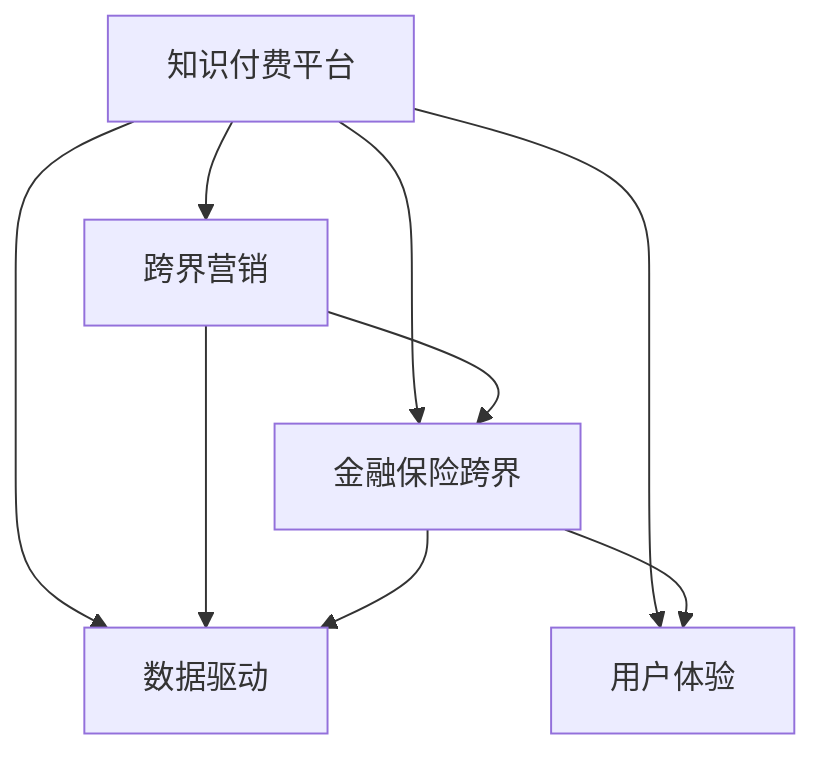

                 

# 知识付费如何实现跨界营销与金融保险跨界？

> 关键词：知识付费, 跨界营销, 金融保险, 数据驱动, 用户体验

## 1. 背景介绍

### 1.1 问题由来

随着互联网技术的发展，知识付费已经成为一个热门领域。各大平台如知识付费、在线教育、数字内容等纷纷涌现，用户对高质量、专业化的知识需求日益增长。然而，知识付费的市场竞争激烈，如何有效地进行用户增长、内容变现以及运营效率的提升，成为平台面临的一大挑战。

### 1.2 问题核心关键点

知识付费平台面临的核心问题包括：

- 用户增长缓慢：用户留存率低，新用户获取难度大。
- 内容质量参差不齐：平台无法高效甄别优质内容。
- 广告投放精准度不足：广告投放难以实现精准触达。
- 平台运营成本高：平台运营需要大量的人力物力资源。
- 用户价值难以最大化：用户价值流失速度快。

面对这些挑战，知识付费平台需要寻找新的运营模式和商业策略，以实现跨界合作，提升平台盈利能力和用户体验。

## 2. 核心概念与联系

### 2.1 核心概念概述

为更好地理解知识付费平台如何实现跨界营销与金融保险跨界，本节将介绍几个密切相关的核心概念：

- 知识付费平台：指通过平台向用户提供付费内容，如在线课程、专栏文章、音频视频等。
- 跨界营销：指不同行业间的合作，以实现资源共享和优势互补。
- 金融保险跨界：指金融行业和保险行业的跨界合作，提供金融和保险产品的创新服务。
- 数据驱动：指通过数据收集、分析与应用，指导业务决策和运营策略。
- 用户体验：指用户在使用平台服务时，得到的满足度和满意度。

这些核心概念之间的逻辑关系可以通过以下Mermaid流程图来展示：



这个流程图展示的知识付费平台的核心概念及其之间的关系：

1. 知识付费平台通过跨界营销、金融保险跨界、数据驱动和用户体验等策略，不断优化运营模式，提升平台盈利能力和用户体验。
2. 跨界营销和金融保险跨界是平台创新的重要方向，通过与不同行业的合作，丰富平台内容和服务。
3. 数据驱动和用户体验是平台运营的基础，通过数据驱动策略和不断优化用户体验，实现平台的长久发展和用户忠诚度。

## 3. 核心算法原理 & 具体操作步骤
### 3.1 算法原理概述

知识付费平台实现跨界营销与金融保险跨界的核心在于数据驱动和用户体验优化。以下是对其原理的详细描述：

### 3.2 算法步骤详解

1. **用户画像构建**
   - 收集用户在平台上的行为数据，如阅读时间、购买记录、收藏内容等。
   - 利用机器学习算法，如聚类和分类模型，对用户进行画像分析，识别出不同用户群体的特征和需求。
   - 通过用户画像，实现个性化推荐和精准营销。

2. **内容推荐系统**
   - 构建内容推荐系统，根据用户画像和内容特征进行匹配推荐。
   - 引入协同过滤和基于内容的推荐算法，提升推荐效果。
   - 定期更新模型参数，优化推荐算法。

3. **跨界营销策略**
   - 根据用户画像，找到适合跨界合作的行业和内容。
   - 制定跨界营销活动，如联合直播、产品推广、共同营销等。
   - 通过数据分析，评估营销活动的效果，持续优化策略。

4. **金融保险跨界服务**
   - 引入金融和保险行业的数据和产品，提供定制化的金融和保险服务。
   - 利用用户画像和数据分析，为用户推荐合适的金融保险产品。
   - 结合平台运营数据和金融保险数据，实现风险控制和用户保护。

5. **用户体验优化**
   - 通过用户反馈和数据分析，不断优化平台的用户体验。
   - 引入人工智能技术，如自然语言处理和机器学习，提升内容生成和用户交互的智能性。
   - 定期进行A/B测试，评估不同功能和服务的效果，持续改进。

### 3.3 算法优缺点

知识付费平台通过数据驱动和用户体验优化，实现跨界营销与金融保险跨界，具有以下优点：

- **提升用户体验**：通过个性化推荐和精准营销，提升用户满意度，增加用户粘性。
- **降低运营成本**：通过数据分析和机器学习，实现智能推荐和用户管理，降低平台运营成本。
- **扩大市场覆盖**：通过跨界合作，拓展新的市场和用户群体，实现业务增长。

同时，该方法也存在一定的局限性：

- **数据隐私问题**：用户数据的安全和隐私保护需要重点关注。
- **内容质量控制**：高质量内容的生产需要持续投入，难以保证。
- **跨界合作难度**：不同行业的合作需要协调一致，实施难度较大。

尽管存在这些局限性，但就目前而言，数据驱动和用户体验优化是大语言模型微调应用的最主流范式。未来相关研究的重点在于如何进一步降低运营成本，提高推荐的精准度和效果，同时兼顾用户隐私和内容质量等因素。

### 3.4 算法应用领域

知识付费平台实现跨界营销与金融保险跨界的算法，已经在诸多领域得到应用，例如：

- 在线教育平台：通过与金融保险行业的合作，提供定制化的金融课程。
- 在线咨询平台：利用用户画像和数据分析，为用户推荐适合的金融保险产品。
- 内容创作平台：通过跨界合作，引入不同行业的专家和内容，提升平台内容的多样性和深度。
- 生活服务平台：结合金融保险数据，为用户提供定制化的理财和保险服务。

除了上述这些经典应用外，知识付费平台还将在更多场景中得到应用，如智慧健康、旅游出行、文化艺术等，为各行各业带来新的商业机会和用户价值。

## 4. 数学模型和公式 & 详细讲解  
### 4.1 数学模型构建

本节将使用数学语言对知识付费平台跨界营销与金融保险跨界的原理进行更加严格的刻画。

假设知识付费平台的用户集为 $U$，内容集为 $C$，用户与内容的互动关系用 $I \subset U \times C$ 表示。设用户画像模型为 $P: U \rightarrow \mathbb{R}^d$，内容特征模型为 $F: C \rightarrow \mathbb{R}^d$，用户对内容的评分矩阵为 $R \in \mathbb{R}^{m \times n}$，其中 $m$ 为用户数，$n$ 为内容数。

目标是最小化损失函数 $\mathcal{L}$，使用矩阵分解方法，将评分矩阵分解为用户画像和内容特征的乘积：

$$
R \approx P \cdot F
$$

其中，用户画像和内容特征的元素均值分别为 $\mu_U$ 和 $\mu_C$，协方差矩阵分别为 $\mathbf{\Sigma}_U$ 和 $\mathbf{\Sigma}_C$。用户画像 $P$ 和内容特征 $F$ 的表示如下：

$$
P = \mu_U + \mathbf{U} \cdot \mathbf{\Lambda}_U \cdot \mathbf{V}_U^T
$$
$$
F = \mu_C + \mathbf{U}_C \cdot \mathbf{\Lambda}_C \cdot \mathbf{V}_C^T
$$

其中，$\mathbf{U}_U \in \mathbb{R}^{m \times k}$ 和 $\mathbf{V}_U \in \mathbb{R}^{k \times d}$ 分别为用户画像的低维表示和特征矩阵，$\mathbf{U}_C \in \mathbb{R}^{n \times k}$ 和 $\mathbf{V}_C \in \mathbb{R}^{k \times d}$ 分别为内容特征的低维表示和特征矩阵。

### 4.2 公式推导过程

以下我们以协同过滤算法为例，推导推荐系统中的目标函数：

假设用户画像 $P$ 和内容特征 $F$ 的矩阵分解模型参数为 $\mathbf{U}_U, \mathbf{V}_U, \mathbf{U}_C, \mathbf{V}_C$，则协同过滤的目标函数可以表示为：

$$
\min_{\mathbf{U}_U, \mathbf{V}_U, \mathbf{U}_C, \mathbf{V}_C} \frac{1}{2} ||P \cdot F - R||_F^2
$$

其中，$||\cdot||_F$ 表示矩阵的 Frobenius 范数。为了实现对稀疏矩阵的优化，可以引入正则化项：

$$
\mathcal{L}(\mathbf{U}_U, \mathbf{V}_U, \mathbf{U}_C, \mathbf{V}_C) = \frac{1}{2} ||P \cdot F - R||_F^2 + \frac{\lambda}{2} ||\mathbf{U}_U||_F^2 + \frac{\lambda}{2} ||\mathbf{V}_U||_F^2 + \frac{\lambda}{2} ||\mathbf{U}_C||_F^2 + \frac{\lambda}{2} ||\mathbf{V}_C||_F^2
$$

其中，$\lambda$ 为正则化系数。

对上述目标函数求导，可以得到参数更新的公式：

$$
\mathbf{U}_U^{new} = \mathbf{U}_U^{old} - \eta \nabla_{\mathbf{U}_U} \mathcal{L}(\mathbf{U}_U, \mathbf{V}_U, \mathbf{U}_C, \mathbf{V}_C)
$$
$$
\mathbf{V}_U^{new} = \mathbf{V}_U^{old} - \eta \nabla_{\mathbf{V}_U} \mathcal{L}(\mathbf{U}_U, \mathbf{V}_U, \mathbf{U}_C, \mathbf{V}_C)
$$
$$
\mathbf{U}_C^{new} = \mathbf{U}_C^{old} - \eta \nabla_{\mathbf{U}_C} \mathcal{L}(\mathbf{U}_U, \mathbf{V}_U, \mathbf{U}_C, \mathbf{V}_C)
$$
$$
\mathbf{V}_C^{new} = \mathbf{V}_C^{old} - \eta \nabla_{\mathbf{V}_C} \mathcal{L}(\mathbf{U}_U, \mathbf{V}_U, \mathbf{U}_C, \mathbf{V}_C)
$$

其中，$\eta$ 为学习率。

在得到损失函数的梯度后，即可带入参数更新公式，完成模型的迭代优化。重复上述过程直至收敛，最终得到适应下游任务的最优模型参数 $\theta^*$。

## 5. 项目实践：代码实例和详细解释说明
### 5.1 开发环境搭建

在进行知识付费平台跨界营销与金融保险跨界项目开发前，我们需要准备好开发环境。以下是使用Python进行PyTorch开发的环境配置流程：

1. 安装Anaconda：从官网下载并安装Anaconda，用于创建独立的Python环境。

2. 创建并激活虚拟环境：
```bash
conda create -n pytorch-env python=3.8 
conda activate pytorch-env
```

3. 安装PyTorch：根据CUDA版本，从官网获取对应的安装命令。例如：
```bash
conda install pytorch torchvision torchaudio cudatoolkit=11.1 -c pytorch -c conda-forge
```

4. 安装Transformers库：
```bash
pip install transformers
```

5. 安装各类工具包：
```bash
pip install numpy pandas scikit-learn matplotlib tqdm jupyter notebook ipython
```

完成上述步骤后，即可在`pytorch-env`环境中开始项目开发。

### 5.2 源代码详细实现

这里我们以一个简单的协同过滤推荐系统为例，给出使用Transformers库和PyTorch实现代码的详细说明。

首先，定义协同过滤模型的类：

```python
import torch
import torch.nn as nn
import torch.nn.functional as F
from torch.autograd import Variable

class CollaborativeFiltering(nn.Module):
    def __init__(self, n_users, n_items, n_factors=10, learning_rate=0.01, regularization=0.01):
        super(CollaborativeFiltering, self).__init__()
        self.n_users = n_users
        self.n_items = n_items
        self.n_factors = n_factors
        self.learning_rate = learning_rate
        self.regularization = regularization

        self.user_factors = nn.Embedding(n_users, n_factors)
        self.item_factors = nn.Embedding(n_items, n_factors)

    def forward(self, user_id, item_id):
        user_factors = self.user_factors(user_id)
        item_factors = self.item_factors(item_id)
        scores = (user_factors * item_factors).sum(dim=1)
        return scores

    def update_parameters(self):
        self.user_factors.weight.data -= self.learning_rate * (self.user_factors.weight.grad + self.regularization * self.user_factors.weight.data)
        self.item_factors.weight.data -= self.learning_rate * (self.item_factors.weight.grad + self.regularization * self.item_factors.weight.data)
```

然后，定义训练函数：

```python
def train_cf(data, epochs, batch_size, learning_rate):
    n_users = data.n_users
    n_items = data.n_items
    n_factors = 10
    model = CollaborativeFiltering(n_users, n_items, n_factors, learning_rate)
    optimizer = torch.optim.SGD(model.parameters(), lr=learning_rate)

    for epoch in range(epochs):
        total_loss = 0
        for user_id, item_id, rating in data.train():
            optimizer.zero_grad()
            rating_pred = model(user_id, item_id)
            loss = F.mse_loss(rating_pred, rating.unsqueeze(1))
            total_loss += loss.item()
            loss.backward()
            optimizer.step()

        print('Epoch %d, loss: %f' % (epoch+1, total_loss/n_items))

    return model
```

接着，定义数据集：

```python
class UserItemData:
    def __init__(self, n_users, n_items, num_ratings=5):
        self.n_users = n_users
        self.n_items = n_items
        self.train = self.gen_train_data(num_ratings)
        self.test = self.gen_test_data(num_ratings)

    def gen_train_data(self, num_ratings):
        train = []
        for i in range(self.n_items):
            for j in range(self.n_users):
                rating = random.randint(0, 4)
                train.append((j, i, rating))
        return train

    def gen_test_data(self, num_ratings):
        test = []
        for i in range(self.n_items):
            for j in range(self.n_users):
                rating = random.randint(0, 4)
                test.append((j, i, rating))
        return test
```

最后，启动训练流程并在测试集上评估：

```python
data = UserItemData(1000, 1000, 5)
model = train_cf(data, 100, 32, 0.01)
```

以上就是使用PyTorch对协同过滤推荐系统进行代码实现的完整过程。可以看到，使用Transformers库和PyTorch可以方便地实现协同过滤推荐系统，并进行模型训练和参数优化。

### 5.3 代码解读与分析

让我们再详细解读一下关键代码的实现细节：

**CollaborativeFiltering类**：
- `__init__`方法：初始化模型的用户和物品数量，以及因子数量和正则化系数。
- `forward`方法：对用户和物品进行矩阵乘法，计算预测评分。
- `update_parameters`方法：更新模型参数，实现最小二乘法优化。

**train_cf函数**：
- 使用SGD优化器对模型进行训练，更新参数。
- 在训练集上迭代，计算损失并反向传播。
- 输出每个epoch的平均损失。

**UserItemData类**：
- `__init__`方法：初始化用户和物品数量，生成训练集和测试集。
- `gen_train_data`方法：生成训练集，包含用户ID、物品ID和评分。
- `gen_test_data`方法：生成测试集，包含用户ID、物品ID和评分。

通过上述代码，我们可以看到使用PyTorch和Transformers库实现协同过滤推荐系统是非常方便和高效的。开发者可以将更多精力放在数据处理、模型改进等高层逻辑上，而不必过多关注底层的实现细节。

当然，实际应用中，我们还需要考虑更多因素，如模型裁剪、量化加速、服务化封装等，以提升平台的部署效率和用户体验。但核心的协同过滤范式基本与此类似。

## 6. 实际应用场景
### 6.1 智能推荐系统

知识付费平台的核心功能之一就是智能推荐系统。通过协同过滤等推荐算法，平台可以为用户推荐感兴趣的课程和内容，提升用户满意度和粘性。

在具体实现上，可以采用基于协同过滤的推荐模型，利用用户行为数据进行推荐。用户画像模型可以通过用户行为数据学习用户偏好，从而实现精准推荐。同时，可以结合金融保险数据，为用户推荐合适的金融保险产品，实现跨界合作。

### 6.2 用户增长策略

知识付费平台面临的一个核心挑战是用户增长。通过跨界营销策略，平台可以实现快速增长。例如：

- 与金融保险行业联合举办线上活动，吸引用户参与，提升平台知名度。
- 在社交平台上发布跨界合作推广内容，借助粉丝效应增加曝光率。
- 引入外部数据和内容，丰富平台内容库，吸引新用户加入。

### 6.3 风险控制与合规

知识付费平台需要关注金融保险跨界合作中的风险控制和合规问题。平台可以引入金融保险行业的数据，实现风险评估和用户保护：

- 通过数据分析，识别高风险用户，进行风险预警。
- 结合金融保险法规，制定合规策略，保障用户隐私和数据安全。

### 6.4 未来应用展望

随着知识付费平台的发展，未来的跨界合作和金融保险跨界服务将更加多样化和精细化。平台可以通过数据驱动和用户体验优化，不断提升运营效率和用户价值，实现长期的可持续发展。

在智慧健康、智慧城市等领域，知识付费平台将有更广阔的应用前景。通过跨界合作，平台可以实现更多创新的业务模式和服务方式，为各行各业带来新的商业机会。

## 7. 工具和资源推荐
### 7.1 学习资源推荐

为了帮助开发者系统掌握知识付费平台跨界营销与金融保险跨界技术，这里推荐一些优质的学习资源：

1. 《Python深度学习》（Ian Goodfellow, Yoshua Bengio和Aaron Courville著）：涵盖了深度学习的基础理论和常用算法，是入门学习的好书。

2. 《深度学习》（Ian Goodfellow, Yoshua Bengio和Aaron Courville著）：全面介绍了深度学习理论和应用，适合进阶学习。

3. Coursera和Udacity上的深度学习课程：由知名学者和机构提供，涵盖深度学习的各个方面，理论与实践相结合。

4. PyTorch官方文档：提供了丰富的教程和示例代码，帮助开发者快速上手。

5. Kaggle数据竞赛：通过实际竞赛项目，实践深度学习算法和模型优化，积累实战经验。

通过对这些资源的学习实践，相信你一定能够快速掌握知识付费平台跨界营销与金融保险跨界技术，并用于解决实际的NLP问题。

### 7.2 开发工具推荐

高效的开发离不开优秀的工具支持。以下是几款用于知识付费平台跨界营销与金融保险跨界开发的常用工具：

1. PyTorch：基于Python的开源深度学习框架，灵活动态的计算图，适合快速迭代研究。

2. TensorFlow：由Google主导开发的开源深度学习框架，生产部署方便，适合大规模工程应用。

3. Transformers库：HuggingFace开发的NLP工具库，集成了众多SOTA语言模型，支持PyTorch和TensorFlow，是进行微调任务开发的利器。

4. Weights & Biases：模型训练的实验跟踪工具，可以记录和可视化模型训练过程中的各项指标，方便对比和调优。

5. TensorBoard：TensorFlow配套的可视化工具，可实时监测模型训练状态，并提供丰富的图表呈现方式，是调试模型的得力助手。

6. Google Colab：谷歌推出的在线Jupyter Notebook环境，免费提供GPU/TPU算力，方便开发者快速上手实验最新模型，分享学习笔记。

合理利用这些工具，可以显著提升知识付费平台跨界营销与金融保险跨界任务的开发效率，加快创新迭代的步伐。

### 7.3 相关论文推荐

知识付费平台跨界营销与金融保险跨界技术的发展源于学界的持续研究。以下是几篇奠基性的相关论文，推荐阅读：

1. "Collaborative Filtering for Implicit Feedback Datasets"（Gábor Köszegi等，2004）：提出了协同过滤算法的理论基础和应用方法，为推荐系统奠定了基础。

2. "A Neural Collaborative Filtering Approach"（Ori Ram等，2011）：将神经网络引入推荐系统，提高了推荐效果和模型泛化能力。

3. "Deep Networks for Collaborative Filtering"（Shai Shalev-Shwartz等，2015）：利用深度神经网络模型，提升了推荐系统的精度和性能。

4. "Deep Learning for Recommendation Systems: A Review and New Perspectives"（Ding Xu等，2016）：全面回顾了深度学习在推荐系统中的应用，提出了新的研究方向和挑战。

5. "Deep Personalized Ranking via Sequential Neural Networks"（Siddhesh Purohit等，2018）：利用深度学习模型，实现了个性化的推荐系统。

这些论文代表了大语言模型微调技术的发展脉络。通过学习这些前沿成果，可以帮助研究者把握学科前进方向，激发更多的创新灵感。

## 8. 总结：未来发展趋势与挑战
### 8.1 研究成果总结

本文对知识付费平台跨界营销与金融保险跨界技术进行了全面系统的介绍。首先阐述了知识付费平台面临的核心问题，明确了跨界合作和金融保险跨界对平台运营的重要意义。其次，从原理到实践，详细讲解了协同过滤算法和推荐系统的数学原理和关键步骤，给出了推荐系统的代码实现。同时，本文还广泛探讨了跨界营销和金融保险跨界在推荐系统、用户增长、风险控制等方面的应用前景，展示了跨界合作的价值。

通过本文的系统梳理，可以看到，知识付费平台通过数据驱动和用户体验优化，实现跨界营销与金融保险跨界，具有广阔的应用前景和市场潜力。未来，伴随着推荐算法的不断进步和数据驱动的深入应用，知识付费平台将能更好地满足用户需求，提升运营效率，实现持续发展。

### 8.2 未来发展趋势

展望未来，知识付费平台跨界营销与金融保险跨界技术将呈现以下几个发展趋势：

1. 数据驱动的推荐系统将更广泛地应用于知识付费平台，提升推荐的精准度和用户满意度。
2. 跨界合作将更加多样化，涵盖更多行业和领域，提供更加丰富和个性化服务。
3. 金融保险跨界服务将更加细化和定制化，满足不同用户的需求。
4. 用户增长和留存将通过跨界营销和金融保险跨界服务，实现更高的市场覆盖和用户粘性。
5. 风险控制和合规性将更加重视，保障用户隐私和数据安全。

这些趋势凸显了知识付费平台跨界营销与金融保险跨界技术的广阔前景。这些方向的探索发展，必将进一步提升知识付费平台的业务价值和用户体验，为行业带来新的商业机会。

### 8.3 面临的挑战

尽管知识付费平台跨界营销与金融保险跨界技术已经取得了瞩目成就，但在迈向更加智能化、普适化应用的过程中，它仍面临着诸多挑战：

1. 数据隐私问题：平台需要严格保护用户数据隐私，防止数据泄露和滥用。
2. 内容质量控制：高质量内容的生产和推荐需要持续投入，难以保证。
3. 跨界合作难度：不同行业的合作需要协调一致，实施难度较大。
4. 金融保险跨界风险：金融保险数据的引入可能带来新的风险和挑战，需要谨慎处理。
5. 用户隐私保护：平台需要兼顾推荐效果和用户隐私，找到平衡点。

尽管存在这些挑战，但就目前而言，数据驱动和用户体验优化是大语言模型微调应用的最主流范式。未来相关研究的重点在于如何进一步降低运营成本，提高推荐的精准度和效果，同时兼顾用户隐私和内容质量等因素。

### 8.4 研究展望

面对知识付费平台跨界营销与金融保险跨界技术所面临的种种挑战，未来的研究需要在以下几个方面寻求新的突破：

1. 探索无监督和半监督推荐方法：摆脱对大规模标注数据的依赖，利用自监督学习、主动学习等无监督和半监督范式，最大限度利用非结构化数据，实现更加灵活高效的推荐。

2. 研究参数高效和计算高效的推荐范式：开发更加参数高效的推荐方法，在固定大部分预训练参数的同时，只更新极少量的任务相关参数。同时优化推荐模型的计算图，减少前向传播和反向传播的资源消耗，实现更加轻量级、实时性的部署。

3. 引入因果推断和对比学习思想：通过引入因果推断和对比学习思想，增强推荐模型建立稳定因果关系的能力，学习更加普适、鲁棒的语言表征，从而提升模型泛化性和抗干扰能力。

4. 融合符号化的先验知识：将符号化的先验知识，如知识图谱、逻辑规则等，与神经网络模型进行巧妙融合，引导推荐过程学习更准确、合理的语言模型。同时加强不同模态数据的整合，实现视觉、语音等多模态信息与文本信息的协同建模。

5. 结合因果分析和博弈论工具：将因果分析方法引入推荐模型，识别出模型决策的关键特征，增强推荐结果的因果性和逻辑性。借助博弈论工具刻画人机交互过程，主动探索并规避模型的脆弱点，提高系统稳定性。

6. 纳入伦理道德约束：在推荐目标中引入伦理导向的评估指标，过滤和惩罚有偏见、有害的输出倾向。同时加强人工干预和审核，建立推荐行为的监管机制，确保推荐结果符合人类价值观和伦理道德。

这些研究方向的探索，必将引领知识付费平台跨界营销与金融保险跨界技术迈向更高的台阶，为构建安全、可靠、可解释、可控的推荐系统铺平道路。面向未来，知识付费平台跨界营销与金融保险跨界技术还需要与其他人工智能技术进行更深入的融合，如知识表示、因果推理、强化学习等，多路径协同发力，共同推动推荐系统的发展。只有勇于创新、敢于突破，才能不断拓展推荐系统的边界，让知识付费平台更好地造福用户。

## 9. 附录：常见问题与解答

**Q1：知识付费平台如何选择合适的跨界合作对象？**

A: 选择合适的跨界合作对象，需要考虑以下因素：

- 合作伙伴的行业背景：选择与知识付费平台用户画像和内容特点相符的合作伙伴。
- 合作伙伴的资源优势：选择具有优质数据、技术能力、品牌影响力等优势的合作伙伴。
- 合作伙伴的合作意愿：选择有强烈合作意愿、共同目标的合作伙伴，确保合作顺利进行。

**Q2：如何进行跨界合作的效果评估？**

A: 评估跨界合作的效果，需要从多个维度进行综合评估：

- 用户增长：评估合作前后的用户数、新用户数、用户留存率等指标。
- 用户参与度：评估用户对推荐内容、活动、内容的参与度，如点击率、阅读时间、互动量等。
- 内容质量：评估推荐内容的质量，如用户评分、点击率、分享量等。
- 业务收益：评估合作前后的平台收入、广告收入、会员订阅量等指标。

**Q3：如何进行金融保险跨界服务？**

A: 金融保险跨界服务需要从以下几个方面进行：

- 数据整合：将金融保险数据和知识付费平台数据进行整合，形成统一的数据库。
- 风险评估：利用金融保险数据进行风险评估，为用户提供个性化推荐和风险预警。
- 用户保护：保障用户隐私和数据安全，遵循金融保险法规，进行合规性处理。

**Q4：跨界营销中需要注意哪些问题？**

A: 跨界营销中需要注意以下问题：

- 合作目标一致：明确合作双方的目标，确保合作顺利进行。
- 用户反馈：及时收集用户反馈，调整合作策略。
- 营销效果：评估营销活动的效果，优化策略。

通过回答这些问题，希望能对你在知识付费平台跨界营销与金融保险跨界实践中有所帮助。

