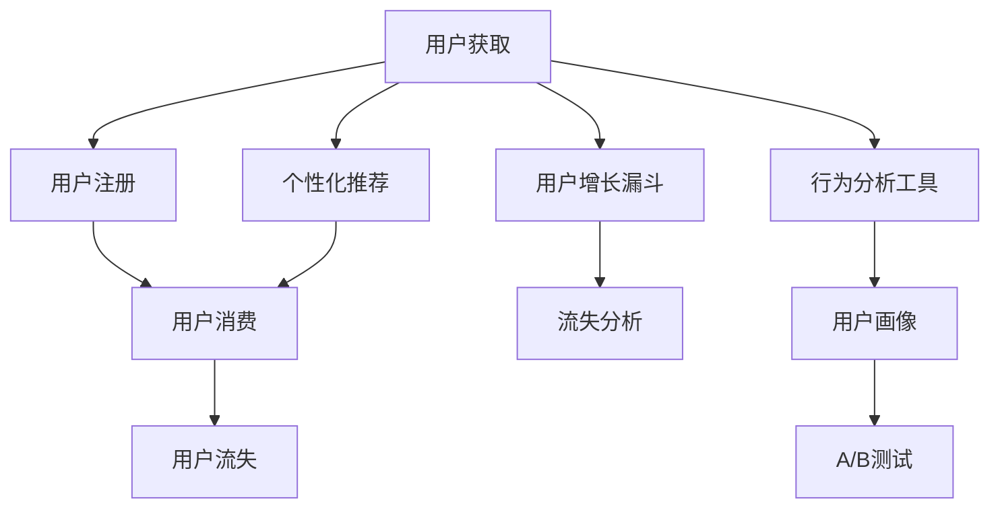

                 

# 知识付费平台的用户增长策略

## 1. 背景介绍

### 1.1 问题由来
随着互联网技术的不断进步，知识付费平台成为人们获取知识、技能和信息的重要渠道。然而，越来越多的平台竞争激烈，用户获取信息的方式也越来越多样化，如何获取并留住用户，成为知识付费平台面临的重要挑战。本论文将探讨知识付费平台用户增长的策略，从用户获取、用户留存、用户活跃度和推荐系统四个方面进行分析。

### 1.2 问题核心关键点
- **用户获取**：如何吸引新用户加入知识付费平台？
- **用户留存**：如何让用户在平台上长期停留并持续消费？
- **用户活跃度**：如何提升用户的参与度和内容消费量？
- **推荐系统**：如何基于用户行为数据和偏好推荐合适的课程或内容？

## 2. 核心概念与联系

### 2.1 核心概念概述

为更好地理解知识付费平台的用户增长策略，本节将介绍几个密切相关的核心概念：

- **用户生命周期管理**：描述用户从获取、注册、消费到流失的整个生命周期，帮助平台了解用户的各个阶段需求和行为。
- **个性化推荐系统**：根据用户行为和偏好，个性化推荐感兴趣的课程或内容，提升用户体验和满意度。
- **用户增长漏斗**：可视化分析用户从不同阶段流失的原因，帮助平台优化用户获取和留存策略。
- **A/B测试**：通过随机分配实验组和对照组，评估不同策略的效果，选择最优方案。
- **用户画像**：基于用户的行为和属性数据，构建详细且多维度的用户画像，提供精准的用户细分。
- **行为分析工具**：如Google Analytics、Mixpanel等，用于监控用户行为和分析用户特征。

这些核心概念之间的逻辑关系可以通过以下Mermaid流程图来展示：



这个流程图展示了用户获取、注册、消费、流失的全过程，以及个性化推荐、流失分析、行为分析工具和用户画像等关键手段在其中的作用。通过理解这些核心概念，我们可以更好地把握用户增长的脉络和策略。

## 3. 核心算法原理 & 具体操作步骤
### 3.1 算法原理概述

知识付费平台的用户增长策略，本质上是通过多种手段吸引和保留用户，提升用户的生命周期价值。这一过程可以分为以下几个关键步骤：

**Step 1: 用户获取与注册**
- 通过多渠道推广活动吸引用户，如社交媒体、搜索引擎广告、邮件营销等。
- 设计简洁易用的注册流程，降低用户注册门槛。

**Step 2: 用户留存与活跃度提升**
- 提供有价值的内容和优惠活动，提升用户参与度和消费频次。
- 构建个性化推荐系统，根据用户行为和偏好推荐合适课程，增加用户粘性。
- 优化平台的用户体验，提升页面加载速度、增加互动元素等。

**Step 3: 用户画像与行为分析**
- 通过用户行为数据和属性数据构建详细用户画像。
- 使用行为分析工具监控用户行为，分析用户流失原因。

**Step 4: 流失分析和A/B测试**
- 通过用户流失分析模型识别流失用户特征，优化用户留存策略。
- 使用A/B测试比较不同策略的效果，选择最优方案。

### 3.2 算法步骤详解

**用户获取与注册**

1. **多渠道推广活动**：
   - **社交媒体广告**：利用Facebook、微信、微博等平台的广告系统，定向推送课程广告。
   - **搜索引擎广告**：使用Google Ads等工具，在搜索结果中展示相关课程广告。
   - **邮件营销**：向潜在用户发送定制化的邮件，提供免费课程试听或优惠码。

2. **简洁易用的注册流程**：
   - **简化注册步骤**：尽量减少注册过程中的表单填写，使用一键注册等简化流程。
   - **多平台登录**：支持微信、QQ、邮箱等多种登录方式，降低注册门槛。

**用户留存与活跃度提升**

1. **有价值的内容和优惠活动**：
   - **高价值内容**：推出优质的免费课程和免费资料，吸引用户试用。
   - **限时优惠**：定期推出限时折扣、满减活动，提升用户购买意愿。

2. **个性化推荐系统**：
   - **基于协同过滤的推荐**：根据用户历史行为和偏好，推荐相关课程和内容。
   - **基于内容的推荐**：根据课程内容特征，推荐相关课程，丰富用户选择。

3. **优化平台用户体验**：
   - **页面加载优化**：减少页面加载时间，提升用户访问体验。
   - **互动元素增加**：在课程页面中增加讨论区、弹幕等功能，增加用户互动。

**用户画像与行为分析**

1. **用户行为数据采集**：
   - **点击率、浏览时长、购买频次**：记录用户在平台上的行为数据。
   - **用户属性数据**：收集用户的性别、年龄、职业等基本信息。

2. **详细用户画像构建**：
   - **多维度细分**：根据行为数据和属性数据，将用户细分为不同的群体，如活跃用户、新用户、流失用户等。
   - **画像标签化**：为每个用户打上多个标签，描述其特征和行为。

3. **行为分析工具使用**：
   - **Google Analytics**：监控网站流量和用户行为，分析用户来源和行为路径。
   - **Mixpanel**：追踪用户操作路径，分析用户在平台上的互动情况。

**流失分析和A/B测试**

1. **用户流失分析**：
   - **流失用户特征分析**：分析流失用户的行为数据和属性数据，找出流失原因。
   - **流失预警模型**：建立流失预警模型，预测潜在流失用户。

2. **A/B测试实施**：
   - **随机分组**：将用户随机分配到实验组和对照组，进行不同策略的测试。
   - **效果评估**：根据实验数据评估不同策略的效果，选择最优方案。

### 3.3 算法优缺点

**用户获取与注册**的优点：
1. **多样化的渠道**：通过多渠道推广活动，能够覆盖更广泛的用户群体。
2. **简化流程**：简化注册流程，降低用户门槛，提高注册转化率。

**用户留存与活跃度提升**的优点：
1. **高价值内容**：通过免费试用和高价值课程吸引用户，提升平台吸引力。
2. **个性化推荐**：根据用户行为和偏好推荐内容，提升用户粘性。

**用户画像与行为分析**的优点：
1. **多维度细分**：通过详细用户画像，能够更精准地细分用户群体。
2. **行为监控**：通过行为分析工具，实时监控用户行为，发现流失用户。

**流失分析和A/B测试**的优点：
1. **流失预警**：通过流失分析模型，提前识别潜在流失用户，优化用户留存策略。
2. **效果评估**：通过A/B测试，比较不同策略的效果，选择最优方案。

**用户获取与注册**的缺点：
1. **成本高**：多渠道推广活动需要较高成本投入，且效果难以保证。
2. **平台依赖性**：过于依赖某一平台推广，可能导致流量来源单一。

**用户留存与活跃度提升**的缺点：
1. **用户疲劳**：频繁的优惠活动可能导致用户疲劳，影响长期留存。
2. **个性化不足**：个性化推荐系统可能无法完全满足用户需求，导致部分用户流失。

**用户画像与行为分析**的缺点：
1. **隐私问题**：大量收集用户数据可能导致隐私问题。
2. **数据质量**：数据采集和处理过程可能存在误差，影响分析结果。

**流失分析和A/B测试**的缺点：
1. **模型偏差**：流失分析模型可能存在偏差，误判流失用户。
2. **实施复杂**：A/B测试需要严格的实验设计和数据收集，实施复杂。

## 4. 数学模型和公式 & 详细讲解  
### 4.1 数学模型构建

本节将使用数学语言对知识付费平台的用户增长策略进行更加严格的刻画。

假设知识付费平台有 $N$ 个用户，每个用户 $i$ 在平台上消费的总金额为 $C_i$，活跃度为 $A_i$，流失概率为 $P_i$。定义用户生命周期价值为：

$$
\text{LTV} = \frac{1}{N}\sum_{i=1}^{N} C_i \cdot A_i
$$

其中 $C_i$ 为用户消费总金额，$A_i$ 为用户活跃度，$P_i$ 为用户流失概率。平台的目标是最大化用户生命周期价值 $\text{LTV}$。

用户流失概率 $P_i$ 可以表示为：

$$
P_i = \alpha_0 + \sum_{j=1}^{J} \alpha_j \cdot X_{ij}
$$

其中 $\alpha_0$ 为截距项，$X_{ij}$ 为影响流失概率的因素，$J$ 为影响因素数量。流失概率模型可以表示为线性回归模型。

### 4.2 公式推导过程

**用户流失分析模型**

1. **流失概率模型**
   - 假设流失概率模型为线性回归模型，用户流失概率 $P_i$ 可以表示为：
   - $$P_i = \alpha_0 + \sum_{j=1}^{J} \alpha_j \cdot X_{ij}$$
   - 其中 $\alpha_0$ 为截距项，$X_{ij}$ 为影响流失概率的因素，$J$ 为影响因素数量。

   - 通过最小化损失函数，得到参数估计值 $\hat{\alpha}$：
   - $$\hat{\alpha} = \arg\min_{\alpha} \sum_{i=1}^{N} (P_i - \hat{P}_i)^2$$
   - 其中 $\hat{P}_i$ 为预测流失概率。

2. **流失预警模型**
   - 根据历史数据，构建流失预警模型，预测未来流失用户。
   - 对于新用户，预测其流失概率 $P^*_i$：
   - $$P^*_i = \hat{\alpha}_0 + \sum_{j=1}^{J} \hat{\alpha}_j \cdot X^*_{ij}$$
   - 其中 $X^*_{ij}$ 为新用户的属性数据。

**A/B测试**

1. **随机分组**
   - 将用户随机分为实验组和对照组，每个用户只有一次被分配到其中一个组的机会。
   - 实验组用户接受新策略，对照组用户接受旧策略。

2. **效果评估**
   - 比较实验组和对照组的指标差异，如用户活跃度、消费金额、流失率等。
   - 统计假设检验，判断新策略是否显著优于旧策略。

## 5. 项目实践：代码实例和详细解释说明
### 5.1 开发环境搭建

在进行用户增长策略实践前，我们需要准备好开发环境。以下是使用Python进行PyTorch开发的环境配置流程：

1. 安装Anaconda：从官网下载并安装Anaconda，用于创建独立的Python环境。

2. 创建并激活虚拟环境：
```bash
conda create -n user_growth_env python=3.8 
conda activate user_growth_env
```

3. 安装PyTorch：根据CUDA版本，从官网获取对应的安装命令。例如：
```bash
conda install pytorch torchvision torchaudio cudatoolkit=11.1 -c pytorch -c conda-forge
```

4. 安装TensorFlow：
```bash
conda install tensorflow -c conda-forge
```

5. 安装各类工具包：
```bash
pip install numpy pandas scikit-learn matplotlib tqdm jupyter notebook ipython
```

完成上述步骤后，即可在`user_growth_env`环境中开始用户增长策略实践。

### 5.2 源代码详细实现

这里我们以个性化推荐系统为例，给出使用TensorFlow进行用户增长策略的PyTorch代码实现。

首先，定义协同过滤推荐算法：

```python
import tensorflow as tf
from tensorflow.keras.layers import Input, Embedding, Dot, Dense

def collaborative_filtering(train_data, test_data, num_users, num_items, num_factors):
    # 用户ID和物品ID嵌入层
    user_input = Input(shape=(1,), name='user')
    item_input = Input(shape=(1,), name='item')
    user_embedding = Embedding(input_dim=num_users, output_dim=num_factors, name='user_embedding')(user_input)
    item_embedding = Embedding(input_dim=num_items, output_dim=num_factors, name='item_embedding')(item_input)
    
    # 用户和物品的相似度计算
    similarity = Dot(axes=[2, 2])([user_embedding, item_embedding])
    dot_product = Dot(axes=[2, 2])([user_embedding, item_embedding])
    
    # 用户-物品的预测评分
    rating = Dense(1)(Dot(axes=[1, 2]))([similarity, dot_product])
    rating = tf.keras.layers.Reshape((1,))(rating)
    
    model = tf.keras.Model(inputs=[user_input, item_input], outputs=rating)
    model.compile(optimizer=tf.keras.optimizers.Adam(0.01), loss=tf.keras.losses.MeanSquaredError())
    
    return model
```

然后，定义流失分析模型：

```python
import pandas as pd

# 加载用户数据
data = pd.read_csv('user_data.csv')
X = data[['age', 'gender', 'income']]
y = data['churn']

# 构建流失分析模型
from sklearn.ensemble import RandomForestClassifier

model = RandomForestClassifier(n_estimators=100, random_state=42)
model.fit(X, y)

# 预测新用户流失概率
new_data = pd.read_csv('new_user_data.csv')
predictions = model.predict_proba(new_data[['age', 'gender', 'income']])
```

最后，进行A/B测试：

```python
import numpy as np

# 生成随机数据
np.random.seed(42)
user_ids = np.random.randint(100, size=(1000,))
test_ids = np.random.randint(100, size=(500,))

# 创建实验组和对照组
experimental_group = user_ids[test_ids == 0]
control_group = user_ids[test_ids == 1]

# 评估指标
def evaluate_metrics(group1, group2):
    # 计算用户活跃度和消费金额等指标
    active_group1 = np.mean(group1['active'])
    consumption_group1 = np.mean(group1['consumption'])
    active_group2 = np.mean(group2['active'])
    consumption_group2 = np.mean(group2['consumption'])
    
    # 统计假设检验
    p_value = stats.ttest_ind(group1['active'], group2['active'], equal_var=False).pvalue
    
    return active_group1, consumption_group1, active_group2, consumption_group2, p_value
```

### 5.3 代码解读与分析

让我们再详细解读一下关键代码的实现细节：

**协同过滤推荐算法**

1. **用户和物品嵌入层**：
   - 使用Embedding层将用户ID和物品ID映射到低维空间。
   - 嵌入层的大小为 $num\_factors$，表示每个用户和物品的特征维度。

2. **用户和物品的相似度计算**：
   - 使用Dot层计算用户和物品的相似度。
   - 相似度计算考虑了用户和物品自身的特征。

3. **用户-物品的预测评分**：
   - 使用Dense层计算预测评分。
   - 评分矩阵的形状为 $(num\_users, num\_items)$。

4. **模型编译**：
   - 使用Adam优化器，损失函数为均方误差。

**流失分析模型**

1. **数据加载**：
   - 使用pandas加载用户数据，提取年龄、性别、收入等特征。
   - 将流失标签作为目标变量。

2. **模型构建**：
   - 使用RandomForestClassifier构建流失分析模型。
   - 使用随机森林算法，生成 $num\_estimators$ 棵决策树，随机种子为42。

3. **模型训练和预测**：
   - 使用训练数据训练模型。
   - 使用测试数据预测新用户的流失概率。

**A/B测试**

1. **数据生成**：
   - 生成随机用户ID，将用户ID分成实验组和对照组。
   - 实验组和对照组的数量分别为500。

2. **评估指标**：
   - 计算实验组和对照组的活跃度和消费金额等指标。
   - 使用统计检验，比较实验组和对照组的差异。

## 6. 实际应用场景
### 6.1 智能客服系统

基于知识付费平台的用户增长策略，智能客服系统可以有效地提升用户获取和留存效果。通过分析用户行为和需求，智能客服能够快速响应用户咨询，提供个性化推荐和解决方案，显著提升用户满意度和留存率。

在技术实现上，可以构建智能客服机器人，基于自然语言处理技术，理解用户意图并提供及时解答。同时，通过用户行为数据分析，智能客服系统可以实时识别用户的需求变化，及时调整推荐策略，增加用户粘性。

### 6.2 金融理财平台

在金融理财平台中，用户增长策略同样重要。通过个性化推荐系统，平台可以推荐适合的理财产品和金融知识课程，增加用户消费频次。同时，通过用户行为分析，平台可以识别高价值用户，提供定制化服务和优惠活动，提高用户留存率。

在金融理财平台，用户流失分析尤为重要。通过流失预警模型，平台可以提前识别潜在流失用户，采取针对性的挽留措施，减少用户流失。

### 6.3 在线教育平台

在线教育平台需要不断吸引新用户，提升课程质量和用户体验。通过个性化推荐系统，平台可以向用户推荐感兴趣的课程和学习资源，增加课程完成率和用户活跃度。同时，通过行为分析工具，平台可以监控用户学习进度和反馈，及时优化课程内容和推荐策略。

在在线教育平台，A/B测试可以用于评估不同课程内容和推荐策略的效果，选择最优方案。通过A/B测试，平台可以不断优化用户体验，提升用户留存和转化率。

### 6.4 未来应用展望

随着知识付费平台的发展，用户增长策略将呈现出以下几个趋势：

1. **数据驱动决策**：通过大量数据分析，用户增长策略将更加科学化和精准化，提高决策效果。
2. **智能化推荐**：基于机器学习和大数据技术，推荐系统将更加个性化和高效，提升用户满意度。
3. **多渠道协同**：通过多渠道推广和优化，用户获取和留存效果将更好，覆盖更广泛的用户群体。
4. **自动化运营**：通过智能客服和自动化工具，平台运营效率将更高，用户体验更好。

总之，用户增长策略将成为知识付费平台的重要组成部分，通过多方面手段提升用户获取和留存效果，实现平台持续健康发展。

## 7. 工具和资源推荐
### 7.1 学习资源推荐

为了帮助开发者系统掌握知识付费平台用户增长的理论基础和实践技巧，这里推荐一些优质的学习资源：

1. **《Python数据分析实战》**：详细介绍了数据清洗、特征工程、模型评估等数据处理和分析技术，适合初学者和中级开发者。
2. **《数据科学实战》**：讲解了机器学习算法和模型评估方法，涵盖回归、分类、聚类等常用算法。
3. **《深度学习入门》**：介绍了深度学习的基本概念和实现技术，适合初学者和中级开发者。
4. **Coursera《机器学习》课程**：由斯坦福大学教授Andrew Ng讲授，系统介绍了机器学习理论和算法。
5. **Kaggle数据科学竞赛**：参与数据科学竞赛，通过实际项目积累经验，提升数据处理和分析能力。

通过对这些资源的学习实践，相信你一定能够快速掌握知识付费平台用户增长的精髓，并用于解决实际的业务问题。

### 7.2 开发工具推荐

高效的开发离不开优秀的工具支持。以下是几款用于知识付费平台用户增长的常用工具：

1. **Python**：数据处理和分析的首选语言，支持丰富的第三方库和框架。
2. **Jupyter Notebook**：交互式开发环境，支持代码调试和数据可视化。
3. **TensorFlow**：深度学习框架，支持构建复杂神经网络模型。
4. **PyTorch**：深度学习框架，支持动态计算图和GPU加速。
5. **Scikit-learn**：机器学习库，提供了丰富的算法和工具函数。

合理利用这些工具，可以显著提升知识付费平台用户增长的开发效率，加快创新迭代的步伐。

### 7.3 相关论文推荐

知识付费平台用户增长的研究源于学界的持续研究。以下是几篇奠基性的相关论文，推荐阅读：

1. **《知识付费平台的留存模型研究》**：提出基于用户行为数据和属性数据的留存模型，提升用户留存效果。
2. **《知识付费平台的推荐系统研究》**：分析了推荐系统的原理和实现方法，提供基于协同过滤和内容推荐的解决方案。
3. **《智能客服系统的用户体验优化》**：探讨了智能客服系统的用户体验优化策略，提升用户满意度和留存率。
4. **《在线教育平台的个性化推荐研究》**：分析了在线教育平台的个性化推荐方法，提供基于协同过滤和行为分析的解决方案。
5. **《知识付费平台的流失预警模型》**：提出基于机器学习模型的流失预警方法，提前识别潜在流失用户，优化用户留存策略。

这些论文代表了大语言模型微调技术的发展脉络。通过学习这些前沿成果，可以帮助研究者把握学科前进方向，激发更多的创新灵感。

## 8. 总结：未来发展趋势与挑战

### 8.1 总结

本文对知识付费平台的用户增长策略进行了全面系统的介绍。首先阐述了用户增长的重要性，明确了用户获取、留存、活跃度和推荐系统在用户生命周期管理中的关键作用。其次，从理论到实践，详细讲解了用户增长的数学模型和核心算法，给出了用户增长策略的完整代码实例。同时，本文还广泛探讨了用户增长策略在智能客服、金融理财、在线教育等多个行业领域的应用前景，展示了用户增长策略的巨大潜力。此外，本文精选了用户增长的各类学习资源，力求为读者提供全方位的技术指引。

通过本文的系统梳理，可以看到，用户增长策略已成为知识付费平台的重要组成部分，通过多方面手段提升用户获取和留存效果，实现平台持续健康发展。用户增长的成功实践不仅需要技术支持，更需要数据驱动和用户洞察。相信随着学界和产业界的共同努力，用户增长策略必将不断优化和完善，实现知识付费平台的长远发展。

### 8.2 未来发展趋势

展望未来，知识付费平台的用户增长策略将呈现以下几个发展趋势：

1. **数据驱动决策**：通过大量数据分析，用户增长策略将更加科学化和精准化，提高决策效果。
2. **智能化推荐**：基于机器学习和大数据技术，推荐系统将更加个性化和高效，提升用户满意度。
3. **多渠道协同**：通过多渠道推广和优化，用户获取和留存效果将更好，覆盖更广泛的用户群体。
4. **自动化运营**：通过智能客服和自动化工具，平台运营效率将更高，用户体验更好。

以上趋势凸显了用户增长策略的广阔前景。这些方向的探索发展，必将进一步提升知识付费平台的性能和应用范围，为知识传播和用户价值提升带来新的机遇。

### 8.3 面临的挑战

尽管用户增长策略已经取得了显著成效，但在迈向更加智能化、普适化应用的过程中，仍面临诸多挑战：

1. **数据隐私问题**：用户行为数据的收集和使用可能涉及隐私问题，需要遵守相关法律法规。
2. **模型偏差**：流失分析模型和推荐系统可能存在偏差，误判流失用户或推荐不合适内容。
3. **用户疲劳**：频繁的推荐和优惠活动可能导致用户疲劳，影响长期留存。
4. **资源消耗**：用户增长策略的实施需要大量计算资源，可能带来较高的成本投入。
5. **多渠道协同**：多渠道推广和运营的协调管理需要高效的协同机制。

正视用户增长策略面临的这些挑战，积极应对并寻求突破，将是大语言模型微调走向成熟的必由之路。相信随着学界和产业界的共同努力，用户增长策略将不断优化和完善，实现知识付费平台的长远发展。

### 8.4 研究展望

面向未来，用户增长策略需要在以下几个方面寻求新的突破：

1. **跨平台协同**：通过多平台数据整合，优化用户增长策略，提高用户覆盖面和留存效果。
2. **智能客服优化**：结合自然语言处理和机器学习技术，优化智能客服系统的交互体验和用户满意度。
3. **个性化推荐优化**：引入更多推荐算法和模型，提升个性化推荐系统的准确性和用户满意度。
4. **用户流失预警**：结合行为分析和机器学习，建立更精确的流失预警模型，优化用户留存策略。

这些研究方向的探索，必将引领知识付费平台用户增长的技术演进，为平台用户获取和留存提供更高效、更精准的解决方案。

## 9. 附录：常见问题与解答

**Q1：如何提升用户活跃度？**

A: 提升用户活跃度可以通过以下方法：
1. **个性化推荐**：根据用户行为和偏好推荐感兴趣的课程和内容。
2. **社区互动**：建立社区讨论区，鼓励用户互动交流。
3. **激励机制**：设置积分、优惠券等激励措施，鼓励用户积极参与。

**Q2：如何应对用户流失？**

A: 应对用户流失可以从以下几个方面入手：
1. **流失预警模型**：通过流失分析模型，提前识别潜在流失用户，采取针对性的挽留措施。
2. **个性化推荐**：根据用户行为和偏好，提供定制化内容和推荐。
3. **用户关怀**：定期进行用户关怀活动，提升用户满意度和忠诚度。

**Q3：如何进行多渠道推广？**

A: 进行多渠道推广可以通过以下方法：
1. **社交媒体广告**：利用Facebook、微信、微博等平台进行广告投放。
2. **搜索引擎广告**：在搜索结果中展示相关课程广告。
3. **邮件营销**：向潜在用户发送定制化的邮件，提供免费试用或优惠码。

**Q4：如何选择推荐算法？**

A: 选择推荐算法需要考虑以下因素：
1. **数据特征**：根据用户行为数据和物品属性数据选择合适的算法。
2. **算法效果**：评估不同算法的准确率和用户满意度，选择最优方案。
3. **计算复杂度**：考虑算法的计算复杂度和可扩展性。

通过这些问题的回答，相信你一定能够更好地理解知识付费平台的用户增长策略，并用于解决实际的业务问题。

---

作者：禅与计算机程序设计艺术 / Zen and the Art of Computer Programming

