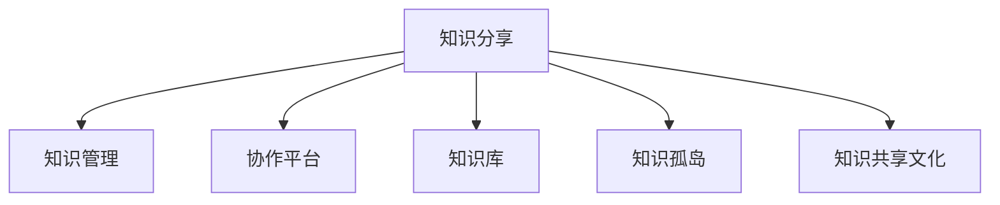

                 

# 知识分享在团队中的重要性

## 1. 背景介绍

### 1.1 问题由来
在现代软件开发中，团队协作已经成为不可或缺的一部分。越来越多的项目需要跨学科、跨地域的团队合作，共同完成复杂的任务。在这种背景下，知识分享的重要性日益凸显。通过有效的知识分享，团队成员可以更好地理解项目的需求和技术细节，快速适应新的环境，提高整体效率和质量。

然而，许多团队在知识分享方面依然存在诸多问题。例如，知识孤岛现象普遍存在，不同领域的专家缺乏交流，导致信息传递不畅，知识传播不充分。另外，由于缺乏规范的分享机制，很多知识以非正式的形式存在，难以管理和复用。这些问题不仅影响团队的工作效率，还可能导致重复劳动和资源浪费。

### 1.2 问题核心关键点
知识分享的核心问题在于如何打破知识孤岛，建立一个高效、规范的知识分享机制。以下是几个核心关键点：

1. **知识的标准化**：知识分享首先需要将知识标准化，以便于存储、检索和复用。
2. **知识传递的效率**：知识分享的另一个关键在于传递效率。高效的沟通和协作工具是必不可少的。
3. **知识共享的文化**：知识分享不仅是技术问题，更是一种文化。需要建立积极的知识共享文化，激励团队成员分享自己的知识。
4. **知识的更新和迭代**：知识是动态变化的。团队需要不断更新和迭代知识库，保持其时效性。
5. **知识的反馈和改进**：有效的知识分享应包括反馈机制，让知识分享者能够及时了解知识的使用效果，进行改进。

### 1.3 问题研究意义
研究知识分享在团队中的重要性，对于提升团队协作效率、推动技术创新、促进知识传播和应用具有重要意义：

1. **提升协作效率**：通过知识分享，团队成员可以快速掌握项目所需知识，减少学习成本，提高工作效率。
2. **推动技术创新**：知识分享能够促进不同领域的知识交流，激发团队成员的创新思维，推动技术突破。
3. **促进知识传播和应用**：知识分享能够将有价值的知识传播给更多人，促进其应用和普及。
4. **增强团队凝聚力**：知识分享是一种团队文化，能够增强团队成员之间的信任和合作，提升团队凝聚力。

## 2. 核心概念与联系

### 2.1 核心概念概述

为了更好地理解知识分享在团队中的重要性，本节将介绍几个密切相关的核心概念：

- **知识分享(Knowledge Sharing)**：指团队成员之间传递和交换知识的过程。知识可以是经验、技术、方法论等。
- **知识管理(Knowledge Management)**：指对知识的收集、存储、检索、共享和应用进行管理的系统化方法。
- **协作平台(Collaboration Platform)**：指支持团队成员进行知识共享和协作的软件工具，如Slack、Confluence等。
- **知识库(Knowledge Base)**：指存储和管理知识的标准化系统，如Confluence、JIRA等。
- **知识孤岛(Knowledge Silos)**：指团队中不同领域、不同部门的知识难以互通的现象。
- **知识共享文化(Knowledge Sharing Culture)**：指团队中推崇知识分享的文化氛围，包括激励机制和行为规范等。

这些核心概念之间的逻辑关系可以通过以下Mermaid流程图来展示：



这个流程图展示出知识分享的核心概念及其之间的关系：

1. 知识分享是知识管理的核心手段，通过知识分享将知识标准化和系统化。
2. 协作平台和知识库是知识分享的工具，提供了知识共享的基础设施。
3. 知识孤岛是知识分享的主要障碍，需要通过知识共享文化来打破。
4. 知识共享文化是知识分享的保障，通过激励和规范促进知识传递。

## 3. 核心算法原理 & 具体操作步骤

### 3.1 算法原理概述

知识分享的过程本质上是通过沟通和协作，将知识从一个人传递给另一个人。其核心在于建立有效的知识传递机制，确保知识传递的准确性和高效性。以下是对知识分享算法原理的详细说明。

### 3.2 算法步骤详解

知识分享的一般流程如下：

**Step 1: 确定知识分享目标**
- 明确知识分享的总体目标和预期效果。
- 确定需要分享的知识类型和范围。

**Step 2: 选择合适的知识传递工具**
- 根据知识分享的需要，选择合适的协作平台和知识库工具。
- 确定知识分享的方式，如在线文档、视频会议、培训课程等。

**Step 3: 知识整理与标准化**
- 将需要分享的知识进行整理，制定标准化的知识文档。
- 使用关键词、标签等技术对知识进行分类和索引。

**Step 4: 知识传递与沟通**
- 通过协作平台进行知识分享，包括文档上传、视频录制等。
- 使用即时通讯工具进行实时沟通，解答团队成员的疑问。

**Step 5: 知识反馈与评估**
- 收集知识使用者的反馈，评估知识分享的效果。
- 根据反馈进行知识更新和改进。

**Step 6: 知识复用与迭代**
- 将知识整合到知识库中，供其他团队成员使用。
- 定期更新和迭代知识库，保持知识的时效性。

### 3.3 算法优缺点

知识分享在团队中的使用具有以下优点：

1. **提高效率**：通过知识分享，团队成员可以迅速掌握所需知识，减少学习时间，提高工作效率。
2. **促进创新**：知识分享能够促进不同领域知识的融合，激发创新思维，推动技术突破。
3. **增强凝聚力**：知识分享是团队文化的重要组成部分，能够增强团队成员之间的信任和合作。
4. **便于复用**：知识以标准化形式存储，便于团队成员快速检索和复用。

同时，知识分享也存在一些缺点：

1. **信息过载**：过多的知识分享可能导致信息过载，影响团队成员的注意力。
2. **知识质量不均**：部分团队成员可能缺乏规范的知识分享技能，导致知识质量参差不齐。
3. **沟通成本高**：知识分享需要大量的沟通和协作，可能增加时间成本。

### 3.4 算法应用领域

知识分享在多个领域中都有广泛应用，以下是几个典型的应用场景：

- **软件开发**：在软件开发项目中，知识分享能够帮助团队成员快速掌握新技术、新工具，提高开发效率和质量。
- **教育培训**：教育培训中，知识分享能够将专业知识传递给更多的学习者，提升教学效果。
- **市场营销**：市场营销中，知识分享能够促进团队成员之间的沟通和协作，共同制定和执行营销策略。
- **项目管理**：项目管理中，知识分享能够帮助团队成员理解项目需求和进展，提高项目管理效率。

## 4. 数学模型和公式 & 详细讲解 & 举例说明

### 4.1 数学模型构建

知识分享的效果可以通过数学模型进行量化评估。假设知识分享的效果可以用指标 $K$ 表示，则知识分享模型可以表示为：

$$
K = f(S, C, M, P)
$$

其中：
- $S$：知识分享的目标和内容。
- $C$：知识分享的方式和渠道。
- $M$：知识分享者的背景和经验。
- $P$：知识接收者的接受能力和需求。

### 4.2 公式推导过程

为了评估知识分享的效果，可以采用以下指标：

1. **知识传播效率**：定义为知识分享的时间与效果之间的比值。
2. **知识覆盖范围**：定义为知识分享覆盖的团队成员数量。
3. **知识质量评估**：通过问卷调查等方法评估知识的质量和实用性。

### 4.3 案例分析与讲解

以下是一个简单的案例分析：

假设某团队进行一个新项目，需要在短时间内掌握一个新技术。知识分享的目标是介绍该技术的核心原理和应用场景。知识分享的方式包括在线文档、视频会议和即时通讯工具。知识分享者的背景包括一位资深工程师和一位技术专家。知识接收者的需求是快速理解新技术，并能够应用到实际项目中。

知识分享的具体步骤如下：

1. 确定知识分享目标：介绍新技术的原理和应用场景。
2. 选择合适的知识传递工具：在线文档、视频会议和即时通讯工具。
3. 知识整理与标准化：制作在线文档，录制视频会议，编写即时通讯交流指南。
4. 知识传递与沟通：上传在线文档，组织视频会议，使用即时通讯工具实时交流。
5. 知识反馈与评估：通过问卷调查评估知识的质量和实用性。
6. 知识复用与迭代：将知识整合到知识库中，供其他团队成员使用。

最终，通过知识分享，团队成员迅速掌握了新技术，提高了项目的开发效率和质量。

## 5. 项目实践：代码实例和详细解释说明

### 5.1 开发环境搭建

在进行知识分享实践前，我们需要准备好开发环境。以下是使用Python进行知识分享系统的环境配置流程：

1. 安装Anaconda：从官网下载并安装Anaconda，用于创建独立的Python环境。

2. 创建并激活虚拟环境：
```bash
conda create -n knowledge-share python=3.8 
conda activate knowledge-share
```

3. 安装相关工具包：
```bash
pip install flask pyspark redis
```

### 5.2 源代码详细实现

下面我们以知识管理系统的开发为例，给出使用Flask框架的知识分享系统代码实现。

```python
from flask import Flask, request, jsonify

app = Flask(__name__)

@app.route('/knowledge', methods=['POST'])
def share_knowledge():
    data = request.get_json()
    # 处理知识分享请求
    # ...
    return jsonify({'message': '知识分享成功'})

if __name__ == '__main__':
    app.run(debug=True)
```

在这个示例中，我们使用Flask框架搭建了一个简单的API，用于处理知识分享请求。知识分享的数据包括知识标题、内容、分享者、接收者等，通过POST请求提交。

### 5.3 代码解读与分析

让我们再详细解读一下关键代码的实现细节：

**Flask框架**：
- 使用Flask框架搭建API，方便进行知识分享系统的开发。
- 通过`@app.route`装饰器定义API路由，处理POST请求。

**处理知识分享请求**：
- 从请求中获取JSON数据，包括知识标题、内容、分享者、接收者等。
- 对知识进行标准化处理，并存储到知识库中。
- 发送通知给知识接收者，提示新知识已共享。

**运行API**：
- 在本地启动API服务，提供知识分享API接口。

这个示例展示了如何使用Python和Flask框架搭建一个简单的知识分享系统。开发者可以根据实际需求，进一步优化代码，实现更丰富的功能。

## 6. 实际应用场景

### 6.1 软件开发

在软件开发项目中，知识分享至关重要。团队成员需要快速掌握新工具、新技术，以便顺利开展工作。知识分享可以通过内部博客、GitHub仓库、Slack群组等方式进行。例如，某团队在开发一个复杂的项目时，可以通过GitHub仓库分享代码，使用Slack群组进行即时沟通。

### 6.2 教育培训

教育培训中，知识分享能够促进教师和学生之间的交流。教师可以通过在线视频、文档等形式分享知识，学生可以在线提问，获取及时反馈。例如，某大学开设了一门新课程，教师可以通过在线视频平台分享课程内容，学生可以通过在线讨论区进行提问，教师及时回答，实现互动学习。

### 6.3 市场营销

市场营销中，知识分享能够帮助团队成员共享市场洞察、客户需求等信息，共同制定和执行营销策略。例如，某营销团队在进行一次新的市场活动时，可以通过内部文档系统分享市场调研报告、客户反馈等信息，团队成员可以快速获取信息，协同制定和执行营销策略。

### 6.4 项目管理

项目管理中，知识分享能够帮助团队成员理解项目需求和进展，提高项目管理效率。例如，某项目管理团队在进行一个新产品开发时，可以通过知识库系统分享项目计划、进度报告等信息，团队成员可以快速了解项目进展，协同推进项目实施。

## 7. 工具和资源推荐

### 7.1 学习资源推荐

为了帮助开发者系统掌握知识分享的理论基础和实践技巧，这里推荐一些优质的学习资源：

1. **《知识管理的科学与艺术》**：本书详细介绍了知识管理的理论基础、方法和实践技巧，是一本非常全面的知识管理书籍。
2. **《协作工具与知识管理》**：本书介绍了多种协作工具和知识管理方法，提供了大量实用案例，帮助读者理解知识管理的具体实践。
3. **Coursera知识管理课程**：Coursera平台上有一门《知识管理与创新》课程，由全球顶尖大学提供，涵盖了知识管理的理论和方法。
4. **《知识管理的最佳实践》**：这本书汇集了多个行业领先企业的知识管理实践经验，提供了丰富的实用策略和方法。

通过对这些资源的学习实践，相信你一定能够快速掌握知识分享的技术和实践技能，并在实际工作中发挥作用。

### 7.2 开发工具推荐

高效的开发离不开优秀的工具支持。以下是几款用于知识分享开发的常用工具：

1. **Flask**：轻量级的Web框架，简单易用，适合快速搭建API接口。
2. **JIRA**：项目管理工具，支持知识管理和共享，是软件开发中的热门选择。
3. **Confluence**：知识库系统，支持文档的创建、编辑和分享。
4. **Slack**：即时通讯工具，支持知识分享和团队协作。
5. **Google Drive**：云存储平台，支持文件共享和协作。

合理利用这些工具，可以显著提升知识分享系统的开发效率，加快创新迭代的步伐。

### 7.3 相关论文推荐

知识分享技术的发展源于学界的持续研究。以下是几篇奠基性的相关论文，推荐阅读：

1. **《知识共享与组织学习》**：这篇论文探讨了知识共享对组织学习的影响，提出了一些实用的知识管理策略。
2. **《知识管理的动力学与组织绩效》**：这篇论文研究了知识管理的动力学模型，揭示了知识管理对组织绩效的影响。
3. **《知识共享与团队绩效》**：这篇论文探讨了知识共享对团队绩效的影响，提出了一些有效的知识分享方法。
4. **《知识管理与创新》**：这篇论文研究了知识管理对创新的影响，提出了一些创新的知识管理策略。

这些论文代表了大语言模型微调技术的发展脉络。通过学习这些前沿成果，可以帮助研究者把握学科前进方向，激发更多的创新灵感。

## 8. 总结：未来发展趋势与挑战

### 8.1 总结

本文对知识分享在团队中的重要性进行了全面系统的介绍。首先阐述了知识分享的研究背景和意义，明确了知识分享在提升团队协作效率、推动技术创新、促进知识传播和应用方面的独特价值。其次，从原理到实践，详细讲解了知识分享的理论基础和具体操作步骤，给出了知识分享系统开发的完整代码实例。同时，本文还广泛探讨了知识分享在软件开发、教育培训、市场营销等领域的实际应用场景，展示了知识分享范式的广泛适用性。

通过对这些核心概念和案例的分析，可以看到，知识分享在团队中的重要性日益凸显，其作用不容忽视。通过合理的设计和实践，知识分享能够显著提升团队的效率和质量，推动技术的进步和应用。

### 8.2 未来发展趋势

展望未来，知识分享技术将呈现以下几个发展趋势：

1. **自动化与智能化**：未来的知识分享系统将更加自动化和智能化，通过AI技术实现知识的自动分类、推荐和检索。
2. **个性化与定制化**：知识分享将更加注重个性化和定制化，根据不同用户需求提供定制化的知识服务。
3. **跨领域与跨学科**：知识分享将跨越学科和领域的界限，促进不同领域知识的融合和创新。
4. **社交化与协作化**：知识分享将更加注重社交化和协作化，通过社交网络等工具促进知识交流和分享。
5. **移动化与云端化**：未来的知识分享系统将更加移动化和云端化，支持随时随地获取知识。

以上趋势凸显了知识分享技术的广阔前景。这些方向的探索发展，必将进一步提升知识管理的效率和效果，为人类认知智能的进化带来深远影响。

### 8.3 面临的挑战

尽管知识分享技术已经取得了瞩目成就，但在迈向更加智能化、普适化应用的过程中，它仍面临着诸多挑战：

1. **知识标准化**：如何制定统一的知识标准，以便于知识的存储、检索和复用，是一个重要问题。
2. **知识质量控制**：如何确保知识的质量和真实性，避免误导性信息的传播，是知识分享的另一大挑战。
3. **知识更新与迭代**：如何保持知识的时效性，及时更新和迭代知识库，是一个需要持续关注的问题。
4. **知识共享文化**：如何建立积极的知识共享文化，激励团队成员分享自己的知识，是一个重要的文化问题。
5. **知识传播效率**：如何提高知识传播的效率，避免信息过载，是一个需要解决的问题。

正视知识分享面临的这些挑战，积极应对并寻求突破，将是大语言模型微调走向成熟的必由之路。相信随着学界和产业界的共同努力，这些挑战终将一一被克服，知识分享技术必将在构建人机协同的智能时代中扮演越来越重要的角色。

### 8.4 研究展望

面向未来，知识分享技术的研究需要在以下几个方面寻求新的突破：

1. **多模态知识分享**：将文字、图片、视频等多种模态的知识进行融合，提升知识表达的丰富性和多样性。
2. **知识图谱与网络分析**：利用知识图谱和网络分析技术，发现知识之间的关联和结构，提升知识的关联性和可解释性。
3. **用户行为分析**：利用机器学习技术分析用户的行为模式，推荐个性化的知识服务，提升知识使用的效果。
4. **情感分析与情绪管理**：利用情感分析技术分析用户的情绪状态，及时调整知识服务的策略，提升用户的满意度和体验。
5. **跨语言知识分享**：将知识从一种语言翻译成另一种语言，提升知识在不同语言环境下的可用性。

这些研究方向的探索，必将引领知识分享技术迈向更高的台阶，为构建安全、可靠、可解释、可控的知识服务系统铺平道路。面向未来，知识分享技术还需要与其他人工智能技术进行更深入的融合，如知识表示、因果推理、强化学习等，多路径协同发力，共同推动认知智能的发展。只有勇于创新、敢于突破，才能不断拓展知识分享的边界，让知识服务更好地服务于人类社会。

## 9. 附录：常见问题与解答

**Q1：知识分享如何提高团队协作效率？**

A: 知识分享通过将团队的内部知识进行标准化和共享，使得团队成员可以更快地掌握所需知识，减少学习成本，提高工作效率。例如，在软件开发项目中，通过知识分享系统分享代码、文档和技术博客，团队成员可以快速获取所需信息，协同推进项目开发。

**Q2：知识分享如何推动技术创新？**

A: 知识分享能够促进不同领域知识的融合，激发创新思维，推动技术突破。例如，某团队在开发新项目时，通过知识分享系统分享了最新的研究成果和技术文档，团队成员借鉴这些知识，提出创新的解决方案，推动了技术进步。

**Q3：知识分享如何促进知识传播和应用？**

A: 知识分享能够将有价值的知识传播给更多的学习者，提升知识的使用效果。例如，某教育机构通过知识分享系统分享了大量的教学资源，使更多的学生能够在线学习，提升了教学效果。

**Q4：知识分享如何增强团队凝聚力？**

A: 知识分享是团队文化的重要组成部分，能够增强团队成员之间的信任和合作。例如，某团队通过知识分享系统分享了团队成员的成果和经验，使得团队成员之间互相学习、互相帮助，增强了团队的凝聚力。

**Q5：知识分享如何提高知识质量？**

A: 知识分享需要制定标准化的知识管理体系，确保知识的质量和真实性。例如，某公司通过知识分享系统引入质量控制机制，对知识进行审核和评估，确保知识的高质量和可靠性。

总之，知识分享在团队中的重要性不可忽视，其应用前景广阔。通过合理的设计和实践，知识分享能够显著提升团队的效率和质量，推动技术的进步和应用。

---

作者：禅与计算机程序设计艺术 / Zen and the Art of Computer Programming

