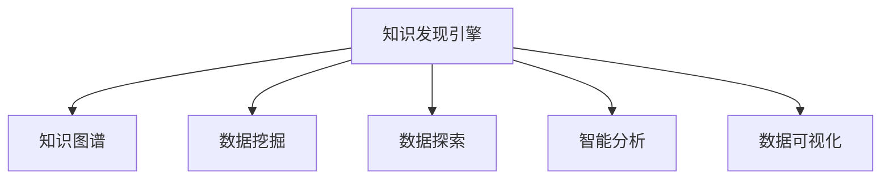

                 

# 知识发现引擎：知识与洞察力的完美结合体

> 关键词：知识发现, 知识图谱, 数据挖掘, 数据探索, 洞察力引擎, 智能分析, 数据可视化, 机器学习, 大数据

## 1. 背景介绍

### 1.1 问题由来
在数字化时代，数据如潮水般涌现。各行各业的企业和研究机构都在寻找从海量数据中提取有用信息的方法。然而，在数据的海洋中，信息的浪花难以捉摸，传统的基于统计和规则的数据分析方法已经难以适应当今复杂的数据环境。

知识发现（Knowledge Discovery, KD）引擎应运而生。它不仅能够从海量数据中高效地提取知识，还能通过对知识进行智能分析，提供深层次的洞察力，帮助决策者洞察数据背后的趋势和规律，指导决策和运营。

### 1.2 问题核心关键点
知识发现引擎的核心在于其将数据转化为知识，并通过知识驱动的智能分析，为决策者提供高质量的洞察力。关键技术包括数据挖掘、数据探索、知识图谱、智能分析、数据可视化等。

1. **数据挖掘**：从原始数据中自动地发现有趣的模式和关系。
2. **数据探索**：通过可视化和交互式工具，深入了解数据集及其特征。
3. **知识图谱**：构建语义化的知识网络，使得机器能够理解和推理复杂的语义关系。
4. **智能分析**：利用机器学习模型，对知识进行预测、分类、聚类等智能分析。
5. **数据可视化**：将复杂的数据和知识以直观的形式呈现，便于决策者理解。

这些核心技术共同构成了知识发现引擎的核心，使其能够高效地从数据中提取知识，并提供洞察力驱动的决策支持。

### 1.3 问题研究意义
知识发现引擎在商业、医疗、金融、科研等领域具有广泛的应用前景。

1. **商业决策**：帮助企业发现市场趋势、客户需求和潜在机会，提升运营效率和市场竞争力。
2. **医疗诊断**：通过分析患者数据，发现疾病模式和风险因素，支持精准医疗和个性化治疗。
3. **金融分析**：预测市场变化、评估风险，辅助金融决策和投资策略。
4. **科学研究**：揭示科学问题背后的复杂关系，指导实验设计和理论研究。
5. **政府治理**：监控社会动态，辅助公共政策制定和应急响应。

随着大数据和人工智能技术的不断发展，知识发现引擎正逐渐成为推动社会进步和经济发展的关键工具。

## 2. 核心概念与联系

### 2.1 核心概念概述

为了更好地理解知识发现引擎，本节将介绍几个关键概念：

- **知识发现引擎**：从海量数据中提取有用知识，并进行智能分析，提供洞察力支持的系统。
- **知识图谱**：构建语义化的知识网络，支持知识的推理和应用。
- **数据挖掘**：从数据中发现模式、关系和知识的过程。
- **数据探索**：通过可视化工具和交互式方法，深入了解数据集和特征。
- **智能分析**：利用机器学习模型，对知识进行预测、分类、聚类等分析。
- **数据可视化**：以直观的形式呈现复杂的数据和知识，便于理解。

这些概念之间的逻辑关系可以通过以下Mermaid流程图来展示：



这个流程图展示了一系列相关概念之间的联系：

1. 知识发现引擎通过数据挖掘、数据探索、智能分析和数据可视化等技术，从原始数据中提取和分析知识。
2. 知识图谱作为知识的存储和表示形式，为机器理解语义关系提供基础。
3. 通过这些技术，知识发现引擎能够高效地提供洞察力，支持决策和运营。

## 3. 核心算法原理 & 具体操作步骤
### 3.1 算法原理概述

知识发现引擎的原理可以简单概括为“数据-知识-洞察力”的三步循环。即从原始数据中挖掘知识，对知识进行智能分析，并通过可视化工具提供洞察力。

### 3.2 算法步骤详解

**Step 1: 数据预处理**

- 收集原始数据，并进行清洗和预处理，确保数据的完整性和一致性。
- 对数据进行标准化和归一化，确保数值的一致性。
- 使用缺失值填充和异常值处理等技术，提高数据质量。

**Step 2: 数据挖掘**

- 选择合适的数据挖掘算法，如关联规则挖掘、分类、聚类、预测等。
- 利用算法在数据集中自动发现有趣的模式和关系。
- 使用参数调整和算法优化等技术，提高挖掘的效率和精度。

**Step 3: 知识图谱构建**

- 将挖掘出的知识转化为语义化的知识图谱。
- 利用本体语言描述知识节点和关系。
- 使用RDF等数据格式存储知识图谱，支持查询和推理。

**Step 4: 数据探索**

- 使用可视化工具，如Tableau、Power BI等，探索数据集及其特征。
- 通过交互式方法，深入了解数据集的结构和模式。
- 利用数据探索发现潜在的异常和趋势，为进一步的分析和建模提供依据。

**Step 5: 智能分析**

- 选择适合的机器学习模型，如回归、分类、聚类、神经网络等。
- 在知识图谱的基础上，对知识进行预测、分类、聚类等分析。
- 使用交叉验证、特征选择等技术，提高分析的精度和泛化能力。

**Step 6: 数据可视化**

- 将分析结果转化为可视化图表和报表。
- 使用图表工具，如Python的Matplotlib、Plotly等，展示分析结果。
- 利用交互式图表和仪表盘，提供深入的洞察力。

**Step 7: 洞察力应用**

- 将洞察力结果应用于业务决策和运营优化。
- 利用洞察力指导产品设计、市场推广、风险控制等决策。
- 持续监控和更新洞察力结果，确保其时效性和准确性。

### 3.3 算法优缺点

知识发现引擎具有以下优点：

1. **高效性**：能够从海量数据中高效地提取知识和洞察力。
2. **自动化**：通过自动化算法和技术，降低人工干预和计算成本。
3. **灵活性**：适用于多种数据类型和业务场景。
4. **洞察力**：通过深度分析和可视化，提供高质量的洞察力支持。

但同时，知识发现引擎也存在以下缺点：

1. **复杂性**：需要多学科知识，涉及数据预处理、算法选择、模型训练等复杂环节。
2. **数据依赖**：对原始数据的质量和完整性依赖较大。
3. **计算成本**：在数据量和复杂度增加的情况下，计算成本可能较高。
4. **解释性**：部分算法和模型缺乏可解释性，难以理解其内部机制。

### 3.4 算法应用领域

知识发现引擎在多个领域具有广泛的应用前景，例如：

1. **商业智能**：通过分析客户数据，发现市场趋势和用户行为，支持营销和运营决策。
2. **医疗健康**：分析患者数据，发现疾病模式和风险因素，支持个性化治疗和健康管理。
3. **金融分析**：预测市场变化、评估风险，辅助金融决策和投资策略。
4. **科学研究**：揭示科学问题背后的复杂关系，指导实验设计和理论研究。
5. **政府治理**：监控社会动态，辅助公共政策制定和应急响应。

除了上述这些经典应用外，知识发现引擎还被创新性地应用到更多领域中，如城市规划、环境保护、教育评估等，为各行业的决策支持和运营优化提供了新的工具和方法。

## 4. 数学模型和公式 & 详细讲解 & 举例说明
### 4.1 数学模型构建

知识发现引擎的数学模型构建涉及数据预处理、数据挖掘、智能分析和数据可视化等环节。以下将详细介绍这些数学模型。

**数据预处理模型**：

- 假设原始数据为 $\mathbf{X} \in \mathbb{R}^{n \times d}$，其中 $n$ 为样本数，$d$ 为特征数。
- 数据预处理的目标是将数据标准化为 $\mathbf{X}_{\text{std}}$，使得均值为0，标准差为1。

$$
\mathbf{X}_{\text{std}} = \frac{\mathbf{X} - \mathbf{\mu}}{\sigma}
$$

**数据挖掘模型**：

- 假设数据集为 $\mathbf{D}$，其中包含 $n$ 个样本，每个样本有 $d$ 个特征。
- 关联规则挖掘的目标是从 $\mathbf{D}$ 中发现频繁项集和关联规则。
- 常见的关联规则挖掘算法包括Apriori算法和FP-Growth算法。

**知识图谱模型**：

- 假设知识图谱由节点和边组成，节点表示实体，边表示实体之间的关系。
- 使用RDF表示知识图谱，其中每个节点表示一个实体，边表示实体之间的关系。

**智能分析模型**：

- 假设训练数据为 $\mathbf{X} \in \mathbb{R}^{n \times d}$，目标为预测标签 $y$。
- 常见机器学习模型包括线性回归、决策树、支持向量机等。
- 假设使用线性回归模型进行预测，目标函数为：

$$
\min_{\theta} \frac{1}{2n} \sum_{i=1}^n (y_i - \theta_0 - \sum_{j=1}^d \theta_j x_{ij})^2 + \lambda \|\theta\|_2^2
$$

其中 $\theta = (\theta_0, \theta_1, ..., \theta_d)^T$ 为模型参数。

**数据可视化模型**：

- 假设分析结果为 $\mathbf{X} \in \mathbb{R}^{n \times d}$。
- 数据可视化目标是将 $\mathbf{X}$ 转换为可视化图表，如散点图、柱状图、热图等。
- 假设使用Python的Matplotlib库进行可视化，可以绘制如下散点图：

```python
import matplotlib.pyplot as plt
plt.scatter(x, y)
plt.xlabel('特征A')
plt.ylabel('特征B')
plt.show()
```

### 4.2 公式推导过程

**数据预处理推导**：

- 假设原始数据为 $\mathbf{X}$，均值为 $\mathbf{\mu}$，标准差为 $\sigma$。
- 标准化公式为：

$$
\mathbf{X}_{\text{std}} = \frac{\mathbf{X} - \mathbf{\mu}}{\sigma}
$$

其中均值和标准差计算公式为：

$$
\mathbf{\mu} = \frac{1}{n} \sum_{i=1}^n x_i, \quad \sigma = \sqrt{\frac{1}{n} \sum_{i=1}^n (x_i - \mathbf{\mu})^2}
$$

**数据挖掘推导**：

- 假设关联规则挖掘的目标是找出频繁项集 $I$ 和关联规则 $R$。
- Apriori算法的基本步骤如下：
1. 初始化频繁项集 $I_1 = \{t_1, t_2, ..., t_k\}$，其中 $t_i$ 为单个项。
2. 从 $I_1$ 中计算 $I_2$，包含所有长度为2的频繁项集。
3. 依次计算 $I_3, I_4, ..., I_l$，直到无法生成新的频繁项集。
4. 对于每个频繁项集 $I_i$，计算关联规则 $R$。

**知识图谱推导**：

- 假设知识图谱由节点 $N$ 和边 $E$ 组成。
- RDF表示知识图谱时，每个节点表示一个实体，边表示实体之间的关系，如：

$$
<\text{节点}1, \text{关系}1, \text{节点}2>
$$

表示节点1和节点2之间存在关系1。

**智能分析推导**：

- 假设使用线性回归模型进行预测，训练数据为 $\mathbf{X}$，目标为预测标签 $y$。
- 最小二乘法目标函数为：

$$
\min_{\theta} \frac{1}{2n} \sum_{i=1}^n (y_i - \theta_0 - \sum_{j=1}^d \theta_j x_{ij})^2 + \lambda \|\theta\|_2^2
$$

其中 $\theta = (\theta_0, \theta_1, ..., \theta_d)^T$ 为模型参数。

**数据可视化推导**：

- 假设分析结果为 $\mathbf{X}$，可视化目标为绘制散点图。
- 使用Matplotlib绘制散点图的Python代码：

```python
import matplotlib.pyplot as plt
plt.scatter(x, y)
plt.xlabel('特征A')
plt.ylabel('特征B')
plt.show()
```

### 4.3 案例分析与讲解

**案例一：商业智能中的客户行为分析**

- 数据预处理：收集客户的交易数据，标准化数据格式。
- 数据挖掘：使用Apriori算法发现客户购买行为的模式。
- 知识图谱构建：将客户、商品、时间等实体及其关系构建为知识图谱。
- 智能分析：使用线性回归模型预测客户未来的购买行为。
- 数据可视化：使用散点图展示客户购买行为的变化趋势。

**案例二：医疗健康中的疾病预测**

- 数据预处理：收集患者的健康数据，标准化数据格式。
- 数据挖掘：使用关联规则挖掘发现疾病与症状之间的关联。
- 知识图谱构建：将患者、疾病、症状等实体及其关系构建为知识图谱。
- 智能分析：使用决策树模型预测患者的疾病风险。
- 数据可视化：使用柱状图展示不同症状与疾病之间的关系。

这些案例展示了知识发现引擎在商业智能和医疗健康领域的实际应用，通过高效的数据挖掘和智能分析，提供了高质量的洞察力，支持决策和运营。

## 5. 项目实践：代码实例和详细解释说明
### 5.1 开发环境搭建

在进行知识发现引擎的实践前，我们需要准备好开发环境。以下是使用Python进行PyTorch开发的环境配置流程：

1. 安装Anaconda：从官网下载并安装Anaconda，用于创建独立的Python环境。

2. 创建并激活虚拟环境：
```bash
conda create -n pytorch-env python=3.8 
conda activate pytorch-env
```

3. 安装PyTorch：根据CUDA版本，从官网获取对应的安装命令。例如：
```bash
conda install pytorch torchvision torchaudio cudatoolkit=11.1 -c pytorch -c conda-forge
```

4. 安装TensorFlow：
```bash
conda install tensorflow
```

5. 安装各类工具包：
```bash
pip install numpy pandas scikit-learn matplotlib tqdm jupyter notebook ipython
```

完成上述步骤后，即可在`pytorch-env`环境中开始知识发现引擎的实践。

### 5.2 源代码详细实现

以下是一个简单的知识发现引擎的示例代码，用于分析客户购买数据：

```python
import pandas as pd
import matplotlib.pyplot as plt
from sklearn.linear_model import LinearRegression
from sklearn.model_selection import train_test_split
from sklearn.metrics import mean_squared_error
from sklearn.preprocessing import StandardScaler

# 读取数据
df = pd.read_csv('customer_purchase_data.csv')

# 数据预处理
X = df.drop('sales', axis=1)
y = df['sales']
X_train, X_test, y_train, y_test = train_test_split(X, y, test_size=0.2, random_state=42)

# 数据标准化
scaler = StandardScaler()
X_train = scaler.fit_transform(X_train)
X_test = scaler.transform(X_test)

# 数据挖掘
from mlxtend.frequent_patterns import apriori, association_rules

frequent_itemsets = apriori(X_train, min_support=0.01, use_colnames=True)
rules = association_rules(frequent_itemsets, metric="lift", min_threshold=1)

# 知识图谱构建
# 假设知识图谱以RDF格式存储，需要额外的工具支持，如GraphX等

# 智能分析
model = LinearRegression()
model.fit(X_train, y_train)
y_pred = model.predict(X_test)

# 数据可视化
plt.scatter(X_test[:, 0], y_test)
plt.plot(X_test[:, 0], y_pred, color='red')
plt.xlabel('Feature A')
plt.ylabel('Sales')
plt.show()

# 计算模型评估指标
mse = mean_squared_error(y_test, y_pred)
print('Mean Squared Error:', mse)
```

### 5.3 代码解读与分析

让我们再详细解读一下关键代码的实现细节：

**数据预处理**：
- 使用Pandas库读取CSV文件，存储客户购买数据。
- 使用train_test_split函数将数据集分为训练集和测试集，比例为80%和20%。
- 使用StandardScaler对数据进行标准化处理，确保数值的一致性。

**数据挖掘**：
- 使用mlxtend库中的apriori函数进行关联规则挖掘，发现频繁项集。
- 使用association_rules函数生成关联规则，并筛选出有意义的规则。

**知识图谱构建**：
- 知识图谱的构建涉及复杂的工具和技术，如RDF格式存储、GraphX库等。
- 知识图谱的构建需要领域知识和专业技能，本示例中未包含该部分代码。

**智能分析**：
- 使用LinearRegression模型进行预测，并使用均方误差（MSE）评估模型性能。
- 通过散点图展示预测结果与实际销售数据的关系，直观显示模型的准确性。

**数据可视化**：
- 使用Matplotlib库绘制散点图，展示预测结果与实际数据的对比。
- 通过散点图可以直观地看出预测的准确性，帮助理解模型的性能。

通过这些代码示例，可以看出知识发现引擎的实践涉及数据预处理、数据挖掘、智能分析和数据可视化等多个环节，每个环节都需要使用特定的算法和技术。

## 6. 实际应用场景
### 6.1 智能客服系统

智能客服系统利用知识发现引擎，通过分析客户的历史对话数据，发现常见问题及其解决方式，构建知识图谱，并利用智能分析预测客户的问题。智能客服系统可以自动解答客户咨询，提升服务效率和客户满意度。

### 6.2 金融分析

金融分析领域通过知识发现引擎，利用历史交易数据和市场新闻，构建知识图谱，进行智能分析和预测。系统可以预测市场趋势、评估风险，辅助金融决策和投资策略，提升金融机构的运营效率和风险控制能力。

### 6.3 医疗健康

医疗健康领域通过知识发现引擎，利用患者的健康数据和医生的临床经验，构建知识图谱，进行智能分析和预测。系统可以发现疾病模式和风险因素，支持个性化治疗和健康管理，提升医疗服务的质量和效率。

### 6.4 未来应用展望

随着数据量和计算能力的不断提升，知识发现引擎的未来应用前景将更加广阔。

1. **大数据分析**：利用大数据技术，知识发现引擎可以处理更复杂的数据类型，如文本、图像、视频等，提供更加全面的洞察力。
2. **多模态融合**：结合文本、图像、语音等多种模态数据，构建多模态知识图谱，提供更丰富的分析视角。
3. **实时分析**：利用流数据处理技术，知识发现引擎可以实时分析数据，提供实时的洞察力支持。
4. **联邦学习**：在隐私保护的前提下，知识发现引擎可以结合多个数据源，进行联邦学习，提高模型泛化能力。
5. **自适应学习**：通过自适应学习机制，知识发现引擎可以持续更新模型，适应数据分布的变化。

未来，知识发现引擎将更加智能化、自动化、实时化，为各行各业提供更高效、精准的洞察力支持。

## 7. 工具和资源推荐
### 7.1 学习资源推荐

为了帮助开发者系统掌握知识发现引擎的理论基础和实践技巧，这里推荐一些优质的学习资源：

1. **《数据挖掘导论》**：由Ian H. Witten等著，全面介绍了数据挖掘的基本概念、方法和技术。
2. **《知识图谱》**：由Gerhard Weikum等著，介绍了知识图谱的理论基础、构建方法和应用场景。
3. **《Python数据科学手册》**：由Jake VanderPlas等著，详细介绍了Python在数据科学中的应用，包括数据预处理、数据可视化等。
4. **Coursera的《数据挖掘与统计学习》课程**：由约翰霍普金斯大学的教授讲授，涵盖数据挖掘和机器学习的基础知识和实践技巧。
5. **Kaggle竞赛平台**：提供了丰富的数据集和竞赛任务，可以帮助开发者实践和提升数据挖掘和机器学习技能。

通过对这些资源的学习实践，相信你一定能够快速掌握知识发现引擎的理论基础和实践技巧，并用于解决实际的业务问题。

### 7.2 开发工具推荐

高效的开发离不开优秀的工具支持。以下是几款用于知识发现引擎开发的常用工具：

1. **Python**：作为数据科学的主流编程语言，Python提供了丰富的库和框架，支持数据挖掘、机器学习、数据可视化等。
2. **R**：同样是数据科学的重要工具，提供了强大的数据统计和可视化功能。
3. **TensorFlow**：由Google主导开发的深度学习框架，支持大规模机器学习模型训练。
4. **PyTorch**：Facebook开发的深度学习框架，灵活性高，易于使用。
5. **Matplotlib**：Python的可视化库，支持多种图表的绘制。
6. **Tableau**：商业智能领域的主流工具，支持数据的交互式可视化和分析。

合理利用这些工具，可以显著提升知识发现引擎的开发效率，加快创新迭代的步伐。

### 7.3 相关论文推荐

知识发现引擎的研究涉及多个领域，以下推荐几篇奠基性的相关论文，以便深入了解前沿技术：

1. **《数据挖掘：概念与技术》**：由Witten等著，介绍了数据挖掘的基本概念、方法和应用。
2. **《知识图谱：一种语义化的知识表示方法》**：由Weikum等著，介绍了知识图谱的理论基础和构建方法。
3. **《大数据分析：技术、工具与应用》**：由Gao等著，介绍了大数据分析的基本概念、技术和应用。
4. **《自适应学习：基于在线数据的学习方法》**：由Zhou等著，介绍了自适应学习的基本概念和应用。
5. **《联邦学习：一种分布式机器学习方法》**：由Konečić等著，介绍了联邦学习的概念、方法和应用。

这些论文代表了知识发现引擎的研究前沿，有助于深入理解技术细节和研究动态。

## 8. 总结：未来发展趋势与挑战
### 8.1 总结

本文对知识发现引擎的理论基础和实践技巧进行了全面系统的介绍。知识发现引擎从数据预处理、数据挖掘、知识图谱构建、智能分析到数据可视化，每一步都涉及复杂的算法和技术，但通过合理的设计和实践，能够高效地从数据中提取知识，并提供洞察力支持。

通过本文的系统梳理，可以看到知识发现引擎在商业智能、医疗健康、金融分析等领域的广泛应用前景。未来，随着数据量的增加和计算能力的提升，知识发现引擎将更加智能化、自动化、实时化，为各行各业提供更高效、精准的洞察力支持。

### 8.2 未来发展趋势

展望未来，知识发现引擎将呈现以下几个发展趋势：

1. **智能化水平提升**：通过引入更先进的算法和技术，如深度学习、强化学习、自适应学习等，提高知识发现引擎的智能化水平。
2. **自动化程度提高**：通过自动化算法和工具，减少人工干预和计算成本，提高知识发现引擎的自动化程度。
3. **实时性增强**：利用流数据处理技术和实时计算框架，知识发现引擎可以实时分析数据，提供实时的洞察力支持。
4. **跨模态融合**：结合文本、图像、语音等多种模态数据，构建多模态知识图谱，提供更丰富的分析视角。
5. **联邦学习应用**：在隐私保护的前提下，知识发现引擎可以结合多个数据源，进行联邦学习，提高模型泛化能力。

这些趋势将推动知识发现引擎向更高水平发展，为各行各业提供更高效、精准的洞察力支持。

### 8.3 面临的挑战

尽管知识发现引擎在许多领域已经取得了显著成果，但仍面临以下挑战：

1. **数据质量问题**：原始数据的完整性、准确性、一致性直接影响知识发现引擎的效果，需要投入大量精力进行数据清洗和预处理。
2. **算法复杂性**：知识发现引擎涉及复杂的算法和技术，需要高水平的专业知识和技能。
3. **计算资源消耗**：在大规模数据上运行知识发现引擎，需要高性能的计算资源，如GPU、TPU等。
4. **模型可解释性**：部分算法和模型缺乏可解释性，难以理解其内部机制，影响决策者和用户的信任度。
5. **隐私保护**：在多数据源融合的场景下，需要考虑隐私保护和数据安全，避免数据泄露和滥用。

应对这些挑战，需要学界和产业界的共同努力，不断优化算法和技术，提高数据质量，降低计算成本，增强模型可解释性，并注重隐私保护。

### 8.4 研究展望

未来，知识发现引擎需要在以下几个方面寻求新的突破：

1. **无监督学习**：通过无监督学习范式，减少对标注数据的依赖，提高模型泛化能力。
2. **多任务学习**：结合多个任务，提高模型在多任务场景下的表现。
3. **知识图谱自动化构建**：通过自动化技术，降低知识图谱构建的成本和复杂度。
4. **跨领域知识融合**：结合不同领域的数据和知识，构建更全面的知识图谱。
5. **实时数据处理**：利用实时数据处理技术，提高知识发现引擎的实时性。
6. **隐私保护机制**：在数据融合和共享场景下，建立有效的隐私保护机制，确保数据安全。

这些研究方向将推动知识发现引擎技术的发展，提升其在各行各业的应用效果。

## 9. 附录：常见问题与解答

**Q1：知识发现引擎与传统数据分析方法有何不同？**

A: 知识发现引擎与传统数据分析方法的最大不同在于其智能化和自动化水平。传统方法依赖人工设计和编程，而知识发现引擎能够自动地从数据中挖掘知识，并通过智能分析提供高质量的洞察力支持。此外，知识发现引擎支持跨模态数据融合和联邦学习等前沿技术，提高了数据处理和分析的效率和精度。

**Q2：知识发现引擎是否适用于所有数据类型？**

A: 知识发现引擎适用于多种数据类型，包括结构化数据、半结构化数据和非结构化数据。对于文本数据，可以使用NLP技术和自然语言处理工具进行预处理和分析。对于图像和视频数据，可以使用计算机视觉技术和深度学习模型进行分析和挖掘。但对于非常复杂的数据类型，可能需要结合领域知识和专业技能进行定制化处理。

**Q3：知识发现引擎的计算成本如何控制？**

A: 知识发现引擎的计算成本可以通过以下方式进行控制：
1. 数据采样：对于大规模数据集，可以使用随机采样技术，减少计算量。
2. 算法优化：选择高效的算法和技术，如分布式计算、增量学习等，提高计算效率。
3. 模型压缩：使用模型压缩技术，如剪枝、量化等，减少模型的存储空间和计算开销。
4. 硬件加速：利用GPU、TPU等高性能硬件设备，加速计算过程。

通过这些技术手段，可以显著降低知识发现引擎的计算成本，提高算法的实用性和可扩展性。

**Q4：知识发现引擎如何实现跨领域知识融合？**

A: 知识发现引擎可以通过以下方式实现跨领域知识融合：
1. 数据对齐：将不同领域的数据进行对齐，如时间、空间、属性等，建立统一的数据模型。
2. 知识映射：利用本体语言和语义网络，将不同领域的知识进行映射，建立知识图谱。
3. 联合分析：结合不同领域的数据和知识，进行联合分析和建模，提升分析的全面性和准确性。
4. 领域融合：结合领域知识和专家经验，对跨领域知识进行融合，构建更全面的知识图谱和分析模型。

通过这些方法，知识发现引擎可以实现跨领域知识的高效融合，提升其应用效果和实用价值。

**Q5：知识发现引擎的隐私保护机制有哪些？**

A: 知识发现引擎的隐私保护机制主要包括：
1. 数据脱敏：在数据共享和分析过程中，使用数据脱敏技术，保护用户隐私。
2. 差分隐私：在数据收集和处理过程中，使用差分隐私技术，防止数据泄露和滥用。
3. 联邦学习：在多数据源融合场景下，使用联邦学习技术，保护数据隐私和安全。
4. 加密技术：在数据传输和存储过程中，使用加密技术，保护数据安全。
5. 隐私政策：在数据收集和使用过程中，制定隐私政策，明确数据的使用范围和权限。

通过这些隐私保护机制，知识发现引擎可以在保障数据安全的前提下，实现跨领域数据融合和共享。

---

作者：禅与计算机程序设计艺术 / Zen and the Art of Computer Programming

