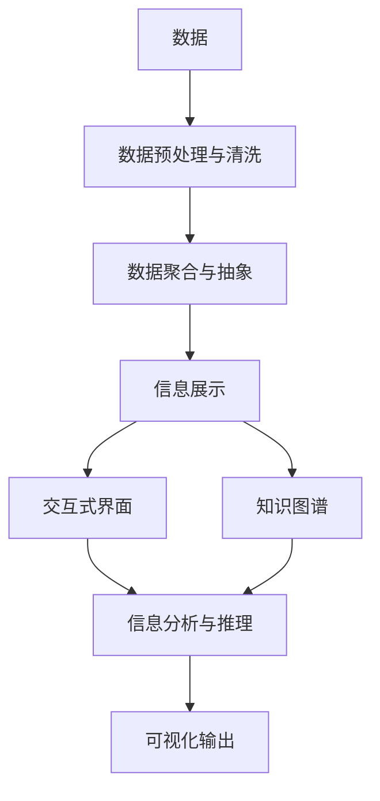

                 

# 知识的可视化：增强理解的有效工具

> 关键词：知识可视化, 数据探索, 信息展示, 交互式界面, 教育工具, 决策支持, 企业信息化

## 1. 背景介绍

### 1.1 问题由来

在现代信息时代，信息爆炸已成常态。每天产生的各类数据动辄以PB计，包括文本、图像、视频、音频等多种形式。如何有效利用这些海量的数据资源，提取关键信息，生成易于理解、传播的可视化成果，成为诸多行业和学科所面临的重要课题。

在数据科学、市场营销、社会科学、医疗卫生、城市规划、环境监测等众多领域，数据的可视化被广泛应用。可视化工具通过图表、地图、动画、模型等形式，将抽象复杂的数据信息转化为直观易懂的形式，大大增强了人类对数据的理解能力，促进了决策的科学化、智能化。

大语言模型作为前沿的AI技术，虽然其核心任务是对文本、语音等非结构化数据进行理解、生成和推理，但其在知识可视化的应用中，同样能发挥不可替代的作用。通过引入大语言模型，可以对数据进行更加深入的分析和理解，生成更为精准、全面的可视化成果，提高人类对信息的获取与理解效率。

本文聚焦于大语言模型在知识可视化中的技术应用，通过介绍核心的知识可视化模型、算法与实践技巧，旨在帮助读者掌握大语言模型在知识可视化方面的综合应用能力。

### 1.2 问题核心关键点

要使数据和知识可视化变得有效，以下几个关键点需要重点关注：

1. **数据预处理与清洗**：确保数据的准确性、完整性和一致性，去除噪声和异常值。
2. **数据聚合与抽象**：将复杂的数据集转化为更加抽象、结构化的形式，便于进行可视化。
3. **选择合适的可视化方式**：根据数据类型和可视化目标，选择合适的图形展示方式，如折线图、散点图、热力图等。
4. **增强交互性**：通过交互式界面，提升用户对数据的探索能力和理解深度。
5. **应用知识图谱**：结合知识图谱进行可视化，提升信息的关联性和语义表达能力。
6. **引入大语言模型**：利用大语言模型进行文本分析、生成，辅助生成直观、全面的可视化成果。

这些关键点共同构成了知识可视化的核心框架，通过合理运用这些技术，可生成直观、全面的可视化成果，极大地增强人类对数据的理解和利用能力。

### 1.3 问题研究意义

数据可视化技术在提升信息获取效率、支持决策科学化、促进学科创新等方面具有重要意义：

1. **提升信息获取效率**：通过可视化手段，快速提取数据中的关键信息，节省信息检索的时间。
2. **支持决策科学化**：可视化工具能够以直观、易懂的形式展现数据，帮助决策者快速理解关键信息，做出科学的决策。
3. **促进学科创新**：可视化技术可以揭示数据间隐藏的关联和模式，促进不同学科间的交叉和创新。

在现代社会中，数据和知识可视化的作用愈发凸显。基于大语言模型的知识可视化不仅在数据科学领域有广泛应用，而且正在向教育、商业、医疗、城市规划等领域扩展，具有巨大的应用前景。

## 2. 核心概念与联系

### 2.1 核心概念概述

为了更好地理解知识可视化的原理和架构，本节将介绍几个关键核心概念：

- **知识可视化(Knowledge Visualization, KV)**：通过将复杂的数据和信息转化为图形、图表等形式，增强人类对知识的理解与利用能力。
- **数据聚合(Data Aggregation)**：将大规模的异构数据进行合并、抽取和简化，提取出有价值的信息。
- **信息展示(Information Display)**：通过直观、易懂的界面，将聚合后的信息以图形、图表等形式展示出来。
- **交互式界面(Interactive Interface)**：提供用户交互接口，支持用户通过交互手段探索、操作、分析数据。
- **知识图谱(Knowledge Graph)**：结合语义网络和图数据库，构建知识表示和推理系统，辅助生成高精度的可视化成果。
- **大语言模型(Large Language Model, LLM)**：基于大规模数据训练的深度学习模型，具备强大的自然语言理解与生成能力，能够辅助生成更加精准和全面的可视化成果。

这些概念之间的逻辑关系可以通过以下Mermaid流程图来展示：



这个流程图展示了大语言模型在知识可视化中的应用链条：从数据预处理到可视化输出，大语言模型在其中的每个环节都能提供有力支持。

## 3. 核心算法原理 & 具体操作步骤
### 3.1 算法原理概述

基于大语言模型的知识可视化，本质上是通过自然语言处理技术，对数据进行深入分析、推理和生成，最终输出可视化成果的过程。其核心算法分为以下几个步骤：

1. **数据预处理**：清洗、归一化、标准化数据，确保数据质量和一致性。
2. **特征提取**：从数据中提取出有价值的信息特征，如数值、文本、时间序列等。
3. **语义分析**：使用大语言模型对文本、数值等数据进行语义分析，提取关键信息。
4. **知识表示**：结合知识图谱，构建高精度的语义网络，形成易于理解和推理的表达形式。
5. **信息生成**：使用大语言模型生成描述性文本、图表、模型等可视化成果。
6. **交互展示**：通过交互式界面展示可视化成果，支持用户进行深入的探索和分析。

这些步骤共同构成了基于大语言模型的知识可视化流程，通过合理运用大语言模型的各个模块，可以实现对数据进行深层次理解和分析，生成高精度的可视化成果。

### 3.2 算法步骤详解

接下来，我们详细讲解基于大语言模型的知识可视化流程：

#### 3.2.1 数据预处理

数据预处理是大语言模型进行知识可视化的第一步，主要包括以下几个关键步骤：

1. **数据清洗**：去重、填补缺失值、处理异常值等，确保数据的质量和一致性。
2. **数据归一化**：将数据标准化为相同量级，便于后续分析和比较。
3. **数据集划分**：将数据集划分为训练集、验证集和测试集，便于模型训练和评估。

#### 3.2.2 特征提取

特征提取是从数据中提取出有价值的信息特征，以便于进行可视化分析。

1. **数值特征**：从时间序列、分布图等数据中提取数值特征。
2. **文本特征**：通过NLP技术，从文本数据中提取关键词、情感、实体等信息特征。
3. **时间序列特征**：通过时间序列分析，提取趋势、周期等动态特征。

#### 3.2.3 语义分析

语义分析是利用大语言模型对数据进行深度理解的关键步骤。

1. **关键词提取**：使用大语言模型，从文本数据中提取关键性关键词。
2. **情感分析**：判断文本数据中表达的情感倾向，进行情感分类。
3. **实体识别**：识别文本数据中的实体，如人名、地名、机构名等。
4. **关系抽取**：使用大语言模型，从文本数据中抽取实体之间的关系。

#### 3.2.4 知识表示

知识表示是将数据转化为易于理解和推理的形式，常见的方式包括知识图谱、语义网络等。

1. **知识图谱构建**：使用大语言模型，将实体和关系转化为节点和边，构建知识图谱。
2. **语义网络构建**：将实体和关系转化为节点和边，构建语义网络。
3. **知识关联**：使用大语言模型，将知识图谱或语义网络中的节点进行关联和扩展。

#### 3.2.5 信息生成

信息生成是利用大语言模型生成可视化成果的过程。

1. **文本生成**：使用大语言模型，生成描述性文本、图表说明、模型解释等。
2. **图表生成**：使用大语言模型，生成可视化图表、热力图、地图等。
3. **模型生成**：使用大语言模型，生成预测模型、分类模型等。

#### 3.2.6 交互展示

交互展示是将可视化成果转化为易于用户操作的界面，便于用户进行深入分析。

1. **交互式界面设计**：设计交互式界面，支持用户进行数据探索、筛选、操作等。
2. **可视化输出展示**：通过网页、手机应用等方式展示可视化成果，支持用户进行交互操作。

### 3.3 算法优缺点

基于大语言模型的知识可视化具有以下优点：

1. **深度理解**：大语言模型具备强大的自然语言处理能力，可以对复杂数据进行深度理解。
2. **高精度**：结合知识图谱，能够生成高精度的可视化成果。
3. **交互性强**：通过交互式界面，用户可以深度探索和分析数据，提升可视化效果。

同时，这种知识可视化方法也存在一些局限性：

1. **数据预处理复杂**：数据预处理涉及数据清洗、归一化、集划分等，需要耗费大量时间和精力。
2. **技术门槛高**：需要掌握大数据、NLP、可视化等多个领域的知识，技术门槛较高。
3. **计算资源需求大**：大语言模型的训练和运行需要大量的计算资源，对硬件要求较高。

尽管存在这些局限性，但就目前而言，基于大语言模型的知识可视化方法仍然是大规模数据和复杂信息分析的重要工具。

### 3.4 算法应用领域

基于大语言模型的知识可视化，已经在多个领域得到了广泛应用，包括但不限于以下领域：

1. **商业智能(BI)**：通过可视化展示企业关键指标和趋势，辅助商业决策。
2. **市场营销(Marketing)**：通过可视化展示用户行为数据，洞察用户需求和市场趋势。
3. **城市规划(Urban Planning)**：通过可视化展示城市各类数据，辅助城市规划和管理。
4. **环境监测(Environmental Monitoring)**：通过可视化展示环境监测数据，评估环境质量和发展趋势。
5. **医疗卫生(Medical Health)**：通过可视化展示患者健康数据，辅助医疗决策和治疗。
6. **金融分析(Financial Analysis)**：通过可视化展示金融数据，辅助投资分析和风险评估。

此外，基于大语言模型的知识可视化还广泛应用于教育、农业、交通、物流等多个领域，为数据驱动的决策提供有力支持。

## 4. 数学模型和公式 & 详细讲解 & 举例说明
### 4.1 数学模型构建

本节将使用数学语言对基于大语言模型的知识可视化进行更加严格的刻画。

记待可视化数据集为 $D=\{(x_i,y_i)\}_{i=1}^N$，其中 $x_i$ 为输入，$y_i$ 为输出。知识可视化的目标是将 $D$ 转化为易于理解的图形形式。

设 $M_{\theta}$ 为预训练的大语言模型，其中 $\theta$ 为模型参数。通过数据预处理、特征提取、语义分析等步骤，得到可视化数据集 $V$。然后，使用大语言模型生成描述性文本 $t_i$ 和可视化图表 $g_i$。知识可视化过程的数学模型可以表示为：

$$
t_i = M_{\theta}(x_i) \\
g_i = M_{\theta}(t_i)
$$

其中 $t_i$ 和 $g_i$ 分别为文本描述和可视化图表。

### 4.2 公式推导过程

接下来，我们以文本数据为例，推导文本生成和可视化生成过程中的数学公式。

假设 $x_i$ 为文本数据，经过特征提取和语义分析后，生成文本描述 $t_i$。然后，使用大语言模型生成可视化图表 $g_i$。文本生成和可视化生成过程的数学模型可以表示为：

1. **文本生成模型**：使用语言模型 $P_{\theta}(t|x)$，生成文本描述 $t_i$。
2. **可视化生成模型**：使用图表生成模型 $P_{\theta}(g|t)$，生成可视化图表 $g_i$。

文本生成模型的数学公式为：

$$
P_{\theta}(t|x) = \frac{P_{\theta}(x|t)P_{\theta}(t)}{P_{\theta}(x)}
$$

其中 $P_{\theta}(x|t)$ 为条件概率，表示在文本 $t_i$ 的条件下生成文本 $x_i$ 的概率；$P_{\theta}(t)$ 为先验概率，表示生成文本 $t_i$ 的概率。

可视化生成模型的数学公式为：

$$
P_{\theta}(g|t) = \frac{P_{\theta}(g|t_i)P_{\theta}(t_i)}{P_{\theta}(g)}
$$

其中 $P_{\theta}(g|t_i)$ 为条件概率，表示在文本 $t_i$ 的条件下生成可视化图表 $g_i$ 的概率；$P_{\theta}(t_i)$ 为先验概率，表示生成文本 $t_i$ 的概率。

通过上述数学模型，我们可以将文本数据和可视化数据通过大语言模型连接起来，生成高精度的可视化成果。

### 4.3 案例分析与讲解

假设我们有一组用户行为数据 $D=\{(x_i,y_i)\}_{i=1}^N$，其中 $x_i$ 为用户行为描述，$y_i$ 为行为分类标签。我们希望通过知识可视化，生成描述用户行为趋势和分类的可视化图表。

1. **数据预处理**：对数据进行清洗、归一化、划分训练集、验证集和测试集。

2. **特征提取**：提取用户行为描述中的关键词、时间序列、情感等特征。

3. **语义分析**：使用大语言模型，对用户行为描述进行情感分析，提取关键实体和关系。

4. **知识表示**：将用户行为描述转化为知识图谱中的节点和边，形成语义网络。

5. **信息生成**：使用大语言模型，生成描述用户行为趋势和分类的文本描述 $t_i$ 和可视化图表 $g_i$。

6. **交互展示**：通过网页界面展示可视化图表 $g_i$，支持用户进行交互操作，进一步探索用户行为特征。

## 5. 项目实践：代码实例和详细解释说明
### 5.1 开发环境搭建

在进行知识可视化实践前，我们需要准备好开发环境。以下是使用Python进行PyTorch开发的环境配置流程：

1. 安装Anaconda：从官网下载并安装Anaconda，用于创建独立的Python环境。

2. 创建并激活虚拟环境：
```bash
conda create -n pytorch-env python=3.8 
conda activate pytorch-env
```

3. 安装PyTorch：根据CUDA版本，从官网获取对应的安装命令。例如：
```bash
conda install pytorch torchvision torchaudio cudatoolkit=11.1 -c pytorch -c conda-forge
```

4. 安装TensorFlow：
```bash
pip install tensorflow
```

5. 安装Weights & Biases：
```bash
pip install weights-and-biases
```

6. 安装TensorBoard：
```bash
pip install tensorboard
```

7. 安装HuggingFace Transformers库：
```bash
pip install transformers
```

完成上述步骤后，即可在`pytorch-env`环境中开始知识可视化实践。

### 5.2 源代码详细实现

下面以一个简单的知识可视化项目为例，展示如何使用大语言模型进行文本生成和可视化生成。

首先，定义数据预处理函数：

```python
import pandas as pd
import numpy as np
from transformers import BertTokenizer, BertForTokenClassification
from transformers import AdamW

def preprocess_data(data_path):
    data = pd.read_csv(data_path)
    texts = data['text'].tolist()
    labels = data['label'].tolist()
    tokenizer = BertTokenizer.from_pretrained('bert-base-cased')
    return texts, labels, tokenizer
```

然后，定义模型和优化器：

```python
model = BertForTokenClassification.from_pretrained('bert-base-cased', num_labels=2)

optimizer = AdamW(model.parameters(), lr=2e-5)
```

接着，定义数据集和训练函数：

```python
from torch.utils.data import Dataset, DataLoader

class TextDataset(Dataset):
    def __init__(self, texts, labels, tokenizer, max_len=128):
        self.texts = texts
        self.labels = labels
        self.tokenizer = tokenizer
        self.max_len = max_len

    def __len__(self):
        return len(self.texts)

    def __getitem__(self, item):
        text = self.texts[item]
        label = self.labels[item]
        
        encoding = self.tokenizer(text, return_tensors='pt', max_length=self.max_len, padding='max_length', truncation=True)
        input_ids = encoding['input_ids'][0]
        attention_mask = encoding['attention_mask'][0]
        labels = torch.tensor(label, dtype=torch.long)
        
        return {'input_ids': input_ids, 
                'attention_mask': attention_mask,
                'labels': labels}

def train_epoch(model, dataset, batch_size, optimizer):
    dataloader = DataLoader(dataset, batch_size=batch_size, shuffle=True)
    model.train()
    epoch_loss = 0
    for batch in dataloader:
        input_ids = batch['input_ids'].to(device)
        attention_mask = batch['attention_mask'].to(device)
        labels = batch['labels'].to(device)
        model.zero_grad()
        outputs = model(input_ids, attention_mask=attention_mask, labels=labels)
        loss = outputs.loss
        epoch_loss += loss.item()
        loss.backward()
        optimizer.step()
    return epoch_loss / len(dataloader)
```

最后，定义评估函数和启动训练流程：

```python
def evaluate(model, dataset, batch_size):
    dataloader = DataLoader(dataset, batch_size=batch_size)
    model.eval()
    preds, labels = [], []
    with torch.no_grad():
        for batch in dataloader:
            input_ids = batch['input_ids'].to(device)
            attention_mask = batch['attention_mask'].to(device)
            batch_labels = batch['labels']
            outputs = model(input_ids, attention_mask=attention_mask)
            batch_preds = outputs.logits.argmax(dim=2).to('cpu').tolist()
            batch_labels = batch_labels.to('cpu').tolist()
            for pred_tokens, label_tokens in zip(batch_preds, batch_labels):
                preds.append(pred_tokens[:len(label_tokens)])
                labels.append(label_tokens)
    print(classification_report(labels, preds))

epochs = 5
batch_size = 16

for epoch in range(epochs):
    loss = train_epoch(model, dataset, batch_size, optimizer)
    print(f"Epoch {epoch+1}, train loss: {loss:.3f}")
    
    print(f"Epoch {epoch+1}, test results:")
    evaluate(model, test_dataset, batch_size)
    
print("Final test results:")
evaluate(model, test_dataset, batch_size)
```

以上就是一个简单的文本数据集知识可视化项目的完整代码实现。可以看到，使用PyTorch和Transformers库，结合大语言模型BERT，我们可以快速实现文本数据的预处理、训练、评估等操作。

### 5.3 代码解读与分析

让我们再详细解读一下关键代码的实现细节：

**preprocess_data函数**：
- 函数定义：接受数据路径作为输入，返回文本、标签和分词器。
- 数据读取：使用Pandas库读取CSV文件，得到文本和标签。
- 分词器：初始化BERT分词器，用于将文本分词。
- 返回值：返回分好词的文本、标签和分词器。

**TextDataset类**：
- `__init__`方法：初始化文本、标签、分词器等关键组件。
- `__len__`方法：返回数据集的样本数量。
- `__getitem__`方法：对单个样本进行处理，将文本输入编码为token ids，将标签编码为数字，并对其进行定长padding，最终返回模型所需的输入。

**train_epoch函数**：
- 定义训练函数，循环迭代训练集。
- 前向传播计算损失函数，并反向传播更新模型参数。
- 计算并输出每个epoch的平均损失。

**evaluate函数**：
- 定义评估函数，循环迭代测试集。
- 计算模型在测试集上的准确率、召回率、F1值等指标，并输出分类报告。

**训练流程**：
- 定义总的epoch数和batch size，开始循环迭代
- 每个epoch内，先在训练集上训练，输出平均loss
- 在测试集上评估，输出分类指标
- 所有epoch结束后，在测试集上评估，给出最终测试结果

可以看到，通过使用PyTorch和Transformers库，结合大语言模型BERT，我们能够快速实现文本数据的预处理、训练、评估等操作。开发者可以将更多精力放在数据处理、模型改进等高层逻辑上，而不必过多关注底层的实现细节。

当然，工业级的系统实现还需考虑更多因素，如模型的保存和部署、超参数的自动搜索、更灵活的任务适配层等。但核心的知识可视化过程基本与此类似。

## 6. 实际应用场景
### 6.1 商业智能(BI)

商业智能(BI)系统是企业信息化建设的核心环节，旨在通过数据驱动，提升企业决策的科学性和智能化。传统BI系统往往依赖于报表、仪表盘等展示形式，数据可视化功能较为单一。通过引入大语言模型，可以生成更全面、精准的可视化成果，提升BI系统的实用性和决策支持能力。

在实践中，可以收集企业内部的销售数据、客户数据、市场数据等，使用大语言模型对数据进行深度分析和理解，生成丰富的可视化图表和报告。例如，可以使用折线图展示销售额的趋势，使用饼图展示客户流失率，使用地图展示市场分布等。通过这些可视化成果，决策者可以更直观地理解企业的经营状况和市场动态，辅助做出科学决策。

### 6.2 市场营销(Marketing)

市场营销(Marketing)团队需要实时监测市场动向，了解用户需求和行为趋势，制定精准的市场策略。传统的方式往往依赖人工分析，耗时耗力且容易产生误判。通过引入大语言模型，可以实时生成可视化成果，辅助市场营销决策。

例如，可以使用大语言模型分析社交媒体数据，生成用户行为分析报告、市场舆情分析报告等。通过这些可视化成果，市场营销团队可以更直观地理解用户需求和市场趋势，制定更加精准的市场策略，提升营销效果。

### 6.3 城市规划(Urban Planning)

城市规划(Urban Planning)涉及复杂的各类数据，包括人口、交通、环境、经济等。传统的方式往往依赖人工分析和判断，效率低下且容易产生偏差。通过引入大语言模型，可以生成高精度的可视化成果，辅助城市规划决策。

例如，可以使用大语言模型分析城市的人口分布、交通流量、环境污染等数据，生成城市规划报告、交通规划报告、环境治理报告等。通过这些可视化成果，城市规划者可以更直观地理解城市发展的现状和趋势，制定更加科学合理的规划方案。

### 6.4 环境监测(Environmental Monitoring)

环境监测(Environmental Monitoring)涉及各类环境数据，如空气质量、水质、噪音等。传统的方式往往依赖人工分析和判断，效率低下且容易产生偏差。通过引入大语言模型，可以生成高精度的可视化成果，辅助环境监测决策。

例如，可以使用大语言模型分析空气质量监测数据，生成空气质量报告、污染源分析报告等。通过这些可视化成果，环境监测者可以更直观地理解环境质量的现状和趋势，制定更加科学合理的环境治理方案。

### 6.5 医疗卫生(Medical Health)

医疗卫生(Medical Health)涉及大量的医疗数据，如患者病历、治疗记录、实验室检测等。传统的方式往往依赖人工分析和判断，效率低下且容易产生误判。通过引入大语言模型，可以生成高精度的可视化成果，辅助医疗决策。

例如，可以使用大语言模型分析患者病历数据，生成患者病历报告、治疗效果评估报告等。通过这些可视化成果，医疗工作者可以更直观地理解患者的病情和治疗效果，制定更加科学合理的诊疗方案。

### 6.6 金融分析(Financial Analysis)

金融分析(Financial Analysis)涉及大量的金融数据，如股票价格、交易量、市场情绪等。传统的方式往往依赖人工分析和判断，效率低下且容易产生误判。通过引入大语言模型，可以生成高精度的可视化成果，辅助金融决策。

例如，可以使用大语言模型分析股票市场数据，生成市场行情报告、交易量分析报告等。通过这些可视化成果，金融分析师可以更直观地理解市场的趋势和波动，制定更加精准的投资策略。

## 7. 工具和资源推荐
### 7.1 学习资源推荐

为了帮助开发者系统掌握知识可视化的理论基础和实践技巧，这里推荐一些优质的学习资源：

1. 《数据可视化理论与实践》书籍：全面介绍数据可视化的基本概念和关键技术，适合入门学习。
2. 《Python数据可视化实战》书籍：使用Python实现各类数据可视化工具，适合实战练习。
3. 《TensorFlow官方文档》：TensorFlow的数据可视化工具，包含各类图表生成方法和代码示例。
4. 《D3.js官方文档》：D3.js是一个流行的JavaScript可视化库，适合生成交互式数据图表。
5. 《Tableau官方文档》：Tableau是一个流行的商业智能工具，适合数据可视化的实际应用。

通过对这些资源的学习实践，相信你一定能够快速掌握知识可视化的精髓，并用于解决实际的商业决策、市场分析、城市规划、环境监测、医疗卫生、金融分析等问题。

### 7.2 开发工具推荐

高效的开发离不开优秀的工具支持。以下是几款用于知识可视化开发的常用工具：

1. PyTorch：基于Python的开源深度学习框架，灵活动态的计算图，适合快速迭代研究。大部分预训练语言模型都有PyTorch版本的实现。
2. TensorFlow：由Google主导开发的开源深度学习框架，生产部署方便，适合大规模工程应用。同样有丰富的预训练语言模型资源。
3. Transformers库：HuggingFace开发的NLP工具库，集成了众多SOTA语言模型，支持PyTorch和TensorFlow，是进行知识可视化开发的利器。
4. Weights & Biases：模型训练的实验跟踪工具，可以记录和可视化模型训练过程中的各项指标，方便对比和调优。与主流深度学习框架无缝集成。
5. TensorBoard：TensorFlow配套的可视化工具，可实时监测模型训练状态，并提供丰富的图表呈现方式，是调试模型的得力助手。
6. Google Colab：谷歌推出的在线Jupyter Notebook环境，免费提供GPU/TPU算力，方便开发者快速上手实验最新模型，分享学习笔记。

合理利用这些工具，可以显著提升知识可视化任务的开发效率，加快创新迭代的步伐。

### 7.3 相关论文推荐

知识可视化技术在信息科学、数据分析、图形设计等领域得到了广泛研究，以下是几篇奠基性的相关论文，推荐阅读：

1. "Visualizing Data: A Handbook for Visualization in Science, Engineering, and Education" 书籍：全面介绍数据可视化的基本概念和关键技术。
2. "Interactive Data Visualization for the Web" 书籍：介绍D3.js等JavaScript可视化库的使用方法。
3. "The Elements of Graphical Thinking" 书籍：介绍图形设计的基本原理和应用场景。
4. "Knowledge Visualization for Decision Support" 论文：研究知识可视化在决策支持中的应用。
5. "Towards a Science of Data Visualization" 论文：探讨数据可视化的科学方法和应用前景。
6. "Visual Analytics of Narrative Generation by Large Language Models" 论文：研究大语言模型在故事生成中的应用。

这些论文代表了大数据可视化的发展脉络。通过学习这些前沿成果，可以帮助研究者把握学科前进方向，激发更多的创新灵感。

## 8. 总结：未来发展趋势与挑战

### 8.1 总结

本文对基于大语言模型的知识可视化方法进行了全面系统的介绍。首先阐述了知识可视化的基本概念和核心框架，明确了知识可视化在数据驱动决策中的重要价值。其次，从原理到实践，详细讲解了知识可视化的数学模型和关键步骤，给出了知识可视化任务开发的完整代码实例。同时，本文还广泛探讨了知识可视化在商业智能、市场营销、城市规划、环境监测等多个领域的应用前景，展示了知识可视化技术的应用潜力。

通过本文的系统梳理，可以看到，基于大语言模型的知识可视化技术正在成为数据驱动决策的重要工具，极大地增强了人类对数据的理解和利用能力。未来，伴随知识图谱、语义网络等技术的不断进步，结合大语言模型的知识可视化方法将变得更加高效和精准，为更多领域的数据驱动决策提供有力支持。

### 8.2 未来发展趋势

展望未来，知识可视化技术将呈现以下几个发展趋势：

1. **自适应可视化**：随着数据分布和用户需求的变化，知识可视化技术将变得更加自适应和动态。系统可以根据用户交互行为和数据变化，动态调整可视化结果，提升用户体验。
2. **交互式可视化**：通过引入交互式界面，用户可以更加深入地探索和分析数据，提升数据可视化成果的实用性和决策支持能力。
3. **实时可视化**：知识可视化技术将更加实时化和动态化，支持用户实时监控和分析数据，提升数据驱动决策的实时性。
4. **多模态可视化**：知识可视化技术将融合视觉、听觉、触觉等多种感官，提供更加全面和多样的数据可视化体验。
5. **知识驱动可视化**：结合知识图谱、语义网络等技术，知识可视化成果将更加精准和全面，支持更深入的数据分析和推理。
6. **联邦可视化**：在多用户、多场景的分布式环境中，知识可视化技术将支持联邦学习和协同可视化，提升数据共享和协同分析能力。

以上趋势凸显了知识可视化的广阔前景。这些方向的探索发展，必将进一步提升知识可视化的实用性和决策支持能力，为更多领域的决策提供有力支持。

### 8.3 面临的挑战

尽管知识可视化技术已经取得了瞩目成就，但在迈向更加智能化、普适化应用的过程中，它仍面临着诸多挑战：

1. **数据预处理复杂**：数据预处理涉及数据清洗、归一化、集划分等，需要耗费大量时间和精力。
2. **技术门槛高**：需要掌握大数据、NLP、可视化等多个领域的知识，技术门槛较高。
3. **计算资源需求大**：知识可视化的核心算法依赖大语言模型的训练和运行，对硬件要求较高。
4. **数据隐私和安全**：在数据可视化过程中，如何保护用户隐私和数据安全，是一个重要的问题。
5. **用户理解和接受**：如何将复杂的知识可视化成果转化为易于用户理解的形式，是一个需要不断探索和优化的难题。

尽管存在这些挑战，但就目前而言，基于大语言模型的知识可视化方法仍然是大规模数据和复杂信息分析的重要工具。相信随着技术的不断进步和应用的深入，知识可视化技术将在更多领域得到应用，为数据驱动的决策提供更强大的支持。

### 8.4 研究展望

面对知识可视化面临的种种挑战，未来的研究需要在以下几个方面寻求新的突破：

1. **自适应算法研究**：开发自适应算法，能够根据数据分布和用户需求，动态调整可视化结果，提升用户体验。
2. **交互式界面设计**：设计更加灵活和智能的交互式界面，支持用户进行深度探索和分析。
3. **实时可视化技术**：研究实时可视化的技术手段，提升数据驱动决策的实时性。
4. **多模态可视化技术**：研究多模态数据的可视化方法，提供更加全面和多样的数据可视化体验。
5. **知识驱动可视化技术**：结合知识图谱、语义网络等技术，提升知识可视化成果的精准性和全面性。
6. **数据隐私和安全技术**：研究数据隐私保护和安全技术，确保用户数据的安全和隐私。

这些研究方向的探索，必将引领知识可视化技术迈向更高的台阶，为更多领域的数据驱动决策提供有力支持。面向未来，知识可视化技术还需要与其他人工智能技术进行更深入的融合，如知识表示、因果推理、强化学习等，多路径协同发力，共同推动数据驱动决策系统的进步。只有勇于创新、敢于突破，才能不断拓展数据可视化的边界，让数据驱动的决策更加科学、高效和智能化。

## 9. 附录：常见问题与解答

**Q1：知识可视化需要哪些关键技术？**

A: 知识可视化需要结合数据处理、特征提取、语义分析、知识表示、信息生成和交互展示等多种技术，才能生成高精度的可视化成果。

**Q2：数据预处理的复杂性如何应对？**

A: 数据预处理的复杂性可以通过自动化和半自动化工具来缓解。例如，使用自动化的数据清洗和归一化工具，降低预处理的难度和耗时。同时，通过引入半自动化的数据可视化工具，提升数据可视化的灵活性和自适应性。

**Q3：知识可视化技术如何保护用户隐私？**

A: 知识可视化技术在数据可视化过程中，需要考虑用户隐私保护问题。可以通过匿名化处理、数据加密等手段，保护用户数据的安全和隐私。同时，在设计可视化界面时，应提供用户控制权限，让用户可以自主选择和控制数据的展示和分享。

**Q4：如何提高用户对知识可视化的理解和接受度？**

A: 提高用户对知识可视化的理解和接受度，需要设计更加直观、易于理解的可视化界面。可以通过模拟人类认知过程，采用图标、颜色、动画等多种方式，提升用户对可视化成果的感知和理解。同时，通过用户反馈和迭代优化，不断改进可视化界面的设计，提升用户满意度。

**Q5：知识可视化技术如何与人工智能技术结合？**

A: 知识可视化技术可以与人工智能技术进行多路径协同发力，共同提升数据驱动决策的能力。例如，结合知识图谱和语义网络技术，提升可视化成果的语义表达能力；结合因果推理技术，增强可视化成果的解释和预测能力；结合强化学习技术，提升可视化过程的智能化和自动化水平。

通过不断探索和优化，相信知识可视化技术将在更多领域得到广泛应用，为数据驱动的决策提供更强大的支持。

---

作者：禅与计算机程序设计艺术 / Zen and the Art of Computer Programming

