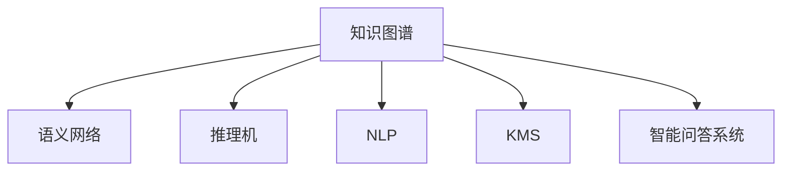

                 

# 知识输出与管理经验的系统化

> 关键词：知识图谱,语义网络,推理机,自然语言处理,知识管理系统,智能问答系统,大数据,信息检索,认知计算

## 1. 背景介绍

### 1.1 问题由来
随着数字化转型的加速，企业在知识管理与信息输出方面面临巨大挑战。如何高效、精准地收集、存储、组织和利用知识资源，成为企业数字化转型的重要课题。

当前的知识管理主要依赖传统的数据库和文档管理系统，存在以下问题：

1. **数据孤岛**：知识分散存储，难以实现跨部门、跨系统的数据互通。
2. **数据冗余**：不同系统重复存储相同信息，造成数据冗余。
3. **数据格式多样**：文本、图片、音频、视频等数据格式不一，难以统一管理和分析。
4. **知识共享困难**：知识缺乏统一的格式和标准，共享和协作效率低下。

针对这些问题，亟需一种高效、系统化的知识输出与管理方法，以提升知识管理的效率和效果。

### 1.2 问题核心关键点
实现知识输出与管理经验系统化的关键在于构建知识图谱(Knowledge Graph)。知识图谱通过语义网络(Semantic Network)、推理机(Reasoner)等技术，将分散的、异构的知识资源整合为一个统一的、可查询的知识体系。

知识图谱的核心组件包括：

1. **实体(Entity)**：表示知识中的名词，如人名、地名、机构名等。
2. **属性(Property)**：表示实体的特征或属性，如人名对应的性别、年龄、职业等。
3. **关系(Relation)**：表示实体之间的关系，如“王小明”与“李华”是“同事”关系。
4. **知识图谱存储库(Graph Store)**：用于存储和查询知识图谱的数据结构。
5. **推理机(Reasoner)**：用于根据知识图谱中的实体和关系进行逻辑推理，生成新的知识。

### 1.3 问题研究意义
构建知识图谱对企业知识管理与信息输出的意义重大：

1. **提升知识共享效率**：通过统一的语义模型，实现知识的标准化和格式统一，促进知识的共享和协作。
2. **增强知识决策支持**：利用知识图谱进行逻辑推理，生成新的知识和见解，辅助决策支持。
3. **优化信息检索效果**：通过知识图谱的查询和推理，实现更精准的信息检索和推荐。
4. **推动认知计算应用**：知识图谱为认知计算提供了丰富的语义知识，助力自然语言处理、机器学习等技术的落地应用。

## 2. 核心概念与联系

### 2.1 核心概念概述

为更好地理解知识图谱与系统化知识管理，本节将介绍几个关键概念：

- **知识图谱(Knowledge Graph)**：基于语义网络的知识存储和管理技术，用于描述实体间的关系和属性，支持知识查询和推理。
- **语义网络(Semantic Network)**：用于表示实体间关系的无向图，每条边表示一种关系。
- **推理机(Reasoner)**：用于根据知识图谱中的信息进行逻辑推理，生成新的知识。
- **自然语言处理(Natural Language Processing, NLP)**：利用计算机技术处理、理解和生成人类语言的技术。
- **知识管理系统(Knowledge Management System, KMS)**：支持知识收集、存储、共享和协作的软件系统。
- **智能问答系统(Intelligent Question Answering System)**：通过自然语言处理和知识图谱技术，回答用户提出的问题。

这些概念之间的逻辑关系可以通过以下Mermaid流程图来展示：



这个流程图展示了几类关键概念及其之间的关系：

1. 知识图谱通过语义网络表示实体间的各种关系。
2. 推理机利用知识图谱中的信息进行逻辑推理，生成新的知识。
3. NLP技术用于处理和理解人类语言，为知识图谱和推理机提供输入。
4. KMS支持知识的收集、存储、共享和协作。
5. 智能问答系统结合知识图谱和NLP技术，实现自动问答。

## 3. 核心算法原理 & 具体操作步骤
### 3.1 算法原理概述

构建知识图谱与系统化知识管理的核心算法主要基于语义网络和推理技术，其核心思想是将异构、分散的知识资源整合成一个统一的、可推理的知识体系。

知识图谱的构建过程包括：

1. **实体抽取**：从原始数据中抽取实体，并将其映射为知识图谱中的节点。
2. **属性抽取**：从实体数据中提取属性，并将其映射为节点的属性值。
3. **关系抽取**：从实体间的关联数据中抽取关系，并将其映射为节点间的边。
4. **知识图谱存储和查询**：将抽取的实体、属性和关系存储到知识图谱存储库中，并支持复杂的查询和推理操作。
5. **推理机生成新知识**：利用知识图谱中的信息进行逻辑推理，生成新的知识。

### 3.2 算法步骤详解

知识图谱的构建和应用过程主要包括以下几个关键步骤：

**Step 1: 数据收集与清洗**

- 收集企业内外的各类数据，包括文本、图片、音频、视频等。
- 对数据进行清洗，去除噪音和错误，保留有用的信息。

**Step 2: 实体抽取**

- 使用NLP技术从清洗后的文本中抽取实体，如人名、地名、机构名等。
- 将实体映射为知识图谱中的节点。

**Step 3: 属性抽取**

- 从实体数据中提取属性，如性别、年龄、职业等。
- 将属性映射为节点的属性值。

**Step 4: 关系抽取**

- 从实体间的关联数据中抽取关系，如“王小明”与“李华”是“同事”关系。
- 将关系映射为节点间的边。

**Step 5: 知识图谱存储和查询**

- 将抽取的实体、属性和关系存储到知识图谱存储库中，如Neo4j、ArangoDB等。
- 使用SQL或SPARQL查询语言，在知识图谱中进行复杂的查询操作。

**Step 6: 推理机生成新知识**

- 利用推理机根据知识图谱中的信息进行逻辑推理，生成新的知识。
- 推理机可以使用各种推理策略，如规则推理、模型推理、一致性推理等。

**Step 7: 应用与反馈**

- 将生成的知识应用于企业的知识管理与信息输出系统中，如智能问答系统、知识推荐系统等。
- 定期收集用户反馈，优化知识图谱的构建和应用效果。

### 3.3 算法优缺点

构建知识图谱与系统化知识管理的方法具有以下优点：

1. **统一知识格式**：通过语义网络，实现知识的标准化和统一，便于知识的共享和协作。
2. **增强决策支持**：利用推理机进行逻辑推理，生成新的知识和见解，辅助决策支持。
3. **优化信息检索**：通过知识图谱的查询和推理，实现更精准的信息检索和推荐。
4. **推动认知计算**：知识图谱为认知计算提供了丰富的语义知识，助力自然语言处理、机器学习等技术的落地应用。

同时，该方法也存在一定的局限性：

1. **数据复杂度高**：不同数据格式和来源，增加了数据抽取和融合的复杂度。
2. **推理精度受限**：推理机基于知识图谱中的信息进行逻辑推理，精度受限于知识图谱的完整性和准确性。
3. **系统复杂性高**：构建和维护知识图谱需要复杂的技术和大量的数据，对系统资源要求高。

尽管存在这些局限性，但就目前而言，知识图谱与系统化知识管理方法仍是企业知识管理与信息输出的重要手段。未来相关研究的重点在于如何进一步降低知识图谱构建和维护的复杂度，提高推理机的精度，同时兼顾系统的可扩展性和易用性。

### 3.4 算法应用领域

知识图谱与系统化知识管理的方法在多个领域得到了广泛应用，包括但不限于：

- **金融领域**：构建金融知识图谱，辅助风险评估、投资决策等。
- **医疗领域**：构建医疗知识图谱，支持疾病诊断、治疗方案推荐等。
- **零售领域**：构建零售知识图谱，支持商品推荐、供应链管理等。
- **智能问答系统**：结合知识图谱和NLP技术，实现自动问答和知识推荐。
- **知识推荐系统**：利用知识图谱进行用户行为分析和推荐，提高推荐效果。
- **认知计算**：将知识图谱与认知计算技术结合，支持自然语言理解、情感分析等。

除了上述这些经典应用外，知识图谱还广泛应用于智慧城市、智能交通、智能制造等更多领域，为各行各业带来变革性影响。

## 4. 数学模型和公式 & 详细讲解  
### 4.1 数学模型构建

知识图谱的构建过程可以通过数学模型来描述。假设知识图谱中的节点集合为 $N=\{n_1, n_2, ..., n_m\}$，边集合为 $E=\{e_1, e_2, ..., e_n\}$，其中 $e_i$ 连接了节点 $n_j$ 和 $n_k$。知识图谱可以用有向图 $G=(N,E)$ 来表示。

知识图谱中的每个节点 $n_i$ 包含一个或多个属性 $p_{i1}, p_{i2}, ..., p_{in}$，每个属性 $p_{ij}$ 具有一个值 $v_{ij}$。例如，节点 $n_i$ 对应的实体是“王小明”，属性 $p_{i1}$ 是“性别”，值为“男”，属性 $p_{i2}$ 是“年龄”，值为“30岁”。

### 4.2 公式推导过程

知识图谱的查询和推理过程可以用以下公式来描述：

**节点查询公式**：

$$
\text{GetNode}(q) = \{n_i \mid \exists p_{ij}, p_{ij} \in \text{predicates}, q = p_{ij} \text{ and } v_{ij} = \text{value} \}
$$

其中 $q$ 表示查询的节点属性名，$\text{predicates}$ 表示所有节点的属性名集合，$\text{value}$ 表示属性值。例如，查询节点 $n_i$ 是否具有属性 $p_{i1}$ 和值“男”，可以表示为：

$$
\text{GetNode}(p_{i1}, \text{value} = \text{男})
$$

**边查询公式**：

$$
\text{GetEdge}(q) = \{e_i \mid \exists n_j, n_k, e_i = (n_j, n_k), q = \text{relations}, \text{relations} \in \text{edges}\}
$$

其中 $q$ 表示查询的边类型，$\text{edges}$ 表示所有边的类型集合。例如，查询节点 $n_i$ 是否与节点 $n_j$ 有“同事”关系，可以表示为：

$$
\text{GetEdge}(\text{同事})
$$

**推理公式**：

$$
\text{Reason}(r) = \{n_i \mid \exists p_{ij}, p_{ij} \in \text{predicates}, r = p_{ij} \text{ and } v_{ij} = \text{value}\}
$$

其中 $r$ 表示推理的规则，$\text{value}$ 表示推理结果。例如，规则 $r$ 是“如果节点 $n_i$ 具有属性 $p_{i1}$ 和值“男”，则 $n_i$ 可能是“王小明””，可以表示为：

$$
\text{Reason}(p_{i1}, \text{value} = \text{男}) \rightarrow n_i = \text{王小明}
$$

### 4.3 案例分析与讲解

下面以医疗知识图谱为例，展示知识图谱的构建和应用过程。

**Step 1: 数据收集与清洗**

- 收集医疗领域的各类数据，包括病历、诊断报告、药品信息等。
- 对数据进行清洗，去除噪音和错误，保留有用的信息。

**Step 2: 实体抽取**

- 使用NLP技术从清洗后的文本中抽取实体，如疾病名、药品名、症状等。
- 将实体映射为知识图谱中的节点。

**Step 3: 属性抽取**

- 从实体数据中提取属性，如疾病名、病情、治疗方案等。
- 将属性映射为节点的属性值。

**Step 4: 关系抽取**

- 从实体间的关联数据中抽取关系，如“疾病-症状”、“药物-副作用”等。
- 将关系映射为节点间的边。

**Step 5: 知识图谱存储和查询**

- 将抽取的实体、属性和关系存储到知识图谱存储库中，如Neo4j、ArangoDB等。
- 使用SQL或SPARQL查询语言，在知识图谱中进行复杂的查询操作。

**Step 6: 推理机生成新知识**

- 利用推理机根据知识图谱中的信息进行逻辑推理，生成新的知识。
- 推理机可以使用各种推理策略，如规则推理、模型推理、一致性推理等。

**Step 7: 应用与反馈**

- 将生成的知识应用于企业的知识管理与信息输出系统中，如智能问答系统、知识推荐系统等。
- 定期收集用户反馈，优化知识图谱的构建和应用效果。

例如，用户查询“哪些药物有副作用？”，推理机可以通过知识图谱进行逻辑推理，生成新的知识：

$$
\text{Reason}(\text{药物-副作用}) \rightarrow \{n_i \mid \exists p_{ij}, p_{ij} = \text{副作用}, v_{ij} = \text{副作用值}\}
$$

推理机可以进一步通过查询“药物-副作用”关系，获取所有药物的副作用信息。

## 5. 项目实践：代码实例和详细解释说明
### 5.1 开发环境搭建

在进行知识图谱构建和应用实践前，我们需要准备好开发环境。以下是使用Python进行知识图谱构建的环境配置流程：

1. 安装Anaconda：从官网下载并安装Anaconda，用于创建独立的Python环境。

2. 创建并激活虚拟环境：
```bash
conda create -n graph-env python=3.8 
conda activate graph-env
```

3. 安装PyTorch：根据CUDA版本，从官网获取对应的安装命令。例如：
```bash
conda install pytorch torchvision torchaudio cudatoolkit=11.1 -c pytorch -c conda-forge
```

4. 安装NELL库：
```bash
pip install nell
```

5. 安装Neo4j：
```bash
wget https://neo4j.com/download
```

6. 安装Neo4j驱动程序：
```bash
pip install neo4j-graph
```

完成上述步骤后，即可在`graph-env`环境中开始知识图谱构建实践。

### 5.2 源代码详细实现

这里以医疗知识图谱为例，展示使用Python和Neo4j进行知识图谱构建的代码实现。

首先，定义知识图谱的数据处理函数：

```python
from nell import NELLTokenizer
from neo4j import GraphDatabase
from py2neo import Graph

class MedicalGraph:
    def __init__(self):
        self.tokenizer = NELLTokenizer()
        self.graph = GraphDatabase.driver('bolt://localhost:7687', auth=('neo4j', 'password'))
        self.neo_graph = Graph()
        
    def add_node(self, entity, props):
        self.neo_graph.create_node(props)
        
    def add_edge(self, n1, n2, rel):
        self.neo_graph.create_relationship(n1, n2, rel)
        
    def query_node(self, entity, prop):
        props = self.neo_graph.get_node(entity)
        return props.get(prop)
        
    def query_edge(self, rel):
        edges = self.neo_graph.get_relationships(rel)
        return edges

# 构造医疗知识图谱
graph = MedicalGraph()
```

然后，定义实体、属性和关系的数据处理函数：

```python
# 定义实体数据
diseases = [
    {'name': '心脏病', 'symptoms': ['胸痛', '气短', '心悸']},
    {'name': '高血压', 'symptoms': ['头痛', '头晕', '失眠']},
    {'name': '糖尿病', 'symptoms': ['口渴', '多尿', '体重下降']}
]

# 定义属性数据
properties = [
    {'name': 'disease_name', 'value': '心脏病'},
    {'name': 'symptom_name', 'value': '胸痛'},
    {'name': 'disease_name', 'value': '高血压'},
    {'name': 'symptom_name', 'value': '头痛'}
]

# 定义关系数据
relations = [
    {'name': 'disease-symptom', 'type': '关联', 'source': 'disease', 'target': 'symptom'}
]

# 构建知识图谱
for disease in diseases:
    graph.add_node(disease['name'], disease)
    for symptom in disease['symptoms']:
        graph.add_node(symptom, {'symptom_name': symptom})
        graph.add_edge(disease['name'], symptom, relations[0])
```

接着，定义推理查询函数：

```python
# 查询节点信息
graph.query_node('心脏病', 'symptom_name')
graph.query_node('高血压', 'symptom_name')

# 查询边信息
graph.query_edge('关联')
```

最后，启动查询流程：

```python
# 查询节点信息
graph.query_node('心脏病', 'symptom_name')

# 查询边信息
graph.query_edge('关联')
```

以上就是使用Python和Neo4j构建医疗知识图谱的完整代码实现。可以看到，知识图谱的构建过程较为简单，主要涉及节点的创建、边的建立和查询操作。

### 5.3 代码解读与分析

让我们再详细解读一下关键代码的实现细节：

**MedicalGraph类**：
- `__init__`方法：初始化NELL tokenizer、Neo4j数据库连接，以及Py2neo的Graph对象。
- `add_node`方法：向知识图谱中添加节点，并将属性信息存储在节点中。
- `add_edge`方法：向知识图谱中添加边，表示节点间的关系。
- `query_node`方法：根据节点名和属性名，查询节点信息。
- `query_edge`方法：根据边类型，查询所有边信息。

**节点和边信息**：
- 实体数据：包含疾病名和症状。
- 属性数据：包含节点对应的属性名和值。
- 关系数据：包含节点间的关系类型。

**代码执行**：
- 创建MedicalGraph对象，连接Neo4j数据库。
- 创建实体节点和属性节点，建立关联关系。
- 查询节点信息，查询关联关系。

可以看到，构建知识图谱的代码实现相对简洁，主要依赖于知识图谱的存储库和推理机。

当然，工业级的系统实现还需考虑更多因素，如知识图谱的更新和维护、查询性能优化、安全性等。但核心的构建范式基本与此类似。

## 6. 实际应用场景
### 6.1 智能问答系统

基于知识图谱与系统化知识管理的方法，可以广泛应用于智能问答系统的构建。传统问答系统往往依赖大量的专家知识库，难以覆盖所有领域的问答需求。而使用知识图谱构建的问答系统，能够整合大规模的知识资源，提供更加全面、准确的问答服务。

在技术实现上，可以构建医疗、金融、法律等领域的知识图谱，将问答任务与知识图谱进行绑定，形成智能问答系统。用户输入问题，系统自动从知识图谱中提取相关信息，并生成答案。对于无法直接回答的问题，系统可以进一步查询专家知识库，提供更准确的答案。

### 6.2 知识推荐系统

当前的知识推荐系统往往依赖用户的历史行为数据进行推荐，无法充分利用企业内部的知识资源。利用知识图谱与系统化知识管理的方法，可以构建知识推荐系统，推荐企业内部的专业知识和经验。

在技术实现上，可以将知识图谱中的实体、属性和关系与推荐算法结合，形成推荐系统。例如，在医疗领域，可以根据病人的疾病信息，推荐相应的治疗方案和药品信息。在零售领域，可以根据顾客的购物历史，推荐相似的商品信息。

### 6.3 金融风险管理

在金融领域，风险管理是一个重要的课题。利用知识图谱与系统化知识管理的方法，可以构建金融知识图谱，辅助风险评估和投资决策。

在技术实现上，可以构建金融领域的知识图谱，包含公司基本信息、财务报表、市场行情等信息。系统可以根据用户输入的问题，自动查询知识图谱，提供相关的金融信息和见解，辅助用户的决策。例如，用户查询“某公司的财务状况”，系统可以从知识图谱中提取公司的基本信息和财务报表，提供详细的分析报告。

### 6.4 未来应用展望

随着知识图谱与系统化知识管理技术的不断发展，基于知识图谱的方法将在更多领域得到应用，为各行各业带来变革性影响。

在智慧医疗领域，基于知识图谱的医疗问答、病历分析、治疗方案推荐等应用将提升医疗服务的智能化水平，辅助医生诊疗，加速新药开发进程。

在智能教育领域，知识图谱可以应用于作业批改、学情分析、知识推荐等方面，因材施教，促进教育公平，提高教学质量。

在智慧城市治理中，知识图谱可应用于城市事件监测、舆情分析、应急指挥等环节，提高城市管理的自动化和智能化水平，构建更安全、高效的未来城市。

此外，在企业生产、社会治理、文娱传媒等众多领域，基于知识图谱的知识管理方法也将不断涌现，为经济社会发展注入新的动力。相信随着技术的日益成熟，知识图谱与系统化知识管理方法将成为企业知识管理与信息输出的重要手段，推动人工智能技术在垂直行业的规模化落地。

## 7. 工具和资源推荐
### 7.1 学习资源推荐

为了帮助开发者系统掌握知识图谱与系统化知识管理技术，这里推荐一些优质的学习资源：

1. 《Knowledge Graphs: A Survey》论文：对知识图谱技术进行了全面的回顾，涵盖了知识图谱构建、查询和推理等各个方面。

2. CS220《信息检索》课程：斯坦福大学开设的课程，介绍了知识图谱与信息检索的基本概念和技术。

3. 《Knowledge Graphs for Semantic Search and Recommendation》书籍：详细介绍了知识图谱在推荐系统和信息检索中的应用。

4. WWW2022 知识图谱专刊：收录了大量知识图谱相关的最新研究论文，涵盖知识图谱构建、查询和推理等各个方面。

5. Neuo4j官方文档：Neo4j知识图谱数据库的官方文档，提供了丰富的示例和API接口。

通过对这些资源的学习实践，相信你一定能够快速掌握知识图谱与系统化知识管理的精髓，并用于解决实际的NLP问题。
### 7.2 开发工具推荐

高效的开发离不开优秀的工具支持。以下是几款用于知识图谱构建和应用开发的常用工具：

1. PyTorch：基于Python的开源深度学习框架，灵活动态的计算图，适合快速迭代研究。大部分预训练语言模型都有PyTorch版本的实现。

2. TensorFlow：由Google主导开发的开源深度学习框架，生产部署方便，适合大规模工程应用。同样有丰富的预训练语言模型资源。

3. Neo4j：企业级知识图谱数据库，支持复杂的查询和推理操作，是知识图谱构建的核心工具。

4. GraphStudio：可视化工具，用于构建、分析和优化知识图谱。

5. Apache Jena：支持语义Web和知识图谱的开放源代码框架，提供了丰富的查询和推理功能。

6. Cypher：Neo4j的查询语言，支持复杂的查询操作。

合理利用这些工具，可以显著提升知识图谱构建和应用任务的开发效率，加快创新迭代的步伐。

### 7.3 相关论文推荐

知识图谱与系统化知识管理技术的发展源于学界的持续研究。以下是几篇奠基性的相关论文，推荐阅读：

1. A Survey on Knowledge Graphs：对知识图谱技术进行了全面的回顾，涵盖了知识图谱构建、查询和推理等各个方面。

2. Knowledge Graphs in the Life Sciences：展示了知识图谱在生命科学领域的应用，包括药物研发、基因组学等。

3. Graph Neural Networks：介绍了图神经网络在知识图谱中的应用，包括知识推理、推荐系统等。

4. Knowledge Graph Embeddings：介绍了知识图谱嵌入技术，用于提升知识图谱的表示能力和查询效果。

5. Multi-Relation Graph Attention Networks：提出了多关系图注意力网络，用于优化知识图谱的查询效果。

这些论文代表了大规模知识图谱构建与应用的最新进展。通过学习这些前沿成果，可以帮助研究者把握学科前进方向，激发更多的创新灵感。

## 8. 总结：未来发展趋势与挑战

### 8.1 总结

本文对知识图谱与系统化知识管理技术进行了全面系统的介绍。首先阐述了知识图谱和系统化知识管理的背景和意义，明确了知识图谱在企业知识管理与信息输出中的重要价值。其次，从原理到实践，详细讲解了知识图谱构建的数学模型和关键步骤，给出了知识图谱构建的完整代码实例。同时，本文还广泛探讨了知识图谱在智能问答、知识推荐、金融风险管理等多个领域的应用前景，展示了知识图谱技术的巨大潜力。此外，本文精选了知识图谱技术的学习资源，力求为读者提供全方位的技术指引。

通过本文的系统梳理，可以看到，知识图谱与系统化知识管理技术正在成为企业知识管理与信息输出的重要手段，极大地拓展了知识的共享和协作能力，提升了信息检索和决策支持的准确性。未来，伴随知识图谱技术的不断发展，基于知识图谱的智能系统将在更多领域得到应用，为经济社会发展注入新的动力。

### 8.2 未来发展趋势

展望未来，知识图谱与系统化知识管理技术将呈现以下几个发展趋势：

1. **知识图谱规模扩大**：随着数据的不断积累和技术的进步，知识图谱的规模将进一步扩大，涵盖更多的领域和知识。

2. **推理技术进步**：推理机的精度和效率将不断提升，能够更好地处理复杂的逻辑推理任务，生成更加准确的答案。

3. **多模态知识融合**：知识图谱将不再局限于文本信息，将融合视觉、语音、时序等模态数据，提升知识图谱的表示能力和应用范围。

4. **知识图谱与AI结合**：知识图谱将与AI技术深度融合，支持自然语言处理、机器学习等领域的知识应用。

5. **知识图谱工业化应用**：知识图谱将进入工业化应用阶段，成为企业知识管理与信息输出的重要工具。

6. **知识图谱隐私保护**：知识图谱的隐私保护将成为重要的研究方向，确保用户数据的安全和隐私。

以上趋势凸显了知识图谱与系统化知识管理技术的广阔前景。这些方向的探索发展，必将进一步提升知识图谱的构建和应用效果，推动知识管理的智能化和自动化进程。

### 8.3 面临的挑战

尽管知识图谱与系统化知识管理技术已经取得了瞩目成就，但在迈向更加智能化、普适化应用的过程中，它仍面临诸多挑战：

1. **数据复杂度高**：不同数据格式和来源，增加了数据抽取和融合的复杂度。

2. **推理精度受限**：推理机基于知识图谱中的信息进行逻辑推理，精度受限于知识图谱的完整性和准确性。

3. **系统复杂性高**：构建和维护知识图谱需要复杂的技术和大量的数据，对系统资源要求高。

4. **知识图谱构建成本高**：知识图谱的构建需要大量的人力和时间，成本较高。

5. **知识图谱应用门槛高**：知识图谱的应用需要一定的技术门槛，对企业的技术能力要求较高。

尽管存在这些挑战，但通过技术创新和优化，知识图谱与系统化知识管理技术仍将在未来大放异彩，成为推动知识管理的智能化和自动化进程的重要手段。

### 8.4 研究展望

未来的研究需要在以下几个方面寻求新的突破：

1. **知识图谱构建自动化**：开发更加自动化的知识图谱构建工具，降低人工成本，提高构建效率。

2. **推理机优化**：开发更加高效的推理算法，提升推理机的精度和速度。

3. **知识图谱多模态融合**：研究如何将视觉、语音、时序等模态数据整合到知识图谱中，提升知识图谱的表示能力和应用范围。

4. **知识图谱与AI结合**：研究知识图谱与AI技术的深度融合，提升AI技术的智能水平。

5. **知识图谱隐私保护**：研究知识图谱的隐私保护技术，确保用户数据的安全和隐私。

6. **知识图谱工业化应用**：开发更加易用的知识图谱应用工具，降低企业应用知识图谱的门槛。

这些研究方向的探索，必将进一步推动知识图谱与系统化知识管理技术的进步，为经济社会发展注入新的动力。

## 9. 附录：常见问题与解答

**Q1：知识图谱如何实现实体和关系的自动抽取？**

A: 实体和关系的自动抽取可以通过自然语言处理技术实现。例如，使用命名实体识别(NER)技术从文本中抽取实体，使用关系抽取技术从实体之间的关联数据中抽取关系。常用的工具包括spaCy、Stanford NER、OpenIE等。

**Q2：知识图谱的推理机如何选择？**

A: 知识图谱的推理机有多种选择，包括规则推理、模型推理、一致性推理等。规则推理适合解决结构化知识推理问题，模型推理适合处理非结构化知识推理问题，一致性推理适合处理存在冲突的知识推理问题。选择哪种推理机取决于具体的应用场景。

**Q3：知识图谱在数据采集和清洗过程中需要注意哪些问题？**

A: 数据采集和清洗是知识图谱构建的重要步骤。需要注意以下问题：

1. 数据格式统一：不同格式的数据需要进行格式转换，保持统一。
2. 数据清洗：去除噪音和错误，保留有用的信息。
3. 数据标注：为实体和关系进行准确的标注。
4. 数据更新：定期更新知识图谱，保持数据的实时性。

**Q4：知识图谱的应用与反馈需要注意哪些问题？**

A: 知识图谱的应用与反馈是知识图谱构建的重要环节，需要注意以下问题：

1. 应用效果评估：评估知识图谱在实际应用中的效果，包括准确性、可用性、可扩展性等。
2. 反馈机制建立：建立反馈机制，收集用户反馈，优化知识图谱的构建和应用效果。
3. 知识图谱更新：定期更新知识图谱，确保知识的准确性和时效性。

**Q5：知识图谱的安全性和隐私保护需要注意哪些问题？**

A: 知识图谱的安全性和隐私保护是知识图谱应用的重要保障，需要注意以下问题：

1. 数据脱敏：对敏感信息进行脱敏处理，保护用户隐私。
2. 访问控制：限制用户访问权限，防止未经授权的数据访问。
3. 数据加密：对知识图谱进行加密，防止数据泄露。
4. 安全审计：定期进行安全审计，发现和修复潜在的安全漏洞。

综上所述，知识图谱与系统化知识管理技术是企业知识管理与信息输出的重要手段，具有广阔的应用前景。尽管存在一定的挑战，但通过技术创新和优化，知识图谱将在未来大放异彩，为经济社会发展注入新的动力。未来，伴随知识图谱技术的不断发展，基于知识图谱的智能系统将在更多领域得到应用，推动人工智能技术在垂直行业的规模化落地。

