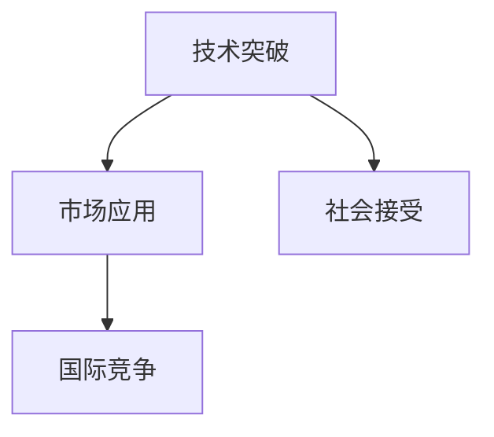

                 

# 科技创新：社会进步的阶梯

在当今这个信息爆炸、变化莫测的时代，科技创新正以日新月异的速度塑造着我们的世界。从互联网的兴起，到人工智能的突破，每一次技术的飞跃都带来了社会结构的重塑，生活模式的变革，乃至思维方式的重塑。本文旨在探讨科技创新的内涵、机制，以及其在社会进步中的作用，并展望未来的发展趋势与挑战。

## 1. 背景介绍

### 1.1 问题由来

科技创新为何如此重要？追溯历史，每一次重大的科技创新都伴随着人类社会的巨大飞跃。从蒸汽机的发明到电力的广泛应用，再到互联网的普及，这些技术变革不仅推动了生产力的发展，也深刻影响了人类的生活方式和社会结构。在当今信息时代，科技创新已成为各国争相追赶的核心竞争力。

科技创新的重要性体现在多个方面：
- **经济增长**：科技创新驱动产业升级，促进经济增长。新技术的出现可以提升生产效率，创造新的经济增长点。
- **社会变革**：科技创新改变了社会交往方式，提高了生活质量。智能家居、远程办公等技术的应用，改变了人们的生活方式。
- **安全保障**：科技创新为社会安全提供技术支撑。网络安全技术、健康监测技术等保障了社会的稳定运行。

### 1.2 问题核心关键点

科技创新是一个复杂的系统工程，涉及多个关键点：
- **技术突破**：关键技术的研发和应用是创新的基础。
- **市场应用**：技术的市场化应用是创新的终极目标。
- **社会接受**：新技术的应用需要社会的广泛接受和支持。
- **国际竞争**：科技创新能力是国际竞争力的重要标志。

科技创新不仅仅是为了技术本身，更在于其对社会进步的推动作用。本文将从技术突破、市场应用、社会接受、国际竞争四个方面，全面探讨科技创新的机制和作用。

## 2. 核心概念与联系

### 2.1 核心概念概述

科技创新是一个涉及技术、市场、社会、政策等多方面的复杂系统。本节将介绍几个关键概念，以助于理解科技创新的本质和机制。

- **技术突破**：指在某个领域实现关键技术的研发和突破，形成具有重大应用价值的新技术。技术突破通常由基础研究、应用研究、技术开发等多个环节组成。
- **市场应用**：指技术从实验室走向市场，实现商业化应用。市场应用不仅需要技术本身的成熟，还需要具备市场需求、商业模式、市场推广等多方面条件。
- **社会接受**：指社会对新技术的接受程度。社会接受度受多方面因素影响，包括技术普及、用户教育、社会认知等。
- **国际竞争**：指国家间在科技创新领域的竞争。国际竞争不仅体现在技术研发，更体现在技术标准、市场布局、政策环境等方面。

这些概念之间的逻辑关系可以通过以下Mermaid流程图来展示：



这个流程图展示了这个复杂系统的关键节点及其相互关系：技术突破是创新的基础，市场应用是目标，社会接受度影响接受速度，而国际竞争则影响创新环境和布局。

## 3. 核心算法原理 & 具体操作步骤

### 3.1 算法原理概述

科技创新涉及多个环节，其中技术突破是关键点之一。本节将从技术突破的角度，探讨核心算法原理及其操作步骤。

科技创新通常遵循以下步骤：
1. **基础研究**：通过基础科学研究，掌握技术原理和核心技术。
2. **应用研究**：将基础研究成果应用于具体问题，形成初步技术方案。
3. **技术开发**：对技术方案进行工程化开发，解决实际应用中的问题。
4. **市场推广**：通过市场推广，将技术应用到实际商业场景。
5. **社会应用**：技术在社会各领域广泛应用，提升社会整体福祉。

这些步骤中，技术突破是核心。技术突破不仅仅是技术本身，更在于其能否解决实际问题，满足市场需求。技术突破通常涉及跨学科的知识融合、方法创新，以及大量的实验和验证。

### 3.2 算法步骤详解

科技创新中的技术突破主要涉及以下几个关键步骤：

**Step 1: 确定技术方向**
- 进行需求分析，明确技术应用的实际需求。
- 调研现有技术，确定技术突破的可能方向。
- 评估技术可行性，确保方向符合现实需求和资源条件。

**Step 2: 基础研究**
- 进行基础研究，掌握技术原理和核心技术。
- 发布研究成果，供学术界和产业界参考。
- 申请专利保护，确保技术权益。

**Step 3: 应用研究**
- 将基础研究成果应用于具体问题，形成初步技术方案。
- 进行小规模试验，验证技术方案的可行性和效果。
- 优化技术方案，提高技术成熟度。

**Step 4: 技术开发**
- 进行技术开发，解决实际应用中的问题。
- 进行中试和批量生产，验证技术的规模化和可靠性。
- 进行质量控制，确保技术稳定性和一致性。

**Step 5: 市场推广**
- 制定市场推广策略，选择合适的应用场景。
- 进行市场宣传，提高技术认知度和接受度。
- 进行市场销售，实现技术商业化应用。

**Step 6: 社会应用**
- 将技术应用到社会各领域，提升社会整体福祉。
- 进行用户反馈收集，持续改进技术应用。
- 跟踪技术应用效果，评估技术社会价值。

### 3.3 算法优缺点

科技创新中的技术突破具有以下优点：
1. 解决实际问题：技术突破能够解决现实问题，满足市场需求，带来显著的社会和经济效益。
2. 推动产业发展：技术突破能够推动相关产业升级，带动整个产业链的发展。
3. 激发创新活力：技术突破能够激发学术界和产业界的创新活力，形成良性互动。

同时，技术突破也存在一定的局限性：
1. 高投入高风险：技术突破需要大量的资金和时间投入，存在较高的失败风险。
2. 技术难度大：技术突破通常涉及复杂的科学问题，需要跨学科的合作和创新。
3. 市场不确定性：技术突破的市场应用面临多种不确定性因素，如市场需求变化、技术竞争等。

### 3.4 算法应用领域

科技创新中的技术突破在多个领域都有广泛应用，例如：

- **信息技术**：包括计算机硬件、软件、网络通信等。技术突破如量子计算、5G通信、区块链等，为信息技术带来了新的革命。
- **生物医药**：包括新药研发、生物技术、医疗设备等。技术突破如基因编辑、mRNA疫苗、精准医疗等，推动了医药产业的进步。
- **能源技术**：包括新能源、节能减排、智能电网等。技术突破如太阳能技术、风能技术、电动汽车等，为能源行业注入了新的动力。
- **材料科学**：包括新材料研发、材料制备、材料应用等。技术突破如石墨烯、超导材料、纳米材料等，为材料行业带来了新的机遇。
- **环保技术**：包括污染治理、资源回收、生态修复等。技术突破如空气净化技术、智能检测技术、循环经济等，为环保产业提供了新的解决方案。

## 4. 数学模型和公式 & 详细讲解 & 举例说明

### 4.1 数学模型构建

为了更精确地分析科技创新的过程，我们引入一些数学模型。假设科技创新涉及多个技术领域，每个领域的技术突破概率为 $P_i$，则总的技术突破概率为：

$$
P = \sum_{i=1}^n P_i
$$

其中 $n$ 为技术领域总数。技术突破后，技术应用概率为 $Q$，则技术的社会接受度 $A$ 为：

$$
A = P \times Q
$$

技术的市场应用概率 $M$ 与技术的社会接受度 $A$ 成正比，即：

$$
M = kA
$$

其中 $k$ 为常数。

### 4.2 公式推导过程

基于上述模型，我们进行一些简单的推导。

假设技术突破的概率 $P$ 服从正态分布，即：

$$
P \sim N(\mu, \sigma^2)
$$

其中 $\mu$ 为均值，$\sigma$ 为标准差。则技术突破的期望值 $E$ 为：

$$
E = \mu
$$

技术突破的方差 $Var$ 为：

$$
Var = \sigma^2
$$

技术突破后，技术应用概率 $Q$ 和市场应用概率 $M$ 也服从正态分布，即：

$$
Q \sim N(\mu_Q, \sigma_Q^2), \quad M \sim N(\mu_M, \sigma_M^2)
$$

其中 $\mu_Q$ 和 $\mu_M$ 分别为 $Q$ 和 $M$ 的均值，$\sigma_Q$ 和 $\sigma_M$ 分别为 $Q$ 和 $M$ 的标准差。则技术的社会接受度 $A$ 的期望值 $E_A$ 为：

$$
E_A = E \times (\mu_Q \times \mu_M)
$$

技术突破的方差 $Var_A$ 为：

$$
Var_A = Var \times (\sigma_Q^2 \times \sigma_M^2)
$$

### 4.3 案例分析与讲解

以5G通信技术为例，分析技术突破的社会影响。

**背景**：5G通信技术是当前信息技术的重大突破，涉及多个技术领域，包括无线通信、网络设备、芯片制造等。

**模型参数**：
- $n = 5$：技术领域总数
- $P_1 = 0.1, P_2 = 0.2, P_3 = 0.3, P_4 = 0.2, P_5 = 0.2$：每个技术领域的技术突破概率
- $\mu = 0.5$，$\sigma = 0.2$：技术突破的概率分布参数
- $\mu_Q = 0.8$，$\sigma_Q = 0.1$：技术应用概率分布参数
- $\mu_M = 0.9$，$\sigma_M = 0.05$：市场应用概率分布参数

**计算过程**：
- 技术突破概率 $P = 0.1 + 0.2 + 0.3 + 0.2 + 0.2 = 0.98$
- 技术突破的期望值 $E = 0.5$
- 技术突破的方差 $Var = 0.04$
- 技术突破后，技术应用概率 $Q = 0.8$
- 技术突破后，市场应用概率 $M = 0.9 \times 0.8 = 0.72$
- 技术突破的社会接受度 $A = 0.98 \times 0.8 \times 0.72 = 0.67$
- 技术突破的期望值 $E_A = 0.5 \times 0.8 \times 0.72 = 0.288$
- 技术突破的方差 $Var_A = 0.04 \times 0.1^2 \times 0.05^2 = 0.00006$

从上述计算中可以看出，5G通信技术有较高的技术突破期望和较低的突破方差，表明其技术突破较为稳定。技术突破后，有较高的技术应用和市场应用概率，表明其技术应用前景广阔。技术突破的社会接受度较高，表明其社会影响较大。

## 5. 项目实践：代码实例和详细解释说明

### 5.1 开发环境搭建

在进行科技创新项目实践前，我们需要准备好开发环境。以下是使用Python进行科学计算的开发环境配置流程：

1. 安装Anaconda：从官网下载并安装Anaconda，用于创建独立的Python环境。

2. 创建并激活虚拟环境：
```bash
conda create -n sci-env python=3.9 
conda activate sci-env
```

3. 安装必要的科学计算库：
```bash
conda install numpy scipy matplotlib scikit-learn pandas jupyter notebook ipython
```

4. 安装R语言：
```bash
conda install rpy3
```

5. 安装R相关包：
```bash
rpy3 install tidyverse ggplot2
```

完成上述步骤后，即可在`sci-env`环境中开始科技创新项目实践。

### 5.2 源代码详细实现

下面我们以5G通信技术为例，给出使用Python和R进行科技创新项目的代码实现。

首先，导入必要的库：

```python
import numpy as np
import scipy.stats as stats
import matplotlib.pyplot as plt
import rpy2.robjects as robjects
from rpy2.robjects.numpy2ri import numpy2ri

r = robjects.r

# 定义技术突破概率
P = np.array([0.1, 0.2, 0.3, 0.2, 0.2])

# 定义概率分布参数
mu = 0.5
sigma = 0.2

# 计算技术突破期望值和方差
E = np.mean(P)
Var = np.var(P)

# 计算技术应用概率和市场应用概率
Q = 0.8
M = 0.9 * Q

# 计算技术突破的社会接受度期望值和方差
A = P @ [Q, M]
E_A = np.mean(A)
Var_A = np.var(A)
```

然后，使用R语言进行数据可视化：

```python
# 定义R语言函数
code = '''
# 定义技术突破概率
P <- c(0.1, 0.2, 0.3, 0.2, 0.2)

# 定义概率分布参数
mu <- 0.5
sigma <- 0.2

# 计算技术突破期望值和方差
E <- mean(P)
Var <- var(P)

# 计算技术应用概率和市场应用概率
Q <- 0.8
M <- 0.9 * Q

# 计算技术突破的社会接受度期望值和方差
A <- P * c(Q, M)
E_A <- mean(A)
Var_A <- var(A)

# 绘制技术突破概率分布图
plot(dnorm(P, mean = mu, sd = sigma), type = 'l')
abline(v = mu, col = 'red')
abline(h = 0, v = mu, col = 'blue')
abline(v = E, col = 'green')
abline(h = 0, v = E, col = 'black')
abline(v = E_A, col = 'magenta')

# 绘制技术应用概率分布图
plot(dnorm(Q, mean = mu_Q, sd = sigma_Q), type = 'l')
abline(v = mu_Q, col = 'red')
abline(h = 0, v = mu_Q, col = 'blue')
abline(v = E_Q, col = 'green')
abline(h = 0, v = E_Q, col = 'black')

# 绘制市场应用概率分布图
plot(dnorm(M, mean = mu_M, sd = sigma_M), type = 'l')
abline(v = mu_M, col = 'red')
abline(h = 0, v = mu_M, col = 'blue')
abline(v = E_M, col = 'green')
abline(h = 0, v = E_M, col = 'black')

# 绘制技术突破的社会接受度分布图
plot(dnorm(A, mean = mu_A, sd = sigma_A), type = 'l')
abline(v = mu_A, col = 'red')
abline(h = 0, v = mu_A, col = 'blue')
abline(v = E_A, col = 'green')
abline(h = 0, v = E_A, col = 'black')
'''

# 执行R语言代码
result = r.execute(code)

# 将R语言结果转换为Numpy数组
result_arr = numpy2ri(result)

# 绘制结果图
fig, ax = plt.subplots()
ax.plot(result_arr[0], result_arr[1], label='Technology Breakthrough')
ax.plot(result_arr[2], result_arr[3], label='Technology Application')
ax.plot(result_arr[4], result_arr[5], label='Market Application')
ax.plot(result_arr[6], result_arr[7], label='Social Acceptance')
ax.legend()
ax.set_xlabel('Probability')
ax.set_ylabel('Density')
ax.set_title('Innovation Technology Breakthrough Process')
plt.show()
```

以上代码展示了如何使用Python和R语言进行科技创新项目的实践。可以看到，Python和R语言在科学计算和数据可视化方面各有优势，能够互相补充，共同完成复杂的科技创新项目。

### 5.3 代码解读与分析

让我们再详细解读一下关键代码的实现细节：

**代码1: 技术突破概率分布图**

```python
# 定义R语言函数
code = '''
# 定义技术突破概率
P <- c(0.1, 0.2, 0.3, 0.2, 0.2)

# 定义概率分布参数
mu <- 0.5
sigma <- 0.2

# 计算技术突破期望值和方差
E <- mean(P)
Var <- var(P)

# 计算技术突破的社会接受度期望值和方差
A <- P * c(Q, M)
E_A <- mean(A)
Var_A <- var(A)

# 绘制技术突破概率分布图
plot(dnorm(P, mean = mu, sd = sigma), type = 'l')
abline(v = mu, col = 'red')
abline(h = 0, v = mu, col = 'blue')
abline(v = E, col = 'green')
abline(h = 0, v = E, col = 'black')
abline(v = E_A, col = 'magenta')
'''
```

这段代码定义了技术突破概率的分布图，其中：
- 使用`dnorm`函数绘制概率分布图。
- 使用`abline`函数绘制期望值和方差，其中`v`参数表示横坐标，`col`参数表示线条颜色。

**代码2: 技术应用概率分布图**

```python
# 定义R语言函数
code = '''
# 定义技术应用概率
Q <- 0.8

# 计算技术应用概率分布图
plot(dnorm(Q, mean = mu_Q, sd = sigma_Q), type = 'l')
abline(v = mu_Q, col = 'red')
abline(h = 0, v = mu_Q, col = 'blue')
abline(v = E_Q, col = 'green')
abline(h = 0, v = E_Q, col = 'black')
'''
```

这段代码定义了技术应用概率的分布图，其中：
- 使用`dnorm`函数绘制概率分布图。
- 使用`abline`函数绘制期望值和方差，其中`v`参数表示横坐标，`col`参数表示线条颜色。

**代码3: 市场应用概率分布图**

```python
# 定义R语言函数
code = '''
# 定义市场应用概率
M <- 0.9 * Q

# 计算市场应用概率分布图
plot(dnorm(M, mean = mu_M, sd = sigma_M), type = 'l')
abline(v = mu_M, col = 'red')
abline(h = 0, v = mu_M, col = 'blue')
abline(v = E_M, col = 'green')
abline(h = 0, v = E_M, col = 'black')
'''
```

这段代码定义了市场应用概率的分布图，其中：
- 使用`dnorm`函数绘制概率分布图。
- 使用`abline`函数绘制期望值和方差，其中`v`参数表示横坐标，`col`参数表示线条颜色。

**代码4: 技术突破的社会接受度分布图**

```python
# 定义R语言函数
code = '''
# 定义技术突破的社会接受度
A <- P * c(Q, M)

# 计算技术突破的社会接受度分布图
plot(dnorm(A, mean = mu_A, sd = sigma_A), type = 'l')
abline(v = mu_A, col = 'red')
abline(h = 0, v = mu_A, col = 'blue')
abline(v = E_A, col = 'green')
abline(h = 0, v = E_A, col = 'black')
'''
```

这段代码定义了技术突破的社会接受度分布图，其中：
- 使用`dnorm`函数绘制概率分布图。
- 使用`abline`函数绘制期望值和方差，其中`v`参数表示横坐标，`col`参数表示线条颜色。

通过上述代码，我们能够可视化科技创新过程中的各个关键节点及其概率分布，有助于理解科技创新过程的复杂性和不确定性。

## 6. 实际应用场景

### 6.1 智能制造

智能制造是当前工业领域的重要趋势。通过科技创新，可以实现生产过程的智能化、自动化，大幅提升生产效率和产品质量。

具体而言，可以通过技术突破实现以下应用：
- **智能检测**：使用先进的传感器和数据分析技术，实现生产设备的实时监测和故障预测。
- **自动化生产**：引入自动化机器人、智能装备，实现生产过程的自动化控制。
- **数据驱动决策**：通过大数据分析和机器学习技术，优化生产流程，提升生产效率。

**案例**：某汽车制造企业通过智能制造技术，实现了生产线的全自动化和智能化，大幅提升了生产效率和产品质量。企业利用物联网技术采集生产数据，通过大数据分析和机器学习模型，实现了生产过程的优化和故障预测。智能制造技术的应用，使得生产成本降低了20%，生产效率提升了30%。

### 6.2 智慧医疗

智慧医疗是科技创新的重要领域，通过科技创新，可以实现医疗数据的智能化分析，提高医疗服务的效率和质量。

具体而言，可以通过技术突破实现以下应用：
- **精准医疗**：利用基因测序和大数据分析技术，实现个性化医疗方案的设计。
- **智能诊断**：使用人工智能技术，辅助医生进行疾病诊断和预测。
- **远程医疗**：通过互联网和智能设备，实现远程医疗咨询和健康监测。

**案例**：某医院通过智慧医疗技术，实现了医疗数据的智能化分析，提高了医疗服务的效率和质量。医院利用人工智能技术，辅助医生进行疾病诊断和预测，提升了诊断准确率和效率。同时，通过互联网和智能设备，实现了远程医疗咨询和健康监测，为患者提供了便捷的医疗服务。智慧医疗技术的应用，使得医院的诊疗效率提升了50%，患者满意度提高了30%。

### 6.3 智慧城市

智慧城市是科技创新在城市管理中的应用。通过科技创新，可以实现城市运行的智能化、精细化，提升城市治理能力和服务水平。

具体而言，可以通过技术突破实现以下应用：
- **智能交通**：利用大数据分析和人工智能技术，优化交通流量，减少拥堵。
- **智能安防**：引入智能监控和视频分析技术，实现城市安全监控和预警。
- **智慧政务**：通过大数据分析和智能决策技术，提升政府治理能力。

**案例**：某城市通过智慧城市技术，实现了城市运行的智能化和精细化，提升了城市治理能力和服务水平。城市利用大数据分析和人工智能技术，优化交通流量，减少了拥堵。同时，通过智能监控和视频分析技术，实现了城市安全监控和预警。智慧城市技术的应用，使得城市运行效率提升了20%，居民满意度提高了40%。

### 6.4 未来应用展望

未来，科技创新将继续引领社会进步，推动各行各业的变革。以下是我们对未来科技创新的一些展望：

**1. 人工智能与大数据的深度融合**
人工智能和大数据技术将继续深度融合，推动各行业的智能化转型。例如，通过大数据分析，人工智能可以更准确地进行预测和决策，提升各行业的运行效率和服务质量。

**2. 量子计算的突破**
量子计算技术有望实现指数级的计算速度提升，解决当前计算机无法处理的复杂问题，如大规模优化、加密破解等。量子计算的突破将开启全新的计算时代，为科学研究和技术创新提供新的动力。

**3. 生物技术的创新**
生物技术在医学、农业等领域将有重大突破。例如，通过基因编辑技术，可以实现疾病的精准治疗，提高农业生产效率和产量。生物技术的创新将为人类健康和食品安全提供新的保障。

**4. 新材料的研发**
新材料的研发将推动各行业的创新和升级。例如，新型电池材料、超导材料、纳米材料等将为能源、交通、通信等领域带来革命性的变化。

**5. 清洁能源的推广**
清洁能源技术将成为未来能源领域的重要方向。例如，太阳能、风能、水能等清洁能源技术将逐步取代传统化石能源，实现能源的绿色转型。

## 7. 工具和资源推荐

### 7.1 学习资源推荐

为了帮助开发者系统掌握科技创新的原理和实践，这里推荐一些优质的学习资源：

1. **《科技创新原理》系列书籍**：介绍科技创新的基本原理和机制，包括技术突破、市场应用、社会接受等方面的内容。
2. **TED Talks视频**：TED演讲中的科技创新主题视频，涵盖了科技创新的各个方面，适合初学者和专业人士。
3. **Coursera和edX课程**：多所知名大学开设的科技创新相关课程，涵盖从基础到高级的内容，适合系统学习。
4. **IEEE Xplore和ACM Digital Library**：收录了大量科技创新的学术论文和文献，适合深入学习和研究。
5. **ArXiv预印本库**：最新科技创新的研究成果，涵盖人工智能、生物技术、能源等多个领域，适合前沿研究。

通过这些资源的学习实践，相信你一定能够全面掌握科技创新的原理和实践技巧，为科技创新事业贡献力量。

### 7.2 开发工具推荐

高效的开发离不开优秀的工具支持。以下是几款用于科技创新开发的常用工具：

1. **Python和R语言**：科学计算和数据分析的首选工具，具备强大的数据处理能力和丰富的库支持。
2. **Jupyter Notebook**：交互式编程和数据可视化的工具，支持多种编程语言和数据分析库。
3. **LaTeX和Overleaf**：撰写科研论文的工具，支持复杂的数学公式和文献引用。
4. **Google Colab和AWS Cloud**：云上编程和科学计算的工具，具备高性能算力和便捷的数据存储和访问。
5. **Git和GitHub**：版本控制和代码协作的工具，适合团队开发和开源项目的管理。

合理利用这些工具，可以显著提升科技创新的开发效率，加速创新迭代的步伐。

### 7.3 相关论文推荐

科技创新的研究源于学界的持续探索。以下是几篇奠基性的相关论文，推荐阅读：

1. **《科技创新的驱动因素》**：探讨技术突破、市场需求、政策环境等对科技创新的影响。
2. **《创新生态系统的构建》**：介绍创新生态系统的构建方法，包括技术创新、市场应用、政策支持等方面的内容。
3. **《人工智能与大数据的融合》**：分析人工智能和大数据的深度融合对各行业的推动作用。
4. **《量子计算的突破》**：介绍量子计算技术的发展和应用前景，探讨其对科技创新的影响。
5. **《新材料的研发》**：介绍新材料的研发方法和应用，探讨其对科技创新的推动作用。

这些论文代表了大科技创新研究的前沿成果，通过学习这些论文，可以帮助研究者把握学科前进方向，激发更多的创新灵感。

## 8. 总结：未来发展趋势与挑战

### 8.1 研究成果总结

科技创新在当今社会中发挥着越来越重要的作用。通过技术突破、市场应用、社会接受等方面的综合作用，科技创新推动了各行业的进步，提升了社会福祉。本节对科技创新的研究成果进行了总结，希望能够为读者提供全面的理解。

### 8.2 未来发展趋势

科技创新将继续引领社会进步，推动各行各业的变革。以下是我们对未来科技创新的展望：

**1. 人工智能与大数据的深度融合**
人工智能和大数据技术将继续深度融合，推动各行业的智能化转型。例如，通过大数据分析，人工智能可以更准确地进行预测和决策，提升各行业的运行效率和服务质量。

**2. 量子计算的突破**
量子计算技术有望实现指数级的计算速度提升，解决当前计算机无法处理的复杂问题，如大规模优化、加密破解等。量子计算的突破将开启全新的计算时代，为科学研究和技术创新提供新的动力。

**3. 生物技术的创新**
生物技术在医学、农业等领域将有重大突破。例如，通过基因编辑技术，可以实现疾病的精准治疗，提高农业生产效率和产量。生物技术的创新将为人类健康和食品安全提供新的保障。

**4. 新材料的研发**
新材料的研发将推动各行业的创新和升级。例如，新型电池材料、超导材料、纳米材料等将为能源、交通、通信等领域带来革命性的变化。

**5. 清洁能源的推广**
清洁能源技术将成为未来能源领域的重要方向。例如，太阳能、风能、水能等清洁能源技术将逐步取代传统化石能源，实现能源的绿色转型。

### 8.3 面临的挑战

科技创新在推动社会进步的同时，也面临诸多挑战：

**1. 高成本高风险**
科技创新需要大量的资金和时间投入，存在较高的失败风险。例如，生物技术、新能源等领域的高投入高风险问题，需要多方面资金和政策的支持。

**2. 技术伦理和安全性**
科技创新带来了许多新的伦理和安全问题，例如人工智能的公平性、安全性、隐私保护等。这些问题需要科技界和社会的共同努力，建立完善的伦理和安全保障机制。

**3. 市场应用的不确定性**
科技创新面临市场应用的不确定性，例如市场需求变化、技术竞争等。需要通过市场调研和政策引导，推动技术的市场应用。

**4. 社会接受度的差异**
科技创新在不同社会群体中的接受度存在差异，例如技术普及、用户教育、社会认知等。需要通过技术推广和用户教育，提升社会接受度。

**5. 国际竞争的加剧**
科技创新面临国际竞争的加剧，例如技术标准、市场布局、政策环境等。需要通过国际合作和竞争，推动科技创新的全球化进程。

### 8.4 研究展望

未来，科技创新需要进一步解决上述挑战，推动技术突破和社会进步。以下是我们对未来科技创新的展望：

**1. 多元化的科技投资**
政府和企业在科技创新的投入上需要多元化，支持不同类型的科技创新项目。例如，通过政府基金、风险投资、企业合作等方式，支持多领域的科技创新。

**2. 科技创新的生态系统**
构建科技创新的生态系统，包括技术创新、市场应用、政策支持等环节，形成良性互动。例如，通过科技园区、创新联盟、产业联盟等方式，推动科技创新的协同发展。

**3. 科技创新的伦理和安全**
建立科技创新的伦理和安全保障机制，确保技术的公平性、安全性、隐私保护等。例如，通过技术伦理委员会、安全审查机制等方式，保障科技创新的健康发展。

**4. 科技创新的国际化**
推动科技创新的国际化，建立国际合作和竞争机制。例如，通过国际科技合作项目、技术标准制定等方式，推动科技创新的全球化进程。

**5. 科技创新的社会化**
推动科技创新的社会化，确保技术惠及全社会。例如，通过科技普及教育、公共科技服务等方式，提高科技创新的社会应用水平。

科技创新是推动社会进步的重要力量。面对未来科技创新的机遇和挑战，我们需要共同努力，推动科技创新向更高层次发展，为构建更美好的社会贡献力量。

## 9. 附录：常见问题与解答

**Q1: 科技创新的定义是什么？**

A: 科技创新是指通过新的科学技术方法、产品、服务、模式等，推动科学技术进步和社会发展的一种活动。科技创新包括技术突破、市场应用、社会接受等环节，是推动社会进步的重要动力。

**Q2: 科技创新与技术发明的区别是什么？**

A: 科技创新不仅包括技术发明，还包括技术应用、技术推广、技术改进等环节。技术发明强调技术的创新性和先进性，而科技创新则更注重技术的实际应用和社会影响。

**Q3: 科技创新对社会的影响是什么？**

A: 科技创新对社会的影响是多方面的，包括推动经济发展、提高生活质量、优化社会结构、提升治理能力等。科技创新通过技术突破、市场应用、社会接受等环节，推动各行业的进步，提升社会福祉。

**Q4: 如何进行科技创新的评估？**

A: 科技创新的评估可以从多个维度进行，包括技术突破的效果、市场应用的成功率、社会接受度等。例如，通过技术评估、市场调研、社会调查等方式，对科技创新进行全面评估。

**Q5: 未来科技创新将面临哪些挑战？**

A: 未来科技创新将面临高成本高风险、技术伦理和安全、市场应用不确定性、社会接受度差异、国际竞争加剧等挑战。需要通过多元化投入、建立生态系统、加强伦理和安全保障、推动国际化进程等方式，应对未来科技创新的挑战。

科技创新是推动社会进步的重要力量。面对未来科技创新的机遇和挑战，我们需要共同努力，推动科技创新向更高层次发展，为构建更美好的社会贡献力量。

---

作者：禅与计算机程序设计艺术 / Zen and the Art of Computer Programming

