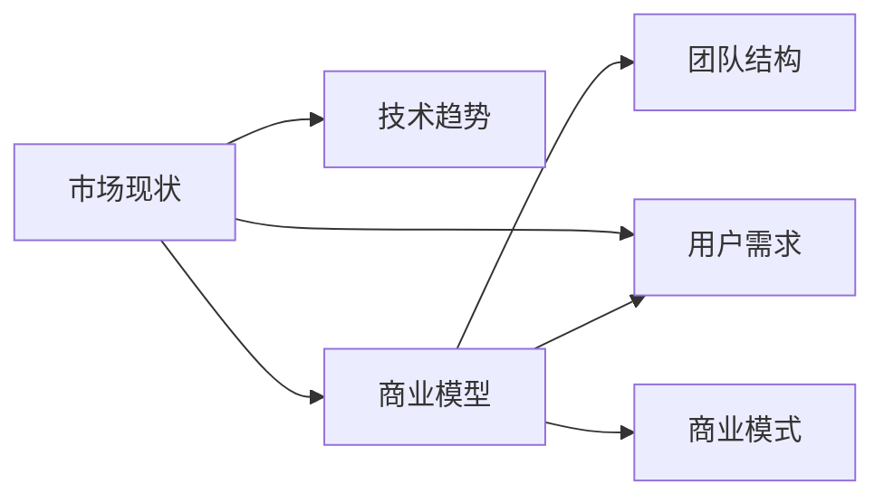

                 

# 程序员如何评估早期创业机会

## 1. 背景介绍

在创业的浪潮中，很多程序员因为技术热情和梦想，投身于创业，但并非所有人都能成功。事实上，成功的创业者往往具备超越技术视野的商业洞察力和综合能力。本文章将深入探讨程序员在早期创业机会评估过程中，需要注意的若干关键要素。

### 1.1 市场现状

首先，程序员需要了解所处市场的现状和趋势。包括但不限于市场规模、增长率、细分领域内的主要竞争者、潜在的替代品或技术演变等。这些信息往往决定了市场是否存在足够的空间和机会。

### 1.2 技术趋势

其次，技术趋势和自身技术实力也是关键考量因素。创业者需分析行业内技术发展动态，评估自身的技术优势和创新性。同时，应关注新兴技术，把握潜在的技术演进带来的机会。

### 1.3 商业模型

商业模型的选择和设计也是评估早期创业机会的重要环节。如何通过产品或服务实现盈利，如何获取和维护客户，如何扩展市场等，都是值得深入思考的问题。

### 1.4 团队结构

团队的组成和协作效率也是创业成功的关键。团队成员的能力和经验，是否具有多样性，是否能够互补，是否具有激情和执行力，都直接影响到创业项目的成功率。

## 2. 核心概念与联系

### 2.1 核心概念概述

为了更好地评估早期创业机会，需要理解几个核心概念：

- **市场需求**：市场对某种产品或服务的需求量，直接影响商业潜力和盈利空间。
- **技术壁垒**：一种或多种技术能力，确保竞争优势。
- **商业模式**：产品或服务如何实现价值交换的机制。
- **团队资源**：团队成员的专业技能、经验和市场认知。
- **用户需求**：最终用户对产品或服务的期望和要求。

通过这些概念，可以对早期创业机会进行全方位的评估。

### 2.2 核心概念之间的联系

市场现状、技术趋势、商业模型、团队结构和用户需求之间的关系可以通过以下Mermaid流程图来展示：



这个流程图展示了这些核心概念之间的相互依赖关系。市场现状决定了技术趋势和用户需求，而技术趋势和用户需求又影响了商业模型的设计，同时，商业模型和用户需求也需要团队的资源和能力来支撑。

## 3. 核心算法原理 & 具体操作步骤

### 3.1 算法原理概述

早期创业机会的评估，实际上是一种多维度、多变量分析的过程。该过程可以简化为以下几个步骤：

1. 收集和分析市场数据。
2. 识别潜在的技术突破。
3. 设计可行的商业模式。
4. 评估团队资源和能力。
5. 满足用户需求。

这些步骤通过一系列算法和计算模型来完成，如回归分析、分类算法、聚类分析等。

### 3.2 算法步骤详解

#### 3.2.1 收集和分析市场数据

- **步骤1: 获取市场数据**
  - 利用公开的行业报告和统计数据，如政府发布的经济数据、行业协会报告等。
  - 进行市场调研，通过问卷调查、焦点小组等手段获取一手数据。
  - 分析竞争对手的商业模式和市场表现。

- **步骤2: 数据清洗与预处理**
  - 剔除噪音数据和异常值。
  - 处理缺失值和重复数据。
  - 将数据标准化，便于后续分析。

- **步骤3: 数据分析与建模**
  - 使用回归分析评估市场需求大小。
  - 利用聚类分析识别市场细分和潜在用户群体。
  - 应用分类算法评估市场增长率。

#### 3.2.2 识别潜在的技术突破

- **步骤1: 技术趋势分析**
  - 跟踪最新的技术动态和研究论文，了解最新的技术突破。
  - 分析技术趋势对现有市场和未来的影响。
  - 评估自身技术团队的技术实力和创新能力。

- **步骤2: 技术成熟度评估**
  - 通过技术评估工具，如Gartner技术成熟度曲线，评估技术的发展阶段和应用潜力。
  - 评估现有技术的可行性和未来发展方向。

#### 3.2.3 设计可行的商业模式

- **步骤1: 商业模式设计**
  - 定义产品的价值主张和核心竞争力。
  - 设计清晰的收益模式，如订阅制、广告收入、交易手续费等。
  - 考虑成本结构和盈利预测。

- **步骤2: 市场定位**
  - 确定目标市场和用户群体。
  - 进行市场细分，识别特定的用户需求。
  - 评估竞争力和市场占有率。

#### 3.2.4 评估团队资源和能力

- **步骤1: 团队评估**
  - 分析团队成员的专业背景、经验和技能。
  - 评估团队协作和沟通能力。
  - 评估团队文化和执行力。

- **步骤2: 资源配置**
  - 确定项目所需的关键技术和资源。
  - 分析资源获取和利用效率。
  - 规划团队扩展和人才培养。

#### 3.2.5 满足用户需求

- **步骤1: 用户需求分析**
  - 收集用户反馈和需求。
  - 进行用户行为分析和心理模型构建。
  - 识别关键需求和痛点。

- **步骤2: 用户期望管理**
  - 制定用户期望管理策略。
  - 定期收集和反馈用户反馈。
  - 迭代产品，持续改进用户体验。

### 3.3 算法优缺点

#### 3.3.1 优点

- **快速决策**：通过系统化的数据分析和模型评估，可以高效地进行早期创业机会的评估。
- **客观性**：算法和模型可以减少主观判断，提升决策的客观性。
- **可重复性**：评估方法可以多次使用，确保评估结果的稳定性和可靠性。

#### 3.3.2 缺点

- **数据依赖**：模型的评估结果高度依赖于数据的质量和全面性。
- **复杂性**：分析过程涉及多变量和复杂的计算，需要较高专业背景。
- **缺乏灵活性**：算法和模型往往无法适应特定场景的特殊需求。

### 3.4 算法应用领域

早期创业机会评估算法可以广泛应用于多个领域，包括但不限于：

- **科技创业**：评估技术趋势、市场需求和商业模式，寻找投资机会。
- **金融创业**：评估市场规模和竞争环境，优化金融产品和服务。
- **医疗创业**：评估市场需求和用户痛点，开发创新医疗解决方案。
- **教育创业**：评估市场需求和用户行为，优化教育产品和模式。

## 4. 数学模型和公式 & 详细讲解 & 举例说明

### 4.1 数学模型构建

在早期创业机会评估中，常用的数学模型包括回归分析、分类算法和聚类分析。下面以回归分析为例进行说明。

假设市场规模为 $M$，市场需求增长率为 $R$，技术成熟度为 $T$。

**回归模型**：

$$
Y = \beta_0 + \beta_1M + \beta_2R + \beta_3T + \epsilon
$$

其中，$Y$ 表示潜在的市场机会；$\beta_0$ 为截距；$\beta_1$、$\beta_2$ 和 $\beta_3$ 为市场规模、市场需求增长率和技术成熟度对市场机会的影响系数；$\epsilon$ 为随机误差项。

### 4.2 公式推导过程

根据回归分析的原理，$Y$ 可以表示为：

$$
Y = \sum_{i=1}^k \beta_iX_i + \epsilon
$$

其中 $X_i$ 为自变量，$k$ 为自变量的个数。

应用最小二乘法求解 $\beta_i$：

$$
\beta_i = \frac{\sum_{i=1}^k \sum_{j=1}^k X_i X_j}{\sum_{i=1}^k \sum_{j=1}^k (X_i - \bar{X})^2} (\bar{Y} - \bar{X})
$$

其中 $\bar{X}$ 和 $\bar{Y}$ 分别为自变量和因变量的平均值。

### 4.3 案例分析与讲解

**案例1: 科技创业**

假设市场规模 $M = 100$ 亿美元，市场需求增长率 $R = 10\%$，技术成熟度 $T = 0.8$。

代入回归模型得：

$$
Y = \beta_0 + 100\beta_1 + 10\beta_2 + 0.8\beta_3 + \epsilon
$$

通过回归分析，计算得到市场机会 $Y = 14.4$ 亿美元。

**案例2: 医疗创业**

假设市场需求增长率 $R = 5\%$，技术成熟度 $T = 0.6$。

代入回归模型得：

$$
Y = \beta_0 + 0\beta_1 + 5\beta_2 + 0.6\beta_3 + \epsilon
$$

通过回归分析，计算得到市场机会 $Y = 4.2$ 亿美元。

## 5. 项目实践：代码实例和详细解释说明

### 5.1 开发环境搭建

- **步骤1: 安装Python和相关库**
  - 安装Python 3.6或以上版本。
  - 使用pip安装 Pandas、NumPy、SciPy、Scikit-learn、Matplotlib等库。

- **步骤2: 数据准备**
  - 收集市场数据，如市场规模、市场需求增长率、技术成熟度等。
  - 进行数据清洗和预处理。

- **步骤3: 搭建开发环境**
  - 使用Jupyter Notebook或其他Python交互环境。
  - 配置好开发环境，准备好数据和模型。

### 5.2 源代码详细实现

以下是一个简单的回归分析实现：

```python
import pandas as pd
from sklearn.linear_model import LinearRegression
from sklearn.model_selection import train_test_split
from sklearn.metrics import mean_squared_error

# 准备数据
data = pd.read_csv('market_data.csv')

# 选择自变量和因变量
X = data[['market_size', 'growth_rate', 'maturity_level']]
y = data['opportunity']

# 划分训练集和测试集
X_train, X_test, y_train, y_test = train_test_split(X, y, test_size=0.2, random_state=42)

# 模型训练
model = LinearRegression()
model.fit(X_train, y_train)

# 模型预测
y_pred = model.predict(X_test)

# 评估模型性能
rmse = mean_squared_error(y_test, y_pred, squared=False)
print(f"RMSE: {rmse:.2f}")
```

### 5.3 代码解读与分析

在上述代码中，首先使用pandas库读取数据，然后通过sklearn库的LinearRegression模型进行回归分析。代码中包含了数据准备、模型训练、模型预测和模型评估等关键步骤。通过RMSE（均方根误差）评估模型的预测准确度。

## 6. 实际应用场景

### 6.1 金融科技

在金融科技领域，早期创业机会评估涉及多方面数据，如市场需求、用户行为、技术趋势等。通过评估不同维度的数据，可以优化金融产品和服务，提升用户体验和满意度。

### 6.2 医疗健康

医疗健康领域的创业机会评估需要深入了解市场需求、用户痛点和技术趋势。通过评估不同维度数据，可以开发创新医疗解决方案，提升医疗服务质量和效率。

### 6.3 教育科技

教育科技领域的创业机会评估需要关注市场需求、用户行为和教育效果。通过评估不同维度数据，可以优化教育产品和模式，提升教育质量和效果。

### 6.4 未来应用展望

随着大数据和人工智能技术的发展，早期创业机会评估的精度和效率将不断提高。未来可能出现更多先进的算法和技术，如深度学习、强化学习、多模态数据分析等，进一步提升评估能力。

## 7. 工具和资源推荐

### 7.1 学习资源推荐

- **《Python数据分析实战》**
  - 书籍内容全面，涵盖了数据分析的各个方面，包括Pandas、NumPy、Matplotlib等库的使用。

- **《机器学习实战》**
  - 介绍了各种机器学习算法和实际应用案例，适合初学者和实战操作。

### 7.2 开发工具推荐

- **Jupyter Notebook**
  - 支持Python代码交互式编写和执行，可视化展示结果。

- **PyCharm**
  - 支持Python开发和调试，提供丰富的插件和库管理功能。

### 7.3 相关论文推荐

- **《回归分析基础与实践》**
  - 详细介绍了回归分析的原理和应用，适合深入学习。

- **《Python数据分析与可视化实战》**
  - 介绍了数据分析和可视化的常用方法和工具，适合实战操作。

## 8. 总结：未来发展趋势与挑战

### 8.1 研究成果总结

早期创业机会评估的研究已经取得了一定的成果，初步建立了多维数据分析和建模的框架。目前，评估模型的精度和可靠性在不断提升，但仍需进一步改进。

### 8.2 未来发展趋势

未来早期创业机会评估将呈现以下几个发展趋势：

- **数据驱动决策**：随着大数据技术的发展，数据将越来越成为决策的重要依据。
- **人工智能应用**：深度学习、强化学习等算法将进一步提升评估精度。
- **跨领域融合**：多模态数据分析和融合技术将广泛应用于创业机会评估。

### 8.3 面临的挑战

- **数据质量问题**：数据的准确性和全面性直接影响评估结果。
- **技术复杂性**：多变量数据分析和建模涉及复杂的计算和模型选择。
- **应用多样性**：不同领域和场景下的评估方法可能存在差异。

### 8.4 研究展望

未来研究需从以下几个方面进行探索：

- **提升数据质量**：建立高质量的数据获取和清洗流程。
- **优化算法模型**：开发高效、精确的评估算法。
- **模型应用普及**：推动评估模型在更多领域的应用和推广。

## 9. 附录：常见问题与解答

**Q1: 早期创业机会评估有哪些关键要素？**

A: 早期创业机会评估的关键要素包括市场需求、技术趋势、商业模型、团队资源和用户需求。

**Q2: 如何收集和处理数据？**

A: 通过调研、问卷调查和公开数据集等方式收集数据。数据处理包括数据清洗、去重、标准化等步骤。

**Q3: 如何评估团队资源和能力？**

A: 通过背景调查、技能评估和实战演练等方式，全面了解团队成员的专业背景和实际能力。

**Q4: 如何管理用户期望？**

A: 定期收集用户反馈，进行用户体验优化和迭代改进。同时，制定用户期望管理策略，提升用户满意度。

---

作者：禅与计算机程序设计艺术 / Zen and the Art of Computer Programming

