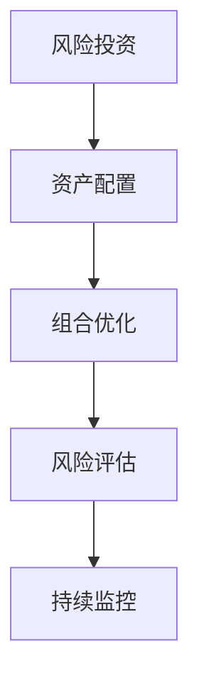

                 

# 程序员如何进行风险投资组合管理

## 1. 背景介绍

### 1.1 问题由来

在当今这个不确定的时代，风险投资组合管理成为了程序员和企业都密切关注的话题。程序员可能会在创业公司中担任技术合伙人或核心成员，负责开发关键技术产品。在这个过程中，他们往往需要参与到公司的投资决策中，尤其是风险投资组合管理。因此，程序员掌握一些基本的风险投资组合管理知识，对于提高公司的市场价值和自身职业发展都具有重要意义。

### 1.2 问题核心关键点

风险投资组合管理涉及对不同项目和领域的投资选择、资产配置和风险控制。其核心关键点包括：

- **多元化投资**：通过投资于不同行业和地区的项目，分散风险，确保投资组合的整体稳定性。
- **资产配置**：根据风险承受能力、收益预期等因素，合理分配投资资金在不同项目中的比例。
- **风险评估**：利用统计学、金融学等方法，对不同项目进行风险评估，选择低风险高收益的投资机会。
- **持续优化**：定期评估投资组合的表现，及时调整投资策略，确保投资组合长期收益最大化。

### 1.3 问题研究意义

掌握风险投资组合管理技能，可以提升程序员在创业公司中的价值，帮助公司实现稳健的资本增值。同时，这也为程序员自身提供了额外的收入来源和职业发展机会。此外，了解投资组合管理还可以提高程序员的财务意识，帮助他们更好地规划个人和家庭的财务健康。

## 2. 核心概念与联系

### 2.1 核心概念概述

为了深入理解风险投资组合管理，我们需要了解几个核心概念：

- **风险投资**：向初创企业或高增长潜力企业提供种子轮、A轮、B轮等不同阶段融资的资金。
- **资产配置**：根据投资目标和风险承受能力，将资金分配到不同资产类别（如股票、债券、房地产等）。
- **组合优化**：使用数学模型和算法，寻找最优的资产配置方案，使投资组合风险最小、收益最大。
- **风险评估**：通过分析历史数据、市场趋势和项目前景，评估投资的风险和预期收益。
- **持续监控**：定期评估投资组合的表现，及时调整投资策略，确保投资组合长期稳健增长。

这些概念之间的逻辑关系可以通过以下Mermaid流程图来展示：



这个流程图展示了风险投资组合管理的主要步骤：

1. 首先进行风险投资，选择潜力项目。
2. 然后进行资产配置，将资金分配到不同类别。
3. 接着进行组合优化，找到最优配置方案。
4. 进行风险评估，确保投资风险在可控范围内。
5. 最后进行持续监控，及时调整策略。

## 3. 核心算法原理 & 具体操作步骤

### 3.1 算法原理概述

风险投资组合管理的核心在于使用数学模型和算法，帮助投资者构建最优投资组合。其基本原理包括：

- **均值-方差模型**：通过最大化预期收益和最小化风险的标准差，找到最优投资组合。
- **马科维茨理论**：提出资产配置理论，利用协方差矩阵计算风险和收益。
- **蒙特卡洛模拟**：通过模拟不同市场条件下的投资组合表现，评估投资风险和收益。
- **Black-Litterman模型**：在贝叶斯框架下，结合市场预期和投资者信念，构建最优资产配置。

### 3.2 算法步骤详解

1. **确定投资目标**：设定投资目标（如资本增值、现金流等）和风险承受能力。
2. **选择资产类别**：选择不同类型的资产（如股票、债券、房地产等）。
3. **数据收集与处理**：收集历史市场数据和项目数据，进行预处理和清洗。
4. **构建投资组合**：使用数学模型（如均值-方差模型），构建最优投资组合。
5. **风险评估与监控**：定期评估投资组合风险和收益，进行持续监控和调整。

### 3.3 算法优缺点

**优点**：

- **系统性**：使用数学模型和算法，避免了主观判断的偏差，提高决策的科学性。
- **自动化**：通过编程实现算法，可以自动完成数据分析和投资策略调整。
- **可优化**：不断迭代和优化模型参数，提升投资组合表现。

**缺点**：

- **复杂性**：需要掌握一定的数学和金融学知识，初学者可能难以理解。
- **数据依赖**：模型的准确性高度依赖于历史数据的质量和完整性。
- **动态性**：市场环境不断变化，模型需要定期更新和调整。

### 3.4 算法应用领域

风险投资组合管理的应用领域非常广泛，涵盖金融、投资、创业等领域。具体而言：

- **投资银行**：帮助客户构建最优投资组合，实现资产增值。
- **资产管理**：管理公司或个人的资产配置，提高财务健康。
- **创业投资**：选择和投资初创公司，分散风险，获取高收益。
- **私募基金**：管理基金的资产配置和风险控制，提升基金表现。

## 4. 数学模型和公式 & 详细讲解

### 4.1 数学模型构建

风险投资组合管理的基本模型包括均值-方差模型和马科维茨理论。以均值-方差模型为例，其核心公式如下：

$$
\begin{aligned}
&\max \mathbb{E}(r) \\
&\text{subject to} \\
&\mathbb{E}(r) \in \mathcal{R}^n \\
&r \sim \mathcal{N}(\mu, \Sigma) \\
&\Sigma_{ii} > 0 \quad \forall i \\
&\Sigma_{ij} = \Sigma_{ji} \quad \forall i, j
\end{aligned}
$$

其中，$r$ 表示资产收益向量，$\mu$ 表示收益均值向量，$\Sigma$ 表示收益协方差矩阵，$n$ 表示资产类别数。

### 4.2 公式推导过程

- **均值-方差模型**：通过求解上述优化问题，得到最优资产配置向量 $w$。
- **马科维茨理论**：利用协方差矩阵 $\Sigma$，计算每个资产的风险贡献度和组合的风险水平。
- **蒙特卡洛模拟**：通过模拟市场变化，计算不同投资策略下的收益和风险。
- **Black-Litterman模型**：结合市场预期和投资者信念，更新资产配置向量。

### 4.3 案例分析与讲解

以股票和债券为例，进行组合优化。假设市场中有两种资产，股票和债券，它们的历史收益率为 $r_s = 0.08$ 和 $r_b = 0.03$，标准差为 $\sigma_s = 0.2$ 和 $\sigma_b = 0.1$。投资者希望构建一个期望收益率为 $r_t = 0.05$，风险水平为 $\sigma_t = 0.15$ 的投资组合。

假设资产之间的协方差为 $\rho = 0.5$，则协方差矩阵为：

$$
\Sigma = \begin{bmatrix}
0.04 & 0.01 \\
0.01 & 0.01
\end{bmatrix}
$$

构建均值-方差模型，求解优化问题：

$$
\begin{aligned}
&\max \mathbb{E}(r_t) = w_s r_s + w_b r_b \\
&\text{subject to} \\
&\mathbb{E}(r_t) = w_s r_s + w_b r_b \\
&\sigma_t = \sqrt{w_s^2 \sigma_s^2 + w_b^2 \sigma_b^2 + 2w_s w_b \rho \sigma_s \sigma_b} = 0.15
\end{aligned}
$$

解得 $w_s = 0.6$，$w_b = 0.4$，即股票和债券的配置比例。

## 5. 项目实践：代码实例和详细解释说明

### 5.1 开发环境搭建

要实现风险投资组合管理，首先需要搭建一个Python开发环境。推荐使用Anaconda创建虚拟环境，并安装必要的库：

```bash
conda create --name risk-investment python=3.8
conda activate risk-investment
pip install numpy pandas scipy scikit-learn
```

### 5.2 源代码详细实现

以下是一个简单的Python代码示例，用于构建均值-方差模型：

```python
import numpy as np
from scipy.optimize import minimize

def portfolio_optimization(expected_return, covariance_matrix, risk_level):
    n = len(expected_return)
    risk_constraint = risk_level**2
    
    # 构建目标函数和约束条件
    def objective(w):
        return -np.sum(w * expected_return)
    def constraint(w):
        return np.sqrt(np.dot(w, np.dot(covariance_matrix, w))) - risk_level
    
    # 求解优化问题
    result = minimize(objective, np.ones(n), constraints=[{'type': 'eq', 'fun': constraint}], method='SLSQP')
    return result.x

# 历史数据
expected_return = np.array([0.08, 0.03])
covariance_matrix = np.array([[0.04, 0.01], [0.01, 0.01]])
risk_level = 0.15

# 优化组合配置
weights = portfolio_optimization(expected_return, covariance_matrix, risk_level)
print(weights)
```

### 5.3 代码解读与分析

- **均值-方差模型**：通过求解优化问题，得到最优资产配置权重 $w$。
- **约束条件**：确保投资组合的风险水平不超过预设值 $risk_level$。
- **求解方法**：使用scipy库的`minimize`函数，进行优化求解。

### 5.4 运行结果展示

运行上述代码，输出最优资产配置权重为 $w_s = 0.6$，$w_b = 0.4$，即股票和债券的配置比例。

## 6. 实际应用场景

### 6.1 投资银行

投资银行在为高净值客户提供投资咨询服务时，可以使用风险投资组合管理模型，帮助客户构建最优投资组合，分散风险，实现资产增值。

### 6.2 资产管理

资产管理公司可以基于风险投资组合管理模型，为公司或个人的资产配置提供决策支持，优化投资组合表现。

### 6.3 创业投资

创业投资基金可以利用风险投资组合管理模型，选择和投资不同阶段的高增长潜力企业，分散投资风险，获取高收益。

### 6.4 私募基金

私募基金管理人可以使用风险投资组合管理模型，优化基金的资产配置，提高基金表现，为投资者提供稳定的收益。

## 7. 工具和资源推荐

### 7.1 学习资源推荐

- **《Python for Finance》**：由Yves Hilpisch所著，详细介绍了Python在金融领域的应用，包括风险投资组合管理。
- **Coursera的《金融工程与投资组合管理》课程**：由Wharton Business School教授授课，系统讲解金融工程和投资组合管理的理论和实践。
- **Kaggle的金融和投资数据集**：可以用于数据处理和模型训练，帮助理解金融数据的特点和规律。

### 7.2 开发工具推荐

- **Anaconda**：Python的集成开发环境，提供了科学计算和数据分析的便利工具。
- **Scipy**：提供科学计算和数据分析的函数库，包括优化、统计等。
- **Pandas**：提供了高效的数据处理和分析工具，适用于大规模金融数据处理。

### 7.3 相关论文推荐

- **《A Comparison of Historical Simulation and Monte Carlo Simulation Methods》**：详细比较了历史模拟和蒙特卡洛模拟方法在风险管理中的应用。
- **《Portfolio Optimization: A Comprehensive Review》**：对风险投资组合管理中的各类模型进行了系统的回顾和比较。
- **《Machine Learning for Asset Allocation》**：介绍了机器学习在资产配置中的应用，包括数据预处理和模型训练。

## 8. 总结：未来发展趋势与挑战

### 8.1 研究成果总结

风险投资组合管理作为金融学和投资学的重要分支，近年来得到了广泛的研究和应用。主要研究成果包括：

- **模型优化**：不断优化和改进均值-方差模型、蒙特卡洛模拟等基本模型，提高投资组合的性能。
- **机器学习应用**：引入机器学习算法，如随机森林、神经网络等，提升投资决策的精准性。
- **多目标优化**：引入多目标优化方法，考虑收益、风险、流动性等多个目标，构建更加稳健的投资组合。

### 8.2 未来发展趋势

未来，风险投资组合管理将呈现以下几个发展趋势：

- **智能算法**：引入深度学习、强化学习等智能算法，提高投资组合的自动化和智能化水平。
- **区块链应用**：利用区块链技术，实现透明和安全的投资交易。
- **大数据分析**：利用大数据分析技术，实时监控市场动态，优化投资策略。
- **绿色投资**：结合环境、社会和治理（ESG）因素，进行绿色投资和可持续发展。

### 8.3 面临的挑战

尽管风险投资组合管理取得了显著进展，但仍面临一些挑战：

- **数据获取困难**：高质量的历史数据和实时数据获取成本高昂。
- **模型复杂性**：高维数据和复杂的模型参数需要更高的计算资源。
- **市场不确定性**：市场环境变化快，模型需要不断更新和调整。
- **道德风险**：投资策略可能引发道德风险和利益冲突。

### 8.4 研究展望

未来，风险投资组合管理需要在以下几个方面进一步研究：

- **算法优化**：开发更加高效和智能的投资组合管理算法，提升模型性能和决策速度。
- **多资产管理**：研究跨资产和跨市场的投资组合管理方法，提高资产配置的灵活性和稳定性。
- **全球化投资**：探索全球化投资策略，考虑不同地区和国家的市场差异和政策影响。
- **可持续发展**：研究如何通过投资组合管理，促进可持续发展目标的实现。

## 9. 附录：常见问题与解答

**Q1：如何进行风险投资组合管理？**

A: 风险投资组合管理可以分为以下步骤：
1. 确定投资目标和风险承受能力。
2. 选择不同类型的资产类别。
3. 收集和处理历史市场数据和项目数据。
4. 使用数学模型（如均值-方差模型）构建最优投资组合。
5. 定期评估投资组合表现，及时调整策略。

**Q2：如何构建均值-方差模型？**

A: 均值-方差模型的构建需要以下几个步骤：
1. 收集历史市场数据和项目数据。
2. 计算资产的期望收益和标准差。
3. 构建协方差矩阵。
4. 求解优化问题，得到最优资产配置向量 $w$。

**Q3：如何避免数据偏差？**

A: 避免数据偏差的方法包括：
1. 数据预处理：清洗数据，去除噪声和异常值。
2. 数据集扩展：收集更多的数据，提高样本代表性。
3. 交叉验证：使用交叉验证方法，评估模型的泛化能力。

**Q4：如何提高投资组合的稳定性？**

A: 提高投资组合稳定性的方法包括：
1. 多元化投资：分散投资于不同行业和地区。
2. 动态调整：定期评估市场变化，及时调整投资组合。
3. 风险控制：设置止损点和止盈点，控制风险。

**Q5：如何进行持续监控和优化？**

A: 持续监控和优化投资组合的方法包括：
1. 定期评估：使用统计方法和投资指标评估投资组合表现。
2. 数据更新：实时更新市场数据，及时反映市场变化。
3. 策略调整：根据评估结果和市场变化，调整投资策略。

---

作者：禅与计算机程序设计艺术 / Zen and the Art of Computer Programming

