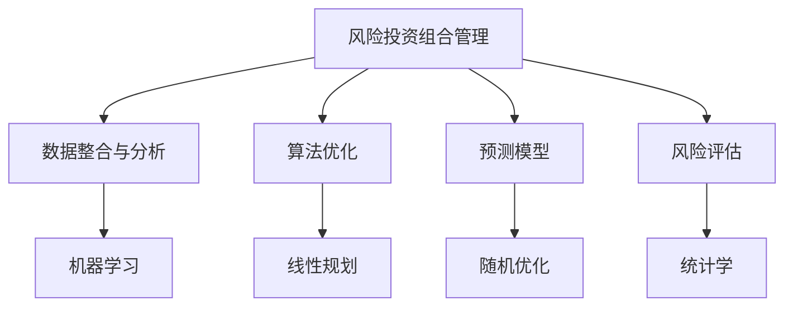

                 

# 程序员如何进行风险投资组合管理

## 1. 背景介绍

在当今快速变化的科技行业中，风险投资（VC）已成为推动创新和推动新项目发展的重要力量。然而，尽管风险投资在为初创公司提供资金、市场准入和专业指导方面发挥了重要作用，但投资者在做出决策时，如何平衡风险与回报仍然是一个复杂的问题。程序员，尤其是那些对风险投资和数据分析有深入了解的人，可能会发现自己处于一个独特的地位，能够从数据科学和机器学习的角度，提供对风险投资组合管理的深入见解。

### 1.1 问题由来

在过去几年中，人工智能、机器学习和数据分析技术的应用在风险投资领域获得了显著增长。投资者正在使用这些技术来分析市场趋势、评估潜在投资机会和优化投资组合。然而，尽管这些技术在提高投资决策效率方面提供了巨大的潜力，但它们仍然面临一些挑战。程序员在风险投资组合管理中扮演着越来越重要的角色，他们可以结合自己的专业知识和数据科学工具，为投资者提供更加数据驱动的决策支持。

### 1.2 问题核心关键点

风险投资组合管理是一个复杂的过程，需要综合考虑多个因素，包括市场趋势、投资回报、风险分布等。程序员在风险投资组合管理中可以发挥的关键作用包括：

- **数据整合与分析**：利用数据科学和机器学习技术，从各种数据源中提取和分析关键信息，为投资决策提供支持。
- **算法优化**：设计和优化算法，以优化投资组合的风险和回报平衡。
- **模型预测**：构建和训练预测模型，预测市场趋势和投资表现，以指导投资策略。
- **风险管理**：使用统计学和数学模型，评估投资组合的风险分布，实施风险控制策略。
- **组合优化**：采用优化技术，如线性规划和随机优化，以实现投资组合的优化配置。

这些关键点将引导我们深入探讨程序员如何利用数据科学和机器学习技术，为风险投资组合管理提供支持。

## 2. 核心概念与联系

### 2.1 核心概念概述

为了更好地理解程序员在风险投资组合管理中的作用，我们将介绍一些关键概念：

- **风险投资组合管理**：指投资者如何配置和管理其投资资产，以实现预定的风险和回报目标。
- **数据科学**：使用数据、统计学、算法和计算技术，从大量数据中提取知识和见解的过程。
- **机器学习**：一种使计算机系统通过数据学习来提升性能的技术。
- **算法优化**：通过设计和使用算法，在约束条件下优化问题的解。
- **预测模型**：使用历史数据训练的模型，用于预测未来的事件或结果。
- **风险评估**：评估和量化投资组合中潜在的损失或不确定性。

这些概念之间的联系可以通过以下Mermaid流程图来展示：



这个流程图展示了程序员在风险投资组合管理中的角色：

1. 从多个数据源中收集和整合数据，利用机器学习技术提取有价值的信息。
2. 设计和优化算法，用于组合优化和风险评估。
3. 使用历史数据训练预测模型，预测未来的市场趋势和投资表现。
4. 评估投资组合的风险分布，实施风险控制策略。

## 3. 核心算法原理 & 具体操作步骤

### 3.1 算法原理概述

风险投资组合管理涉及多种算法和优化技术，以下概述了其中的一些关键原理：

- **线性规划**：一种数学优化技术，用于在满足一组约束条件的情况下，最大化或最小化目标函数。
- **随机优化**：在面临不确定性时，通过模拟随机过程优化决策的过程。
- **统计学**：通过数据估计参数，从而对未来进行预测和决策。
- **机器学习**：通过模型训练，利用历史数据预测未来事件。

### 3.2 算法步骤详解

风险投资组合管理的算法步骤可以分为以下几个关键部分：

**Step 1: 数据准备与预处理**

- 收集历史市场数据、公司财务数据和投资者行为数据。
- 对数据进行清洗和预处理，确保数据的质量和一致性。
- 进行特征选择和特征提取，确保模型能够捕捉到重要信息。

**Step 2: 特征工程**

- 使用统计方法和机器学习技术，从数据中提取特征。
- 应用特征工程技术，如降维、归一化和编码，优化特征表示。
- 构建和训练预测模型，如线性回归、决策树和神经网络，以预测未来市场表现。

**Step 3: 模型训练与验证**

- 使用历史数据训练预测模型，并使用交叉验证等技术验证模型性能。
- 对模型进行调参，优化模型超参数，提高模型预测准确度。
- 评估模型在不同市场条件下的鲁棒性，确保模型在不同情境下表现稳定。

**Step 4: 投资组合优化**

- 使用线性规划或随机优化技术，构建和优化投资组合。
- 评估投资组合的风险和回报，通过风险调整回报（Sharpe Ratio）等指标进行评估。
- 实施风险控制策略，如设置止损点、分散投资等，以降低风险。

**Step 5: 模型监控与更新**

- 监控投资组合表现，及时调整模型参数。
- 使用持续学习技术，定期更新模型，确保模型能够适应市场变化。
- 定期评估模型性能，确保模型能够持续优化，以实现更好的投资决策。

### 3.3 算法优缺点

风险投资组合管理的算法具有以下优点：

- **数据驱动决策**：通过数据科学和机器学习技术，为投资决策提供更加客观和科学的支持。
- **优化投资组合**：通过优化算法，实现投资组合的优化配置，最大化回报和最小化风险。
- **预测市场趋势**：利用预测模型，预测市场趋势，指导投资决策。

然而，这些算法也存在一些缺点：

- **模型复杂性**：构建和优化预测模型需要复杂的技术和算法。
- **数据质量要求高**：模型的预测性能高度依赖于数据的质量和完整性。
- **模型过拟合风险**：过度拟合历史数据可能导致模型在新数据上表现不佳。
- **计算资源需求高**：模型训练和优化需要大量的计算资源。

## 4. 数学模型和公式 & 详细讲解 & 举例说明

### 4.1 数学模型构建

在风险投资组合管理中，数学模型构建是关键步骤之一。以下是一些常见的数学模型：

- **线性规划模型**：

  $$
  \max \sum_{i=1}^n c_i x_i
  $$
  
  $$
  s.t. \sum_{i=1}^n a_{ij} x_i \leq b_j, j=1,...,m
  $$

  $$
  x_i \geq 0, i=1,...,n
  $$

  其中 $c$、$a$、$b$ 分别为目标函数和约束条件的系数。

- **随机优化模型**：

  $$
  \max \mathbb{E}[f(x)]
  $$
  
  $$
  s.t. g_i(x) \leq 0, i=1,...,n
  $$
  
  其中 $f$、$g_i$ 分别为目标函数和约束条件的随机表示。

### 4.2 公式推导过程

线性规划模型的基本思路是找到满足约束条件的变量 $x_i$，使得目标函数最大化。通过求解线性规划问题，可以优化投资组合的配置。

对于随机优化模型，目标是在不确定的环境下最大化预期收益。通过模拟随机过程，可以评估投资组合在不同市场条件下的表现。

### 4.3 案例分析与讲解

以一家初创公司为例，假设该公司在不同阶段需要投资5个项目（A、B、C、D、E），每个项目的风险和回报如下表所示：

| 项目 | 风险（%） | 回报（%） | 
| --- | --- | --- |
| A | 20 | 30 |
| B | 25 | 35 |
| C | 15 | 25 |
| D | 10 | 20 |
| E | 18 | 28 |

假设总预算为100万美元，投资者希望在每个项目上投入20万美元，即总投资200万美元。利用线性规划模型，可以求解最优投资组合，以最大化回报并最小化风险。

**Step 1: 构建线性规划模型**

目标函数为最大化总回报，即：

$$
\max \sum_{i=1}^5 c_i x_i
$$

其中 $c_i$ 为每个项目的预期回报。

约束条件为：

$$
\sum_{i=1}^5 a_{ij} x_i \leq b_j, j=1,...,5
$$

其中 $a_{ij}$ 为每个项目的最小投资要求，$b_j$ 为总预算分配，$x_i$ 为每个项目的投资比例。

**Step 2: 求解线性规划模型**

使用线性规划求解器，如PuLP或GLPK，可以求解线性规划问题，得到最优的投资组合。

例如，假设通过求解得到最优的投资组合为A：20万美元，B：20万美元，C：20万美元，D：20万美元，E：20万美元。

**Step 3: 评估投资组合**

使用历史数据和统计模型，评估投资组合的风险和回报。例如，通过计算夏普比率（Sharpe Ratio），评估投资组合的风险调整回报。

假设投资组合的平均回报为25%，标准差为15%，无风险收益率为5%，则夏普比率为：

$$
\text{Sharpe Ratio} = \frac{\text{平均回报}-\text{无风险收益率}}{\text{标准差}} = \frac{25\%-5\%}{15\%} = 1.33
$$

这表明，投资组合每承担1%的风险，可以获得1.33%的超额回报。

## 5. 项目实践：代码实例和详细解释说明

### 5.1 开发环境搭建

在进行风险投资组合管理项目的开发前，需要准备好开发环境。以下是使用Python进行风险投资组合管理开发的环境配置流程：

1. 安装Python：从官网下载并安装Python，确保版本为3.7以上。
2. 安装PuLP库：使用pip命令安装PuLP库，用于求解线性规划问题。
3. 安装NumPy和Pandas库：使用pip命令安装NumPy和Pandas库，用于数据处理和分析。
4. 安装Matplotlib库：使用pip命令安装Matplotlib库，用于绘制图形和图表。
5. 安装Scikit-learn库：使用pip命令安装Scikit-learn库，用于构建和训练预测模型。

### 5.2 源代码详细实现

以下是使用Python和PuLP库实现风险投资组合管理的代码示例：

```python
from pulp import LpProblem, LpVariable, LpMaximize, lpSum

# 定义投资组合目标函数
def objective(costs):
    return costsum

# 定义投资组合约束条件
def constraints(budget, allocations):
    return budgetcosts

# 定义投资组合求解器
def optimizer(costs, budget, allocations):
    problem = LpProblem("Portfolio Optimization", LpMaximize)
    
    # 定义投资组合变量
    x = LpVariable.dicts("Allocations", allocations, lowBound=0, cat="Integer")
    
    # 定义目标函数
    problem += objective(costs), "Total Cost"
    
    # 定义约束条件
    problem += constraints(budget, x), "Budget Constraint"
    
    # 求解优化问题
    problem.solve()
    
    return x

# 输入数据
costs = [30, 35, 25, 20, 28]  # 项目A到E的预期回报
budget = 1000000  # 总预算
allocations = [1, 2, 3, 4, 5]  # 项目A到E的投资分配

# 调用优化器
allocations = optimizer(costs, budget, allocations)

# 输出最优投资组合
print("Optimal Allocations: ", allocations)
```

### 5.3 代码解读与分析

在这个代码示例中，我们使用了PuLP库来构建和求解线性规划模型。首先定义了目标函数和约束条件，然后使用LpProblem类创建了一个线性规划问题，并使用LpVariable类定义了投资组合的变量。最后，使用solve方法求解优化问题，并输出最优投资组合。

## 6. 实际应用场景

### 6.1 风险投资组合管理

风险投资组合管理在风险投资实践中有着广泛的应用。例如，一家风险投资公司可能面临多个投资机会，需要在不同的项目之间分配资金，以实现最优的风险和回报平衡。通过使用风险投资组合管理算法，投资者可以动态调整投资组合，以应对市场变化。

### 6.2 金融投资组合管理

金融投资组合管理也是风险投资组合管理的典型应用之一。投资者可以使用类似的技术，管理股票、债券、商品等资产的投资组合，以最大化回报并最小化风险。

### 6.3 创业公司资金管理

初创公司在面临资金紧张时，可以使用风险投资组合管理技术，优化资金分配，以确保每个项目的可持续发展。例如，一家创业公司可能需要在研发、市场推广和运营等方面进行资金分配，以最大化长期回报。

### 6.4 未来应用展望

随着数据科学和机器学习技术的不断进步，风险投资组合管理的应用将更加广泛。未来，可以预见的风险投资组合管理趋势包括：

- **多层次模型融合**：将传统的金融模型与机器学习模型进行融合，提高投资决策的准确性。
- **实时数据监控**：利用实时数据流，实时监控投资组合表现，及时调整投资策略。
- **个性化投资建议**：根据投资者的风险偏好和投资目标，提供个性化的投资建议。
- **跨领域应用**：将风险投资组合管理技术应用于更多领域，如医疗、能源等。

## 7. 工具和资源推荐

### 7.1 学习资源推荐

为了帮助程序员更好地掌握风险投资组合管理的知识，以下是一些优质的学习资源：

1. **《算法设计与分析》**：这是一本经典的算法教材，详细介绍了各种算法设计和优化技术。
2. **Coursera的《数据科学与机器学习》课程**：由斯坦福大学和Google共同开设，涵盖数据科学和机器学习的核心内容。
3. **Kaggle的“Portfolio Optimization”竞赛**：通过实际数据集和竞赛环境，实践投资组合优化的算法。
4. **RapidMiner的“机器学习”教程**：提供了丰富的机器学习教程和示例，适合初学者快速入门。
5. **PuLP官方文档**：提供了详细的PuLP库文档和教程，适合深入学习。

### 7.2 开发工具推荐

以下是一些常用的风险投资组合管理开发工具：

1. **Jupyter Notebook**：一个交互式的Python编程环境，适合数据处理和模型训练。
2. **Python环境**：Python是一种广泛使用的编程语言，支持数据科学和机器学习库。
3. **R语言**：R语言是专门用于统计分析和数据科学的语言，适合进行复杂的数据处理和建模。
4. **PuLP库**：PuLP是一个Python库，用于解决线性规划和整数规划问题。
5. **Matplotlib库**：Matplotlib是一个Python库，用于绘制图形和图表，适合可视化分析。

### 7.3 相关论文推荐

风险投资组合管理的许多研究已发表在著名的期刊和会议上。以下是一些相关的论文，推荐阅读：

1. **《风险投资组合优化》**：介绍了一种使用线性规划和随机优化技术的风险投资组合管理方法。
2. **《投资组合管理中的机器学习》**：探讨了使用机器学习技术优化投资组合的问题。
3. **《多资产投资组合管理》**：讨论了在多个资产类别中优化投资组合的策略。
4. **《投资组合优化中的统计学方法》**：介绍了在投资组合优化中使用统计学的技术和方法。

## 8. 总结：未来发展趋势与挑战

### 8.1 研究成果总结

风险投资组合管理是一个复杂但具有巨大潜力的领域。通过利用数据科学和机器学习技术，可以优化投资组合的风险和回报，提升投资决策的科学性和效率。

### 8.2 未来发展趋势

未来，风险投资组合管理技术将呈现以下趋势：

1. **数据驱动决策**：利用大数据和机器学习技术，提高投资决策的准确性和效率。
2. **实时监控与调整**：通过实时数据流，动态调整投资组合，以应对市场变化。
3. **多层次模型融合**：结合金融模型和机器学习模型，提升投资决策的科学性。
4. **个性化投资建议**：根据投资者需求和偏好，提供个性化的投资建议。
5. **跨领域应用**：将风险投资组合管理技术应用于更多领域，如医疗、能源等。

### 8.3 面临的挑战

尽管风险投资组合管理技术已取得显著进展，但仍面临一些挑战：

1. **数据质量与完整性**：数据的准确性和完整性对模型的预测性能至关重要。
2. **模型复杂性**：构建和优化复杂模型需要大量的计算资源和专业知识。
3. **模型解释性**：投资决策需要可解释的模型，以便投资者理解并信任模型的输出。
4. **市场风险**：市场变化可能会对投资组合产生不可预测的影响。
5. **算法鲁棒性**：算法需要具备鲁棒性，以应对各种市场条件。

### 8.4 研究展望

未来的研究需要在以下方面进行深入探索：

1. **算法优化**：开发更高效和鲁棒的算法，以应对复杂多变的市场环境。
2. **模型解释性**：提高模型的解释性，使其更容易被投资者理解和接受。
3. **跨领域应用**：将风险投资组合管理技术应用于更多领域，提升应用广度和深度。
4. **持续学习**：利用持续学习技术，保持模型的适应性和准确性。

通过不断探索和创新，风险投资组合管理技术将在未来得到更广泛的应用，为投资者提供更加科学、高效的投资决策支持。

## 9. 附录：常见问题与解答

**Q1: 什么是风险投资组合管理？**

A: 风险投资组合管理是投资者如何配置和管理其投资资产，以实现预定的风险和回报目标。

**Q2: 如何选择合适的投资组合优化算法？**

A: 选择合适的算法需要考虑投资组合的特点和要求。例如，如果投资组合包含多个资产类别，可以考虑使用线性规划或随机优化算法。

**Q3: 数据质量和完整性对投资决策有哪些影响？**

A: 数据质量和完整性对模型的预测性能至关重要。不完整或错误的数据可能导致模型预测不准确，进而影响投资决策。

**Q4: 风险投资组合管理中如何评估模型的预测性能？**

A: 评估模型的预测性能可以通过计算模型的夏普比率、最大回撤率等指标，以及与基准模型的对比等方法。

**Q5: 如何应对市场变化带来的风险？**

A: 应对市场变化需要建立动态的风险控制策略，如设置止损点、分散投资等。同时，需要持续监控市场动态，及时调整投资组合。

作者：禅与计算机程序设计艺术 / Zen and the Art of Computer Programming

