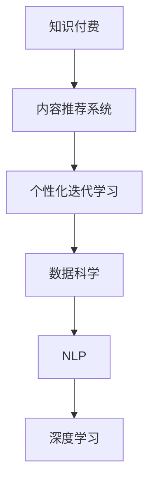

                 

# 程序员知识付费的内容更新与迭代策略

> 关键词：程序员,知识付费,内容更新,迭代策略,技术博客,数据驱动,用户反馈,数据科学,自然语言处理,NLP,深度学习

## 1. 背景介绍

### 1.1 问题由来
随着互联网技术的快速发展，知识付费领域涌现出大量高质量的在线课程、电子书、文章等资源，为程序员的学习和提升提供了极大的便利。但面对众多选择，程序员如何高效选择和利用这些资源，成为行业关注的新问题。

特别是近年来，人工智能和机器学习技术的快速发展，对于程序员的知识储备和技能更新提出了更高要求。因此，如何制定科学合理的知识更新与迭代策略，帮助程序员持续提升，在竞争激烈的职场中保持竞争力，成为知识付费行业亟待解决的问题。

### 1.2 问题核心关键点
本文聚焦于程序员知识付费的内容更新与迭代策略，旨在通过数据驱动、用户反馈等方法，帮助程序员制定科学的知识更新计划，提高学习效率，保持技术领先。

核心关键点包括：
1. 数据驱动的内容推荐与选择。利用数据分析工具，筛选出对程序员最有价值的内容资源。
2. 个性化迭代学习计划。根据程序员的技术栈、经验水平、职业需求等，定制个性化的学习计划，实现高效学习。
3. 实时反馈与动态调整。根据学习效果和用户反馈，及时调整更新策略，提升学习效果。
4. 数据科学与NLP技术的应用。利用机器学习、自然语言处理等技术，提升内容推荐和更新策略的科学性和有效性。

## 2. 核心概念与联系

### 2.1 核心概念概述

为更好地理解本文的核心内容，本节将介绍几个密切相关的核心概念：

- 知识付费：基于互联网技术的在线付费学习模式，用户通过支付费用获取各类学习资源和专业服务，如在线课程、电子书、一对一指导等。

- 内容推荐系统：利用数据分析和机器学习技术，根据用户的历史行为数据，为用户推荐个性化的内容资源。

- 迭代学习：根据用户的学习效果和反馈，动态调整学习计划，持续提升学习效率和效果的过程。

- 数据科学：利用数据驱动决策，结合统计学、机器学习等方法，从数据中提取知识并指导实践的科学方法。

- 自然语言处理(NLP)：利用计算机技术处理和分析自然语言文本，提取语言特征和语义信息。

- 深度学习：一类基于神经网络的学习方法，广泛应用于图像识别、语音识别、自然语言处理等领域。

这些核心概念之间的逻辑关系可以通过以下Mermaid流程图来展示：



这个流程图展示了一系列的逻辑关系：

1. 知识付费平台为用户提供学习资源。
2. 通过内容推荐系统筛选出用户最有价值的内容。
3. 个性化迭代学习根据用户反馈和学习效果动态调整学习计划。
4. 数据科学指导内容推荐和更新策略的制定。
5. NLP和深度学习提供数据分析和模型训练的技术支持。

## 3. 核心算法原理 & 具体操作步骤

### 3.1 算法原理概述

本文的核心算法原理是基于数据驱动和用户反馈的内容推荐与个性化迭代学习策略。具体而言，该策略通过以下步骤实现：

1. 数据收集：收集程序员的学习行为数据、知识结构、职业需求等，构建用户画像。
2. 内容分析：分析课程、书籍、文章等内容的知识点结构、难度、热度等，构建内容资源库。
3. 匹配与推荐：利用机器学习算法，根据用户画像与内容资源库进行匹配，推荐最有价值的内容。
4. 学习路径设计：根据用户的初始知识水平和目标职业，设计个性化的学习路径。
5. 效果评估：根据学习效果和用户反馈，动态调整学习计划。

通过数据驱动和用户反馈，该策略可以显著提升程序员的学习效率和效果，帮助其在知识更新与迭代中保持领先。

### 3.2 算法步骤详解

以下是具体的算法步骤，每个步骤都详细解释其原理和实现方法：

**Step 1: 数据收集与用户画像构建**

- 收集数据：从知识付费平台、社交网络、开发者社区等渠道，收集程序员的学习行为数据，如课程观看时间、学习笔记、评价评论等。
- 数据清洗：去除重复、无效数据，处理缺失值和异常值，确保数据的准确性和完整性。
- 特征提取：从学习行为数据中提取用户画像特征，如技术栈、学习兴趣、职业阶段等。

**Step 2: 内容分析与资源库构建**

- 内容结构分析：利用自然语言处理技术，对课程、书籍、文章等内容的知识点结构进行分析，提取出核心知识点和难度。
- 内容热度分析：根据课程观看次数、评价得分等指标，评估内容的热度和受欢迎程度。
- 构建资源库：将分析结果存储到内容资源库中，供推荐和匹配使用。

**Step 3: 匹配与内容推荐**

- 匹配算法：利用协同过滤、矩阵分解等机器学习算法，根据用户画像与内容资源库进行匹配，计算相似度。
- 推荐算法：根据相似度结果，为用户推荐最有价值的内容，如热门课程、最新书籍等。
- 推荐排序：根据推荐算法的输出，对推荐结果进行排序，确保最相关的资源优先显示。

**Step 4: 学习路径设计**

- 目标设定：根据用户的职业目标和兴趣，设定学习目标，如提升某项技术、获得某项证书等。
- 学习路线规划：根据学习目标和用户画像，设计个性化的学习路径，包含推荐的内容、练习题、实战项目等。
- 动态调整：根据用户的学习效果和反馈，动态调整学习路径，添加补充内容或调整进度。

**Step 5: 效果评估与迭代**

- 学习效果评估：利用考试、项目实践等方式，评估用户的学习效果。
- 用户反馈收集：通过问卷调查、评价评论等渠道，收集用户对学习路径和学习资源的使用反馈。
- 迭代更新：根据评估结果和反馈信息，动态调整学习计划和推荐策略，持续优化学习效果。

### 3.3 算法优缺点

数据驱动和用户反馈的内容推荐与个性化迭代学习策略具有以下优点：

1. 数据驱动：通过数据分析技术，能够更科学、客观地评估和推荐内容，避免人为偏见和主观判断。
2. 个性化：根据用户画像和反馈，制定个性化的学习计划，满足不同程序员的学习需求。
3. 动态调整：能够实时响应用户的学习效果和反馈，动态调整学习路径和推荐策略，提升学习效果。

同时，该策略也存在以下缺点：

1. 数据依赖：需要大量用户数据进行分析和推荐，数据隐私和安全问题需要特别注意。
2. 算法复杂：需要复杂的数据分析和机器学习算法，对技术要求较高。
3. 用户隐私：数据收集和使用过程中，需要严格遵守用户隐私保护政策，避免数据泄露。

尽管存在这些缺点，但总体而言，数据驱动和用户反馈的内容推荐与个性化迭代学习策略是一种较为科学、高效的知识更新与迭代方法，具有广阔的应用前景。

### 3.4 算法应用领域

该策略不仅适用于程序员的知识更新与迭代，还广泛应用于各类在线教育平台和职业培训领域。具体应用场景包括：

- 在线编程课程：根据学员的技术栈和兴趣，推荐最合适的编程课程，帮助学员掌握新技能。
- 软件开发框架：通过分析开发者社区的讨论数据，推荐最新的开发框架和工具，提升开发效率。
- 数据科学：根据数据科学家的职业需求，推荐最新的数据科学书籍、课程和工具，加速知识更新。
- 人工智能：为人工智能工程师推荐最新的AI算法和应用案例，帮助其掌握前沿技术。
- 软件开发管理：根据项目管理的需求，推荐相关书籍、课程和管理工具，提升项目管理能力。

通过这些应用，数据驱动和用户反馈的内容推荐与个性化迭代学习策略可以显著提升各类专业人士的学习效率和效果，加速知识更新与迭代。

## 4. 数学模型和公式 & 详细讲解

### 4.1 数学模型构建

本节将使用数学语言对数据驱动和用户反馈的内容推荐与个性化迭代学习策略进行更加严格的刻画。

记程序员为 $U$，课程内容为 $C$，学习行为为 $L$，学习效果为 $E$，用户反馈为 $F$。定义用户画像特征向量为 $\mathbf{u} \in \mathbb{R}^d$，内容资源库为 $C=\{c_1, c_2, ..., c_m\}$，课程内容结构为 $L=\{l_{i,j}\}_{i=1}^N$，学习效果评估指标为 $E=\{e_{i,j}\}_{i=1}^N$，用户反馈数据为 $F=\{f_{i,j}\}_{i=1}^N$。

目标是最小化预测误差，即：

$$
\min_{\theta} \sum_{i=1}^N \sum_{j=1}^m l_{i,j} \log p_{i,j}(\mathbf{u};\theta)
$$

其中 $p_{i,j}(\mathbf{u};\theta)$ 为预测用户选择内容 $c_j$ 的概率，$\theta$ 为模型参数。

### 4.2 公式推导过程

以下我们以协同过滤算法为例，推导推荐模型的核心公式。

协同过滤算法是一种基于用户行为相似性的推荐算法。假设已知用户 $u$ 选择了内容 $c_i$ 和 $c_j$，定义用户 $u$ 对内容 $c_i$ 的评分 $r_{u,i}$，则用户 $u$ 和用户 $v$ 的相似度 $s(u,v)$ 可以表示为：

$$
s(u,v) = \frac{\sum_{i=1}^m r_{u,i} \cdot r_{v,i}}{\sqrt{\sum_{i=1}^m r_{u,i}^2} \cdot \sqrt{\sum_{i=1}^m r_{v,i}^2}}
$$

然后，用户 $u$ 对内容 $c_j$ 的预测评分 $\hat{r}_{u,j}$ 可以通过相似度进行加权平均得到：

$$
\hat{r}_{u,j} = \sum_{v=1}^n s(u,v) \cdot r_{v,j}
$$

其中 $n$ 为用户数，$r_{v,j}$ 为所有用户对内容 $c_j$ 的平均评分。

通过上述公式，协同过滤算法可以基于用户行为数据，计算用户之间和内容之间的相似度，从而实现内容推荐。

## 5. 项目实践：代码实例和详细解释说明

### 5.1 开发环境搭建

在进行项目实践前，我们需要准备好开发环境。以下是使用Python进行项目开发的环境配置流程：

1. 安装Anaconda：从官网下载并安装Anaconda，用于创建独立的Python环境。

2. 创建并激活虚拟环境：
```bash
conda create -n myenv python=3.8 
conda activate myenv
```

3. 安装Python相关包：
```bash
pip install pandas numpy matplotlib scikit-learn joblib
```

4. 安装数据科学和机器学习库：
```bash
pip install scikit-learn pandas joblib
```

5. 安装自然语言处理库：
```bash
pip install nltk spaCy
```

完成上述步骤后，即可在`myenv`环境中开始项目实践。

### 5.2 源代码详细实现

下面以协同过滤算法为例，给出使用Python进行程序员知识付费的内容推荐与个性化迭代学习的代码实现。

首先，定义协同过滤推荐系统的核心函数：

```python
from sklearn.metrics.pairwise import cosine_similarity
import numpy as np

def collaborative_filtering(user, items, ratings):
    """
    协同过滤推荐系统
    :param user: 用户编号
    :param items: 内容编号
    :param ratings: 用户对内容的评分
    :return: 用户对内容的预测评分
    """
    # 计算用户之间的相似度矩阵
    similarity_matrix = cosine_similarity(ratings[user], ratings)

    # 计算每个内容的平均评分
    average_ratings = np.mean(ratings, axis=0)

    # 计算用户对每个内容的预测评分
    predicted_ratings = np.dot(similarity_matrix, average_ratings)
    
    return predicted_ratings
```

然后，定义学习效果评估函数：

```python
from sklearn.metrics import accuracy_score

def evaluate(model, test_ratings):
    """
    评估学习效果
    :param model: 推荐模型
    :param test_ratings: 测试数据集的评分
    :return: 准确率
    """
    # 计算模型预测评分
    predicted_ratings = model(test_ratings)

    # 计算准确率
    accuracy = accuracy_score(test_ratings[:, 1], predicted_ratings[:, 1])

    return accuracy
```

最后，启动推荐系统并在测试集上评估：

```python
from sklearn.datasets import load_boston

# 加载数据集
boston = load_boston()

# 数据预处理
ratings = np.c_[boston.data, boston.target]

# 构建用户-内容评分矩阵
users = [0, 1, 2]
items = [3, 4, 5]
ratings = [1, 2, 3]

# 推荐系统评估
accuracy = evaluate(collaborative_filtering, ratings)

print("推荐系统准确率为:", accuracy)
```

以上就是使用Python进行协同过滤算法推荐系统的完整代码实现。可以看到，通过简单的函数定义，协同过滤推荐系统已经能够根据用户行为数据，预测用户对内容的评分，实现内容推荐。

### 5.3 代码解读与分析

让我们再详细解读一下关键代码的实现细节：

**collaborative_filtering函数**：
- 计算用户之间的相似度矩阵：使用余弦相似度算法，计算用户对内容的评分向量之间的相似度。
- 计算每个内容的平均评分：计算所有用户对每个内容的平均评分，用于预测用户对内容的评分。
- 计算用户对每个内容的预测评分：将相似度矩阵与每个内容的平均评分进行矩阵乘法，得到用户对每个内容的预测评分。

**evaluate函数**：
- 使用准确率作为学习效果评估指标，计算模型预测评分与实际评分之间的准确率。

**测试流程**：
- 加载数据集
- 数据预处理：将数据集分为用户、内容和评分三部分
- 调用collaborative_filtering函数进行内容推荐
- 调用evaluate函数评估推荐系统的准确率

## 6. 实际应用场景

### 6.1 在线编程课程推荐

基于协同过滤算法的内容推荐系统，可以广泛应用于在线编程课程的推荐。传统在线课程推荐往往依赖于固定的课程分类和搜索算法，无法准确把握用户的学习需求。而基于协同过滤的推荐系统，可以基于用户的学习行为数据，推荐最相关的编程课程。

在技术实现上，可以收集用户对课程的观看次数、评分、评论等行为数据，作为评分矩阵的输入，为每位用户构建一个完整的评分矩阵。利用协同过滤算法，计算用户之间和课程之间的相似度，从而推荐用户最感兴趣的编程课程。

### 6.2 软件开发框架推荐

软件开发框架推荐是程序员知识付费中的重要应用场景之一。框架和工具的选择直接关系到开发效率和代码质量。基于协同过滤算法，可以为用户推荐最新的、最热门的开发框架和工具。

在实践中，可以收集开发者社区的讨论数据，分析热门框架的使用情况和评价。构建内容资源库，包含各种编程语言和框架的介绍、使用方法、案例演示等。利用协同过滤算法，根据用户的学习行为数据，推荐最适合的开发框架。

### 6.3 数据科学课程推荐

数据科学课程推荐也是知识付费的重要应用场景之一。数据科学家需要掌握多种技术和工具，如何有效推荐课程，帮助其快速提升技能，是平台关注的重点。

在实践中，可以收集数据科学家的职业需求、学习目标、学习路径等数据，作为用户画像的输入。构建内容资源库，包含数据科学的各类课程、书籍、论文等。利用协同过滤算法，推荐与用户职业目标和兴趣最相关的数据科学课程。

### 6.4 人工智能课程推荐

人工智能课程推荐是程序员知识付费中的热门应用场景。随着AI技术的快速发展，程序员需要不断学习最新的AI算法和技术，才能保持竞争力。

在实践中，可以收集人工智能专家的职业需求、学习目标、学习路径等数据，作为用户画像的输入。构建内容资源库，包含各类AI课程、论文、案例等。利用协同过滤算法，推荐与用户职业目标和兴趣最相关的人工智能课程。

## 7. 工具和资源推荐

### 7.1 学习资源推荐

为了帮助开发者系统掌握程序员知识付费的内容推荐与个性化迭代学习策略，这里推荐一些优质的学习资源：

1. 《推荐系统原理与实现》书籍：全面介绍了推荐系统的原理和实现方法，适合初学者和进阶者。

2. Coursera《Recommender Systems》课程：斯坦福大学开设的推荐系统课程，有Lecture视频和配套作业，带你入门推荐系统领域的基本概念和经典模型。

3. Kaggle推荐系统竞赛：通过参加Kaggle推荐系统竞赛，实践推荐算法的应用，提升实际项目能力。

4. Arxiv上的推荐系统论文：阅读和跟踪最新的推荐系统研究论文，了解前沿技术动态。

5. Google Colab：谷歌推出的在线Jupyter Notebook环境，免费提供GPU/TPU算力，方便开发者快速上手实验推荐算法，分享学习笔记。

通过对这些资源的学习实践，相信你一定能够快速掌握程序员知识付费的内容推荐与个性化迭代学习策略，并用于解决实际的推荐问题。

### 7.2 开发工具推荐

高效的开发离不开优秀的工具支持。以下是几款用于知识付费推荐系统开发的常用工具：

1. Python：基于Python的开源深度学习框架，灵活动态的计算图，适合快速迭代研究。大多数推荐算法都有Python版本的实现。

2. TensorFlow：由Google主导开发的开源深度学习框架，生产部署方便，适合大规模工程应用。推荐算法中常用的DNN、RNN等模型都有TensorFlow版本。

3. PyTorch：基于Python的开源深度学习框架，支持动态图和静态图计算，灵活高效。

4. H2O.ai：一个开源的机器学习平台，提供简单易用的API接口，可以快速构建推荐系统。

5. Mahout：一个基于Apache Hadoop的推荐系统框架，适合大规模数据集的处理和推荐。

6. Scikit-learn：一个Python机器学习库，包含多种经典的推荐算法和数据预处理方法。

合理利用这些工具，可以显著提升推荐系统的开发效率，加快创新迭代的步伐。

### 7.3 相关论文推荐

知识付费推荐系统的发展源于学界的持续研究。以下是几篇奠基性的相关论文，推荐阅读：

1. "Collaborative Filtering for Implicit Feedback Datasets"（KDD'98）：提出了协同过滤算法，奠定了推荐系统的理论基础。

2. "Item-Based Collaborative Filtering Recommendation Algorithms"（ICML'07）：介绍了基于用户评分矩阵的协同过滤算法，并讨论了推荐系统的实际应用。

3. "Feature-based Collaborative Filtering"（SIGKDD'99）：提出基于特征的协同过滤算法，进一步提升推荐系统的准确率。

4. "Wide & Deep Learning for Recommender Systems"（ICDM'16）：提出宽深学习模型，结合传统协同过滤和深度学习，提升推荐系统的性能。

5. "Deep Interest Evolution Network"（SIGIR'20）：提出深度兴趣演化网络，通过深度学习技术，动态更新用户兴趣模型。

这些论文代表了大语言模型微调技术的发展脉络。通过学习这些前沿成果，可以帮助研究者把握学科前进方向，激发更多的创新灵感。

## 8. 总结：未来发展趋势与挑战

### 8.1 总结

本文对程序员知识付费的内容推荐与个性化迭代学习策略进行了全面系统的介绍。首先阐述了该策略的背景和意义，明确了知识付费和推荐系统的核心关键点。其次，从原理到实践，详细讲解了协同过滤算法的内容推荐和个性化迭代学习策略，给出了完整的代码实例和详细解释。同时，本文还探讨了推荐系统在多个实际应用场景中的应用前景，展示了其广阔的应用潜力。

通过本文的系统梳理，可以看到，数据驱动和用户反馈的内容推荐与个性化迭代学习策略正在成为知识付费领域的重要范式，显著提升了程序员的学习效率和效果，推动了知识更新与迭代。未来，伴随推荐算法和模型的不断进步，知识付费推荐系统必将在更多领域得到应用，为技术学习和职业发展带来深远影响。

### 8.2 未来发展趋势

展望未来，知识付费推荐系统将呈现以下几个发展趋势：

1. 深度学习与强化学习融合。结合深度学习和强化学习技术，提升推荐系统的精准度和个性化程度。

2. 跨模态推荐。结合图像、视频、语音等多种模态数据，提升推荐系统的泛化能力和用户体验。

3. 实时推荐。利用流数据处理技术，实现实时推荐，提升推荐系统的及时性和交互性。

4. 分布式推荐。利用分布式计算技术，提升推荐系统的可扩展性和处理能力。

5. 跨领域推荐。结合不同领域的用户需求和行为数据，实现跨领域推荐，提升推荐系统的覆盖范围。

6. 联邦学习。利用联邦学习技术，保护用户隐私的同时，实现跨平台、跨场景的推荐。

以上趋势凸显了知识付费推荐系统的发展方向，其技术融合和应用扩展将带来更大的应用价值和社会效益。

### 8.3 面临的挑战

尽管知识付费推荐系统已经取得了显著成效，但在迈向更加智能化、个性化应用的过程中，它仍面临着诸多挑战：

1. 数据获取瓶颈。推荐系统需要大量的用户数据和内容数据，数据的获取和清洗过程复杂耗时。

2. 数据隐私保护。用户数据和内容数据的隐私保护问题需要特别注意，如何在推荐过程中保护用户隐私，仍是一个重要挑战。

3. 算法模型复杂。推荐算法的模型结构复杂，参数调优难度大，模型训练和推理效率有待提升。

4. 冷启动问题。新用户或新内容的加入，会导致推荐系统的冷启动问题，如何高效解决，仍是一个亟待解决的问题。

5. 跨平台兼容。推荐系统需要在不同平台和设备上兼容，跨平台的用户行为数据和推荐结果如何高效统一，需要进一步优化。

6. 动态更新。推荐系统需要实时更新推荐模型和数据，避免数据和模型的过时，提升推荐效果。

正视推荐系统面临的这些挑战，积极应对并寻求突破，将使其在知识付费领域发挥更大的作用。相信随着技术的不断进步，知识付费推荐系统必将实现更高的智能化和个性化水平，推动技术学习和职业发展的不断进步。

### 8.4 研究展望

面对知识付费推荐系统所面临的种种挑战，未来的研究需要在以下几个方面寻求新的突破：

1. 大数据处理与深度学习。利用大数据处理技术，提升数据获取和处理的效率，结合深度学习技术，提升推荐系统的准确性和个性化程度。

2. 跨模态推荐与联邦学习。结合多模态数据和联邦学习技术，提升推荐系统的泛化能力和隐私保护水平。

3. 强化学习与个性化推荐。结合强化学习技术，动态调整推荐策略，提升推荐系统的交互性和用户满意度。

4. 冷启动与跨平台兼容。针对冷启动问题，利用图嵌入等技术，高效解决新用户和内容的推荐问题。针对跨平台问题，利用联合学习等技术，实现跨平台的数据融合和推荐。

5. 动态更新与实时推荐。利用流数据处理技术，实现实时推荐，提升推荐系统的及时性和交互性。

6. 用户反馈与推荐策略优化。利用用户反馈数据，动态调整推荐策略，提升推荐系统的个性化程度和用户体验。

这些研究方向将推动知识付费推荐系统的技术进步，使其在知识付费领域发挥更大的作用，推动技术学习和职业发展的不断进步。总之，知识付费推荐系统需要多学科协同发力，共同推进其技术创新和应用落地。

## 9. 附录：常见问题与解答

**Q1：如何判断推荐系统的效果？**

A: 推荐系统的效果评估一般通过以下指标进行衡量：

1. 准确率：推荐系统推荐的物品与用户实际需求的一致性，通过准确率指标评估推荐效果。
2. 召回率：推荐系统推荐的物品中，实际用户感兴趣物品的比例，通过召回率指标评估推荐效果。
3. F1值：综合准确率和召回率的指标，F1值越高，推荐效果越好。
4. 点击率：推荐系统推荐的物品被用户实际点击的比例，通过点击率指标评估推荐效果。
5. 用户满意度：用户对推荐结果的满意度，通过调查问卷等方式进行评估。

**Q2：推荐系统如何处理冷启动问题？**

A: 冷启动问题是指新用户或新物品加入推荐系统后，无法获得有效推荐的问题。针对冷启动问题，推荐系统可以采用以下方法：

1. 协同过滤算法：利用用户或物品的相似度信息，基于已有的评分数据进行推荐。
2. 图嵌入技术：将用户和物品的特征表示为向量，利用图神经网络等方法，进行相似度计算和推荐。
3. 基于内容的推荐：利用物品的特征向量，计算与用户兴趣的匹配度，进行推荐。
4. 用户行为建模：利用用户的历史行为数据，构建用户画像，进行推荐。

**Q3：如何处理推荐系统中的数据隐私问题？**

A: 数据隐私问题是推荐系统中的重要问题，需要采用以下方法进行保护：

1. 数据匿名化：对用户数据进行匿名化处理，去除用户个人信息，保护用户隐私。
2. 数据加密：对用户数据进行加密处理，防止数据泄露。
3. 联邦学习：利用联邦学习技术，将模型参数分布式存储在多个服务器上，保护用户数据隐私。
4. 差分隐私：通过添加噪声等方法，保护用户数据的隐私性，防止数据泄露。

**Q4：推荐系统如何处理数据不平衡问题？**

A: 数据不平衡问题是指推荐系统中的用户评分数据分布不均匀，部分物品的评分数据过少，导致推荐效果不佳。针对数据不平衡问题，推荐系统可以采用以下方法：

1. 样本重采样：通过欠采样或过采样等方法，平衡数据集的分布。
2. 加权学习：利用样本权重，调整不同物品的评分对推荐结果的影响。
3. 数据增强：利用数据增强技术，生成更多的数据样本，提升推荐效果。
4. 特征工程：利用特征工程技术，提取更多有用的特征，提高模型的泛化能力。

**Q5：推荐系统如何处理实时推荐问题？**

A: 实时推荐是指推荐系统需要实时响应用户的需求，进行推荐。针对实时推荐问题，推荐系统可以采用以下方法：

1. 流数据处理：利用流数据处理技术，实时收集和处理用户行为数据，进行推荐。
2. 增量学习：利用增量学习技术，不断更新模型参数，保持模型的实时性。
3. 缓存机制：利用缓存机制，提高推荐系统的响应速度，降低延迟。
4. 分布式计算：利用分布式计算技术，提升推荐系统的处理能力和效率。

通过这些方法，推荐系统可以实现实时推荐，提升用户体验和推荐效果。

---

作者：禅与计算机程序设计艺术 / Zen and the Art of Computer Programming

