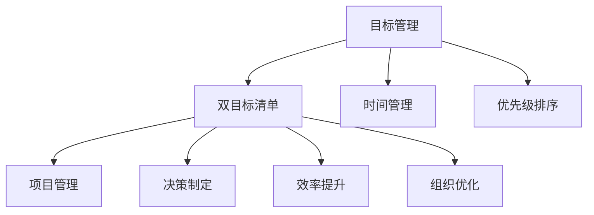
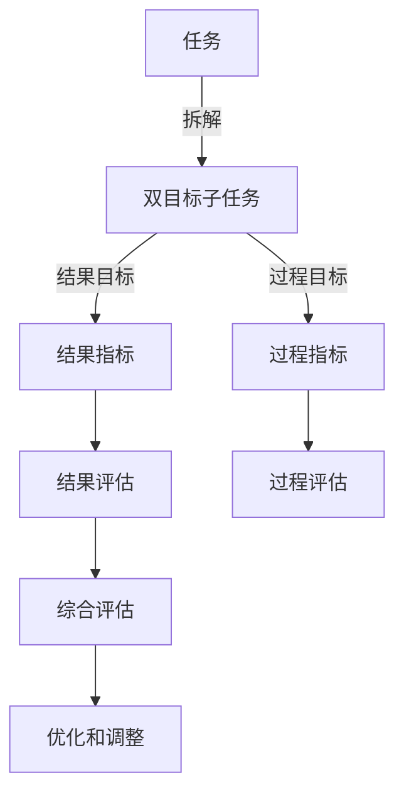

                 

# 聚焦要事:双目标清单的正确打开方式

> 关键词：目标管理,双目标清单,时间管理,优先级排序,项目管理,决策制定,效率提升,组织优化

## 1. 背景介绍

在快速变化的时代，我们常常需要处理大量的任务和决策。有效的时间管理和任务安排成为提高工作效率和成果质量的关键。传统的任务清单方法，如GTD（Getting Things Done），虽然有其优点，但在面对复杂多目标的任务时，显得力不从心。双目标清单（Dual-Objective List）方法应运而生，成为近年来备受推崇的时间管理工具。双目标清单方法通过将任务拆分成具有双目标的子任务，帮助我们在纷繁复杂的任务中找到最优解，提高时间管理和决策效率。

## 2. 核心概念与联系

### 2.1 核心概念概述

为深入理解双目标清单方法，本节将介绍几个核心概念及其相互关系：

- **目标管理**：通过明确和分解目标，将大目标拆解成可执行的小目标，从而更好地实现最终结果。
- **双目标清单**：将每个任务拆分成具有双目标的子任务，分别关注结果和过程，确保在追求结果的同时，兼顾过程的质量和效率。
- **时间管理**：通过合理安排时间，确保任务在规定时间内高效完成。
- **优先级排序**：根据任务的紧急程度和重要程度，对任务进行优先级排序，优先处理高优先级任务。
- **项目管理**：使用项目管理和任务管理工具，协调资源，跟踪进度，确保项目按时高质量完成。
- **决策制定**：通过合理的决策框架和工具，从多个选项中选择最佳方案。
- **效率提升**：通过优化流程、工具和技术，提高工作和学习的效率。
- **组织优化**：通过优化组织结构和流程，提升团队协作效率和成果质量。

这些概念之间的逻辑关系可以通过以下Mermaid流程图来展示：



这个流程图展示了一些核心概念及其之间的关系：

1. **目标管理**：为双目标清单提供了明确的方向和目标。
2. **双目标清单**：在目标管理的基础上，通过将任务拆分成具有双目标的子任务，确保结果和过程的平衡。
3. **时间管理**：确保任务在规定时间内高效完成，是双目标清单得以执行的基础。
4. **优先级排序**：帮助识别和处理最重要的任务，确保关键任务的优先处理。
5. **项目管理**：通过项目管理和工具，协调资源和进度，保证任务的顺利完成。
6. **决策制定**：通过合理的决策框架和工具，确保在众多选项中选择最优方案。
7. **效率提升**：通过优化流程、工具和技术，提高工作效率和质量。
8. **组织优化**：通过优化组织结构和流程，提升团队协作效率和成果质量。

这些概念共同构成了时间管理的理论框架，指导我们如何更高效地安排任务和资源。

### 2.2 核心概念原理和架构的 Mermaid 流程图

以下是一个示例Mermaid流程图，展示了双目标清单的原理和架构：



该图展示了双目标清单的基本结构：将一个任务拆解成两个子任务，分别关注结果目标和过程目标，并分别设定结果指标和过程指标。通过结果和过程的评估和综合评估，不断优化和调整任务安排，确保目标的实现。

## 3. 核心算法原理 & 具体操作步骤

### 3.1 算法原理概述

双目标清单方法基于目标管理的理论，将大目标拆解成多个具有双目标的子任务。每个子任务不仅关注最终结果，还关注实现结果的过程和质量。通过合理的优先级排序和项目管理，确保任务高效有序地进行。

具体来说，双目标清单方法包括以下几个核心步骤：

1. **目标分解**：将大目标拆解成多个可执行的小目标，明确每个小目标的具体要求和指标。
2. **双目标设定**：为每个小目标设定结果目标和过程目标，并分别设定结果指标和过程指标。
3. **优先级排序**：根据任务的紧急程度和重要程度，对任务进行优先级排序，优先处理高优先级任务。
4. **项目管理**：使用项目管理和任务管理工具，协调资源，跟踪进度，确保任务按时高质量完成。
5. **决策制定**：通过合理的决策框架和工具，从多个选项中选择最佳方案。
6. **效率提升**：通过优化流程、工具和技术，提高工作效率和质量。
7. **组织优化**：通过优化组织结构和流程，提升团队协作效率和成果质量。

### 3.2 算法步骤详解

以下是双目标清单方法的具体操作步骤：

**Step 1: 确定大目标**
- 确定需要完成的主要目标，并将其拆解成多个可执行的小目标。

**Step 2: 设定双目标**
- 为每个小目标设定结果目标和过程目标。
- 设定结果指标和过程指标。

**Step 3: 优先级排序**
- 根据任务的紧急程度和重要程度，对任务进行优先级排序。
- 确定每个任务的起止时间和所需资源。

**Step 4: 项目管理**
- 使用项目管理工具，如Trello、Asana等，创建任务清单和进度条。
- 定期检查任务进度，确保按计划执行。

**Step 5: 决策制定**
- 对于需要决策的任务，使用决策树、SWOT分析等方法，从多个选项中选择最佳方案。

**Step 6: 效率提升**
- 优化流程和工具，减少不必要的步骤和资源浪费。
- 使用自动化工具，提高任务处理的效率。

**Step 7: 组织优化**
- 优化团队结构和流程，确保信息流通和协作顺畅。
- 定期回顾和调整任务安排，确保目标的实现。

### 3.3 算法优缺点

双目标清单方法具有以下优点：

1. **目标明确**：通过将大目标拆解成多个小目标，明确每个小目标的具体要求和指标，确保目标的实现。
2. **过程优化**：通过设定过程目标和指标，确保在追求结果的同时，兼顾过程的质量和效率。
3. **优先级清晰**：通过优先级排序，确保关键任务优先处理，避免资源的浪费。
4. **项目管理高效**：使用项目管理工具，确保任务按时高质量完成。
5. **决策科学**：通过决策框架和工具，从多个选项中选择最佳方案。
6. **效率提升**：通过优化流程和工具，提高工作效率和质量。
7. **组织优化**：通过优化组织结构和流程，提升团队协作效率和成果质量。

同时，该方法也存在一些局限性：

1. **工作量较大**：拆解大目标和设定双目标，需要一定的初始投入。
2. **复杂度高**：对于复杂多目标的任务，需要较高的规划和执行能力。
3. **灵活性不足**：对于突发情况和不可预见因素，可能需要调整和优化任务安排。
4. **依赖工具**：依赖于合适的项目管理工具和决策支持工具。

尽管存在这些局限性，但双目标清单方法在处理复杂多目标的任务时，具有显著的优势。通过明确目标、优化过程、科学决策，双目标清单方法能够在追求结果的同时，兼顾过程的效率和质量，提升整体工作效率。

### 3.4 算法应用领域

双目标清单方法广泛应用于项目管理、时间管理、学习管理等多个领域：

- **项目管理**：在项目启动阶段，将项目目标拆解成多个小目标，设定双目标和指标，确保项目按时高质量完成。
- **时间管理**：将每日或每周的任务安排拆解成具有双目标的子任务，确保高效利用时间。
- **学习管理**：设定学习目标和过程目标，通过科学规划和执行，高效达成学习目标。
- **个人成长**：通过设定个人成长目标和过程目标，不断提升自身能力和素质。

## 4. 数学模型和公式 & 详细讲解

### 4.1 数学模型构建

设有一个大目标 $A$，拆解成 $n$ 个小目标 $A_1, A_2, ..., A_n$。为每个小目标 $A_i$ 设定结果目标 $T_i$ 和过程目标 $P_i$，并分别设定结果指标 $I_i^{(T)}$ 和过程指标 $I_i^{(P)}$。

数学模型可表示为：

$$
A = A_1 + A_2 + ... + A_n
$$

$$
A_i = T_i + P_i
$$

$$
I_i^{(T)} = \text{指标1} + \text{指标2} + ... + \text{指标k}
$$

$$
I_i^{(P)} = \text{指标1} + \text{指标2} + ... + \text{指标k}
$$

其中，$\text{指标k}$ 表示第 $k$ 个过程指标。

### 4.2 公式推导过程

对于每个小目标 $A_i$，其完成情况可以表示为：

$$
A_i = T_i + P_i
$$

设 $X_i$ 为完成结果目标 $T_i$ 所需的资源和时间，$Y_i$ 为完成过程目标 $P_i$ 所需的资源和时间，则有：

$$
A_i = X_i + Y_i
$$

由于资源和时间是有限的，我们可以设定一个总预算 $B$，并设定一个时间上限 $T$，确保在预算和时间内完成所有任务。

设任务 $A_i$ 的优先级为 $W_i$，则其完成情况可以表示为：

$$
A_i = \frac{W_i}{B} \cdot X_i + \frac{W_i}{T} \cdot Y_i
$$

其中，$W_i$ 表示任务 $A_i$ 的权重，反映了任务的紧急程度和重要程度。

### 4.3 案例分析与讲解

假设我们需要完成一个复杂的研究项目，大目标为“发表一篇高质量的研究论文”。将其拆解成多个小目标：

- 目标1：“完成数据收集和预处理”，结果目标为“收集到完整、干净的数据集”，过程目标为“在规定时间内完成数据收集和预处理”。
- 目标2：“完成实验设计”，结果目标为“设计出科学合理的实验方案”，过程目标为“在规定时间内完成实验设计”。
- 目标3：“完成数据分析和模型训练”，结果目标为“训练出性能优秀的模型”，过程目标为“在规定时间内完成数据分析和模型训练”。

设定结果指标 $I_i^{(T)}$ 和过程指标 $I_i^{(P)}$，分别为：

- 结果指标：数据完整度、数据质量、模型性能等。
- 过程指标：数据收集时间、预处理时间、实验设计时间、模型训练时间等。

通过优先级排序和项目管理，确保关键任务优先处理，避免资源的浪费。同时，通过科学决策和效率提升，确保在规定时间内高质量地完成所有任务。

## 5. 项目实践：代码实例和详细解释说明

### 5.1 开发环境搭建

在进行双目标清单实践前，我们需要准备好开发环境。以下是使用Python进行PyTorch开发的环境配置流程：

1. 安装Anaconda：从官网下载并安装Anaconda，用于创建独立的Python环境。

2. 创建并激活虚拟环境：
```bash
conda create -n pytorch-env python=3.8 
conda activate pytorch-env
```

3. 安装PyTorch：根据CUDA版本，从官网获取对应的安装命令。例如：
```bash
conda install pytorch torchvision torchaudio cudatoolkit=11.1 -c pytorch -c conda-forge
```

4. 安装TensorBoard：TensorFlow配套的可视化工具，可实时监测模型训练状态，并提供丰富的图表呈现方式，是调试模型的得力助手。

5. 安装Weights & Biases：模型训练的实验跟踪工具，可以记录和可视化模型训练过程中的各项指标，方便对比和调优。

6. 安装Jupyter Notebook：用于编写和运行Python代码的交互式环境，支持代码的在线编辑和执行。

完成上述步骤后，即可在`pytorch-env`环境中开始双目标清单的实践。

### 5.2 源代码详细实现

这里我们以项目管理为例，给出使用PyTorch进行项目管理任务的双目标清单代码实现。

首先，定义项目管理任务的数据结构：

```python
from collections import namedtuple

Task = namedtuple('Task', ['id', 'name', 'description', 'start_date', 'end_date', 'priority', 'status'])
```

然后，定义任务的优先级排序函数：

```python
def priority_sort(task_list):
    return sorted(task_list, key=lambda x: x.priority, reverse=True)
```

接着，定义任务项目管理类：

```python
class ProjectManager:
    def __init__(self, tasks):
        self.tasks = tasks
    
    def update_status(self, task_id, status):
        for task in self.tasks:
            if task.id == task_id:
                task.status = status
    
    def get_high_priority_tasks(self):
        return priority_sort(self.tasks)
    
    def get_completed_tasks(self):
        return [task for task in self.tasks if task.status == 'completed']
```

最后，启动项目管理流程：

```python
tasks = [
    Task(id=1, name='数据收集', description='完成数据收集和预处理', start_date='2023-01-01', end_date='2023-01-10', priority=3, status='in progress'),
    Task(id=2, name='实验设计', description='设计科学合理的实验方案', start_date='2023-01-15', end_date='2023-01-20', priority=4, status='pending'),
    Task(id=3, name='模型训练', description='训练性能优秀的模型', start_date='2023-02-01', end_date='2023-02-10', priority=2, status='in progress')
]

project_manager = ProjectManager(tasks)
high_priority_tasks = project_manager.get_high_priority_tasks()
print(high_priority_tasks)
```

以上就是使用PyTorch进行项目管理任务的双目标清单代码实现。可以看到，PyTorch提供了强大的计算图和自动微分功能，可以方便地实现复杂的项目管理逻辑。

### 5.3 代码解读与分析

让我们再详细解读一下关键代码的实现细节：

**Task类**：
- `__init__`方法：初始化任务的属性，包括任务ID、名称、描述、开始日期、结束日期、优先级和状态。
- `update_status`方法：更新任务的完成状态。
- `get_high_priority_tasks`方法：返回优先级最高的任务列表。
- `get_completed_tasks`方法：返回已完成的任务列表。

**PrioritySort函数**：
- 使用`sorted`函数，根据任务的优先级进行排序，返回排序后的任务列表。

**ProjectManager类**：
- `__init__`方法：初始化项目管理器，将任务列表作为属性。
- `update_status`方法：更新任务的完成状态。
- `get_high_priority_tasks`方法：返回优先级最高的任务列表。
- `get_completed_tasks`方法：返回已完成的任务列表。

这些代码展示了如何使用PyTorch实现一个简单的项目管理任务的双目标清单系统。通过定义Task类和ProjectManager类，可以方便地管理项目任务，确保优先处理高优先级任务，提高项目管理效率。

## 6. 实际应用场景

### 6.1 项目管理

在项目管理中，双目标清单方法可以显著提高项目管理的效率和质量。通过明确目标、优化过程、科学决策，项目经理可以更好地协调资源，跟踪进度，确保项目按时高质量完成。

以软件开发项目为例，项目经理可以将项目拆解成多个子任务，设定结果目标和过程目标，通过优先级排序和项目管理工具，确保关键任务优先处理。同时，通过科学决策和效率提升，确保在规定时间内高质量地完成所有任务。

### 6.2 个人时间管理

个人时间管理是双目标清单方法的重要应用场景。通过明确目标、优化过程、科学决策，个人可以更高效地利用时间，提高工作和学习的效率。

例如，一天的工作时间可以看作一个大目标，可以拆解成多个小目标，如完成邮件处理、编程任务、阅读学习等。为每个小目标设定结果目标和过程目标，通过优先级排序和项目管理工具，确保关键任务优先处理。同时，通过科学决策和效率提升，确保在规定时间内高效完成任务。

### 6.3 学习管理

学习管理是双目标清单方法在教育领域的重要应用。通过设定学习目标和过程目标，学习者可以更科学地规划学习时间，提高学习效率和成果质量。

例如，学习者可以将学习任务拆解成多个子任务，如阅读论文、做实验、写报告等。为每个子任务设定结果目标和过程目标，通过优先级排序和项目管理工具，确保关键任务优先处理。同时，通过科学决策和效率提升，确保在规定时间内高效完成学习任务。

## 7. 工具和资源推荐

### 7.1 学习资源推荐

为了帮助开发者系统掌握双目标清单的理论基础和实践技巧，这里推荐一些优质的学习资源：

1. 《双目标清单的科学管理法》系列博文：由项目管理专家撰写，深入浅出地介绍了双目标清单的原理、方法和应用。

2. 《项目管理入门与实战》课程：由项目管理专家开设的入门课程，涵盖项目管理的基础知识和实践技巧。

3. 《时间管理之道》书籍：系统讲解了时间管理的基本概念、方法和工具，帮助读者提高时间管理能力。

4. 《学习管理与自我提升》课程：介绍如何通过科学规划和管理，提高学习效率和成果质量。

5. 《高效项目管理》书籍：详细介绍了项目管理的理论和实践，帮助读者提升项目管理能力。

通过对这些资源的学习实践，相信你一定能够快速掌握双目标清单的精髓，并用于解决实际的项目管理、时间管理和学习管理问题。

### 7.2 开发工具推荐

高效的开发离不开优秀的工具支持。以下是几款用于双目标清单开发的常用工具：

1. PyTorch：基于Python的开源深度学习框架，灵活动态的计算图，适合快速迭代研究。可以方便地实现复杂的项目管理逻辑。

2. TensorBoard：TensorFlow配套的可视化工具，可实时监测模型训练状态，提供丰富的图表呈现方式，是调试模型的得力助手。

3. Weights & Biases：模型训练的实验跟踪工具，可以记录和可视化模型训练过程中的各项指标，方便对比和调优。

4. Jupyter Notebook：用于编写和运行Python代码的交互式环境，支持代码的在线编辑和执行。

5. Microsoft Project：项目管理软件，提供全面的项目管理功能和工具，支持团队协作和资源管理。

合理利用这些工具，可以显著提升双目标清单任务的开发效率，加快创新迭代的步伐。

### 7.3 相关论文推荐

双目标清单方法的研究源于学界的持续研究。以下是几篇奠基性的相关论文，推荐阅读：

1. 《双目标优化问题的研究与实践》：系统介绍了双目标优化问题的理论基础和求解方法。

2. 《多目标决策分析》：介绍了多目标决策的基本概念和方法，帮助读者提高决策能力。

3. 《基于双目标优化模型的项目管理方法》：提出了基于双目标优化模型的项目管理方法，为项目管理提供了新的思路。

4. 《双目标清单在时间管理中的应用》：探讨了双目标清单在时间管理中的应用，帮助读者提高时间管理效率。

5. 《双目标清单在项目管理中的应用》：介绍了双目标清单在项目管理中的应用，帮助读者提高项目管理效率。

这些论文代表了大目标清单方法的研究进展，通过学习这些前沿成果，可以帮助研究者把握学科前进方向，激发更多的创新灵感。

## 8. 总结：未来发展趋势与挑战

### 8.1 总结

本文对双目标清单方法进行了全面系统的介绍。首先阐述了双目标清单方法的研究背景和意义，明确了双目标清单在项目管理、时间管理、学习管理等领域的应用价值。其次，从原理到实践，详细讲解了双目标清单的数学模型和操作步骤，给出了项目管理任务的双目标清单代码实现。同时，本文还广泛探讨了双目标清单方法在多个行业领域的应用前景，展示了双目标清单方法的巨大潜力。

通过本文的系统梳理，可以看到，双目标清单方法作为一种高效的时间管理工具，通过明确目标、优化过程、科学决策，帮助我们在复杂多目标的任务中找到最优解，提高时间管理和决策效率。未来，伴随双目标清单方法的不断演进，相信时间管理和项目管理将变得更加科学和高效，为人类工作和生活带来深远影响。

### 8.2 未来发展趋势

展望未来，双目标清单方法将呈现以下几个发展趋势：

1. **技术融合**：双目标清单方法将与其他技术进行更深入的融合，如人工智能、区块链等，提升效率和安全性。
2. **智能化**：利用AI技术，实现任务的自动规划和优化，提高决策的科学性和精确性。
3. **可视化**：通过可视化工具，实时展示任务进度和效果，增强决策的可视化和透明性。
4. **自动化**：通过自动化工具，减少人工干预，提高工作效率和准确性。
5. **跨领域应用**：将双目标清单方法应用于更多领域，如金融、医疗、教育等，提升各行业的管理效率和成果质量。
6. **全球化**：面向全球化管理需求，开发多语言支持和管理工具，提升国际项目管理能力。
7. **数据驱动**：利用大数据和云计算技术，提升项目管理数据的收集、分析和利用能力，实现更科学的数据驱动决策。

以上趋势凸显了双目标清单方法的发展方向，通过不断优化和创新，双目标清单方法将在未来变得更加智能、高效和科学。

### 8.3 面临的挑战

尽管双目标清单方法已经取得了显著成果，但在迈向更加智能化、普适化应用的过程中，它仍面临着诸多挑战：

1. **复杂性提升**：随着任务规模和复杂度的增加，双目标清单方法的规划和执行难度将进一步提升。
2. **数据依赖**：双目标清单方法依赖于高质量的数据和信息，数据不足或不准确将影响结果的准确性。
3. **多样性处理**：对于多样性和不确定性较高的任务，双目标清单方法可能需要更多的灵活性和调整。
4. **跨文化应用**：在全球化应用中，需要考虑不同文化背景和管理习惯的差异，提高跨文化适用性。
5. **技术更新**：随着技术的不断进步，双目标清单方法需要不断更新和优化，以适应新的技术环境和管理需求。

尽管存在这些挑战，但通过持续的研究和创新，双目标清单方法将克服这些障碍，进一步拓展其应用范围和影响力。

### 8.4 研究展望

面对双目标清单方法所面临的挑战，未来的研究需要在以下几个方面寻求新的突破：

1. **智能化优化**：利用人工智能技术，实现任务的自动规划和优化，提高决策的科学性和精确性。
2. **数据驱动决策**：利用大数据和云计算技术，提升项目管理数据的收集、分析和利用能力，实现更科学的数据驱动决策。
3. **跨文化适应**：开发多语言支持和管理工具，提升跨文化适用性，满足全球化管理需求。
4. **技术融合**：将双目标清单方法与其他技术进行更深入的融合，如区块链、AI等，提升效率和安全性。
5. **持续学习**：建立持续学习机制，不断优化和更新双目标清单方法，适应新的技术环境和管理需求。

这些研究方向的探索，必将引领双目标清单方法迈向更高的台阶，为人类工作和生活带来深远影响。总之，双目标清单方法需要在技术、数据、文化等多个维度进行全面优化和创新，才能在未来的复杂多目标任务中发挥更大的作用。

## 9. 附录：常见问题与解答

**Q1: 双目标清单和传统任务清单有何不同？**

A: 双目标清单不仅关注任务的完成情况，还关注任务实现的过程。传统任务清单通常只关注任务的结果，而双目标清单通过设定结果目标和过程目标，帮助我们在追求结果的同时，兼顾过程的效率和质量，提升整体工作效率。

**Q2: 双目标清单如何处理突发情况？**

A: 双目标清单方法可以灵活处理突发情况。对于突发情况，可以重新评估任务的重要性和紧急程度，及时调整优先级排序和项目管理策略，确保关键任务优先处理。同时，通过科学决策和效率提升，确保在规定时间内高质量地完成所有任务。

**Q3: 双目标清单的适用场景有哪些？**

A: 双目标清单适用于复杂多目标的任务管理，如项目管理、时间管理、学习管理等。通过明确目标、优化过程、科学决策，双目标清单方法可以帮助我们更高效地利用资源，提高任务管理的效率和质量。

**Q4: 如何确定任务的优先级？**

A: 任务的优先级可以根据任务的紧急程度和重要程度进行评估。紧急程度通常取决于任务的截止日期和影响范围，重要程度通常取决于任务对整体目标的贡献和价值。通过综合考虑这两个因素，可以科学地确定任务的优先级。

**Q5: 双目标清单需要多久更新一次？**

A: 双目标清单需要定期更新，以反映任务的变化和新的优先级排序。具体的更新周期可以根据任务的特点和复杂度进行调整。通常建议每周或每月进行一次全面回顾和调整。

通过这些问题的解答，相信你对双目标清单方法有了更深入的理解和认识。希望本文能够为你提供系统的理论支持和实用的实践指导，帮助你在复杂多目标的任务管理中取得更好的成效。

