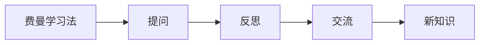

                 

# 费曼提问法促进团队学习与成长

> 关键词：费曼学习法, 提问法, 团队学习, 思维提升, 知识共享, 教学相长

## 1. 背景介绍

在快节奏的现代商业环境中，团队的持续学习与成长成为了企业竞争力提升的关键。然而，团队学习通常面临以下挑战：
- 成员知识水平参差不齐，存在“假性专家综合症”，难以互相学习和交流。
- 学习资源分散，难以集中高效地组织学习活动。
- 缺乏系统的方法论和工具，学习效率低下。

费曼提问法（Feynman Technique）作为一种基于费曼学习法的提问技巧，通过深入提问、反思和交流，能够极大提升团队的学习效果。本文将详细介绍费曼提问法的原理、操作流程及其在团队学习中的应用。

## 2. 核心概念与联系

### 2.1 核心概念概述

费曼提问法源于诺贝尔物理学家理查德·费曼（Richard Feynman）提出的费曼学习法，其核心思想是通过向自己或他人解释某个概念，来加深自己对知识的理解。费曼提问法强调通过提问来引导思考和探索，促进知识的内化、共享和成长。

### 2.2 核心概念联系（备注：必须给出核心概念原理和架构的 Mermaid 流程图(Mermaid 流程节点中不要有括号、逗号等特殊字符)


### 2.3 核心概念原理

费曼提问法的原理建立在认知科学和心理学理论基础上：
- **认知负荷理论**：提出人的认知能力有限，需要通过提问来聚焦注意力，激活大脑的批判性思考。
- **学习循环理论**：认为学习是一个不断循环的过程，包括获取信息、解释信息、应用信息、反思和调整等步骤。
- **社会学习理论**：强调通过交流和互动，将个体的学习经验转化为团队知识。

## 3. 核心算法原理 & 具体操作步骤
### 3.1 算法原理概述

费曼提问法通过以下几个步骤实现知识的深度理解和团队协作：
1. **提问**：向自己或他人提出具有挑战性的问题，激发深度思考。
2. **反思**：对提问结果进行反思，挖掘知识盲点。
3. **交流**：与他人讨论，验证和补充自己的理解。
4. **新知识**：通过提问和交流，生成新的知识和见解。

### 3.2 算法步骤详解

#### 步骤1：提问

提问是费曼提问法的起点。高质量的提问能引发深入思考，揭示知识盲区。具体步骤包括：

1. **确定主题**：选择一个知识点或问题作为学习对象。
2. **提出问题**：用简洁、明确的语言提出问题，确保问题的针对性和深度。
3. **自我回答**：在心中或纸上尝试回答这些问题，记录下思维过程和结果。

#### 步骤2：反思

反思是检验和深化理解的重要环节。通过反思，可以识别知识盲点，发现理解中的误区。具体步骤包括：

1. **检查答案**：将自我回答与已有知识对比，识别出不准确或遗漏的部分。
2. **分析原因**：深入分析错误或遗漏的原因，挖掘背后的深层知识。
3. **更新认知**：根据反思结果，更新和完善自己的知识体系。

#### 步骤3：交流

交流是将个体知识转化为团队知识的桥梁。通过交流，可以获得多样化的视角和反馈，促进知识的共享和深化。具体步骤包括：

1. **讨论问题**：将问题与团队成员分享，鼓励大家提出各自的见解和思考。
2. **互相提问**：针对自我回答和团队讨论结果，提出进一步的问题，引导深入思考。
3. **总结分享**：整理讨论结果，形成共识或分歧，进行总结和分享。

#### 步骤4：新知识

新知识是费曼提问法的最终目标。通过提问、反思和交流，团队能生成新的见解和知识，实现共同成长。具体步骤包括：

1. **归纳总结**：整理讨论结果，形成新的知识框架或洞察。
2. **应用实践**：将新知识应用于实际工作中，验证和完善。
3. **反复迭代**：不断进行提问、反思和交流，持续优化和深化知识。

### 3.3 算法优缺点

#### 优点

1. **促进深度理解**：通过深入提问，激发团队成员的批判性思考，提升对知识的理解。
2. **知识共享高效**：通过交流和讨论，将个体知识转化为团队共识，提升整体知识水平。
3. **自我提升显著**：通过反思和总结，不断发现和修正知识盲点，实现自我提升。

#### 缺点

1. **挑战高**：提问和反思需要较高的认知水平和深度思考能力，对成员要求较高。
2. **时间投入大**：需要花费大量时间和精力进行提问、反思和交流，对工作节奏有影响。
3. **依赖氛围**：需要营造开放、包容的学习氛围，团队成员需积极参与和支持。

### 3.4 算法应用领域

费曼提问法不仅适用于技术团队，在各种知识密集型组织中都有广泛的应用。例如：

- **软件开发团队**：通过费曼提问法，提升代码理解、问题解决和团队协作能力。
- **产品团队**：通过费曼提问法，深入理解用户需求，提升产品设计和用户体验。
- **销售团队**：通过费曼提问法，提升市场洞察、产品推广和客户沟通能力。
- **管理团队**：通过费曼提问法，提升战略思考、决策支持和团队领导能力。

## 4. 数学模型和公式 & 详细讲解  
### 4.1 数学模型构建

费曼提问法不涉及复杂的数学模型，但可以用以下概念框架来描述其核心流程：

1. **输入**：初始知识 $K$，问题 $Q$。
2. **处理**：通过提问、反思和交流，生成新知识 $K'$。
3. **输出**：新的知识 $K'$ 和改进的问题 $Q'$。

### 4.2 公式推导过程

费曼提问法的核心在于通过提问和反思，推动知识的内化和深化。其推导过程如下：

1. **提问过程**：通过提问 $Q$，激活大脑的批判性思考，形成初步答案 $A$。
2. **反思过程**：通过反思 $A$，识别错误或遗漏，生成修正后的答案 $A'$。
3. **交流过程**：通过交流 $A'$，获取多样化的视角和反馈，生成最终答案 $A''$。
4. **新知识生成**：通过 $A''$，生成新的知识 $K'$，形成知识闭环。

### 4.3 案例分析与讲解

以软件开发团队为例，分析费曼提问法的应用：

1. **确定主题**：选择新引入的技术框架，如Docker。
2. **提出问题**：为什么要使用Docker？它的优势和劣势是什么？
3. **自我回答**：初步理解Docker能提供容器化环境，提高开发和部署效率。
4. **反思过程**：深入反思Docker的部署复杂性、资源消耗等问题。
5. **交流讨论**：与团队成员讨论Docker的使用场景和最佳实践。
6. **新知识**：总结出Docker在微服务架构中的优势，制定详细的部署指南。

## 5. 项目实践：代码实例和详细解释说明
### 5.1 开发环境搭建

费曼提问法主要依赖于思考和交流，无需编写代码，但可以使用协作工具进行管理和记录。以下是常用的协作工具和搭建方法：

1. **Notion**：一款强大的笔记工具，支持文本、表格、任务管理等功能，方便团队协作。
2. **Trello**：一款看板工具，支持任务分配、进度跟踪和评论功能。
3. **Zoom/Slack**：一款视频会议和即时通讯工具，支持实时讨论和共享屏幕。

### 5.2 源代码详细实现

费曼提问法的实现主要依赖于文档记录和协作工具，无需编写代码。以下是一个简单的团队协作示例：

1. **创建项目笔记**：在Notion中创建项目笔记，列出需要学习和讨论的主题。
2. **分配任务**：在Trello中创建任务卡片，分配给团队成员。
3. **发起讨论**：使用Zoom/Slack，邀请团队成员参与视频会议或即时讨论。
4. **记录讨论结果**：在Notion中记录讨论内容和共识，形成知识文档。

### 5.3 代码解读与分析

费曼提问法的代码实现主要依赖于协作工具，以下是示例代码：

```python
# Notion API示例代码
# 创建项目笔记
import notion
client = notion.Client(token='YOUR_NOTION_TOKEN')
database_id = 'YOUR_DATABASE_ID'
notes = client.databases.get(database_id)
new_note = {
    "properties": {
        "Title": {
            "type": "text",
            "value": "Docker容器化"
        },
        "Task": {
            "type": "multi-select",
            "value": ["设计架构", "编写文档", "测试部署"]
        }
    }
}
notes.add(new_note)

# Trello API示例代码
# 创建任务卡片
import trello
client = trello.Trello('YOUR_TRELLO_API_TOKEN')
board_id = 'YOUR_BOARD_ID'
list_id = 'YOUR_LIST_ID'
new_card = {
    "name": "Docker容器化",
    "description": "设计架构、编写文档、测试部署"
}
client.add_card(board_id, list_id, new_card)
```

### 5.4 运行结果展示

使用上述工具，团队可以高效地进行费曼提问法的实践。以下是一个团队协作示例：

1. **项目笔记**：
```
+---------------------+
| Docker容器化       |
+---------------------+
| 设计架构           |
| 编写文档           |
| 测试部署           |
+---------------------+
```

2. **任务分配**：
```
+---------------------+
| Docker容器化       |
+---------------------+
| 设计架构           |
| 编写文档           |
| 测试部署           |
+---------------------+
```

3. **讨论记录**：
```
+---------------------+
| Docker容器化       |
+---------------------+
| 为什么要使用Docker？ |
| 它的优势和劣势是什么？ |
+---------------------+
```

4. **新知识**：
```
+---------------------+
| Docker容器化       |
+---------------------+
| 容器化环境          |
| 提高开发和部署效率  |
| 避免依赖冲突       |
+---------------------+
```

## 6. 实际应用场景
### 6.1 软件开发团队

在软件开发团队中，费曼提问法可以显著提升代码理解和团队协作能力。具体应用场景包括：

1. **代码评审**：通过提问和反思，深入理解代码逻辑，提升评审效率和质量。
2. **技术分享**：通过提问和交流，分享新技术和新知识，促进团队知识共享。
3. **问题解决**：通过提问和讨论，快速解决复杂的技术问题，提升团队解决问题的能力。

### 6.2 产品团队

在产品团队中，费曼提问法可以提升市场洞察、产品设计和用户体验。具体应用场景包括：

1. **用户调研**：通过提问和反思，深入理解用户需求，优化产品设计。
2. **竞品分析**：通过提问和交流，分析竞品的优势和劣势，制定竞争策略。
3. **功能规划**：通过提问和讨论，制定详细的技术规划和优先级，提升产品开发效率。

### 6.3 销售团队

在销售团队中，费曼提问法可以提升市场洞察、产品推广和客户沟通能力。具体应用场景包括：

1. **客户需求分析**：通过提问和反思，深入理解客户需求，制定精准的销售策略。
2. **产品推广**：通过提问和讨论，分享产品优势和功能，提升销售转化率。
3. **客户培训**：通过提问和交流，提升客户对产品的理解和应用能力，增加客户粘性。

### 6.4 管理团队

在管理团队中，费曼提问法可以提升战略思考、决策支持和团队领导能力。具体应用场景包括：

1. **战略规划**：通过提问和反思，制定科学的战略规划，提高决策质量。
2. **团队建设**：通过提问和交流，了解团队成员的需求和问题，优化团队管理。
3. **领导力提升**：通过提问和讨论，提升领导者的沟通和决策能力，增强团队凝聚力。

## 7. 工具和资源推荐
### 7.1 学习资源推荐

1. **《费曼学习法》书籍**：由美国物理学家费曼本人撰写，详细介绍费曼学习法的核心思想和实践方法。
2. **《深度思考：思考的艺术与科学》书籍**：介绍深度思考的方法和技巧，帮助读者提升认知能力。
3. **Coursera课程《批判性思维和决策》**：由加州大学伯克利分校提供，系统介绍批判性思维的方法和应用。
4. **TED Talks《如何学习》视频**：费曼本人关于学习的演讲，分享深度学习的经验和技巧。

### 7.2 开发工具推荐

1. **Notion**：一款强大的笔记工具，支持文本、表格、任务管理等功能，方便团队协作。
2. **Trello**：一款看板工具，支持任务分配、进度跟踪和评论功能。
3. **Zoom/Slack**：一款视频会议和即时通讯工具，支持实时讨论和共享屏幕。
4. **Miro**：一款在线白板工具，支持头脑风暴、思维导图和团队协作。

### 7.3 相关论文推荐

1. **《费曼学习法：提升学习效果的新方法》论文**：详细介绍费曼学习法的基本原理和实践方法，具有较强的指导意义。
2. **《批判性思维与深度学习》论文**：分析批判性思维在深度学习中的作用，提出具体的实践建议。
3. **《知识共享与团队学习》论文**：研究知识共享和团队学习对组织绩效的影响，提出可行的策略和方法。

## 8. 总结：未来发展趋势与挑战
### 8.1 总结

费曼提问法作为一种基于费曼学习法的提问技巧，通过深入提问、反思和交流，极大提升了团队的学习效果。本文详细介绍了费曼提问法的原理、操作步骤和应用场景，提供了丰富的实践示例和工具推荐，为团队学习与成长提供了有力支持。

## 8.2 未来发展趋势

费曼提问法在不断迭代和改进中，其发展趋势包括：

1. **技术融合**：未来，费曼提问法将与其他学习方法和技术进行更深度的融合，提升整体学习效果。例如，与AI辅助学习、虚拟现实技术结合，提供沉浸式学习体验。
2. **个性化定制**：通过数据分析和算法优化，为不同背景和能力的团队成员提供个性化的学习路径和问题。
3. **跨领域应用**：费曼提问法不仅限于技术团队，将逐步拓展到更多领域，如医疗、教育、金融等，提升各领域的知识共享和协作能力。

## 8.3 面临的挑战

尽管费曼提问法在实践中取得了显著效果，但仍面临以下挑战：

1. **时间成本高**：高质量的提问和反思需要耗费大量时间和精力，对团队的工作节奏有一定影响。
2. **成员参与度低**：部分团队成员可能对费曼提问法缺乏兴趣或认知不足，影响整体参与度。
3. **效果评估难**：费曼提问法的效果评估较为主观，难以量化和客观评估学习效果。

## 8.4 研究展望

未来，费曼提问法需要在以下几个方面进行深入研究：

1. **工具和平台优化**：开发更易用、更高效的学习工具和协作平台，提升用户体验和效率。
2. **学习效果评估**：研究更客观、更科学的学习效果评估方法，提供数据驱动的改进建议。
3. **与其他方法的结合**：探索费曼提问法与其他学习方法和技术（如翻转课堂、行动学习）的结合应用，提升整体学习效果。

## 9. 附录：常见问题与解答

**Q1：费曼提问法是否适用于所有团队？**

A: 费曼提问法适用于知识密集型团队，尤其是那些需要深度思考、协作和知识共享的团队。然而，对于简单的任务或流程，可能效果不如直接培训和指导。

**Q2：如何提升团队的参与度？**

A: 提升团队参与度需要营造积极的氛围和激励机制。可以采用以下方法：
1. **设立目标**：明确团队学习目标和奖励机制，激发成员的学习动机。
2. **领导示范**：团队领导积极参与，树立榜样，带动整体氛围。
3. **文化建设**：建立开放、包容的学习文化，鼓励成员分享和讨论。

**Q3：费曼提问法是否适合所有的学习内容？**

A: 费曼提问法适用于那些需要深度理解、分析和思考的内容。对于基础知识、技能培训等，可能效果不如其他学习方法。

**Q4：如何评估费曼提问法的效果？**

A: 费曼提问法的效果评估可以通过以下指标：
1. **知识掌握度**：通过测试和考核，评估团队对知识的掌握程度。
2. **问题解决能力**：评估团队在实际问题解决中的表现，检验学习效果。
3. **协作效率**：通过项目进度和成果，评估团队协作和知识共享的效果。

总之，费曼提问法作为一种高效的团队学习与成长方法，通过深度提问和反思，促进了知识的深度理解和共享。未来，随着技术的不断进步和应用场景的拓展，费曼提问法必将在更多领域发挥更大的作用。

---

作者：禅与计算机程序设计艺术 / Zen and the Art of Computer Programming

