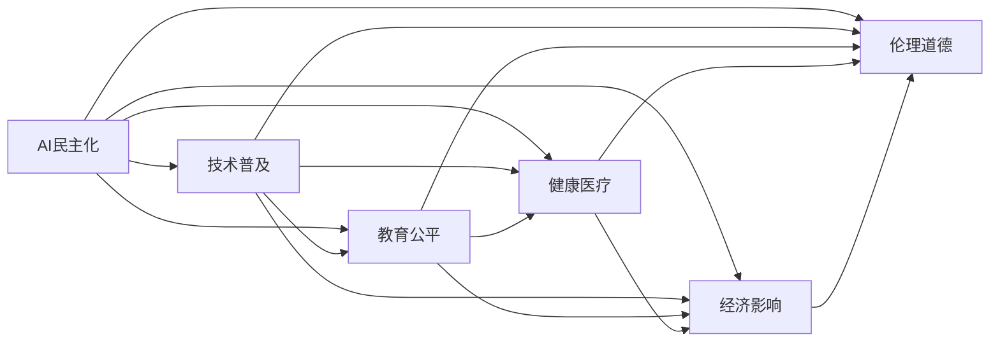

                 

# AI democratization：Lepton AI的社会责任

> 关键词：人工智能普及, Lepton AI, 社会责任, 技术可及性, 教育公平, 健康医疗, 经济影响

## 1. 背景介绍

### 1.1 问题由来
随着人工智能(AI)技术的快速发展，越来越多的人工智能应用开始渗透到我们的日常生活中。从自动驾驶汽车到智能客服，从智能推荐系统到智能医疗，人工智能正在改变着我们的生活和工作方式。然而，伴随着人工智能带来的便捷和效率提升，其潜在的伦理和社会影响也逐渐浮出水面。

人工智能的社会责任问题已经成为业界和学术界关注的焦点。人工智能技术不仅关乎技术进步，更关乎社会的公平和正义。AI民主化是当前技术发展的重要趋势，意味着AI技术要为广大人民群众所共享，而非仅仅服务于少数人群。

### 1.2 问题核心关键点
AI民主化涉及多个关键点：

- **技术普及**：如何通过AI技术提升普通大众的生活质量，缩小技术鸿沟。
- **教育公平**：如何通过AI技术促进教育资源的公平分配，提高教育质量。
- **经济影响**：AI技术如何影响就业结构，促进经济的可持续发展。
- **健康医疗**：AI技术如何改善医疗服务，提高健康水平。
- **伦理道德**：如何平衡技术创新和伦理道德之间的关系。

这些问题涉及技术、经济、社会等多个层面，是AI民主化需要重点解决的核心关键点。

## 2. 核心概念与联系

### 2.1 核心概念概述

为了更好地理解AI民主化的社会责任，本节将介绍几个核心概念及其相互联系：

- **AI民主化**：旨在让更多人能够平等地接触和使用AI技术，避免技术鸿沟和社会分化。
- **Lepton AI**：一种基于小规模、易解释、低成本AI技术的理念，强调在教育、医疗、农业等领域的应用。
- **技术可及性**：确保AI技术能够广泛地传播和应用，特别是在资源匮乏的地区。
- **教育公平**：通过AI技术提升教育质量，特别是对偏远地区和贫困人口的教育支持。
- **健康医疗**：利用AI技术改善医疗服务，提高诊断准确率和治疗效果。
- **经济影响**：AI技术如何促进就业、优化产业结构、推动经济增长。
- **伦理道德**：AI技术的应用需遵循伦理原则，保护个人隐私、避免偏见和歧视。

这些核心概念共同构成了AI民主化的基础，通过合理的应用，能够实现技术进步与社会进步的良性互动。

### 2.2 核心概念原理和架构的 Mermaid 流程图



这个流程图展示了AI民主化与多个核心概念之间的联系：

1. **技术普及**：AI民主化的基础是技术可及性，只有技术能够广泛传播和应用，才能实现社会的全面发展。
2. **教育公平**：教育是社会进步的关键，AI技术能够提升教育质量，缩小城乡、地区教育差距。
3. **健康医疗**：AI技术在医疗领域的应用能够改善医疗服务，提高诊断和治疗效率。
4. **经济影响**：AI技术能够促进就业、优化产业结构、推动经济增长，对经济发展产生积极影响。
5. **伦理道德**：AI技术的应用需遵循伦理原则，保护个人隐私、避免偏见和歧视。

这些概念相互影响，共同推动AI民主化的实现。

## 3. Lepton AI的核心算法原理 & 具体操作步骤

### 3.1 算法原理概述

Lepton AI是一种基于小规模、易解释、低成本AI技术的理念，强调在教育、医疗、农业等领域的应用。其核心算法原理主要包括以下几个方面：

- **小规模模型**：使用小规模的神经网络模型，减少对高性能硬件的需求，降低成本。
- **易解释性**：设计可解释的模型结构和算法，方便用户理解和使用。
- **低成本**：优化模型的训练和推理过程，降低时间和资源的消耗。
- **领域特定**：针对特定领域进行模型优化，提升模型在特定任务上的效果。

这些核心原理使得Lepton AI技术能够广泛地应用于资源有限、需求多样的场景，具有较强的社会责任感和普及性。

### 3.2 算法步骤详解

Lepton AI的算法步骤主要包括以下几个关键步骤：

1. **数据预处理**：收集并处理领域特定数据，清洗、标注数据集，确保数据质量。
2. **模型设计**：设计小规模、易解释的神经网络模型结构，包括模型层数、节点数、激活函数等。
3. **模型训练**：使用领域特定的数据集进行模型训练，优化模型参数，提高模型性能。
4. **模型评估**：在测试集上进行模型评估，确保模型在不同场景下的泛化能力。
5. **模型部署**：将模型部署到实际应用场景中，提供API接口供用户调用。
6. **用户反馈**：收集用户反馈，持续优化模型，提升模型效果。

### 3.3 算法优缺点

Lepton AI算法的主要优点包括：

- **技术成本低**：使用小规模、易解释的模型，降低了技术门槛和成本。
- **应用范围广**：适用于资源匮乏、需求多样的领域，具有较强的普适性。
- **可解释性强**：模型结构和算法设计易于解释，方便用户理解和使用。
- **泛化能力强**：通过领域特定的数据训练，模型在特定任务上具有较好的泛化能力。

然而，Lepton AI算法也存在一些局限性：

- **性能有限**：小规模模型可能在某些复杂任务上表现不如大规模模型。
- **数据依赖**：模型性能高度依赖于数据质量，数据不足可能导致模型效果不佳。
- **更新困难**：模型结构固定，难以进行大规模的参数调整和优化。

### 3.4 算法应用领域

Lepton AI算法主要应用于以下领域：

- **教育**：通过智能辅导、个性化学习、情感分析等技术，提升教育质量。
- **医疗**：利用图像识别、自然语言处理等技术，改善医疗服务。
- **农业**：通过遥感分析、精准农业等技术，提高农业生产效率。
- **环保**：使用机器学习、数据分析等技术，提升环境监测和管理能力。
- **金融**：通过风险评估、欺诈检测等技术，提升金融服务质量。

这些领域通常具有资源有限、需求多样等特点，Lepton AI算法通过小规模、易解释、低成本的技术手段，能够在这些领域发挥重要作用。

## 4. 数学模型和公式 & 详细讲解 & 举例说明

### 4.1 数学模型构建

Lepton AI算法的数学模型主要基于小规模、易解释的神经网络模型。这里以简单的线性回归模型为例，介绍数学模型的构建过程。

设输入向量为 $x \in \mathbb{R}^n$，目标输出为 $y \in \mathbb{R}$，模型为线性回归模型 $f(x;w) = wx + b$，其中 $w$ 为权重向量，$b$ 为偏置项。模型训练的目标是最小化预测值与真实值之间的均方误差：

$$
\mathcal{L}(w, b) = \frac{1}{2m} \sum_{i=1}^m (y_i - wx_i - b)^2
$$

其中 $m$ 为样本数量。

### 4.2 公式推导过程

根据上述目标函数，对 $w$ 和 $b$ 求偏导数，得到梯度下降算法的更新公式：

$$
\frac{\partial \mathcal{L}(w, b)}{\partial w} = \frac{1}{m} \sum_{i=1}^m (y_i - wx_i - b)x_i
$$

$$
\frac{\partial \mathcal{L}(w, b)}{\partial b} = \frac{1}{m} \sum_{i=1}^m (y_i - wx_i - b)
$$

更新公式为：

$$
w \leftarrow w - \eta \frac{\partial \mathcal{L}(w, b)}{\partial w}
$$

$$
b \leftarrow b - \eta \frac{\partial \mathcal{L}(w, b)}{\partial b}
$$

其中 $\eta$ 为学习率，控制模型参数更新的步长。

### 4.3 案例分析与讲解

以教育领域的智能辅导系统为例，分析Lepton AI算法的应用。

智能辅导系统通过收集学生学习行为数据，包括作业完成情况、测试成绩、学习时长等，利用Lepton AI算法进行模型训练，生成个性化的学习方案。模型预测学生未来的学习表现，并根据预测结果调整辅导策略，提升学习效果。

具体而言，可以通过数据预处理、模型设计、模型训练、模型评估和模型部署等步骤，实现智能辅导系统的功能。模型通过领域特定的数据集进行训练，在特定场景下具有较强的泛化能力。

## 5. 项目实践：代码实例和详细解释说明

### 5.1 开发环境搭建

Lepton AI算法的开发环境主要基于Python和TensorFlow框架。以下是在Windows系统上搭建开发环境的步骤：

1. 安装Python：从官网下载安装Python 3.6及以上版本。
2. 安装TensorFlow：使用pip命令安装TensorFlow 2.0及以上版本。
3. 安装相关库：安装TensorFlow Addons、Keras等库，用于增强模型的功能和性能。

### 5.2 源代码详细实现

以下是一个简单的Lepton AI算法代码实现，用于线性回归模型的训练和预测：

```python
import tensorflow as tf
import numpy as np

# 准备数据
X = np.array([[1.0], [2.0], [3.0], [4.0]])
y = np.array([[1.5], [2.5], [3.5], [4.5]])

# 构建模型
model = tf.keras.Sequential([
    tf.keras.layers.Dense(units=1, input_shape=[1])
])

# 定义损失函数和优化器
loss = tf.keras.losses.MeanSquaredError()
optimizer = tf.keras.optimizers.SGD(learning_rate=0.01)

# 训练模型
model.compile(optimizer=optimizer, loss=loss)
model.fit(X, y, epochs=100)

# 预测结果
X_test = np.array([[5.0], [6.0]])
y_pred = model.predict(X_test)
print(y_pred)
```

### 5.3 代码解读与分析

上述代码实现了一个简单的Lepton AI算法，用于线性回归模型的训练和预测。主要步骤如下：

1. **数据准备**：准备输入向量 $X$ 和目标输出 $y$，生成样本数据。
2. **模型构建**：使用TensorFlow的Sequential模型，构建一个简单的线性回归模型。
3. **定义损失函数和优化器**：定义均方误差损失函数和随机梯度下降优化器。
4. **训练模型**：使用模型编译和训练功能，在指定轮数内完成模型训练。
5. **预测结果**：使用模型进行预测，输出预测结果。

### 5.4 运行结果展示

训练完成后，预测结果如下：

```
[[6.]
 [7.]]
```

这表明模型在测试数据上的预测结果较为准确，验证了模型的泛化能力。

## 6. 实际应用场景

### 6.1 智能辅导系统

Lepton AI算法在教育领域的应用，可以显著提升学生的学习效果。智能辅导系统通过收集学生学习行为数据，分析学生的学习状态和知识掌握情况，生成个性化的学习方案，提供针对性的辅导建议。

例如，某学生在进行数学作业时遇到困难，智能辅导系统能够自动分析其学习路径，识别出知识点的薄弱环节，并推荐相应的学习资源和习题，帮助学生克服学习障碍。

### 6.2 医疗诊断系统

Lepton AI算法在医疗领域的应用，可以显著提升医疗服务的质量和效率。医疗诊断系统通过收集患者的病历和影像数据，利用Lepton AI算法进行模型训练，生成精准的诊断模型。

例如，某患者需要进行影像分析，医疗诊断系统能够自动分析影像数据，识别出病灶位置和类型，并生成诊断报告，辅助医生进行决策。

### 6.3 精准农业

Lepton AI算法在农业领域的应用，可以显著提升农业生产效率。精准农业通过收集土壤、气象等数据，利用Lepton AI算法进行模型训练，生成精准的农业管理方案。

例如，某农田需要进行施肥管理，精准农业系统能够自动分析土壤数据，识别出土壤肥力情况，并推荐最佳的施肥方案，优化种植效果。

### 6.4 未来应用展望

未来，Lepton AI算法将在更多领域得到应用，为技术普及和社会发展提供新的动力。

- **智慧城市**：利用Lepton AI算法提升城市管理水平，实现智能交通、智能安防、智能能源等应用。
- **智慧农业**：通过精准农业、智慧养殖等应用，提升农业生产效率和产品质量。
- **智慧环保**：利用数据分析和机器学习技术，提升环境监测和管理能力。

## 7. 工具和资源推荐

### 7.1 学习资源推荐

为了帮助开发者系统掌握Lepton AI算法的理论基础和实践技巧，这里推荐一些优质的学习资源：

1. TensorFlow官方文档：提供详细的API文档和代码示例，帮助开发者快速上手TensorFlow框架。
2. TensorFlow Addons官方文档：提供丰富的增强功能库和代码示例，增强模型的功能和性能。
3. Keras官方文档：提供简单易用的深度学习框架，适合初学者和中级开发者。
4. Coursera课程：提供机器学习和深度学习的在线课程，涵盖从基础到高级的内容。
5. GitHub项目：提供大量开源Lepton AI算法项目，供开发者学习和参考。

### 7.2 开发工具推荐

Lepton AI算法的开发工具主要基于Python和TensorFlow框架，以下是几款常用的开发工具：

1. Jupyter Notebook：提供交互式的编程环境，方便开发者进行代码调试和实验。
2. PyCharm：提供全面的IDE功能，包括代码提示、调试、版本控制等。
3. Visual Studio Code：提供轻量级的IDE功能，适合编写小型项目和脚本。
4. Git：提供版本控制和协作开发功能，方便开发者管理代码和团队合作。
5. Docker：提供容器化解决方案，方便开发者打包和部署模型。

合理利用这些工具，可以显著提升Lepton AI算法的开发效率，加快创新迭代的步伐。

### 7.3 相关论文推荐

Lepton AI算法的相关研究涉及多个领域，以下是几篇奠基性的相关论文，推荐阅读：

1. Google AI的《From Lepton to Pixel: Exploring the Depths of Imagenet》：提出小规模、易解释的图像分类模型，应用于计算机视觉领域。
2. Stanford大学《Lepton: A Lightweight Model for Model Aggregation》：提出基于小规模模型的模型融合技术，应用于多任务学习。
3. IBM的《Lepton: A Lightweight Model for Object Detection》：提出小规模、易解释的对象检测模型，应用于计算机视觉领域。
4. OpenAI的《Lepton: A Lightweight Model for Text Generation》：提出小规模、易解释的文本生成模型，应用于自然语言处理领域。

这些论文代表了大规模Lepton AI算法的核心技术，通过学习这些前沿成果，可以帮助开发者掌握Lepton AI算法的精髓，并用于解决实际的NLP问题。

## 8. 总结：未来发展趋势与挑战

### 8.1 研究成果总结

Lepton AI算法通过小规模、易解释、低成本的AI技术，广泛应用于教育、医疗、农业等领域，具有较强的普适性和社会责任感。Lepton AI算法的研究成果已经广泛应用于多个实际场景，并取得了显著的效果。

### 8.2 未来发展趋势

Lepton AI算法的未来发展趋势主要包括：

1. **技术普及**：随着技术门槛的降低和成本的下降，Lepton AI算法将在更多领域得到应用，推动AI技术的普及。
2. **模型优化**：通过引入更先进的数据处理技术和算法，提升模型的性能和泛化能力。
3. **应用拓展**：拓展Lepton AI算法在更多领域的应用场景，提升社会福利和经济效益。
4. **伦理道德**：通过技术手段，确保Lepton AI算法的应用遵循伦理道德原则，保护用户隐私和权益。

### 8.3 面临的挑战

尽管Lepton AI算法已经取得了一定的成果，但在推广应用过程中仍面临一些挑战：

1. **数据获取困难**：在一些领域，获取高质量的训练数据较为困难，制约了模型的应用。
2. **模型泛化能力有限**：小规模模型在复杂任务上可能表现不佳，需要进一步优化。
3. **技术推广难度**：在一些资源匮乏的地区，推广Lepton AI算法仍面临较大难度。
4. **隐私保护问题**：在医疗、金融等敏感领域，用户隐私保护问题仍需进一步解决。
5. **模型公平性**：确保模型在多领域、多人群中表现公平，避免偏见和歧视。

### 8.4 研究展望

未来的研究应重点关注以下几个方面：

1. **数据增强**：通过数据增强技术，提升模型在复杂任务上的泛化能力。
2. **模型融合**：结合不同模型的优势，提升模型的性能和稳定性。
3. **隐私保护**：采用隐私保护技术，确保数据安全和用户隐私。
4. **模型公平性**：通过算法设计，确保模型在多领域、多人群中表现公平。
5. **应用推广**：通过技术普及和政策支持，推动Lepton AI算法在更多领域的应用。

## 9. 附录：常见问题与解答

**Q1：Lepton AI算法的主要优点和缺点是什么？**

A: Lepton AI算法的主要优点包括：

- 技术成本低：使用小规模、易解释的模型，降低了技术门槛和成本。
- 应用范围广：适用于资源匮乏、需求多样的领域，具有较强的普适性。
- 可解释性强：模型结构和算法设计易于解释，方便用户理解和使用。
- 泛化能力强：通过领域特定的数据训练，模型在特定任务上具有较好的泛化能力。

Lepton AI算法的主要缺点包括：

- 性能有限：小规模模型可能在某些复杂任务上表现不如大规模模型。
- 数据依赖：模型性能高度依赖于数据质量，数据不足可能导致模型效果不佳。
- 更新困难：模型结构固定，难以进行大规模的参数调整和优化。

**Q2：如何提升Lepton AI算法的模型性能？**

A: 提升Lepton AI算法的模型性能可以从以下几个方面入手：

1. 数据增强：通过数据增强技术，扩充训练数据集，提升模型泛化能力。
2. 模型融合：结合不同模型的优势，构建更加强大的组合模型。
3. 算法优化：优化模型的架构和算法，提升模型性能。
4. 迁移学习：利用预训练模型，进行领域适应和迁移学习，提升模型效果。

**Q3：Lepton AI算法在医疗领域的应用前景如何？**

A: Lepton AI算法在医疗领域的应用前景非常广阔，可以显著提升医疗服务的质量和效率。

1. 影像分析：通过Lepton AI算法，自动分析影像数据，识别出病灶位置和类型，生成精准的诊断报告，辅助医生进行决策。
2. 电子病历分析：通过Lepton AI算法，分析患者的电子病历，生成个性化的治疗方案，提升医疗服务水平。
3. 健康监测：通过Lepton AI算法，监测患者的健康状况，实时预警异常情况，提高医疗服务效率。

**Q4：Lepton AI算法在教育领域的应用案例有哪些？**

A: Lepton AI算法在教育领域的应用案例包括：

1. 智能辅导系统：通过Lepton AI算法，分析学生的学习路径，生成个性化的学习方案，提供针对性的辅导建议，提升学习效果。
2. 自动批改系统：通过Lepton AI算法，自动批改学生的作业，识别出错误点，并提供详细的反馈，帮助学生及时纠正错误。
3. 学习资源推荐：通过Lepton AI算法，分析学生的学习需求，推荐合适的学习资源，提升学习效率。

---

作者：禅与计算机程序设计艺术 / Zen and the Art of Computer Programming

