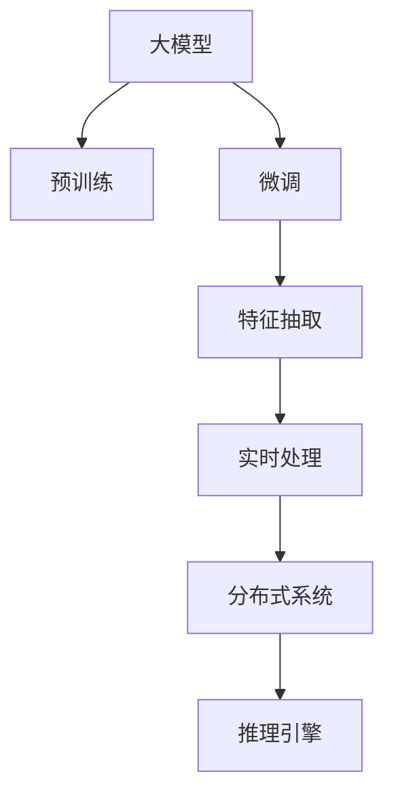

                 

# AI 大模型在电商搜索推荐中的实时处理技术：应对大规模数据的挑战

## 1. 背景介绍

### 1.1 问题由来
随着电子商务的迅猛发展，在线购物平台的搜索推荐系统成为了连接用户和商品的桥梁。如何准确理解用户需求，推荐符合其期望的商品，是电商搜索推荐系统面临的首要挑战。以往的推荐算法通常依赖于手工规则或简单的统计方法，无法适应日益复杂的数据环境。近年来，大模型技术在自然语言处理(NLP)领域取得了显著进展，其强大的自然语言理解能力为电商搜索推荐系统注入了新的活力。

然而，大规模电商搜索数据集具有高维度、非结构化等特点，使得大模型在实时处理和推理方面面临巨大的计算压力。如何在大模型基础上构建高效、实时的搜索推荐系统，需要从数据、模型、算法、架构等多个层面进行综合优化。

### 1.2 问题核心关键点
1. **数据规模巨大**：电商搜索推荐系统需要处理海量用户行为数据，数据量以亿计。如何在保持数据质量的同时，快速进行实时处理和推理，是亟需解决的问题。
2. **用户意图复杂多变**：用户搜索意图受时间、情境、情绪等多重因素影响，导致搜索查询的语义复杂度增加。如何准确理解用户意图，提供个性化推荐，是挑战之一。
3. **实时性要求高**：电商推荐系统需要实时响应用户搜索查询，必须在毫秒级时间内完成搜索结果的计算和输出。
4. **模型高效性**：大规模预训练语言模型参数量巨大，实时推理开销大。如何优化模型结构和推理过程，减小计算成本，是另一个关键点。

### 1.3 问题研究意义
研究大模型在电商搜索推荐中的实时处理技术，对于提升用户购物体验、提高商家商品曝光率、优化搜索推荐系统的整体性能具有重要意义：

1. **提升用户体验**：通过实时处理，提供个性化的搜索结果，使用户快速找到心仪商品，减少搜索时间。
2. **提高商家曝光率**：通过精准推荐，将优质商品推荐给潜在买家，提高商品曝光率和销售转化率。
3. **优化系统性能**：通过算法优化和架构设计，提升系统响应速度和稳定性，适应电商搜索推荐系统的实时性要求。
4. **降低开发成本**：利用大模型和大规模语料，可以大幅减少特征工程和算法调参的复杂度，缩短系统开发周期。
5. **推动技术创新**：实时处理技术的发展促进了对大模型算法和架构的新研究，推动了NLP领域的技术创新。

## 2. 核心概念与联系

### 2.1 核心概念概述

为了更好地理解大模型在电商搜索推荐中的实时处理技术，本节将介绍几个关键概念：

- **大模型(Big Model)**：指参数量庞大、能够处理大规模数据和复杂任务的深度学习模型。常见的有BERT、GPT、Transformer等。
- **搜索推荐系统(Recommender System)**：通过分析用户行为数据，推荐符合用户兴趣的商品。典型的搜索推荐系统包括TensorFlow Embedding和Keras。
- **实时处理(Real-time Processing)**：指在数据到达系统时，能够实时进行处理和响应的能力。
- **推理引擎(Inference Engine)**：用于高效计算和推理的引擎，如ONNX Runtime和TensorRT。
- **分布式系统(Distributed System)**：通过多台计算资源协同工作，提升系统的计算能力和响应速度。

这些核心概念之间的逻辑关系可以通过以下Mermaid流程图来展示：



这个流程图展示了从预训练、微调到大模型在电商搜索推荐中的实时处理过程：

1. 大模型通过预训练获得基础能力。
2. 在大模型基础上进行微调，以适应电商搜索推荐的任务需求。
3. 微调后的模型进行特征抽取，提取用户行为特征。
4. 特征数据输入实时处理系统，进行高效计算和推理。
5. 分布式系统提升计算效率，满足实时性要求。
6. 推理引擎高效计算，输出实时搜索结果。

## 3. 核心算法原理 & 具体操作步骤

### 3.1 算法原理概述

大模型在电商搜索推荐中的实时处理技术，本质上是将大规模预训练语言模型作为基础模型，通过微调优化和分布式推理引擎，实现对用户搜索查询的高效处理。

形式化地，假设预训练语言模型为 $M_{\theta}$，其中 $\theta$ 为预训练得到的模型参数。电商搜索推荐系统将用户查询 $q$ 和商品信息 $I$ 作为输入，微调后的模型 $M_{\hat{\theta}}$ 通过如下过程输出搜索结果：

1. 对用户查询进行预处理，如分词、向量化等，生成查询表示 $q'$。
2. 对商品信息进行特征抽取，生成商品表示 $I'$。
3. 使用微调后的模型 $M_{\hat{\theta}}$ 计算查询和商品的相似度 $s(q',I')$。
4. 根据相似度排序，生成推荐列表。

### 3.2 算法步骤详解

大模型在电商搜索推荐中的实时处理步骤如下：

**Step 1: 数据预处理**
- 对用户查询和商品信息进行预处理，生成适合模型输入的格式。
- 例如，将查询和商品标题进行分词，转换为向量表示。

**Step 2: 特征提取**
- 对预处理后的数据进行特征抽取，生成模型所需的输入。
- 常用的特征提取方法包括词袋模型、TF-IDF、Word2Vec等。

**Step 3: 模型微调**
- 在大模型基础上进行微调，调整模型参数以适应电商搜索推荐的任务需求。
- 微调过程包括选择合适的优化器、设置学习率、确定冻结预训练参数等。

**Step 4: 分布式推理**
- 将微调后的模型部署到分布式系统中，利用多台计算资源进行并行计算。
- 常用的分布式系统包括Apache Spark、Hadoop等。

**Step 5: 推理引擎优化**
- 使用推理引擎对模型进行优化，提高计算效率和响应速度。
- 例如，使用TensorRT对模型进行优化，支持混合精度计算、动态调整资源等。

**Step 6: 输出结果**
- 将推理结果转化为搜索结果，并输出给用户。

### 3.3 算法优缺点

大模型在电商搜索推荐中的实时处理技术具有以下优点：
1. **准确性高**：大模型具备强大的自然语言理解能力，能够准确理解用户查询意图，提供精准推荐。
2. **实时性高**：分布式系统和高性能推理引擎能够满足电商推荐系统的实时性要求，实现毫秒级响应。
3. **可扩展性强**：通过分布式系统，可以轻松扩展计算资源，支持大规模数据处理。
4. **适用性强**：适用于各种电商搜索推荐场景，包括新用户推荐、热销商品推荐、个性化推荐等。

同时，该方法也存在一些局限性：
1. **计算成本高**：大模型的计算开销大，部署成本较高。
2. **模型复杂**：大模型的结构复杂，优化和调试难度大。
3. **数据质量要求高**：对用户行为数据的收集和处理要求较高，数据质量直接影响推荐效果。
4. **隐私和安全问题**：用户行为数据涉及隐私，需要采取严格的隐私保护和安全措施。

尽管存在这些局限性，但就目前而言，基于大模型的电商搜索推荐系统是提升用户购物体验和商家收益的重要手段。未来相关研究将集中在如何降低计算成本、提高模型可解释性、增强隐私保护等方面。

### 3.4 算法应用领域

大模型在电商搜索推荐中的应用，已经在多个领域取得了显著效果，例如：

- **商品搜索**：通过大模型对用户查询和商品信息进行匹配，提供精确的商品搜索结果。
- **个性化推荐**：分析用户历史行为数据，提供符合其兴趣的个性化商品推荐。
- **新用户引导**：根据新用户的浏览和搜索行为，推荐相关商品，促进用户转化。
- **实时营销**：根据用户行为数据，实时推送个性化营销信息，提升用户购物体验。

除了上述这些应用场景，大模型在电商搜索推荐领域还将不断扩展，如智能客服、库存管理、供应链优化等，为电商平台的运营带来新的机遇。

## 4. 数学模型和公式 & 详细讲解 & 举例说明

### 4.1 数学模型构建

本节将使用数学语言对大模型在电商搜索推荐中的实时处理过程进行更加严格的刻画。

假设电商推荐系统接收用户查询 $q$ 和商品信息 $I$，系统模型为 $M_{\hat{\theta}}$，其输出为推荐列表 $L$。查询 $q$ 经过预处理得到 $q'$，商品信息 $I$ 经过特征抽取得到 $I'$。模型输出的相似度 $s(q',I')$ 为：

$$
s(q',I') = M_{\hat{\theta}}(q', I')
$$

其中 $M_{\hat{\theta}}$ 为微调后的模型，通过前向传播计算输出相似度 $s(q',I')$。

### 4.2 公式推导过程

以下我们以商品推荐为例，推导大模型在电商搜索推荐中的实时处理公式。

假设用户查询 $q$ 和商品信息 $I$ 经过预处理和特征提取后，生成查询表示 $q'$ 和商品表示 $I'$。微调后的模型 $M_{\hat{\theta}}$ 计算查询和商品的相似度 $s(q',I')$，并根据相似度排序，生成推荐列表 $L$。具体过程如下：

1. **查询表示生成**：将用户查询 $q$ 进行分词、向量化等预处理，生成查询表示 $q'$。
2. **商品表示生成**：将商品信息 $I$ 进行特征抽取，生成商品表示 $I'$。
3. **相似度计算**：使用微调后的模型 $M_{\hat{\theta}}$ 计算相似度 $s(q',I')$。
4. **排序输出**：根据相似度 $s(q',I')$ 对商品进行排序，生成推荐列表 $L$。

假设查询和商品信息分别用 $d_q$ 和 $d_I$ 表示，则相似度 $s(q',I')$ 的计算公式为：

$$
s(q',I') = M_{\hat{\theta}}(q', I') = M_{\hat{\theta}}(d_q, d_I)
$$

其中 $d_q$ 和 $d_I$ 为查询表示和商品表示。

### 4.3 案例分析与讲解

以用户搜索“手机”为例，分析大模型在电商搜索推荐中的实时处理过程：

1. **查询表示生成**：将查询“手机”进行分词、向量化，生成查询表示 $q'$。
2. **商品表示生成**：从电商商品库中提取与查询相关的商品信息，进行特征抽取，生成商品表示 $I'$。
3. **相似度计算**：使用微调后的模型 $M_{\hat{\theta}}$ 计算查询和商品的相似度 $s(q',I')$。
4. **排序输出**：根据相似度 $s(q',I')$ 对商品进行排序，生成推荐列表 $L$。

假设查询表示 $q'$ 和商品表示 $I'$ 分别为向量形式，则相似度 $s(q',I')$ 的计算公式可以表示为：

$$
s(q',I') = M_{\hat{\theta}}(q', I') = \sum_{i=1}^n w_i \cdot \hat{v}_i^T \cdot d_q \cdot d_I
$$

其中 $w_i$ 为权重，$\hat{v}_i$ 为模型输出的向量表示，$n$ 为模型的输出维度。

## 5. 项目实践：代码实例和详细解释说明

### 5.1 开发环境搭建

在进行实时处理实践前，我们需要准备好开发环境。以下是使用Python进行TensorFlow和Keras开发的开发环境配置流程：

1. 安装Anaconda：从官网下载并安装Anaconda，用于创建独立的Python环境。

2. 创建并激活虚拟环境：
```bash
conda create -n tf-env python=3.8 
conda activate tf-env
```

3. 安装TensorFlow和Keras：
```bash
pip install tensorflow==2.7.0
pip install keras
```

4. 安装各类工具包：
```bash
pip install numpy pandas scikit-learn matplotlib tqdm jupyter notebook ipython
```

完成上述步骤后，即可在`tf-env`环境中开始实时处理实践。

### 5.2 源代码详细实现

下面我们以商品推荐为例，给出使用TensorFlow和Keras进行大模型在电商搜索推荐中实时处理的PyTorch代码实现。

首先，定义模型输入和输出：

```python
from tensorflow.keras.layers import Input, Embedding, Dense
from tensorflow.keras.models import Model

# 定义输入层
query_input = Input(shape=(sequence_length,), name='query')
item_input = Input(shape=(sequence_length,), name='item')

# 定义嵌入层
query_embedding = Embedding(input_dim=vocab_size, output_dim=embedding_dim, name='query_embedding')(query_input)
item_embedding = Embedding(input_dim=vocab_size, output_dim=embedding_dim, name='item_embedding')(item_input)

# 定义全连接层
dense1 = Dense(units=hidden_size, activation='relu')(query_embedding)
dense1 = Dense(units=hidden_size, activation='relu')(item_embedding)

# 定义输出层
output = Dense(units=num_items, activation='softmax', name='output')(dense1)

# 构建模型
model = Model(inputs=[query_input, item_input], outputs=output)
```

然后，定义优化器和损失函数：

```python
from tensorflow.keras.optimizers import Adam

# 设置优化器
optimizer = Adam(lr=learning_rate)

# 设置损失函数
loss_function = 'categorical_crossentropy'
```

接着，定义训练和评估函数：

```python
from tensorflow.keras.callbacks import EarlyStopping

# 定义训练函数
def train_epoch(model, train_dataset, batch_size, optimizer):
    model.compile(optimizer=optimizer, loss=loss_function, metrics=['accuracy'])
    model.fit(x=train_dataset, batch_size=batch_size, epochs=num_epochs, callbacks=[EarlyStopping(patience=5)])

# 定义评估函数
def evaluate(model, test_dataset, batch_size):
    test_loss, test_acc = model.evaluate(x=test_dataset, batch_size=batch_size, verbose=0)
    print('Test loss:', test_loss)
    print('Test accuracy:', test_acc)
```

最后，启动训练流程并在测试集上评估：

```python
# 设置训练参数
sequence_length = 100
vocab_size = 10000
embedding_dim = 128
hidden_size = 256
num_items = 1000
learning_rate = 0.001
num_epochs = 10

# 加载数据集
train_dataset = ...
test_dataset = ...

# 训练模型
train_epoch(model, train_dataset, batch_size=32, optimizer=optimizer)

# 在测试集上评估模型
evaluate(model, test_dataset, batch_size=32)
```

以上就是使用TensorFlow和Keras对大模型在电商搜索推荐中实时处理的完整代码实现。可以看到，TensorFlow和Keras的高级API使得模型构建和训练过程非常简洁高效。

### 5.3 代码解读与分析

让我们再详细解读一下关键代码的实现细节：

**定义模型输入和输出**：
- 使用Keras的`Input`层定义查询和商品输入，并设置序列长度和词汇表大小。
- 使用`Embedding`层将输入转换为向量表示，并指定嵌入维度。
- 通过全连接层和激活函数进行特征映射。
- 使用`Dense`层输出推荐概率分布。

**定义优化器和损失函数**：
- 使用Keras的`Adam`优化器设置学习率。
- 选择适当的损失函数，如`categorical_crossentropy`。

**定义训练和评估函数**：
- 使用Keras的`EarlyStopping`回调，避免模型过拟合。
- 使用`model.compile`方法编译模型，设置优化器和损失函数。
- 使用`model.fit`方法进行模型训练，并设置批次大小和迭代轮数。
- 使用`model.evaluate`方法在测试集上评估模型性能。

**训练流程**：
- 设置模型参数，包括序列长度、词汇表大小、嵌入维度等。
- 加载训练和测试数据集。
- 调用训练函数`train_epoch`，进行模型训练。
- 调用评估函数`evaluate`，在测试集上评估模型性能。

可以看到，使用TensorFlow和Keras构建电商搜索推荐系统，不仅代码简洁，还具备高度的灵活性和可扩展性。开发者可以根据具体任务需求，快速实现和调试模型，提高开发效率。

当然，工业级的系统实现还需考虑更多因素，如模型的保存和部署、超参数的自动搜索、更灵活的任务适配层等。但核心的实时处理范式基本与此类似。

## 6. 实际应用场景

### 6.1 智能客服系统

基于大模型实时处理技术，可以构建智能客服系统，提升客户咨询体验。传统客服系统依赖人工客服，响应速度慢、处理效率低，且易出现误解和遗漏。智能客服系统通过大模型进行实时处理，能够快速响应客户咨询，准确理解用户意图，提供个性化的服务。

在技术实现上，可以收集客户咨询历史数据，将常见问题及其解决方案作为监督数据，在此基础上对预训练语言模型进行微调。微调后的模型能够自动分析客户咨询内容，匹配最合适的回答模板进行回复。对于客户提出的新问题，还可以接入检索系统实时搜索相关内容，动态组织生成回答。如此构建的智能客服系统，能大幅提升客户咨询体验和问题解决效率。

### 6.2 个性化推荐系统

传统的推荐系统通常依赖于手工规则或简单的统计方法，难以适应日益复杂的数据环境。基于大模型的实时处理技术，能够构建高效、实时的个性化推荐系统，提升推荐效果和用户满意度。

在具体实现中，可以收集用户历史行为数据，提取和商品相关的文本信息，如商品描述、用户评论等。将文本信息作为模型输入，用户的后续行为作为监督信号，在此基础上微调预训练语言模型。微调后的模型能够从文本内容中准确把握用户的兴趣点，结合用户行为数据，生成个性化的推荐结果。通过实时处理，能够根据用户当前行为实时调整推荐策略，提升推荐准确性。

### 6.3 实时营销系统

实时营销系统通过分析用户行为数据，实时推送个性化营销信息，提升用户购物体验。利用大模型进行实时处理，能够快速分析用户行为，识别出潜在购买意向，推送符合用户兴趣的商品广告。

在具体实现中，可以收集用户浏览、点击、购买等行为数据，提取和商品相关的文本信息。将文本信息作为模型输入，用户的后续行为作为监督信号，在此基础上微调预训练语言模型。微调后的模型能够从文本内容中准确把握用户的兴趣点，结合行为数据，实时生成个性化的营销信息。通过实时处理，能够根据用户当前行为实时调整营销策略，提高营销效果。

### 6.4 未来应用展望

随着大模型和实时处理技术的不断发展，基于大模型的电商搜索推荐系统将得到更广泛的应用，为电商平台的运营带来新的机遇：

1. **多模态推荐**：结合视觉、音频等多模态数据，提升推荐系统的多样性和准确性。例如，通过视频分析用户情感，生成更符合情感需求的推荐结果。
2. **深度学习融合**：结合深度学习和传统统计方法，提升推荐系统的复杂度和准确性。例如，结合序列模型、协同过滤等方法，生成更加全面、准确的推荐结果。
3. **动态推荐引擎**：根据用户实时行为数据，动态调整推荐策略，提高推荐效果。例如，通过实时学习，调整商品权重和推荐算法。
4. **跨平台推荐**：构建跨平台推荐系统，提升用户在不同平台上的购物体验。例如，通过跨平台数据共享，实现商品跨平台推荐。

未来，大模型实时处理技术将在更多领域得到应用，为各行各业带来新的变革。

## 7. 工具和资源推荐

### 7.1 学习资源推荐

为了帮助开发者系统掌握大模型在电商搜索推荐中的实时处理技术，这里推荐一些优质的学习资源：

1. **《Deep Learning with TensorFlow》系列书籍**：TensorFlow官方文档，详细介绍了TensorFlow的使用方法和最佳实践，是学习TensorFlow的好帮手。
2. **《Keras深度学习实战》书籍**：Keras官方文档，提供了Keras的高级API和实战案例，帮助开发者快速上手Keras。
3. **TensorFlow官方论坛**：提供丰富的社区支持和资源，帮助开发者解决技术难题。
4. **Keras官方文档**：提供详细的API文档和实战案例，帮助开发者快速上手Keras。
5. **TensorFlow DevSummit**：每年举办一次的深度学习开发者大会，提供前沿技术分享和社区交流机会。

通过对这些资源的学习实践，相信你一定能够快速掌握大模型在电商搜索推荐中的实时处理技术，并用于解决实际的电商问题。

### 7.2 开发工具推荐

高效的开发离不开优秀的工具支持。以下是几款用于大模型在电商搜索推荐中实时处理开发的常用工具：

1. **TensorFlow**：基于Python的开源深度学习框架，灵活动态的计算图，适合快速迭代研究。TensorFlow提供了丰富的API和工具包，支持高效计算和分布式推理。
2. **Keras**：高层次的深度学习框架，提供了简单易用的API，适合快速构建和调试模型。Keras的高级API能够简化模型构建和训练过程。
3. **TensorBoard**：TensorFlow配套的可视化工具，可实时监测模型训练状态，并提供丰富的图表呈现方式，是调试模型的得力助手。
4. **TensorRT**：NVIDIA推出的高性能推理引擎，支持混合精度计算、动态调整资源等，能够显著提升推理速度和资源利用率。
5. **ONNX Runtime**：微软推出的开源推理引擎，支持多种深度学习框架的模型部署，能够实现跨平台的高效推理。

合理利用这些工具，可以显著提升大模型在电商搜索推荐中的实时处理性能，加快创新迭代的步伐。

### 7.3 相关论文推荐

大模型在电商搜索推荐中的实时处理技术，源于学界的持续研究。以下是几篇奠基性的相关论文，推荐阅读：

1. **《GPT-3: Language Models are Unsupervised Multitask Learners》**：展示了GPT-3的强大zero-shot学习能力，引发了对于通用人工智能的新一轮思考。
2. **《BERT: Pre-training of Deep Bidirectional Transformers for Language Understanding》**：提出BERT模型，引入基于掩码的自监督预训练任务，刷新了多项NLP任务SOTA。
3. **《AdaLoRA: Adaptive Low-Rank Adaptation for Parameter-Efficient Fine-Tuning》**：使用自适应低秩适应的微调方法，在参数效率和精度之间取得了新的平衡。
4. **《Prompt-based Transfer Learning for Small-Scale Text Classification》**：引入基于连续型Prompt的微调范式，为如何充分利用预训练知识提供了新的思路。
5. **《Recommender System Technology in AI》**：综述了推荐系统的最新进展，包括基于大模型的推荐方法。

这些论文代表了大模型实时处理技术的发展脉络。通过学习这些前沿成果，可以帮助研究者把握学科前进方向，激发更多的创新灵感。

## 8. 总结：未来发展趋势与挑战

### 8.1 总结

本文对大模型在电商搜索推荐中的实时处理技术进行了全面系统的介绍。首先阐述了大模型和实时处理技术的背景和意义，明确了实时处理在提升用户购物体验、提高商家商品曝光率、优化搜索推荐系统整体性能方面的重要作用。其次，从原理到实践，详细讲解了大模型在电商搜索推荐中的实时处理过程，给出了微调和分布式推理的完整代码实现。同时，本文还广泛探讨了大模型在电商搜索推荐系统的应用场景，展示了其巨大的应用潜力。

通过本文的系统梳理，可以看到，基于大模型的实时处理技术正在成为电商搜索推荐系统的重要范式，极大地提升了用户购物体验和商家收益。未来，随着大模型和实时处理技术的持续演进，基于大模型的电商搜索推荐系统将得到更广泛的应用，为电商平台的运营带来新的机遇。

### 8.2 未来发展趋势

展望未来，大模型在电商搜索推荐中的实时处理技术将呈现以下几个发展趋势：

1. **多模态融合**：结合视觉、音频等多模态数据，提升推荐系统的多样性和准确性。例如，通过视频分析用户情感，生成更符合情感需求的推荐结果。
2. **深度学习融合**：结合深度学习和传统统计方法，提升推荐系统的复杂度和准确性。例如，结合序列模型、协同过滤等方法，生成更加全面、准确的推荐结果。
3. **动态推荐引擎**：根据用户实时行为数据，动态调整推荐策略，提高推荐效果。例如，通过实时学习，调整商品权重和推荐算法。
4. **跨平台推荐**：构建跨平台推荐系统，提升用户在不同平台上的购物体验。例如，通过跨平台数据共享，实现商品跨平台推荐。

这些趋势展示了实时处理技术在电商搜索推荐系统中的广阔前景，未来将为电商平台的运营带来更多创新和机遇。

### 8.3 面临的挑战

尽管大模型在电商搜索推荐中的实时处理技术已经取得了显著进展，但在迈向更加智能化、普适化应用的过程中，仍面临诸多挑战：

1. **计算成本高**：大模型的计算开销大，部署成本较高。如何在保持模型效果的同时，降低计算成本，是一个重要挑战。
2. **模型复杂**：大模型的结构复杂，优化和调试难度大。如何设计更高效的模型结构，是一个重要研究方向。
3. **数据质量要求高**：对用户行为数据的收集和处理要求较高，数据质量直接影响推荐效果。
4. **隐私和安全问题**：用户行为数据涉及隐私，需要采取严格的隐私保护和安全措施。
5. **模型鲁棒性不足**：面对域外数据时，模型的泛化性能可能大打折扣。如何提高模型的鲁棒性，是一个重要研究方向。

尽管存在这些挑战，但通过技术创新和算法优化，相信大模型实时处理技术将不断突破瓶颈，为电商平台的运营带来更多创新和机遇。

### 8.4 研究展望

面对大模型实时处理技术面临的挑战，未来的研究需要在以下几个方面寻求新的突破：

1. **多模态融合**：结合视觉、音频等多模态数据，提升推荐系统的多样性和准确性。例如，通过视频分析用户情感，生成更符合情感需求的推荐结果。
2. **深度学习融合**：结合深度学习和传统统计方法，提升推荐系统的复杂度和准确性。例如，结合序列模型、协同过滤等方法，生成更加全面、准确的推荐结果。
3. **动态推荐引擎**：根据用户实时行为数据，动态调整推荐策略，提高推荐效果。例如，通过实时学习，调整商品权重和推荐算法。
4. **跨平台推荐**：构建跨平台推荐系统，提升用户在不同平台上的购物体验。例如，通过跨平台数据共享，实现商品跨平台推荐。
5. **隐私保护**：采用隐私保护技术，如差分隐私、联邦学习等，保护用户隐私，提升数据安全性。
6. **模型鲁棒性**：通过对抗训练、正则化等方法，提高模型的鲁棒性，使其在域外数据上也能保持稳定的性能。

这些研究方向的探索，必将引领大模型实时处理技术迈向更高的台阶，为构建安全、可靠、可解释、可控的智能系统铺平道路。面向未来，实时处理技术还需要与其他人工智能技术进行更深入的融合，如知识表示、因果推理、强化学习等，多路径协同发力，共同推动NLP领域的技术创新。只有勇于创新、敢于突破，才能不断拓展大模型在电商搜索推荐系统中的边界，让智能技术更好地造福人类社会。

## 9. 附录：常见问题与解答

**Q1：电商搜索推荐系统面临哪些技术挑战？**

A: 电商搜索推荐系统面临的主要技术挑战包括：
1. 数据规模巨大，如何在大规模数据上高效进行实时处理和推理。
2. 用户意图复杂多变，如何准确理解用户查询意图，提供个性化推荐。
3. 实时性要求高，如何保证系统在毫秒级时间内完成计算和输出。
4. 模型高效性，如何优化模型结构和推理过程，减小计算成本。

这些挑战需要从数据、模型、算法、架构等多个层面进行综合优化，才能构建高效、实时的电商搜索推荐系统。

**Q2：大模型在电商搜索推荐系统中的实时处理如何实现？**

A: 大模型在电商搜索推荐系统中的实时处理主要通过以下几个步骤实现：
1. 数据预处理，对用户查询和商品信息进行预处理，生成适合模型输入的格式。
2. 特征提取，对预处理后的数据进行特征抽取，生成模型所需的输入。
3. 模型微调，在大模型基础上进行微调，调整模型参数以适应电商搜索推荐的任务需求。
4. 分布式推理，将微调后的模型部署到分布式系统中，利用多台计算资源进行并行计算。
5. 推理引擎优化，使用推理引擎对模型进行优化，提高计算效率和响应速度。

通过以上步骤，大模型能够高效、实时地处理电商搜索推荐系统的用户查询，提供个性化的推荐结果。

**Q3：大模型在电商搜索推荐系统中的计算成本如何优化？**

A: 大模型在电商搜索推荐系统中的计算成本优化主要通过以下几个方法实现：
1. 使用分布式系统，如Apache Spark、Hadoop等，提升计算效率，降低计算成本。
2. 使用高性能推理引擎，如TensorRT、ONNX Runtime等，提升推理速度，优化资源占用。
3. 使用模型压缩技术，如参数剪枝、量化等，减小模型大小，降低计算开销。
4. 使用混合精度计算，如使用FP16代替FP32，提升计算效率，降低计算成本。
5. 使用模型裁剪技术，去除不必要的层和参数，减小模型尺寸，加快推理速度。

通过以上方法，可以显著降低大模型在电商搜索推荐系统中的计算成本，提升系统性能。

**Q4：大模型在电商搜索推荐系统中的隐私和安全问题如何解决？**

A: 大模型在电商搜索推荐系统中的隐私和安全问题主要通过以下几个方法解决：
1. 采用差分隐私技术，如加噪、随机化等方法，保护用户隐私。
2. 使用联邦学习技术，将模型训练过程分布到多台设备上，不共享原始数据。
3. 采用安全多方计算技术，确保数据在分布式系统中安全传输和存储。
4. 使用访问控制技术，限制数据的访问权限，确保数据安全性。
5. 使用隐私保护算法，如K-匿名、L-diversity等方法，保护用户隐私。

通过以上方法，可以确保大模型在电商搜索推荐系统中的隐私和安全，保障用户数据的安全性和合法性。

**Q5：大模型在电商搜索推荐系统中的实时处理如何提升用户体验？**

A: 大模型在电商搜索推荐系统中的实时处理主要通过以下几个方法提升用户体验：
1. 提供个性化的搜索结果，根据用户历史行为和当前查询，生成符合用户兴趣的商品推荐。
2. 实时响应用户查询，在毫秒级时间内完成搜索结果的计算和输出，提升用户体验。
3. 实时调整推荐策略，根据用户实时行为数据，动态生成推荐结果，提高推荐效果。
4. 结合多模态数据，提升推荐系统的多样性和准确性，使用户获得更加全面、精准的推荐结果。
5. 使用可视化和交互式界面，让用户更直观地了解推荐结果，提升用户满意度。

通过以上方法，大模型能够显著提升电商搜索推荐系统的用户体验，增强用户对系统的粘性和信任度。

---

作者：禅与计算机程序设计艺术 / Zen and the Art of Computer Programming

