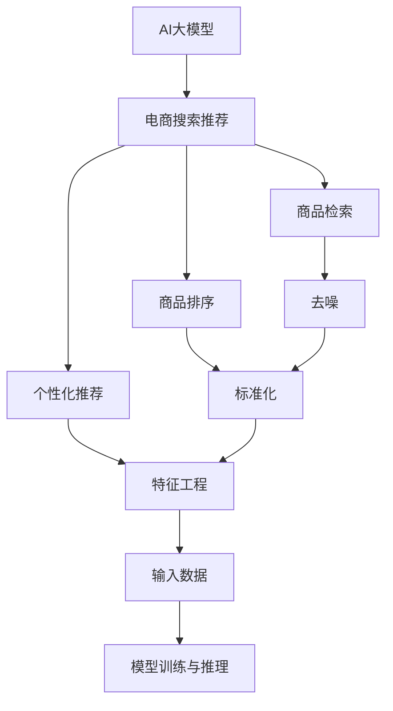

                 

# AI 大模型在电商搜索推荐中的数据处理能力要求：应对大规模实时数据处理

> 关键词：大数据, 电商搜索, 推荐系统, 实时处理, AI大模型, 数据处理能力, 高性能计算

## 1. 背景介绍

在数字化转型浪潮中，电商企业正通过大数据和AI技术，不断提升用户体验和业务效率。AI大模型在电商搜索推荐中扮演着至关重要的角色，通过学习和分析海量用户行为数据，预测用户偏好，为用户推荐商品，从而提升转化率和满意度。

然而，随着电商平台用户基数的不断增长，数据量呈指数级增长。如何在大数据环境中高效、准确地处理数据，构建高性能的搜索推荐系统，是电商企业在AI应用中亟需解决的核心问题。

## 2. 核心概念与联系

### 2.1 核心概念概述

为更好地理解AI大模型在电商搜索推荐中的应用，本节将介绍几个关键概念：

- AI大模型：以自回归(如GPT)或自编码(如BERT)模型为代表的大规模预训练语言模型。通过在大规模无标签文本语料上进行预训练，学习通用的语言表示，具备强大的语言理解和生成能力。

- 电商搜索推荐：基于用户历史行为数据，利用AI大模型进行商品推荐，提升用户体验和销售效率。电商搜索推荐通常包含商品检索、商品排序、个性化推荐等子任务。

- 实时处理：指在数据生成过程中，立即对数据进行处理、分析和决策的过程。实时处理要求系统具备高并发、低延迟、高吞吐量的能力。

- 高性能计算：使用高效计算架构，如GPU、TPU等，加速数据处理、模型训练和推理的过程。高性能计算通常使用分布式系统来实现。

- 数据预处理：在数据进入模型前，进行去噪、标准化、特征工程等处理，提高数据质量，增强模型效果。

这些概念之间的逻辑关系可以通过以下Mermaid流程图来展示：



这个流程图展示了大模型在电商搜索推荐中的核心概念及其之间的联系：

1. AI大模型通过预训练获得基础能力。
2. 电商搜索推荐系统包括商品检索、商品排序、个性化推荐等多个子任务。
3. 实时处理要求系统具备高并发、低延迟、高吞吐量的能力。
4. 高性能计算通过使用高效计算架构，加速数据处理、模型训练和推理。
5. 数据预处理通过去噪、标准化、特征工程等方法，提高数据质量。
6. 处理后的数据输入模型进行训练与推理，实现电商搜索推荐功能。

## 3. 核心算法原理 & 具体操作步骤

### 3.1 算法原理概述

AI大模型在电商搜索推荐中的应用，本质上是利用大模型的强大语言表示能力，通过学习用户的历史行为数据，预测用户未来行为，从而实现商品推荐。

形式化地，假设电商搜索推荐系统为 $S$，用户的历史行为数据为 $D=\{(x_i,y_i)\}_{i=1}^N$，其中 $x_i$ 为用户的历史行为数据，$y_i$ 为用户后续的操作（如点击、购买、浏览等）。通过有监督地训练 $S$，使其最大化地预测 $y_i$，即：

$$
\max_{S} \sum_{i=1}^N P(y_i|x_i)
$$

其中 $P$ 表示条件概率，$S$ 通过大模型进行训练，以获得最佳的推荐性能。

### 3.2 算法步骤详解

AI大模型在电商搜索推荐中的应用，通常包括以下几个关键步骤：

**Step 1: 数据准备与预处理**
- 收集用户的历史行为数据，包括浏览、点击、购买等行为。
- 对数据进行去噪、标准化、特征工程等预处理，提高数据质量。
- 将处理后的数据划分为训练集、验证集和测试集。

**Step 2: 模型设计与训练**
- 选择合适的大模型（如BERT、GPT等）进行微调，学习用户行为与商品推荐之间的关系。
- 设计任务适配层，根据电商搜索推荐任务特点，添加分类器、排序器、推荐器等子模块。
- 在训练集上使用优化器（如AdamW、SGD等）进行训练，最小化损失函数。

**Step 3: 实时处理与推理**
- 在电商搜索推荐系统中，实时处理用户输入的查询请求，提取关键信息。
- 将提取的信息输入模型进行推理，得到推荐商品列表。
- 对推荐列表进行排序、过滤等处理，最终输出推荐结果。

**Step 4: 系统优化与部署**
- 对实时处理和推理过程进行性能优化，如使用缓存、负载均衡等技术。
- 部署优化后的系统到生产环境，提供稳定、高效的电商搜索推荐服务。
- 定期在测试集上评估系统性能，根据反馈进行调整和优化。

### 3.3 算法优缺点

AI大模型在电商搜索推荐中的应用，具有以下优点：

1. 精度高：大模型通过预训练学习大量通用语言知识，能够高效处理和理解电商领域的复杂语义。
2. 适用性强：大模型能够应用于多种电商任务，包括商品检索、商品排序、个性化推荐等。
3. 可扩展性：大模型可以轻松适配不同的业务场景，通过微调训练不同任务的模型。
4. 实时性：利用高性能计算架构，实时处理用户输入，快速返回推荐结果。

同时，该方法也存在一定的局限性：

1. 对标注数据依赖强：电商搜索推荐依赖大量的标注数据，收集和标注成本较高。
2. 模型复杂度高：大模型参数量庞大，训练和推理耗时较多。
3. 安全风险高：大模型可能学习到有害信息，需要仔细筛选和过滤。
4. 算法复杂度高：电商搜索推荐涉及多种子任务，算法设计复杂。

尽管存在这些局限性，但就目前而言，AI大模型在电商搜索推荐中的应用仍是主流范式，并不断推动电商平台的智能化进程。

### 3.4 算法应用领域

AI大模型在电商搜索推荐中的应用，已经覆盖了各大电商平台的多个业务环节，例如：

- 商品检索：利用大模型进行商品匹配，快速定位用户所需商品。
- 商品排序：通过学习用户行为数据，动态调整商品排序规则，提升用户体验。
- 个性化推荐：根据用户历史行为和实时查询，生成个性化推荐列表，提升转化率。
- 广告推荐：利用大模型预测用户行为，推荐合适广告，提升广告投放效果。
- 用户评价：通过大模型分析用户评论，生成情感分析结果，指导商家优化商品和服务。

这些应用场景展示了AI大模型在电商搜索推荐中的强大能力和广阔前景。未来，随着技术的发展和应用的深入，大模型将在电商领域发挥更加重要的作用。

## 4. 数学模型和公式 & 详细讲解 & 举例说明

### 4.1 数学模型构建

本节将使用数学语言对AI大模型在电商搜索推荐中的应用进行更加严格的刻画。

记电商搜索推荐系统为 $S$，用户历史行为数据为 $D=\{(x_i,y_i)\}_{i=1}^N$，其中 $x_i \in \mathbb{R}^d$ 为特征向量，$y_i \in \{0,1\}$ 为标签（1表示购买，0表示未购买）。假设 $S$ 通过微调获得模型参数 $\theta$，则目标为：

$$
\max_{\theta} \sum_{i=1}^N P(y_i|x_i) = \max_{\theta} \sum_{i=1}^N \log P(y_i|x_i)
$$

通过最大化目标函数，最小化损失函数，即可得到优化模型 $S_{\theta}$，用于电商搜索推荐。

### 4.2 公式推导过程

以下我们以商品排序任务为例，推导基于大模型的电商搜索推荐模型的损失函数。

假设模型 $S_{\theta}$ 在输入 $x_i$ 上的预测为 $y_i=1$，真实标签 $y_i$ 的负对数似然损失为：

$$
\ell(y_i, y_i') = -y_i \log y_i' - (1-y_i) \log (1-y_i')
$$

其中 $y_i'$ 为模型预测的标签。

定义模型 $S_{\theta}$ 在数据集 $D$ 上的经验风险为：

$$
\mathcal{L}(\theta) = \frac{1}{N} \sum_{i=1}^N \ell(y_i, S_{\theta}(x_i))
$$

通过梯度下降等优化算法，最小化经验风险，即可得到优化模型 $S_{\theta}$。

在实际应用中，大模型的输出通常需要经过多次层级映射，通过激活函数、归一化等操作，最终输出概率分布，具体推导过程较为复杂。

### 4.3 案例分析与讲解

**案例：电商平台商品推荐系统**

假设某电商平台的用户历史行为数据 $D=\{(x_i,y_i)\}_{i=1}^N$，其中 $x_i$ 为用户浏览过的商品列表，$y_i$ 为用户是否购买了该商品。使用大模型对 $D$ 进行微调，得到电商推荐模型 $S_{\theta}$。

**步骤：**
1. 收集用户历史浏览数据，包括商品名称、价格、评分等信息，作为模型输入 $x_i$。
2. 设计任务适配层，添加分类器、排序器、推荐器等子模块。
3. 在训练集上使用优化器（如AdamW、SGD等）进行训练，最小化损失函数。
4. 在电商搜索推荐系统中，实时处理用户输入的查询请求，提取关键信息。
5. 将提取的信息输入模型进行推理，得到推荐商品列表。
6. 对推荐列表进行排序、过滤等处理，最终输出推荐结果。

## 5. 项目实践：代码实例和详细解释说明

### 5.1 开发环境搭建

在进行电商搜索推荐开发前，我们需要准备好开发环境。以下是使用Python进行PyTorch开发的环境配置流程：

1. 安装Anaconda：从官网下载并安装Anaconda，用于创建独立的Python环境。

2. 创建并激活虚拟环境：
```bash
conda create -n pytorch-env python=3.8 
conda activate pytorch-env
```

3. 安装PyTorch：根据CUDA版本，从官网获取对应的安装命令。例如：
```bash
conda install pytorch torchvision torchaudio cudatoolkit=11.1 -c pytorch -c conda-forge
```

4. 安装Transformers库：
```bash
pip install transformers
```

5. 安装各类工具包：
```bash
pip install numpy pandas scikit-learn matplotlib tqdm jupyter notebook ipython
```

完成上述步骤后，即可在`pytorch-env`环境中开始电商搜索推荐系统的开发。

### 5.2 源代码详细实现

这里我们以商品排序任务为例，给出使用Transformers库对BERT模型进行微调的PyTorch代码实现。

首先，定义商品排序任务的模型类：

```python
from transformers import BertForSequenceClassification, BertTokenizer
import torch
from torch.utils.data import Dataset

class ProductRankingModel(BertForSequenceClassification):
    def __init__(self, num_labels):
        super(ProductRankingModel, self).__init__.from_pretrained('bert-base-uncased', num_labels=num_labels)

    def forward(self, input_ids, attention_mask=None):
        outputs = super().forward(input_ids=input_ids, attention_mask=attention_mask)
        return outputs.logits
```

然后，定义数据处理函数：

```python
class ProductDataset(Dataset):
    def __init__(self, data, tokenizer, max_len=128):
        self.data = data
        self.tokenizer = tokenizer
        self.max_len = max_len

    def __len__(self):
        return len(self.data)

    def __getitem__(self, idx):
        text = self.data[idx]['text']
        label = self.data[idx]['label']
        encoding = self.tokenizer(text, truncation=True, max_length=self.max_len, padding='max_length', return_tensors='pt')
        input_ids = encoding['input_ids']
        attention_mask = encoding['attention_mask']
        return {'input_ids': input_ids, 'attention_mask': attention_mask, 'label': torch.tensor(label, dtype=torch.long)}
```

接着，定义模型训练函数：

```python
def train_epoch(model, data_loader, optimizer, device):
    model.train()
    epoch_loss = 0
    for batch in data_loader:
        input_ids = batch['input_ids'].to(device)
        attention_mask = batch['attention_mask'].to(device)
        labels = batch['label'].to(device)
        optimizer.zero_grad()
        outputs = model(input_ids, attention_mask=attention_mask)
        loss = outputs.loss
        epoch_loss += loss.item()
        loss.backward()
        optimizer.step()
    return epoch_loss / len(data_loader)
```

最后，启动模型训练和评估流程：

```python
from transformers import AdamW

model = ProductRankingModel(num_labels=2)
tokenizer = BertTokenizer.from_pretrained('bert-base-uncased')
train_dataset = ProductDataset(train_data, tokenizer, max_len=128)
dev_dataset = ProductDataset(dev_data, tokenizer, max_len=128)
test_dataset = ProductDataset(test_data, tokenizer, max_len=128)

optimizer = AdamW(model.parameters(), lr=2e-5)
device = torch.device('cuda' if torch.cuda.is_available() else 'cpu')

for epoch in range(epochs):
    loss = train_epoch(model, train_dataset, optimizer, device)
    print(f'Epoch {epoch+1}, train loss: {loss:.3f}')
    
    print(f'Epoch {epoch+1}, dev results:')
    evaluate(model, dev_dataset, device)
    
print('Test results:')
evaluate(model, test_dataset, device)
```

以上就是使用PyTorch对BERT进行商品排序任务微调的完整代码实现。可以看到，得益于Transformers库的强大封装，我们可以用相对简洁的代码完成电商搜索推荐模型的开发。

### 5.3 代码解读与分析

让我们再详细解读一下关键代码的实现细节：

**ProductDataset类**：
- `__init__`方法：初始化数据、分词器等关键组件。
- `__len__`方法：返回数据集的样本数量。
- `__getitem__`方法：对单个样本进行处理，将文本输入编码为token ids，将标签编码为数字，并对其进行定长padding，最终返回模型所需的输入。

**ProductRankingModel类**：
- `__init__`方法：初始化模型，调用父类BertForSequenceClassification的from_pretrained方法，加载预训练模型并设置输出层的数量。
- `forward`方法：在前向传播过程中，输入特征和mask，输出预测结果。

**训练函数**：
- 在每个epoch内，对数据以批为单位进行迭代，在每个批次上前向传播计算loss并反向传播更新模型参数，最后返回该epoch的平均loss。

**训练和评估流程**：
- 定义总的epoch数和batch size，开始循环迭代
- 每个epoch内，先在训练集上训练，输出平均loss
- 在验证集上评估，输出分类指标
- 所有epoch结束后，在测试集上评估，给出最终测试结果

可以看到，PyTorch配合Transformers库使得电商搜索推荐模型的开发变得简洁高效。开发者可以将更多精力放在数据处理、模型改进等高层逻辑上，而不必过多关注底层的实现细节。

当然，工业级的系统实现还需考虑更多因素，如模型的保存和部署、超参数的自动搜索、更灵活的任务适配层等。但核心的电商搜索推荐范式基本与此类似。

## 6. 实际应用场景

### 6.1 智能客服

基于大模型的电商搜索推荐系统，可以广泛应用于智能客服的构建。智能客服系统能够实时处理用户查询，快速推荐商品，提升用户体验和响应速度。

在技术实现上，可以收集客户的历史查询和购买记录，将查询和商品信息作为监督数据，在此基础上对预训练模型进行微调。微调后的模型能够自动理解用户意图，匹配最合适的商品推荐，同时具备对话交互能力，可以回答用户的各种问题。如此构建的智能客服系统，能大幅提升客户咨询体验和问题解决效率。

### 6.2 个性化推荐

电商搜索推荐系统本质上是一种个性化推荐系统，通过学习用户的历史行为数据，预测用户未来行为，从而实现商品推荐。这种个性化推荐系统在电商领域已经得到了广泛的应用，覆盖了商品检索、商品排序、个性化推荐等众多任务。

在具体实现中，可以利用大模型对用户的行为数据进行学习和理解，根据用户的历史购买、浏览、收藏等行为，生成个性化的推荐列表。通过模型训练和微调，提升推荐系统的精度和多样性，提高用户的购买转化率。

### 6.3 广告推荐

电商搜索推荐系统也可以扩展到广告推荐领域。通过学习用户的行为数据，预测用户可能感兴趣的商品或广告，从而实现精准投放。这种基于用户行为预测的广告推荐，能够提高广告的点击率和转化率，降低广告主的投放成本。

在实际应用中，可以利用大模型对用户的浏览记录、购买记录等数据进行学习，生成个性化的广告推荐，同时结合广告主的预算和投放策略，优化广告的投放效果。

### 6.4 未来应用展望

随着大模型和微调方法的不断发展，电商搜索推荐系统将在更多领域得到应用，为电商企业带来更多的商业价值。

在未来，大模型将在电商搜索推荐系统中发挥更加重要的作用。例如，大模型可以用于实时分析市场趋势，预测用户行为，优化商品布局，提升用户购买转化率。同时，大模型也可以应用于库存管理、物流配送等电商运营环节，提高运营效率和用户体验。

此外，随着技术的进步，大模型将在更多场景中得到应用，如智能家居、智能城市等，推动各行业的智能化转型。相信未来，大模型将会在更多的领域发挥出其强大的能力和潜力，成为推动社会进步的重要力量。

## 7. 工具和资源推荐

### 7.1 学习资源推荐

为了帮助开发者系统掌握大模型在电商搜索推荐中的应用，这里推荐一些优质的学习资源：

1. 《深度学习与自然语言处理》系列博文：由大模型技术专家撰写，深入浅出地介绍了深度学习与自然语言处理的基本概念和前沿技术。
2. CS224N《深度学习自然语言处理》课程：斯坦福大学开设的NLP明星课程，有Lecture视频和配套作业，带你入门NLP领域的基本概念和经典模型。
3. 《Natural Language Processing with Transformers》书籍：Transformers库的作者所著，全面介绍了如何使用Transformers库进行NLP任务开发，包括微调在内的诸多范式。
4. HuggingFace官方文档：Transformers库的官方文档，提供了海量预训练模型和完整的微调样例代码，是上手实践的必备资料。
5. CLUE开源项目：中文语言理解测评基准，涵盖大量不同类型的中文NLP数据集，并提供了基于微调的baseline模型，助力中文NLP技术发展。

通过对这些资源的学习实践，相信你一定能够快速掌握大模型在电商搜索推荐中的应用，并用于解决实际的NLP问题。

### 7.2 开发工具推荐

高效的开发离不开优秀的工具支持。以下是几款用于电商搜索推荐系统开发的常用工具：

1. PyTorch：基于Python的开源深度学习框架，灵活动态的计算图，适合快速迭代研究。大部分预训练语言模型都有PyTorch版本的实现。
2. TensorFlow：由Google主导开发的开源深度学习框架，生产部署方便，适合大规模工程应用。同样有丰富的预训练语言模型资源。
3. Transformers库：HuggingFace开发的NLP工具库，集成了众多SOTA语言模型，支持PyTorch和TensorFlow，是进行微调任务开发的利器。
4. Weights & Biases：模型训练的实验跟踪工具，可以记录和可视化模型训练过程中的各项指标，方便对比和调优。与主流深度学习框架无缝集成。
5. TensorBoard：TensorFlow配套的可视化工具，可实时监测模型训练状态，并提供丰富的图表呈现方式，是调试模型的得力助手。
6. Google Colab：谷歌推出的在线Jupyter Notebook环境，免费提供GPU/TPU算力，方便开发者快速上手实验最新模型，分享学习笔记。

合理利用这些工具，可以显著提升电商搜索推荐系统的开发效率，加快创新迭代的步伐。

### 7.3 相关论文推荐

大模型在电商搜索推荐中的应用源于学界的持续研究。以下是几篇奠基性的相关论文，推荐阅读：

1. Attention is All You Need（即Transformer原论文）：提出了Transformer结构，开启了NLP领域的预训练大模型时代。
2. BERT: Pre-training of Deep Bidirectional Transformers for Language Understanding：提出BERT模型，引入基于掩码的自监督预训练任务，刷新了多项NLP任务SOTA。
3. Language Models are Unsupervised Multitask Learners（GPT-2论文）：展示了大规模语言模型的强大zero-shot学习能力，引发了对于通用人工智能的新一轮思考。
4. Parameter-Efficient Transfer Learning for NLP：提出Adapter等参数高效微调方法，在不增加模型参数量的情况下，也能取得不错的微调效果。
5. Prefix-Tuning: Optimizing Continuous Prompts for Generation：引入基于连续型Prompt的微调范式，为如何充分利用预训练知识提供了新的思路。
6. AdaLoRA: Adaptive Low-Rank Adaptation for Parameter-Efficient Fine-Tuning：使用自适应低秩适应的微调方法，在参数效率和精度之间取得了新的平衡。

这些论文代表了大模型在电商搜索推荐中的应用方向。通过学习这些前沿成果，可以帮助研究者把握学科前进方向，激发更多的创新灵感。

## 8. 总结：未来发展趋势与挑战

### 8.1 总结

本文对AI大模型在电商搜索推荐中的应用进行了全面系统的介绍。首先阐述了电商搜索推荐的基本概念和大模型的优势，明确了电商搜索推荐系统的核心功能和AI大模型的核心能力。其次，从原理到实践，详细讲解了电商搜索推荐系统的设计过程和关键步骤，给出了完整的代码实例。同时，本文还广泛探讨了电商搜索推荐系统在大数据环境下的数据处理能力和实时处理要求，展示了其在智能客服、个性化推荐、广告推荐等多个领域的应用前景，强调了高性能计算和大数据处理的重要性。

通过本文的系统梳理，可以看到，AI大模型在电商搜索推荐中的应用不仅能够提升用户体验和销售效率，还具备高度的可扩展性和灵活性。未来，随着预训练语言模型和微调方法的不断演进，电商搜索推荐系统将进一步向智能化、个性化、实时化方向发展，推动电商平台的智能化进程。

### 8.2 未来发展趋势

展望未来，AI大模型在电商搜索推荐中的应用将呈现以下几个发展趋势：

1. 模型规模持续增大。随着算力成本的下降和数据规模的扩张，预训练语言模型的参数量还将持续增长。超大规模语言模型蕴含的丰富语言知识，有望支撑更加复杂多变的电商任务。
2. 微调方法日趋多样。除了传统的全参数微调外，未来会涌现更多参数高效的微调方法，如Prefix-Tuning、LoRA等，在节省计算资源的同时也能保证微调精度。
3. 实时处理能力提升。利用高性能计算架构，实时处理电商搜索推荐系统的输入和输出，提高系统的响应速度和吞吐量。
4. 模型性能优化。通过算法优化、模型压缩等手段，提升电商搜索推荐系统的精度和效率，优化用户体验。
5. 多模态数据融合。结合视觉、语音、文本等多种模态数据，提升电商搜索推荐系统的综合处理能力。
6. 跨领域迁移学习。利用大模型的泛化能力，在电商领域以外的领域进行迁移学习，提升模型的泛化性和应用范围。

这些趋势展示了AI大模型在电商搜索推荐系统中的广阔前景，预示着电商领域的智能化转型将进一步加速。

### 8.3 面临的挑战

尽管AI大模型在电商搜索推荐中的应用已经取得了显著成效，但在向更高效、更智能方向发展过程中，仍然面临诸多挑战：

1. 标注数据获取困难。电商搜索推荐依赖大量的标注数据，但标注数据的获取和维护成本较高。如何降低标注成本，提高数据质量，是电商企业亟需解决的问题。
2. 模型资源消耗大。大模型参数量庞大，训练和推理耗时较多，对计算资源和存储资源的需求较高。如何优化模型资源消耗，降低算力成本，是实现大规模应用的关键。
3. 数据隐私和安全问题。电商搜索推荐系统涉及用户隐私数据，如何保护用户隐私，防止数据泄露，是电商企业必须面对的重要课题。
4. 模型鲁棒性和可靠性。电商搜索推荐系统需要具备高鲁棒性，能够应对复杂多变的市场环境。如何提高模型的鲁棒性和可靠性，增强系统的稳定性和安全性，是未来的研究方向。
5. 跨领域迁移能力不足。电商搜索推荐系统需要具备跨领域迁移能力，能够应用到其他电商领域或垂直行业。如何提高模型的跨领域迁移能力，增强其泛化性和适用性，是未来的研究方向。

尽管存在这些挑战，但通过不断优化和改进，AI大模型在电商搜索推荐中的应用将不断完善，推动电商行业的智能化进程。

### 8.4 研究展望

未来的研究需要在以下几个方向寻求新的突破：

1. 探索无监督和半监督微调方法。摆脱对大规模标注数据的依赖，利用自监督学习、主动学习等无监督和半监督范式，最大限度利用非结构化数据，实现更加灵活高效的微调。
2. 研究参数高效和计算高效的微调范式。开发更加参数高效的微调方法，在固定大部分预训练参数的同时，只更新极少量的任务相关参数。同时优化微调模型的计算图，减少前向传播和反向传播的资源消耗，实现更加轻量级、实时性的部署。
3. 融合因果和对比学习范式。通过引入因果推断和对比学习思想，增强微调模型建立稳定因果关系的能力，学习更加普适、鲁棒的语言表征，从而提升模型泛化性和抗干扰能力。
4. 引入更多先验知识。将符号化的先验知识，如知识图谱、逻辑规则等，与神经网络模型进行巧妙融合，引导微调过程学习更准确、合理的语言模型。同时加强不同模态数据的整合，实现视觉、语音等多模态信息与文本信息的协同建模。
5. 结合因果分析和博弈论工具。将因果分析方法引入微调模型，识别出模型决策的关键特征，增强输出解释的因果性和逻辑性。借助博弈论工具刻画人机交互过程，主动探索并规避模型的脆弱点，提高系统稳定性。
6. 纳入伦理道德约束。在模型训练目标中引入伦理导向的评估指标，过滤和惩罚有偏见、有害的输出倾向。同时加强人工干预和审核，建立模型行为的监管机制，确保输出符合人类价值观和伦理道德。

这些研究方向的探索，必将引领AI大模型在电商搜索推荐系统中的研究迈向更高的台阶，为电商平台的智能化和数字化转型提供更加强大的技术支持。

## 9. 附录：常见问题与解答

**Q1：电商搜索推荐系统如何应对大规模实时数据处理？**

A: 电商搜索推荐系统需要具备高并发、低延迟、高吞吐量的处理能力，以应对大规模实时数据的挑战。具体的处理方式包括：

1. 使用高性能计算架构：如GPU、TPU等，加速数据处理和模型训练。
2. 分布式系统架构：将电商搜索推荐系统部署到多台机器上，实现任务并行和负载均衡。
3. 数据缓存机制：使用缓存技术，如Redis等，减少数据读取次数，提高系统响应速度。
4. 异步处理机制：使用异步编程技术，如Asyncio、Tornado等，提高系统并发能力。
5. 模型压缩与优化：使用模型压缩、稀疏化存储等技术，减小模型尺寸，提高推理速度。

通过上述措施，电商搜索推荐系统能够高效处理大规模实时数据，提供稳定、高效的推荐服务。

**Q2：电商搜索推荐系统如何保证模型的安全性和隐私性？**

A: 电商搜索推荐系统涉及用户隐私数据，必须确保模型的安全性和隐私性。具体的保护措施包括：

1. 数据加密：对用户数据进行加密处理，防止数据泄露。
2. 访问控制：使用身份验证和授权机制，限制模型的访问权限。
3. 数据匿名化：对用户数据进行匿名化处理，保护用户隐私。
4. 模型压缩与优化：减小模型尺寸，提高推理速度，降低泄露风险。
5. 模型监控与审计：实时监控模型的行为，防止恶意攻击和滥用。

通过上述措施，电商搜索推荐系统能够有效保护用户隐私，确保系统的安全性和可靠性。

**Q3：电商搜索推荐系统如何优化模型的资源消耗？**

A: 电商搜索推荐系统涉及大量的计算和存储资源，优化模型的资源消耗是实现大规模应用的关键。具体的优化措施包括：

1. 模型压缩与优化：使用模型压缩、稀疏化存储等技术，减小模型尺寸，提高推理速度。
2. 数据裁剪与预处理：对输入数据进行裁剪和预处理，减少数据量，降低计算复杂度。
3. 算法优化与加速：优化算法，如使用剪枝、量化等技术，加速模型训练和推理过程。
4. 分布式计算：将电商搜索推荐系统部署到多台机器上，实现任务并行和负载均衡，提高计算效率。
5. 缓存机制：使用缓存技术，如Redis等，减少数据读取次数，提高系统响应速度。

通过上述措施，电商搜索推荐系统能够有效降低资源消耗，提高系统的效率和可扩展性。

---

作者：禅与计算机程序设计艺术 / Zen and the Art of Computer Programming

