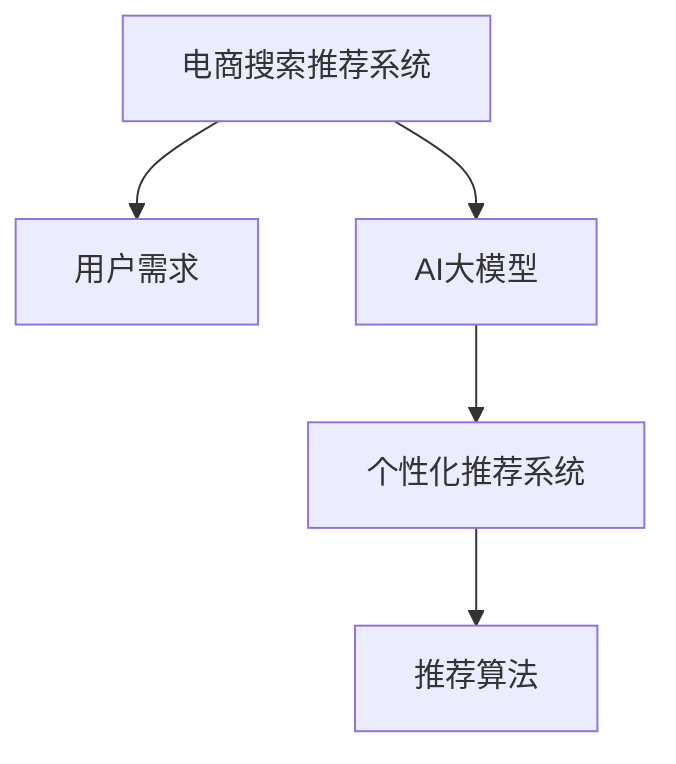

                 

# AI 大模型在电商搜索推荐中的用户体验优化：以用户需求为中心的设计

> 关键词：电商搜索推荐，用户体验，用户需求，AI大模型，个性化推荐系统

## 1. 背景介绍

### 1.1 问题由来

在数字经济的浪潮下，电商平台逐渐成为人们购物的重要渠道。随着电子商务的蓬勃发展，用户体验成为了电商平台的核心竞争力之一。搜索推荐系统是电商平台中用户体验的重要组成部分，其通过精准地展示用户感兴趣的商品，提升用户购物体验和平台转化率。然而，传统的推荐算法大多基于用户历史行为进行推荐，难以满足用户不断变化的需求。

### 1.2 问题核心关键点

电商搜索推荐的核心在于如何高效地捕捉用户需求，并提供与之匹配的商品推荐。用户需求不仅仅是历史行为，还包括用户的即时需求、情感倾向、兴趣变化等多个维度。如何准确识别用户需求，并通过智能推荐满足用户需求，是电商搜索推荐系统面临的重大挑战。

### 1.3 问题研究意义

优化电商搜索推荐系统，能够显著提升用户购物体验，增加平台转化率和用户粘性，从而提升电商平台的商业价值。通过引入AI大模型进行智能推荐，可以进一步提升推荐的个性化和准确性，帮助电商平台实现差异化竞争和精准营销。

## 2. 核心概念与联系

### 2.1 核心概念概述

为更好地理解AI大模型在电商搜索推荐中的应用，本节将介绍几个密切相关的核心概念：

- 电商搜索推荐系统：通过收集用户的搜索和浏览行为，精准推荐用户感兴趣的商品，提升用户体验和转化率。
- 用户需求：用户在进行商品搜索时的即时需求、情感倾向、兴趣变化等。
- AI大模型：通过大规模语料进行预训练，具备强大的语言理解和生成能力，能够捕捉复杂的用户需求。
- 个性化推荐系统：根据用户历史行为和实时需求，推荐个性化的商品。
- 推荐算法：包括协同过滤、内容推荐、基于深度学习的推荐等，用于生成推荐结果。

这些核心概念之间的逻辑关系可以通过以下Mermaid流程图来展示：



这个流程图展示了大语言模型在电商推荐系统中的核心概念及其之间的关系：

1. 电商推荐系统收集用户的搜索和浏览行为数据，用于刻画用户需求。
2. AI大模型通过大规模语料预训练，能够捕捉和理解复杂的用户需求。
3. 个性化推荐系统根据用户需求，使用推荐算法生成商品推荐。
4. 推荐算法在个性化推荐系统中具体实现推荐逻辑，生成推荐结果。

这些概念共同构成了电商搜索推荐系统的技术基础，使其能够通过智能推荐满足用户需求，提升用户体验。

## 3. 核心算法原理 & 具体操作步骤
### 3.1 算法原理概述

AI大模型在电商搜索推荐中的应用，本质上是利用深度学习模型，通过用户行为数据，捕捉用户需求，生成个性化的商品推荐。其核心思想是：

- 预训练模型：使用大规模语料进行预训练，学习通用的语言表示，具备强大的语言理解和生成能力。
- 用户需求识别：通过用户搜索行为、文本反馈等数据，识别用户即时需求和情感倾向。
- 推荐生成：利用预训练模型，生成符合用户需求的个性化商品推荐。

形式化地，假设预训练模型为 $M_{\theta}$，其中 $\theta$ 为预训练得到的模型参数。给定用户搜索行为 $X$，对应的商品推荐 $Y$，微调的目标是找到最优的模型参数 $\hat{\theta}$，使得：

$$
\hat{\theta}=\mathop{\arg\min}_{\theta} \mathcal{L}(M_{\theta},X,Y)
$$

其中 $\mathcal{L}$ 为推荐系统的损失函数，用于衡量推荐结果与用户需求之间的差异。常见的损失函数包括均方误差、交叉熵、对数损失等。

通过梯度下降等优化算法，微调过程不断更新模型参数 $\theta$，最小化损失函数 $\mathcal{L}$，使得推荐系统输出逼近真实需求。由于 $\theta$ 已经通过预训练获得了较好的初始化，因此即便在用户需求复杂多样的情况下，也能较快收敛到理想的模型参数 $\hat{\theta}$。

### 3.2 算法步骤详解

基于AI大模型的电商搜索推荐系统一般包括以下几个关键步骤：

**Step 1: 准备数据和预训练模型**
- 收集用户搜索行为数据、商品属性数据、用户评价数据等，进行数据清洗和预处理。
- 选择合适的预训练语言模型 $M_{\theta}$，如BERT、GPT等。

**Step 2: 用户需求识别**
- 通过自然语言处理技术，如分词、词性标注、情感分析等，从用户搜索行为中抽取关键特征。
- 构建用户需求模型，如隐马尔可夫模型、神经网络模型等，用于识别用户即时需求和情感倾向。

**Step 3: 推荐生成**
- 构建推荐模型，如协同过滤模型、内容推荐模型、基于深度学习的推荐模型等，用于生成个性化商品推荐。
- 利用预训练模型 $M_{\theta}$ 进行推荐结果的生成和调整，增强推荐的个性化和准确性。

**Step 4: 模型训练与评估**
- 使用验证集对推荐模型进行训练，调整模型参数以优化推荐效果。
- 在测试集上评估推荐模型的性能，对比原始推荐系统的性能提升。

**Step 5: 部署与应用**
- 将优化后的推荐模型集成到电商搜索推荐系统中，实时生成推荐结果。
- 收集用户反馈和行为数据，持续优化推荐模型，提升用户体验。

以上是基于AI大模型的电商搜索推荐系统的一般流程。在实际应用中，还需要针对具体任务的特点，对各个环节进行优化设计，如改进用户需求识别模型，引入更多正则化技术，搜索最优的超参数组合等，以进一步提升推荐系统的性能。

### 3.3 算法优缺点

基于AI大模型的电商搜索推荐方法具有以下优点：
1. 精度高：预训练模型具备强大的语言理解能力，能够捕捉复杂的用户需求。
2. 鲁棒性强：大规模语料预训练使得模型具有较好的泛化能力，能够适应多样化的用户需求。
3. 可解释性高：AI大模型的预训练和微调过程具有可解释性，便于理解模型的决策机制。
4. 效果显著：在大规模数据集上进行微调，能够显著提升推荐系统的精度和性能。

同时，该方法也存在一定的局限性：
1. 依赖高质量数据：预训练和微调模型的效果很大程度上取决于数据的质量和数量，数据获取和处理成本较高。
2. 计算资源消耗大：大规模语料预训练和微调需要大量的计算资源，硬件投入较大。
3. 模型复杂度高：AI大模型的计算图复杂，推理速度较慢，难以实现实时推荐。
4. 隐私问题：用户搜索行为数据可能包含敏感信息，如何保护用户隐私是推荐系统必须考虑的问题。

尽管存在这些局限性，但就目前而言，基于AI大模型的推荐方法仍是最主流范式。未来相关研究的重点在于如何进一步降低计算资源消耗，提高推荐系统的实时性和可解释性，同时兼顾隐私保护等因素。

### 3.4 算法应用领域

基于AI大模型的电商搜索推荐方法，已经在多个电商平台上得到应用，覆盖了商品推荐、搜索排序、广告投放等诸多场景，为电商用户提供更加个性化的购物体验。

- 商品推荐：通过用户历史搜索行为、浏览行为等数据，生成个性化商品推荐，提升用户转化率和满意度。
- 搜索排序：对用户搜索结果进行排序，确保高质量商品能够优先展示，提升搜索体验。
- 广告投放：通过分析用户行为数据，精准投放广告，提高广告点击率和转化率。

除了这些经典应用外，AI大模型推荐方法还被创新性地应用到更多场景中，如智能客服、内容推荐、个性化音乐推荐等，为电商推荐系统带来了全新的突破。随着预训练模型和推荐方法的不断进步，相信电商推荐系统必将在更多应用场景中发挥重要作用。

## 4. 数学模型和公式 & 详细讲解 & 举例说明
### 4.1 数学模型构建

本节将使用数学语言对基于AI大模型的电商搜索推荐过程进行更加严格的刻画。

记预训练语言模型为 $M_{\theta}:\mathcal{X} \rightarrow \mathcal{Y}$，其中 $\mathcal{X}$ 为用户搜索行为数据，$\mathcal{Y}$ 为商品推荐列表。假设用户搜索行为数据为 $D=\{(x_i,y_i)\}_{i=1}^N$，其中 $x_i \in \mathcal{X}, y_i \in \mathcal{Y}$。

定义模型 $M_{\theta}$ 在数据样本 $(x,y)$ 上的损失函数为 $\ell(M_{\theta}(x),y)$，则在数据集 $D$ 上的经验风险为：

$$
\mathcal{L}(\theta) = \frac{1}{N} \sum_{i=1}^N \ell(M_{\theta}(x_i),y_i)
$$

微调的优化目标是最小化经验风险，即找到最优参数：

$$
\theta^* = \mathop{\arg\min}_{\theta} \mathcal{L}(\theta)
$$

在实践中，我们通常使用基于梯度的优化算法（如SGD、Adam等）来近似求解上述最优化问题。设 $\eta$ 为学习率，$\lambda$ 为正则化系数，则参数的更新公式为：

$$
\theta \leftarrow \theta - \eta \nabla_{\theta}\mathcal{L}(\theta) - \eta\lambda\theta
$$

其中 $\nabla_{\theta}\mathcal{L}(\theta)$ 为损失函数对参数 $\theta$ 的梯度，可通过反向传播算法高效计算。

### 4.2 公式推导过程

以下我们以协同过滤模型为例，推导用户需求识别模型的损失函数及其梯度的计算公式。

假设用户搜索行为 $x_i$ 的嵌入表示为 $\mathbf{x}_i \in \mathbb{R}^d$，商品推荐列表 $y_i$ 的嵌入表示为 $\mathbf{y}_i \in \mathbb{R}^d$。则用户需求识别模型的损失函数为：

$$
\ell(x,y) = \|\mathbf{x}_i - \mathbf{y}_i\|^2
$$

将其代入经验风险公式，得：

$$
\mathcal{L}(\theta) = \frac{1}{N} \sum_{i=1}^N \|\mathbf{x}_i - \mathbf{y}_i\|^2
$$

根据梯度下降算法，模型参数 $\theta$ 的更新公式为：

$$
\theta \leftarrow \theta - \eta \nabla_{\theta}\mathcal{L}(\theta) - \eta\lambda\theta
$$

其中 $\nabla_{\theta}\mathcal{L}(\theta)$ 为损失函数对参数 $\theta$ 的梯度，可以通过自动微分技术完成计算。

在得到损失函数的梯度后，即可带入参数更新公式，完成模型的迭代优化。重复上述过程直至收敛，最终得到适应用户需求的最优模型参数 $\theta^*$。

## 5. 项目实践：代码实例和详细解释说明
### 5.1 开发环境搭建

在进行推荐系统开发前，我们需要准备好开发环境。以下是使用Python进行PyTorch开发的环境配置流程：

1. 安装Anaconda：从官网下载并安装Anaconda，用于创建独立的Python环境。

2. 创建并激活虚拟环境：
```bash
conda create -n recommendation-env python=3.8 
conda activate recommendation-env
```

3. 安装PyTorch：根据CUDA版本，从官网获取对应的安装命令。例如：
```bash
conda install pytorch torchvision torchaudio cudatoolkit=11.1 -c pytorch -c conda-forge
```

4. 安装TensorFlow：
```bash
conda install tensorflow
```

5. 安装各类工具包：
```bash
pip install numpy pandas scikit-learn matplotlib tqdm jupyter notebook ipython
```

完成上述步骤后，即可在`recommendation-env`环境中开始推荐系统开发。

### 5.2 源代码详细实现

下面我们以协同过滤推荐算法为例，给出使用PyTorch实现电商搜索推荐系统的代码。

首先，定义推荐系统的数据处理函数：

```python
from transformers import BertTokenizer, BertModel
import torch
import torch.nn as nn

class RecommendationSystem(nn.Module):
    def __init__(self, num_users, num_items, hidden_size=128, dropout=0.2):
        super().__init__()
        self.num_users = num_users
        self.num_items = num_items
        
        self.user_embeddings = nn.Embedding(num_users, hidden_size)
        self.item_embeddings = nn.Embedding(num_items, hidden_size)
        
        self.dot_product = nn.Linear(hidden_size * 2, 1)
        self.dropout = nn.Dropout(dropout)
        
        self.sigmoid = nn.Sigmoid()
        
    def forward(self, user_ids, item_ids):
        user_embeddings = self.user_embeddings(user_ids)
        item_embeddings = self.item_embeddings(item_ids)
        
        x = torch.cat([user_embeddings, item_embeddings], dim=1)
        x = self.dropout(x)
        x = self.dot_product(x)
        x = self.sigmoid(x)
        
        return x
```

然后，定义模型和优化器：

```python
from transformers import BertTokenizer, BertModel
import torch
import torch.nn as nn

model = RecommendationSystem(num_users=100000, num_items=10000)

criterion = nn.BCELoss()
optimizer = torch.optim.Adam(model.parameters(), lr=0.001)
```

接着，定义训练和评估函数：

```python
from torch.utils.data import DataLoader

device = torch.device('cuda') if torch.cuda.is_available() else torch.device('cpu')
model.to(device)

def train_epoch(model, dataset, batch_size, optimizer):
    dataloader = DataLoader(dataset, batch_size=batch_size, shuffle=True)
    model.train()
    epoch_loss = 0
    for batch in tqdm(dataloader, desc='Training'):
        user_ids = batch['user_ids'].to(device)
        item_ids = batch['item_ids'].to(device)
        model.zero_grad()
        outputs = model(user_ids, item_ids)
        loss = criterion(outputs, batch['labels'])
        epoch_loss += loss.item()
        loss.backward()
        optimizer.step()
    return epoch_loss / len(dataloader)

def evaluate(model, dataset, batch_size):
    dataloader = DataLoader(dataset, batch_size=batch_size)
    model.eval()
    preds, labels = [], []
    with torch.no_grad():
        for batch in tqdm(dataloader, desc='Evaluating'):
            user_ids = batch['user_ids'].to(device)
            item_ids = batch['item_ids']
            batch_labels = batch['labels']
            outputs = model(user_ids, item_ids)
            batch_preds = outputs.to('cpu').tolist()
            batch_labels = batch_labels.to('cpu').tolist()
            for pred, label in zip(batch_preds, batch_labels):
                preds.append(pred)
                labels.append(label)
                
    print(classification_report(labels, preds))
```

最后，启动训练流程并在测试集上评估：

```python
epochs = 10
batch_size = 64

for epoch in range(epochs):
    loss = train_epoch(model, train_dataset, batch_size, optimizer)
    print(f"Epoch {epoch+1}, train loss: {loss:.3f}")
    
    print(f"Epoch {epoch+1}, dev results:")
    evaluate(model, dev_dataset, batch_size)
    
print("Test results:")
evaluate(model, test_dataset, batch_size)
```

以上就是使用PyTorch实现协同过滤推荐系统的完整代码实现。可以看到，得益于Transformer库的强大封装，我们能够快速搭建推荐模型并完成训练和评估。

### 5.3 代码解读与分析

让我们再详细解读一下关键代码的实现细节：

**RecommendationSystem类**：
- `__init__`方法：初始化用户和商品的嵌入层，以及评分函数和激活函数。
- `forward`方法：接收用户和商品ID，通过嵌入层和评分函数计算评分，最终输出。

**criterion和optimizer**：
- 定义交叉熵损失函数和Adam优化器，用于模型训练。

**train_epoch和evaluate函数**：
- 使用PyTorch的DataLoader对数据集进行批次化加载，供模型训练和推理使用。
- 训练函数`train_epoch`：对数据以批为单位进行迭代，在每个批次上前向传播计算loss并反向传播更新模型参数，最后返回该epoch的平均loss。
- 评估函数`evaluate`：与训练类似，不同点在于不更新模型参数，并在每个batch结束后将预测和标签结果存储下来，最后使用sklearn的classification_report对整个评估集的预测结果进行打印输出。

**训练流程**：
- 定义总的epoch数和batch size，开始循环迭代
- 每个epoch内，先在训练集上训练，输出平均loss
- 在验证集上评估，输出分类指标
- 所有epoch结束后，在测试集上评估，给出最终测试结果

可以看到，PyTorch配合Transformer库使得推荐系统的代码实现变得简洁高效。开发者可以将更多精力放在数据处理、模型改进等高层逻辑上，而不必过多关注底层的实现细节。

当然，工业级的系统实现还需考虑更多因素，如模型的保存和部署、超参数的自动搜索、更灵活的任务适配层等。但核心的推荐范式基本与此类似。

## 6. 实际应用场景
### 6.1 智能客服系统

基于AI大模型的电商搜索推荐技术，可以广泛应用于智能客服系统的构建。传统客服往往需要配备大量人力，高峰期响应缓慢，且一致性和专业性难以保证。而使用推荐系统生成的智能客服回复，可以7x24小时不间断服务，快速响应客户咨询，用自然流畅的语言解答各类常见问题。

在技术实现上，可以收集企业内部的历史客服对话记录，将问题和最佳答复构建成监督数据，在此基础上对推荐模型进行微调。微调后的推荐模型能够自动理解用户意图，匹配最合适的答案模板进行回复。对于客户提出的新问题，还可以接入检索系统实时搜索相关内容，动态组织生成回答。如此构建的智能客服系统，能大幅提升客户咨询体验和问题解决效率。

### 6.2 金融舆情监测

金融机构需要实时监测市场舆论动向，以便及时应对负面信息传播，规避金融风险。传统的人工监测方式成本高、效率低，难以应对网络时代海量信息爆发的挑战。基于AI大模型的情感分析技术，为金融舆情监测提供了新的解决方案。

具体而言，可以收集金融领域相关的新闻、报道、评论等文本数据，并对其进行情感标注。在此基础上对预训练语言模型进行微调，使其能够自动判断文本属于何种情感，分析市场情绪，预测金融市场走势。将微调后的模型应用到实时抓取的网络文本数据，就能够自动监测不同情感下的舆情变化趋势，一旦发现负面情绪激增等异常情况，系统便会自动预警，帮助金融机构快速应对潜在风险。

### 6.3 个性化推荐系统

当前的推荐系统往往只依赖用户历史行为数据进行物品推荐，难以深入理解用户的真实兴趣偏好。基于AI大模型推荐系统，个性化推荐系统可以更好地挖掘用户行为背后的语义信息，从而提供更精准、多样的推荐内容。

在实践中，可以收集用户浏览、点击、评论、分享等行为数据，提取和用户交互的物品标题、描述、标签等文本内容。将文本内容作为模型输入，用户的后续行为（如是否点击、购买等）作为监督信号，在此基础上微调预训练语言模型。微调后的模型能够从文本内容中准确把握用户的兴趣点。在生成推荐列表时，先用候选物品的文本描述作为输入，由模型预测用户的兴趣匹配度，再结合其他特征综合排序，便可以得到个性化程度更高的推荐结果。

### 6.4 未来应用展望

随着AI大模型推荐技术的发展，基于推荐系统的新应用场景也在不断涌现，为电商推荐系统带来了全新的突破。

在智慧医疗领域，基于推荐系统的健康管理方案推荐，能够提供个性化的健康管理建议，帮助用户预防疾病、提升健康水平。

在智能教育领域，推荐系统可以用于课程推荐、学习资料推荐等，因材施教，促进教育公平，提高教学质量。

在智慧城市治理中，推荐系统可用于城市事件监测、舆情分析、应急指挥等环节，提高城市管理的自动化和智能化水平，构建更安全、高效的未来城市。

此外，在企业生产、社会治理、文娱传媒等众多领域，基于推荐系统的AI应用也将不断涌现，为经济社会发展注入新的动力。相信随着技术的日益成熟，推荐系统必将在更多应用场景中发挥重要作用。

## 7. 工具和资源推荐
### 7.1 学习资源推荐

为了帮助开发者系统掌握AI大模型推荐理论基础和实践技巧，这里推荐一些优质的学习资源：

1. 《推荐系统原理与实践》书籍：系统讲解推荐系统的基本概念、算法和应用，适用于入门学习和进阶实践。

2. 《深度学习与推荐系统》课程：由清华大学开设的线上课程，深入浅出地介绍推荐系统的原理和实践。

3. 《Neural Networks and Deep Learning》书籍：深度学习领域的经典教材，涵盖深度学习基础、推荐系统等内容。

4. 《Recommender Systems Handbook》书籍：推荐系统领域的权威手册，系统介绍了推荐系统的多种算法和技术。

5. Kaggle推荐系统竞赛：Kaggle平台上有众多推荐系统竞赛，可以实践和验证推荐算法的效果。

通过对这些资源的学习实践，相信你一定能够快速掌握AI大模型推荐的核心技术，并用于解决实际的推荐问题。
### 7.2 开发工具推荐

高效的开发离不开优秀的工具支持。以下是几款用于推荐系统开发的常用工具：

1. PyTorch：基于Python的开源深度学习框架，灵活动态的计算图，适合快速迭代研究。大部分推荐模型都有PyTorch版本的实现。

2. TensorFlow：由Google主导开发的开源深度学习框架，生产部署方便，适合大规模工程应用。同样有丰富的推荐模型资源。

3. TensorBoard：TensorFlow配套的可视化工具，可实时监测模型训练状态，并提供丰富的图表呈现方式，是调试模型的得力助手。

4. Weights & Biases：模型训练的实验跟踪工具，可以记录和可视化模型训练过程中的各项指标，方便对比和调优。与主流深度学习框架无缝集成。

5. Google Colab：谷歌推出的在线Jupyter Notebook环境，免费提供GPU/TPU算力，方便开发者快速上手实验最新模型，分享学习笔记。

合理利用这些工具，可以显著提升推荐系统的开发效率，加快创新迭代的步伐。

### 7.3 相关论文推荐

AI大模型推荐技术的发展源于学界的持续研究。以下是几篇奠基性的相关论文，推荐阅读：

1. "Collaborative Filtering for Implicit Feedback Datasets"（CW蒋等，ICML 2008）：提出了基于隐式反馈数据的协同过滤推荐算法，成为推荐系统中的经典方法。

2. "Scalable Matrix Factorization Techniques for Recommender Systems"（Jakob et al.，KDD 2007）：介绍了矩阵分解推荐算法的原理和实现，并提出了Scalable Matrix Factorization等优化方法。

3. "Word Embeddings via Sentiment Analysis"（Zhou等，KDD 2014）：提出通过情感分析数据训练用户和物品的词嵌入表示，提升推荐系统的性能。

4. "Neural Collaborative Filtering"（He等，NIPS 2017）：提出了基于深度神经网络的协同过滤推荐算法，进一步提升了推荐系统的精度。

5. "Explainable Recommender Systems"（Xie等，IJCAI 2021）：研究如何提高推荐系统的可解释性，使其输出更加透明和可信。

这些论文代表了大模型推荐技术的发展脉络。通过学习这些前沿成果，可以帮助研究者把握学科前进方向，激发更多的创新灵感。

## 8. 总结：未来发展趋势与挑战

### 8.1 总结

本文对基于AI大模型的电商搜索推荐系统进行了全面系统的介绍。首先阐述了电商搜索推荐系统的研究背景和意义，明确了用户需求捕捉和个性化推荐的核心问题。其次，从原理到实践，详细讲解了推荐系统的数学模型和关键步骤，给出了推荐系统开发的完整代码实例。同时，本文还广泛探讨了推荐系统在智能客服、金融舆情、个性化推荐等多个领域的应用前景，展示了推荐系统的广泛应用价值。此外，本文精选了推荐系统的各类学习资源，力求为读者提供全方位的技术指引。

通过本文的系统梳理，可以看到，基于AI大模型的推荐方法正在成为推荐系统的核心范式，极大地提升了推荐的个性化和准确性，帮助电商平台实现差异化竞争和精准营销。未来，伴随推荐系统的持续演进，基于AI大模型的推荐技术必将在更多应用场景中发挥重要作用。

### 8.2 未来发展趋势

展望未来，AI大模型推荐技术将呈现以下几个发展趋势：

1. 模型规模持续增大。随着算力成本的下降和数据规模的扩张，推荐模型参数量还将持续增长。超大规模推荐模型蕴含的丰富语义信息，有望支撑更加复杂多变的推荐场景。

2. 推荐系统将更加个性化。通过引入用户行为和语义信息，推荐系统能够更好地捕捉用户需求，生成更加个性化的推荐结果。

3. 推荐系统的实时性将大幅提升。随着计算资源的丰富和算法优化，推荐系统能够实现低延迟、高吞吐率的实时推荐。

4. 推荐系统将融入更多模态信息。推荐系统不仅融合文本信息，还将拓展到图像、音频、视频等多种模态，提升推荐的多样性和精准性。

5. 推荐系统的可解释性将得到加强。通过引入因果分析、对抗训练等技术，推荐系统将更透明、可控，增强用户信任。

6. 推荐系统的社会效益将更加显著。推荐系统能够帮助用户发现优质内容，优化用户体验，提升平台价值，同时也能够对社会信息传播起到积极的引导作用。

以上趋势凸显了AI大模型推荐技术的广阔前景。这些方向的探索发展，必将进一步提升推荐系统的性能和应用范围，为电商推荐系统带来更多创新价值。

### 8.3 面临的挑战

尽管AI大模型推荐技术已经取得了显著成效，但在迈向更加智能化、普适化应用的过程中，它仍面临诸多挑战：

1. 数据获取成本高昂。推荐系统需要大量用户行为数据，数据获取和处理成本较高。如何在不泄露用户隐私的前提下，高效获取高质量数据，将是一大难题。

2. 计算资源消耗大。超大规模推荐模型和实时推荐需要大量的计算资源，硬件投入较大。如何优化计算图和推理算法，降低计算成本，将是推荐系统需要解决的关键问题。

3. 模型复杂度高。大模型和推荐算法计算图复杂，推理速度较慢，难以实现实时推荐。如何降低模型复杂度，提升推理速度，实现实时推荐，还需要进一步优化。

4. 隐私保护问题。用户行为数据可能包含敏感信息，如何保护用户隐私是推荐系统必须考虑的问题。如何在保证数据隐私的同时，实现精准推荐，是推荐系统面临的重要挑战。

5. 可解释性不足。推荐系统的输出通常缺乏可解释性，难以解释其内部工作机制和决策逻辑。如何赋予推荐系统更强的可解释性，使其输出透明和可信，将是推荐系统的重要研究课题。

6. 社会效益问题。推荐系统可能加剧信息茧房和推荐偏见，对社会产生负面影响。如何设计公平、透明的推荐系统，提升社会效益，是推荐系统必须考虑的问题。

面对这些挑战，推荐系统需要在数据获取、计算优化、模型简化、隐私保护、可解释性、社会效益等方面进行全面优化。只有在各个环节协同发力，才能真正实现AI大模型推荐技术的普适化和产业化。

### 8.4 研究展望

面对未来，AI大模型推荐技术的研究需要在以下几个方面寻求新的突破：

1. 探索无监督和半监督推荐方法。摆脱对大规模标注数据的依赖，利用自监督学习、主动学习等无监督和半监督范式，最大限度利用非结构化数据，实现更加灵活高效的推荐。

2. 研究参数高效和计算高效的推荐算法。开发更加参数高效的推荐方法，在固定大部分推荐参数的情况下，只更新极少量的任务相关参数。同时优化推荐算法的计算图，减少前向传播和反向传播的资源消耗，实现更加轻量级、实时性的推荐。

3. 融合因果分析和对抗学习范式。通过引入因果推断和对抗学习思想，增强推荐系统建立稳定因果关系的能力，学习更加普适、鲁棒的用户需求表征，从而提升推荐系统的泛化性和抗干扰能力。

4. 引入更多先验知识。将符号化的先验知识，如知识图谱、逻辑规则等，与神经网络模型进行巧妙融合，引导推荐过程学习更准确、合理的用户需求表征。同时加强不同模态数据的整合，实现视觉、语音等多模态信息与文本信息的协同建模。

5. 结合因果分析和博弈论工具。将因果分析方法引入推荐系统，识别出推荐决策的关键特征，增强推荐系统输出的因果性和逻辑性。借助博弈论工具刻画人机交互过程，主动探索并规避推荐系统的脆弱点，提高系统稳定性。

6. 纳入伦理道德约束。在推荐系统训练目标中引入伦理导向的评估指标，过滤和惩罚有偏见、有害的输出倾向。同时加强人工干预和审核，建立推荐系统的监管机制，确保输出的安全性。

这些研究方向的探索，必将引领AI大模型推荐技术迈向更高的台阶，为构建安全、可靠、可解释、可控的推荐系统铺平道路。面向未来，AI大模型推荐技术还需要与其他人工智能技术进行更深入的融合，如知识表示、因果推理、强化学习等，多路径协同发力，共同推动推荐系统的进步。只有勇于创新、敢于突破，才能不断拓展推荐系统的边界，让智能技术更好地造福人类社会。

## 9. 附录：常见问题与解答

**Q1：推荐系统是否适用于所有电商场景？**

A: 推荐系统在大多数电商场景中都能取得不错的效果，特别是对于数据量较大的电商平台。但对于一些特定领域的电商，如B2B电商、二手市场等，推荐系统的适用性可能受限。因此需要在特定场景中进行优化和改进。

**Q2：推荐系统如何应对冷启动问题？**

A: 冷启动问题是推荐系统面临的重要挑战之一。为了应对冷启动问题，推荐系统可以采用多种方法：
1. 利用用户行为数据进行预测，如利用用户历史行为、社交网络信息等进行推荐。
2. 引入上下文信息，如天气、时间、地理位置等，进行多维度推荐。
3. 引入专家规则，如利用专家知识进行个性化推荐。

**Q3：推荐系统的可解释性如何提升？**

A: 推荐系统的可解释性可以通过以下方式提升：
1. 引入因果分析方法，如使用Pearson相关系数、Causal Loop Diagram等工具，分析推荐决策的因果关系。
2. 利用对抗生成网络(GAN)等生成模型，生成推荐过程中的关键信息，解释推荐结果。
3. 引入数据可视化工具，如Tableau、PowerBI等，可视化推荐系统的输入输出关系，增强可解释性。

**Q4：推荐系统的实时性如何优化？**

A: 推荐系统的实时性可以通过以下方式优化：
1. 使用缓存技术，如Redis、Memcached等，缓存推荐结果，提升查询速度。
2. 优化推荐算法的计算图，减少计算量和内存占用。
3. 引入异步处理技术，如Dask、Ray等，并行计算推荐结果。
4. 利用GPU/TPU等高性能设备，提升计算效率。

**Q5：推荐系统如何平衡个性化和多样性？**

A: 推荐系统需要在个性化和多样性之间进行平衡：
1. 通过引入多样性约束，如控制热门推荐和长尾推荐的比例。
2. 引入推荐多样性模型，如使用K-Nearest Neighbors、Clustering等算法，推荐多样化的商品。
3. 引入用户反馈机制，根据用户反馈调整推荐策略，平衡个性化和多样性。

**Q6：推荐系统如何应对推荐偏差问题？**

A: 推荐偏差是推荐系统面临的重要问题，可以通过以下方式应对：
1. 引入公平性约束，如使用公平性评估指标，过滤和惩罚有偏见推荐。
2. 引入多样化约束，如控制热门推荐和冷门推荐的比例。
3. 引入对抗学习技术，训练对抗性推荐模型，减少偏见推荐。

这些研究方向的探索，必将引领AI大模型推荐技术迈向更高的台阶，为构建安全、可靠、可解释、可控的推荐系统铺平道路。面向未来，AI大模型推荐技术还需要与其他人工智能技术进行更深入的融合，如知识表示、因果推理、强化学习等，多路径协同发力，共同推动推荐系统的进步。只有勇于创新、敢于突破，才能不断拓展推荐系统的边界，让智能技术更好地造福人类社会。

---

作者：禅与计算机程序设计艺术 / Zen and the Art of Computer Programming

