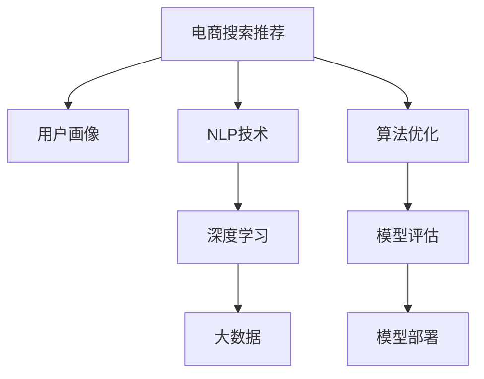

                 

# AI 大模型在电商搜索推荐中的用户画像技术：精准把握用户需求与行为偏好

> 关键词：电商搜索推荐，用户画像，自然语言处理(NLP)，深度学习，大数据，算法优化

## 1. 背景介绍

### 1.1 问题由来
在电商领域，用户搜索和推荐是两个核心场景，直接影响了用户购物体验和电商平台的转化率。搜索系统需要准确理解用户查询意图，推荐系统则需要精准把握用户偏好，才能有效提升用户的购物效率和满意度。传统的搜索推荐系统多依赖于浅层的统计方法和规则引擎，难以刻画复杂多变的用户需求和行为特征。近年来，随着深度学习技术的发展，大模型被越来越多地应用于电商搜索推荐系统，带来了显著的效果提升。

特别是基于大语言模型(NLP)和深度学习框架的技术，电商搜索推荐系统逐步实现了更加智能和精准的用户画像技术，能够自动地从海量的用户搜索数据和行为数据中学习出用户的兴趣和需求，从而提供更加个性化的推荐服务。

### 1.2 问题核心关键点
大模型在电商搜索推荐中的应用，主要集中在以下几个方面：
1. **用户画像构建**：通过大模型学习用户搜索历史、点击行为、浏览记录等多维数据，构建用户画像，刻画用户特征。
2. **意图理解**：利用大模型解析用户查询意图，精准匹配搜索结果。
3. **推荐排序**：根据用户画像和意图理解，结合商品属性、销量等数据，进行推荐排序，提升推荐效果。

本文将系统地介绍大模型在电商搜索推荐中的应用，特别是用户画像技术的构建方法和优化策略，帮助读者深入理解这一领域的核心技术，并应用于实际项目中。

## 2. 核心概念与联系

### 2.1 核心概念概述

为更好地理解大模型在电商搜索推荐中的应用，本节将介绍几个密切相关的核心概念：

- **电商搜索推荐**：指通过分析用户搜索和点击行为，推荐合适的商品，提升用户购物体验和平台转化率的技术。
- **用户画像**：指通过数据分析技术，刻画用户特征和行为偏好的过程。电商中的用户画像，通常包括用户的基本信息、搜索历史、点击行为、浏览记录等。
- **自然语言处理(NLP)**：指使用计算机技术处理、理解、生成自然语言的方法。在电商搜索推荐中，NLP用于解析用户查询意图，构建用户画像。
- **深度学习**：指通过多层神经网络，从数据中学习出高级特征，并进行复杂决策和预测的技术。深度学习框架(如TensorFlow、PyTorch等)在大模型中的应用广泛。
- **大数据**：指大规模数据集的应用。电商搜索推荐系统需要处理海量用户行为数据，才能准确预测用户需求和行为。
- **算法优化**：指在模型构建和训练过程中，通过正则化、梯度下降等技术，优化模型性能的过程。

这些概念之间的逻辑关系可以通过以下Mermaid流程图来展示：



这个流程图展示了大模型在电商搜索推荐中的核心概念及其之间的关系：

1. **电商搜索推荐**：基于用户画像和意图理解，推荐商品。
2. **用户画像**：通过NLP技术和深度学习框架，构建用户特征。
3. **NLP技术**：用于解析用户查询意图，构建文本特征。
4. **深度学习**：利用多层神经网络，提取高级特征，进行复杂预测。
5. **大数据**：处理海量用户行为数据，进行精准预测。
6. **算法优化**：通过正则化、梯度下降等技术，优化模型性能。

这些概念共同构成了大模型在电商搜索推荐系统中的应用框架，使其能够精确地捕捉用户需求和行为偏好，提供个性化的推荐服务。

## 3. 核心算法原理 & 具体操作步骤
### 3.1 算法原理概述

电商搜索推荐系统中的用户画像构建，本质上是基于深度学习框架，通过海量的用户数据，学习出用户的兴趣和需求特征。具体来说，该过程包括以下几个关键步骤：

1. **数据收集**：收集用户的基本信息、搜索历史、点击行为、浏览记录等多维数据。
2. **数据预处理**：清洗、去重、归一化处理数据，构建训练集。
3. **模型训练**：选择适当的深度学习模型，通过大量标注数据进行训练，学习出用户画像。
4. **特征提取**：将用户画像特征输入推荐模型，进行推荐排序。

### 3.2 算法步骤详解

#### 3.2.1 数据收集

电商平台的搜索推荐系统，通常通过以下方式收集用户数据：
- **登录信息**：用户基本信息，如年龄、性别、地区等。
- **搜索记录**：用户搜索的关键词、查询时间等。
- **点击行为**：用户点击的商品链接、停留时间等。
- **浏览记录**：用户浏览的商品页面、停留时长等。

#### 3.2.2 数据预处理

数据预处理是构建用户画像的基础。以下步骤展示了常见的预处理技术：
- **清洗**：去除重复、错误的数据，保证数据质量。
- **去重**：对于相同的用户行为数据，去重处理，避免重复训练。
- **归一化**：将不同特征数据进行标准化处理，便于模型训练。

#### 3.2.3 模型训练

在模型训练阶段，通常采用以下深度学习模型：
- **CNN(卷积神经网络)**：用于处理图像数据，提取局部特征。
- **RNN(循环神经网络)**：用于处理序列数据，提取时间序列特征。
- **LSTM(长短期记忆网络)**：用于处理长序列数据，提取记忆特征。
- **Transformer模型**：用于处理文本数据，提取全局特征。

在训练过程中，需要选择合适的损失函数和优化器：
- **损失函数**：如均方误差、交叉熵等，衡量模型输出与真实标签的差异。
- **优化器**：如Adam、SGD等，通过梯度下降优化模型参数。

#### 3.2.4 特征提取

在特征提取阶段，通常采用以下步骤：
- **特征选择**：选择对用户画像最有贡献的特征，减少维度。
- **降维**：使用PCA、SVD等技术，对高维特征进行降维处理。
- **融合**：将不同特征进行融合，得到综合特征向量。

### 3.3 算法优缺点

大模型在电商搜索推荐中的应用，具有以下优点：
1. **泛化能力强**：利用深度学习模型，可以从海量的用户数据中学习到丰富的用户特征。
2. **灵活性高**：能够动态更新用户画像，适应用户需求的变化。
3. **自动化程度高**：自动进行特征提取和模型训练，减少了人工干预。
4. **预测精度高**：利用多层次神经网络，可以进行复杂预测，提升推荐效果。

同时，该方法也存在以下局限性：
1. **数据依赖性强**：需要大量的标注数据，训练过程耗时较长。
2. **计算资源消耗大**：深度学习模型参数量庞大，计算资源消耗大。
3. **模型复杂度高**：模型结构复杂，解释性和可解释性较差。
4. **隐私风险**：用户数据可能泄露，隐私保护问题需要重视。

尽管存在这些局限性，但大模型在电商搜索推荐中的应用，依然展现出强大的潜力，得到了广泛的应用。

### 3.4 算法应用领域

大模型在电商搜索推荐中的应用，已经涵盖了多个领域，具体如下：
- **个性化推荐**：通过用户画像，生成个性化推荐列表，提升用户满意度。
- **商品检索**：解析用户查询，快速匹配合适的商品，提高检索效率。
- **广告推荐**：根据用户画像和行为数据，推荐相关广告，增加平台收入。
- **用户行为分析**：分析用户搜索和点击行为，优化推荐策略，提升转化率。

此外，大模型还被应用于更多场景中，如用户需求预测、热点商品分析、商品定价优化等，为电商平台的运营决策提供了新的数据支持。

## 4. 数学模型和公式 & 详细讲解  
### 4.1 数学模型构建

在电商搜索推荐系统中，构建用户画像的数学模型通常包括以下几个关键组件：

- **输入**：用户的多维数据，如基本信息、搜索记录、点击行为等。
- **特征提取器**：将用户数据转换为模型可处理的特征向量。
- **深度学习模型**：用于学习用户特征的深度神经网络。
- **输出**：用户画像特征向量，用于推荐排序。

### 4.2 公式推导过程

以Transformer模型为例，进行用户画像特征提取的公式推导如下：

设输入序列为 $x=(x_1,x_2,...,x_n)$，其中 $x_i \in R^d$，表示第 $i$ 个特征向量。

**Transformer模型结构**：
$$
M_{\theta}(x) = M_{E}(x) M_{P} \cdot [\mathrm{W}_o \mathrm{W}_v] \mathrm{softmax}(\mathrm{W}_k \mathrm{W}_q^T M_{P} x)
$$

其中，$M_{E}$ 表示特征提取器，$M_{P}$ 表示深度学习模型，$[\mathrm{W}_o \mathrm{W}_v]$ 表示特征融合权重矩阵。

**特征提取器**：
$$
M_{E}(x) = \mathrm{Ax} + \mathrm{b}
$$

其中，$A$ 为特征提取矩阵，$\mathrm{b}$ 为偏置向量。

**深度学习模型**：
$$
M_{P}(x) = \mathrm{W}_o \mathrm{W}_v^T \mathrm{softmax}(\mathrm{W}_k \mathrm{W}_q^T M_{P} x)
$$

其中，$\mathrm{W}_o$、$\mathrm{W}_v$、$\mathrm{W}_k$、$\mathrm{W}_q$ 为模型权重矩阵。

将 $M_{E}(x)$ 和 $M_{P}(x)$ 代入 $M_{\theta}(x)$，得到：

$$
M_{\theta}(x) = (\mathrm{A} \mathrm{W}_o) \cdot \mathrm{softmax}(\mathrm{W}_k \mathrm{W}_q^T (\mathrm{A} \mathrm{W}_o) \cdot \mathrm{W}_v \mathrm{W}_v^T M_{P} x) + \mathrm{b}
$$

经过多次迭代，最终得到用户画像特征向量 $u_{\theta}$：

$$
u_{\theta} = M_{\theta}(x)
$$

### 4.3 案例分析与讲解

以下以电商搜索推荐中的个性化推荐为例，展示大模型在用户画像构建中的应用：

**数据集**：
假设某电商平台的搜索数据集 $D$ 包含 $N$ 条用户搜索记录，每条记录包含用户ID $id$、搜索关键词 $k$、点击位置 $p$、停留时间 $t$ 等特征。

**模型训练**：
- **特征提取**：将 $k$ 进行分词、向量映射，得到向量 $x_i \in R^d$。
- **深度学习模型**：采用Transformer模型，对输入序列 $x_i$ 进行特征提取和融合，得到特征向量 $u_{\theta}$。
- **用户画像**：将 $N$ 个用户特征向量 $u_{\theta}$ 进行均值归一化，得到用户画像向量 $v_{\theta}$。

**推荐排序**：
- **相似度计算**：计算用户画像向量 $v_{\theta}$ 和商品特征向量 $c_{\theta}$ 的相似度。
- **排序输出**：根据相似度大小，对商品列表进行排序，推荐相似度高的商品。

以下代码展示了使用PyTorch实现用户画像构建和推荐排序的样例：

```python
import torch
import torch.nn as nn
import torch.nn.functional as F
from transformers import BertTokenizer, BertModel

class UserEmbedding(nn.Module):
    def __init__(self):
        super(UserEmbedding, self).__init__()
        self.tokenizer = BertTokenizer.from_pretrained('bert-base-cased')
        self.model = BertModel.from_pretrained('bert-base-cased')
        self.fc = nn.Linear(768, 128)

    def forward(self, ids, attention_mask):
        inputs = self.tokenizer(ids, padding='max_length', truncation=True, return_tensors='pt')
        outputs = self.model(**inputs)
        pooled_output = outputs.pooler_output
        features = self.fc(pooled_output)
        return features

# 假设商品特征向量为 c
class ProductEmbedding(nn.Module):
    def __init__(self):
        super(ProductEmbedding, self).__init__()
        self.tokenizer = BertTokenizer.from_pretrained('bert-base-cased')
        self.model = BertModel.from_pretrained('bert-base-cased')
        self.fc = nn.Linear(768, 128)

    def forward(self, ids, attention_mask):
        inputs = self.tokenizer(ids, padding='max_length', truncation=True, return_tensors='pt')
        outputs = self.model(**inputs)
        pooled_output = outputs.pooler_output
        features = self.fc(pooled_output)
        return features

# 用户画像构建和推荐排序
user_embedding = UserEmbedding()
product_embedding = ProductEmbedding()

# 假设用户ID为 u, 商品ID为 p
u_ids = tokenizer(u, return_tensors='pt').input_ids
u_mask = tokenizer(u, return_tensors='pt').attention_mask
u_features = user_embedding(u_ids, u_mask)

p_ids = tokenizer(p, return_tensors='pt').input_ids
p_mask = tokenizer(p, return_tensors='pt').attention_mask
p_features = product_embedding(p_ids, p_mask)

similarity = torch.cosine_similarity(u_features, p_features)
top_products = sorted(products, key=lambda x: similarity[x], reverse=True)[:n]
```

这段代码展示了使用Bert模型进行用户画像构建和推荐排序的基本流程。通过将用户和商品的搜索记录输入Bert模型，可以得到高维的特征向量，进而计算相似度，推荐出与用户兴趣最匹配的商品。

## 5. 项目实践：代码实例和详细解释说明
### 5.1 开发环境搭建

在进行电商搜索推荐系统开发前，我们需要准备好开发环境。以下是使用Python进行PyTorch开发的环境配置流程：

1. 安装Anaconda：从官网下载并安装Anaconda，用于创建独立的Python环境。

2. 创建并激活虚拟环境：
```bash
conda create -n pytorch-env python=3.8 
conda activate pytorch-env
```

3. 安装PyTorch：根据CUDA版本，从官网获取对应的安装命令。例如：
```bash
conda install pytorch torchvision torchaudio cudatoolkit=11.1 -c pytorch -c conda-forge
```

4. 安装TensorFlow：
```bash
conda install tensorflow
```

5. 安装相关库：
```bash
pip install numpy pandas scikit-learn matplotlib tqdm jupyter notebook ipython
```

完成上述步骤后，即可在`pytorch-env`环境中开始开发实践。

### 5.2 源代码详细实现

下面我们以电商搜索推荐中的个性化推荐为例，给出使用Transformers库对BERT模型进行用户画像构建和推荐排序的PyTorch代码实现。

**用户画像构建**：
```python
import torch
from transformers import BertTokenizer, BertModel, BertForSequenceClassification

tokenizer = BertTokenizer.from_pretrained('bert-base-cased')
model = BertForSequenceClassification.from_pretrained('bert-base-cased', num_labels=2)

# 假设输入序列为 x, 输出序列为 y
inputs = tokenizer(x, return_tensors='pt', padding='max_length', truncation=True)
outputs = model(**inputs)

# 取输出中的池化层向量作为用户画像特征
user_profile = outputs.pooler_output
```

**推荐排序**：
```python
from torch.nn.functional import cosine_similarity
from transformers import BertTokenizer, BertModel

# 假设商品特征向量为 c
tokenizer = BertTokenizer.from_pretrained('bert-base-cased')
model = BertModel.from_pretrained('bert-base-cased')

# 假设用户ID为 u, 商品ID为 p
u_ids = tokenizer(u, return_tensors='pt').input_ids
u_mask = tokenizer(u, return_tensors='pt').attention_mask
u_features = model(u_ids, u_mask)[0]

p_ids = tokenizer(p, return_tensors='pt').input_ids
p_mask = tokenizer(p, return_tensors='pt').attention_mask
p_features = model(p_ids, p_mask)[0]

# 计算用户画像和商品特征的相似度
similarity = cosine_similarity(u_features, p_features)

# 根据相似度大小排序推荐商品
top_products = sorted(products, key=lambda x: similarity[x], reverse=True)[:n]
```

以上代码展示了使用Bert模型进行用户画像构建和推荐排序的完整实现流程。可以看到，通过构建用户画像和商品特征向量，并计算它们之间的相似度，可以有效地推荐出与用户兴趣最匹配的商品。

### 5.3 代码解读与分析

让我们再详细解读一下关键代码的实现细节：

**BertTokenizer和BertModel**：
- `BertTokenizer`：用于将输入文本转换为BERT模型可接受的格式。
- `BertModel`：用于进行BERT模型的前向传播，提取特征向量。

**用户画像构建**：
- 将用户搜索记录输入BERT模型，得到高维特征向量。
- 使用池化层提取用户画像特征，得到用户画像向量。

**推荐排序**：
- 将商品特征向量输入BERT模型，得到高维特征向量。
- 计算用户画像和商品特征向量之间的相似度，排序推荐商品。

可以看到，利用大语言模型BERT和深度学习框架PyTorch，可以轻松地实现用户画像构建和推荐排序，提升电商搜索推荐系统的性能。

当然，工业级的系统实现还需考虑更多因素，如模型的保存和部署、超参数的自动搜索、更灵活的任务适配层等。但核心的算法流程基本与此类似。

## 6. 实际应用场景
### 6.1 电商搜索推荐

基于大模型构建的用户画像技术，已经广泛应用于电商平台的搜索推荐系统中。传统的搜索推荐系统依赖于浅层的统计方法和规则引擎，难以捕捉用户复杂的需求和行为特征。而使用大模型的用户画像技术，能够从海量的用户数据中学习出用户的兴趣和需求，从而提供更加个性化的推荐服务。

例如，某电商平台利用用户画像技术，对用户历史搜索记录、点击行为、浏览记录等数据进行深度学习，学习出用户画像。在用户进行搜索时，根据其用户画像特征，生成个性化推荐列表，提升用户购物体验和平台转化率。

### 6.2 广告推荐

广告推荐是电商平台的另一重要应用场景。传统的广告推荐依赖于简单的广告位填充策略，难以充分挖掘用户需求和行为特征。而使用大模型的用户画像技术，能够从用户数据中学习出用户的兴趣和需求，从而实现更精准的广告推荐。

例如，某电商平台利用用户画像技术，对用户历史点击行为、浏览记录等数据进行深度学习，学习出用户画像。在用户点击广告时，根据其用户画像特征，生成个性化广告推荐，提高广告点击率和转化率，增加平台收入。

### 6.3 用户行为分析

用户行为分析是电商平台优化推荐策略、提升转化率的重要手段。传统的用户行为分析依赖于浅层统计方法，难以挖掘深层次的用户需求和行为特征。而使用大模型的用户画像技术，能够从用户数据中学习出用户的兴趣和需求，从而提供更准确的分析结果。

例如，某电商平台利用用户画像技术，对用户历史搜索记录、点击行为、浏览记录等数据进行深度学习，学习出用户画像。在分析用户行为时，根据其用户画像特征，生成更准确的行为分析结果，优化推荐策略，提升转化率。

### 6.4 未来应用展望

随着大模型和用户画像技术的发展，未来的电商搜索推荐系统将呈现出更多的智能化和个性化应用。

在智慧零售领域，利用大模型构建用户画像，可以更好地预测用户需求和行为，优化库存管理和促销策略，提升运营效率和客户满意度。

在智能客服领域，利用用户画像技术，可以更好地理解用户需求和行为，提供更加智能的客服解决方案，提升用户体验和平台服务质量。

在个性化推荐领域，利用大模型构建用户画像，可以实现跨平台、跨设备的用户画像融合，提供更加全面、个性化的推荐服务，提升用户粘性和忠诚度。

此外，大模型和用户画像技术还被广泛应用于智能制造、智慧城市、金融科技等领域，推动各行业的智能化转型升级。

## 7. 工具和资源推荐
### 7.1 学习资源推荐

为了帮助开发者系统掌握大模型在电商搜索推荐中的应用，这里推荐一些优质的学习资源：

1. 《深度学习与NLP》课程：由斯坦福大学开设的NLP课程，讲解深度学习在NLP中的应用，包括搜索引擎、推荐系统等。

2. 《大规模深度学习模型》书籍：讲解大模型的训练、优化、应用等技术细节，适合深度学习领域从业者。

3. 《电商搜索推荐系统》书籍：系统介绍电商搜索推荐系统的发展历程、核心技术、实际案例等，适合电商领域的从业者。

4. 《NLP框架实战》系列书籍：讲解NLP框架的实战应用，包括Bert、GPT等大模型的应用。

5. 《AI大模型在电商应用》技术博客：详细讲解AI大模型在电商中的应用，包括用户画像、推荐排序等技术。

通过对这些资源的学习实践，相信你一定能够快速掌握大模型在电商搜索推荐中的应用，并应用于实际项目中。

### 7.2 开发工具推荐

高效的开发离不开优秀的工具支持。以下是几款用于电商搜索推荐系统开发的常用工具：

1. PyTorch：基于Python的开源深度学习框架，灵活动态的计算图，适合快速迭代研究。

2. TensorFlow：由Google主导开发的开源深度学习框架，生产部署方便，适合大规模工程应用。

3. Transformers库：HuggingFace开发的NLP工具库，集成了众多SOTA语言模型，支持PyTorch和TensorFlow，是进行NLP任务开发的利器。

4. Weights & Biases：模型训练的实验跟踪工具，可以记录和可视化模型训练过程中的各项指标，方便对比和调优。

5. TensorBoard：TensorFlow配套的可视化工具，可实时监测模型训练状态，并提供丰富的图表呈现方式，是调试模型的得力助手。

6. Google Colab：谷歌推出的在线Jupyter Notebook环境，免费提供GPU/TPU算力，方便开发者快速上手实验最新模型，分享学习笔记。

合理利用这些工具，可以显著提升电商搜索推荐系统的开发效率，加快创新迭代的步伐。

### 7.3 相关论文推荐

大模型和用户画像技术的发展源于学界的持续研究。以下是几篇奠基性的相关论文，推荐阅读：

1. Attention is All You Need：提出了Transformer结构，开启了NLP领域的预训练大模型时代。

2. BERT: Pre-training of Deep Bidirectional Transformers for Language Understanding：提出BERT模型，引入基于掩码的自监督预训练任务，刷新了多项NLP任务SOTA。

3. Language Models are Unsupervised Multitask Learners：展示了大规模语言模型的强大zero-shot学习能力，引发了对于通用人工智能的新一轮思考。

4. Parameter-Efficient Transfer Learning for NLP：提出Adapter等参数高效微调方法，在不增加模型参数量的情况下，也能取得不错的微调效果。

5. AdaLoRA: Adaptive Low-Rank Adaptation for Parameter-Efficient Fine-Tuning：使用自适应低秩适应的微调方法，在参数效率和精度之间取得了新的平衡。

6. Sentence-BERT: Sentence Embeddings using Siamese BERT Networks：提出Sentence-BERT模型，将Bert模型应用于句子嵌入，提升相似度计算效果。

这些论文代表了大模型和用户画像技术的发展脉络。通过学习这些前沿成果，可以帮助研究者把握学科前进方向，激发更多的创新灵感。

## 8. 总结：未来发展趋势与挑战
### 8.1 总结

本文对大模型在电商搜索推荐中的应用，特别是用户画像技术的构建方法，进行了全面系统的介绍。首先阐述了电商搜索推荐系统的背景和重要性，明确了用户画像技术在其中的关键作用。其次，从原理到实践，详细讲解了用户画像的数学模型和实现流程，给出了完整的代码实现。同时，本文还广泛探讨了用户画像技术在电商搜索推荐中的应用场景，展示了其在实际项目中的潜力。

通过本文的系统梳理，可以看到，大模型在电商搜索推荐中的应用，已经实现了从浅层统计方法到深度学习的跨越，极大地提升了推荐系统的性能和用户满意度。未来，随着大模型的不断进步和用户画像技术的进一步优化，电商搜索推荐系统将进入更加智能化、个性化的时代。

### 8.2 未来发展趋势

展望未来，大模型在电商搜索推荐中的应用将呈现以下几个发展趋势：

1. **深度融合多模态数据**：电商搜索推荐系统将更多地融合图像、语音、视频等多模态数据，提升推荐效果。

2. **用户画像多层次刻画**：用户画像技术将更多地融合时序数据、情感数据、行为数据等，进行多层次刻画，提升预测精度。

3. **个性化推荐实时化**：利用流式数据处理技术，实现个性化推荐实时化，提升用户体验和转化率。

4. **跨平台跨设备协同**：利用联邦学习等技术，实现跨平台跨设备的用户画像协同，提升推荐系统的覆盖范围和精度。

5. **冷启动问题解决**：利用大模型的语言理解能力和数据增强技术，解决冷启动问题，提升新用户推荐效果。

6. **推荐系统透明化**：利用可解释AI技术，实现推荐系统的透明化，让用户了解推荐逻辑，提升信任感。

这些趋势凸显了大模型在电商搜索推荐系统中的应用潜力，预示着未来的电商搜索推荐系统将更加智能化、个性化、透明化，为电商平台和用户带来更多价值。

### 8.3 面临的挑战

尽管大模型在电商搜索推荐中的应用已经取得了显著效果，但在其发展和应用过程中，仍面临诸多挑战：

1. **数据质量和隐私**：电商搜索推荐系统需要大量的用户数据，数据质量不高和隐私问题将成为制约其发展的重要因素。

2. **计算资源消耗**：深度学习模型的参数量和计算量巨大，训练和推理需要大量的计算资源。

3. **算法复杂度**：大模型的训练和推理算法复杂度高，需要不断优化算法，提升效率。

4. **解释性和可控性**：用户画像和大模型输出缺乏可解释性，难以满足监管和用户需求。

5. **跨平台兼容性**：不同平台和设备的用户画像数据格式不统一，数据融合和协同面临挑战。

6. **实时性要求高**：个性化推荐需要实时处理用户数据，系统需要具备高效的数据处理能力。

尽管存在这些挑战，但通过不断优化算法、提升数据质量、增强系统可解释性等措施，相信大模型在电商搜索推荐中的应用将会更加广泛和深入。

### 8.4 研究展望

面向未来，大模型在电商搜索推荐系统中的应用，需要关注以下几个方向：

1. **深度学习和用户画像的融合**：探索更高效、更灵活的用户画像构建方法，提升推荐效果。

2. **数据增强和知识融合**：利用数据增强和知识融合技术，提升推荐系统的泛化能力和解释性。

3. **跨平台跨设备协同**：探索更高效的数据融合和协同技术，实现跨平台跨设备的用户画像协同。

4. **可解释AI技术**：研究可解释AI技术，提升推荐系统的透明度和可信度。

5. **实时推荐系统**：研究流式数据处理技术，实现实时推荐，提升用户体验和系统响应速度。

6. **冷启动用户推荐**：利用大模型的语言理解能力和数据增强技术，解决冷启动用户推荐问题。

这些研究方向将进一步提升大模型在电商搜索推荐系统中的应用效果和用户满意度，推动电商平台的智能化转型升级。

## 9. 附录：常见问题与解答

**Q1：大模型在电商搜索推荐中构建用户画像需要哪些数据？**

A: 大模型在电商搜索推荐中构建用户画像，通常需要以下数据：
1. **基本信息**：如年龄、性别、地区等。
2. **搜索记录**：用户搜索的关键词、查询时间等。
3. **点击行为**：用户点击的商品链接、停留时间等。
4. **浏览记录**：用户浏览的商品页面、停留时长等。

这些数据可以来自电商平台的用户行为日志、网站访问记录、广告点击记录等。

**Q2：如何评估电商搜索推荐系统的效果？**

A: 电商搜索推荐系统的效果评估可以从以下几个方面进行：
1. **点击率**：衡量用户对推荐结果的点击行为。
2. **转化率**：衡量用户对推荐结果的购买行为。
3. **推荐精度**：衡量推荐结果与用户真实需求的匹配程度。
4. **满意度**：通过用户调查、评价等方式，衡量用户对推荐结果的满意度。
5. **平均处理时间**：衡量推荐结果的生成时间。

通过综合评估这些指标，可以全面了解推荐系统的表现，并进行优化改进。

**Q3：电商搜索推荐系统中如何处理冷启动用户？**

A: 电商搜索推荐系统中的冷启动用户，指的是没有足够历史行为数据的新用户。处理冷启动用户的方法主要有以下几种：
1. **用户画像生成**：利用大模型的语言理解能力，通过用户输入的少量信息，自动生成用户画像。
2. **数据增强**：利用用户输入的文本信息，进行数据增强，提升模型对新用户的理解能力。
3. **基于相似用户推荐**：根据相似用户的推荐结果，为新用户提供相似的商品推荐。
4. **引导用户输入**：通过引导用户输入更多的信息，提升模型的理解能力。

通过这些方法，可以在冷启动用户的情况下，快速提供推荐服务，提升用户体验。

**Q4：电商搜索推荐系统中如何保护用户隐私？**

A: 电商搜索推荐系统中的用户隐私保护，是构建可信推荐系统的关键。主要可以从以下几个方面进行：
1. **数据匿名化**：对用户数据进行去标识化处理，防止用户隐私泄露。
2. **数据加密**：对用户数据进行加密存储和传输，防止数据被恶意访问。
3. **隐私保护算法**：利用差分隐私、联邦学习等隐私保护算法，提升用户隐私保护水平。
4. **用户知情同意**：在用户使用推荐系统时，明确告知用户数据的使用范围和保护措施，获得用户知情同意。

通过这些措施，可以有效保护用户隐私，构建可信的电商搜索推荐系统。

**Q5：电商搜索推荐系统中的用户画像如何实时更新？**

A: 电商搜索推荐系统中的用户画像需要实时更新，以保证推荐的准确性和时效性。主要可以从以下几个方面进行：
1. **流式数据处理**：利用流式数据处理技术，实时更新用户画像。
2. **增量学习**：利用增量学习技术，对新数据进行快速更新，保证用户画像的实时性。
3. **分布式计算**：利用分布式计算技术，提升用户画像的更新速度和计算效率。
4. **缓存机制**：利用缓存机制，保存用户画像的最新状态，提升推荐系统的响应速度。

通过这些方法，可以实现用户画像的实时更新，提升推荐系统的性能。

---

作者：禅与计算机程序设计艺术 / Zen and the Art of Computer Programming

