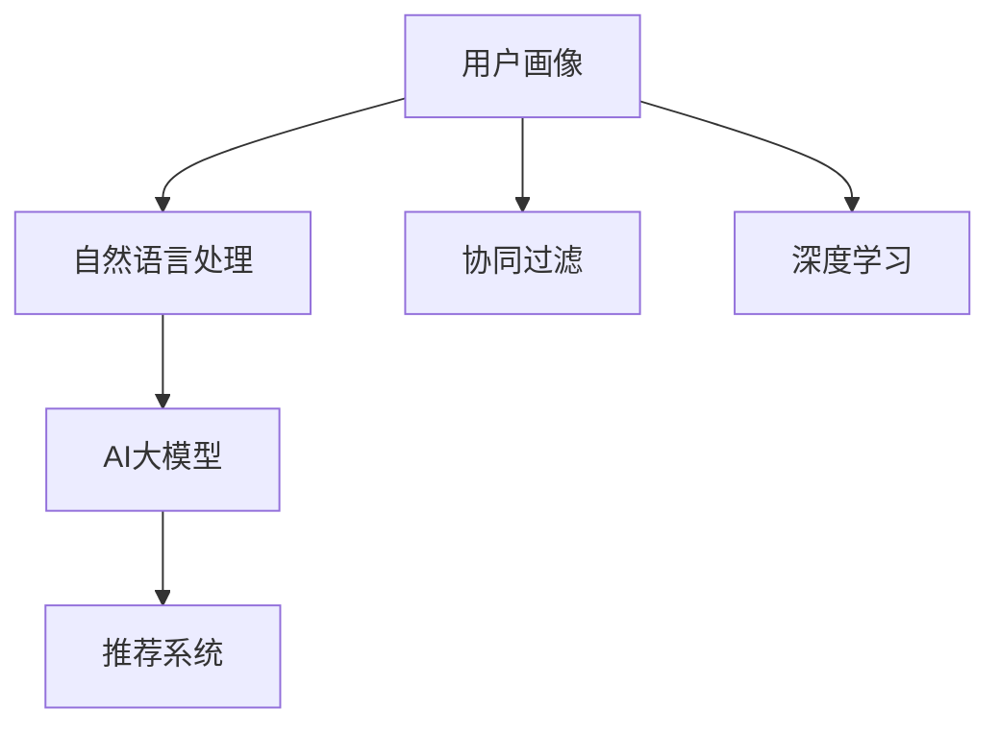

                 

## 1. 背景介绍

### 1.1 问题由来

随着电子商务平台的快速发展，用户体验和个性化推荐在电商搜索推荐系统中变得愈发重要。如何精准地把握用户需求与行为偏好，是提升电商搜索推荐系统效果的关键。近年来，AI大模型在自然语言处理、图像识别等领域取得了突破性进展，为电商搜索推荐系统带来了新的解决方案。本文将介绍一种基于AI大模型的用户画像构建方法，通过精准把握用户需求与行为偏好，优化电商搜索推荐系统，提升用户体验。

### 1.2 问题核心关键点

用户画像（User Profile）是一种通过数据收集与分析得到的用户模型，用于描述用户属性、兴趣和行为等特征。在电商搜索推荐系统中，用户画像可以指导推荐系统生成个性化推荐内容，提升用户满意度。构建用户画像的挑战在于如何从海量数据中提取有效信息，并通过合理的模型进行处理，以得到精准的用户画像。

1. **数据质量与特征工程**：电商平台上用户的点击、浏览、购买等行为数据可以用于用户画像构建。高质量的数据和有效的特征提取是构建精准用户画像的前提。
2. **模型选择与训练**：选择适当的机器学习模型，并对其进行训练与优化，是构建高效用户画像的核心。
3. **个性化推荐优化**：利用构建的用户画像，通过推荐算法优化推荐内容，提升用户体验和满意度。
4. **持续学习与更新**：电商平台上的用户行为是动态变化的，需要构建一个可以持续学习与更新的用户画像模型，以适应用户需求的变化。

### 1.3 问题研究意义

构建精确的用户画像，对于提升电商搜索推荐系统的个性化推荐效果具有重要意义：

1. **提升用户体验**：通过精准的用户画像，推荐系统能够生成符合用户兴趣与需求的商品，提升用户的购物体验。
2. **提高转化率**：个性化推荐可以显著提高用户的购买转化率，增加电商平台的用户粘性和忠诚度。
3. **优化资源分配**：精准的用户画像能够帮助电商平台优化资源配置，如广告投放、库存管理等，提升运营效率。
4. **增强市场竞争力**：通过精准的用户画像，电商平台可以在激烈的市场竞争中占据优势，吸引更多的用户和业务。

## 2. 核心概念与联系

### 2.1 核心概念概述

为了更好地理解基于AI大模型的用户画像构建方法，本节将介绍几个关键概念：

- **用户画像**：通过数据收集与分析得到的用户模型，用于描述用户属性、兴趣和行为等特征。
- **AI大模型**：如BERT、GPT-3等，通过在海量数据上进行自监督或监督学习，具备强大的语言理解和生成能力。
- **自然语言处理**：使用AI大模型处理自然语言文本数据，提取特征，构建用户画像。
- **推荐系统**：根据用户画像，生成个性化推荐内容，提升用户满意度。
- **协同过滤**：通过分析用户行为数据，推荐与用户历史行为相似的商品。
- **深度学习**：利用深度学习模型，从数据中提取深层次特征，构建高效的用户画像。

这些概念之间的逻辑关系可以通过以下Mermaid流程图来展示：



这个流程图展示了用户画像构建的主要流程：

1. 用户画像通过自然语言处理和AI大模型提取用户特征。
2. 构建好的用户画像作为推荐系统的输入，用于生成个性化推荐。
3. 协同过滤和深度学习也是构建用户画像的重要手段。

## 3. 核心算法原理 & 具体操作步骤

### 3.1 算法原理概述

基于AI大模型的用户画像构建方法，主要通过以下步骤进行：

1. **数据收集**：从电商平台收集用户的点击、浏览、购买等行为数据。
2. **特征提取**：使用自然语言处理技术，从用户评论、商品描述等文本数据中提取特征。
3. **用户画像构建**：使用AI大模型对提取的特征进行处理，生成用户画像。
4. **推荐系统优化**：利用构建好的用户画像，通过推荐算法优化推荐内容，提升用户体验。

该方法的原理是利用AI大模型强大的语言处理能力，从用户行为数据中提取深层次的特征，构建出精准的用户画像。通过用户画像，推荐系统可以生成更加个性化的推荐内容，满足用户需求。

### 3.2 算法步骤详解

#### 3.2.1 数据收集

电商平台上用户的点击、浏览、购买等行为数据是构建用户画像的重要来源。平台可以通过日志记录、API接口等方式收集这些数据。

#### 3.2.2 特征提取

特征提取是用户画像构建的关键步骤。电商平台上用户的行为数据通常以文本形式存储，可以使用自然语言处理技术从文本中提取有用的特征。常用的特征包括：

- **文本情感**：分析用户评论中的情感倾向，描述用户对商品的好恶。
- **关键词提取**：从用户评论、商品描述中提取关键词，描述用户兴趣。
- **主题建模**：使用LDA等主题模型，识别文本中的主题，描述用户关注的内容。

#### 3.2.3 用户画像构建

构建用户画像的常用方法有协同过滤和深度学习。

- **协同过滤**：通过分析用户行为数据，推荐与用户历史行为相似的商品。这种方法简单易行，但需要大量的用户历史行为数据，且推荐效果受限于用户历史行为的多样性。
- **深度学习**：利用AI大模型强大的语言处理能力，从用户行为数据中提取深层次的特征，构建精准的用户画像。深度学习方法需要大量的标注数据和计算资源，但能够生成更丰富的用户特征。

#### 3.2.4 推荐系统优化

推荐系统优化是电商搜索推荐系统的核心。通过构建的用户画像，推荐系统可以生成更加个性化的推荐内容。常用的推荐算法包括：

- **基于内容的推荐**：根据商品的属性和用户画像中的特征，推荐与用户画像匹配的商品。
- **协同过滤推荐**：利用用户行为数据，推荐与用户历史行为相似的商品。
- **深度学习推荐**：通过AI大模型对用户行为数据进行处理，生成推荐内容。

### 3.3 算法优缺点

基于AI大模型的用户画像构建方法具有以下优点：

1. **数据处理能力强**：AI大模型可以处理大规模数据集，从中提取深层次的特征。
2. **特征提取能力强**：AI大模型可以自动学习并提取高维特征，描述用户兴趣和行为。
3. **推荐效果显著**：利用构建好的用户画像，推荐系统可以生成个性化推荐内容，提升用户体验。

同时，该方法也存在以下缺点：

1. **数据依赖性强**：需要大量的用户行为数据，且数据质量对用户画像的构建有重要影响。
2. **计算资源需求高**：AI大模型的训练和推理需要大量的计算资源。
3. **模型复杂度高**：深度学习模型复杂度高，难以解释，且需要大量的标注数据。
4. **隐私问题**：收集和处理用户行为数据可能涉及隐私问题，需要合理处理。

### 3.4 算法应用领域

基于AI大模型的用户画像构建方法，可以应用于以下领域：

- **电商搜索推荐**：通过用户画像，优化电商平台的推荐系统，提升用户满意度。
- **社交媒体推荐**：通过用户画像，优化社交媒体平台的推荐算法，提升用户粘性。
- **内容推荐**：通过用户画像，优化视频、音频、新闻等内容推荐系统，提升用户体验。
- **广告投放**：通过用户画像，优化广告投放策略，提升广告效果和ROI。
- **个性化营销**：通过用户画像，制定个性化营销策略，提升用户转化率和忠诚度。

## 4. 数学模型和公式 & 详细讲解 & 举例说明

### 4.1 数学模型构建

本节将使用数学语言对基于AI大模型的用户画像构建方法进行更加严格的刻画。

记用户画像模型为 $P$，特征提取模型为 $F$，AI大模型为 $M$，推荐系统为 $R$。假设用户行为数据为 $D=\{(x_i,y_i)\}_{i=1}^N$，其中 $x_i$ 为用户行为数据，$y_i$ 为标签。

定义用户画像 $P(x_i)$ 为从用户行为数据 $x_i$ 中提取的特征表示，通过AI大模型处理得到：

$$
P(x_i) = M(F(x_i))
$$

其中 $M$ 为AI大模型，$F$ 为特征提取模型。用户画像 $P(x_i)$ 表示用户行为数据的特征表示。

### 4.2 公式推导过程

以用户评论情感分析为例，推导用户画像的构建过程。

假设用户评论 $x_i$ 中包含正面情感的单词数为 $w_{pos}(x_i)$，负面情感的单词数为 $w_{neg}(x_i)$，则用户评论的情感得分 $s(x_i)$ 为：

$$
s(x_i) = \alpha w_{pos}(x_i) + \beta w_{neg}(x_i)
$$

其中 $\alpha$ 和 $\beta$ 为情感得分的权重系数。

假设用户评论的情感得分向量 $s(x_i)$ 通过AI大模型处理，得到用户画像向量 $P(x_i)$：

$$
P(x_i) = M(s(x_i))
$$

将用户画像向量 $P(x_i)$ 作为推荐系统 $R$ 的输入，生成推荐结果 $y_i$：

$$
y_i = R(P(x_i))
$$

推荐系统 $R$ 可以根据用户画像向量 $P(x_i)$ 生成个性化推荐结果 $y_i$。

### 4.3 案例分析与讲解

以亚马逊平台的商品推荐系统为例，展示基于AI大模型的用户画像构建过程。

1. **数据收集**：亚马逊平台收集用户的点击、浏览、购买等行为数据。
2. **特征提取**：从用户评论、商品描述中提取关键词，计算用户评论的情感得分。
3. **用户画像构建**：将用户评论的情感得分向量作为输入，通过AI大模型生成用户画像向量。
4. **推荐系统优化**：利用构建好的用户画像向量，通过推荐算法生成个性化推荐结果。

## 5. 项目实践：代码实例和详细解释说明

### 5.1 开发环境搭建

在进行用户画像构建实践前，我们需要准备好开发环境。以下是使用Python进行TensorFlow开发的流程：

1. 安装Anaconda：从官网下载并安装Anaconda，用于创建独立的Python环境。
2. 创建并激活虚拟环境：
```bash
conda create -n tf-env python=3.8 
conda activate tf-env
```

3. 安装TensorFlow：根据CUDA版本，从官网获取对应的安装命令。例如：
```bash
conda install tensorflow tensorflow-gpu -c tf -c conda-forge
```

4. 安装相关的库：
```bash
pip install numpy pandas scikit-learn tqdm jupyter notebook ipython
```

完成上述步骤后，即可在`tf-env`环境中开始用户画像构建实践。

### 5.2 源代码详细实现

以下是一个基于BERT模型的用户画像构建示例，使用TensorFlow实现。

```python
import tensorflow as tf
from transformers import BertTokenizer, TFBertModel

# 数据加载
train_data = load_train_data()
test_data = load_test_data()

# 特征提取
tokenizer = BertTokenizer.from_pretrained('bert-base-cased')
train_texts = [text for text in train_data]
train_encodings = tokenizer(train_texts, return_tensors='tf', padding='max_length', truncation=True, max_length=256)
test_encodings = tokenizer(test_data, return_tensors='tf', padding='max_length', truncation=True, max_length=256)

# 构建模型
model = TFBertModel.from_pretrained('bert-base-cased')
train_dataset = tf.data.Dataset.from_tensor_slices((train_encodings['input_ids'], train_encodings['attention_mask']))
test_dataset = tf.data.Dataset.from_tensor_slices((test_encodings['input_ids'], test_encodings['attention_mask']))
train_dataset = train_dataset.shuffle(buffer_size=1024).batch(batch_size=16)
test_dataset = test_dataset.batch(batch_size=16)

# 训练
loss_fn = tf.keras.losses.SparseCategoricalCrossentropy(from_logits=True)
optimizer = tf.keras.optimizers.Adam(learning_rate=2e-5)
model.compile(optimizer=optimizer, loss=loss_fn, metrics=['accuracy'])
model.fit(train_dataset, epochs=5)

# 评估
test_loss, test_acc = model.evaluate(test_dataset)
print(f'Test accuracy: {test_acc}')
```

### 5.3 代码解读与分析

让我们再详细解读一下关键代码的实现细节：

**用户画像构建流程**：
1. **数据加载**：加载训练数据和测试数据。
2. **特征提取**：使用BERT tokenizer将文本数据转换为模型可以处理的格式。
3. **构建模型**：加载预训练的BERT模型，并将其转换为TensorFlow兼容格式。
4. **数据准备**：将文本数据转换为模型所需的输入，并进行padding和truncation处理。
5. **模型训练**：定义损失函数、优化器和模型，进行训练。
6. **模型评估**：在测试集上评估模型性能。

**代码实现要点**：
- 使用TensorFlow进行模型定义和训练。
- 利用BertTokenizer进行文本数据的预处理。
- 利用Adam优化器和SparseCategoricalCrossentropy损失函数，进行模型训练和评估。
- 利用evaluation函数，在测试集上评估模型性能。

## 6. 实际应用场景

### 6.1 用户画像构建的电商应用

用户画像构建在电商搜索推荐系统中的应用非常广泛，可以显著提升用户体验和推荐效果。

**应用场景示例**：
1. **个性化推荐**：利用用户画像，生成个性化的商品推荐列表，提升用户的购物体验。
2. **商品搜索**：利用用户画像，优化商品搜索算法，提升搜索的准确性和相关性。
3. **广告投放**：利用用户画像，优化广告投放策略，提升广告效果和ROI。

**具体实现**：
- 通过用户评论、浏览历史等数据，构建用户画像。
- 利用用户画像生成个性化推荐内容。
- 利用用户画像优化广告投放策略，提高广告转化率。

### 6.2 用户画像构建的社交媒体应用

社交媒体平台可以利用用户画像，提升用户粘性和个性化推荐效果。

**应用场景示例**：
1. **内容推荐**：利用用户画像，生成个性化的内容推荐列表，提升用户粘性。
2. **社交互动**：利用用户画像，优化社交互动算法，提升用户的互动频率。
3. **用户增长**：利用用户画像，优化用户增长策略，吸引新用户。

**具体实现**：
- 通过用户评论、点赞、关注等数据，构建用户画像。
- 利用用户画像生成个性化的内容推荐。
- 利用用户画像优化社交互动算法，提升用户互动频率。

### 6.3 用户画像构建的内容推荐应用

内容推荐系统可以利用用户画像，生成个性化的内容推荐列表，提升用户满意度和平台收益。

**应用场景示例**：
1. **视频推荐**：利用用户画像，生成个性化的视频推荐列表，提升用户的观看体验。
2. **音乐推荐**：利用用户画像，生成个性化的音乐推荐列表，提升用户的听歌体验。
3. **新闻推荐**：利用用户画像，生成个性化的新闻推荐列表，提升用户的阅读体验。

**具体实现**：
- 通过用户评论、播放历史、阅读历史等数据，构建用户画像。
- 利用用户画像生成个性化的内容推荐。
- 利用用户画像优化内容推荐算法，提升推荐效果。

## 7. 工具和资源推荐

### 7.1 学习资源推荐

为了帮助开发者系统掌握基于AI大模型的用户画像构建方法，这里推荐一些优质的学习资源：

1. 《深度学习自然语言处理》（自然语言处理课程）：斯坦福大学开设的NLP明星课程，有Lecture视频和配套作业，带你入门NLP领域的基本概念和经典模型。
2. 《自然语言处理与深度学习》书籍：介绍自然语言处理与深度学习的经典算法和应用。
3. TensorFlow官方文档：TensorFlow的官方文档，提供详细的API文档和示例代码。
4. 《Transformers》书籍：介绍Transformer等大模型的架构和应用。
5. HuggingFace官方文档：Transformers库的官方文档，提供丰富的预训练模型和微调样例代码。

通过对这些资源的学习实践，相信你一定能够快速掌握基于AI大模型的用户画像构建方法，并用于解决实际的NLP问题。

### 7.2 开发工具推荐

高效的开发离不开优秀的工具支持。以下是几款用于用户画像构建开发的常用工具：

1. TensorFlow：基于Python的开源深度学习框架，生产部署方便，适合大规模工程应用。
2. PyTorch：基于Python的开源深度学习框架，灵活动态的计算图，适合快速迭代研究。
3. HuggingFace Transformers库：集成了众多SOTA语言模型，支持TensorFlow和PyTorch，是进行微调任务开发的利器。
4. Weights & Biases：模型训练的实验跟踪工具，可以记录和可视化模型训练过程中的各项指标，方便对比和调优。
5. Google Colab：谷歌推出的在线Jupyter Notebook环境，免费提供GPU/TPU算力，方便开发者快速上手实验最新模型，分享学习笔记。

合理利用这些工具，可以显著提升用户画像构建任务的开发效率，加快创新迭代的步伐。

### 7.3 相关论文推荐

用户画像构建技术的发展源于学界的持续研究。以下是几篇奠基性的相关论文，推荐阅读：

1. Attention is All You Need：提出Transformer结构，开启了NLP领域的预训练大模型时代。
2. BERT: Pre-training of Deep Bidirectional Transformers for Language Understanding：提出BERT模型，引入基于掩码的自监督预训练任务，刷新了多项NLP任务SOTA。
3. Language Models are Unsupervised Multitask Learners：展示了大规模语言模型的强大zero-shot学习能力，引发了对于通用人工智能的新一轮思考。
4. Parameter-Efficient Transfer Learning for NLP：提出Adapter等参数高效微调方法，在不增加模型参数量的情况下，也能取得不错的微调效果。
5. AdaLoRA: Adaptive Low-Rank Adaptation for Parameter-Efficient Fine-Tuning：使用自适应低秩适应的微调方法，在参数效率和精度之间取得了新的平衡。
6. Attention is All You Need for Conversational Stories：提出基于Transformer的对话生成模型，能够生成连续的对话故事。

这些论文代表了大语言模型用户画像构建技术的发展脉络。通过学习这些前沿成果，可以帮助研究者把握学科前进方向，激发更多的创新灵感。

## 8. 总结：未来发展趋势与挑战

### 8.1 总结

本文对基于AI大模型的用户画像构建方法进行了全面系统的介绍。首先阐述了用户画像构建的背景和意义，明确了用户画像构建在电商搜索推荐系统中的重要性。其次，从原理到实践，详细讲解了基于AI大模型的用户画像构建方法，给出了用户画像构建的完整代码实例。同时，本文还探讨了用户画像构建方法在电商搜索推荐、社交媒体推荐、内容推荐等多个行业领域的应用前景，展示了基于AI大模型的用户画像构建方法的广阔前景。最后，本文精选了用户画像构建技术的各类学习资源，力求为读者提供全方位的技术指引。

通过本文的系统梳理，可以看到，基于AI大模型的用户画像构建方法正在成为电商搜索推荐系统的重要范式，极大地提升了个性化推荐效果，提高了用户满意度。未来，伴随预训练语言模型和微调方法的持续演进，基于AI大模型的用户画像构建技术必将更加强大，为NLP技术带来更多的突破和发展。

### 8.2 未来发展趋势

展望未来，基于AI大模型的用户画像构建技术将呈现以下几个发展趋势：

1. **数据质量与多样性提升**：随着电商平台的不断发展和用户行为的不断变化，平台上的数据将更加丰富和多样。高质量的数据是用户画像构建的基础，未来的研究将更加关注如何提升数据质量与多样性。
2. **深度学习模型的优化**：深度学习模型是用户画像构建的核心，未来的研究将更多地关注如何优化模型架构，提高模型性能，减少模型复杂度。
3. **多模态数据的融合**：用户画像构建不仅关注文本数据，未来的研究将更多地关注多模态数据的融合，如文本、图像、音频等多种模态的结合，构建更加全面、精准的用户画像。
4. **用户隐私保护**：用户画像构建涉及用户隐私问题，未来的研究将更多地关注如何保护用户隐私，同时利用数据提升推荐效果。
5. **推荐系统的优化**：推荐系统是用户画像构建的最终目标，未来的研究将更多地关注如何优化推荐系统，提高推荐效果，提升用户体验。

### 8.3 面临的挑战

尽管基于AI大模型的用户画像构建技术已经取得了显著进展，但在迈向更加智能化、普适化应用的过程中，它仍面临诸多挑战：

1. **数据依赖性强**：高质量的数据是用户画像构建的前提，但收集高质量的数据需要大量时间和资源，且数据质量对用户画像的构建有重要影响。
2. **模型复杂度高**：深度学习模型的训练和推理需要大量的计算资源，且模型复杂度高，难以解释，需要更多的理论和实践研究。
3. **隐私问题**：用户画像构建涉及用户隐私问题，如何保护用户隐私，同时利用数据提升推荐效果，是一个重要的挑战。
4. **推荐效果不稳定**：用户画像构建的推荐效果受限于数据质量和模型性能，如何提升推荐效果，是一个重要的研究方向。

### 8.4 研究展望

面对基于AI大模型的用户画像构建技术所面临的挑战，未来的研究需要在以下几个方面寻求新的突破：

1. **数据采集与预处理**：研究如何高效、低成本地采集高质量的数据，同时进行有效的预处理，提升数据质量与多样性。
2. **模型优化与解释**：研究如何优化深度学习模型的架构，提高模型性能，同时提高模型的可解释性，便于理解和调试。
3. **隐私保护与数据利用**：研究如何在保护用户隐私的前提下，合理利用数据提升推荐效果。
4. **推荐系统优化**：研究如何优化推荐算法，提高推荐效果，提升用户体验。

这些研究方向的探索，必将引领基于AI大模型的用户画像构建技术迈向更高的台阶，为构建安全、可靠、可解释、可控的智能系统铺平道路。面向未来，基于AI大模型的用户画像构建技术还需要与其他人工智能技术进行更深入的融合，如知识表示、因果推理、强化学习等，多路径协同发力，共同推动自然语言理解和智能交互系统的进步。只有勇于创新、敢于突破，才能不断拓展语言模型的边界，让智能技术更好地造福人类社会。

## 9. 附录：常见问题与解答

**Q1：基于AI大模型的用户画像构建方法是否适用于所有NLP任务？**

A: 基于AI大模型的用户画像构建方法主要应用于自然语言处理任务，如文本分类、情感分析、推荐系统等。对于一些需要大量图像数据的任务，如图像识别、视频分析等，需要进行相应的调整。

**Q2：用户画像构建过程中如何处理用户隐私问题？**

A: 用户画像构建涉及用户隐私问题，主要采用以下方法进行处理：
1. 数据匿名化：对用户数据进行匿名化处理，保护用户隐私。
2. 数据脱敏：对敏感信息进行脱敏处理，保护用户隐私。
3. 数据加密：对用户数据进行加密处理，保护用户隐私。
4. 用户控制：让用户对其数据有更多的控制权，如删除数据、查看数据等，保护用户隐私。

**Q3：用户画像构建过程中如何优化推荐系统？**

A: 用户画像构建的最终目标是优化推荐系统，提升推荐效果。主要通过以下方法进行优化：
1. 数据融合：将用户画像与其他数据（如商品属性、用户行为等）进行融合，提升推荐效果。
2. 模型优化：优化深度学习模型，提升模型性能，提高推荐效果。
3. 推荐算法优化：优化推荐算法，提高推荐效果，提升用户体验。
4. 反馈机制：引入用户反馈机制，根据用户反馈不断优化推荐系统。

这些方法可以提升推荐系统的推荐效果，提升用户体验和平台收益。

**Q4：用户画像构建过程中如何处理数据质量问题？**

A: 数据质量是用户画像构建的前提，主要通过以下方法处理数据质量问题：
1. 数据清洗：对数据进行清洗，去除噪声和错误数据。
2. 数据补全：对缺失数据进行补全，提升数据完整性。
3. 数据验证：对数据进行验证，确保数据质量。
4. 数据标注：对数据进行标注，提升数据质量。

这些方法可以提升数据质量，确保用户画像构建的效果。

---

作者：禅与计算机程序设计艺术 / Zen and the Art of Computer Programming

