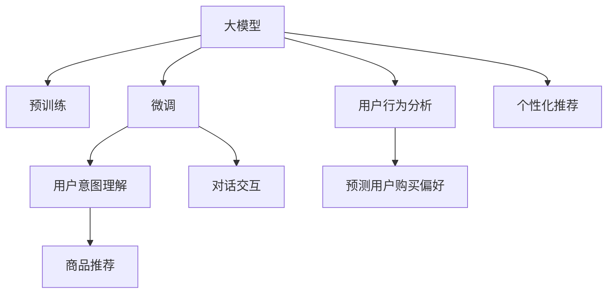
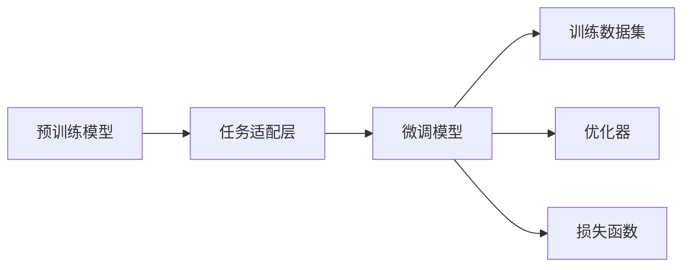

                 

# AI 大模型在电商搜索推荐中的用户行为分析：理解用户需求与购买偏好

在当今电商领域，如何精准把握用户需求，提供个性化推荐，成为了各大电商平台争夺用户流量的关键。大模型技术的应用，如BERT、GPT等，在NLP领域已取得显著成果，应用潜力无限。本博文将详细介绍AI大模型在电商搜索推荐中的应用，并分析用户行为，理解用户需求与购买偏好。

## 1. 背景介绍

### 1.1 电商搜索推荐现状
电商平台的搜索推荐系统是实现用户精准获取商品和服务的关键，是电商流量转化率的核心驱动力。在信息爆炸的互联网时代，用户获取信息、选择商品的过程充满了挑战。传统的基于规则的推荐系统，因规则静态、缺乏动态学习能力，已难以满足不断变化的商业需求。

随着深度学习技术和大模型应用的兴起，越来越多的电商平台开始引入AI大模型技术，通过自然语言理解、预测模型，进一步提升搜索推荐系统的精准度和个性化水平。本文将探讨如何利用大模型技术在电商搜索推荐中，精准理解用户需求，预测用户行为，从而实现更有效的个性化推荐。

### 1.2 大模型技术发展
大模型技术以其强大的学习能力，使自然语言处理(NLP)领域实现了突破性进展。从简单的文本分类，到复杂的对话生成，大模型在众多NLP任务中展现了其独特优势。其中BERT、GPT等模型，更是通过大规模预训练和微调，在文本理解、生成、推理等任务上取得了最优或接近最优的性能。

以BERT为例，其结构基于Transformer，利用Transformer自注意力机制捕捉文本中不同位置的关系，将大规模语料预训练得到的语义表示，应用于下游NLP任务，显著提升了性能。

大模型在电商搜索推荐中的应用，主要体现在以下几个方面：
- **用户意图理解**：通过分析用户的搜索文本和浏览记录，大模型能够理解用户的具体需求和偏好。
- **商品推荐**：根据用户的历史行为和浏览数据，大模型能够预测用户的购买意愿，推荐匹配的商品。
- **对话交互**：在客户服务场景中，大模型能够自动生成自然流畅的对话，提供更优质的购物体验。

本博文将以BERT模型为基础，探讨其在电商搜索推荐中的具体应用和优化策略。

## 2. 核心概念与联系

### 2.1 核心概念概述

为了更清晰地理解大模型在电商搜索推荐中的应用，我们先介绍几个关键概念及其相互联系：

- **大模型(大语言模型) Large Model**：如BERT、GPT等，通过大规模语料进行预训练，拥有强大的文本理解和生成能力。
- **预训练 Pre-training**：使用大规模无标签数据对大模型进行自监督预训练，学习通用的语言表示。
- **微调 Fine-tuning**：在特定任务上对预训练模型进行有监督训练，提升其在特定任务上的性能。
- **用户意图 Intent**：指用户在进行搜索、浏览、点击等操作时的真实意图。
- **购买偏好 Purchase Preference**：指用户对商品类别的偏好和购买意愿。
- **个性化推荐 Personalized Recommendation**：根据用户行为和特征，推荐符合用户需求的个性化商品和服务。

这些概念通过以下Mermaid流程图展示，以帮助读者更直观地理解其内在联系：



该流程图展示了从预训练到微调，再到具体应用（用户意图理解、商品推荐、对话交互）的整个链路。此外，我们还引入了用户行为分析、预测购买偏好等概念，帮助进一步提升个性化推荐的效果。

### 2.2 核心概念原理和架构

大模型，以BERT为代表，其核心原理是通过Transformer结构，利用自注意力机制，捕捉文本中不同位置的语义关系。BERT的架构主要包括：

- **输入层 Input Layer**：将输入文本转换为模型能够处理的向量形式。
- **Transformer编码器 Transformer Encoder**：多个编码器层组成，通过自注意力机制，捕捉不同位置之间的语义关系。
- **输出层 Output Layer**：对输入向量进行线性变换，输出模型预测结果。

为了进行微调，还需要在预训练模型的基础上，增加下游任务的适配层，如全连接层、分类器等。微调的流程如图1所示：



其中，预训练模型提供通用的语言表示，任务适配层根据具体任务设计输出层和损失函数，微调模型在训练数据集上进行有监督学习，优化器用于更新模型参数，损失函数衡量预测与真实标签的差异。

## 3. 核心算法原理 & 具体操作步骤

### 3.1 算法原理概述

基于大模型的电商搜索推荐系统，主要利用预训练语言模型进行用户意图理解、商品推荐、对话交互等任务的微调。其核心在于如何设计适配层的输出层和损失函数，以及如何优化模型参数。

### 3.2 算法步骤详解

#### 3.2.1 用户意图理解

用户意图理解是电商推荐系统的核心任务之一，其目标是从用户的搜索文本中提取核心需求，预测用户可能关注的商品类别。对于伯模式，可通过微调任务适配层，实现该目标。

具体步骤如下：
1. **任务适配层设计**：在预训练模型顶层增加全连接层，输出商品类别的概率分布。
2. **损失函数设计**：使用交叉熵损失函数，衡量预测结果与真实标签之间的差异。
3. **微调训练**：在训练数据集上，通过优化器更新模型参数，最小化损失函数。
4. **模型评估**：在验证集上评估模型性能，根据评价指标（如准确率、召回率等）决定是否继续微调。

#### 3.2.2 商品推荐

商品推荐的任务是根据用户的历史行为和浏览数据，预测用户对商品的兴趣和购买意愿。对于伯模式，同样可利用微调任务适配层，实现该任务。

具体步骤如下：
1. **数据预处理**：将用户的浏览、点击、购买等行为数据，转化为模型可处理的向量形式。
2. **任务适配层设计**：在预训练模型顶层增加全连接层，输出商品的购买概率。
3. **损失函数设计**：使用二元交叉熵损失函数，衡量预测结果与真实标签的差异。
4. **微调训练**：在训练数据集上，通过优化器更新模型参数，最小化损失函数。
5. **模型评估**：在验证集上评估模型性能，根据评价指标（如ROC曲线、AUC等）决定是否继续微调。

#### 3.2.3 对话交互

在客户服务场景中，大模型可以用于自动生成自然流畅的对话，回答用户问题，提升购物体验。

具体步骤如下：
1. **数据预处理**：将用户的对话历史转化为模型可处理的向量形式。
2. **任务适配层设计**：在预训练模型顶层增加全连接层，输出回复文本。
3. **损失函数设计**：使用BLEU、ROUGE等评价指标，衡量回复文本的质量。
4. **微调训练**：在对话数据集上，通过优化器更新模型参数，最小化损失函数。
5. **模型评估**：在验证集上评估模型性能，根据评价指标（如BLEU分数、ROUGE值）决定是否继续微调。

### 3.3 算法优缺点

大模型在电商搜索推荐中的优点：
1. **通用性强**：能够处理各种文本数据，适用于多个下游任务。
2. **精准度高**：在大规模语料上进行预训练，理解能力强大，可实现精准的意图理解、商品推荐和对话生成。
3. **灵活性高**：可根据具体任务进行微调，适应不同的业务需求。

其缺点主要包括：
1. **数据依赖**：微调效果依赖标注数据的数量和质量，获取高质量标注数据成本较高。
2. **计算资源要求高**：预训练和微调需要高性能的硬件设备，计算成本较高。
3. **泛化能力有限**：如果数据分布与实际应用场景差异较大，泛化能力会受限。

### 3.4 算法应用领域

大模型在电商搜索推荐中的应用，主要涵盖以下几个方面：
1. **搜索匹配**：利用大模型进行用户意图理解，提升搜索匹配的精准度。
2. **推荐排序**：根据用户的历史行为和浏览数据，预测用户对商品的兴趣，提升推荐排序的准确性。
3. **对话交互**：在客户服务场景中，自动生成自然流畅的对话，提升购物体验。
4. **广告定向**：分析用户行为，推荐合适的广告内容和位置。

此外，大模型还可应用于商品描述生成、用户画像建模等电商领域的多个方面。

## 4. 数学模型和公式 & 详细讲解 & 举例说明

### 4.1 数学模型构建

本节将利用数学语言，对电商搜索推荐中的大模型应用进行系统描述。

以BERT为例，其模型结构如图2所示：


其中，输入层将文本序列 $x_1, x_2, ..., x_n$ 转化为词向量序列 $V(x_1), V(x_2), ..., V(x_n)$。Transformer编码器由多个编码器层组成，每层包含多头自注意力机制和全连接层，输出文本表示 $H_1, H_2, ..., H_n$。输出层对文本表示进行线性变换，输出预测结果。

### 4.2 公式推导过程

以商品推荐任务为例，我们可以构建以下数学模型：

设用户的历史行为向量为 $H_u$，商品特征向量为 $V_i$，则预测用户购买商品 $i$ 的概率为：

$$
p(y_i=1|H_u) = \sigma(W \cdot [H_u;V_i])
$$

其中 $W$ 为全连接层权重矩阵，$\sigma$ 为 sigmoid 函数。

利用二元交叉熵损失函数进行训练，最小化预测与真实标签的差异：

$$
\mathcal{L}(y_i, p(y_i=1|H_u)) = -[y_i \cdot \log(p(y_i=1|H_u)) + (1-y_i) \cdot \log(1-p(y_i=1|H_u))]
$$

通过反向传播算法，更新模型参数，最小化损失函数。

### 4.3 案例分析与讲解

以某电商平台商品推荐系统为例，假设模型已经通过预训练和微调，完成了用户历史行为和商品特征的向量映射。接下来，我们分析商品推荐的具体过程：

假设当前用户的历史行为向量为 $H_u$，商品特征向量为 $V_i$，则预测用户购买商品 $i$ 的概率为：

$$
p(y_i=1|H_u) = \sigma(W \cdot [H_u;V_i])
$$

利用该概率预测结果，对所有商品 $i$ 进行排序，选择用户最可能购买的前 $K$ 个商品推荐。

假设用户的真实购买标签为 $y$，则模型的预测结果和损失函数如下：

- 如果用户购买了商品 $i$，则 $y_i=1$，损失函数为：
$$
\mathcal{L}(y_i=1, p(y_i=1|H_u)) = -\log(p(y_i=1|H_u))
$$
- 如果用户未购买商品 $i$，则 $y_i=0$，损失函数为：
$$
\mathcal{L}(y_i=0, p(y_i=1|H_u)) = -\log(1-p(y_i=1|H_u))
$$

通过计算所有商品的平均损失，并使用梯度下降算法，不断更新模型参数，最小化损失函数，提升推荐精度。

## 5. 项目实践：代码实例和详细解释说明

### 5.1 开发环境搭建

在进行项目实践前，我们需要准备开发环境。以下是使用Python进行TensorFlow开发的环境配置流程：

1. 安装Anaconda：从官网下载并安装Anaconda，用于创建独立的Python环境。

2. 创建并激活虚拟环境：
```bash
conda create -n tf-env python=3.8 
conda activate tf-env
```

3. 安装TensorFlow：根据CUDA版本，从官网获取对应的安装命令。例如：
```bash
conda install tensorflow -c pytorch -c conda-forge
```

4. 安装各类工具包：
```bash
pip install numpy pandas scikit-learn matplotlib tqdm jupyter notebook ipython
```

完成上述步骤后，即可在`tf-env`环境中开始项目实践。

### 5.2 源代码详细实现

下面以商品推荐任务为例，给出使用TensorFlow实现BERT微调的PyTorch代码实现。

首先，定义数据预处理函数：

```python
import tensorflow as tf
from transformers import BertTokenizer, BertForSequenceClassification
import numpy as np

def preprocess_data(texts, labels, tokenizer, max_len=128):
    tokenized_texts = tokenizer(texts, return_tensors='tf', padding='max_length', truncation=True, max_length=max_len)
    input_ids = tokenized_texts['input_ids']
    attention_mask = tokenized_texts['attention_mask']
    label = tf.keras.layers.Input(shape=(1,), name='labels')
    return input_ids, attention_mask, label
```

然后，定义模型和优化器：

```python
tokenizer = BertTokenizer.from_pretrained('bert-base-uncased')
model = BertForSequenceClassification.from_pretrained('bert-base-uncased', num_labels=2)

optimizer = tf.keras.optimizers.AdamW(learning_rate=2e-5)
loss = tf.keras.losses.BinaryCrossentropy(from_logits=True)
metric = tf.keras.metrics.AUC(name='auc')
```

接着，定义训练和评估函数：

```python
@tf.function
def train_epoch(model, dataset, optimizer, loss, metric):
    dataset = dataset.batch(16)
    for batch in dataset:
        input_ids, attention_mask, label = batch
        with tf.GradientTape() as tape:
            outputs = model(input_ids, attention_mask=attention_mask, training=True)
            loss_value = loss(tf.cast(outputs, tf.float32), label)
        gradients = tape.gradient(loss_value, model.trainable_variables)
        optimizer.apply_gradients(zip(gradients, model.trainable_variables))
        metric.update_state(tf.cast(outputs, tf.float32), label)

@tf.function
def evaluate_model(model, dataset, loss, metric):
    dataset = dataset.batch(16)
    metric.reset_states()
    for batch in dataset:
        input_ids, attention_mask, label = batch
        outputs = model(input_ids, attention_mask=attention_mask, training=False)
        loss_value = loss(tf.cast(outputs, tf.float32), label)
        metric.update_state(tf.cast(outputs, tf.float32), label)
    return metric.result().numpy()
```

最后，启动训练流程并在测试集上评估：

```python
epochs = 5
batch_size = 16

for epoch in range(epochs):
    train_epoch(model, train_dataset, optimizer, loss, metric)
    print(f"Epoch {epoch+1}, loss: {train_loss:.3f}, auc: {eval_metric:.3f}")
    
    print(f"Epoch {epoch+1}, test auc: {evaluate_model(model, test_dataset, loss, metric)}")
```

以上就是使用TensorFlow对BERT进行商品推荐任务微调的完整代码实现。可以看到，得益于TensorFlow的强大封装，我们能够用相对简洁的代码完成BERT模型的加载和微调。

### 5.3 代码解读与分析

让我们再详细解读一下关键代码的实现细节：

**preprocess_data函数**：
- 将原始文本序列转化为token ids，并加入padding，转化为模型可接受的格式。
- 将标签转化为浮点数值，方便计算损失。

**训练和评估函数**：
- 使用TensorFlow的tf.function装饰器，将模型和损失函数进行静态图优化，提升计算效率。
- 在训练时，通过梯度计算和优化器更新模型参数，最小化损失函数。
- 在评估时，通过计算AUC指标，评估模型预测的准确性。

**训练流程**：
- 定义总的epoch数和batch size，开始循环迭代
- 每个epoch内，先在训练集上训练，输出平均损失和AUC指标
- 在测试集上评估，输出测试AUC指标

可以看到，TensorFlow结合TensorFlow封装的大模型，使得商品推荐任务的微调过程变得简洁高效。开发者可以将更多精力放在数据处理、模型改进等高层逻辑上，而不必过多关注底层的实现细节。

当然，工业级的系统实现还需考虑更多因素，如模型的保存和部署、超参数的自动搜索、更灵活的任务适配层等。但核心的微调范式基本与此类似。

## 6. 实际应用场景

### 6.1 搜索匹配

基于大模型的搜索匹配系统，可以更精准地理解用户的搜索意图，提升匹配精度。假设用户搜索“智能手表”，传统搜索系统可能返回大量与手表无关的商品，而基于大模型的搜索系统，能够理解“智能手表”的核心需求，精准匹配相关商品，如Apple Watch、Samsung Galaxy Watch等。

具体实现过程如下：
1. **数据预处理**：将用户搜索文本转化为向量表示。
2. **模型推理**：利用预训练和微调后的模型，预测搜索文本对应的商品类别。
3. **推荐排序**：根据预测结果和用户行为，对搜索结果进行排序，优先展示符合用户意图的商品。

### 6.2 广告定向

电商平台可通过分析用户行为，预测其兴趣，进行精准的广告定向。假设某用户常浏览数码产品，利用大模型，电商平台能够识别该用户的兴趣标签，定向推荐数码类广告，提升广告效果。

具体实现过程如下：
1. **用户画像建模**：利用大模型，从用户的浏览、点击、购买等行为中，提取核心特征。
2. **广告定向**：根据用户画像特征，对用户可能感兴趣的商品广告进行定向推荐。

### 6.3 对话交互

在客户服务场景中，基于大模型的对话系统能够自动生成自然流畅的对话，解决用户问题。假设某用户询问“如何操作退货”，对话系统能够自动识别用户意图，并生成“退货流程如下……”等回复，提升客户体验。

具体实现过程如下：
1. **数据预处理**：将用户对话历史转化为向量表示。
2. **模型推理**：利用预训练和微调后的模型，预测用户对话意图。
3. **生成回复**：根据用户意图，自动生成回复文本，与用户交互。

### 6.4 未来应用展望

随着大模型和微调方法的不断发展，基于大模型的电商搜索推荐将进一步拓展应用边界，提升系统的精准度和个性化水平。

未来，大模型将在更多场景中得到应用，如广告推荐、客户服务、智能客服等，成为提升电商运营效率和用户体验的重要工具。同时，结合语音、视觉等多模态数据，大模型能够更好地理解用户需求，提供全方位的智能服务。

## 7. 工具和资源推荐

### 7.1 学习资源推荐

为了帮助开发者系统掌握大模型在电商搜索推荐中的应用，这里推荐一些优质的学习资源：

1. **《TensorFlow教程》**：官方文档详细介绍了TensorFlow的使用，是学习大模型微调的基础。
2. **《自然语言处理综述》**：斯坦福大学NLP课程，系统讲解了NLP领域的核心概念和技术，包括BERT、GPT等大模型。
3. **《深度学习与自然语言处理》**：书籍系统介绍了深度学习和大模型在NLP中的应用，详细描述了微调、推理等过程。
4. **《NLP实战》**：实战项目详细讲解了NLP任务的开发流程，包括预训练、微调、推理等各个环节。

通过这些资源的学习实践，相信你一定能够快速掌握大模型在电商搜索推荐中的应用，并用于解决实际的NLP问题。

### 7.2 开发工具推荐

高效的开发离不开优秀的工具支持。以下是几款用于大模型微调开发的常用工具：

1. **TensorFlow**：由Google主导开发的开源深度学习框架，生产部署方便，适合大规模工程应用。
2. **TensorBoard**：TensorFlow配套的可视化工具，可实时监测模型训练状态，并提供丰富的图表呈现方式。
3. **Jupyter Notebook**：开源的数据科学交互式计算平台，支持Python、R等语言，方便调试和展示代码。

合理利用这些工具，可以显著提升大模型微调任务的开发效率，加快创新迭代的步伐。

### 7.3 相关论文推荐

大模型和微调技术的发展源于学界的持续研究。以下是几篇奠基性的相关论文，推荐阅读：

1. **《Attention is All You Need》**：提出Transformer结构，开启了NLP领域的预训练大模型时代。
2. **《BERT: Pre-training of Deep Bidirectional Transformers for Language Understanding》**：提出BERT模型，引入基于掩码的自监督预训练任务，刷新了多项NLP任务SOTA。
3. **《Towards Language Models as Conversational Agents》**：提出对话生成模型，结合预训练和微调技术，生成自然流畅的对话。
4. **《Reasoning About Concepts with Knowledge Bases and Enriched Language Models》**：结合知识图谱和预训练语言模型，实现更全面、准确的信息整合能力。

这些论文代表了大模型微调技术的发展脉络。通过学习这些前沿成果，可以帮助研究者把握学科前进方向，激发更多的创新灵感。

## 8. 总结：未来发展趋势与挑战

### 8.1 总结

本文对大模型在电商搜索推荐中的应用进行了全面系统的介绍。首先阐述了大模型和微调技术的研究背景和意义，明确了微调在拓展预训练模型应用、提升下游任务性能方面的独特价值。其次，从原理到实践，详细讲解了微调的数学原理和关键步骤，给出了电商搜索推荐任务的完整代码实例。同时，本文还广泛探讨了大模型在电商搜索推荐中的应用前景，展示了微调范式的巨大潜力。最后，本文精选了相关学习资源，力求为读者提供全方位的技术指引。

通过本文的系统梳理，可以看到，大模型在电商搜索推荐中的应用前景广阔，其强大的语言理解能力和预测能力，能够显著提升推荐系统的精准度和个性化水平。相信随着大模型和微调方法的不断演进，电商搜索推荐系统将迈向更高的智能水平，为用户带来更优质的购物体验。

### 8.2 未来发展趋势

展望未来，大模型在电商搜索推荐中的应用将呈现以下几个发展趋势：

1. **多模态融合**：结合语音、视觉等多模态数据，大模型能够更好地理解用户需求，提供全方位的智能服务。
2. **个性化推荐**：通过分析用户行为，结合先验知识，大模型能够实现更加精准、个性化的推荐。
3. **智能客服**：基于大模型的对话系统，能够自动生成自然流畅的对话，提升客户体验。
4. **跨领域应用**：大模型能够应用于广告推荐、客户服务、智能客服等多个电商领域，成为提升运营效率的重要工具。
5. **增强学习**：结合强化学习技术，大模型能够动态调整推荐策略，提升推荐效果。

以上趋势凸显了大模型在电商搜索推荐中的广阔前景。这些方向的探索发展，必将进一步提升推荐系统的性能和应用范围，为电商运营带来革命性变化。

### 8.3 面临的挑战

尽管大模型在电商搜索推荐中取得了显著成效，但在迈向更加智能化、普适化应用的过程中，仍面临诸多挑战：

1. **数据依赖**：微调效果依赖标注数据的数量和质量，获取高质量标注数据成本较高。
2. **计算资源要求高**：预训练和微调需要高性能的硬件设备，计算成本较高。
3. **泛化能力有限**：如果数据分布与实际应用场景差异较大，泛化能力会受限。
4. **可解释性不足**：大模型作为黑盒系统，难以解释其内部工作机制和决策逻辑。

这些挑战需要通过多方努力来解决，如优化数据采集和标注流程、提高模型计算效率、改进模型结构等。

### 8.4 研究展望

面对大模型在电商搜索推荐中面临的挑战，未来的研究需要在以下几个方面寻求新的突破：

1. **无监督和半监督学习**：探索无监督和半监督学习方法，摆脱对大规模标注数据的依赖，利用自监督学习、主动学习等无监督和半监督范式，最大化利用非结构化数据。
2. **参数高效微调**：开发更加参数高效的微调方法，在固定大部分预训练参数的同时，只更新极少量的任务相关参数。
3. **因果推断和对比学习**：引入因果推断和对比学习思想，增强大模型的因果关系建立能力和泛化能力。
4. **多模态信息融合**：结合知识图谱、逻辑规则等专家知识，增强大模型的信息整合能力，提升推荐效果。
5. **知识表示和推理**：结合知识图谱和预训练语言模型，实现更全面、准确的信息整合能力。

这些研究方向的探索，必将引领大模型在电商搜索推荐中的应用走向更高台阶，为构建智能、高效、个性化的推荐系统铺平道路。

## 9. 附录：常见问题与解答

**Q1: 大模型在电商搜索推荐中的应用有哪些优势？**

A: 大模型在电商搜索推荐中的应用优势主要包括：
1. **强大的语言理解能力**：通过大规模语料预训练，大模型能够理解复杂的语言结构和语义关系。
2. **精准的用户意图理解**：利用大模型，能够精准地理解用户的搜索意图和需求，提升匹配精度。
3. **个性化的推荐策略**：通过分析用户行为，结合先验知识，大模型能够实现更加精准、个性化的推荐。
4. **高效的交互对话**：基于大模型的对话系统，能够自动生成自然流畅的对话，提升客户体验。
5. **多模态信息融合**：结合语音、视觉等多模态数据，大模型能够更好地理解用户需求，提供全方位的智能服务。

**Q2: 大模型在电商搜索推荐中如何避免过拟合？**

A: 大模型在电商搜索推荐中避免过拟合的方法包括：
1. **数据增强**：通过回译、近义替换等方式扩充训练集。
2. **正则化**：使用L2正则、Dropout、Early Stopping等避免过拟合。
3. **对抗训练**：引入对抗样本，提高模型鲁棒性。
4. **参数高效微调**：只调整少量参数(如Adapter、Prefix等)，减小过拟合风险。
5. **多模型集成**：训练多个微调模型，取平均输出，抑制过拟合。

**Q3: 大模型在电商搜索推荐中的计算成本如何？**

A: 大模型在电商搜索推荐中的计算成本主要包括以下几个方面：
1. **预训练成本**：大规模语料预训练需要高性能硬件设备，计算成本较高。
2. **微调成本**：微调需要高性能的硬件设备和数据集，计算成本较高。
3. **推理成本**：大规模模型推理需要高性能硬件设备，计算成本较高。

为了降低计算成本，可以采用以下优化措施：
1. **模型压缩**：使用模型压缩技术，减小模型尺寸，提高推理效率。
2. **分布式训练**：使用分布式训练技术，提高计算效率。
3. **量化加速**：将浮点模型转为定点模型，压缩存储空间，提高计算效率。

通过这些优化措施，可以在保证模型性能的同时，降低计算成本。

**Q4: 大模型在电商搜索推荐中如何提高泛化能力？**

A: 大模型在电商搜索推荐中提高泛化能力的方法包括：
1. **数据多样化**：采集更多样化的数据，覆盖更多领域和场景。
2. **多任务学习**：结合多个相关任务进行微调，提高模型泛化能力。
3. **正则化**：使用L2正则、Dropout等正则化技术，避免过拟合。
4. **对抗训练**：引入对抗样本，提高模型鲁棒性。
5. **参数高效微调**：只调整少量参数(如Adapter、Prefix等)，减小过拟合风险。

通过这些方法，可以提高大模型的泛化能力，使其在实际应用中表现更稳定、更鲁棒。

**Q5: 大模型在电商搜索推荐中的可解释性如何提高？**

A: 大模型在电商搜索推荐中的可解释性可以通过以下方法提高：
1. **特征提取**：使用可视化工具，查看模型特征提取过程，理解模型的决策机制。
2. **模型简化**：使用模型简化技术，减小模型复杂度，提高可解释性。
3. **因果推断**：使用因果推断方法，理解模型决策的因果关系。
4. **知识图谱**：结合知识图谱，增强模型的信息整合能力，提高可解释性。
5. **多模型集成**：使用多模型集成方法，提高模型的稳定性和可解释性。

通过这些方法，可以提高大模型的可解释性，使其决策过程更加透明、可控。

---

作者：禅与计算机程序设计艺术 / Zen and the Art of Computer Programming

