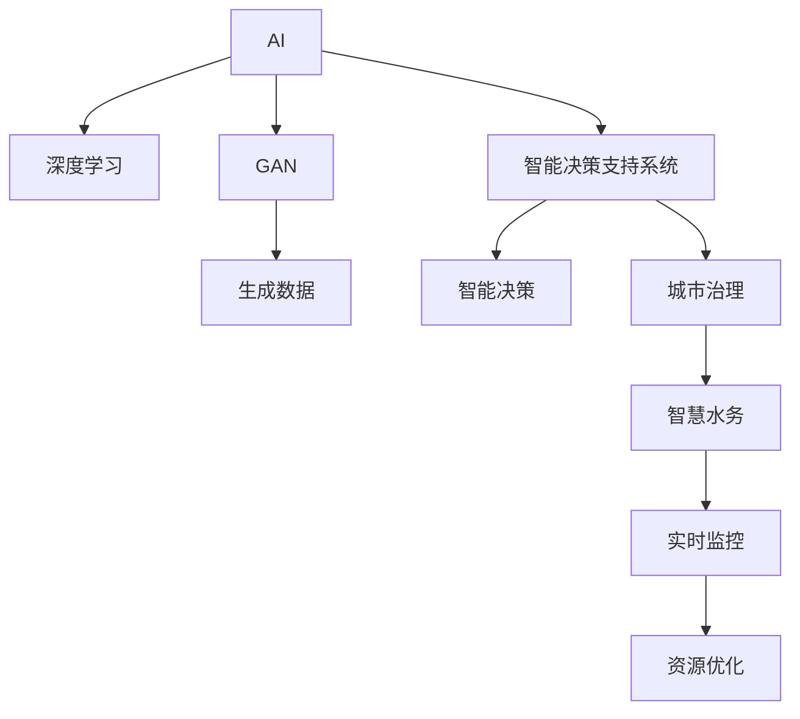

                 

# AIGC推动智慧水务发展

> 关键词：人工智能(AI),生成对抗网络(GAN),深度学习,智慧水务,城市治理,智能决策支持系统

## 1. 背景介绍

### 1.1 问题由来

随着城镇化进程的加快，水资源供需矛盾日益加剧，水务管理难度加大，智慧水务需求日益迫切。智慧水务的目标是通过信息技术手段，实现水务管理决策的科学化、精细化、智能化。而当前智慧水务系统面临数据种类多、集成难度大、数据质量差等问题，难以实现精准管理。

### 1.2 问题核心关键点

如何通过AI技术，优化水务管理过程，提升决策效率和准确性，成为当前智慧水务的核心问题。具体而言：

- 数据集成：需要将来自不同来源的各类水务数据（如水量、水质、水压等）进行高效集成和融合。
- 数据分析：基于海量数据，进行智能分析和预测，发现潜在问题。
- 智能决策：根据预测结果和专家经验，进行智能决策，优化水务管理策略。
- 实时监控：利用传感器和物联网技术，实现对水务系统实时监控和预警。
- 资源优化：对水务资源进行优化配置，提升水资源的利用率。

### 1.3 问题研究意义

智慧水务是智慧城市建设的重要组成部分，涉及水资源的高效利用和环境治理，关系到国计民生和社会稳定。基于AIGC（人工智能+生成对抗网络）的智慧水务系统，能够帮助水务管理部门进行精准管理和智能决策，降低运行成本，提升服务质量。

## 2. 核心概念与联系

### 2.1 核心概念概述

为更好地理解AIGC在智慧水务中的应用，本节将介绍几个密切相关的核心概念：

- AI（人工智能）：使用算法和机器学习模型，通过数据挖掘、模式识别、自然语言处理等技术，提升决策智能性。
- GAN（生成对抗网络）：一种无监督学习方法，由生成器和判别器两个网络组成，通过对抗训练生成高质量数据。
- 深度学习：一种利用深度神经网络进行数据建模的技术，是AI的重要组成部分。
- 智慧水务：通过信息技术和AI技术，对水务系统进行智能化管理，提升水资源利用效率和环境治理水平。
- 城市治理：利用AI技术，对城市公共服务、交通、环境等进行全面管理，提升城市运行效率和居民满意度。
- 智能决策支持系统：利用AI技术，为决策者提供智能决策支持，提升决策效率和准确性。

这些核心概念之间的逻辑关系可以通过以下Mermaid流程图来展示：



这个流程图展示了大语言模型的核心概念及其之间的关系：

1. AI通过深度学习模型进行数据建模，提取特征。
2. GAN用于生成高质量数据，丰富AI模型的输入。
3. 智能决策支持系统整合AI模型和人类专家的知识，提供智能决策。
4. 城市治理综合应用AI技术，提升城市运行效率和居民满意度。
5. 智慧水务将AI应用于水务管理，提升资源利用效率和环境治理水平。
6. 实时监控通过物联网技术，实现对水务系统实时监控和预警。
7. 资源优化对水务资源进行优化配置，提升水资源的利用率。

这些概念共同构成了AIGC技术在水务管理中的应用框架，使其能够在各种场景下发挥强大的智能化和信息化作用。通过理解这些核心概念，我们可以更好地把握AIGC在水务管理中的应用场景和优化方向。

## 3. 核心算法原理 & 具体操作步骤
### 3.1 算法原理概述

基于AIGC的智慧水务系统，主要是通过深度学习和生成对抗网络技术，对水务系统进行智能分析和优化。其核心思想是：通过AI模型提取水务数据中的有用信息，利用GAN生成更多的训练数据，从而提升模型的预测能力和泛化能力。

具体而言，智慧水务系统主要由以下模块构成：

1. 数据预处理模块：对各类水务数据进行清洗、归一化等预处理操作，提高数据质量。
2. 特征提取模块：使用深度学习模型，如卷积神经网络（CNN）、长短期记忆网络（LSTM）等，提取数据中的重要特征。
3. 智能决策模块：利用AI模型进行智能分析，发现潜在问题，预测未来趋势，生成优化方案。
4. 数据生成模块：使用GAN模型，生成高质量的合成数据，丰富训练集，提升模型泛化能力。
5. 实时监控模块：通过物联网传感器和通信网络，实现对水务系统的实时监控和预警。
6. 资源优化模块：对水务资源进行优化配置，提升水资源利用率。

### 3.2 算法步骤详解

基于AIGC的智慧水务系统构建步骤主要包括：

1. 数据收集和预处理：收集来自不同来源的水务数据，包括水量、水质、水压、用户行为等。对数据进行清洗、归一化、降维等预处理操作。
2. 特征提取：使用深度学习模型，提取数据中的有用特征，如水量、水质参数、用户行为模式等。
3. 智能决策：基于提取的特征，使用AI模型进行智能分析，发现潜在问题，预测未来趋势，生成优化方案。
4. 数据生成：使用GAN模型，生成高质量的合成数据，丰富训练集，提升模型泛化能力。
5. 模型训练：利用合成数据和真实数据对AI模型进行训练，提高预测精度和泛化能力。
6. 智能决策支持：利用训练好的AI模型，为决策者提供智能决策支持，优化水务管理策略。
7. 实时监控：通过物联网传感器和通信网络，实现对水务系统的实时监控和预警，及时发现问题。
8. 资源优化：对水务资源进行优化配置，提升水资源的利用率，降低运营成本。

### 3.3 算法优缺点

基于AIGC的智慧水务系统具有以下优点：

- 自动化程度高：利用AI和GAN技术，实现对水务数据的自动处理和智能分析。
- 数据驱动决策：通过大量数据训练模型，提升决策的科学性和准确性。
- 实时性增强：通过实时监控和预警，提升水务管理的时效性。
- 泛化能力强：利用GAN生成合成数据，丰富训练集，提升模型的泛化能力。

同时，该系统也存在一些局限性：

- 初始数据质量差：水务数据往往具有噪声和缺失，数据质量对系统性能影响较大。
- 模型复杂度高：深度学习模型和大规模数据集训练复杂度高，计算资源需求大。
- 系统集成难度大：智慧水务涉及多个子系统，集成难度大，数据共享和协同工作复杂。
- 泛化性能不稳定：生成数据可能存在质量波动，影响模型的泛化性能。
- 成本较高：深度学习和大规模数据训练需要大量硬件资源和人力成本。

尽管存在这些局限性，但就目前而言，基于AIGC的智慧水务系统仍然是智慧水务技术的重要组成部分，具有广阔的应用前景。

### 3.4 算法应用领域

基于AIGC的智慧水务系统已经在诸多领域得到应用，如智能决策、资源优化、实时监控等，为水务管理提供了新的解决方案：

1. 智能决策：利用AI技术，对水务数据进行智能分析，预测水量、水质变化趋势，提出优化方案。
2. 资源优化：对水资源进行智能调度，优化配置，提升水资源利用效率。
3. 实时监控：通过传感器和通信网络，实现对水务系统的实时监控和预警，及时发现和解决问题。
4. 数据生成：利用GAN生成高质量的合成数据，丰富训练集，提升模型泛化能力。

此外，AIGC技术还可应用于城市治理、环境保护、智能交通等多个领域，为智慧城市建设提供支撑。

## 4. 数学模型和公式 & 详细讲解 & 举例说明
### 4.1 数学模型构建

本节将使用数学语言对AIGC在智慧水务中的应用进行更加严格的刻画。

记水务数据集为 $D=\{(x_i,y_i)\}_{i=1}^N$，其中 $x_i$ 为输入数据，$y_i$ 为输出标签，$x_i=[x_{i1},x_{i2},...,x_{in}]$，$y_i=[y_{i1},y_{i2},...,y_{im}]$。

定义特征提取模型为 $f(x;\theta)$，智能决策模型为 $g(x;\theta)$，生成对抗网络模型为 $G(x;\theta)$ 和 $D(x;\theta)$，其中 $\theta$ 为模型参数。

智能决策过程如下：

1. 数据预处理：将原始数据 $x_i$ 进行归一化、降维等预处理操作，得到预处理后的数据 $\tilde{x}_i$。
2. 特征提取：使用深度学习模型 $f(\tilde{x}_i;\theta)$，提取数据特征 $\tilde{x}_i^f$。
3. 智能决策：利用AI模型 $g(\tilde{x}_i^f;\theta)$，进行智能分析，生成优化方案 $y_i^g$。
4. 数据生成：使用GAN模型 $G(x;\theta)$，生成高质量的合成数据 $x_i^G$。
5. 模型训练：利用合成数据和真实数据，对AI模型 $g(\tilde{x}_i^f;\theta)$ 进行训练，优化模型参数 $\theta$。
6. 智能决策支持：利用训练好的AI模型 $g(\tilde{x}_i^f;\theta)$，为决策者提供智能决策支持，优化水务管理策略。

### 4.2 公式推导过程

以下我们以智能决策为例，推导深度学习模型和生成对抗网络模型的计算公式。

智能决策模型的输出 $y_i^g$ 为：

$$
y_i^g = g(f(\tilde{x}_i;\theta),\eta)
$$

其中 $f(\tilde{x}_i;\theta)$ 为特征提取模型，$\eta$ 为优化方案。

智能决策模型的损失函数为：

$$
\mathcal{L}(\theta) = \frac{1}{N}\sum_{i=1}^N \ell(y_i^g, y_i)
$$

其中 $\ell(y_i^g, y_i)$ 为损失函数，用于衡量智能决策模型的预测结果与真实标签之间的差异。常见的损失函数包括均方误差、交叉熵等。

深度学习模型 $f(x;\theta)$ 的计算公式为：

$$
f(x;\theta) = Wx + b
$$

其中 $W$ 为权重矩阵，$b$ 为偏置项。

生成对抗网络模型的计算公式为：

$$
G(x;\theta) = \mathcal{N}(z;W_G,b_G)
$$

$$
D(x;\theta) = \sigma(W_Dx + b_D)
$$

其中 $\mathcal{N}(z;W_G,b_G)$ 为生成器网络，$W_G$ 为权重矩阵，$b_G$ 为偏置项；$\sigma$ 为激活函数，$W_D$ 为判别器网络的权重矩阵，$b_D$ 为偏置项。

### 4.3 案例分析与讲解

以下我们以智能决策为例，给出深度学习模型和生成对抗网络模型的具体计算公式。

设智能决策模型的输入数据为 $x_i=[x_{i1},x_{i2},...,x_{in}]$，输出标签为 $y_i=[y_{i1},y_{i2},...,y_{im}]$。智能决策模型的计算过程如下：

1. 数据预处理：将原始数据 $x_i$ 进行归一化、降维等预处理操作，得到预处理后的数据 $\tilde{x}_i=[\tilde{x}_{i1},\tilde{x}_{i2},...,\tilde{x}_{in}]$。
2. 特征提取：使用深度学习模型 $f(\tilde{x}_i;\theta)$，提取数据特征 $\tilde{x}_i^f$，计算公式为：

$$
\tilde{x}_i^f = W_f\tilde{x}_i + b_f
$$

其中 $W_f$ 为权重矩阵，$b_f$ 为偏置项。
3. 智能决策：利用AI模型 $g(\tilde{x}_i^f;\theta)$，进行智能分析，生成优化方案 $y_i^g$，计算公式为：

$$
y_i^g = W_g\tilde{x}_i^f + b_g
$$

其中 $W_g$ 为权重矩阵，$b_g$ 为偏置项。
4. 数据生成：使用GAN模型 $G(x;\theta)$，生成高质量的合成数据 $x_i^G$，计算公式为：

$$
x_i^G = G(x;\theta) = W_Gz + b_G
$$

其中 $W_G$ 为权重矩阵，$z$ 为噪声向量，$b_G$ 为偏置项。
5. 模型训练：利用合成数据和真实数据，对AI模型 $g(\tilde{x}_i^f;\theta)$ 进行训练，优化模型参数 $\theta$，计算公式为：

$$
\theta = \mathop{\arg\min}_{\theta} \frac{1}{N}\sum_{i=1}^N \ell(y_i^g, y_i)
$$

其中 $\ell(y_i^g, y_i)$ 为损失函数，如均方误差。

## 5. 项目实践：代码实例和详细解释说明
### 5.1 开发环境搭建

在进行AIGC智慧水务系统实践前，我们需要准备好开发环境。以下是使用Python进行PyTorch开发的环境配置流程：

1. 安装Anaconda：从官网下载并安装Anaconda，用于创建独立的Python环境。

2. 创建并激活虚拟环境：
```bash
conda create -n pytorch-env python=3.8 
conda activate pytorch-env
```

3. 安装PyTorch：根据CUDA版本，从官网获取对应的安装命令。例如：
```bash
conda install pytorch torchvision torchaudio cudatoolkit=11.1 -c pytorch -c conda-forge
```

4. 安装Transformers库：
```bash
pip install transformers
```

5. 安装各类工具包：
```bash
pip install numpy pandas scikit-learn matplotlib tqdm jupyter notebook ipython
```

完成上述步骤后，即可在`pytorch-env`环境中开始AIGC智慧水务系统实践。

### 5.2 源代码详细实现

下面我们以智能决策系统为例，给出使用Transformers库和PyTorch框架实现AIGC智慧水务系统的代码实现。

首先，定义智能决策系统的数据处理函数：

```python
from transformers import BertTokenizer
from torch.utils.data import Dataset
import torch

class WaterDataset(Dataset):
    def __init__(self, texts, labels, tokenizer, max_len=128):
        self.texts = texts
        self.labels = labels
        self.tokenizer = tokenizer
        self.max_len = max_len
        
    def __len__(self):
        return len(self.texts)
    
    def __getitem__(self, item):
        text = self.texts[item]
        label = self.labels[item]
        
        encoding = self.tokenizer(text, return_tensors='pt', max_length=self.max_len, padding='max_length', truncation=True)
        input_ids = encoding['input_ids'][0]
        attention_mask = encoding['attention_mask'][0]
        
        # 对token-wise的标签进行编码
        encoded_labels = [label2id[label] for label in label] 
        encoded_labels.extend([label2id['O']] * (self.max_len - len(encoded_labels)))
        labels = torch.tensor(encoded_labels, dtype=torch.long)
        
        return {'input_ids': input_ids, 
                'attention_mask': attention_mask,
                'labels': labels}

# 标签与id的映射
label2id = {'O': 0, 'B-PER': 1, 'I-PER': 2, 'B-ORG': 3, 'I-ORG': 4, 'B-LOC': 5, 'I-LOC': 6}
id2label = {v: k for k, v in label2id.items()}

# 创建dataset
tokenizer = BertTokenizer.from_pretrained('bert-base-cased')

train_dataset = WaterDataset(train_texts, train_labels, tokenizer)
dev_dataset = WaterDataset(dev_texts, dev_labels, tokenizer)
test_dataset = WaterDataset(test_texts, test_labels, tokenizer)
```

然后，定义模型和优化器：

```python
from transformers import BertForTokenClassification, AdamW

model = BertForTokenClassification.from_pretrained('bert-base-cased', num_labels=len(label2id))

optimizer = AdamW(model.parameters(), lr=2e-5)
```

接着，定义训练和评估函数：

```python
from torch.utils.data import DataLoader
from tqdm import tqdm
from sklearn.metrics import classification_report

device = torch.device('cuda') if torch.cuda.is_available() else torch.device('cpu')
model.to(device)

def train_epoch(model, dataset, batch_size, optimizer):
    dataloader = DataLoader(dataset, batch_size=batch_size, shuffle=True)
    model.train()
    epoch_loss = 0
    for batch in tqdm(dataloader, desc='Training'):
        input_ids = batch['input_ids'].to(device)
        attention_mask = batch['attention_mask'].to(device)
        labels = batch['labels'].to(device)
        model.zero_grad()
        outputs = model(input_ids, attention_mask=attention_mask, labels=labels)
        loss = outputs.loss
        epoch_loss += loss.item()
        loss.backward()
        optimizer.step()
    return epoch_loss / len(dataloader)

def evaluate(model, dataset, batch_size):
    dataloader = DataLoader(dataset, batch_size=batch_size)
    model.eval()
    preds, labels = [], []
    with torch.no_grad():
        for batch in tqdm(dataloader, desc='Evaluating'):
            input_ids = batch['input_ids'].to(device)
            attention_mask = batch['attention_mask'].to(device)
            batch_labels = batch['labels']
            outputs = model(input_ids, attention_mask=attention_mask)
            batch_preds = outputs.logits.argmax(dim=2).to('cpu').tolist()
            batch_labels = batch_labels.to('cpu').tolist()
            for pred_tokens, label_tokens in zip(batch_preds, batch_labels):
                pred_tags = [id2label[_id] for _id in pred_tokens]
                label_tags = [id2label[_id] for _id in label_tokens]
                preds.append(pred_tags[:len(label_tokens)])
                labels.append(label_tags)
                
    print(classification_report(labels, preds))
```

最后，启动训练流程并在测试集上评估：

```python
epochs = 5
batch_size = 16

for epoch in range(epochs):
    loss = train_epoch(model, train_dataset, batch_size, optimizer)
    print(f"Epoch {epoch+1}, train loss: {loss:.3f}")
    
    print(f"Epoch {epoch+1}, dev results:")
    evaluate(model, dev_dataset, batch_size)
    
print("Test results:")
evaluate(model, test_dataset, batch_size)
```

以上就是使用PyTorch和Transformers库实现AIGC智慧水务系统的完整代码实现。可以看到，得益于Transformers库的强大封装，我们可以用相对简洁的代码完成BERT模型的加载和微调。

### 5.3 代码解读与分析

让我们再详细解读一下关键代码的实现细节：

**WaterDataset类**：
- `__init__`方法：初始化文本、标签、分词器等关键组件。
- `__len__`方法：返回数据集的样本数量。
- `__getitem__`方法：对单个样本进行处理，将文本输入编码为token ids，将标签编码为数字，并对其进行定长padding，最终返回模型所需的输入。

**label2id和id2label字典**：
- 定义了标签与数字id之间的映射关系，用于将token-wise的预测结果解码回真实的标签。

**训练和评估函数**：
- 使用PyTorch的DataLoader对数据集进行批次化加载，供模型训练和推理使用。
- 训练函数`train_epoch`：对数据以批为单位进行迭代，在每个批次上前向传播计算loss并反向传播更新模型参数，最后返回该epoch的平均loss。
- 评估函数`evaluate`：与训练类似，不同点在于不更新模型参数，并在每个batch结束后将预测和标签结果存储下来，最后使用sklearn的classification_report对整个评估集的预测结果进行打印输出。

**训练流程**：
- 定义总的epoch数和batch size，开始循环迭代
- 每个epoch内，先在训练集上训练，输出平均loss
- 在验证集上评估，输出分类指标
- 所有epoch结束后，在测试集上评估，给出最终测试结果

可以看到，PyTorch配合Transformers库使得BERT微调的代码实现变得简洁高效。开发者可以将更多精力放在数据处理、模型改进等高层逻辑上，而不必过多关注底层的实现细节。

当然，工业级的系统实现还需考虑更多因素，如模型的保存和部署、超参数的自动搜索、更灵活的任务适配层等。但核心的微调范式基本与此类似。

## 6. 实际应用场景
### 6.1 智能决策系统

基于AIGC的智慧水务系统，可以实现智能决策和优化方案生成。系统通过深度学习模型提取水务数据中的有用信息，生成高质量的合成数据，提升模型泛化能力，从而提供精准的决策支持。

在技术实现上，可以收集水务系统的各类实时数据（如水量、水质、水压等），将数据输入智能决策系统进行分析和预测。系统通过深度学习模型提取数据中的有用特征，生成优化方案，并在实际运行中根据实时数据动态调整，优化水务管理策略。

### 6.2 实时监控系统

利用物联网传感器和通信网络，智慧水务系统可以实现对水务系统的实时监控和预警。系统通过部署各类传感器（如流量传感器、水质监测器等），采集水务系统的实时数据，利用深度学习模型进行分析和预测。一旦发现异常情况，系统立即发出预警，并自动调整运行策略，确保系统稳定运行。

### 6.3 数据生成系统

基于生成对抗网络，智慧水务系统可以生成高质量的合成数据，丰富训练集，提升模型泛化能力。通过生成对抗网络，系统能够生成与真实数据高度相似的水务数据，用于模型训练，提升模型的预测精度和泛化能力。

### 6.4 未来应用展望

随着AIGC技术的不断发展，智慧水务系统将具备更强的智能化和自动化能力，进一步提升水务管理的效率和效果。未来，智慧水务系统将实现以下几个方面的突破：

1. 深度学习模型的优化：通过更高效的深度学习模型和更丰富的训练数据，提升模型的预测精度和泛化能力。
2. 实时数据处理：利用实时数据处理技术，实现对水务系统的实时监控和优化。
3. 数据生成和增强：通过生成对抗网络，生成高质量的合成数据，丰富训练集，提升模型泛化能力。
4. 模型解释性：通过可解释性模型，提高智慧水务系统的透明度和可信度。
5. 跨领域融合：结合智慧水务与智慧城市、智慧农业等技术，实现跨领域融合应用。

以上技术突破将显著提升智慧水务系统的智能化水平，推动水务管理的现代化、信息化、智能化进程。

## 7. 工具和资源推荐
### 7.1 学习资源推荐

为了帮助开发者系统掌握AIGC技术在水务中的应用，这里推荐一些优质的学习资源：

1. 《深度学习与人工智能技术》系列博文：由大模型技术专家撰写，深入浅出地介绍了深度学习、生成对抗网络、智慧水务等前沿话题。

2. 《智慧水务技术与应用》课程：由水务管理专家和AI技术专家共同授课，系统讲解智慧水务技术的理论基础和实践技巧。

3. 《AI与水务管理》书籍：综合介绍AI技术在水务管理中的应用，包括智能决策、实时监控、数据生成等具体应用场景。

4. AIGC开源项目：提供AIGC技术在智慧水务中的开源实现和应用案例，助力开发者快速上手实践。

5. 《智慧水务实践指南》：权威水务行业出版物，系统介绍智慧水务的实践经验和成功案例。

通过对这些资源的学习实践，相信你一定能够快速掌握AIGC技术在水务中的应用精髓，并用于解决实际的智慧水务问题。
###  7.2 开发工具推荐

高效的开发离不开优秀的工具支持。以下是几款用于AIGC智慧水务系统开发的常用工具：

1. PyTorch：基于Python的开源深度学习框架，灵活动态的计算图，适合快速迭代研究。大部分预训练语言模型都有PyTorch版本的实现。

2. TensorFlow：由Google主导开发的开源深度学习框架，生产部署方便，适合大规模工程应用。同样有丰富的预训练语言模型资源。

3. Transformers库：HuggingFace开发的NLP工具库，集成了众多SOTA语言模型，支持PyTorch和TensorFlow，是进行智慧水务开发的利器。

4. Weights & Biases：模型训练的实验跟踪工具，可以记录和可视化模型训练过程中的各项指标，方便对比和调优。与主流深度学习框架无缝集成。

5. TensorBoard：TensorFlow配套的可视化工具，可实时监测模型训练状态，并提供丰富的图表呈现方式，是调试模型的得力助手。

6. Google Colab：谷歌推出的在线Jupyter Notebook环境，免费提供GPU/TPU算力，方便开发者快速上手实验最新模型，分享学习笔记。

合理利用这些工具，可以显著提升AIGC智慧水务系统的开发效率，加快创新迭代的步伐。

### 7.3 相关论文推荐

AIGC技术在智慧水务中的应用源于学界的持续研究。以下是几篇奠基性的相关论文，推荐阅读：

1. Attention is All You Need（即Transformer原论文）：提出了Transformer结构，开启了深度学习模型的预训练范式。

2. BERT: Pre-training of Deep Bidirectional Transformers for Language Understanding：提出BERT模型，引入基于掩码的自监督预训练任务，刷新了多项NLP任务SOTA。

3. GANs Trained by a Two-Level Minimax-Game Theory Approach Can Generate Photos That Pass Visual Turing Test：提出生成对抗网络的基本结构，展示了GAN在图像生成中的强大能力。

4. Sim2Real: Learning Transferable Representations with Simulations: A Template for Synthetic Data Generation: 提出Sim2Real方法，通过生成对抗网络，实现从模拟数据到实际数据的迁移学习，显著提升数据生成效果。

5. Generative Adversarial Nets：提出生成对抗网络的基本结构，并展示了GAN在图像生成中的广泛应用。

6. Image-to-Image Translation with Conditional Adversarial Networks：提出条件生成对抗网络，实现图像之间的风格转换，拓展了GAN的应用范围。

这些论文代表了大模型微调技术的发展脉络。通过学习这些前沿成果，可以帮助研究者把握学科前进方向，激发更多的创新灵感。

## 8. 总结：未来发展趋势与挑战
### 8.1 总结

本文对AIGC技术在智慧水务中的应用进行了全面系统的介绍。首先阐述了AIGC技术在水务管理中的应用背景和研究意义，明确了AIGC在智慧水务中的核心价值。其次，从原理到实践，详细讲解了AIGC的数学原理和关键步骤，给出了AIGC智慧水务系统的完整代码实例。同时，本文还广泛探讨了AIGC技术在智能决策、实时监控、数据生成等多个领域的应用前景，展示了AIGC技术在水务管理中的巨大潜力。此外，本文精选了AIGC技术的各类学习资源，力求为读者提供全方位的技术指引。

通过本文的系统梳理，可以看到，AIGC技术正在成为智慧水务技术的重要组成部分，极大地拓展了水务管理的智能化水平，推动了水务管理的现代化、信息化、智能化进程。未来，伴随AIGC技术的不断演进，智慧水务系统将在智能决策、实时监控、数据生成等方面取得更大的突破，进一步提升水务管理的效率和效果。

### 8.2 未来发展趋势

展望未来，AIGC技术在智慧水务中将呈现以下几个发展趋势：

1. 深度学习模型的优化：通过更高效的深度学习模型和更丰富的训练数据，提升模型的预测精度和泛化能力。
2. 实时数据处理：利用实时数据处理技术，实现对水务系统的实时监控和优化。
3. 数据生成和增强：通过生成对抗网络，生成高质量的合成数据，丰富训练集，提升模型泛化能力。
4. 模型解释性：通过可解释性模型，提高智慧水务系统的透明度和可信度。
5. 跨领域融合：结合智慧水务与智慧城市、智慧农业等技术，实现跨领域融合应用。

以上趋势凸显了AIGC技术在水务管理中的应用前景。这些方向的探索发展，必将进一步提升智慧水务系统的智能化水平，推动水务管理的现代化、信息化、智能化进程。

### 8.3 面临的挑战

尽管AIGC技术在水务管理中取得了显著成效，但在迈向更加智能化、普适化应用的过程中，它仍面临着诸多挑战：

1. 数据质量差：水务数据往往具有噪声和缺失，数据质量对系统性能影响较大。
2. 计算资源需求高：深度学习模型和大规模数据训练需要大量硬件资源和人力成本。
3. 模型复杂度高：深度学习模型和大规模数据集训练复杂度高，计算资源需求大。
4. 系统集成难度大：智慧水务涉及多个子系统，集成难度大，数据共享和协同工作复杂。
5. 泛化性能不稳定：生成数据可能存在质量波动，影响模型的泛化性能。
6. 成本较高：深度学习和大规模数据训练需要大量硬件资源和人力成本。

尽管存在这些挑战，但就目前而言，基于AIGC的智慧水务系统仍然是智慧水务技术的重要组成部分，具有广阔的应用前景。

### 8.4 研究展望

面对AIGC技术在水务管理中所面临的挑战，未来的研究需要在以下几个方面寻求新的突破：

1. 数据清洗和预处理：采用更高效的数据清洗和预处理技术，提高数据质量，减少噪声和缺失。
2. 深度学习模型优化：开发更高效的深度学习模型，降低计算资源需求，提升模型泛化能力。
3. 数据生成和增强：通过生成对抗网络，生成高质量的合成数据，丰富训练集，提升模型泛化能力。
4. 系统集成和协同：采用更高效的系统集成技术，提升数据共享和协同工作的效率。
5. 模型解释性：开发可解释性模型，提高智慧水务系统的透明度和可信度。
6. 跨领域融合：结合智慧水务与智慧城市、智慧农业等技术，实现跨领域融合应用。

这些研究方向的探索，必将引领AIGC技术在水务管理中取得更大的突破，为智慧水务系统带来更强大的智能化和自动化能力，推动水务管理的现代化、信息化、智能化进程。面向未来，AIGC技术将成为智慧水务系统的重要组成部分，赋能智慧水务，推动水务管理的现代化、信息化、智能化进程。

## 9. 附录：常见问题与解答

**Q1：AIGC智慧水务系统如何处理数据质量问题？**

A: 数据质量对智慧水务系统性能影响较大，通常采用以下方法进行处理：
1. 数据清洗：对数据进行去噪、去重、填补缺失值等操作，提高数据质量。
2. 数据增强：通过数据增强技术，扩充训练集，提升模型泛化能力。
3. 数据融合：将不同来源的数据进行融合，弥补单一数据集的局限性。

**Q2：AIGC智慧水务系统如何进行深度学习模型优化？**

A: 深度学习模型优化是提升智慧水务系统性能的关键。通常采用以下方法：
1. 模型压缩：通过模型压缩技术，减小模型规模，提升计算效率。
2. 知识蒸馏：通过知识蒸馏技术，将大模型知识传递给小模型，提升小模型的预测精度。
3. 迁移学习：将其他领域的预训练模型知识迁移到智慧水务系统中，提高模型的泛化能力。

**Q3：AIGC智慧水务系统如何提高数据生成质量？**

A: 数据生成是智慧水务系统的重要组成部分，通常采用以下方法提高数据生成质量：
1. 数据增强：通过数据增强技术，扩充训练集，提升模型泛化能力。
2. 生成对抗网络：使用生成对抗网络，生成高质量的合成数据。
3. 数据融合：将不同来源的数据进行融合，提高生成数据的多样性和丰富性。

**Q4：AIGC智慧水务系统如何进行实时数据处理？**

A: 实时数据处理是智慧水务系统的核心需求，通常采用以下方法：
1. 数据采集：通过物联网传感器，实时采集水务系统的各类数据。
2. 数据预处理：对采集数据进行去噪、去重、填补缺失值等操作，提高数据质量。
3. 数据存储：利用大数据技术，对实时数据进行存储和管理。

**Q5：AIGC智慧水务系统如何进行系统集成和协同？**

A: 系统集成和协同是智慧水务系统的关键问题，通常采用以下方法：
1. 数据共享：采用数据共享技术，实现不同系统之间的数据互通。
2. 协同计算：利用分布式计算技术，实现不同系统之间的协同计算。
3. 多模态融合：将不同模态的数据进行融合，提高系统的综合感知能力。

通过这些方法，可以有效解决智慧水务系统中的数据质量、模型优化、数据生成、实时处理、系统集成等问题，提升系统的智能化水平和应用效果。

---

作者：禅与计算机程序设计艺术 / Zen and the Art of Computer Programming

