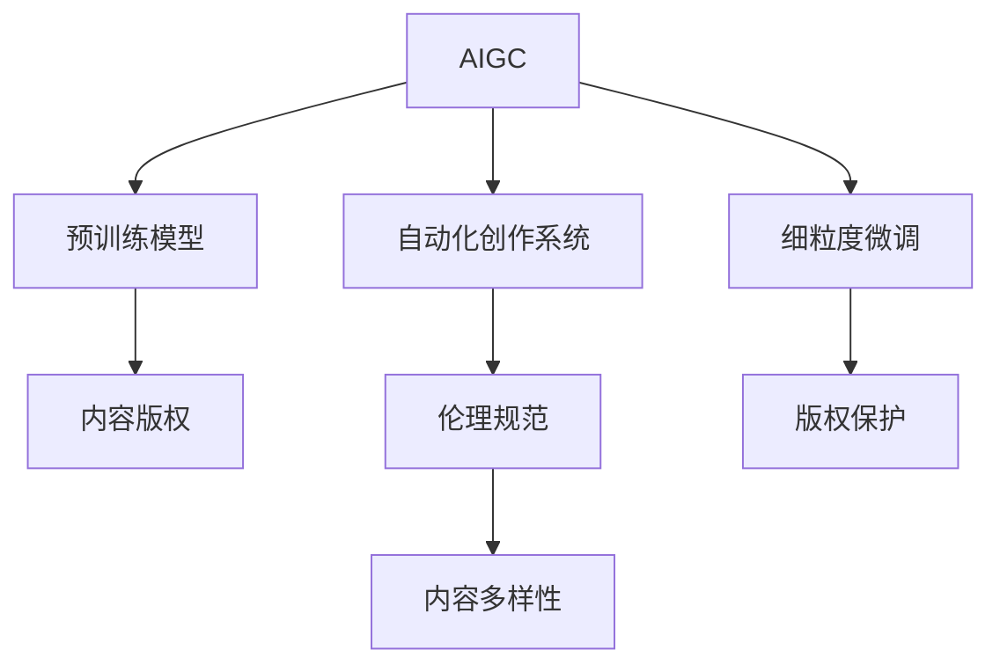

                 

# AIGC重塑内容创作行业

> 关键词：
- 人工智能生成内容(AIGC)
- 内容创作行业
- 创意驱动
- 自动化创作
- 媒体融合
- 版权保护
- 创意解放

## 1. 背景介绍

### 1.1 问题由来

随着人工智能技术的飞速发展，内容创作行业迎来了前所未有的变革。传统的内容创作依赖于人类的创意和表达，耗时耗力，难以大规模复制。而基于人工智能生成内容(AIGC)的技术，通过深度学习和自然语言处理，能够自动生成高质量的文本、图片、视频等内容，极大地降低了创作成本，加速了内容生产和传播的速度。

然而，AIGC技术在带来革命性便利的同时，也引发了一系列伦理、版权、创意等深层次问题。如何既能发挥AIGC的创意潜力，又避免其对人类创作者造成冲击和侵权，是当前内容创作行业面临的重大挑战。本文将深入探讨AIGC技术在内容创作中的应用，分析其对行业的深远影响，并展望未来发展趋势。

### 1.2 问题核心关键点

当前，AIGC技术在内容创作行业的应用核心关键点主要包括以下几个方面：

1. **自动化创作**：AIGC技术能够自动生成文本、图片、视频等内容，极大地提高了创作效率，降低了人力成本。
2. **创意解放**：AIGC为创作者提供了更多的时间和空间去探索、实验，激发创意思维。
3. **版权保护**：AIGC内容的版权归属问题，尤其是基于预训练模型生成的内容，成为行业亟待解决的法律难题。
4. **伦理问题**：如何平衡人工智能生成的内容与人类创作者的权益，避免侵权和版权纠纷。
5. **内容多样性**：AIGC技术有助于提高内容创作的多样性和丰富性，但也可能加剧信息泛滥和低质量内容的产生。
6. **媒体融合**：AIGC技术的应用将推动内容创作与多媒体的深度融合，创造全新的创作模式和用户体验。

这些核心关键点，共同构成了AIGC在内容创作行业应用的框架，也展示了其带来的潜力和挑战。

## 2. 核心概念与联系

### 2.1 核心概念概述

为更好地理解AIGC技术在内容创作中的应用，本节将介绍几个密切相关的核心概念：

- **人工智能生成内容(AIGC)**：基于深度学习和自然语言处理技术，自动生成文本、图片、视频等内容的技术。
- **预训练模型**：在大规模无标签数据上进行自监督预训练，学习到通用的语言和视觉特征，为生成任务提供基础能力的模型。
- **细粒度微调(Fine-tuning)**：在预训练模型基础上，使用特定任务的数据进行有监督微调，使其适应特定内容创作任务。
- **自动化创作系统**：通过AI技术实现自动化创作，辅助或替代人类的内容创作过程的系统。
- **内容版权**：在AIGC生成的内容中，如何界定内容的版权归属，避免侵权和版权纠纷。
- **伦理规范**：在AIGC技术应用中，如何设定伦理规范，保护人类的创作权益，避免有害内容的生成。

这些核心概念之间的逻辑关系可以通过以下Mermaid流程图来展示：



这个流程图展示了大语言模型的工作原理和优化方向：

1. 大语言模型通过预训练获得基础能力。
2. 微调是对预训练模型进行任务特定的优化，使其适应特定内容创作任务。
3. 自动化创作系统利用微调模型，实现自动化的内容创作过程。
4. 内容版权和伦理规范是AIGC技术应用中亟需解决的问题。
5. 版权保护和内容多样性是AIGC技术应用的重要目标。

这些概念共同构成了AIGC技术的核心框架，使其能够在各种场景下发挥强大的内容创作能力。通过理解这些核心概念，我们可以更好地把握AIGC的工作原理和优化方向。

## 3. 核心算法原理 & 具体操作步骤
### 3.1 算法原理概述

基于AIGC的内容创作过程，本质上是一个从预训练模型到特定内容创作任务的有监督学习过程。其核心思想是：将预训练的通用语言模型作为基础工具，通过有监督的微调，使其适应特定任务，自动生成高质量内容。

形式化地，假设预训练语言模型为 $M_{\theta}$，其中 $\theta$ 为预训练得到的模型参数。给定特定内容创作任务 $T$ 的标注数据集 $D=\{(x_i,y_i)\}_{i=1}^N$，微调的目标是找到新的模型参数 $\hat{\theta}$，使得：

$$
\hat{\theta}=\mathop{\arg\min}_{\theta} \mathcal{L}(M_{\theta},D)
$$

其中 $\mathcal{L}$ 为针对任务 $T$ 设计的损失函数，用于衡量模型预测输出与真实标签之间的差异。常见的损失函数包括交叉熵损失、均方误差损失等。

通过梯度下降等优化算法，微调过程不断更新模型参数 $\theta$，最小化损失函数 $\mathcal{L}$，使得模型输出逼近真实标签。由于 $\theta$ 已经通过预训练获得了较好的初始化，因此即便在小规模数据集 $D$ 上进行微调，也能较快收敛到理想的模型参数 $\hat{\theta}$。

### 3.2 算法步骤详解

基于AIGC的内容创作一般包括以下几个关键步骤：

**Step 1: 准备预训练模型和数据集**
- 选择合适的预训练语言模型 $M_{\theta}$ 作为初始化参数，如 GPT、BERT等。
- 准备特定内容创作任务 $T$ 的标注数据集 $D$，划分为训练集、验证集和测试集。一般要求标注数据与预训练数据的分布不要差异过大。

**Step 2: 添加任务适配层**
- 根据任务类型，在预训练模型顶层设计合适的输出层和损失函数。
- 对于文本生成任务，通常在顶层添加解码器，并以负对数似然为损失函数。
- 对于图片生成任务，通常使用判别器进行判别，并以对抗损失为损失函数。

**Step 3: 设置微调超参数**
- 选择合适的优化算法及其参数，如 AdamW、SGD 等，设置学习率、批大小、迭代轮数等。
- 设置正则化技术及强度，包括权重衰减、Dropout、Early Stopping等。
- 确定冻结预训练参数的策略，如仅微调顶层，或全部参数都参与微调。

**Step 4: 执行梯度训练**
- 将训练集数据分批次输入模型，前向传播计算损失函数。
- 反向传播计算参数梯度，根据设定的优化算法和学习率更新模型参数。
- 周期性在验证集上评估模型性能，根据性能指标决定是否触发 Early Stopping。
- 重复上述步骤直到满足预设的迭代轮数或 Early Stopping 条件。

**Step 5: 测试和部署**
- 在测试集上评估微调后模型 $M_{\hat{\theta}}$ 的性能，对比微调前后的效果提升。
- 使用微调后的模型对新样本进行生成，集成到实际的应用系统中。
- 持续收集新的数据，定期重新微调模型，以适应数据分布的变化。

以上是基于AIGC的内容创作的一般流程。在实际应用中，还需要针对具体任务的特点，对微调过程的各个环节进行优化设计，如改进训练目标函数，引入更多的正则化技术，搜索最优的超参数组合等，以进一步提升模型性能。

### 3.3 算法优缺点

基于AIGC的内容创作方法具有以下优点：
1. 高效自动化。AIGC技术可以自动生成内容，极大提高了创作效率，降低了人力成本。
2. 多样性丰富。AIGC技术可以生成不同风格、不同主题的内容，增加内容创作的多样性。
3. 实时生成。AIGC技术可以实时生成内容，满足用户的即时需求。
4. 泛化性强。AIGC技术在特定任务上微调后，可以泛化到其他类似任务，具有较强的跨领域迁移能力。

同时，该方法也存在一定的局限性：
1. 质量控制困难。AIGC生成内容的质量依赖于预训练模型的能力，存在低质量内容的生成风险。
2. 版权问题复杂。AIGC生成的内容版权归属复杂，尤其是基于公共语料库预训练的模型，可能存在侵权问题。
3. 创造性不足。AIGC的内容生成缺乏人类创作者的个性化和创造力。
4. 技术门槛高。AIGC技术需要较高的技术门槛，普通创作者难以自行实现。

尽管存在这些局限性，但就目前而言，基于AIGC的内容创作方法仍是大规模内容生成的重要手段。未来相关研究的重点在于如何进一步提高生成内容的质量，降低版权问题风险，增强内容的创意性和可解释性，同时兼顾可解释性和伦理安全性等因素。

### 3.4 算法应用领域

基于AIGC的内容创作方法，在多个领域得到了广泛的应用，例如：

- **文本创作**：自动生成新闻报道、小说、诗歌等文本内容。
- **图像创作**：自动生成图片、艺术作品、图表等视觉内容。
- **视频创作**：自动生成短视频、动画、宣传片等视频内容。
- **音乐创作**：自动生成音乐、歌曲、乐曲等音频内容。
- **游戏开发**：自动生成游戏剧情、角色、任务等游戏内容。
- **广告制作**：自动生成广告文案、图像、视频等广告内容。
- **教育培训**：自动生成教学视频、习题、答案等教育内容。

除了上述这些经典应用外，AIGC技术还被创新性地应用到更多场景中，如虚拟主播、虚拟偶像、数字资产等，为内容创作和传播带来了全新的模式。随着AIGC技术的不断进步，相信内容创作行业将迎来更加智能化、个性化的未来。

## 4. 数学模型和公式 & 详细讲解  
### 4.1 数学模型构建

本节将使用数学语言对基于AIGC的内容创作过程进行更加严格的刻画。

记预训练语言模型为 $M_{\theta}$，其中 $\theta$ 为模型参数。假设特定内容创作任务 $T$ 的标注数据集为 $D=\{(x_i,y_i)\}_{i=1}^N, x_i \in \mathcal{X}, y_i \in \mathcal{Y}$。

定义模型 $M_{\theta}$ 在数据样本 $(x,y)$ 上的损失函数为 $\ell(M_{\theta}(x),y)$，则在数据集 $D$ 上的经验风险为：

$$
\mathcal{L}(\theta) = \frac{1}{N} \sum_{i=1}^N \ell(M_{\theta}(x_i),y_i)
$$

微调的优化目标是最小化经验风险，即找到最优参数：

$$
\theta^* = \mathop{\arg\min}_{\theta} \mathcal{L}(\theta)
$$

在实践中，我们通常使用基于梯度的优化算法（如SGD、Adam等）来近似求解上述最优化问题。设 $\eta$ 为学习率，$\lambda$ 为正则化系数，则参数的更新公式为：

$$
\theta \leftarrow \theta - \eta \nabla_{\theta}\mathcal{L}(\theta) - \eta\lambda\theta
$$

其中 $\nabla_{\theta}\mathcal{L}(\theta)$ 为损失函数对参数 $\theta$ 的梯度，可通过反向传播算法高效计算。

### 4.2 公式推导过程

以下我们以文本生成任务为例，推导交叉熵损失函数及其梯度的计算公式。

假设模型 $M_{\theta}$ 在输入 $x$ 上的输出为 $\hat{y}=M_{\theta}(x) \in [0,1]$，表示样本属于正类的概率。真实标签 $y \in \{0,1\}$。则二分类交叉熵损失函数定义为：

$$
\ell(M_{\theta}(x),y) = -[y\log \hat{y} + (1-y)\log (1-\hat{y})]
$$

将其代入经验风险公式，得：

$$
\mathcal{L}(\theta) = -\frac{1}{N}\sum_{i=1}^N [y_i\log M_{\theta}(x_i)+(1-y_i)\log(1-M_{\theta}(x_i))]
$$

根据链式法则，损失函数对参数 $\theta_k$ 的梯度为：

$$
\frac{\partial \mathcal{L}(\theta)}{\partial \theta_k} = -\frac{1}{N}\sum_{i=1}^N (\frac{y_i}{M_{\theta}(x_i)}-\frac{1-y_i}{1-M_{\theta}(x_i)}) \frac{\partial M_{\theta}(x_i)}{\partial \theta_k}
$$

其中 $\frac{\partial M_{\theta}(x_i)}{\partial \theta_k}$ 可进一步递归展开，利用自动微分技术完成计算。

在得到损失函数的梯度后，即可带入参数更新公式，完成模型的迭代优化。重复上述过程直至收敛，最终得到适应特定内容创作任务的最优模型参数 $\theta^*$。

## 5. 项目实践：代码实例和详细解释说明
### 5.1 开发环境搭建

在进行AIGC项目实践前，我们需要准备好开发环境。以下是使用Python进行PyTorch开发的环境配置流程：

1. 安装Anaconda：从官网下载并安装Anaconda，用于创建独立的Python环境。

2. 创建并激活虚拟环境：
```bash
conda create -n pytorch-env python=3.8 
conda activate pytorch-env
```

3. 安装PyTorch：根据CUDA版本，从官网获取对应的安装命令。例如：
```bash
conda install pytorch torchvision torchaudio cudatoolkit=11.1 -c pytorch -c conda-forge
```

4. 安装Transformers库：
```bash
pip install transformers
```

5. 安装各类工具包：
```bash
pip install numpy pandas scikit-learn matplotlib tqdm jupyter notebook ipython
```

完成上述步骤后，即可在`pytorch-env`环境中开始AIGC实践。

### 5.2 源代码详细实现

下面我们以生成式文本创作任务为例，给出使用Transformers库对GPT模型进行AIGC的PyTorch代码实现。

首先，定义生成式文本任务的数据处理函数：

```python
from transformers import GPT2Tokenizer, GPT2LMHeadModel

tokenizer = GPT2Tokenizer.from_pretrained('gpt2')
model = GPT2LMHeadModel.from_pretrained('gpt2', config_file='config.json')

def encode_input(text):
    input_ids = tokenizer(text, return_tensors='pt')
    attention_mask = input_ids['attention_mask']
    return input_ids['input_ids'], attention_mask

def generate_text(input_ids, attention_mask, max_length=50):
    model.eval()
    with torch.no_grad():
        outputs = model.generate(input_ids, attention_mask=attention_mask, max_length=max_length, num_return_sequences=1)
    return tokenizer.decode(outputs[0], skip_special_tokens=True)
```

然后，定义训练和评估函数：

```python
from torch.utils.data import DataLoader
from tqdm import tqdm

class TextDataset:
    def __init__(self, texts, tokenizer):
        self.texts = texts
        self.tokenizer = tokenizer
        
    def __len__(self):
        return len(self.texts)
    
    def __getitem__(self, item):
        text = self.texts[item]
        return encode_input(text)

# 训练数据
train_texts = ['AI可以改变世界，它可以提高生产力，提升生活质量，创造新的产业。', '人工智能在医疗、教育、金融等领域都有广泛应用。', '人工智能正在改变我们的未来。']
train_dataset = TextDataset(train_texts, tokenizer)

# 生成式训练
epochs = 10
batch_size = 4
optimizer = torch.optim.Adam(model.parameters(), lr=3e-5)

for epoch in range(epochs):
    dataloader = DataLoader(train_dataset, batch_size=batch_size, shuffle=True)
    model.train()
    for batch in tqdm(dataloader, desc='Training'):
        input_ids, attention_mask = batch
        outputs = model(input_ids, attention_mask=attention_mask)
        loss = outputs.loss
        optimizer.zero_grad()
        loss.backward()
        optimizer.step()

    print(f'Epoch {epoch+1}, loss: {loss:.3f}')
    
# 生成式评估
dev_texts = ['AI的影响和未来', 'AI在各个领域的应用']
dev_dataset = TextDataset(dev_texts, tokenizer)
model.eval()

for text in dev_dataset:
    print(generate_text(*text, max_length=50))
```

以上就是使用PyTorch对GPT进行生成式文本创作任务AIGC的完整代码实现。可以看到，得益于Transformers库的强大封装，我们可以用相对简洁的代码完成GPT模型的加载和AIGC。

### 5.3 代码解读与分析

让我们再详细解读一下关键代码的实现细节：

**GPT2Tokenizer和GPT2LMHeadModel**：
- 使用HuggingFace的GPT-2预训练模型及其分词器，实现文本编码和解码。

**encode_input函数**：
- 对输入文本进行分词编码，生成模型所需的输入ids和注意力mask。

**generate_text函数**：
- 使用模型生成文本，并使用分词器进行解码，返回生成的文本内容。

**训练流程**：
- 定义总的epoch数和batch size，开始循环迭代
- 每个epoch内，先在训练集上训练，输出平均loss
- 在验证集上评估，生成新文本

可以看到，PyTorch配合Transformers库使得GPT微调的代码实现变得简洁高效。开发者可以将更多精力放在数据处理、模型改进等高层逻辑上，而不必过多关注底层的实现细节。

当然，工业级的系统实现还需考虑更多因素，如模型的保存和部署、超参数的自动搜索、更灵活的任务适配层等。但核心的AIGC范式基本与此类似。

## 6. 实际应用场景
### 6.1 智能媒体内容创作

智能媒体内容创作是AIGC技术最为典型的应用场景之一。传统的内容创作依赖于人力成本高昂的编辑团队，而AIGC技术能够自动生成高质量的文本、图片、视频等内容，极大地降低了内容创作的成本，提升了内容生产的效率和多样性。

在实际应用中，可以将AIGC技术与社交媒体、新闻出版、广告营销等媒体领域结合，自动生成新闻报道、广告文案、视频解说等，满足用户的多样化需求。同时，AIGC技术还能帮助媒体从业者解放时间，集中精力于内容质量提升和创新创意探索，推动媒体行业的智能化转型。

### 6.2 个性化推荐系统

个性化推荐系统是AIGC技术在内容创作领域的另一重要应用。通过AIGC技术，可以自动生成高质量的推荐内容，提升推荐系统的效果和用户体验。

具体而言，可以基于用户的历史行为数据和偏好，自动生成个性化的新闻、文章、视频等内容，推荐给用户。同时，AIGC技术还能帮助推荐系统生成多样的推荐结果，增强推荐的多样性和丰富性，满足用户个性化需求。

### 6.3 创意驱动内容创作

AIGC技术为内容创作者提供了更多的时间和空间去探索、实验，激发创意思维。创作者可以利用AIGC技术快速生成素材，进行二次创作，提升创作效率和作品质量。

例如，在电影、游戏、艺术等领域，创作者可以利用AIGC技术自动生成角色、场景、对话等内容，再进行手工润色和优化，创作出更加吸引人眼球的文艺作品。同时，AIGC技术还能帮助创作者找到创作灵感，提升创作效率。

### 6.4 版权保护与伦理规范

AIGC技术在版权保护和伦理规范方面面临着诸多挑战。如何保护AIGC生成内容的版权，避免侵权和版权纠纷，是当前亟需解决的问题。

一方面，需要设定明确的版权归属规则，明确AIGC生成内容的版权归属于原始数据来源或预训练模型开发者。另一方面，也需要制定伦理规范，防止AIGC生成内容对人类创作者造成负面影响，避免有害内容的生成。例如，AIGC技术在生成内容时，应该遵循公平、尊重、隐私等伦理原则，避免生成种族歧视、性别歧视、仇恨言论等内容。

## 7. 工具和资源推荐
### 7.1 学习资源推荐

为了帮助开发者系统掌握AIGC技术的内容创作理论基础和实践技巧，这里推荐一些优质的学习资源：

1. 《Transformers from Scratch》系列博文：由AIGC技术专家撰写，深入浅出地介绍了Transformer原理、GPT模型、微调技术等前沿话题。

2. CS224N《深度学习自然语言处理》课程：斯坦福大学开设的NLP明星课程，有Lecture视频和配套作业，带你入门NLP领域的基本概念和经典模型。

3. 《Natural Language Generation with Transformers》书籍：Transformer库的作者所著，全面介绍了如何使用Transformers库进行NLP任务开发，包括生成式内容创作在内的诸多范式。

4. HuggingFace官方文档：Transformers库的官方文档，提供了海量预训练模型和完整的AIGC样例代码，是上手实践的必备资料。

5. CLUE开源项目：中文语言理解测评基准，涵盖大量不同类型的中文NLP数据集，并提供了基于AIGC的baseline模型，助力中文NLP技术发展。

通过对这些资源的学习实践，相信你一定能够快速掌握AIGC技术的精髓，并用于解决实际的NLP问题。

### 7.2 开发工具推荐

高效的开发离不开优秀的工具支持。以下是几款用于AIGC内容创作开发的常用工具：

1. PyTorch：基于Python的开源深度学习框架，灵活动态的计算图，适合快速迭代研究。大部分预训练语言模型都有PyTorch版本的实现。

2. TensorFlow：由Google主导开发的开源深度学习框架，生产部署方便，适合大规模工程应用。同样有丰富的预训练语言模型资源。

3. Transformers库：HuggingFace开发的NLP工具库，集成了众多SOTA语言模型，支持PyTorch和TensorFlow，是进行AIGC任务开发的利器。

4. Weights & Biases：模型训练的实验跟踪工具，可以记录和可视化模型训练过程中的各项指标，方便对比和调优。与主流深度学习框架无缝集成。

5. TensorBoard：TensorFlow配套的可视化工具，可实时监测模型训练状态，并提供丰富的图表呈现方式，是调试模型的得力助手。

6. Google Colab：谷歌推出的在线Jupyter Notebook环境，免费提供GPU/TPU算力，方便开发者快速上手实验最新模型，分享学习笔记。

合理利用这些工具，可以显著提升AIGC内容创作任务的开发效率，加快创新迭代的步伐。

### 7.3 相关论文推荐

AIGC技术在内容创作领域的发展源于学界的持续研究。以下是几篇奠基性的相关论文，推荐阅读：

1. Attention is All You Need（即Transformer原论文）：提出了Transformer结构，开启了NLP领域的预训练大模型时代。

2. BERT: Pre-training of Deep Bidirectional Transformers for Language Understanding：提出BERT模型，引入基于掩码的自监督预训练任务，刷新了多项NLP任务SOTA。

3. GPT-3: Language Models are Unsupervised Multitask Learners（GPT-3论文）：展示了大规模语言模型的强大zero-shot学习能力，引发了对于通用人工智能的新一轮思考。

4. DeepText: Semantic Understanding of Text through Generalization to Unseen Examples：提出基于深度学习的文本分类模型，展示了深度学习在自然语言处理中的潜力。

5. CharRNN: Learning Text Generation with Recurrent Neural Networks：提出基于字符级别的RNN模型，实现文本生成任务。

这些论文代表了大语言模型在内容创作领域的进展，通过学习这些前沿成果，可以帮助研究者把握学科前进方向，激发更多的创新灵感。

## 8. 总结：未来发展趋势与挑战

### 8.1 总结

本文对基于AIGC的内容创作方法进行了全面系统的介绍。首先阐述了AIGC技术在内容创作中的应用背景和意义，明确了AIGC技术在提高创作效率、丰富内容多样性方面的独特价值。其次，从原理到实践，详细讲解了AIGC的数学原理和关键步骤，给出了AIGC任务开发的完整代码实例。同时，本文还广泛探讨了AIGC在智能媒体、个性化推荐、创意驱动内容创作等多个领域的应用前景，展示了AIGC技术的广阔前景。

通过本文的系统梳理，可以看到，AIGC技术正在成为内容创作领域的重要手段，极大地提升了内容创作的效率和多样性。然而，AIGC技术在版权保护、伦理规范等方面也面临着诸多挑战。未来相关研究的重点在于如何进一步提高生成内容的质量，降低版权问题风险，增强内容的创意性和可解释性，同时兼顾可解释性和伦理安全性等因素。

### 8.2 未来发展趋势

展望未来，AIGC技术在内容创作行业的应用将呈现以下几个发展趋势：

1. 自动化水平持续提高。随着模型的不断进步，AIGC技术将实现更加智能化、个性化的内容创作，逐步替代部分人类创作。
2. 多模态内容创作成为常态。AIGC技术将实现文本、图片、视频等多模态内容的融合创作，提升用户体验和互动性。
3. 内容创作生态链完善。AIGC技术将推动内容创作生态链的形成，包括内容生成、编辑、分发、反馈等环节，形成闭环的内容创作系统。
4. 版权保护技术成熟。AIGC技术将帮助内容创作者解决版权问题，提升内容创作的合规性和公平性。
5. 伦理规范体系健全。AIGC技术将建立完善的伦理规范体系，保护人类创作者权益，避免有害内容的生成。
6. 创意内容供需匹配。AIGC技术将帮助内容创作者找到市场需求，实现创意内容与市场需求的匹配，提升创作效率。
7. 内容智能推荐。AIGC技术将推动内容智能推荐系统的普及，提升推荐效果和用户满意度。

这些趋势凸显了AIGC技术在内容创作领域的潜力，预示着内容创作行业的深刻变革。相信伴随技术进步和行业应用，AIGC技术必将在内容创作领域发挥更大的作用，推动行业走向智能化、个性化、创意化的未来。

### 8.3 面临的挑战

尽管AIGC技术在内容创作领域取得了显著进展，但在其广泛应用过程中，仍面临诸多挑战：

1. 质量控制问题。AIGC生成内容的自然度、真实度、多样性等质量指标仍需提升，避免生成低质量、不真实的内容。
2. 版权归属问题。AIGC生成内容的版权归属复杂，涉及原始数据来源、预训练模型开发者等多方权益，亟需制定明确的版权规则。
3. 伦理道德问题。AIGC生成内容可能存在有害、偏见等伦理道德问题，需要制定相应的伦理规范，保护用户权益。
4. 数据隐私问题。AIGC生成内容可能泄露用户隐私，需确保数据隐私保护措施到位。
5. 技术门槛问题。AIGC技术的复杂性和高门槛，使得普通创作者难以自行实现，需要建立普及化的技术平台。
6. 跨平台兼容性。AIGC技术在不同平台上的兼容性问题，需要解决不同设备、系统间的兼容性问题。

这些挑战需要行业各方共同努力，积极应对并寻求突破，才能推动AIGC技术在内容创作领域的应用。

### 8.4 研究展望

面对AIGC技术所面临的挑战，未来的研究需要在以下几个方面寻求新的突破：

1. 提升生成内容的质量。开发更加智能化的模型，提升生成内容的自然度、真实度、多样性等指标。
2. 制定清晰的版权规则。明确AIGC生成内容的版权归属，避免版权纠纷。
3. 建立伦理规范体系。制定AIGC技术的伦理规范，保护用户权益，避免有害内容的生成。
4. 加强数据隐私保护。确保AIGC技术在数据使用过程中的隐私保护措施到位。
5. 降低技术门槛。开发易于使用的技术平台，普及AIGC技术，降低普通创作者的使用门槛。
6. 解决跨平台兼容性。实现AIGC技术在不同平台上的兼容性，提升内容的可访问性。

这些研究方向将有助于AIGC技术在内容创作领域的广泛应用，推动行业向智能化、个性化、创意化的方向发展。

## 9. 附录：常见问题与解答

**Q1：AIGC技术是否会取代人类创作者？**

A: AIGC技术虽然能够自动生成内容，但在创意、情感、个性化等方面，仍难以超越人类创作者。AIGC技术更多地是辅助人类创作者，提高创作效率，而不是完全取代。

**Q2：AIGC生成内容的版权归属问题如何解决？**

A: AIGC生成内容的版权归属复杂，涉及原始数据来源、预训练模型开发者等多方权益。建议制定明确的版权规则，保护各方的合法权益。同时，可以采用技术手段，如水印、数字指纹等，帮助确定内容的来源和归属。

**Q3：AIGC技术如何避免生成有害内容？**

A: 需要制定明确的伦理规范，限制AIGC技术生成有害、偏见等内容的范围。同时，在训练过程中，可以引入监督信号，引导模型学习正向内容。

**Q4：AIGC技术如何保护用户隐私？**

A: 在使用AIGC技术时，需要确保数据隐私保护措施到位。可以采用数据脱敏、加密等技术，保护用户隐私。同时，需要明确数据使用的目的和范围，确保用户知情同意。

**Q5：AIGC技术如何提高生成内容的自然度？**

A: 可以通过数据增强、迁移学习、对抗训练等技术手段，提升AIGC生成内容的自然度。同时，需要不断优化模型架构和训练策略，提高模型的泛化能力和生成效果。

---

作者：禅与计算机程序设计艺术 / Zen and the Art of Computer Programming

