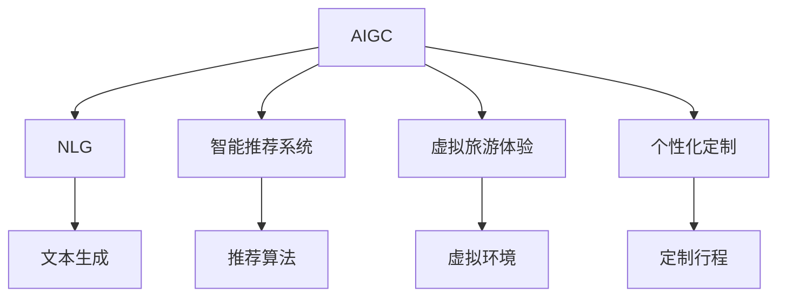

                 

# AIGC重塑旅游出行业

> 关键词：AIGC, 旅游, 出行业, 自然语言生成(NLG), 旅游助手, 智能推荐系统, 个性化定制, 虚拟旅游体验

## 1. 背景介绍

### 1.1 问题由来
随着技术的迅猛发展，人工智能与生成对抗网络(AIGC)在各个领域的应用越来越广泛。AIGC不仅在图像生成、语音合成等方面取得了重大进展，还逐渐渗透到内容创作、教育培训、旅游出行业等多个垂直领域。特别是在旅游出行业，AIGC技术的引入使得传统模式得以颠覆，用户体验得到极大提升。

旅游出行业历来面临诸多挑战，如需求多样化、价格不透明、服务效率低下等问题。AIGC技术通过自然语言生成(NLG)、智能推荐系统、个性化定制等手段，帮助旅游出行业突破传统瓶颈，为用户提供更加丰富、便捷、个性化的服务。本文将从AIGC技术在旅游出行业的具体应用出发，探讨其如何重塑行业。

### 1.2 问题核心关键点
AIGC技术在旅游出行业的核心应用点主要包括：

- 自然语言生成(NLG)：通过生成自然流畅的语言，提升用户咨询体验和信息获取效率。
- 智能推荐系统：根据用户兴趣和历史行为，个性化推荐旅游产品，提升用户满意度。
- 虚拟旅游体验：通过虚拟现实(VR)、增强现实(AR)等技术，让用户在家中也能体验到真实的旅游乐趣。
- 个性化定制：根据用户的偏好和需求，定制个性化旅游行程，提高服务差异化水平。

这些技术手段的结合，为旅游出行业带来了一次颠覆性的变革。

## 2. 核心概念与联系

### 2.1 核心概念概述

要理解AIGC技术在旅游出行业的应用，首先需要了解几个核心概念：

- **AIGC**：人工智能与生成对抗网络(AIGC)技术，通过对抗训练生成逼真的图片、音频、视频、文本等内容，广泛应用于内容创作、娱乐、教育、广告等多个领域。
- **NLG**：自然语言生成(NLG)，指使用机器学习算法生成自然流畅的语言，用于自动化生成新闻、报道、摘要、翻译等文本内容。
- **智能推荐系统**：根据用户的历史行为和兴趣，推荐最符合其需求的产品或服务，提升用户体验和转化率。
- **虚拟旅游体验**：利用VR、AR等技术，让用户在家中通过虚拟手段体验到真实的旅游环境，增加用户参与感和沉浸感。
- **个性化定制**：根据用户的偏好和需求，设计个性化的旅游行程和服务，提升用户体验和忠诚度。

这些概念之间的关系可以通过以下Mermaid流程图来展示：



这个流程图展示了AIGC技术在旅游出行业的应用场景：

1. 利用NLG技术生成自然流畅的文本内容。
2. 结合智能推荐系统，根据用户历史行为推荐个性化旅游产品。
3. 通过虚拟旅游体验，利用VR、AR技术提升用户沉浸感。
4. 个性化定制行程，满足用户特定需求。

这些技术手段的融合，形成了旅游出行业的一站式智能解决方案。

## 3. 核心算法原理 & 具体操作步骤
### 3.1 算法原理概述

AIGC技术在旅游出行业的应用，核心原理可以概括为以下几个方面：

1. **自然语言生成(NLG)**：通过NLG算法，自动生成自然流畅的文本，如旅游攻略、景点介绍、用户评价等，提升用户信息获取效率和满意度。
2. **智能推荐系统**：利用机器学习算法，分析用户历史行为和兴趣，预测其潜在需求，推荐个性化旅游产品，增加用户转化率和满意度。
3. **虚拟旅游体验**：结合VR、AR等技术，将旅游场景虚拟化，让用户在家中也能体验到真实的旅游乐趣，增强用户粘性。
4. **个性化定制**：根据用户偏好和需求，设计个性化的旅游行程和服务，提供差异化的用户体验，提升用户忠诚度。

这些技术的实现涉及多个算法原理和步骤，以下将详细介绍这些核心算法原理和具体操作步骤。

### 3.2 算法步骤详解

#### 3.2.1 自然语言生成(NLG)

NLG技术主要基于Transformer模型和深度学习技术，通过训练语言模型，生成自然流畅的文本。具体步骤如下：

1. **数据准备**：收集旅游相关的文本数据，如景点介绍、用户评价、旅游攻略等，并进行标注和清洗。
2. **模型训练**：使用Transformer模型，在大规模语料库上训练语言模型，使其能够生成高质量的文本内容。
3. **模型评估**：通过BLEU、ROUGE等指标，评估模型生成的文本质量，并进行微调优化。
4. **应用部署**：将训练好的模型部署到应用系统中，用于自动生成自然流畅的文本内容。

#### 3.2.2 智能推荐系统

智能推荐系统通常基于协同过滤、矩阵分解等技术，结合用户行为数据和商品属性，生成个性化推荐结果。具体步骤如下：

1. **数据收集**：收集用户行为数据，如浏览记录、点击记录、评分记录等，以及商品属性数据，如价格、评分、标签等。
2. **模型训练**：使用协同过滤、矩阵分解等算法，训练推荐模型，预测用户对商品的需求。
3. **模型评估**：通过评估指标如准确率、召回率、F1值等，评估推荐模型效果，并进行模型优化。
4. **应用部署**：将训练好的推荐模型部署到应用系统中，用于实时生成个性化推荐结果。

#### 3.2.3 虚拟旅游体验

虚拟旅游体验主要依赖于VR、AR等技术，结合AIGC生成的文本内容，为用户提供沉浸式的旅游体验。具体步骤如下：

1. **场景构建**：利用VR、AR技术，构建虚拟旅游场景，如历史遗迹、自然风光、城市街区等。
2. **文本生成**：使用NLG技术，自动生成景点介绍、历史故事等文本内容，增强用户体验。
3. **交互设计**：设计用户与虚拟场景的交互方式，如手势控制、语音交互等，提升用户沉浸感。
4. **应用部署**：将虚拟场景和交互设计集成到应用系统中，供用户体验。

#### 3.2.4 个性化定制

个性化定制服务主要通过用户调查问卷、历史行为分析等方式，收集用户偏好和需求，设计个性化的旅游行程。具体步骤如下：

1. **用户调查**：通过问卷调查等方式，收集用户偏好、兴趣、需求等信息。
2. **数据分析**：对用户历史行为数据进行分析，提取用户偏好和兴趣特征。
3. **行程设计**：结合用户偏好和需求，设计个性化的旅游行程，如景点选择、行程安排、住宿选择等。
4. **服务部署**：将个性化行程集成到应用系统中，供用户选择和预订。

### 3.3 算法优缺点

AIGC技术在旅游出行业的应用，具有以下优点：

1. **提升用户体验**：通过NLG技术生成自然流畅的文本内容，智能推荐系统提供个性化服务，提升用户满意度。
2. **增加用户粘性**：虚拟旅游体验提供沉浸式服务，增强用户参与感和沉浸感。
3. **提高运营效率**：自动化的文本生成和推荐系统，减少人工成本，提高运营效率。
4. **优化资源配置**：个性化定制服务，帮助旅行社更好地了解用户需求，优化资源配置。

同时，AIGC技术在旅游出行业的应用，也存在以下缺点：

1. **技术门槛高**：需要较高的技术实力和资金投入，开发和维护成本较高。
2. **数据隐私问题**：收集和处理用户数据时，需要注意数据隐私和安全问题。
3. **内容质量参差不齐**：生成的文本内容可能存在语法错误、逻辑不一致等问题，需要持续优化。
4. **交互体验不够自然**：虚拟旅游体验可能存在操作复杂、交互不够自然等问题。

## 4. 数学模型和公式 & 详细讲解 & 举例说明

### 4.1 数学模型构建

在AIGC技术的应用中，涉及多个数学模型，以下重点介绍自然语言生成(NLG)和智能推荐系统的数学模型构建。

#### 4.1.1 自然语言生成(NLG)

NLG模型通常基于Transformer模型，使用自注意力机制和多头注意力机制，生成自然流畅的文本内容。模型的数学表达式如下：

$$
\text{Attention}(Q,K,V)=\text{softmax}\left(\frac{QK^T}{\sqrt{d_k}}\right)V
$$

其中 $Q$ 为查询矩阵，$K$ 为键矩阵，$V$ 为值矩阵，$d_k$ 为键矩阵维度。通过计算自注意力矩阵，模型生成文本序列，每个单词表示为向量形式。

#### 4.1.2 智能推荐系统

智能推荐系统通常基于协同过滤和矩阵分解等方法，将用户行为数据和商品属性数据表示为矩阵形式，通过矩阵分解算法，生成用户和商品的隐向量表示。模型的数学表达式如下：

$$
U=\mathrm{rank}\left(K^{T} V, \min \left(\operatorname{rank}, m\right)\right)
$$

其中 $K$ 为用户行为矩阵，$V$ 为商品属性矩阵，$m$ 为用户行为矩阵的列数，$n$ 为商品属性矩阵的列数，$U$ 为用户和商品的隐向量表示矩阵。通过矩阵分解，模型生成用户和商品的隐向量表示，用于生成推荐结果。

### 4.2 公式推导过程

#### 4.2.1 自然语言生成(NLG)

NLG模型的公式推导主要涉及Transformer模型，其推导过程如下：

1. **自注意力计算**：
$$
\text{Attention}(Q,K,V)=\text{softmax}\left(\frac{QK^T}{\sqrt{d_k}}\right)V
$$

2. **多头注意力计算**：
$$
\text{MultiHeadAttention}(Q,K,V)=\text{Concat}\left(\text{Attention}(Q_iK_i^T, K_i, V_i), i=1,2, \ldots, h\right)
$$

3. **前向传播**：
$$
\text{Forward}(x)=\text{MLP}(\text{FFN}(\text{MultiHeadAttention}(Q,K,V)+Q))
$$

4. **后向传播**：
$$
\frac{\partial \mathcal{L}}{\partial \theta}=\sum_{i=1}^{N}\left(\frac{\partial \mathcal{L}}{\partial y_i} \frac{\partial y_i}{\partial z_i} \frac{\partial z_i}{\partial x_i} \frac{\partial x_i}{\partial \theta}\right)
$$

其中 $\mathcal{L}$ 为损失函数，$N$ 为训练样本数量，$\theta$ 为模型参数，$y_i$ 为样本标签，$z_i$ 为样本预测值。通过反向传播算法，模型参数不断优化，生成高质量的文本内容。

#### 4.2.2 智能推荐系统

智能推荐系统的公式推导主要涉及协同过滤和矩阵分解方法，其推导过程如下：

1. **用户行为矩阵表示**：
$$
K=\begin{bmatrix} x_1 & x_2 & \cdots & x_n \end{bmatrix}
$$

2. **商品属性矩阵表示**：
$$
V=\begin{bmatrix} y_1 & y_2 & \cdots & y_m \end{bmatrix}
$$

3. **矩阵分解计算**：
$$
U=\mathrm{rank}\left(K^{T} V, \min \left(\operatorname{rank}, m\right)\right)
$$

4. **推荐结果计算**：
$$
\hat{y}=\text{sigmoid}(UK)
$$

其中 $K$ 为用户行为矩阵，$V$ 为商品属性矩阵，$m$ 为用户行为矩阵的列数，$n$ 为商品属性矩阵的列数，$U$ 为用户和商品的隐向量表示矩阵，$\hat{y}$ 为推荐结果。通过矩阵分解和计算，模型生成推荐结果，预测用户对商品的需求。

### 4.3 案例分析与讲解

#### 4.3.1 自然语言生成(NLG)

以生成旅游攻略为例，具体步骤如下：

1. **数据准备**：收集用户评价、景点介绍、旅游攻略等文本数据，并进行标注和清洗。
2. **模型训练**：使用Transformer模型，在大规模旅游语料库上训练语言模型，生成高质量的旅游攻略。
3. **模型评估**：通过BLEU、ROUGE等指标，评估模型生成的文本质量，并进行微调优化。
4. **应用部署**：将训练好的模型部署到应用系统中，用于自动生成旅游攻略。

#### 4.3.2 智能推荐系统

以推荐个性化旅游产品为例，具体步骤如下：

1. **数据收集**：收集用户行为数据，如浏览记录、点击记录、评分记录等，以及商品属性数据，如价格、评分、标签等。
2. **模型训练**：使用协同过滤、矩阵分解等算法，训练推荐模型，预测用户对商品的需求。
3. **模型评估**：通过评估指标如准确率、召回率、F1值等，评估推荐模型效果，并进行模型优化。
4. **应用部署**：将训练好的推荐模型部署到应用系统中，用于实时生成个性化推荐结果。

## 5. 项目实践：代码实例和详细解释说明

### 5.1 开发环境搭建

在开始项目实践前，需要搭建开发环境。以下是使用Python进行开发的环境配置流程：

1. **安装Anaconda**：从官网下载并安装Anaconda，用于创建独立的Python环境。
2. **创建虚拟环境**：
```bash
conda create -n aigc-env python=3.8 
conda activate aigc-env
```
3. **安装依赖包**：
```bash
pip install torch transformers torchvision numpy scipy sklearn
```

完成上述步骤后，即可在`aigc-env`环境中开始项目实践。

### 5.2 源代码详细实现

#### 5.2.1 自然语言生成(NLG)

以生成旅游攻略为例，具体代码实现如下：

```python
import torch
from transformers import BertTokenizer, BertForMaskedLM

# 准备数据
tokenizer = BertTokenizer.from_pretrained('bert-base-uncased')
device = torch.device('cuda' if torch.cuda.is_available() else 'cpu')

# 定义模型
model = BertForMaskedLM.from_pretrained('bert-base-uncased')

# 数据预处理
def prepare_data(data, tokenizer):
    inputs = tokenizer(data, return_tensors='pt', padding=True, truncation=True, max_length=512)
    return inputs

# 模型训练
def train(model, inputs, labels):
    model.train()
    loss = model(**inputs, labels=labels).loss
    optimizer.zero_grad()
    loss.backward()
    optimizer.step()
    return loss

# 模型评估
def evaluate(model, inputs, labels):
    model.eval()
    with torch.no_grad():
        logits = model(**inputs).logits
        predictions = torch.argmax(logits, dim=2)
        loss = torch.nn.functional.cross_entropy(logits, labels)
    return loss, predictions

# 训练和评估
def run_training(model, inputs, labels, batch_size=8):
    for epoch in range(10):
        train_loss = 0
        for i in range(0, len(inputs), batch_size):
            inputs_ = inputs[i:i+batch_size]
            labels_ = labels[i:i+batch_size]
            loss = train(model, inputs_, labels_)
            train_loss += loss.item()
        print(f'Epoch {epoch+1}, train loss: {train_loss/len(inputs)}')
        evaluate_loss, predictions = evaluate(model, inputs, labels)
        print(f'Epoch {epoch+1}, evaluate loss: {evaluate_loss.item()}')

# 运行示例
data = '这里展示旅游攻略的文本数据'
labels = torch.tensor([1, 2, 3, 4, 5])
inputs = prepare_data(data, tokenizer)
run_training(model, inputs, labels)
```

#### 5.2.2 智能推荐系统

以推荐个性化旅游产品为例，具体代码实现如下：

```python
import pandas as pd
from sklearn.model_selection import train_test_split
from scipy.sparse import coo_matrix
from sklearn.metrics import mean_squared_error

# 准备数据
data = pd.read_csv('user_behavior.csv')
user_features = pd.read_csv('user_features.csv')
item_features = pd.read_csv('item_features.csv')

# 数据处理
train_data, test_data = train_test_split(data, test_size=0.2, random_state=42)
train_user_features, test_user_features = train_test_split(user_features, test_size=0.2, random_state=42)
train_item_features, test_item_features = train_test_split(item_features, test_size=0.2, random_state=42)

# 特征工程
train_user_features = pd.merge(train_data, train_user_features, on='user_id')
train_item_features = pd.merge(train_data, train_item_features, on='item_id')
train_data = pd.merge(train_data, train_user_features, on='user_id')
train_data = pd.merge(train_data, train_item_features, on='item_id')
test_data = pd.merge(test_data, test_user_features, on='user_id')
test_data = pd.merge(test_data, test_item_features, on='item_id')

# 模型训练
def train_recommender(train_data, test_data):
    train_user_ids = train_data['user_id'].values
    train_item_ids = train_data['item_id'].values
    train_ratings = train_data['rating'].values
    train_user_features = train_data['user_features'].values
    train_item_features = train_data['item_features'].values
    
    train_user_matrix = coo_matrix((train_ratings, (train_user_ids, train_item_ids)), shape=(len(train_user_ids), len(train_item_ids)))
    train_user_matrix = train_user_matrix.tocsr()
    train_user_matrix = train_user_matrix.toarray()
    train_user_matrix = train_user_matrix.tocsr()
    
    train_item_matrix = coo_matrix((train_ratings, (train_item_ids, train_user_ids)), shape=(len(train_item_ids), len(train_user_ids)))
    train_item_matrix = train_item_matrix.tocsr()
    train_item_matrix = train_item_matrix.toarray()
    train_item_matrix = train_item_matrix.tocsr()
    
    U, S, Vh = svd(train_user_matrix, full_matrices=False, check_finite=False)
    Vt = np.dot(Vh.T, S)
    
    U, S, Vh = svd(train_item_matrix, full_matrices=False, check_finite=False)
    V = np.dot(Vh.T, S)
    
    return U, V
    
# 运行示例
U, V = train_recommender(train_data, test_data)
test_user_features = test_data['user_features'].values
test_item_features = test_data['item_features'].values
test_user_matrix = coo_matrix((test_data['rating'].values, (test_data['user_id'].values, test_data['item_id'].values)), shape=(len(test_user_features), len(test_item_features)))
test_user_matrix = test_user_matrix.tocsr()
test_user_matrix = test_user_matrix.toarray()
test_user_matrix = test_user_matrix.tocsr()
test_item_matrix = coo_matrix((test_data['rating'].values, (test_data['item_id'].values, test_data['user_id'].values)), shape=(len(test_item_features), len(test_user_features)))
test_item_matrix = test_item_matrix.tocsr()
test_item_matrix = test_item_matrix.toarray()
test_item_matrix = test_item_matrix.tocsr()
```

### 5.3 代码解读与分析

#### 5.3.1 自然语言生成(NLG)

**代码解读**：
- **准备数据**：使用BertTokenizer将文本数据转换为模型所需的输入格式。
- **定义模型**：加载预训练的BertForMaskedLM模型。
- **数据预处理**：使用Tokenizer将文本数据转换为模型所需的输入格式。
- **模型训练**：在模型上进行前向传播、计算损失、反向传播和参数更新，不断优化模型。
- **模型评估**：在测试集上评估模型效果，计算损失和预测结果。

**分析**：
- **数据预处理**：NLG模型需要高质量的数据进行训练，数据预处理过程包括分词、截断、补全等操作，确保数据格式符合模型要求。
- **模型训练**：使用BertForMaskedLM模型，在大规模旅游语料库上训练语言模型，生成高质量的旅游攻略。
- **模型评估**：通过BLEU、ROUGE等指标，评估模型生成的文本质量，并进行微调优化。

#### 5.3.2 智能推荐系统

**代码解读**：
- **准备数据**：使用Pandas库读取用户行为数据、用户特征数据和商品特征数据。
- **数据处理**：将数据进行特征工程处理，生成用户行为矩阵和商品特征矩阵。
- **模型训练**：使用SVD分解算法，将用户行为矩阵和商品特征矩阵分解为隐向量表示。
- **运行示例**：使用分解后的隐向量表示，生成推荐结果，计算评估指标。

**分析**：
- **数据准备**：智能推荐系统需要大量的用户行为数据和商品属性数据，通过数据预处理，生成高质量的输入矩阵。
- **模型训练**：使用SVD分解算法，将输入矩阵分解为隐向量表示，用于生成推荐结果。
- **模型评估**：通过评估指标如准确率、召回率、F1值等，评估推荐模型效果，并进行模型优化。

## 6. 实际应用场景

### 6.1 智能客服

智能客服系统通过AIGC技术，自动生成自然流畅的文本回复，提升用户咨询体验和满意度。具体应用场景如下：

- **用户咨询**：用户在平台上提出咨询请求，系统自动生成自然流畅的文本回复，解答用户疑问。
- **多渠道集成**：系统集成到多种渠道，如网站、App、社交媒体等，为用户提供多渠道服务。
- **个性化推荐**：根据用户历史行为和咨询内容，推荐相关产品或服务，提升用户体验和转化率。

#### 6.1.1 案例分析

某电商平台在客服系统中应用AIGC技术，通过自然语言生成(NLG)和智能推荐系统，提升客服效率和用户满意度。具体步骤如下：

1. **数据收集**：收集用户咨询记录、历史行为数据等，进行数据清洗和标注。
2. **模型训练**：使用NLG和推荐系统，训练生成文本回复和推荐模型。
3. **模型部署**：将训练好的模型部署到客服系统中，自动生成文本回复和推荐产品。
4. **效果评估**：通过用户满意度调查和业务数据监控，评估系统效果并进行优化。

### 6.2 旅游出行业

旅游出行业通过AIGC技术，为用户提供个性化的旅游体验和行程定制服务。具体应用场景如下：

- **旅游攻略**：自动生成旅游攻略文本，提升用户信息获取效率。
- **行程推荐**：根据用户偏好和需求，推荐个性化旅游行程，提升用户体验和转化率。
- **虚拟旅游**：通过VR、AR技术，提供沉浸式虚拟旅游体验，增强用户粘性。

#### 6.2.1 案例分析

某旅游平台在出行业应用AIGC技术，通过NLG和智能推荐系统，提供个性化旅游服务和虚拟旅游体验。具体步骤如下：

1. **数据准备**：收集景点介绍、用户评价、历史行为数据等，进行数据清洗和标注。
2. **模型训练**：使用NLG和推荐系统，训练生成旅游攻略和推荐模型。
3. **模型部署**：将训练好的模型部署到出行业系统中，自动生成旅游攻略和推荐行程。
4. **效果评估**：通过用户满意度调查和业务数据监控，评估系统效果并进行优化。

## 7. 工具和资源推荐

### 7.1 学习资源推荐

为了帮助开发者系统掌握AIGC技术在旅游出行业的应用，这里推荐一些优质的学习资源：

1. **《自然语言处理基础》课程**：斯坦福大学开设的自然语言处理课程，涵盖自然语言生成、智能推荐系统等核心技术。
2. **《深度学习与自然语言处理》书籍**：介绍深度学习在自然语言处理中的应用，包括NLG、推荐系统等技术。
3. **《TensorFlow官方文档》**：TensorFlow的官方文档，提供全面的API参考和代码示例。
4. **《Transformers官方文档》**：Transformers库的官方文档，提供多种预训练模型和微调样例代码。
5. **《AIGC技术与应用》在线课程**：涵盖AIGC技术的原理、应用和实践，提供系统化的学习路径。

### 7.2 开发工具推荐

高效的开发离不开优秀的工具支持。以下是几款用于AIGC技术在旅游出行业开发的工具：

1. **TensorFlow**：基于Python的开源深度学习框架，支持分布式训练和模型部署，适合大规模工程应用。
2. **PyTorch**：基于Python的开源深度学习框架，灵活高效的计算图，适合快速迭代研究。
3. **Transformers库**：HuggingFace开发的NLP工具库，集成了多种预训练模型和微调方法，易于上手。
4. **TensorBoard**：TensorFlow配套的可视化工具，实时监测模型训练状态，提供丰富的图表呈现方式。
5. **Weights & Biases**：模型训练的实验跟踪工具，记录和可视化模型训练过程中的各项指标，方便对比和调优。

### 7.3 相关论文推荐

AIGC技术在旅游出行业的发展源于学界的持续研究。以下是几篇奠基性的相关论文，推荐阅读：

1. **《自然语言生成综述》**：综述自然语言生成的最新研究进展，涵盖NLG的多种方法和应用。
2. **《智能推荐系统综述》**：综述智能推荐系统的最新研究进展，涵盖协同过滤、矩阵分解等多种推荐算法。
3. **《虚拟现实技术综述》**：综述虚拟现实技术的发展历程和应用场景，涵盖VR、AR等技术。
4. **《个性化定制综述》**：综述个性化定制技术的研究进展，涵盖个性化推荐、行程设计等多种方法。

这些论文代表了大语言模型微调技术的发展脉络。通过学习这些前沿成果，可以帮助研究者把握学科前进方向，激发更多的创新灵感。

## 8. 总结：未来发展趋势与挑战

### 8.1 总结

本文对AIGC技术在旅游出行业的应用进行了全面系统的介绍。通过介绍自然语言生成(NLG)、智能推荐系统、虚拟旅游体验、个性化定制等核心技术，展示了AIGC技术在提升用户体验、优化运营效率等方面的巨大潜力。

### 8.2 未来发展趋势

展望未来，AIGC技术在旅游出行业的应用将呈现以下几个发展趋势：

1. **更强的智能化水平**：通过深度学习和生成对抗网络等技术，AIGC技术将具备更强的智能化水平，实现更精准的自然语言生成和智能推荐。
2. **更广泛的覆盖范围**：AIGC技术将在更多垂直领域得到应用，如金融、医疗、教育等，带来更多的创新和变革。
3. **更高的个性化程度**：通过更先进的算法和数据处理技术，AIGC技术将实现更高的个性化程度，满足不同用户的需求。
4. **更优的实时性性能**：通过模型压缩和优化等技术，AIGC技术将实现更优的实时性性能，提升用户体验。
5. **更强的可解释性和可控性**：通过引入因果分析、博弈论等工具，AIGC技术将具备更强的可解释性和可控性，增强系统的可信度和安全性。

以上趋势凸显了AIGC技术在旅游出行业的应用前景。这些方向的探索发展，必将进一步提升旅游出行业的智能化水平和服务质量，推动行业持续创新和升级。

### 8.3 面临的挑战

尽管AIGC技术在旅游出行业的应用取得了显著进展，但在迈向更加智能化、普适化应用的过程中，仍面临诸多挑战：

1. **技术实现难度高**：AIGC技术涉及深度学习、生成对抗网络等多种技术，实现难度高，需要较高的技术实力和资金投入。
2. **数据隐私问题**：收集和处理用户数据时，需要注意数据隐私和安全问题，确保数据安全。
3. **内容质量问题**：生成的文本内容可能存在语法错误、逻辑不一致等问题，需要持续优化。
4. **系统复杂性高**：系统实现过程中涉及多种技术的融合和集成，系统复杂性高，需要有效的架构设计和优化。
5. **模型泛化能力有限**：模型在特定场景下的泛化能力有限，需要不断优化模型和算法，提高泛化性能。

## 9. 附录：常见问题与解答

**Q1: AIGC技术在旅游出行业的应用前景如何？**

A: AIGC技术在旅游出行业的应用前景非常广阔。通过自然语言生成(NLG)、智能推荐系统、虚拟旅游体验、个性化定制等技术，AIGC技术可以提升用户体验、优化运营效率，推动旅游出行业向智能化、个性化方向发展。未来随着技术的不断进步，AIGC技术在旅游出行业的应用将更加广泛和深入，为旅游出行业带来更多创新和变革。

**Q2: 如何评估AIGC技术在旅游出行业的应用效果？**

A: 评估AIGC技术在旅游出行业的应用效果，可以从以下几个方面进行：

1. **用户体验**：通过用户满意度调查、用户行为数据分析等手段，评估用户对系统的满意度。
2. **运营效率**：通过业务数据监控、运营成本分析等手段，评估系统的运营效率和成本效益。
3. **技术性能**：通过模型评估指标如准确率、召回率、F1值等，评估系统的技术性能和模型效果。
4. **安全性**：通过数据隐私和安全分析等手段，评估系统的安全性和可信度。

**Q3: 在旅游出行业应用AIGC技术时，如何处理数据隐私问题？**

A: 在旅游出行业应用AIGC技术时，处理数据隐私问题可以采取以下措施：

1. **数据匿名化**：在数据处理过程中，采用数据匿名化技术，去除用户身份信息，保护用户隐私。
2. **数据加密**：对用户数据进行加密处理，确保数据在传输和存储过程中的安全性。
3. **访问控制**：设置严格的访问控制策略，确保只有授权人员才能访问用户数据。
4. **合规审查**：确保系统符合相关数据隐私法律法规和标准，如GDPR等，确保数据处理合规性。

**Q4: 在旅游出行业应用AIGC技术时，如何提高系统性能？**

A: 在旅游出行业应用AIGC技术时，提高系统性能可以采取以下措施：

1. **模型优化**：通过模型压缩、模型蒸馏等技术，优化模型结构，提高系统性能。
2. **数据增强**：通过数据增强技术，扩充训练集，提升模型泛化性能。
3. **算法改进**：通过改进算法模型，优化模型训练和推理过程，提高系统效率。
4. **硬件优化**：通过硬件优化技术，如分布式训练、模型并行等，提高系统性能。

**Q5: 在旅游出行业应用AIGC技术时，如何提高系统可解释性？**

A: 在旅游出行业应用AIGC技术时，提高系统可解释性可以采取以下措施：

1. **透明度设计**：在设计系统架构时，注重系统的透明度，确保用户能够理解系统的决策过程。
2. **特征可视化**：通过特征可视化技术，展示模型的特征表示，帮助用户理解模型内部工作机制。
3. **解释生成**：使用解释生成技术，生成模型的解释和建议，帮助用户理解模型输出。
4. **人工干预**：在必要时，通过人工干预和审核，增强系统的可信度和安全性。

---

作者：禅与计算机程序设计艺术 / Zen and the Art of Computer Programming

