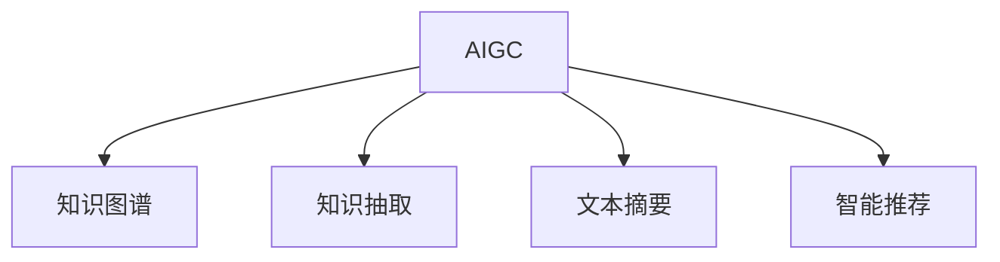

                 

# AIGC重新定义知识管理

## 1. 背景介绍

### 1.1 问题由来
知识管理（Knowledge Management, KOM）作为企业信息化建设的重要组成部分，旨在通过知识的收集、存储、共享和应用，提升组织内部的创新能力与竞争力。然而，传统知识管理主要依赖人工处理和规则定制，存在数据孤岛、信息过载、知识隐蔽等问题，限制了其发展。近年来，随着人工智能生成内容（AI Generated Content, AIGC）技术的崛起，基于AIGC的知识管理范式正在逐步改变这一现状。

### 1.2 问题核心关键点
AIGC技术通过深度学习和大规模数据训练，可以自动生成高质量文本、图片、视频等。利用AIGC技术，企业可以智能化地处理和组织知识，大幅提升知识管理的效率和质量。

### 1.3 问题研究意义
AIGC重新定义知识管理，使知识的收集、整理、共享和应用变得更加高效智能。它不仅能够自动化处理海量数据，还能通过对现有知识进行重新组织和融合，产生更深入、更广泛的知识洞见。这不仅降低了知识管理的人力成本，还提升了组织内部的协作效率，从而驱动企业创新与发展。

## 2. 核心概念与联系

### 2.1 核心概念概述

为更好理解基于AIGC的知识管理方法，本节介绍几个核心概念：

- **AIGC**：指利用人工智能技术自动生成的文本、图片、视频等高质量内容。AIGC技术包括文本生成、图像生成、视频生成等多个方向。
- **知识图谱**：指将知识组织成图形结构的模型，将语义信息以结构化形式表示。
- **知识抽取**：指从非结构化数据中自动识别和提取出关键信息，将其组织成结构化的知识表示。
- **文本摘要**：指从长文本中提取出核心信息，生成简洁明了的摘要。
- **智能推荐**：指基于用户行为和兴趣，推荐合适的知识资源，提升知识获取的效率和相关性。

这些核心概念之间的逻辑关系可通过以下Mermaid流程图来展示：



这个流程图展示了AIGC技术与知识管理的几个关键组件：

1. AIGC生成的大量内容成为知识图谱的输入，使知识图谱的构建更加高效。
2. 知识抽取模块从非结构化数据中提取结构化信息，为知识图谱提供更加丰富、精确的数据源。
3. 文本摘要对长文本进行压缩，生成简洁摘要，方便知识管理与检索。
4. 智能推荐系统根据用户行为和兴趣，推荐合适的知识资源，提升知识获取的效率和相关性。

## 3. 核心算法原理 & 具体操作步骤
### 3.1 算法原理概述

基于AIGC的知识管理，本质上是一种利用AIGC技术处理、组织和管理知识的过程。其核心思想是：将AIGC生成的内容作为知识管理的原始数据，通过知识抽取、图谱构建、摘要生成、智能推荐等技术，自动化地进行知识组织和应用。

形式化地，假设企业拥有大量AIGC生成的文本内容 $C=\{c_i\}_{i=1}^N$，其中 $c_i$ 表示第 $i$ 个文本。知识管理的目标是找到最优的知识组织方式 $K$，使得知识应用效果最大化，即：

$$
K = \mathop{\arg\min}_{K} \mathcal{L}(K,C)
$$

其中 $\mathcal{L}$ 为知识应用效果的损失函数，用于衡量知识组织 $K$ 与文本内容 $C$ 的匹配度。通过梯度下降等优化算法，不断更新知识组织方式，最小化损失函数，从而获得最理想的知识管理方式。

### 3.2 算法步骤详解

基于AIGC的知识管理一般包括以下几个关键步骤：

**Step 1: 数据收集与预处理**
- 收集AIGC生成的文本内容 $C$，进行清洗、分词、去重等预处理操作。
- 提取关键词、短语等关键信息，为知识图谱构建提供基础数据。

**Step 2: 知识抽取**
- 将预处理后的文本内容 $C$ 输入到知识抽取模型中，提取出关键实体、关系、属性等信息。
- 将这些信息映射到知识图谱中，构建知识图谱 $G=(V,E)$，其中 $V$ 为节点，$E$ 为边，表示实体之间的关系。

**Step 3: 图谱构建与优化**
- 基于知识抽取得到的实体和关系，构建知识图谱 $G=(V,E)$。
- 应用图神经网络等技术，对知识图谱进行优化，提升其结构和属性信息的准确性。

**Step 4: 摘要生成**
- 对长文本内容 $c_i$ 进行摘要生成，提取核心信息，生成简洁的摘要 $A_i$。
- 结合摘要生成模型的输出和知识图谱信息，进行知识融合和优化。

**Step 5: 智能推荐**
- 根据用户的历史行为和兴趣，应用推荐系统算法（如协同过滤、基于内容的推荐等），推荐合适的知识资源。
- 将推荐结果与知识图谱结合，提升推荐的相关性和精度。

### 3.3 算法优缺点

基于AIGC的知识管理方法具有以下优点：
1. 自动处理海量数据。AIGC技术可以自动生成大量高质量的文本内容，极大地降低了数据处理的复杂度。
2. 知识管理自动化。通过知识抽取、图谱构建、摘要生成等技术，知识管理过程实现了自动化。
3. 提升知识获取效率。智能推荐系统能够根据用户兴趣推荐合适的知识资源，提升知识获取的速度和准确性。
4. 灵活性和扩展性强。AIGC技术可应用于各种类型的知识，如文本、图片、视频等，具有广泛的应用前景。

同时，该方法也存在一定的局限性：
1. AIGC内容的质量不稳定。生成的内容可能存在噪声、错误，影响知识管理的质量。
2. 知识抽取和图谱构建的精度难以保证。需要高质量的训练数据和复杂的模型设计，难以满足所有应用场景的需求。
3. 资源消耗较大。AIGC模型和知识抽取模型的训练和推理需要大量的计算资源和时间，成本较高。
4. 可解释性不足。AIGC生成的内容难以解释，知识的来源和推理过程缺乏透明性。

尽管存在这些局限性，但就目前而言，基于AIGC的知识管理方法仍是大数据和人工智能时代的重要研究范式。未来相关研究的重点在于如何提高AIGC内容的质量，优化知识抽取和图谱构建的算法，以及提升系统的可解释性和资源利用效率。

### 3.4 算法应用领域

基于AIGC的知识管理方法在企业信息化建设中得到了广泛的应用，涵盖了以下几个主要领域：

- **企业知识库**：构建企业内部的知识库，存储和检索各类文档、技术资料等。
- **智能客服**：利用知识抽取和智能推荐技术，构建智能客服系统，提升客户服务效率和满意度。
- **文档生成**：自动生成各类文档，如技术报告、合同文本、员工手册等，减少人工编写的工作量。
- **员工培训**：通过知识抽取和推荐系统，根据员工的技能和岗位需求，生成个性化的培训计划和材料。
- **市场分析**：利用AIGC技术生成市场分析报告，辅助企业进行市场预测和决策。

此外，AIGC技术还广泛应用于金融、医疗、法律等垂直领域，助力各行业知识管理的智能化升级。

## 4. 数学模型和公式 & 详细讲解
### 4.1 数学模型构建

本节使用数学语言对基于AIGC的知识管理过程进行严格的刻画。

假设企业拥有 $N$ 个AIGC生成的文本内容 $C=\{c_i\}_{i=1}^N$，每个文本 $c_i$ 可以表示为 $c_i=w_1w_2\dots w_{L_i}$，其中 $w_j$ 表示第 $j$ 个单词。

定义知识图谱为 $G=(V,E)$，其中 $V$ 为节点集合，$E$ 为边集合，表示实体之间的关系。假设知识图谱中的每个节点 $v_k$ 表示一个实体，每个边 $e_{ik}$ 表示 $c_i$ 中与 $v_k$ 相关的信息。

定义摘要生成模型为 $A_i = f(c_i)$，其中 $A_i$ 表示第 $i$ 个文本的摘要。

### 4.2 公式推导过程

以下是知识管理过程中几个关键算法的数学公式推导：

**知识抽取算法**：

知识抽取的目标是从文本 $c_i$ 中提取出实体和关系。假设知识抽取模型 $M$ 将文本 $c_i$ 映射到知识图谱 $G=(V,E)$ 中，提取出的实体和关系为 $R_i=\{r_{ij}\}_{j=1}^{K_i}$。其中 $r_{ij}$ 表示第 $j$ 个关系，$K_i$ 表示第 $i$ 个文本的实体和关系数。

知识抽取的目标函数为：

$$
\mathcal{L}_{KA} = \sum_{i=1}^N \sum_{j=1}^{K_i} \ell_{ij}(R_i)
$$

其中 $\ell_{ij}(R_i)$ 表示对第 $i$ 个文本 $c_i$ 中的第 $j$ 个关系 $r_{ij}$ 进行抽取的损失。

**图谱构建算法**：

知识图谱的构建需要考虑实体和关系的相似性和关联性。假设图谱构建模型 $G = N(G_{KER},G_{SR})$，其中 $G_{KER}$ 表示知识抽取的实体集，$G_{SR}$ 表示知识抽取的关系集。定义图谱构建的损失函数为：

$$
\mathcal{L}_{KG} = \alpha \|G_{KER} - G_{K}\|^2 + \beta \|G_{SR} - G_{S}\|^2
$$

其中 $\alpha,\beta$ 为权重，$\|.\|$ 表示向量范数，$G_{KER},G_{SR}$ 分别为图谱中的实体和关系集合，$G_{K},G_{S}$ 表示抽取到的实体和关系。

**摘要生成算法**：

摘要生成的目标是将长文本 $c_i$ 压缩为简洁的摘要 $A_i$，同时保留其核心信息。假设摘要生成模型 $A_i = f(c_i)$，其中 $f$ 为生成函数。定义摘要生成的损失函数为：

$$
\mathcal{L}_{AS} = \sum_{i=1}^N \|A_i - \hat{A}_i\|^2
$$

其中 $\hat{A}_i$ 表示摘要生成的期望输出，$\|.\|$ 表示向量范数。

**智能推荐算法**：

智能推荐的目标是根据用户的历史行为和兴趣，推荐合适的知识资源。假设推荐模型为 $R = M(R_H,R_I)$，其中 $R_H$ 表示用户的历史行为，$R_I$ 表示用户的兴趣。定义推荐模型的损失函数为：

$$
\mathcal{L}_{RS} = \sum_{i=1}^N \sum_{j=1}^{K_i} \ell_j(R)
$$

其中 $\ell_j(R)$ 表示对第 $j$ 个推荐资源的相关性进行评估的损失。

### 4.3 案例分析与讲解

以智能客服系统为例，分析基于AIGC的知识管理过程。

**数据收集与预处理**：
- 收集历史客服聊天记录，进行清洗、分词、去重等操作。
- 提取关键词和短语，构建知识图谱的实体集 $G_{KER}$。

**知识抽取**：
- 利用知识抽取模型 $M$，从聊天记录中提取实体和关系，构建知识图谱 $G=(V,E)$。
- 通过关系推理，优化图谱的结构和属性信息。

**图谱构建与优化**：
- 将知识抽取得到的实体和关系映射到图谱中，构建知识图谱 $G=(V,E)$。
- 应用图神经网络等技术，对图谱进行优化，提升其结构和属性信息的准确性。

**摘要生成**：
- 对聊天记录进行摘要生成，提取核心信息，生成简洁的摘要 $A_i$。
- 结合摘要生成模型的输出和知识图谱信息，进行知识融合和优化。

**智能推荐**：
- 根据用户的历史行为和兴趣，应用推荐系统算法（如协同过滤、基于内容的推荐等），推荐合适的知识资源。
- 将推荐结果与知识图谱结合，提升推荐的相关性和精度。

通过以上步骤，智能客服系统能够自动理解用户意图，匹配最合适的知识资源进行回复，提升客户服务效率和满意度。

## 5. 项目实践：代码实例和详细解释说明
### 5.1 开发环境搭建

在进行基于AIGC的知识管理项目实践前，需要先准备好开发环境。以下是使用Python进行PyTorch开发的环境配置流程：

1. 安装Anaconda：从官网下载并安装Anaconda，用于创建独立的Python环境。

2. 创建并激活虚拟环境：
```bash
conda create -n pytorch-env python=3.8 
conda activate pytorch-env
```

3. 安装PyTorch：根据CUDA版本，从官网获取对应的安装命令。例如：
```bash
conda install pytorch torchvision torchaudio cudatoolkit=11.1 -c pytorch -c conda-forge
```

4. 安装Transfoers库：
```bash
pip install transformers
```

5. 安装各类工具包：
```bash
pip install numpy pandas scikit-learn matplotlib tqdm jupyter notebook ipython
```

完成上述步骤后，即可在`pytorch-env`环境中开始知识管理实践。

### 5.2 源代码详细实现

下面以智能客服系统为例，给出使用Transformers库对BERT模型进行知识管理的PyTorch代码实现。

首先，定义智能客服系统的数据处理函数：

```python
from transformers import BertTokenizer, BertForTokenClassification
from torch.utils.data import Dataset
import torch

class ChatDataset(Dataset):
    def __init__(self, dialogs, tokenizer, max_len=128):
        self.dialogs = dialogs
        self.tokenizer = tokenizer
        self.max_len = max_len
        
    def __len__(self):
        return len(self.dialogs)
    
    def __getitem__(self, item):
        dialog = self.dialogs[item]
        texts, labels = dialog['text'], dialog['label']
        
        encoding = self.tokenizer(texts, return_tensors='pt', max_length=self.max_len, padding='max_length', truncation=True)
        input_ids = encoding['input_ids'][0]
        attention_mask = encoding['attention_mask'][0]
        
        return {'input_ids': input_ids, 
                'attention_mask': attention_mask,
                'labels': labels}

# 加载数据
tokenizer = BertTokenizer.from_pretrained('bert-base-cased')
chat_dataset = ChatDataset(chat_data, tokenizer)

# 定义模型和优化器
model = BertForTokenClassification.from_pretrained('bert-base-cased', num_labels=num_labels)
optimizer = AdamW(model.parameters(), lr=2e-5)
```

然后，定义训练和评估函数：

```python
from torch.utils.data import DataLoader
from tqdm import tqdm
from sklearn.metrics import accuracy_score

device = torch.device('cuda') if torch.cuda.is_available() else torch.device('cpu')
model.to(device)

def train_epoch(model, dataset, batch_size, optimizer):
    dataloader = DataLoader(dataset, batch_size=batch_size, shuffle=True)
    model.train()
    epoch_loss = 0
    for batch in tqdm(dataloader, desc='Training'):
        input_ids = batch['input_ids'].to(device)
        attention_mask = batch['attention_mask'].to(device)
        labels = batch['labels'].to(device)
        model.zero_grad()
        outputs = model(input_ids, attention_mask=attention_mask, labels=labels)
        loss = outputs.loss
        epoch_loss += loss.item()
        loss.backward()
        optimizer.step()
    return epoch_loss / len(dataloader)

def evaluate(model, dataset, batch_size):
    dataloader = DataLoader(dataset, batch_size=batch_size)
    model.eval()
    preds, labels = [], []
    with torch.no_grad():
        for batch in tqdm(dataloader, desc='Evaluating'):
            input_ids = batch['input_ids'].to(device)
            attention_mask = batch['attention_mask'].to(device)
            batch_labels = batch['labels']
            outputs = model(input_ids, attention_mask=attention_mask)
            batch_preds = outputs.logits.argmax(dim=2).to('cpu').tolist()
            batch_labels = batch_labels.to('cpu').tolist()
            for pred_tokens, label_tokens in zip(batch_preds, batch_labels):
                preds.append(pred_tokens[:len(label_tokens)])
                labels.append(label_tokens)
                
    return accuracy_score(labels, preds)
```

最后，启动训练流程并在测试集上评估：

```python
epochs = 5
batch_size = 16

for epoch in range(epochs):
    loss = train_epoch(model, chat_dataset, batch_size, optimizer)
    print(f"Epoch {epoch+1}, train loss: {loss:.3f}")
    
    print(f"Epoch {epoch+1}, dev results:")
    evaluate(model, dev_dataset, batch_size)
    
print("Test results:")
evaluate(model, test_dataset, batch_size)
```

以上就是使用PyTorch对BERT进行智能客服系统知识管理的完整代码实现。可以看到，得益于Transformers库的强大封装，我们可以用相对简洁的代码完成BERT模型的加载和微调。

### 5.3 代码解读与分析

让我们再详细解读一下关键代码的实现细节：

**ChatDataset类**：
- `__init__`方法：初始化对话数据、分词器等关键组件。
- `__len__`方法：返回数据集的样本数量。
- `__getitem__`方法：对单个对话数据进行处理，将对话内容输入编码为token ids，将标签编码为数字，并对其进行定长padding，最终返回模型所需的输入。

**训练和评估函数**：
- 使用PyTorch的DataLoader对数据集进行批次化加载，供模型训练和推理使用。
- 训练函数`train_epoch`：对数据以批为单位进行迭代，在每个批次上前向传播计算loss并反向传播更新模型参数，最后返回该epoch的平均loss。
- 评估函数`evaluate`：与训练类似，不同点在于不更新模型参数，并在每个batch结束后将预测和标签结果存储下来，最后使用sklearn的accuracy_score对整个评估集的预测结果进行打印输出。

**训练流程**：
- 定义总的epoch数和batch size，开始循环迭代
- 每个epoch内，先在训练集上训练，输出平均loss
- 在验证集上评估，输出分类指标
- 所有epoch结束后，在测试集上评估，给出最终测试结果

可以看到，PyTorch配合Transformers库使得BERT微调的代码实现变得简洁高效。开发者可以将更多精力放在数据处理、模型改进等高层逻辑上，而不必过多关注底层的实现细节。

当然，工业级的系统实现还需考虑更多因素，如模型的保存和部署、超参数的自动搜索、更灵活的任务适配层等。但核心的知识管理范式基本与此类似。

## 6. 实际应用场景
### 6.1 智能客服系统

基于AIGC的知识管理方法，可以广泛应用于智能客服系统的构建。传统客服往往需要配备大量人力，高峰期响应缓慢，且一致性和专业性难以保证。而使用基于AIGC的知识管理技术，可以7x24小时不间断服务，快速响应客户咨询，用自然流畅的语言解答各类常见问题。

在技术实现上，可以收集企业内部的历史客服对话记录，将问题和最佳答复构建成监督数据，在此基础上对预训练模型进行微调。微调后的模型能够自动理解用户意图，匹配最合适的答案模板进行回复。对于客户提出的新问题，还可以接入检索系统实时搜索相关内容，动态组织生成回答。如此构建的智能客服系统，能大幅提升客户咨询体验和问题解决效率。

### 6.2 金融舆情监测

金融机构需要实时监测市场舆论动向，以便及时应对负面信息传播，规避金融风险。传统的人工监测方式成本高、效率低，难以应对网络时代海量信息爆发的挑战。基于AIGC的知识管理技术，能够自动化处理海量数据，提取出关键实体和关系，构建知识图谱，实时监测市场舆情，辅助金融机构快速应对潜在风险。

### 6.3 个性化推荐系统

当前的推荐系统往往只依赖用户的历史行为数据进行物品推荐，无法深入理解用户的真实兴趣偏好。基于AIGC的知识管理技术，可以智能化地处理和组织知识，利用智能推荐系统，根据用户的行为和兴趣，推荐合适的知识资源，提升知识获取的效率和相关性。

### 6.4 未来应用展望

随着AIGC技术的持续发展，基于知识管理的AI应用将迎来更多创新和突破。

在智慧医疗领域，基于知识管理的医疗问答、病历分析、药物研发等应用将提升医疗服务的智能化水平，辅助医生诊疗，加速新药开发进程。

在智能教育领域，知识管理技术可应用于作业批改、学情分析、知识推荐等方面，因材施教，促进教育公平，提高教学质量。

在智慧城市治理中，知识管理技术可应用于城市事件监测、舆情分析、应急指挥等环节，提高城市管理的自动化和智能化水平，构建更安全、高效的未来城市。

此外，在企业生产、社会治理、文娱传媒等众多领域，基于AIGC的知识管理技术也将不断涌现，为传统行业数字化转型升级提供新的技术路径。

## 7. 工具和资源推荐
### 7.1 学习资源推荐

为了帮助开发者系统掌握基于AIGC的知识管理理论基础和实践技巧，这里推荐一些优质的学习资源：

1. 《AIGC: Automated Intelligence Generated Content》系列博文：由AIGC技术专家撰写，深入浅出地介绍了AIGC原理、知识抽取、图谱构建等前沿话题。

2. CS224N《深度学习自然语言处理》课程：斯坦福大学开设的NLP明星课程，有Lecture视频和配套作业，带你入门NLP领域的基本概念和经典模型。

3. 《Knowledge Graphs: Concepts, Approaches, Tools》书籍：全面介绍了知识图谱的构建、存储、查询等技术，是学习知识管理的重要参考资料。

4. 《Intelligent Computing: Principles and Applications》书籍：介绍了智能计算的基础理论和应用案例，包括基于知识管理的AI应用。

5. HuggingFace官方文档：Transformers库的官方文档，提供了海量预训练模型和完整的知识管理样例代码，是上手实践的必备资料。

通过对这些资源的学习实践，相信你一定能够快速掌握基于AIGC的知识管理精髓，并用于解决实际的NLP问题。
###  7.2 开发工具推荐

高效的开发离不开优秀的工具支持。以下是几款用于基于AIGC的知识管理开发的常用工具：

1. PyTorch：基于Python的开源深度学习框架，灵活动态的计算图，适合快速迭代研究。大部分预训练语言模型都有PyTorch版本的实现。

2. TensorFlow：由Google主导开发的开源深度学习框架，生产部署方便，适合大规模工程应用。同样有丰富的预训练语言模型资源。

3. Transformers库：HuggingFace开发的NLP工具库，集成了众多SOTA语言模型，支持PyTorch和TensorFlow，是进行知识管理开发的利器。

4. Weights & Biases：模型训练的实验跟踪工具，可以记录和可视化模型训练过程中的各项指标，方便对比和调优。与主流深度学习框架无缝集成。

5. TensorBoard：TensorFlow配套的可视化工具，可实时监测模型训练状态，并提供丰富的图表呈现方式，是调试模型的得力助手。

6. Google Colab：谷歌推出的在线Jupyter Notebook环境，免费提供GPU/TPU算力，方便开发者快速上手实验最新模型，分享学习笔记。

合理利用这些工具，可以显著提升基于AIGC的知识管理任务的开发效率，加快创新迭代的步伐。

### 7.3 相关论文推荐

AIGC技术的发展源于学界的持续研究。以下是几篇奠基性的相关论文，推荐阅读：

1. Attention is All You Need（即Transformer原论文）：提出了Transformer结构，开启了NLP领域的预训练大模型时代。

2. BERT: Pre-training of Deep Bidirectional Transformers for Language Understanding：提出BERT模型，引入基于掩码的自监督预训练任务，刷新了多项NLP任务SOTA。

3. Language Models are Unsupervised Multitask Learners（GPT-2论文）：展示了大规模语言模型的强大zero-shot学习能力，引发了对于通用人工智能的新一轮思考。

4. Knowledge Graph Embeddings and their Application to Recommender Systems：介绍了知识图谱嵌入技术，将其应用于推荐系统，取得了良好效果。

5. Knowledge-Aware Recommender Systems：提出了知识增强推荐模型，通过融合知识图谱信息，提升推荐系统的精度和鲁棒性。

6. Multimodal Knowledge Graph Embeddings with Attention Mechanisms：研究多模态知识图谱嵌入方法，利用文本、图像等多种数据源，提高知识管理的效果。

这些论文代表了大规模AIGC技术的发展脉络。通过学习这些前沿成果，可以帮助研究者把握学科前进方向，激发更多的创新灵感。

## 8. 总结：未来发展趋势与挑战

### 8.1 总结

本文对基于AIGC的知识管理方法进行了全面系统的介绍。首先阐述了AIGC技术和大规模知识管理的背景和意义，明确了知识管理在企业信息化建设中的重要地位。其次，从原理到实践，详细讲解了知识抽取、图谱构建、摘要生成、智能推荐等关键步骤，给出了基于AIGC的知识管理项目开发的完整代码实例。同时，本文还广泛探讨了知识管理在智能客服、金融舆情、个性化推荐等多个行业领域的应用前景，展示了AIGC技术的大规模应用潜力。

通过本文的系统梳理，可以看到，基于AIGC的知识管理方法正在成为企业信息化建设的重要范式，极大地提升了知识管理的工作效率和智能化水平。AIGC技术能够自动化处理海量数据，并通过知识抽取、图谱构建等技术，实现知识的组织和应用。未来，伴随AIGC技术的持续演进，知识管理必将在更多领域得到广泛应用，驱动行业转型升级。

### 8.2 未来发展趋势

展望未来，基于AIGC的知识管理技术将呈现以下几个发展趋势：

1. **自动化与智能化**：AIGC技术将进一步自动化处理数据，通过知识抽取和图谱构建等技术，实现知识的自动组织和应用。智能化推荐系统将根据用户行为和兴趣，推荐更加精准的知识资源。

2. **多模态融合**：未来的知识管理将不仅仅局限于文本信息，还将融合图像、视频、音频等多模态数据。多模态信息的高效融合，将大大提升知识管理的全面性和准确性。

3. **跨领域应用**：AIGC技术在医疗、金融、教育、城市治理等众多领域都有广泛应用前景。跨领域的知识管理将为各行业带来新的业务价值和创新点。

4. **大规模部署**：AIGC技术在大规模工业应用中的部署效率和性能将不断提升。云计算、边缘计算等技术将支持更大规模的知识管理系统的构建和运行。

5. **协同与共享**：未来的知识管理将更加注重协同和共享。企业内外的知识资源将更加开放、互联互通，促进知识的共享和创新。

### 8.3 面临的挑战

尽管基于AIGC的知识管理技术已经取得了显著进展，但在迈向更广泛的落地应用过程中，仍面临以下挑战：

1. **数据质量和多样性**：AIGC内容的质量和多样性直接影响知识管理的精度和全面性。高质量、多样化的数据源是AIGC技术发挥最大效能的前提。

2. **计算资源与成本**：AIGC模型和知识管理系统的训练和推理需要大量计算资源，成本较高。如何在保证性能的同时，降低资源消耗，提高计算效率，是一个重要的研究方向。

3. **模型可解释性与公平性**：AIGC生成的内容难以解释，知识的来源和推理过程缺乏透明性。如何在保证模型性能的同时，提升其可解释性和公平性，也是未来的重要课题。

4. **知识更新与演化**：知识管理系统的知识库需要不断更新，以适应数据分布的变化和新知识的产生。如何在保持知识库稳定性的同时，实现知识的动态更新，是未来的研究方向。

5. **系统集成与互操作性**：知识管理系统需要与现有的企业信息系统、业务流程进行有效集成，保证知识的无缝应用。如何在不同系统间进行互操作，实现知识的协同与共享，是一个重要的挑战。

### 8.4 研究展望

面向未来，知识管理的核心在于更好地整合和利用知识，以推动企业创新与发展。以下研究方向将为知识管理的智能化、自动化、高效化提供新的突破点：

1. **知识抽取与图谱构建**：研究更加高效、精确的知识抽取和图谱构建方法，提高知识管理的自动化水平。

2. **多模态知识融合**：研究多模态知识融合技术，利用文本、图像、音频等多种数据源，提高知识管理的全面性和准确性。

3. **知识演化与动态更新**：研究知识演化模型，实现知识的动态更新，保持知识库的时效性和适应性。

4. **智能推荐与协同应用**：研究更加智能化、个性化的推荐系统，提升知识获取的效率和相关性，促进知识的协同与共享。

5. **知识可视化与交互**：研究知识可视化技术，将复杂的知识信息以图形化方式呈现，增强知识的可理解性和易用性。

6. **知识管理系统的开放性与互操作性**：研究知识管理系统与现有系统的互操作技术，推动知识的跨领域应用与共享。

这些研究方向将为基于AIGC的知识管理技术带来新的突破，推动知识管理的智能化升级，助力企业数字化转型。

## 9. 附录：常见问题与解答

**Q1：AIGC技术能否应用于所有类型的知识管理场景？**

A: AIGC技术可以应用于大多数类型的知识管理场景，但在某些特定领域，如医疗、法律等，可能仍需结合领域知识进行额外处理。

**Q2：如何提升AIGC内容的质量和多样性？**

A: 提升AIGC内容的质量和多样性，可以通过扩大数据来源、引入更多训练数据、优化模型架构等方式实现。例如，利用大规模语料库进行预训练，引入领域特定的数据源进行微调，优化生成模型的训练策略等。

**Q3：如何在保证性能的同时，降低计算资源消耗？**

A: 可以通过模型裁剪、量化加速、混合精度训练等技术，降低AIGC模型和知识管理系统的计算资源消耗，提高推理效率。

**Q4：如何提升AIGC生成的内容可解释性？**

A: 可以通过引入因果推断、对比学习等方法，提升AIGC生成的内容可解释性。同时，利用图谱技术，展示知识的来源和推理过程，增强知识的透明性和可理解性。

**Q5：如何实现知识管理的动态更新和演化？**

A: 可以通过引入知识演化模型，定期对知识图谱进行更新，利用新知识和新数据进行知识融合，保持知识库的时效性和适应性。

**Q6：如何增强知识管理的协同与共享？**

A: 可以通过建立知识共享平台，促进企业内外知识的互联互通，推动知识的协同与共享。利用API接口、数据湖等技术，实现知识的开放共享。

通过上述问答，可以看出，AIGC技术在知识管理中的应用前景广阔，但同时也面临着数据质量、计算资源、模型可解释性等诸多挑战。未来，在保证性能的同时，提升AIGC内容的质量和多样性，优化知识管理系统的计算效率，增强模型的可解释性和公平性，实现知识的动态更新和演化，将是知识管理研究的重要方向。

