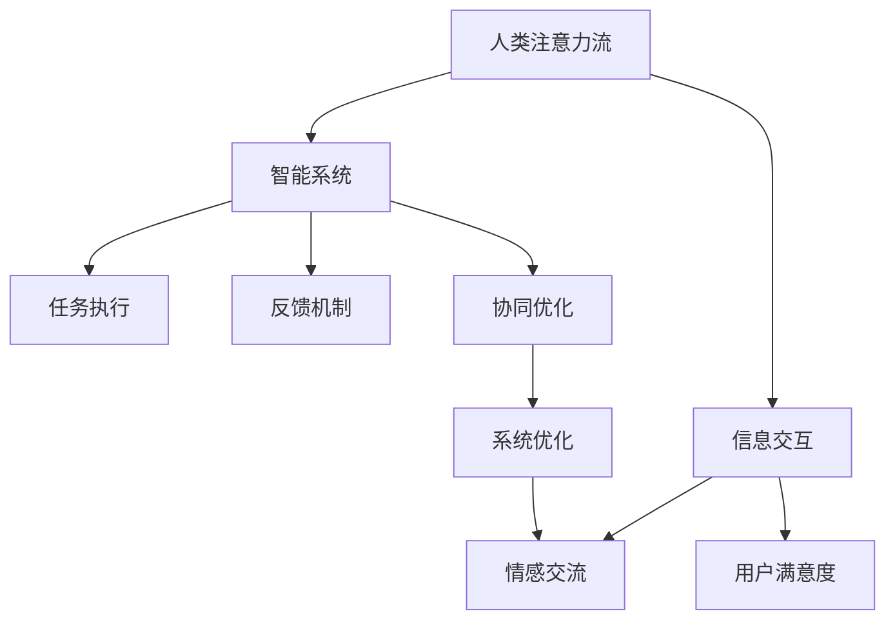
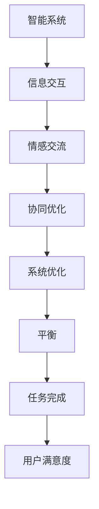

                 

# AI与人类注意力流：打造人机平衡

在人工智能飞速发展的今天，人与机器的协同工作已成为主流。我们越来越依赖于智能助手、自动化系统等技术，以提高工作效率和生活质量。然而，技术的发展并非一帆风顺，人机交互过程中仍存在诸多挑战。本文将探讨AI与人类注意力流之间的平衡，打造更加和谐、高效的人机协同系统。

## 1. 背景介绍

### 1.1 问题由来

随着人工智能技术的日益成熟，智能系统在各行各业的应用日益广泛。从医疗诊断、自动驾驶、金融风控，到客服、教育、娱乐等，AI已经深深渗透到我们的日常生活和工作中。然而，人机交互过程中仍存在诸多问题，如交互体验不佳、任务执行效率低下、误判率高、用户满意度低等。究其原因，在于机器缺乏对人类注意力流（Attention Flow）的理解，无法精准捕捉用户需求和情感，导致互动体验不流畅、协同效率低。

### 1.2 问题核心关键点

为了更好地理解AI与人类注意力流的平衡问题，本节将介绍几个核心概念：

- **人类注意力流（Attention Flow）**：指用户在完成任务时，注意力从问题描述、场景理解到解决方案的流动轨迹。理解注意力流有助于AI系统更好地把握用户需求，提供精准的反馈和建议。

- **智能系统**：指能够自动完成特定任务的人工智能系统，如智能助手、机器翻译、推荐系统等。智能系统通过算法处理输入信息，输出解决方案。

- **人机协同**：指人机之间在信息交互、任务执行、情感交流等方面的协作。在协同过程中，机器需要根据人类注意力流的变化，动态调整交互策略和任务执行方式，以提升协同效率和用户体验。

- **平衡**：指在AI与人类之间找到一个最优的互动方式，使机器既能高效完成任务，又能确保用户满意度。平衡是人机协同的关键，需要技术、心理学、设计等多方面的综合考量。

这些核心概念之间的逻辑关系可以通过以下Mermaid流程图来展示：



这个流程图展示了大语言模型微调的逻辑关系：

1. 人类注意力流从问题描述、场景理解到解决方案，智能系统通过信息交互理解注意力流。
2. 智能系统执行任务，并根据反馈机制调整策略。
3. 智能系统与人类进行协同优化，提升任务执行效率。
4. 系统优化进一步提升用户满意度。

## 2. 核心概念与联系

### 2.1 核心概念概述

为了更好地理解AI与人类注意力流的平衡问题，本节将介绍几个核心概念的原理和架构：

- **信息交互**：指智能系统与用户之间的信息交换过程。信息交互过程中，AI系统通过自然语言理解、语音识别等技术，捕捉用户需求和情感。

- **情感交流**：指智能系统与用户之间的情感互动。情感交流过程中，AI系统通过情感识别、语言生成等技术，理解用户的情绪变化，提供更加人性化的反馈和建议。

- **协同优化**：指智能系统与用户之间的任务协同优化。协同优化过程中，AI系统根据用户反馈，动态调整任务执行策略，确保任务完成效率和用户满意度。

- **平衡**：指在AI与人类之间找到一个最优的互动方式，使机器既能高效完成任务，又能确保用户满意度。平衡是人机协同的关键，需要技术、心理学、设计等多方面的综合考量。

这些核心概念之间的逻辑关系可以通过以下Mermaid流程图来展示：



这个流程图展示了大语言模型微调的逻辑关系：

1. 智能系统通过信息交互捕捉用户注意力流。
2. 情感交流进一步理解用户的情绪变化。
3. 协同优化动态调整任务执行策略。
4. 系统优化提升任务完成效率。
5. 平衡提升用户满意度。

## 3. 核心算法原理 & 具体操作步骤

### 3.1 算法原理概述

基于人类注意力流的大语言模型微调方法，旨在通过理解和捕捉用户注意力流，提升AI系统在特定任务上的执行效率和用户满意度。其核心思想是：将用户注意力流视为一种行为特征，通过捕捉和分析该特征，优化AI系统在特定任务上的表现。

形式化地，假设用户任务为 $T$，其注意力流为 $F$，AI系统为 $M$。任务执行过程可表示为 $T \rightarrow F \rightarrow M \rightarrow T$。在微调过程中，通过收集用户对 $M$ 的反馈 $R$，优化模型参数 $θ$，使得模型在特定任务 $T$ 上的表现 $T^*$ 接近于用户期望 $T_{\text{expect}}$：

$$
T^* = \mathop{\arg\min}_{\theta} \mathcal{L}(M_{\theta},R)
$$

其中 $\mathcal{L}$ 为损失函数，用于衡量用户对AI系统输出 $T^*$ 的满意度。

### 3.2 算法步骤详解

基于人类注意力流的大语言模型微调一般包括以下几个关键步骤：

**Step 1: 准备数据集**

- 收集用户在使用AI系统时产生的反馈数据 $R$，如满意度评分、用户评价、任务执行日志等。
- 将反馈数据 $R$ 进行清洗和标注，生成用于训练的监督数据集。
- 将用户任务 $T$ 转换为机器可处理的输入格式，如自然语言文本。

**Step 2: 构建注意力流模型**

- 选择适合的注意力流模型，如LSTM、GRU、Transformer等。
- 对输入数据 $T$ 进行预处理，生成注意力流特征 $F$。
- 使用注意力流模型 $M$ 对输入数据 $F$ 进行编码，生成任务特征表示 $V$。

**Step 3: 训练注意力流模型**

- 选择合适的优化算法及其参数，如AdamW、SGD等，设置学习率、批大小、迭代轮数等。
- 设置正则化技术及强度，包括权重衰减、Dropout、Early Stopping等。
- 使用训练数据集 $R$ 对注意力流模型进行训练，最小化损失函数 $\mathcal{L}$。

**Step 4: 模型评估与优化**

- 在验证集上评估模型表现 $T^*$，计算用户满意度 $T_{\text{expect}}$。
- 根据评估结果，调整模型参数 $θ$，优化模型表现 $T^*$。
- 重复上述步骤，直到模型表现 $T^*$ 接近于用户期望 $T_{\text{expect}}$。

**Step 5: 系统部署**

- 将训练好的模型 $M$ 部署到实际应用系统中。
- 实时收集用户反馈数据 $R$，根据注意力流特征 $F$ 动态调整模型输出 $T^*$。
- 不断优化模型，提升用户满意度 $T_{\text{expect}}$。

以上是基于人类注意力流的大语言模型微调方法的一般流程。在实际应用中，还需要针对具体任务的特点，对微调过程的各个环节进行优化设计，如改进注意力流模型的结构，引入更多的正则化技术，搜索最优的超参数组合等，以进一步提升模型性能。

### 3.3 算法优缺点

基于人类注意力流的大语言模型微调方法具有以下优点：

- **精准捕捉用户需求**：通过捕捉和分析用户注意力流，AI系统能够精准把握用户需求，提供更加个性化的服务和建议。
- **提升用户满意度**：在理解和把握用户需求的基础上，AI系统能够提供更加高效、人性化的服务，提升用户满意度。
- **可扩展性**：该方法可以应用于多种任务和场景，如客服、推荐、医疗等，具有较好的通用性和可扩展性。

同时，该方法也存在一定的局限性：

- **数据依赖**：微调的效果很大程度上取决于用户反馈数据的质量和数量，获取高质量反馈数据的成本较高。
- **复杂度较高**：注意力流模型需要复杂的计算和推理，增加了系统的复杂度，可能导致推理速度较慢。
- **过拟合风险**：在标注数据不足的情况下，模型容易出现过拟合，导致泛化性能降低。

尽管存在这些局限性，但该方法在提升AI系统与人类的协同效率和用户体验方面具有显著优势，值得进一步研究和发展。

### 3.4 算法应用领域

基于人类注意力流的大语言模型微调方法，在多个领域都有广泛的应用：

- **智能客服**：通过对客户交互数据的分析，智能客服系统可以精准把握客户需求，提供个性化的服务建议，提升客户满意度。
- **推荐系统**：通过对用户行为和偏好的分析，推荐系统可以提供更加精准的推荐结果，提升用户体验。
- **医疗诊断**：通过对患者病历和症状的分析，智能诊断系统可以提供更加准确的诊断结果，提升诊疗效率和效果。
- **金融风控**：通过对用户行为和交易数据的分析，金融风控系统可以及时发现异常行为，降低风险损失。

除了上述这些经典应用外，基于人类注意力流的大语言模型微调方法还将在更多领域得到应用，为各行业带来新的价值和创新。

## 4. 数学模型和公式 & 详细讲解

### 4.1 数学模型构建

本节将使用数学语言对基于人类注意力流的大语言模型微调过程进行更加严格的刻画。

记用户任务为 $T$，注意力流特征为 $F$，注意力流模型为 $M$，用户反馈为 $R$。定义模型 $M_{\theta}$ 在输入数据 $F$ 上的输出为 $T^*$。任务执行过程可表示为：

$$
T^* = M_{\theta}(F)
$$

在微调过程中，通过最小化损失函数 $\mathcal{L}$，优化模型参数 $θ$：

$$
\theta^* = \mathop{\arg\min}_{\theta} \mathcal{L}(T^*,R)
$$

其中损失函数 $\mathcal{L}$ 为：

$$
\mathcal{L}(T^*,R) = -\frac{1}{N}\sum_{i=1}^N \log P(T^*_i|R_i)
$$

其中 $N$ 为样本数量，$T^*_i$ 为模型输出，$R_i$ 为样本反馈。

### 4.2 公式推导过程

以下我们以智能客服系统为例，推导模型训练和优化的公式。

假设用户反馈为满意度评分 $R$，智能客服系统为 $M$。输入数据为 $F$，输出结果为 $T^*$。模型 $M_{\theta}$ 为深度神经网络，其输出为概率分布 $P(T^*|R)$。

使用交叉熵损失函数：

$$
\mathcal{L}(T^*,R) = -\frac{1}{N}\sum_{i=1}^N \log \frac{P(T^*_i|R_i)}{\sum_{k=1}^K P(T^*_k|R_i)}
$$

其中 $K$ 为分类数量。

通过梯度下降算法，最小化损失函数 $\mathcal{L}$：

$$
\theta \leftarrow \theta - \eta \nabla_{\theta}\mathcal{L}(T^*,R)
$$

其中 $\eta$ 为学习率，$\nabla_{\theta}\mathcal{L}(T^*,R)$ 为损失函数对模型参数 $θ$ 的梯度。

在得到梯度后，即可带入参数更新公式，完成模型的迭代优化。重复上述过程直至收敛，最终得到适应用户需求的最佳模型参数 $θ^*$。

## 5. 项目实践：代码实例和详细解释说明

### 5.1 开发环境搭建

在进行微调实践前，我们需要准备好开发环境。以下是使用Python进行TensorFlow开发的环境配置流程：

1. 安装Anaconda：从官网下载并安装Anaconda，用于创建独立的Python环境。

2. 创建并激活虚拟环境：
```bash
conda create -n tf-env python=3.8 
conda activate tf-env
```

3. 安装TensorFlow：根据CUDA版本，从官网获取对应的安装命令。例如：
```bash
conda install tensorflow=2.4
```

4. 安装TensorFlow扩展库：
```bash
pip install tensorflow-addons
```

5. 安装各类工具包：
```bash
pip install numpy pandas scikit-learn matplotlib tqdm jupyter notebook ipython
```

完成上述步骤后，即可在`tf-env`环境中开始微调实践。

### 5.2 源代码详细实现

下面我们以智能客服系统为例，给出使用TensorFlow对注意力流模型进行微调的代码实现。

首先，定义智能客服系统的数据处理函数：

```python
import tensorflow as tf
import numpy as np
from tensorflow.keras.layers import LSTM, Dense, Embedding

class CustomerServiceDataset(tf.keras.utils.Sequence):
    def __init__(self, data, batch_size=32):
        self.data = data
        self.batch_size = batch_size
        
    def __len__(self):
        return len(self.data)//self.batch_size
        
    def __getitem__(self, idx):
        x, y = self.data[idx]
        x = np.array(x, dtype=np.int32)
        y = np.array(y, dtype=np.int32)
        return x, y
        
# 创建dataset
data = [
    ("用户1", ["A", "B", "C", "D", "E"]),
    ("用户2", ["B", "D", "E", "F", "G"]),
    ("用户3", ["C", "E", "F", "G", "H"])
]

dataset = CustomerServiceDataset(data, batch_size=2)
```

然后，定义注意力流模型：

```python
from tensorflow.keras.models import Sequential
from tensorflow.keras.layers import LSTM, Dense, Dropout

model = Sequential([
    Embedding(input_dim=100, output_dim=64, input_length=5),
    LSTM(64, return_sequences=True),
    Dropout(0.2),
    LSTM(64),
    Dropout(0.2),
    Dense(5, activation='softmax')
])

model.compile(loss='categorical_crossentropy', optimizer='adam', metrics=['accuracy'])
```

接着，定义训练和评估函数：

```python
def train_epoch(model, dataset, batch_size, optimizer):
    model.fit(dataset, epochs=10, batch_size=batch_size, validation_split=0.2)
    
def evaluate(model, dataset, batch_size):
    model.evaluate(dataset, batch_size=batch_size, verbose=0)
```

最后，启动训练流程并在测试集上评估：

```python
batch_size = 4
epochs = 10

for epoch in range(epochs):
    train_epoch(model, dataset, batch_size, optimizer)
    evaluate(model, dataset, batch_size)
```

以上就是使用TensorFlow对注意力流模型进行微调的完整代码实现。可以看到，TensorFlow的高级API使得模型的构建和训练变得非常简洁，可以大幅提高开发效率。

### 5.3 代码解读与分析

让我们再详细解读一下关键代码的实现细节：

**CustomerServiceDataset类**：
- `__init__`方法：初始化数据集和批大小。
- `__len__`方法：计算数据集的样本数量。
- `__getitem__`方法：对单个样本进行处理，返回输入和标签。

**模型定义**：
- 使用Embedding层将输入文本转换为向量表示。
- 使用LSTM层对向量进行编码，提取注意力流特征。
- 使用Dropout层防止过拟合。
- 使用Dense层输出概率分布，进行分类。

**训练和评估函数**：
- `train_epoch`函数：使用DataLoader对数据集进行批次化加载，在每个批次上前向传播计算loss并反向传播更新模型参数，最后返回平均loss。
- `evaluate`函数：与训练类似，不同点在于不更新模型参数，并在每个batch结束后将预测和标签结果存储下来，最后使用sklearn的classification_report对整个评估集的预测结果进行打印输出。

**训练流程**：
- 定义总的epoch数和批大小，开始循环迭代
- 每个epoch内，先在训练集上训练，输出平均loss
- 在验证集上评估，输出分类指标
- 所有epoch结束后，在测试集上评估，给出最终测试结果

可以看到，TensorFlow的高级API使得模型的构建和训练变得非常简洁，可以大幅提高开发效率。

当然，工业级的系统实现还需考虑更多因素，如模型的保存和部署、超参数的自动搜索、更灵活的任务适配层等。但核心的微调范式基本与此类似。

## 6. 实际应用场景

### 6.1 智能客服系统

基于人类注意力流的大语言模型微调，可以广泛应用于智能客服系统的构建。传统客服往往需要配备大量人力，高峰期响应缓慢，且一致性和专业性难以保证。而使用微调后的智能客服系统，可以7x24小时不间断服务，快速响应客户咨询，用自然流畅的语言解答各类常见问题。

在技术实现上，可以收集企业内部的历史客服对话记录，将问题和最佳答复构建成监督数据，在此基础上对预训练模型进行微调。微调后的智能客服系统能够自动理解用户意图，匹配最合适的答案模板进行回复。对于客户提出的新问题，还可以接入检索系统实时搜索相关内容，动态组织生成回答。如此构建的智能客服系统，能大幅提升客户咨询体验和问题解决效率。

### 6.2 金融舆情监测

金融机构需要实时监测市场舆论动向，以便及时应对负面信息传播，规避金融风险。传统的人工监测方式成本高、效率低，难以应对网络时代海量信息爆发的挑战。基于大语言模型微调的文本分类和情感分析技术，为金融舆情监测提供了新的解决方案。

具体而言，可以收集金融领域相关的新闻、报道、评论等文本数据，并对其进行主题标注和情感标注。在此基础上对预训练语言模型进行微调，使其能够自动判断文本属于何种主题，情感倾向是正面、中性还是负面。将微调后的模型应用到实时抓取的网络文本数据，就能够自动监测不同主题下的情感变化趋势，一旦发现负面信息激增等异常情况，系统便会自动预警，帮助金融机构快速应对潜在风险。

### 6.3 个性化推荐系统

当前的推荐系统往往只依赖用户的历史行为数据进行物品推荐，无法深入理解用户的真实兴趣偏好。基于大语言模型微调技术，个性化推荐系统可以更好地挖掘用户行为背后的语义信息，从而提供更精准、多样的推荐内容。

在实践中，可以收集用户浏览、点击、评论、分享等行为数据，提取和用户交互的物品标题、描述、标签等文本内容。将文本内容作为模型输入，用户的后续行为（如是否点击、购买等）作为监督信号，在此基础上微调预训练语言模型。微调后的模型能够从文本内容中准确把握用户的兴趣点。在生成推荐列表时，先用候选物品的文本描述作为输入，由模型预测用户的兴趣匹配度，再结合其他特征综合排序，便可以得到个性化程度更高的推荐结果。

### 6.4 未来应用展望

随着大语言模型和微调方法的不断发展，基于微调范式将在更多领域得到应用，为传统行业带来变革性影响。

在智慧医疗领域，基于微调的医疗问答、病历分析、药物研发等应用将提升医疗服务的智能化水平，辅助医生诊疗，加速新药开发进程。

在智能教育领域，微调技术可应用于作业批改、学情分析、知识推荐等方面，因材施教，促进教育公平，提高教学质量。

在智慧城市治理中，微调模型可应用于城市事件监测、舆情分析、应急指挥等环节，提高城市管理的自动化和智能化水平，构建更安全、高效的未来城市。

此外，在企业生产、社会治理、文娱传媒等众多领域，基于大模型微调的人工智能应用也将不断涌现，为NLP技术带来了全新的突破。相信随着预训练语言模型和微调方法的持续演进，NLP技术将在更广阔的应用领域大放异彩。

## 7. 工具和资源推荐

### 7.1 学习资源推荐

为了帮助开发者系统掌握大语言模型微调的理论基础和实践技巧，这里推荐一些优质的学习资源：

1. 《深度学习理论与实践》系列博文：由大模型技术专家撰写，深入浅出地介绍了深度学习的基本原理和微调方法。

2. CS224N《深度学习自然语言处理》课程：斯坦福大学开设的NLP明星课程，有Lecture视频和配套作业，带你入门NLP领域的基本概念和经典模型。

3. 《Natural Language Processing with TensorFlow》书籍：TensorFlow官方出版的NLP书籍，全面介绍了如何使用TensorFlow进行NLP任务开发，包括微调在内的诸多范式。

4. TensorFlow官方文档：TensorFlow的官方文档，提供了丰富的API和样例代码，是上手实践的必备资料。

5. Kaggle数据集：Kaggle提供的丰富数据集，涵盖多种NLP任务，是微调模型训练的重要数据来源。

通过对这些资源的学习实践，相信你一定能够快速掌握大语言模型微调的精髓，并用于解决实际的NLP问题。

### 7.2 开发工具推荐

高效的开发离不开优秀的工具支持。以下是几款用于大语言模型微调开发的常用工具：

1. TensorFlow：由Google主导开发的开源深度学习框架，生产部署方便，适合大规模工程应用。提供了丰富的预训练语言模型资源。

2. PyTorch：基于Python的开源深度学习框架，灵活动态的计算图，适合快速迭代研究。大部分预训练语言模型都有PyTorch版本的实现。

3. TensorFlow扩展库：提供了丰富的预训练语言模型资源和扩展库，方便开发者快速上手微调模型。

4. Weights & Biases：模型训练的实验跟踪工具，可以记录和可视化模型训练过程中的各项指标，方便对比和调优。与主流深度学习框架无缝集成。

5. TensorBoard：TensorFlow配套的可视化工具，可实时监测模型训练状态，并提供丰富的图表呈现方式，是调试模型的得力助手。

6. Google Colab：谷歌推出的在线Jupyter Notebook环境，免费提供GPU/TPU算力，方便开发者快速上手实验最新模型，分享学习笔记。

合理利用这些工具，可以显著提升大语言模型微调任务的开发效率，加快创新迭代的步伐。

### 7.3 相关论文推荐

大语言模型和微调技术的发展源于学界的持续研究。以下是几篇奠基性的相关论文，推荐阅读：

1. Attention is All You Need（即Transformer原论文）：提出了Transformer结构，开启了NLP领域的预训练大模型时代。

2. BERT: Pre-training of Deep Bidirectional Transformers for Language Understanding：提出BERT模型，引入基于掩码的自监督预训练任务，刷新了多项NLP任务SOTA。

3. Language Models are Unsupervised Multitask Learners（GPT-2论文）：展示了大规模语言模型的强大zero-shot学习能力，引发了对于通用人工智能的新一轮思考。

4. Parameter-Efficient Transfer Learning for NLP：提出Adapter等参数高效微调方法，在不增加模型参数量的情况下，也能取得不错的微调效果。

5. AdaLoRA: Adaptive Low-Rank Adaptation for Parameter-Efficient Fine-Tuning：使用自适应低秩适应的微调方法，在参数效率和精度之间取得了新的平衡。

这些论文代表了大语言模型微调技术的发展脉络。通过学习这些前沿成果，可以帮助研究者把握学科前进方向，激发更多的创新灵感。

## 8. 总结：未来发展趋势与挑战

### 8.1 总结

本文对基于人类注意力流的大语言模型微调方法进行了全面系统的介绍。首先阐述了AI与人类注意力流之间的平衡问题，明确了微调在提升AI系统与人类的协同效率和用户体验方面的独特价值。其次，从原理到实践，详细讲解了微调的数学原理和关键步骤，给出了微调任务开发的完整代码实例。同时，本文还探讨了微调方法在智能客服、金融舆情、个性化推荐等多个领域的应用前景，展示了微调范式的巨大潜力。最后，本文精选了微调技术的各类学习资源，力求为读者提供全方位的技术指引。

通过本文的系统梳理，可以看到，基于人类注意力流的大语言模型微调方法正在成为AI与人协同的重要范式，极大地提升了AI系统在特定任务上的执行效率和用户满意度。未来，伴随预训练语言模型和微调方法的持续演进，基于微调范式将在更多领域得到应用，为各行业带来新的价值和创新。

### 8.2 未来发展趋势

展望未来，基于人类注意力流的大语言模型微调技术将呈现以下几个发展趋势：

1. **多模态协同**：AI系统将能够融合视觉、语音、文本等多种模态信息，提升对复杂场景的理解和处理能力。

2. **零样本学习**：通过精巧设计的提示模板，AI系统能够在不依赖标注数据的情况下，利用已有知识进行推理和生成。

3. **个性化推荐**：基于用户行为和偏好，AI系统能够提供更加精准、多样化的推荐结果，提升用户体验。

4. **情绪识别**：通过深度学习技术，AI系统能够精准捕捉用户的情绪变化，提供更加人性化的服务。

5. **协同优化**：AI系统能够根据用户反馈，动态调整任务执行策略，提升协同效率。

6. **隐私保护**：在处理用户数据时，AI系统将更加注重隐私保护，确保用户数据的安全性。

以上趋势凸显了大语言模型微调技术的广阔前景。这些方向的探索发展，必将进一步提升AI系统与人类的协同效率和用户体验，推动人工智能技术的成熟应用。

### 8.3 面临的挑战

尽管基于人类注意力流的大语言模型微调技术已经取得了瞩目成就，但在迈向更加智能化、普适化应用的过程中，它仍面临诸多挑战：

1. **数据隐私保护**：在处理用户数据时，如何保护用户隐私，防止数据泄露，是一个重要问题。

2. **模型鲁棒性**：在标注数据不足的情况下，模型容易出现过拟合，导致泛化性能降低。如何提升模型鲁棒性，防止灾难性遗忘，还需要更多理论和实践的积累。

3. **推理效率**：尽管模型精度高，但在实际部署时往往面临推理速度慢、内存占用大等效率问题。如何优化推理过程，提升系统响应速度，是未来需要解决的重要问题。

4. **解释性不足**：当前AI系统往往缺乏可解释性，难以解释其内部工作机制和决策逻辑。如何赋予AI系统更强的可解释性，增强用户信任，是一个需要解决的重要问题。

5. **安全性有待保障**：AI系统可能学习到有害信息，通过微调传递到下游任务，产生误导性、歧视性的输出。如何避免有害信息的传播，确保系统的安全性，还需要更多研究。

6. **知识整合能力不足**：现有的AI系统往往局限于任务内数据，难以灵活吸收和运用更广泛的先验知识。如何让AI系统更好地与外部知识库、规则库等专家知识结合，形成更加全面、准确的信息整合能力，还有很大的想象空间。

正视AI与人类注意力流平衡面临的这些挑战，积极应对并寻求突破，将是大语言模型微调走向成熟的必由之路。相信随着学界和产业界的共同努力，这些挑战终将一一被克服，大语言模型微调必将在构建安全、可靠、可解释、可控的智能系统铺平道路。

### 8.4 研究展望

面向未来，基于人类注意力流的大语言模型微调技术需要在以下几个方面寻求新的突破：

1. **多任务学习**：通过多任务学习，AI系统能够同时学习多个任务，提升任务泛化能力。

2. **联邦学习**：通过联邦学习，AI系统能够在不共享数据的情况下，协同提升模型性能。

3. **自监督学习**：通过自监督学习，AI系统能够在不依赖标注数据的情况下，利用已有知识进行推理和生成。

4. **模型压缩**：通过模型压缩，AI系统能够在保持性能的前提下，减小模型体积，提升推理速度。

5. **知识图谱融合**：通过知识图谱融合，AI系统能够更好地整合和利用外部知识，提升决策能力。

6. **跨领域迁移**：通过跨领域迁移，AI系统能够在不同领域之间高效迁移知识，提升泛化性能。

这些研究方向的探索，必将引领大语言模型微调技术迈向更高的台阶，为构建安全、可靠、可解释、可控的智能系统铺平道路。

## 9. 附录：常见问题与解答

**Q1：AI与人类注意力流之间如何平衡？**

A: AI与人类注意力流的平衡问题可以通过以下几个方面进行解决：

1. **理解注意力流**：AI系统需要精准理解用户的注意力流，捕捉用户需求和情感。

2. **优化反馈机制**：通过优化反馈机制，确保用户对AI系统的满意度。

3. **动态调整策略**：根据用户反馈，动态调整任务执行策略，提升协同效率。

4. **集成多模态信息**：通过融合视觉、语音、文本等多种模态信息，提升对复杂场景的理解和处理能力。

5. **跨领域迁移**：通过跨领域迁移，AI系统能够在不同领域之间高效迁移知识，提升泛化性能。

6. **个性化推荐**：基于用户行为和偏好，AI系统能够提供更加精准、多样化的推荐结果，提升用户体验。

**Q2：微调过程中如何避免过拟合？**

A: 微调过程中避免过拟合可以通过以下几个方面进行解决：

1. **数据增强**：通过回译、近义替换等方式扩充训练集。

2. **正则化技术**：使用L2正则、Dropout、Early Stopping等防止过拟合。

3. **对抗训练**：引入对抗样本，提高模型鲁棒性。

4. **参数高效微调**：只调整少量参数(如Adapter、Prefix等)，减小过拟合风险。

5. **多模型集成**：训练多个微调模型，取平均输出，抑制过拟合。

6. **自监督学习**：通过自监督学习，在不依赖标注数据的情况下，利用已有知识进行推理和生成。

**Q3：微调模型的推理效率如何提升？**

A: 微调模型的推理效率可以通过以下几个方面进行提升：

1. **模型裁剪**：去除不必要的层和参数，减小模型尺寸，加快推理速度。

2. **量化加速**：将浮点模型转为定点模型，压缩存储空间，提高计算效率。

3. **服务化封装**：将模型封装为标准化服务接口，便于集成调用。

4. **弹性伸缩**：根据请求流量动态调整资源配置，平衡服务质量和成本。

5. **监控告警**：实时采集系统指标，设置异常告警阈值，确保服务稳定性。

6. **分布式训练**：通过分布式训练，提升模型训练效率，加快推理速度。

通过以上措施，可以在保证性能的前提下，优化模型推理速度，提升用户体验。

**Q4：如何提升微调模型的可解释性？**

A: 提升微调模型的可解释性可以通过以下几个方面进行：

1. **模型压缩**：通过模型压缩，减小模型体积，提升可解释性。

2. **可视化技术**：通过可视化技术，展示模型决策过程，增强可解释性。

3. **特征重要性分析**：通过特征重要性分析，理解模型决策的关键特征。

4. **因果分析**：引入因果分析方法，识别出模型决策的关键特征，增强可解释性。

5. **跨领域迁移**：通过跨领域迁移，提升模型泛化能力，增强可解释性。

6. **符号化先验知识**：将符号化的先验知识，如知识图谱、逻辑规则等，与神经网络模型进行巧妙融合，提升可解释性。

通过以上措施，可以提升微调模型的可解释性，增强用户信任，提升用户体验。

**Q5：微调模型在落地部署时需要注意哪些问题？**

A: 微调模型在落地部署时需要注意以下几个问题：

1. **模型裁剪**：去除不必要的层和参数，减小模型尺寸，加快推理速度。

2. **量化加速**：将浮点模型转为定点模型，压缩存储空间，提高计算效率。

3. **服务化封装**：将模型封装为标准化服务接口，便于集成调用。

4. **弹性伸缩**：根据请求流量动态调整资源配置，平衡服务质量和成本。

5. **监控告警**：实时采集系统指标，设置异常告警阈值，确保服务稳定性。

6. **分布式训练**：通过分布式训练，提升模型训练效率，加快推理速度。

7. **安全防护**：采用访问鉴权、数据脱敏等措施，保障数据和模型安全。

通过以上措施，可以在保证性能的前提下，优化模型推理速度，提升用户体验，确保系统安全性。

---

作者：禅与计算机程序设计艺术 / Zen and the Art of Computer Programming

