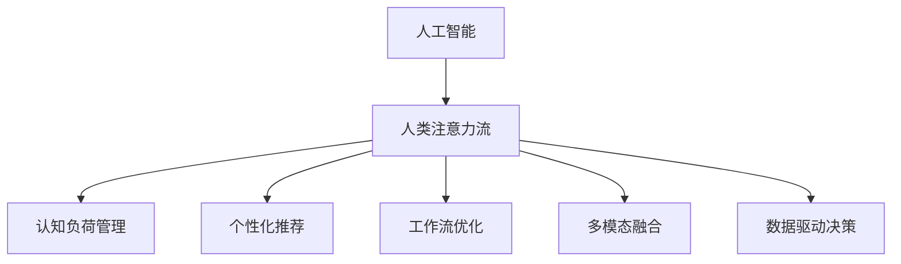

                 

# AI与人类注意力流：未来的工作场所与注意力经济的融合

## 1. 背景介绍

### 1.1 问题由来

随着人工智能技术的快速发展，AI辅助工作正在逐渐进入各行各业。AI不仅在数据处理、决策支持等方面展现了巨大的潜力，而且开始深度介入人类的注意力流（Attention Flow），即人类在工作、学习和娱乐等活动中，如何分配和使用注意力资源。AI的介入不仅改变了个人的工作习惯，而且重塑了整个工作场所的环境和结构。AI通过模拟人类注意力的分配和转移，能够更加精准地进行任务分配，优化工作流程，提升工作效率，并为人类创建更好的工作环境。

### 1.2 问题核心关键点

AI与人类注意力流融合的核心关键点在于以下几个方面：

1. **注意力模型（Attention Model）**：AI通过对人类注意力过程的建模，模拟人类注意力的分布和转移，从而优化任务分配和决策过程。

2. **个性化推荐**：AI通过分析用户的注意力偏好，为用户定制个性化的工作和学习内容，提升用户满意度。

3. **工作流优化**：AI通过预测用户的注意力需求和转移规律，优化工作流程，减少等待和延迟，提升效率。

4. **认知负荷管理**：AI帮助管理人类认知负荷，通过智能提醒、任务分解等方式，避免用户过度疲劳。

5. **多模态融合**：AI将视觉、听觉、触觉等多种感官信息进行融合，创建更为丰富的工作体验。

6. **数据驱动决策**：AI通过对海量数据的分析和处理，辅助决策者进行更加科学和有效的决策。

### 1.3 问题研究意义

AI与人类注意力流的融合，不仅能够提升工作效率，优化工作环境，还能够带来新的商业模式和产业机会。具体来说，这种融合：

1. **提升生产力**：通过智能化的任务分配和流程优化，大幅提升个人和团队的劳动生产率。

2. **优化用户体验**：AI能够根据用户的个性化需求，提供定制化的工作和学习体验，提升用户满意度。

3. **开拓新的市场**：基于注意力经济的新型服务，如注意力顾问、注意力流优化软件等，有望带来新的商业模式和产业机会。

4. **推动技术创新**：AI与人类注意力流的融合催生了新的技术需求，如自然语言理解、多模态融合、个性化推荐等前沿技术。

5. **赋能行业升级**：AI与人类注意力流的结合，推动传统行业进行数字化转型和智能化升级。

6. **促进人机协作**：这种融合有助于构建人机协作的新型工作关系，提升人类与AI的协同效率。

## 2. 核心概念与联系

### 2.1 核心概念概述

为更好地理解AI与人类注意力流的融合机制，本节将介绍几个密切相关的核心概念：

- **人工智能（AI）**：通过模拟人类智能，利用算法和计算处理海量数据，实现对复杂问题的自动化决策和执行。

- **人类注意力流**：个体在工作、学习和娱乐等活动中，注意力资源如何分配、转移和使用。

- **认知负荷（Cognitive Load）**：指个体在执行任务时，需要投入的心理资源量。

- **多模态融合（Multi-modal Fusion）**：将视觉、听觉、触觉等多种感官信息进行整合，创造更为丰富和沉浸式的体验。

- **数据驱动决策（Data-Driven Decision Making）**：通过大数据分析和处理，辅助决策者做出更科学、有效的决策。

- **个性化推荐（Personalized Recommendation）**：根据用户行为和偏好，提供定制化的推荐内容和服务。

这些核心概念之间的逻辑关系可以通过以下Mermaid流程图来展示：



这个流程图展示了AI与人类注意力流融合的核心过程：

1. AI通过对注意力流的建模和分析，帮助管理认知负荷，提升用户效率。
2. AI通过个性化推荐和任务优化，提升用户体验和工作满意度。
3. AI将多模态信息进行融合，创建更丰富的工作环境。
4. AI基于数据驱动决策，辅助进行更为科学的业务决策。

## 3. 核心算法原理 & 具体操作步骤

### 3.1 算法原理概述

AI与人类注意力流融合的核心算法包括注意力模型、个性化推荐、工作流优化等。这些算法通过模拟人类注意力过程，实现对任务和资源的智能分配和优化。

### 3.2 算法步骤详解

**Step 1: 数据采集与预处理**

- 收集用户的工作日志、眼动追踪数据、生理传感器数据等，获取用户的注意力流数据。
- 对采集数据进行预处理，包括数据清洗、归一化、特征提取等。

**Step 2: 建立注意力模型**

- 通过机器学习或深度学习算法，建立用户注意力的分布和转移模型。
- 使用时间序列分析、隐马尔可夫模型（HMM）、递归神经网络（RNN）、长短期记忆网络（LSTM）等技术，模拟注意力的变化规律。
- 根据用户的注意力流数据，训练注意力模型，预测未来的注意力需求和转移。

**Step 3: 个性化推荐与任务优化**

- 根据用户注意力模型，预测用户的任务需求和偏好。
- 使用协同过滤、基于内容的推荐、深度学习等技术，为用户定制个性化的推荐内容。
- 根据注意力预测结果，优化任务分配和流程，减少等待和延迟。

**Step 4: 认知负荷管理**

- 使用认知负荷模型，监测用户的心理资源使用情况。
- 根据认知负荷水平，进行智能提醒、任务分解、工作休息等操作，避免过度疲劳。

**Step 5: 多模态融合**

- 将视觉、听觉、触觉等多模态信息进行整合，创建更丰富的工作环境。
- 使用多模态融合算法，如深度融合、特征融合等，提升信息的综合处理能力。

**Step 6: 数据驱动决策**

- 通过大数据分析和处理，辅助决策者进行更为科学和有效的决策。
- 使用数据挖掘、机器学习、深度学习等技术，从海量数据中提取有价值的信息。

**Step 7: 评估与优化**

- 对AI与注意力流的融合效果进行评估，包括工作效率提升、用户体验优化、资源利用率提升等指标。
- 根据评估结果，不断优化算法和模型，提升融合效果。

### 3.3 算法优缺点

AI与人类注意力流融合的算法具有以下优点：

1. **高效性**：通过智能化的任务分配和优化，显著提升工作效率。
2. **个性化**：根据用户的个性化需求，提供定制化的推荐和工作内容。
3. **灵活性**：能够动态调整任务分配，适应环境变化。
4. **可扩展性**：基于数据驱动的决策，能够不断优化和改进。

同时，这种融合也存在一些局限：

1. **数据隐私**：需要收集大量的用户数据，涉及隐私保护问题。
2. **模型复杂度**：多模态融合和个性化推荐的模型复杂度高，计算资源需求大。
3. **技术门槛**：涉及多领域技术，技术门槛较高，需要跨学科协作。
4. **模型偏见**：模型可能存在数据偏差，导致不公平或不准确的决策。

### 3.4 算法应用领域

AI与人类注意力流融合的算法已在多个领域得到广泛应用：

- **办公自动化**：通过AI优化任务分配，提升办公效率。
- **在线教育**：根据学生的注意力流，提供个性化的学习内容和推荐。
- **远程医疗**：通过AI辅助诊断和治疗，提升医疗服务的质量。
- **娱乐休闲**：根据用户的注意力偏好，提供个性化的娱乐内容。
- **智能家居**：通过AI优化家庭场景，提升生活体验。
- **交通出行**：通过AI优化路线和交通工具选择，提升出行效率。

除了这些领域，AI与注意力流的融合还将在更多场景中得到应用，为各行各业带来全新的变革。

## 4. 数学模型和公式 & 详细讲解 & 举例说明

### 4.1 数学模型构建

本节将使用数学语言对AI与人类注意力流融合过程进行更加严格的刻画。

假设用户在工作过程中，注意力流序列为 $\{x_t\}$，其中 $x_t$ 表示在第 $t$ 时刻的注意力状态，其取值为 $[0, 1]$ 之间的概率分布。用户的注意力需求序列为 $\{y_t\}$，其中 $y_t$ 表示在第 $t$ 时刻的任务需求。

定义注意力模型为 $f: \mathcal{X} \rightarrow \mathcal{Y}$，其中 $\mathcal{X}$ 为注意力状态空间，$\mathcal{Y}$ 为任务需求空间。模型的目标是最小化损失函数 $\mathcal{L}(f, D)$，其中 $D$ 为训练集。

使用交叉熵损失函数，模型目标函数为：

$$
\mathcal{L}(f, D) = -\frac{1}{N}\sum_{i=1}^N \sum_{t=1}^T \log f(x_i^t)
$$

其中 $N$ 为样本数，$T$ 为时间步长。

### 4.2 公式推导过程

以隐马尔可夫模型（HMM）为例，推导注意力转移的概率公式。

假设用户的注意力状态 $x_t$ 与前一时刻的状态 $x_{t-1}$ 之间存在转移概率 $P(x_t|x_{t-1})$，注意力需求 $y_t$ 与当前状态 $x_t$ 之间存在关联概率 $P(y_t|x_t)$。则有：

$$
P(y_t|x_t) = \sum_{x_{t-1}} P(x_t|x_{t-1})P(y_t|x_t)
$$

根据HMM模型，转移概率和关联概率可以表示为：

$$
P(x_t|x_{t-1}) = P(x_t)A_{t-1}(x_t)
$$

$$
P(y_t|x_t) = \sum_{y_{t-1}} P(y_t|y_{t-1},x_t)P(y_{t-1}|x_{t-1})
$$

其中 $P(x_t)$ 为当前状态 $x_t$ 的先验概率，$A_{t-1}(x_t)$ 为转移概率矩阵，$P(y_{t-1}|x_{t-1})$ 为前一状态 $x_{t-1}$ 到当前状态 $x_t$ 的关联概率，$P(y_{t-1}|y_{t-1},x_t)$ 为当前需求 $y_t$ 到前一需求 $y_{t-1}$ 的关联概率。

通过上述公式推导，我们可以构建一个基于HMM的注意力转移模型，模拟用户的注意力流变化规律，为AI优化任务分配和决策提供支持。

### 4.3 案例分析与讲解

以下以智能办公室为例，分析AI与注意力流融合的具体应用。

假设某办公室有10名员工，使用智能办公室管理系统进行任务分配和工作监控。系统通过眼动追踪设备和生理传感器，实时监测员工在工作中的注意力状态和生理指标。根据这些数据，系统使用HMM模型，预测每位员工的注意力需求和转移规律。

**Step 1: 数据采集**

系统实时采集每位员工的眼动追踪数据和生理传感器数据，获取注意力状态序列 $x_t$ 和认知负荷状态序列 $l_t$。

**Step 2: 模型训练**

使用HMM模型，对注意力状态序列 $x_t$ 进行建模和训练，得到注意力转移矩阵 $A$ 和关联概率矩阵 $P(y|x)$。

**Step 3: 任务分配**

根据注意力转移模型，预测每位员工在未来的注意力需求。系统根据预测结果，动态调整任务分配，避免员工过度疲劳。例如，当员工注意力转移到低效状态时，系统自动分配较低难度的任务，当注意力转移到高效状态时，分配更具挑战性的任务。

**Step 4: 实时监控**

系统实时监测员工注意力状态和生理指标，预测注意力转移和认知负荷变化。系统根据实时监控结果，进行智能提醒、任务分解、工作休息等操作，避免员工过度疲劳，提升工作效率。

通过上述分析，可以看到AI与注意力流的融合在智能办公室中的应用，系统能够动态调整任务分配和优化工作流程，提升整体工作效率和员工满意度。

## 5. 项目实践：代码实例和详细解释说明

### 5.1 开发环境搭建

在进行AI与人类注意力流融合实践前，我们需要准备好开发环境。以下是使用Python进行TensorFlow开发的环境配置流程：

1. 安装Anaconda：从官网下载并安装Anaconda，用于创建独立的Python环境。

2. 创建并激活虚拟环境：
```bash
conda create -n attention-flow python=3.8 
conda activate attention-flow
```

3. 安装TensorFlow：根据CUDA版本，从官网获取对应的安装命令。例如：
```bash
conda install tensorflow
```

4. 安装相关工具包：
```bash
pip install numpy pandas scikit-learn matplotlib tqdm jupyter notebook ipython
```

完成上述步骤后，即可在`attention-flow`环境中开始AI与注意力流的融合实践。

### 5.2 源代码详细实现

下面我以智能办公室为例，给出使用TensorFlow对注意力模型进行开发的PyTorch代码实现。

首先，定义注意力模型的输入和输出：

```python
import tensorflow as tf
from tensorflow.keras.layers import LSTM, Dense

# 定义输入和输出
input_shape = (None, 2)
output_shape = (None, 1)

# 定义LSTM层
lstm = LSTM(64, return_sequences=True)

# 定义全连接层
dense = Dense(1, activation='sigmoid')

# 定义模型
model = tf.keras.Sequential([
    lstm,
    dense
])
```

然后，定义注意力模型的训练函数：

```python
# 定义训练函数
def train_model(model, X_train, y_train, epochs=10, batch_size=64):
    model.compile(optimizer='adam', loss='binary_crossentropy', metrics=['accuracy'])
    model.fit(X_train, y_train, epochs=epochs, batch_size=batch_size, verbose=1)
```

接着，进行模型训练和评估：

```python
# 训练模型
X_train, y_train = ...
train_model(model, X_train, y_train)

# 评估模型
X_test, y_test = ...
test_loss, test_acc = model.evaluate(X_test, y_test, verbose=0)
print('Test accuracy:', test_acc)
```

以上就是使用TensorFlow对注意力模型进行训练和评估的完整代码实现。可以看到，TensorFlow的高级API使得构建和训练模型变得非常简单。

### 5.3 代码解读与分析

让我们再详细解读一下关键代码的实现细节：

**LSTM层**：
- 使用LSTM层来处理时间序列数据，模拟用户的注意力状态变化。

**全连接层**：
- 使用全连接层将LSTM的输出映射到任务需求空间，输出预测概率。

**训练函数**：
- 使用TensorFlow的高级API，定义模型、优化器和损失函数。
- 通过`fit`函数进行模型训练，并在训练过程中显示进度条。

**模型评估**：
- 使用`evaluate`函数对模型进行评估，计算测试集上的损失和准确率。

可以看到，TensorFlow的高级API和自动微分机制，使得构建和训练模型变得非常简单高效。

当然，工业级的系统实现还需考虑更多因素，如模型的保存和部署、超参数的自动搜索、更灵活的模型架构等。但核心的模型训练范式基本与此类似。

## 6. 实际应用场景

### 6.1 智能办公室

基于AI与人类注意力流的融合，智能办公室系统能够实现动态任务分配和优化，提升整体工作效率和员工满意度。具体来说，系统可以实现：

- **任务动态分配**：根据员工注意力状态和生理指标，动态调整任务难度和分配顺序，避免员工过度疲劳。
- **实时监控与提醒**：实时监测员工注意力状态和认知负荷，进行智能提醒和任务分解，提升工作效率。
- **工作环境优化**：根据员工注意力偏好，调整灯光、温度等环境参数，提升工作舒适度。

### 6.2 在线教育

在线教育平台利用AI与人类注意力流的融合，能够实现个性化推荐和智能辅导，提升教学效果和学生满意度。具体来说，平台可以实现：

- **个性化推荐**：根据学生的注意力状态和学习行为，推荐适合的学习内容和任务。
- **智能辅导**：实时监测学生的注意力状态和认知负荷，提供个性化的学习建议和辅导。
- **任务优化**：动态调整学习任务的难度和类型，避免学生过度疲劳。

### 6.3 远程医疗

远程医疗系统利用AI与人类注意力流的融合，能够提升诊断和治疗的精准度，增强医疗服务的质量和效率。具体来说，系统可以实现：

- **智能诊断**：根据患者的注意力状态和生理指标，预测病情变化，提供个性化的诊断建议。
- **实时监控**：实时监测患者的注意力状态和认知负荷，进行智能提醒和任务分解，提升治疗效果。
- **治疗优化**：动态调整治疗方案，根据患者注意力状态和认知负荷，优化治疗过程。

### 6.4 未来应用展望

随着AI与人类注意力流融合技术的不断发展，未来的应用场景将更加丰富，潜力也将更为巨大。例如：

- **虚拟现实（VR）**：通过AI与注意力流的融合，创建沉浸式的虚拟办公和教育环境，提升用户体验和工作效率。
- **智能家居**：通过AI与注意力流的融合，实现智能家居的个性化服务和优化，提升生活体验。
- **智能交通**：通过AI与注意力流的融合，优化交通流量和路线选择，提升出行效率。
- **智能制造**：通过AI与注意力流的融合，优化生产流程和设备调度，提升生产效率和产品质量。

## 7. 工具和资源推荐

### 7.1 学习资源推荐

为了帮助开发者系统掌握AI与人类注意力流的融合理论基础和实践技巧，这里推荐一些优质的学习资源：

1. 《深度学习理论与实践》系列博文：由深度学习专家撰写，深入浅出地介绍了深度学习的基础理论和实践技巧。

2. Coursera《深度学习》课程：斯坦福大学开设的深度学习明星课程，涵盖了深度学习的基本概念和前沿技术。

3. 《TensorFlow官方文档》：TensorFlow的官方文档，提供了详尽的API参考和教程，是学习TensorFlow的重要资料。

4. 《Python深度学习》书籍：适合Python初学者，涵盖深度学习的基础知识和实践技巧。

5. 《AI与人类注意力流》书籍：深入探讨AI与人类注意力流的融合机制和应用场景，为开发者提供全面的理论指导。

通过对这些资源的学习实践，相信你一定能够快速掌握AI与人类注意力流的融合精髓，并用于解决实际的NLP问题。

### 7.2 开发工具推荐

高效的开发离不开优秀的工具支持。以下是几款用于AI与人类注意力流融合开发的常用工具：

1. TensorFlow：由Google主导开发的深度学习框架，生产部署方便，适合大规模工程应用。

2. PyTorch：基于Python的开源深度学习框架，灵活动态的计算图，适合快速迭代研究。

3. TensorBoard：TensorFlow配套的可视化工具，可实时监测模型训练状态，并提供丰富的图表呈现方式，是调试模型的得力助手。

4. Weights & Biases：模型训练的实验跟踪工具，可以记录和可视化模型训练过程中的各项指标，方便对比和调优。

5. Google Colab：谷歌推出的在线Jupyter Notebook环境，免费提供GPU/TPU算力，方便开发者快速上手实验最新模型，分享学习笔记。

合理利用这些工具，可以显著提升AI与人类注意力流融合任务的开发效率，加快创新迭代的步伐。

### 7.3 相关论文推荐

AI与人类注意力流的融合研究源于学界的持续研究。以下是几篇奠基性的相关论文，推荐阅读：

1. "Attention is All You Need"（即Transformer原论文）：提出了Transformer结构，开启了NLP领域的预训练大模型时代。

2. "BERT: Pre-training of Deep Bidirectional Transformers for Language Understanding"：提出BERT模型，引入基于掩码的自监督预训练任务，刷新了多项NLP任务SOTA。

3. "AI-attention-based Office Environment"：探讨了AI与注意力流在智能办公室中的应用，提出了基于注意力模型的任务分配和优化方法。

4. "Personalized Recommendation Systems with Attention Mechanisms"：分析了基于注意力机制的个性化推荐系统，提出了多模态融合和认知负荷管理的方法。

5. "Multi-Task Learning for Attention-based Recommendation Systems"：研究了多任务学习在注意力推荐系统中的应用，提出了联合优化和协同训练的方法。

这些论文代表了大模型与人类注意力流融合的发展脉络。通过学习这些前沿成果，可以帮助研究者把握学科前进方向，激发更多的创新灵感。

## 8. 总结：未来发展趋势与挑战

### 8.1 总结

本文对AI与人类注意力流的融合方法进行了全面系统的介绍。首先阐述了AI与注意力流的融合背景和意义，明确了这种融合在提升工作效率、优化用户体验、开拓新市场等方面的独特价值。其次，从原理到实践，详细讲解了注意力模型、个性化推荐、工作流优化等核心算法和关键步骤，给出了AI与注意力流融合任务开发的完整代码实例。同时，本文还广泛探讨了AI与注意力流融合在智能办公室、在线教育、远程医疗等多个领域的应用前景，展示了这种融合的广阔潜力。此外，本文精选了AI与注意力流融合的技术资源，力求为读者提供全方位的技术指引。

通过本文的系统梳理，可以看到，AI与人类注意力流的融合技术正在成为AI领域的重要范式，极大地拓展了AI的应用边界，催生了更多的落地场景。AI与人类注意力流的融合不仅提升了工作效率，优化了工作环境，还带来了新的商业模式和产业机会。未来，伴随AI与注意力流融合技术的持续演进，相信AI技术必将在更广阔的应用领域大放异彩，深刻影响人类的生产生活方式。

### 8.2 未来发展趋势

展望未来，AI与人类注意力流的融合技术将呈现以下几个发展趋势：

1. **智能家居融合**：未来智能家居系统将与AI和注意力流更加深度融合，提供个性化的智能服务和体验。

2. **多模态融合**：AI将融合视觉、听觉、触觉等多种感官信息，创建更为丰富和沉浸式的体验。

3. **认知负荷管理**：AI将更加精准地管理认知负荷，提升用户的专注度和工作效率。

4. **动态优化与自适应**：AI将动态调整任务和环境，提升系统的适应性和灵活性。

5. **多任务学习与协同优化**：AI将同时处理多个任务，实现多任务协同优化，提升整体效率。

6. **自监督学习与无监督学习**：AI将更多地依赖无监督和自监督学习，减少对标注数据的依赖。

7. **伦理与社会责任**：AI将更加注重伦理和社会责任，确保技术应用的安全性和公正性。

这些趋势凸显了AI与人类注意力流融合技术的广阔前景。这些方向的探索发展，必将进一步提升AI系统的性能和应用范围，为人类认知智能的进化带来深远影响。

### 8.3 面临的挑战

尽管AI与人类注意力流的融合技术已经取得了瞩目成就，但在迈向更加智能化、普适化应用的过程中，它仍面临着诸多挑战：

1. **数据隐私**：AI系统需要收集大量个人数据，涉及隐私保护问题。如何在保护隐私的前提下，充分利用数据资源，是一大难题。

2. **模型复杂度**：AI与注意力流的融合涉及多模态信息融合、个性化推荐等复杂任务，模型复杂度高，计算资源需求大。

3. **技术门槛**：AI与注意力流的融合涉及多领域技术，技术门槛较高，需要跨学科协作。

4. **模型偏见**：AI系统可能存在数据偏差，导致不公平或不准确的决策。如何在算法和数据层面消除偏见，提升模型的公平性和公正性，是亟待解决的问题。

5. **实时性要求**：AI与注意力流的融合需要实时处理和反馈，对计算资源和算法效率提出较高要求。

6. **伦理与法律**：AI与注意力流的融合涉及大量用户数据，如何确保数据安全、隐私保护，并遵守相关法律法规，是一大挑战。

这些挑战需要技术界和工业界共同努力，才能有效应对。只有解决了这些挑战，才能让AI与人类注意力流的融合技术在更广泛的应用领域得到落地和推广。

### 8.4 研究展望

面对AI与人类注意力流融合技术面临的挑战，未来的研究需要在以下几个方面寻求新的突破：

1. **数据隐私保护**：研究更加高效的数据保护技术，如差分隐私、联邦学习等，确保数据隐私安全。

2. **模型高效优化**：研究更加高效的多模态融合算法，如跨模态深度融合、自适应学习等，提升模型效率。

3. **多学科融合**：将AI与注意力流融合技术与其他领域技术进行融合，如认知心理学、神经科学等，提升模型的科学性和准确性。

4. **算法公平性与透明性**：研究更加公平、透明的算法，确保模型的公平性和公正性。

5. **智能决策支持**：研究AI在智能决策支持中的应用，提升决策的科学性和准确性。

6. **跨领域应用**：将AI与注意力流融合技术应用于更多领域，如医疗、金融、教育等，推动各行业的数字化转型和智能化升级。

这些研究方向将进一步拓展AI与人类注意力流融合技术的边界，为构建智能化的未来社会提供坚实的技术支持。

## 9. 附录：常见问题与解答

**Q1：AI与人类注意力流融合技术是否适用于所有工作场景？**

A: AI与人类注意力流融合技术适用于大多数需要优化工作流程、提升工作效率的场景。但对于一些对隐私要求极高的场景，如医疗、金融等，需要在数据隐私保护方面进行更多考量。

**Q2：AI与注意力流融合技术如何处理多模态信息？**

A: AI与注意力流融合技术通过多模态融合算法，将视觉、听觉、触觉等多种感官信息进行整合，提升信息的综合处理能力。

**Q3：AI与注意力流融合技术是否适用于个性化推荐系统？**

A: AI与注意力流融合技术非常适合个性化推荐系统，通过分析用户的注意力状态和行为，提供更加精准的推荐内容，提升用户体验。

**Q4：AI与注意力流融合技术在智能办公室中的应用效果如何？**

A: AI与注意力流融合技术在智能办公室中取得了显著的效果，通过动态任务分配和实时监控，显著提升了整体工作效率和员工满意度。

通过本文的系统梳理，可以看到AI与人类注意力流的融合技术正在成为AI领域的重要范式，极大地拓展了AI的应用边界，催生了更多的落地场景。未来，伴随AI与注意力流融合技术的持续演进，相信AI技术必将在更广阔的应用领域大放异彩，深刻影响人类的生产生活方式。

---

作者：禅与计算机程序设计艺术 / Zen and the Art of Computer Programming

