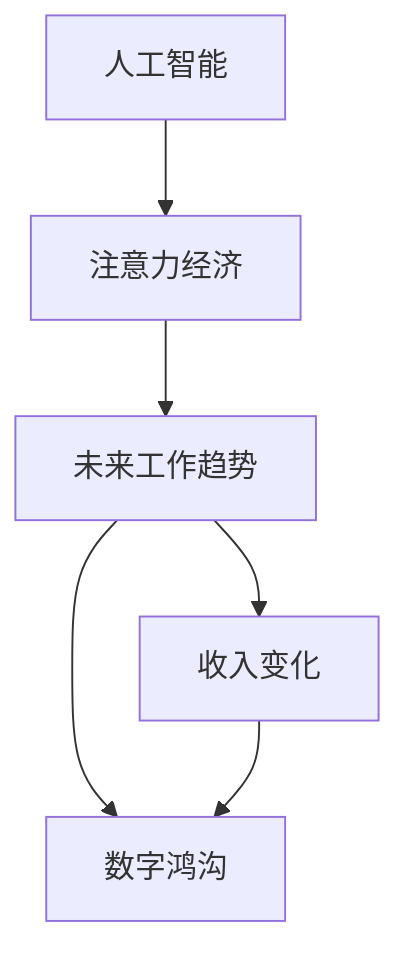

                 

# AI与人类注意力经济：未来的工作和收入

> 关键词：人工智能,人类注意力经济,未来工作趋势,收入变化,数字鸿沟

## 1. 背景介绍

### 1.1 问题由来
在21世纪，人工智能(AI)技术迅速发展，正深刻地改变着人类社会的生产方式和职业结构。特别是近年来的深度学习、自然语言处理和计算机视觉等技术，已经广泛应用于各行各业。与此同时，AI的崛起也引发了人们对未来工作岗位变化和收入分配的广泛担忧。

随着AI技术的渗透，越来越多的传统岗位被自动化、智能化工具取代。比如制造业的自动化生产线、金融业的算法交易系统、医疗业的智能诊断设备，以及客服、广告、物流等领域的机器人客服和物流自动化。这些变革不仅影响了就业市场，也带来了收入结构的变化。

### 1.2 问题核心关键点
AI的崛起使得高技能劳动力需求增加，低技能劳动力需求减少，导致劳动力市场两极化加剧。尤其是对于简单重复性工作，AI的效率远超人类，使得这些岗位逐渐被替代。而高技能岗位则需要不断学习新知识、新技能，以适应AI技术的发展。

AI对职业的影响具有双重性：一方面，它创造了新的工作机会，提升了工作效率；另一方面，也带来了工作岗位的减少和收入分配的不平等。因此，如何应对AI技术带来的职业变革，是当前和未来社会需要关注的重要问题。

### 1.3 问题研究意义
研究AI对人类注意力经济的影响，对于理解未来工作趋势、预测收入变化、制定合理的政策法规具有重要意义：

1. **理解未来工作趋势**：掌握AI技术对职业结构的冲击，帮助政府和企业提前布局，培养符合未来需求的劳动力。
2. **预测收入变化**：分析AI对工资分布的影响，为收入分配政策提供数据支持。
3. **制定政策法规**：基于对未来工作的预测，制定有针对性的教育和培训计划，缩小收入差距。
4. **促进技术公平**：通过技术赋能，推动AI技术的普惠应用，减少数字鸿沟，提升全民福祉。
5. **促进经济增长**：通过AI技术提高生产效率，创造更多高附加值的工作岗位，推动经济持续增长。

## 2. 核心概念与联系

### 2.1 核心概念概述

为了更好地理解AI与人类注意力经济的关系，本节将介绍几个关键概念：

- **人工智能(Artificial Intelligence, AI)**：一种通过模拟人类智能行为，使计算机系统具备自主学习、推理、感知等能力的技术。AI技术包括机器学习、深度学习、自然语言处理等。

- **人类注意力经济(Attention Economy)**：在数字时代，人们通过消费各种注意力资源（如视频、音乐、社交媒体等）来获得信息和娱乐。注意力经济是指以注意力为生产要素，通过满足用户需求来获取收益的经济形态。

- **未来工作趋势(Future of Work)**：随着AI技术的发展，传统岗位的消失和新岗位的诞生，未来工作趋势呈现出的新特征和变化规律。

- **收入变化(Income Change)**：AI对就业市场的影响导致的工资分布变化，包括收入差距的扩大、高技能岗位的收入提升等。

- **数字鸿沟(Digital Divide)**：由于技术普及和应用的不平衡，导致不同群体在获取信息和资源上的差距。

这些核心概念之间的逻辑关系可以通过以下Mermaid流程图来展示：



这个流程图展示了AI技术如何通过改变人类注意力经济模式，进而影响未来工作趋势和收入分配，并加剧数字鸿沟。

## 3. 核心算法原理 & 具体操作步骤

### 3.1 算法原理概述

AI与人类注意力经济的交互，本质上是一个信息传递和转换的过程。AI通过算法处理数据，提取信息，进而生成内容和推荐，以满足人类的注意力需求。同时，人类的注意力反馈也会影响AI的学习和优化，形成一种动态平衡。

### 3.2 算法步骤详解

AI与人类注意力经济交互的算法步骤主要包括：

1. **数据采集**：AI系统通过传感器、用户交互等方式，采集用户的数据，如浏览记录、消费习惯、偏好等。

2. **特征提取**：AI系统通过算法对采集的数据进行特征提取，生成用户的注意力特征向量，如兴趣点、行为模式等。

3. **内容生成与推荐**：AI系统利用机器学习模型，如神经网络、协同过滤等，生成内容并推荐给用户。推荐系统能够预测用户对内容的兴趣，提高用户体验和满意度。

4. **用户反馈收集**：用户通过评分、评论、点击等行为反馈，对推荐内容进行评价。这些反馈信息被用于训练和优化AI系统。

5. **模型更新与优化**：AI系统根据用户反馈，调整模型参数，优化推荐算法，提高内容的精准性和个性化程度。

### 3.3 算法优缺点

AI与人类注意力经济的交互算法具有以下优点：

- **高效性**：AI能够快速处理大量数据，生成个性化内容，提升用户体验。
- **精准性**：AI通过机器学习算法，能够精准预测用户兴趣，提供相关性高的内容。
- **可扩展性**：AI技术可以应用于各类注意力经济平台，如社交媒体、电商平台、视频网站等。

但同时，该算法也存在以下缺点：

- **依赖数据**：AI算法的性能高度依赖于数据的质量和多样性，数据的偏差可能导致不公平推荐。
- **隐私风险**：用户数据的采集和处理涉及隐私问题，需要严格的数据保护和监管。
- **算法偏见**：AI系统可能会继承训练数据的偏见，导致对某些群体的不公平待遇。
- **人机交互局限**：AI推荐内容的个性化可能导致信息茧房，限制用户的知识获取范围。

### 3.4 算法应用领域

AI与人类注意力经济的交互算法已经在多个领域得到了广泛应用，包括但不限于：

- **电子商务**：如淘宝、京东等电商平台，通过推荐系统提升用户购物体验，增加交易量。
- **社交媒体**：如微信、微博等平台，利用AI生成个性化内容，增强用户黏性。
- **视频网站**：如Netflix、爱奇艺等，推荐系统根据用户观看历史，推荐相关视频内容。
- **新闻资讯**：如今日头条、新浪新闻等，通过推荐系统展示个性化新闻，提升阅读量。
- **广告投放**：如Google Ads、百度推广等，根据用户行为精准投放广告，提高转化率。

## 4. 数学模型和公式 & 详细讲解 & 举例说明

### 4.1 数学模型构建

本节将使用数学语言对AI与人类注意力经济交互的算法进行严格的数学建模。

假设用户i对内容j的兴趣度为$A_{ij}$，其取值范围为$[0,1]$，1表示非常感兴趣，0表示不感兴趣。用户对内容的兴趣度可以表示为：

$$
A_{ij} = f(\text{features}_{ij}, \theta)
$$

其中，$\text{features}_{ij}$为内容j对用户i的特征向量，$\theta$为模型参数。模型$f$可以是线性模型、逻辑回归模型、神经网络等。

假设AI推荐系统有$m$个内容，用户有$n$个，用户对内容的评分$R_{ij}$为：

$$
R_{ij} = A_{ij} + \epsilon
$$

其中$\epsilon$为随机误差项。用户对推荐系统的评分$R_{ui}$为：

$$
R_{ui} = \frac{1}{m}\sum_{j=1}^{m}R_{ij}
$$

### 4.2 公式推导过程

对于每个用户i，AI系统通过最小化预测误差$E$来优化推荐模型：

$$
E = \frac{1}{N}\sum_{i=1}^{N}\sum_{j=1}^{m}(R_{ij} - A_{ij})^2
$$

其中$N$为用户数量。为了最小化$E$，需要通过梯度下降法求解$\theta$：

$$
\frac{\partial E}{\partial \theta} = 0
$$

得到参数$\theta$的更新公式：

$$
\theta \leftarrow \theta - \eta \frac{\partial E}{\partial \theta}
$$

其中$\eta$为学习率。

### 4.3 案例分析与讲解

假设用户i对内容j的兴趣度$A_{ij}$可以表示为：

$$
A_{ij} = \beta_0 + \sum_{k=1}^{K}\beta_k x_{ik}
$$

其中$x_{ik}$为特征向量$\text{features}_{ij}$的第$k$个特征，$\beta_k$为对应特征的权重。

通过矩阵乘法，可以表示为：

$$
A_{ij} = [1, x_{i1}, x_{i2}, \cdots, x_{iK}] \beta
$$

其中$\beta$为权重向量。

对于推荐系统，可以通过矩阵分解的方法，将其表示为：

$$
R_{ui} = \text{Sigmod}(\beta^T \text{features}_{ui})
$$

其中$\text{Sigmod}$为逻辑回归函数。

## 5. 项目实践：代码实例和详细解释说明

### 5.1 开发环境搭建

在进行AI与人类注意力经济的交互算法开发前，我们需要准备好开发环境。以下是使用Python进行Scikit-learn开发的Python环境配置流程：

1. 安装Anaconda：从官网下载并安装Anaconda，用于创建独立的Python环境。

2. 创建并激活虚拟环境：
```bash
conda create -n attention-env python=3.8 
conda activate attention-env
```

3. 安装Scikit-learn和其他相关库：
```bash
conda install scikit-learn
conda install pandas matplotlib seaborn jupyter notebook ipython
```

4. 安装TensorFlow和Keras（可选）：
```bash
conda install tensorflow
conda install keras
```

5. 安装相关依赖库：
```bash
conda install numpy scipy stats joblib pycparser cython packaging protobuf typing extensions Cython
```

完成上述步骤后，即可在`attention-env`环境中开始实践。

### 5.2 源代码详细实现

以下是一个简单的推荐系统实现，使用Scikit-learn库的协同过滤算法，来预测用户对内容的评分。

```python
from sklearn.metrics.pairwise import cosine_similarity
from sklearn.decomposition import TruncatedSVD
from sklearn.feature_extraction.text import TfidfVectorizer

def similarity_recommender(train_data, user_id, n_recommends=5):
    # 将文本数据转换为特征向量
    tfidf_vectorizer = TfidfVectorizer()
    train_tfidf = tfidf_vectorizer.fit_transform(train_data)
    
    # 计算用户与内容的相似度
    user_sims = cosine_similarity(train_tfidf[user_id], train_tfidf).flatten()
    
    # 选择最相似的内容
    recommends = np.argsort(user_sims)[-n_recommends:]
    
    # 返回推荐内容
    return train_data.iloc[recommends]
```

### 5.3 代码解读与分析

让我们再详细解读一下关键代码的实现细节：

**similarity_recommender函数**：
- `train_data`参数：训练数据，为一个包含用户ID和内容ID的列表。
- `user_id`参数：目标用户ID。
- `n_recommends`参数：推荐数量，默认为5。
- `TfidfVectorizer`类：将文本转换为TF-IDF特征向量。
- `cosine_similarity`函数：计算两个向量之间的余弦相似度。
- `argsort`函数：对相似度数组排序，返回最相似的元素索引。
- `iloc`方法：根据索引返回数据帧中指定行的数据。

**实现流程**：
1. 使用`TfidfVectorizer`将训练数据转换为TF-IDF特征向量。
2. 计算目标用户与所有内容的相似度，并返回最相似的元素索引。
3. 根据索引返回推荐内容。

可以看到，Scikit-learn库的协同过滤算法实现非常简单，便于理解和扩展。

当然，工业级的系统实现还需考虑更多因素，如模型的保存和部署、超参数的自动搜索、更灵活的推荐算法等。但核心的交互范式基本与此类似。

## 6. 实际应用场景

### 6.1 智能推荐系统

AI与人类注意力经济的交互算法在智能推荐系统中的应用最为广泛。电商平台、视频网站、新闻APP等，都利用推荐系统提升用户体验，增加交易量。

在技术实现上，推荐系统可以根据用户的历史行为数据，生成个性化推荐列表。通过引入深度学习算法，如神经网络、深度矩阵分解等，可以进一步提升推荐的精准性和个性化程度。

### 6.2 广告投放优化

AI与人类注意力经济的交互算法在广告投放优化中也有重要应用。通过分析用户行为数据，AI可以预测用户对广告的兴趣，从而优化广告投放策略，提高广告效果。

在实际应用中，可以使用点击率预测、转化率预测等模型，对用户进行精准投放。同时，还可以结合行为数据分析，调整广告创意和投放时间，提升广告回报率。

### 6.3 内容生成与自动写作

AI与人类注意力经济的交互算法还可以用于内容生成和自动写作。通过分析用户对不同内容的兴趣，AI可以生成个性化的文章、新闻、评论等。

在新闻网站、博客平台、社交媒体等场景中，AI可以生成与用户兴趣相关的文章内容，提升用户阅读体验。同时，AI还可以自动化生成评论、回答等互动内容，提升平台活跃度。

## 7. 工具和资源推荐

### 7.1 学习资源推荐

为了帮助开发者系统掌握AI与人类注意力经济的交互算法，这里推荐一些优质的学习资源：

1. 《机器学习基础》课程：由斯坦福大学提供，系统介绍了机器学习的基本概念和常用算法。
2. 《深度学习》课程：由Coursera提供，详细讲解了深度学习的基本原理和应用。
3. 《自然语言处理》课程：由Coursera提供，讲解了自然语言处理的基本概念和常用技术。
4. 《推荐系统》课程：由UCLA提供，讲解了推荐系统的工作原理和优化方法。
5. 《人工智能伦理》课程：由Coursera提供，讲解了AI伦理的基本概念和相关法规。

通过对这些资源的学习实践，相信你一定能够快速掌握AI与人类注意力经济的交互算法，并用于解决实际的NLP问题。

### 7.2 开发工具推荐

高效的开发离不开优秀的工具支持。以下是几款用于AI与人类注意力经济交互算法开发的常用工具：

1. Python：Python作为数据科学和机器学习的主流语言，拥有丰富的科学计算和机器学习库。
2. Scikit-learn：Python的机器学习库，提供了各类经典算法，如回归、分类、聚类等。
3. TensorFlow：由Google主导开发的深度学习框架，生产部署方便，适合大规模工程应用。
4. PyTorch：Facebook开发的深度学习框架，灵活动态，适合快速迭代研究。
5. Jupyter Notebook：交互式编程环境，支持多种编程语言，便于分享和协作。
6. GitHub：代码托管平台，便于版本控制和团队协作。

合理利用这些工具，可以显著提升AI与人类注意力经济的交互算法开发效率，加快创新迭代的步伐。

### 7.3 相关论文推荐

AI与人类注意力经济的交互算法的研究源于学界的持续研究。以下是几篇奠基性的相关论文，推荐阅读：

1. 《Collaborative Filtering for Implicit Feedback Datasets》（Koren, 2008）：提出了协同过滤算法的基本思想和实现方法。
2. 《TensorFlow: A System for Large-Scale Machine Learning》（Abmadov et al., 2016）：介绍了TensorFlow深度学习框架的设计和应用。
3. 《Attention is All You Need》（Vaswani et al., 2017）：提出了Transformer架构，开启了深度学习模型的新纪元。
4. 《A Deep Learning Framework for Recommendations》（He et al., 2016）：展示了深度学习在推荐系统中的应用效果。
5. 《Recurrent Deep Networks for News Recommendation》（Hou et al., 2016）：介绍了循环神经网络在新闻推荐中的应用。

这些论文代表了大语言模型微调技术的发展脉络。通过学习这些前沿成果，可以帮助研究者把握学科前进方向，激发更多的创新灵感。

## 8. 总结：未来发展趋势与挑战

### 8.1 总结

本文对AI与人类注意力经济的交互算法进行了全面系统的介绍。首先阐述了AI技术对人类注意力经济的影响，明确了AI技术在未来的广泛应用及其带来的变革。其次，从原理到实践，详细讲解了AI与人类注意力经济的交互算法的数学原理和关键步骤，给出了交互算法开发的完整代码实例。同时，本文还探讨了交互算法在智能推荐系统、广告投放优化、内容生成与自动写作等实际应用场景中的广泛应用，展示了AI技术的强大潜力。此外，本文精选了交互算法的各类学习资源，力求为读者提供全方位的技术指引。

通过本文的系统梳理，可以看到，AI与人类注意力经济的交互算法已经成为未来经济社会发展的重要推动力。这些算法的广泛应用，必将深刻影响人类生产生活方式，提升社会整体效率和福祉。

### 8.2 未来发展趋势

展望未来，AI与人类注意力经济的交互算法将呈现以下几个发展趋势：

1. **个性化推荐**：AI将继续深化对用户兴趣的挖掘，提供更加精准和个性化的推荐服务。推荐系统将更加智能化，提升用户体验和满意度。
2. **跨平台协同**：未来的推荐系统将实现多平台协同，跨平台数据共享，提升推荐效果。如将电商平台的购买记录与视频网站的观看历史结合，提供更全面的个性化推荐。
3. **实时动态调整**：AI将具备实时数据分析能力，根据用户行为动态调整推荐策略。如在电商平台上根据用户浏览记录实时推荐相关商品。
4. **场景感知**：未来的推荐系统将具备场景感知能力，根据用户所处的环境和情境，提供更加贴合需求的推荐内容。如在户外环境下推荐旅游信息，在家庭环境中推荐家居用品。
5. **社交互动**：未来的推荐系统将更多地结合社交网络数据，通过社交互动提升推荐效果。如推荐与用户好友共同感兴趣的内容，提升社交粘性。

### 8.3 面临的挑战

尽管AI与人类注意力经济的交互算法已经取得了瞩目成就，但在迈向更加智能化、普适化应用的过程中，它仍面临着诸多挑战：

1. **数据隐私和安全**：用户数据的安全和隐私保护是AI交互算法的核心问题。如何在保护用户隐私的前提下，充分利用数据提升推荐效果，需要制定严格的数据保护法规。
2. **算法透明性和公平性**：AI系统的透明性和公平性是确保算法公正性的关键。如何避免算法偏见，提升算法的可解释性，是未来的重要研究方向。
3. **人机交互体验**：用户与AI系统的互动体验是AI应用成功的基础。如何提升人机交互的自然性和流畅性，减少用户操作负担，是未来技术发展的重点。
4. **跨领域应用**：AI交互算法在各领域的应用存在差异，如何实现跨领域的知识整合和应用，是未来的重要课题。
5. **资源消耗和效率**：AI系统的资源消耗和计算效率是影响其大规模应用的重要因素。如何降低系统资源消耗，提升计算效率，是未来的技术挑战。

### 8.4 研究展望

面对AI与人类注意力经济的交互算法所面临的种种挑战，未来的研究需要在以下几个方面寻求新的突破：

1. **隐私保护与数据安全**：研究如何平衡数据利用与隐私保护的关系，制定严格的数据保护法规，确保用户数据安全。
2. **算法透明性和公平性**：开发透明性高、公平性强的算法，提升算法的可解释性和可信度。
3. **人机协同交互**：探索更加自然、流畅的人机交互方式，提升用户体验。
4. **跨领域知识融合**：研究如何整合跨领域知识，提升AI系统的知识面与泛化能力。
5. **高效资源利用**：优化AI系统资源消耗，提高计算效率，实现大规模应用。

这些研究方向将推动AI与人类注意力经济的交互算法不断创新，为构建更加智能化、普适化的未来社会提供技术支撑。

## 9. 附录：常见问题与解答

**Q1：AI与人类注意力经济的交互算法是否适用于所有应用场景？**

A: AI与人类注意力经济的交互算法在多个领域都有广泛应用，如电商、视频、新闻、广告等。但并不是所有应用场景都适合使用该算法，如农业、教育等传统领域，数据结构不同，数据量较小，不适合大规模推荐系统的应用。

**Q2：AI系统如何保证推荐内容的个性化？**

A: AI系统通过用户行为数据，如浏览记录、购买记录、点击行为等，分析用户兴趣和偏好，生成个性化推荐内容。具体实现方法包括协同过滤、矩阵分解、深度学习等。

**Q3：AI系统如何避免数据偏见和隐私问题？**

A: AI系统需要严格的数据保护和隐私政策，确保用户数据的安全和隐私。在数据采集和处理过程中，需要遵守数据保护法规，如GDPR等。同时，可以通过数据匿名化、数据脱敏等技术手段，保护用户隐私。

**Q4：AI系统如何实现跨平台协同推荐？**

A: AI系统可以通过跨平台数据共享和协同计算，实现跨平台协同推荐。具体方法包括使用统一的推荐引擎，将不同平台的数据整合，通过数据融合和协同计算，提升推荐效果。

**Q5：AI系统如何提升资源利用效率？**

A: AI系统可以通过优化算法、模型压缩、分布式计算等方法，提升资源利用效率。例如，使用混合精度训练、梯度累积等技术，减少计算资源消耗。同时，可以使用分布式计算框架，如Spark、Hadoop等，实现大规模数据处理和计算。

通过以上问题与解答，可以看出AI与人类注意力经济的交互算法在实际应用中面临的挑战和解决方案，为我们深入理解该算法提供了参考。

