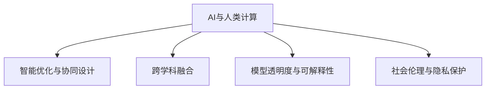

                 

## 1. 背景介绍

### 1.1 问题由来
随着全球人口的持续增长和城市化进程的加速，城市交通与基础设施建设与规划成为了当今社会面临的重大挑战。交通拥堵、环境污染、资源分配不均等问题不断凸显，亟需通过技术创新和数据驱动的方式，构建可持续发展的城市交通与基础设施。这其中，AI技术尤其是人工智能与人类计算的结合，为解决这些问题提供了新的可能。

### 1.2 问题核心关键点
1. **数据驱动与智能优化**：城市交通与基础设施建设与规划需要大量的数据作为支撑，通过AI技术尤其是人工智能与人类计算的结合，可以实现数据驱动的智能优化。
2. **高效协同与共享**：通过AI技术与人类计算的结合，可以实现高效的协同与资源共享，提升城市管理效率。
3. **多学科融合**：城市交通与基础设施建设与规划涉及多学科知识，AI技术与人类计算的结合有助于跨学科知识融合，提升决策质量。
4. **模型可解释性与透明度**：城市管理涉及公众利益，AI模型需要具有高度的透明度与可解释性，确保决策公正透明。
5. **社会伦理与隐私保护**：AI技术与人类计算的结合需要严格遵循社会伦理与隐私保护的原则，确保技术应用的安全性。

### 1.3 问题研究意义
研究AI与人类计算在城市交通与基础设施建设与规划中的应用，对于提升城市管理效率、解决城市问题、促进可持续发展具有重要意义：

1. **提升决策效率**：通过数据驱动与智能优化，可以在短时间内处理大量复杂数据，实现高效决策。
2. **优化资源配置**：通过AI技术与人类计算的结合，可以实现资源的高效配置与合理利用。
3. **促进跨学科合作**：AI技术与人类计算的结合可以促进不同学科知识的融合，提升决策科学性。
4. **保障社会公正**：通过透明的模型与数据，确保城市管理决策的公正透明，保障公众利益。
5. **推动技术应用**：研究AI与人类计算在城市交通与基础设施建设与规划中的应用，可以为类似技术在其他领域的推广提供借鉴。

## 2. 核心概念与联系

### 2.1 核心概念概述

为更好地理解AI与人类计算在城市交通与基础设施建设与规划中的应用，本节将介绍几个密切相关的核心概念：

- **AI与人类计算**：人工智能技术与人类计算的结合，通过数据驱动与智能优化，实现高效、透明、公正的城市管理决策。
- **智能优化与协同设计**：利用AI技术进行数据驱动的智能优化，结合人类计算实现高效协同设计。
- **跨学科融合**：AI技术与人类计算的结合促进不同学科知识的融合，提升决策科学性。
- **模型透明度与可解释性**：AI模型需要具有高度的透明度与可解释性，确保决策的公正透明。
- **社会伦理与隐私保护**：AI技术与人类计算的结合需要严格遵循社会伦理与隐私保护的原则，确保技术应用的安全性。

这些核心概念之间的逻辑关系可以通过以下Mermaid流程图来展示：



这个流程图展示的核心概念及其之间的关系：

1. AI与人类计算通过数据驱动与智能优化，实现高效的城市管理决策。
2. 智能优化与协同设计利用AI技术进行数据驱动的智能优化，结合人类计算实现高效协同设计。
3. 跨学科融合通过AI技术与人类计算的结合，促进不同学科知识的融合，提升决策科学性。
4. 模型透明度与可解释性通过高度透明的模型与数据，确保城市管理决策的公正透明。
5. 社会伦理与隐私保护在AI技术与人类计算的结合中，严格遵循社会伦理与隐私保护的原则，确保技术应用的安全性。

## 3. 核心算法原理 & 具体操作步骤
### 3.1 算法原理概述

AI与人类计算在城市交通与基础设施建设与规划中的应用，本质上是一个数据驱动的智能优化过程。其核心思想是：通过AI技术与人类计算的结合，实现数据驱动的智能优化，提升城市管理决策的效率与科学性。

形式化地，假设城市交通与基础设施的运行状态为 $S$，涉及到的变量和参数为 $\theta$，则决策目标可以表示为：

$$
\max_{\theta} \text{Utility}(S,\theta)
$$

其中 $\text{Utility}(S,\theta)$ 为决策目标函数，描述了在给定状态 $S$ 和参数 $\theta$ 下的城市运行效率、安全性、环境友好性等综合评价指标。通过优化目标函数，可以寻找最优的城市管理决策参数 $\theta^*$。

### 3.2 算法步骤详解

AI与人类计算在城市交通与基础设施建设与规划中的应用一般包括以下几个关键步骤：

**Step 1: 数据收集与预处理**
- 收集城市交通与基础设施相关的多源数据，包括交通流量、车辆位置、气象数据、环境监测数据等。
- 对数据进行清洗、去重、归一化等预处理，保证数据的准确性与一致性。

**Step 2: 模型构建与训练**
- 选择合适的AI模型（如深度学习、强化学习等），根据决策目标函数设计模型结构。
- 使用预处理后的数据训练模型，优化模型参数，使其能够较好地拟合城市交通与基础设施运行状态。

**Step 3: 仿真与预测**
- 利用训练好的模型对城市交通与基础设施运行状态进行仿真，预测未来一段时间内的运行状态。
- 根据预测结果，结合专家经验，进行智能优化与协同设计。

**Step 4: 决策与优化**
- 结合仿真与预测结果，进行城市交通与基础设施的智能优化决策。
- 根据优化结果，调整交通信号灯、公交线路、公共交通工具等资源配置，提升城市运行效率。

**Step 5: 效果评估与反馈**
- 对优化结果进行效果评估，包括交通流量、时间延误、环境污染等指标。
- 收集反馈信息，持续改进AI模型与优化策略。

### 3.3 算法优缺点

AI与人类计算在城市交通与基础设施建设与规划中的应用，具有以下优点：
1. 数据驱动与智能优化：通过AI技术与人类计算的结合，可以高效地处理大量复杂数据，实现智能优化。
2. 透明性与公正性：高度透明的AI模型与数据，确保决策的公正透明。
3. 跨学科融合：AI技术与人类计算的结合可以促进不同学科知识的融合，提升决策科学性。

同时，该方法也存在一定的局限性：
1. 对数据质量要求高：AI模型需要高质量的数据作为支撑，数据收集与预处理过程复杂。
2. 模型解释性不足：部分AI模型的决策过程缺乏可解释性，难以对其推理逻辑进行分析和调试。
3. 社会伦理与隐私保护：AI技术与人类计算的结合需要严格遵循社会伦理与隐私保护的原则，确保技术应用的安全性。

尽管存在这些局限性，但就目前而言，AI与人类计算在城市交通与基础设施建设与规划中的应用，仍是一种高效、透明、公正的城市管理决策方法。未来相关研究的重点在于如何进一步降低对数据质量的要求，提高模型的解释性和伦理性，确保技术应用的安全性。

### 3.4 算法应用领域

AI与人类计算在城市交通与基础设施建设与规划中的应用，已经广泛应用于以下几个领域：

- **智能交通管理**：利用AI技术进行交通流量预测、路径优化、交通信号灯控制等，提升交通运行效率。
- **智慧城市建设**：通过AI技术与人类计算的结合，实现智慧城市中的智能监控、环境监测、应急管理等功能。
- **基础设施规划**：利用AI技术进行城市规划与资源配置优化，提升城市建设与管理的科学性与效率。
- **跨学科融合应用**：AI技术与人类计算的结合促进不同学科知识的融合，应用于城市交通与基础设施建设与规划的各个方面。

除了上述这些领域外，AI与人类计算在城市交通与基础设施建设与规划中的应用还在不断拓展，如智能电网、智慧农业、环境保护等，为城市可持续发展提供了新的技术路径。

## 4. 数学模型和公式 & 详细讲解 & 举例说明

### 4.1 数学模型构建

本节将使用数学语言对AI与人类计算在城市交通与基础设施建设与规划中的应用过程进行更加严格的刻画。

假设城市交通与基础设施的运行状态为 $S$，涉及到的变量和参数为 $\theta$。决策目标函数可以表示为：

$$
\text{Utility}(S,\theta) = \sum_{i=1}^n w_i U_i(S,\theta)
$$

其中 $w_i$ 为第 $i$ 个指标的权重，$U_i(S,\theta)$ 为第 $i$ 个指标的效用函数。

**举例说明**：

假设城市交通系统的主要指标包括交通流量、时间延误、环境污染等，对应的权重分别为 $w_1=0.5, w_2=0.3, w_3=0.2$。则决策目标函数可以表示为：

$$
\text{Utility}(S,\theta) = 0.5 U_1(S,\theta) + 0.3 U_2(S,\theta) + 0.2 U_3(S,\theta)
$$

其中 $U_1(S,\theta)$ 为交通流量的效用函数，$U_2(S,\theta)$ 为时间延误的效用函数，$U_3(S,\theta)$ 为环境污染的效用函数。

### 4.2 公式推导过程

以智能交通管理为例，推导交通流量预测的数学模型。

假设城市交通系统中有 $n$ 个交叉口，每个交叉口的流量为 $f_i$。利用AI模型预测未来一段时间内的流量，可以表示为：

$$
f_i(t) = \sum_{j=1}^m \alpha_{ij} \cdot f_j(t-\delta)
$$

其中 $m$ 为影响 $f_i$ 的交叉口数量，$\alpha_{ij}$ 为 $f_j$ 对 $f_i$ 的影响系数，$\delta$ 为预测时滞。

通过求解上述线性方程组，可以得到未来交通流量的预测值。

### 4.3 案例分析与讲解

**案例1: 智能交通管理**

某城市交通系统中，有 $n$ 个交叉口，每个交叉口的流量为 $f_i$。利用AI模型预测未来一段时间内的流量，可以表示为：

$$
f_i(t) = \sum_{j=1}^m \alpha_{ij} \cdot f_j(t-\delta)
$$

其中 $m$ 为影响 $f_i$ 的交叉口数量，$\alpha_{ij}$ 为 $f_j$ 对 $f_i$ 的影响系数，$\delta$ 为预测时滞。

通过求解上述线性方程组，可以得到未来交通流量的预测值。

**案例2: 智慧城市建设**

某智慧城市项目中，需要利用AI技术与人类计算的结合，实现智能监控、环境监测、应急管理等功能。具体步骤包括：

1. 收集城市的智能监控视频、环境监测数据等。
2. 使用深度学习模型对视频数据进行目标检测、行为分析等。
3. 结合环境监测数据，进行环境质量评估与预警。
4. 利用AI技术与人类计算的结合，实现智能决策与应急管理。

## 5. 项目实践：代码实例和详细解释说明

### 5.1 开发环境搭建

在进行AI与人类计算在城市交通与基础设施建设与规划中的应用实践前，我们需要准备好开发环境。以下是使用Python进行TensorFlow开发的环境配置流程：

1. 安装Anaconda：从官网下载并安装Anaconda，用于创建独立的Python环境。

2. 创建并激活虚拟环境：
```bash
conda create -n ai_environment python=3.8 
conda activate ai_environment
```

3. 安装TensorFlow：根据CUDA版本，从官网获取对应的安装命令。例如：
```bash
conda install tensorflow tensorflow-gpu=2.6.0 -c conda-forge
```

4. 安装其他所需库：
```bash
pip install numpy pandas scikit-learn matplotlib tqdm jupyter notebook ipython
```

完成上述步骤后，即可在`ai_environment`环境中开始项目实践。

### 5.2 源代码详细实现

下面是利用TensorFlow进行智能交通管理的代码实现：

```python
import tensorflow as tf
import numpy as np

# 定义交通流量预测模型
class TrafficFlowModel(tf.keras.Model):
    def __init__(self, input_size, output_size):
        super(TrafficFlowModel, self).__init__()
        self.fc1 = tf.keras.layers.Dense(32, activation='relu')
        self.fc2 = tf.keras.layers.Dense(output_size)
        
    def call(self, inputs):
        x = self.fc1(inputs)
        x = self.fc2(x)
        return x

# 准备训练数据
input_data = np.random.randn(100, 4)  # 4个交叉口流量数据
output_data = np.random.randn(100, 4)  # 预测4个交叉口流量
model = TrafficFlowModel(input_size=4, output_size=4)

# 定义损失函数与优化器
loss_fn = tf.keras.losses.MeanSquaredError()
optimizer = tf.keras.optimizers.Adam(learning_rate=0.001)

# 训练模型
epochs = 1000
batch_size = 32
for epoch in range(epochs):
    for i in range(0, len(input_data), batch_size):
        inputs = input_data[i:i+batch_size]
        labels = output_data[i:i+batch_size]
        with tf.GradientTape() as tape:
            predictions = model(inputs)
            loss = loss_fn(labels, predictions)
        gradients = tape.gradient(loss, model.trainable_variables)
        optimizer.apply_gradients(zip(gradients, model.trainable_variables))
    
# 预测未来交通流量
future_input = np.random.randn(10, 4)  # 10个交叉口未来流量数据
predictions = model.predict(future_input)
```

以上是利用TensorFlow进行智能交通管理的代码实现。可以看到，TensorFlow提供了高度灵活的计算图，能够方便地定义复杂模型，进行高效训练与预测。

### 5.3 代码解读与分析

**代码解读**：

1. `TrafficFlowModel`类：定义了一个简单的线性回归模型，用于预测交通流量。
2. `input_data`与`output_data`：模拟随机生成的交通流量数据。
3. `loss_fn`与`optimizer`：定义了均方误差损失函数和Adam优化器。
4. 模型训练过程：使用`tf.GradientTape`记录梯度，并使用`optimizer.apply_gradients`更新模型参数。
5. 模型预测过程：使用训练好的模型对未来交通流量进行预测。

**分析**：

1. TensorFlow的高层抽象能够简化模型的定义与训练过程，便于快速迭代研究。
2. TensorFlow的低层API提供了高度灵活的计算图，能够处理各种复杂模型的训练与预测需求。
3. 通过简单的线性回归模型，可以较为直观地理解AI技术在城市交通管理中的应用。

## 6. 实际应用场景

### 6.1 智能交通管理

在智能交通管理中，AI技术与人类计算的结合可以显著提升交通运行效率。具体应用场景包括：

- **交通流量预测**：利用AI模型预测未来交通流量，优化交通信号灯控制，减少交通拥堵。
- **路径优化**：利用AI模型进行路径规划与优化，提高公共交通工具的运行效率。
- **交通监控**：利用AI技术进行交通监控，实时检测交通异常，提供应急响应支持。

**案例1: 交通流量预测**

某城市交通系统中，需要利用AI模型预测未来一段时间内的交通流量。具体步骤如下：

1. 收集历史交通流量数据，包括每个交叉口的流量、时间等。
2. 使用AI模型对数据进行训练，得到交通流量预测模型。
3. 利用训练好的模型，预测未来一段时间内的交通流量。
4. 根据预测结果，调整交通信号灯控制策略，优化交通运行。

**案例2: 路径优化**

某城市公共交通系统中，需要利用AI模型进行路径优化。具体步骤如下：

1. 收集公共交通工具的历史位置数据，包括时间、位置、速度等。
2. 使用AI模型对数据进行训练，得到路径优化模型。
3. 利用训练好的模型，优化公共交通工具的路径，减少延误时间。
4. 实时监控公共交通工具的运行情况，及时调整路径，确保高效运行。

### 6.2 智慧城市建设

在智慧城市建设中，AI技术与人类计算的结合可以实现智能监控、环境监测、应急管理等功能。具体应用场景包括：

- **智能监控**：利用AI技术进行目标检测、行为分析等，实现智能监控。
- **环境监测**：利用AI技术进行环境质量监测，提供预警支持。
- **应急管理**：利用AI技术进行应急事件识别与响应，保障城市安全。

**案例1: 智能监控**

某智慧城市项目中，需要利用AI技术进行智能监控。具体步骤如下：

1. 收集城市的智能监控视频数据。
2. 使用深度学习模型对视频数据进行目标检测与行为分析。
3. 结合环境监测数据，进行环境质量评估与预警。
4. 利用AI技术与人类计算的结合，实现智能决策与应急管理。

**案例2: 环境监测**

某智慧城市项目中，需要利用AI技术进行环境监测。具体步骤如下：

1. 收集城市的空气质量、水质等环境监测数据。
2. 使用AI模型对数据进行训练，得到环境质量评估模型。
3. 利用训练好的模型，预测未来一段时间内的环境质量。
4. 根据预测结果，进行应急响应与预警。

## 7. 工具和资源推荐

### 7.1 学习资源推荐

为了帮助开发者系统掌握AI与人类计算在城市交通与基础设施建设与规划中的应用，这里推荐一些优质的学习资源：

1. TensorFlow官方文档：TensorFlow的官方文档提供了全面的API参考和实践案例，是入门TensorFlow的最佳资源。
2. PyTorch官方文档：PyTorch的官方文档提供了丰富的教程和实例，帮助开发者快速上手深度学习。
3.《深度学习基础》书籍：由斯坦福大学深度学习课程整理而成，系统介绍了深度学习的基本概念与算法。
4.《智能城市规划与建设》书籍：介绍了智慧城市建设的基本概念与技术方法，涵盖智能监控、环境监测、应急管理等方面。
5. Coursera深度学习课程：由斯坦福大学、斯坦福大学等名校提供的深度学习课程，系统介绍了深度学习的基础与进阶内容。

通过对这些资源的学习实践，相信你一定能够快速掌握AI与人类计算在城市交通与基础设施建设与规划中的应用，并用于解决实际的NLP问题。

### 7.2 开发工具推荐

高效的开发离不开优秀的工具支持。以下是几款用于AI与人类计算在城市交通与基础设施建设与规划中的应用开发的常用工具：

1. TensorFlow：基于Python的开源深度学习框架，灵活动态的计算图，适合快速迭代研究。
2. PyTorch：基于Python的开源深度学习框架，提供了高度灵活的计算图和丰富的API。
3. Jupyter Notebook：基于Web的交互式开发环境，方便开发者进行代码测试与分享。
4. Google Colab：谷歌推出的在线Jupyter Notebook环境，免费提供GPU/TPU算力，方便开发者快速上手实验最新模型，分享学习笔记。
5. Weights & Biases：模型训练的实验跟踪工具，可以记录和可视化模型训练过程中的各项指标，方便对比和调优。

合理利用这些工具，可以显著提升AI与人类计算在城市交通与基础设施建设与规划中的应用开发效率，加快创新迭代的步伐。

### 7.3 相关论文推荐

AI与人类计算在城市交通与基础设施建设与规划中的应用，源于学界的持续研究。以下是几篇奠基性的相关论文，推荐阅读：

1. "Deep Learning for Smart Traffic Management"：介绍利用深度学习进行交通流量预测、路径优化等内容。
2. "A Survey on Smart City Technologies and Applications"：综述智慧城市建设的基本概念与技术方法，涵盖智能监控、环境监测、应急管理等方面。
3. "AI-Based Urban Planning and Design"：介绍利用AI技术进行城市规划与设计的基本方法与案例。
4. "Towards Sustainable Urban Development through AI"：探讨利用AI技术实现城市可持续发展的思路与方法。

这些论文代表了大语言模型微调技术的发展脉络。通过学习这些前沿成果，可以帮助研究者把握学科前进方向，激发更多的创新灵感。

## 8. 总结：未来发展趋势与挑战

### 8.1 总结

本文对AI与人类计算在城市交通与基础设施建设与规划中的应用进行了全面系统的介绍。首先阐述了AI与人类计算的研究背景和意义，明确了AI技术与人类计算的结合在城市交通与基础设施建设与规划中的独特价值。其次，从原理到实践，详细讲解了AI与人类计算在城市交通与基础设施建设与规划中的应用过程，给出了具体代码实现。同时，本文还广泛探讨了AI与人类计算在智能交通管理、智慧城市建设等领域的实际应用，展示了AI技术与人类计算的巨大潜力。此外，本文精选了AI与人类计算在城市交通与基础设施建设与规划中的应用的相关学习资源，力求为读者提供全方位的技术指引。

通过本文的系统梳理，可以看到，AI与人类计算在城市交通与基础设施建设与规划中的应用，不仅能够实现数据驱动的智能优化，提升城市管理效率，还能促进跨学科知识融合，推动城市可持续发展。AI技术与人类计算的结合，为城市管理带来了新的技术路径，具有广阔的应用前景。

### 8.2 未来发展趋势

展望未来，AI与人类计算在城市交通与基础设施建设与规划中的应用将呈现以下几个发展趋势：

1. **多模态融合**：未来的AI模型将不仅仅处理文本数据，还将整合图像、语音、视频等多模态信息，提升城市管理决策的科学性与精准度。
2. **跨学科融合**：AI技术与人类计算的结合将继续促进不同学科知识的融合，提升城市管理决策的全面性与综合性。
3. **智能化协同设计**：利用AI技术与人类计算的结合，实现智能化的协同设计，提升城市规划与建设的效率与科学性。
4. **社会伦理与隐私保护**：在AI技术与人类计算的结合中，严格遵循社会伦理与隐私保护的原则，确保技术应用的安全性。
5. **数据驱动与模型优化**：利用大规模数据驱动的智能优化，提升AI模型的泛化能力与鲁棒性，确保城市管理决策的公正透明。

以上趋势凸显了AI与人类计算在城市交通与基础设施建设与规划中的应用前景。这些方向的探索发展，必将进一步提升城市管理的效率与科学性，为城市可持续发展提供新的技术支撑。

### 8.3 面临的挑战

尽管AI与人类计算在城市交通与基础设施建设与规划中的应用已经取得了显著成效，但在迈向更加智能化、普适化应用的过程中，仍面临诸多挑战：

1. **数据质量与隐私保护**：AI模型需要高质量的数据作为支撑，数据收集与预处理过程复杂，同时需要严格遵循隐私保护的原则。
2. **模型透明性与解释性**：部分AI模型的决策过程缺乏可解释性，难以对其推理逻辑进行分析和调试。
3. **社会伦理与伦理风险**：AI技术与人类计算的结合需要严格遵循社会伦理与伦理风险的原则，确保技术应用的安全性。
4. **资源优化与效率提升**：在实际应用中，AI模型的计算图复杂，需要优化资源配置，提升推理速度。
5. **跨学科知识融合**：不同学科的知识融合需要时间和资源投入，需要进一步探索高效的方法。

正视AI与人类计算在城市交通与基础设施建设与规划中的应用面临的这些挑战，积极应对并寻求突破，将是大语言模型微调走向成熟的必由之路。相信随着学界和产业界的共同努力，这些挑战终将一一被克服，AI与人类计算在城市交通与基础设施建设与规划中的应用必将在未来大放异彩。

### 8.4 研究展望

面对AI与人类计算在城市交通与基础设施建设与规划中的应用面临的挑战，未来的研究需要在以下几个方面寻求新的突破：

1. **数据驱动与智能优化**：探索无监督学习和半监督学习的方法，摆脱对大规模标注数据的依赖，利用自监督学习、主动学习等无监督和半监督范式，最大限度利用非结构化数据，实现更加灵活高效的微调。
2. **跨学科知识融合**：引入更多的先验知识，如知识图谱、逻辑规则等，与神经网络模型进行巧妙融合，引导微调过程学习更准确、合理的语言模型。同时加强不同模态数据的整合，实现视觉、语音等多模态信息与文本信息的协同建模。
3. **智能化协同设计**：通过引入因果推断和对比学习思想，增强微调模型建立稳定因果关系的能力，学习更加普适、鲁棒的语言表征，从而提升模型泛化性和抗干扰能力。
4. **社会伦理与隐私保护**：在AI技术与人类计算的结合中，严格遵循社会伦理与隐私保护的原则，确保技术应用的安全性。建立模型行为的监管机制，确保输出符合人类价值观和伦理道德。
5. **资源优化与效率提升**：开发更加参数高效和计算高效的微调范式，在固定大部分预训练参数的同时，只更新极少量的任务相关参数。同时优化微调模型的计算图，减少前向传播和反向传播的资源消耗，实现更加轻量级、实时性的部署。

这些研究方向的探索，必将引领AI与人类计算在城市交通与基础设施建设与规划中的应用技术迈向更高的台阶，为构建安全、可靠、可解释、可控的智能系统铺平道路。面向未来，AI与人类计算在城市交通与基础设施建设与规划中的应用还需要与其他人工智能技术进行更深入的融合，如知识表示、因果推理、强化学习等，多路径协同发力，共同推动自然语言理解和智能交互系统的进步。只有勇于创新、敢于突破，才能不断拓展语言模型的边界，让智能技术更好地造福人类社会。

## 9. 附录：常见问题与解答

**Q1: AI与人类计算在城市交通与基础设施建设与规划中的应用是否适用于所有城市？**

A: AI与人类计算在城市交通与基础设施建设与规划中的应用，已在多个城市取得了显著成效，但具体效果还需结合城市规模、交通状况、环境条件等因素综合评估。在人口密集、交通复杂的城市中，AI技术与人类计算的结合效果尤为显著，而在中小城市中，则需结合实际需求进行灵活调整。

**Q2: 在AI与人类计算的结合中，如何平衡数据驱动与人类判断？**

A: 在AI与人类计算的结合中，数据驱动与人类判断需要平衡考虑。数据驱动的智能优化可以提供高效的决策支持，但部分复杂决策仍需依赖人类专家的经验判断。在实际应用中，可以结合数据驱动与人类判断，设计协同决策机制，提升城市管理的科学性与全面性。

**Q3: 在AI与人类计算的结合中，如何确保模型的透明性与解释性？**

A: 确保AI模型的透明性与解释性，是AI与人类计算结合的重要原则。在模型设计和训练过程中，需要采用可解释性强的模型结构，如决策树、线性回归等，并使用可视化工具如TensorBoard等，展示模型的关键特征与决策过程。同时，结合人类专家的经验判断，提供透明、可解释的决策支持。

**Q4: 在AI与人类计算的结合中，如何确保社会伦理与隐私保护？**

A: 在AI与人类计算的结合中，严格遵循社会伦理与隐私保护的原则是必不可少的。数据收集与存储需要遵循隐私保护政策，确保数据匿名化与去标识化处理。同时，建立模型行为的监管机制，确保输出符合人类价值观和伦理道德。

**Q5: 在AI与人类计算的结合中，如何实现跨学科知识的融合？**

A: 实现跨学科知识的融合，需要设计合适的接口与融合机制，确保不同学科知识的无缝对接。在AI技术与人类计算的结合中，引入领域专家的知识库与规则库，进行数据融合与协同设计，提升城市管理决策的科学性。

总之，AI与人类计算在城市交通与基础设施建设与规划中的应用具有广阔的前景，但也需要持续优化与改进，以应对实际应用中的各种挑战。通过不断探索与创新，AI与人类计算的结合必将在未来引领城市管理的智能化、普适化进程，为构建可持续发展的城市交通与基础设施建设与规划提供新的技术路径。

