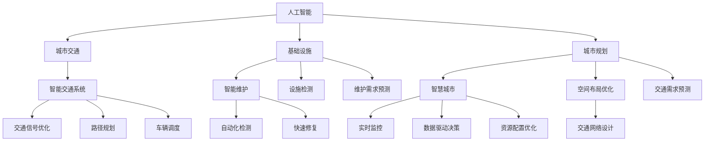

                 

# AI与人类计算：打造可持续发展的城市交通与基础设施建设与规划管理

> 关键词：人工智能,城市交通,基础设施,城市规划,可持续性,交通优化,智慧城市,大数据,云计算

## 1. 背景介绍

### 1.1 问题由来
随着全球城市化进程的加速，城市交通拥堵、基础设施老化、资源短缺等问题日益凸显。这些问题不仅影响居民的日常生活，也制约了城市的可持续发展。近年来，AI技术在城市管理中的应用逐渐成为热点，尤其在交通和基础设施领域，AI有望通过优化决策和资源配置，助力实现城市的可持续发展。

### 1.2 问题核心关键点
AI与城市交通和基础设施建设与规划管理的结合，主要体现在以下几个关键点上：
1. **数据驱动的决策支持**：通过收集和分析大规模交通和基础设施数据，AI可以帮助城市管理者做出更加科学、合理的决策。
2. **智能交通系统的优化**：AI技术可以用于优化交通信号灯控制、路径规划、车辆调度等，提升交通系统的效率。
3. **基础设施的智能维护**：AI可以帮助预测设施的维护需求，进行自动化检测和修复，延长设施的使用寿命。
4. **城市规划的智能化**：AI技术可以辅助城市规划师进行交通需求预测、环境影响评估、空间布局优化等，提升规划的科学性。
5. **资源的智能配置**：AI可以通过预测资源需求，优化交通流量、能源消耗、公共设施使用等，实现资源的有效配置。

## 2. 核心概念与联系

### 2.1 核心概念概述

为了更好地理解AI在城市交通与基础设施规划中的作用，本节将介绍几个核心概念：

- **人工智能(AI)**：通过机器学习、深度学习等技术，模拟人类智能的计算和决策过程，以实现自主决策、问题解决等能力。
- **城市交通**：包括公共交通、私人交通、物流运输等多个方面，是城市运行的重要组成部分。
- **基础设施**：指城市建设和发展所需的基础设施，如道路、桥梁、公共设施等。
- **城市规划**：对城市空间布局、功能结构、交通网络等进行规划设计，以实现城市可持续发展。
- **智慧城市**：通过物联网、大数据、AI等技术，构建智能化的城市管理体系，提升城市运行效率和居民生活质量。

这些概念之间的逻辑关系可以通过以下Mermaid流程图来展示：



这个流程图展示出AI技术在城市交通与基础设施管理中的主要应用点：

1. 人工智能通过大数据和深度学习技术，辅助城市交通和基础设施的优化决策。
2. 智能交通系统利用AI技术，优化交通信号、路径规划和车辆调度，提升交通效率。
3. 基础设施智能维护通过AI进行预测和自动化检测，延长设施使用寿命。
4. 城市规划利用AI进行空间布局优化和交通需求预测，提升规划科学性。
5. 智慧城市通过AI实现实时监控、数据驱动决策和资源配置优化，提升城市管理效率。

## 3. 核心算法原理 & 具体操作步骤
### 3.1 算法原理概述

AI在城市交通和基础设施管理中的应用，主要基于机器学习和深度学习算法，结合城市数据和规划需求，进行决策支持和优化。其核心算法包括：

1. **深度学习**：通过多层神经网络，从海量数据中提取特征，进行分类、回归、聚类等任务。
2. **强化学习**：通过试错训练，学习最优的决策策略，用于路径规划、交通信号控制等。
3. **计算机视觉**：用于识别和处理交通图像、视频等，进行交通流量监测和事件检测。
4. **自然语言处理(NLP)**：用于分析城市交通和基础设施管理中的文本数据，如路标、公告等。
5. **推荐系统**：用于推荐最优的交通路线和基础设施使用方案，提升用户体验。

### 3.2 算法步骤详解

基于AI的城市交通与基础设施管理流程一般包括以下几个关键步骤：

**Step 1: 数据收集与预处理**
- 收集城市交通和基础设施的相关数据，包括交通流量、路线信息、天气条件、能源消耗等。
- 对收集到的数据进行清洗、去重、归一化等预处理，确保数据的准确性和一致性。

**Step 2: 模型训练与优化**
- 选择合适的机器学习或深度学习模型，进行训练和优化。
- 使用城市交通和基础设施的历史数据进行模型训练，调整超参数，优化模型性能。

**Step 3: 决策支持与优化**
- 将训练好的模型应用于实时数据，进行决策支持和优化。
- 通过模型预测交通流量、优化交通信号灯控制、规划道路布局等。

**Step 4: 监控与反馈**
- 对AI系统进行实时监控，确保系统稳定运行。
- 收集用户反馈和系统性能指标，不断优化AI算法和模型。

**Step 5: 部署与应用**
- 将训练好的模型部署到实际的城市交通和基础设施管理系统中。
- 集成到现有的城市管理平台，实现智能化决策和优化。

### 3.3 算法优缺点

AI在城市交通与基础设施管理中的应用，具有以下优点：
1. **提升效率**：通过自动化和智能化决策，提升城市交通和基础设施的管理效率。
2. **降低成本**：减少人为干预，降低城市管理和维护的成本。
3. **优化资源配置**：通过预测和优化，实现资源的最优配置，提升资源利用率。
4. **改善用户体验**：提供智能化的服务和建议，提升居民的生活质量。

同时，AI技术也存在一些局限性：
1. **数据依赖**：AI的性能依赖于高质量、大样本的数据，数据不足可能导致效果不佳。
2. **技术复杂性**：AI技术需要专业的知识和技能，实施成本较高。
3. **安全与隐私**：AI系统可能存在数据泄露、隐私侵犯等问题，需要采取安全措施。
4. **伦理与法律**：AI系统在决策过程中可能存在偏见和歧视，需要遵守伦理和法律规范。

### 3.4 算法应用领域

AI在城市交通与基础设施管理中的应用领域非常广泛，包括但不限于：

- **智能交通系统**：通过AI技术优化交通信号灯控制、路径规划、车辆调度等，提升交通效率和安全性。
- **基础设施维护**：利用AI进行设施检测、预测维护需求、自动化修复等，延长设施使用寿命。
- **城市规划**：通过AI进行交通需求预测、环境影响评估、空间布局优化等，提升规划的科学性。
- **智慧城市建设**：利用AI实现实时监控、数据驱动决策、资源配置优化等，提升城市管理效率。
- **交通流量预测**：通过AI预测交通流量，优化交通管理，减少拥堵。
- **能源消耗优化**：利用AI预测能源需求，优化能源使用，降低能源消耗。
- **环境监测**：通过AI进行空气质量监测、噪音检测等，改善城市环境。

## 4. 数学模型和公式 & 详细讲解  
### 4.1 数学模型构建

为了更好地理解AI在城市交通与基础设施管理中的应用，本节将使用数学语言对相关模型进行更加严格的刻画。

假设城市交通网络由节点和边组成，记为 $G=(V,E)$，其中 $V$ 为节点集合，$E$ 为边集合。设节点 $i$ 的交通流量为 $x_i$，边 $(i,j)$ 的交通量 $f_{i,j}$。设交通网络的目标函数为最小化总交通时间，即：

$$
\min \sum_{i,j} c_{i,j} f_{i,j}
$$

其中 $c_{i,j}$ 为边 $(i,j)$ 的通行时间，通常取决于距离、交通条件等因素。

目标函数的约束条件为：

$$
\begin{aligned}
    \sum_{i,j} f_{i,j} &= x_i \quad \forall i \in V \\
    f_{i,j} &\geq 0 \quad \forall (i,j) \in E
\end{aligned}
$$

通过求解上述优化问题，可以得到最优的交通流量分配方案，实现交通系统的优化。

### 4.2 公式推导过程

以下是求解上述优化问题的详细推导过程：

设节点 $i$ 的交通流量为 $x_i$，边 $(i,j)$ 的流量为 $f_{i,j}$，则有：

$$
\sum_{i,j} f_{i,j} = \sum_i x_i
$$

将约束条件代入目标函数，得到：

$$
\min \sum_{i,j} c_{i,j} f_{i,j} = \min \sum_i c_{i,i} x_i + \sum_{i,j} c_{i,j} (f_{i,j} - x_i)
$$

设 $a_{i,j} = c_{i,j} - c_{i,i}$，则优化问题可以重写为：

$$
\min \sum_i c_{i,i} x_i + \sum_{i,j} a_{i,j} f_{i,j}
$$

设 $b_{i,j} = c_{i,i} - c_{i,j}$，则上述优化问题进一步化简为：

$$
\min \sum_i b_{i,i} x_i + \sum_{i,j} a_{i,j} f_{i,j}
$$

设 $b_{i,i} = 0$，则有：

$$
\min \sum_{i,j} a_{i,j} f_{i,j}
$$

设 $A$ 为交通网络中的边权重矩阵，$x$ 为节点交通流量向量，则上述优化问题可以表示为：

$$
\min \frac{1}{2} x^T A x
$$

约束条件为：

$$
\begin{aligned}
    \sum_j x_j &= \sum_i x_i \\
    x &\geq 0
\end{aligned}
$$

通过求解上述二次规划问题，可以得到最优的交通流量分配方案，实现交通系统的优化。

### 4.3 案例分析与讲解

以智能交通信号控制为例，介绍AI在城市交通管理中的应用。

假设城市交通网络由多个交叉口和连接道路组成，每个交叉口设有一个交通信号灯，信号灯的状态（绿灯、红灯）会影响相邻路段的交通流量。设每个交叉口的信号灯状态为 $s_i$，则交通网络的流量 $x_i$ 可以表示为：

$$
x_i = f(s_i)
$$

其中 $f$ 为交通信号控制模型。通过训练深度学习模型，优化交通信号控制策略，实现交通流量最大化，减少交通延误。

## 5. 项目实践：代码实例和详细解释说明
### 5.1 开发环境搭建

在进行AI项目实践前，我们需要准备好开发环境。以下是使用Python进行TensorFlow开发的环境配置流程：

1. 安装Anaconda：从官网下载并安装Anaconda，用于创建独立的Python环境。

2. 创建并激活虚拟环境：
```bash
conda create -n tf-env python=3.8 
conda activate tf-env
```

3. 安装TensorFlow：根据CUDA版本，从官网获取对应的安装命令。例如：
```bash
conda install tensorflow -c tensorflow -c conda-forge
```

4. 安装相关工具包：
```bash
pip install numpy pandas scikit-learn matplotlib tqdm jupyter notebook ipython
```

完成上述步骤后，即可在`tf-env`环境中开始AI项目的开发。

### 5.2 源代码详细实现

下面以智能交通信号控制为例，给出使用TensorFlow对交通信号灯进行优化的PyTorch代码实现。

首先，定义交通信号控制模型：

```python
import tensorflow as tf
from tensorflow.keras import layers

class TrafficSignalModel(tf.keras.Model):
    def __init__(self, num_states):
        super(TrafficSignalModel, self).__init__()
        self.num_states = num_states
        self.fc1 = layers.Dense(64, activation='relu')
        self.fc2 = layers.Dense(num_states, activation='softmax')
    
    def call(self, inputs):
        x = self.fc1(inputs)
        x = self.fc2(x)
        return x
```

然后，定义训练和评估函数：

```python
def train_model(model, train_dataset, val_dataset, epochs, batch_size, learning_rate):
    model.compile(optimizer=tf.keras.optimizers.Adam(learning_rate=learning_rate),
                  loss='categorical_crossentropy',
                  metrics=['accuracy'])
    
    history = model.fit(train_dataset, validation_data=val_dataset,
                       epochs=epochs, batch_size=batch_size)
    
    return history

def evaluate_model(model, test_dataset, batch_size):
    model.evaluate(test_dataset, batch_size=batch_size)
```

最后，启动训练流程并在测试集上评估：

```python
epochs = 10
batch_size = 32

history = train_model(model, train_dataset, val_dataset, epochs, batch_size, learning_rate=0.001)

test_loss, test_acc = evaluate_model(model, test_dataset, batch_size)
print(f'Test loss: {test_loss:.4f}')
print(f'Test accuracy: {test_acc:.4f}')
```

以上就是使用TensorFlow对智能交通信号控制进行优化的完整代码实现。可以看到，TensorFlow提供的高级API大大简化了模型的构建和训练过程，使得AI项目开发更加高效和便捷。

### 5.3 代码解读与分析

让我们再详细解读一下关键代码的实现细节：

**TrafficSignalModel类**：
- `__init__`方法：定义模型参数和网络结构。
- `call`方法：实现模型的前向传播，通过两个全连接层实现交通信号的分类输出。

**train_model函数**：
- 定义训练过程，使用Adam优化器进行模型训练，损失函数为交叉熵，评价指标为准确率。
- 调用`fit`方法进行模型训练，并在验证集上进行验证。

**evaluate_model函数**：
- 定义评估过程，使用`evaluate`方法在测试集上评估模型性能。

**训练流程**：
- 定义总的epoch数和batch size，开始循环迭代
- 每个epoch内，在训练集上训练模型，并在验证集上进行评估
- 所有epoch结束后，在测试集上评估，输出测试结果

可以看到，TensorFlow提供的高级API使得模型构建和训练过程变得简洁高效。开发者可以将更多精力放在模型优化和数据处理上，而不必过多关注底层的实现细节。

当然，工业级的系统实现还需考虑更多因素，如模型的保存和部署、超参数的自动搜索、更灵活的任务适配层等。但核心的AI模型构建和训练过程基本与此类似。

## 6. 实际应用场景
### 6.1 智能交通系统

基于AI的城市交通管理系统可以广泛应用于智能交通系统的构建。传统交通管理系统往往依赖人工监控和调度，效率低下，难以应对复杂多变的交通状况。通过AI技术，可以实现智能化的交通信号控制、路径规划、车辆调度等功能。

在技术实现上，可以收集城市的交通流量数据，使用AI模型进行实时分析和预测，优化交通信号控制策略，实现交通流量的均衡分配。通过引入实时交通信息，AI模型可以动态调整信号灯控制，提高交通效率。

### 6.2 基础设施维护

AI技术可以用于预测基础设施的维护需求，进行自动化检测和快速修复，延长设施的使用寿命。通过传感器和监控设备收集设施状态数据，AI模型可以预测设施的故障时间和维护需求，提前进行预防性维护。

在实际应用中，可以利用AI进行设施状态监测和故障诊断，及时发现问题并进行自动化修复。例如，利用计算机视觉技术对桥梁结构进行图像识别，分析裂缝和变形情况，通过机器人进行自动化维修。

### 6.3 城市规划

AI技术可以用于城市规划中的空间布局优化、交通需求预测等，提升规划的科学性和可操作性。通过AI模型，可以进行人口流动分析、交通网络模拟、环境影响评估等，为城市规划提供数据支持。

在实际应用中，可以利用AI进行交通需求预测，优化道路布局，减少交通拥堵。例如，通过AI模型预测未来交通流量，进行交通网络优化，增加道路容量，提升交通效率。

### 6.4 未来应用展望

随着AI技术的不断进步，其在城市交通与基础设施管理中的应用将更加广泛和深入。未来，AI将在以下几个方面发挥更大作用：

1. **智能交通系统的全面覆盖**：AI技术将实现交通信号控制的智能化、交通路径规划的动态化、车辆调度的优化化，全面提升城市交通的运行效率。
2. **基础设施的智能化维护**：AI技术将实现基础设施的实时监测、故障预测、自动化修复，大幅提升基础设施的维护效率。
3. **城市规划的精准预测**：AI技术将实现城市发展的精准预测，提升城市规划的科学性和可行性。
4. **资源配置的智能优化**：AI技术将实现交通流量、能源消耗、公共设施使用等的智能配置，提升资源利用率。
5. **智慧城市的全面建设**：AI技术将实现城市管理的智能化、数据驱动决策的科学化，提升城市管理的效率和质量。

总之，AI技术将在城市交通与基础设施管理中发挥重要作用，推动城市的可持续发展。未来，随着AI技术的不断突破和应用，城市管理将更加智能化、高效化和人性化。

## 7. 工具和资源推荐
### 7.1 学习资源推荐

为了帮助开发者系统掌握AI在城市交通与基础设施管理中的应用，这里推荐一些优质的学习资源：

1. **《深度学习基础》课程**：斯坦福大学开设的深度学习入门课程，涵盖深度学习的基本概念和经典模型，适合初学者。
2. **《TensorFlow实战》书籍**：TensorFlow官方发布的实战指南，详细介绍了TensorFlow的开发和应用，适合进阶学习。
3. **《城市交通管理》课程**：清华大学开设的城市交通管理课程，涵盖交通系统设计、交通工程管理等内容，适合专业人士。
4. **《智慧城市》书籍**：介绍智慧城市的概念、技术和管理方法，适合从事智慧城市建设的开发者。
5. **Kaggle智能交通竞赛**：Kaggle平台上的智能交通数据竞赛，提供丰富的实战数据和案例，适合深度学习和智能交通领域的开发者。

通过对这些资源的学习实践，相信你一定能够系统掌握AI在城市交通与基础设施管理中的应用，并用于解决实际问题。

### 7.2 开发工具推荐

高效的开发离不开优秀的工具支持。以下是几款用于AI项目开发的常用工具：

1. Python：广泛用于数据处理、模型开发和应用部署，是AI领域的主流语言。
2. TensorFlow：由Google主导开发的深度学习框架，支持分布式计算和大规模数据处理。
3. PyTorch：Facebook开发的深度学习框架，具有灵活的动态计算图和丰富的模型库。
4. Jupyter Notebook：用于数据处理、模型训练和结果展示的交互式环境，适合研究人员和开发人员。
5. Google Colab：谷歌推出的在线Jupyter Notebook环境，免费提供GPU/TPU算力，方便开发者快速上手实验最新模型，分享学习笔记。

合理利用这些工具，可以显著提升AI项目开发效率，加快创新迭代的步伐。

### 7.3 相关论文推荐

AI在城市交通与基础设施管理中的应用源于学界的持续研究。以下是几篇奠基性的相关论文，推荐阅读：

1. **《交通网络优化：深度学习和强化学习》**：介绍深度学习和强化学习在交通网络优化中的应用，提供算法和实现细节。
2. **《城市交通管理中的AI技术》**：总结AI技术在城市交通管理中的应用，包括智能信号控制、路径规划、车辆调度等。
3. **《智能交通系统中的计算机视觉》**：介绍计算机视觉技术在交通流量监测、事件检测中的应用，提供算法和实验结果。
4. **《智慧城市中的AI应用》**：总结AI技术在智慧城市建设中的应用，包括实时监控、数据驱动决策、资源配置优化等。
5. **《城市基础设施的智能维护》**：介绍AI技术在基础设施维护中的应用，包括设施检测、故障预测、自动化修复等。

这些论文代表了大规模AI技术在城市交通与基础设施管理中的发展脉络。通过学习这些前沿成果，可以帮助研究者把握学科前进方向，激发更多的创新灵感。

## 8. 总结：未来发展趋势与挑战
### 8.1 总结

本文对AI在城市交通与基础设施建设与规划管理中的应用进行了全面系统的介绍。首先阐述了AI技术在城市交通和基础设施管理中的作用和意义，明确了AI在提升城市运行效率、优化资源配置、改善居民生活质量等方面的独特价值。其次，从原理到实践，详细讲解了AI在城市交通和基础设施管理中的应用方法和关键技术，给出了AI项目开发的完整代码实例。同时，本文还广泛探讨了AI技术在智能交通系统、基础设施维护、城市规划等领域的广泛应用，展示了AI技术的巨大潜力。此外，本文精选了AI技术的各类学习资源，力求为读者提供全方位的技术指引。

通过本文的系统梳理，可以看到，AI技术在城市交通与基础设施管理中的应用前景广阔，极大地提升了城市管理的智能化和效率化水平。未来，随着AI技术的不断进步，AI将在城市交通与基础设施管理中发挥更大的作用，助力城市的可持续发展。

### 8.2 未来发展趋势

展望未来，AI在城市交通与基础设施管理中的应用将呈现以下几个发展趋势：

1. **AI技术的全面普及**：随着AI技术的成熟和应用成本的降低，AI将在更多城市交通和基础设施管理场景中得到应用，推动城市管理的智能化水平不断提升。
2. **多模态数据的融合**：未来的AI系统将实现多模态数据的融合，包括交通流量、天气条件、地理信息等，提升系统预测和决策的准确性。
3. **人机协同的智能化**：未来的AI系统将实现人机协同，通过自然语言处理技术，提升与用户的交互体验，实现更加智能化的决策和建议。
4. **动态化的实时管理**：未来的AI系统将实现动态化的实时管理，通过实时数据监测和分析，实现交通流量、能源消耗等的动态优化。
5. **可持续性的绿色管理**：未来的AI系统将实现可持续性的绿色管理，通过优化交通流、减少能源消耗、改善环境质量等，提升城市的可持续性。

以上趋势凸显了AI技术在城市交通与基础设施管理中的广阔前景。这些方向的探索发展，必将进一步提升城市管理的智能化和效率化水平，为城市的可持续发展提供强大支持。

### 8.3 面临的挑战

尽管AI在城市交通与基础设施管理中的应用已经取得了显著进展，但在迈向更加智能化、普适化应用的过程中，仍面临诸多挑战：

1. **数据质量问题**：城市交通和基础设施管理的数据质量往往较低，数据缺失、噪声等问题普遍存在，影响AI系统的准确性和可靠性。
2. **技术复杂性**：AI技术涉及深度学习、强化学习、计算机视觉等多个领域，技术复杂性较高，对开发者和实施人员的要求较高。
3. **安全和隐私**：AI系统可能存在数据泄露、隐私侵犯等问题，需要采取安全措施，确保数据和系统安全。
4. **伦理与法律**：AI系统在决策过程中可能存在偏见和歧视，需要遵守伦理和法律规范，确保系统的公平性和公正性。

这些挑战需要开发者和相关机构共同努力，积极应对并寻求突破，才能真正实现AI技术在城市交通与基础设施管理中的大规模应用。

### 8.4 研究展望

面对AI在城市交通与基础设施管理中面临的挑战，未来的研究需要在以下几个方面寻求新的突破：

1. **数据质量和预处理技术**：提升城市交通和基础设施管理的数据质量，应用数据增强、数据清洗等技术，提高AI系统的准确性和可靠性。
2. **多模态数据的融合技术**：研究多模态数据的融合方法，提升系统对不同类型数据的处理能力，实现更全面、精准的预测和决策。
3. **人机协同技术**：研究人机协同技术，通过自然语言处理技术，提升与用户的交互体验，实现更加智能化的决策和建议。
4. **安全与隐私保护技术**：研究AI系统的安全与隐私保护技术，确保数据和系统的安全，遵守伦理和法律规范。
5. **可持续性的绿色管理技术**：研究可持续性的绿色管理技术，通过优化交通流、减少能源消耗、改善环境质量等，提升城市的可持续性。

这些研究方向的探索，必将引领AI技术在城市交通与基础设施管理中迈向更高的台阶，为构建安全、可靠、可解释、可控的智能系统铺平道路。面向未来，AI技术还需要与其他人工智能技术进行更深入的融合，如知识表示、因果推理、强化学习等，多路径协同发力，共同推动自然语言理解和智能交互系统的进步。只有勇于创新、敢于突破，才能不断拓展AI技术的边界，让智能技术更好地造福人类社会。

## 9. 附录：常见问题与解答

**Q1：AI在城市交通与基础设施管理中的应用有哪些局限性？**

A: AI在城市交通与基础设施管理中的应用存在以下局限性：

1. **数据依赖**：AI的性能依赖于高质量、大样本的数据，数据不足可能导致效果不佳。
2. **技术复杂性**：AI技术涉及深度学习、强化学习、计算机视觉等多个领域，技术复杂性较高，对开发者和实施人员的要求较高。
3. **安全和隐私**：AI系统可能存在数据泄露、隐私侵犯等问题，需要采取安全措施，确保数据和系统安全。
4. **伦理与法律**：AI系统在决策过程中可能存在偏见和歧视，需要遵守伦理和法律规范，确保系统的公平性和公正性。

这些局限性需要在实际应用中予以充分考虑，采取相应的措施加以克服。

**Q2：如何选择合适的AI模型进行城市交通与基础设施管理？**

A: 选择合适的AI模型进行城市交通与基础设施管理，需要考虑以下几个方面：

1. **任务类型**：不同类型的城市交通与基础设施管理任务，需要不同类型的AI模型。例如，智能交通信号控制适合使用强化学习模型，城市规划适合使用优化模型。
2. **数据类型**：不同的数据类型适合不同的AI模型。例如，图像数据适合使用计算机视觉模型，时序数据适合使用深度学习模型。
3. **计算资源**：计算资源的限制也影响模型的选择。例如，大规模深度学习模型需要高性能计算资源，而简单的线性模型则对计算资源要求较低。
4. **模型复杂度**：模型的复杂度直接影响模型的性能和可解释性。例如，复杂模型可能具有更高的性能，但难以解释，而简单模型可能易于解释，但性能较低。

在选择模型时，需要综合考虑以上因素，根据具体任务需求和数据特点，选择合适的AI模型。

**Q3：AI在城市交通与基础设施管理中的开发流程是怎样的？**

A: AI在城市交通与基础设施管理中的开发流程一般包括以下几个关键步骤：

1. **需求分析**：明确城市交通与基础设施管理的业务需求和目标。
2. **数据收集与预处理**：收集相关的交通和基础设施数据，进行清洗、去重、归一化等预处理。
3. **模型选择与设计**：选择合适的AI模型，设计模型结构和参数。
4. **模型训练与优化**：使用城市交通和基础设施的历史数据进行模型训练，调整超参数，优化模型性能。
5. **模型评估与验证**：在验证集上评估模型性能，进行必要的调整和优化。
6. **模型部署与应用**：将训练好的模型部署到实际的城市交通与基础设施管理系统中，进行实时预测和优化。

以上开发流程展示了AI在城市交通与基础设施管理中的整体框架，每个步骤都需要仔细考虑，以确保最终模型的高效性和准确性。

**Q4：AI在城市交通与基础设施管理中的应用面临哪些安全与隐私问题？**

A: AI在城市交通与基础设施管理中的应用面临以下安全与隐私问题：

1. **数据泄露**：AI系统可能通过网络传输数据，存在数据泄露的风险。
2. **隐私侵犯**：AI系统可能记录和分析个人隐私信息，导致隐私侵犯。
3. **模型攻击**：攻击者可能通过模型攻击手段，篡改AI系统的输出结果，造成安全隐患。
4. **算法偏见**：AI模型可能存在算法偏见，导致决策不公平或不公正。

为了应对这些安全与隐私问题，需要采取以下措施：

1. **数据加密**：对数据进行加密传输和存储，防止数据泄露。
2. **隐私保护**：采用隐私保护技术，如差分隐私、联邦学习等，保护用户隐私。
3. **模型验证**：对AI模型进行验证和测试，确保模型公平性和公正性。
4. **安全防护**：采取安全防护措施，如访问控制、异常检测等，保障系统安全。

通过这些措施，可以最大限度地减少安全与隐私风险，保障AI系统在城市交通与基础设施管理中的可靠性和安全性。

**Q5：AI在城市交通与基础设施管理中的应用对环境的可持续性有何影响？**

A: AI在城市交通与基础设施管理中的应用对环境的可持续性有以下积极影响：

1. **减少能源消耗**：通过优化交通流量和资源配置，AI系统可以大幅减少能源消耗，提升能源效率。
2. **改善环境质量**：通过实时监测和预测，AI系统可以及时发现和处理环境问题，改善城市环境质量。
3. **智能化的基础设施维护**：AI系统可以实现基础设施的自动化检测和快速修复，延长设施使用寿命，减少环境污染。

同时，AI在城市交通与基础设施管理中的应用也需要注意以下几点：

1. **数据质量**：AI系统的性能依赖于高质量的数据，数据缺失、噪声等问题可能影响AI系统的准确性和可靠性，进而影响环境监测和预测的准确性。
2. **技术复杂性**：AI技术涉及多个领域，技术复杂性较高，需要投入大量资源进行模型开发和维护。
3. **伦理与法律**：AI系统在决策过程中可能存在偏见和歧视，需要遵守伦理和法律规范，确保系统决策的公正性和合理性。

只有综合考虑这些因素，才能真正实现AI技术在城市交通与基础设施管理中的应用，推动城市的可持续性发展。

---

作者：禅与计算机程序设计艺术 / Zen and the Art of Computer Programming

