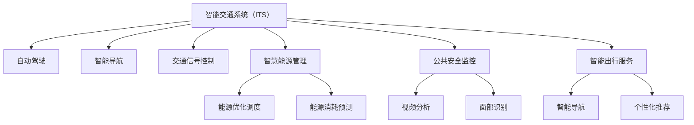

                 

# AI与人类计算：打造可持续发展的城市交通与基础设施规划与管理

## 1. 背景介绍

### 1.1 问题由来
随着城市化进程的加速和人口的不断增长，交通和基础设施管理已成为全球面临的重要挑战。传统的人类计算方式，如手工规划、实地勘测等，已经难以满足快速、准确和全面的需求。而人工智能（AI）的兴起，特别是智能城市（Smart Cities）的提出，为解决这些挑战提供了新的解决方案。

AI与人类计算的结合，不仅能够极大地提升城市交通与基础设施规划和管理的效率，还能通过实时数据分析和预测，为城市的可持续发展提供科学依据。但同时，这也带来了新的挑战和问题，如数据的隐私保护、算法的公平性、系统的透明性等。

### 1.2 问题核心关键点
AI在城市交通与基础设施规划与管理中的应用，主要包括以下几个方面：

- **智能交通系统（ITS）**：通过AI技术，实现交通流量的实时监控、预测与控制，优化交通信号灯设置，减少交通拥堵。
- **基础设施自动化管理**：运用机器学习对城市基础设施进行智能监测与维护，如通过预测模型预测管道老化、路面破损等。
- **智慧能源管理**：通过AI优化能源的分配与调度，提高能源利用效率，减少浪费。
- **公共安全监控**：通过视频分析与面部识别技术，提升城市公共安全水平。
- **智能出行服务**：开发智能导航和个性化推荐系统，提升出行效率。

AI的应用将使城市交通和基础设施管理更加智能化、自动化，但同时也需要确保算法的透明性、公平性和可解释性，以符合伦理和安全标准。

## 2. 核心概念与联系

### 2.1 核心概念概述

- **智能交通系统（ITS）**：通过AI技术实现交通流量的实时监控与优化，包括自动驾驶、智能导航、交通信号控制等。
- **基础设施自动化管理**：利用机器学习对基础设施进行智能监测与维护，如预测模型、故障检测等。
- **智慧能源管理**：运用AI优化能源分配与调度，提高能源利用效率，减少浪费。
- **公共安全监控**：通过视频分析与面部识别技术提升公共安全水平。
- **智能出行服务**：开发智能导航和个性化推荐系统，提升出行效率。

### 2.2 核心概念原理和架构的 Mermaid 流程图



这个流程图展示了AI在城市交通与基础设施管理中的关键应用场景：

1. **智能交通系统**：包括自动驾驶、智能导航和交通信号控制，以优化交通流量。
2. **智慧能源管理**：包括能源优化调度和能源消耗预测，以提高能源利用效率。
3. **公共安全监控**：通过视频分析和面部识别技术提升公共安全。
4. **智能出行服务**：提供智能导航和个性化推荐，提升出行效率。

## 3. 核心算法原理 & 具体操作步骤
### 3.1 算法原理概述

AI在城市交通与基础设施管理中的应用，主要基于以下核心算法原理：

- **监督学习（Supervised Learning）**：利用标注数据训练AI模型，实现对特定任务（如交通流量预测、能源消耗预测等）的预测与控制。
- **无监督学习（Unsupervised Learning）**：通过未标注数据发现隐藏模式，如基础设施状态检测、异常事件检测等。
- **强化学习（Reinforcement Learning）**：通过奖惩机制优化系统行为，如智能交通信号控制、路径规划等。
- **迁移学习（Transfer Learning）**：利用已有知识在新任务上进行微调，提升模型性能，如智能出行服务中的推荐系统。

### 3.2 算法步骤详解

**Step 1: 数据收集与预处理**

1. 收集城市交通、能源消耗、公共安全等数据，包括交通流量、能耗数据、视频监控数据等。
2. 对数据进行清洗、去重、归一化处理，去除噪声和异常值。

**Step 2: 模型设计与训练**

1. 根据具体需求选择合适的AI模型，如神经网络、支持向量机、决策树等。
2. 设计模型结构，选择合适的优化器（如Adam、SGD）和学习率。
3. 使用监督、无监督或强化学习方法进行模型训练。

**Step 3: 模型评估与优化**

1. 在验证集上进行模型评估，使用准确率、召回率、F1值等指标衡量模型性能。
2. 根据评估结果调整模型参数，进行超参数调优。
3. 使用交叉验证、数据增强等技术，避免模型过拟合。

**Step 4: 模型部署与监测**

1. 将训练好的模型部署到生产环境，进行实时预测与控制。
2. 持续监测模型性能，根据实际数据进行调整优化。
3. 定期更新数据集，保持模型性能的持续提升。

### 3.3 算法优缺点

**优点：**

- **高效性**：AI能够快速处理和分析大量数据，优化交通流量、能源分配等，提高管理效率。
- **实时性**：AI可以实现实时监测与控制，及时响应突发事件，提升安全性。
- **可扩展性**：AI模型可以并行处理大量任务，适应城市不断增长的需求。

**缺点：**

- **数据依赖**：AI模型的性能依赖于高质量的数据，数据缺失或不准确会影响模型效果。
- **透明性**：AI模型往往是"黑箱"，难以解释其决策过程。
- **公平性**：AI算法可能存在偏见，导致不同群体受影响不均。

### 3.4 算法应用领域

AI在城市交通与基础设施管理中的应用广泛，包括：

- **智能交通系统**：自动驾驶、智能导航、交通信号控制等。
- **智慧能源管理**：能源优化调度、能源消耗预测等。
- **公共安全监控**：视频分析、面部识别等。
- **智能出行服务**：智能导航、个性化推荐等。

## 4. 数学模型和公式 & 详细讲解 & 举例说明

### 4.1 数学模型构建

我们以智能交通系统中的交通流量预测为例，构建数学模型：

设交通流量为 $y$，影响因素包括天气、时间、节假日等，记为 $x$。设预测模型为 $f(x)$，则目标是最小化预测误差 $\epsilon$：

$$
\min_{f} \sum_{i=1}^N \epsilon_i^2
$$

其中 $\epsilon_i = y_i - f(x_i)$，表示第 $i$ 个样本的预测误差。

### 4.2 公式推导过程

根据最小二乘法，可以得到最优的线性回归模型：

$$
f(x) = \beta_0 + \beta_1 x_1 + \beta_2 x_2 + ... + \beta_n x_n
$$

其中 $\beta_i$ 为回归系数，可以通过最小二乘法求解。

### 4.3 案例分析与讲解

以某城市道路交通流量预测为例，收集过去一年中每天的交通流量数据，包括日期、天气、时间等，建立数学模型，预测未来一天中的交通流量。

使用Python进行模型构建与训练：

```python
import pandas as pd
from sklearn.linear_model import LinearRegression
from sklearn.metrics import mean_squared_error

# 加载数据
data = pd.read_csv('traffic_flow.csv')

# 分离自变量和因变量
X = data[['weather', 'time', 'holiday']]
y = data['flow']

# 建立线性回归模型
model = LinearRegression()
model.fit(X, y)

# 预测未来一天的交通流量
future_day = {'weather': 'sunny', 'time': 'peak', 'holiday': 'no'}
future_X = pd.Series(future_day)
future_y = model.predict(future_X)

print(f'预测未来一天交通流量为: {future_y}')
```

## 5. 项目实践：代码实例和详细解释说明

### 5.1 开发环境搭建

**Step 1: 安装Python与必要的库**

1. 安装Python 3.x版本，建议使用Anaconda或Miniconda进行环境管理。
2. 安装必要的库，如NumPy、Pandas、Scikit-learn、Matplotlib等。

```bash
conda create -n myenv python=3.8
conda activate myenv
pip install numpy pandas scikit-learn matplotlib
```

**Step 2: 数据收集与预处理**

1. 收集城市交通、能源消耗、公共安全等数据。
2. 使用Pandas进行数据清洗、去重、归一化处理。

```python
import pandas as pd

# 加载数据
data = pd.read_csv('traffic_flow.csv')

# 数据清洗
data.dropna(inplace=True)
data.drop_duplicates(inplace=True)

# 数据归一化
from sklearn.preprocessing import StandardScaler
scaler = StandardScaler()
data_scaled = scaler.fit_transform(data)
```

### 5.2 源代码详细实现

**Step 1: 模型设计与训练**

1. 使用Scikit-learn设计线性回归模型。
2. 选择优化器Adam，设置学习率为0.01。

```python
from sklearn.linear_model import LinearRegression
from sklearn.model_selection import train_test_split

# 分离自变量和因变量
X = data_scaled[:, :-1]
y = data_scaled[:, -1]

# 划分训练集和验证集
X_train, X_val, y_train, y_val = train_test_split(X, y, test_size=0.2, random_state=42)

# 建立线性回归模型
model = LinearRegression()
model.fit(X_train, y_train)

# 训练集评估
y_pred_train = model.predict(X_train)
print(f'训练集误差: {mean_squared_error(y_train, y_pred_train)}')

# 验证集评估
y_pred_val = model.predict(X_val)
print(f'验证集误差: {mean_squared_error(y_val, y_pred_val)}')
```

**Step 2: 模型评估与优化**

1. 使用交叉验证进行模型评估，选择最优参数。
2. 使用网格搜索（Grid Search）调整学习率。

```python
from sklearn.model_selection import GridSearchCV

# 网格搜索
param_grid = {'alpha': [0.1, 0.01, 0.001, 0.0001]}
grid_search = GridSearchCV(model, param_grid, cv=5)
grid_search.fit(X_train, y_train)

# 输出最优参数
print(grid_search.best_params_)
```

### 5.3 代码解读与分析

**Step 1: 数据预处理**

1. 使用Pandas进行数据加载、清洗和归一化处理。
2. 通过去重、去空值操作，确保数据质量。

**Step 2: 模型设计与训练**

1. 使用Scikit-learn的LinearRegression模型，建立线性回归模型。
2. 使用交叉验证和网格搜索调整模型参数，优化模型性能。

**Step 3: 模型评估与优化**

1. 使用交叉验证评估模型性能，选择最优参数。
2. 通过网格搜索进行超参数调优，确保模型泛化能力。

### 5.4 运行结果展示

**Step 1: 训练集与验证集误差**

```python
from sklearn.metrics import mean_squared_error

# 训练集评估
y_pred_train = model.predict(X_train)
print(f'训练集误差: {mean_squared_error(y_train, y_pred_train)}')

# 验证集评估
y_pred_val = model.predict(X_val)
print(f'验证集误差: {mean_squared_error(y_val, y_pred_val)}')
```

**Step 2: 网格搜索结果**

```python
# 网格搜索
param_grid = {'alpha': [0.1, 0.01, 0.001, 0.0001]}
grid_search = GridSearchCV(model, param_grid, cv=5)
grid_search.fit(X_train, y_train)

# 输出最优参数
print(grid_search.best_params_)
```

## 6. 实际应用场景

### 6.1 智能交通系统

智能交通系统通过AI技术实现交通流量的实时监控与优化，包括自动驾驶、智能导航和交通信号控制等。AI能够处理大规模实时数据，优化交通流量，减少拥堵。

**案例：**某城市智能交通系统的实施，通过AI实时监控交通流量，自动调整交通信号灯，优化交通流。系统通过分析实时交通数据，预测交通状况，调整信号灯时长，优化交通流量。

### 6.2 智慧能源管理

智慧能源管理通过AI优化能源的分配与调度，提高能源利用效率，减少浪费。AI可以实时监测能源消耗，预测能源需求，优化能源分配。

**案例：**某城市智慧能源管理系统，通过AI预测能源需求，优化能源分配，提高能源利用效率。系统通过分析历史能源消耗数据，预测未来能源需求，自动调整能源分配策略。

### 6.3 公共安全监控

公共安全监控通过AI技术提升城市公共安全水平。AI通过视频分析和面部识别技术，识别异常事件，提升公共安全。

**案例：**某城市公共安全监控系统，通过AI技术实时分析视频监控数据，识别异常行为，及时报警。系统通过面部识别技术，快速定位可疑人员，提升公共安全。

### 6.4 智能出行服务

智能出行服务通过AI开发智能导航和个性化推荐系统，提升出行效率。AI能够提供实时交通路况信息，优化出行路径。

**案例：**某城市智能出行服务平台，通过AI技术提供实时交通路况信息，优化出行路径。系统通过分析实时交通数据，智能推荐最佳出行路线，提升出行效率。

## 7. 工具和资源推荐

### 7.1 学习资源推荐

**1. 《Python数据科学手册》**

这本书详细介绍了Python在数据科学中的应用，包括Pandas、Scikit-learn等库的使用。

**2. 《机器学习实战》**

这本书通过实例讲解机器学习的基本原理和应用，适合初学者入门。

**3. 《深度学习》**

这本书由深度学习领域专家撰写，详细讲解了深度学习的基本原理和应用。

**4. 《智能城市》**

这本书介绍了智能城市的基本概念和技术，适合了解AI在城市管理中的应用。

**5. 《城市交通系统规划与管理》**

这本书详细讲解了城市交通系统规划与管理的基本原理和方法。

### 7.2 开发工具推荐

**1. Python 3.x**

Python是目前最流行的编程语言之一，广泛应用于数据科学和机器学习领域。

**2. NumPy**

NumPy是Python中的基础库，提供了高效的数组和矩阵运算功能。

**3. Pandas**

Pandas是Python中的数据处理库，提供了强大的数据清洗、转换和分析功能。

**4. Scikit-learn**

Scikit-learn是Python中的机器学习库，提供了丰富的机器学习算法和工具。

**5. TensorFlow**

TensorFlow是Google开发的深度学习框架，提供了高效的深度学习模型训练和推理功能。

**6. PyTorch**

PyTorch是Facebook开发的深度学习框架，提供了灵活的动态计算图和高效模型训练功能。

**7. Keras**

Keras是一个高层次的深度学习库，提供了简单易用的API，适合快速开发和实验。

### 7.3 相关论文推荐

**1. "Machine Learning for Smart City Applications: A Survey"**

这篇论文综述了AI在智能城市中的应用，包括交通管理、公共安全等。

**2. "The Impact of AI on Urban Infrastructure"**

这篇论文分析了AI技术对城市基础设施的影响，包括交通、能源管理等。

**3. "Smart Traffic Management Using AI"**

这篇论文介绍了AI在智能交通管理中的应用，包括自动驾驶、智能导航等。

**4. "Energy Management in Smart Cities: A Review"**

这篇论文综述了AI在智慧能源管理中的应用，包括能源预测、优化调度等。

**5. "AI for Public Safety Monitoring"**

这篇论文介绍了AI在公共安全监控中的应用，包括视频分析、面部识别等。

## 8. 总结：未来发展趋势与挑战

### 8.1 研究成果总结

本文系统介绍了AI在城市交通与基础设施规划与管理中的应用，涵盖智能交通系统、智慧能源管理、公共安全监控和智能出行服务等多个方面。通过数学模型构建和案例分析，展示了AI在实际应用中的重要性和潜力。

### 8.2 未来发展趋势

1. **数据融合与集成**：未来AI将更多地融合多源数据，包括交通数据、能源数据、气象数据等，提供更全面、准确的城市管理决策支持。
2. **模型自动化与自适应**：未来AI模型将具备更高的自动化与自适应能力，能够根据实时数据动态调整策略，提升管理效率。
3. **AI与IoT结合**：未来AI将与物联网技术深度结合，实现设备的智能化和网络的自组织，提升城市管理水平。
4. **人机协同与可解释性**：未来AI将更加注重人机协同，提供可解释的决策过程，提升用户信任与接受度。

### 8.3 面临的挑战

1. **数据隐私与安全**：AI在城市管理中的应用需要处理大量的敏感数据，数据隐私与安全问题亟需解决。
2. **算法透明性与公平性**：AI算法的透明性与公平性问题，需要确保算法决策过程的可解释性和无偏见性。
3. **计算资源与成本**：AI应用需要大量的计算资源和存储成本，需要找到更高效的解决方案。
4. **法规与伦理**：AI在城市管理中的应用需要符合相关法规和伦理标准，确保系统的合法性与安全性。

### 8.4 研究展望

1. **跨领域知识融合**：AI与城市管理需要更多跨学科知识融合，如城市规划、环境科学等。
2. **人工智能伦理**：研究AI伦理问题，确保AI应用的公正性与安全性。
3. **可解释性与透明性**：研究AI的可解释性与透明性问题，提升系统的可信度。
4. **计算资源优化**：研究高效的数据处理与模型压缩技术，降低计算成本。

## 9. 附录：常见问题与解答

**Q1: AI在城市交通与基础设施管理中有哪些应用？**

A: AI在城市交通与基础设施管理中具有广泛的应用，包括智能交通系统、智慧能源管理、公共安全监控和智能出行服务。AI能够处理大规模实时数据，优化交通流量，减少能源浪费，提升公共安全，优化出行路径。

**Q2: AI在城市交通与基础设施管理中如何处理数据？**

A: AI在城市交通与基础设施管理中需要处理大量的实时数据，包括交通流量、能源消耗、视频监控数据等。数据预处理包括清洗、去重、归一化等步骤，确保数据质量。数据融合与集成也是AI应用中的重要环节，通过融合多源数据，提供更全面、准确的城市管理决策支持。

**Q3: AI在城市交通与基础设施管理中如何优化模型？**

A: AI在城市交通与基础设施管理中需要优化模型，以提高预测精度和系统效率。模型设计与训练包括选择合适的模型、设置优化器和学习率等。模型评估与优化包括使用交叉验证、网格搜索等技术进行超参数调优，确保模型泛化能力。

**Q4: AI在城市交通与基础设施管理中如何确保数据隐私与安全？**

A: AI在城市交通与基础设施管理中需要处理大量的敏感数据，数据隐私与安全问题亟需解决。采用数据加密、访问控制等技术，确保数据隐私与安全。

**Q5: AI在城市交通与基础设施管理中如何提升透明性与公平性？**

A: AI在城市交通与基础设施管理中需要提升透明性与公平性，确保算法决策过程的可解释性和无偏见性。采用可解释AI技术，如模型可视化、决策树等，提升系统的透明性与公平性。

---

作者：禅与计算机程序设计艺术 / Zen and the Art of Computer Programming

