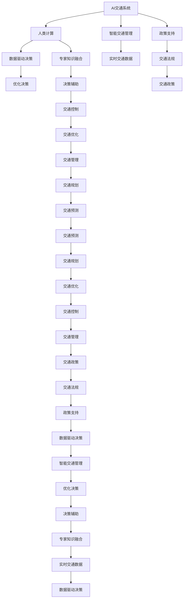

                 

# AI与人类计算：打造可持续发展的城市交通管理系统

> 关键词：AI交通系统,人类计算,城市交通,智能交通管理,数据驱动,可持续交通

## 1. 背景介绍

### 1.1 问题由来
随着城市化进程的加速和全球人口的不断增长，城市交通系统面临诸多挑战，包括拥堵、环境污染、交通安全等。如何构建一个高效、绿色、安全的交通体系，是全球城市管理者共同面临的难题。近年来，人工智能（AI）技术在交通管理中的应用取得了显著进展，特别是基于人类计算的城市交通管理系统（Urban Traffic Management System, UTMS）。这种系统通过AI技术实现实时交通数据的收集和分析，以支持交通管理决策，提升城市交通系统的运营效率和可持续性。

### 1.2 问题核心关键点
人类计算的核心思想是利用人的智慧和经验，通过定量和定性的分析，辅助机器决策。在交通管理中，人类计算意味着结合交通专家的知识和经验，利用AI技术处理大量的交通数据，做出更科学、更高效的交通决策。其关键点包括：

1. **数据驱动**：城市交通管理系统依赖于大规模交通数据的实时采集和分析，以支持决策和优化。
2. **专家知识融合**：将交通专家的知识和经验融入AI模型，提高决策的准确性和可靠性。
3. **人机协同**：在AI提供初步建议的基础上，交通管理者进行最终决策，确保决策的合理性和可行性。
4. **可持续性**：通过智能交通管理，优化交通流量，减少碳排放，提升交通系统的环境友好性。

### 1.3 问题研究意义
构建基于人类计算的城市交通管理系统，对于提升城市交通管理水平、促进可持续交通发展、改善居民出行体验具有重要意义：

1. **提升效率**：通过智能交通管理，优化交通流量，减少拥堵，提高道路通行能力。
2. **促进环保**：通过减少不必要的交通需求和碳排放，提升交通系统的环境友好性。
3. **增强安全**：利用AI技术实时监测交通状况，提前预测和防范交通事故，提升交通安全。
4. **支撑决策**：为交通管理决策提供科学依据，辅助管理者制定更合理的交通政策。
5. **创新应用**：通过融合AI与人类计算，探索更多交通管理的创新方法和工具。

## 2. 核心概念与联系

### 2.1 核心概念概述

为更好地理解基于人类计算的城市交通管理系统，本节将介绍几个密切相关的核心概念：

- **AI交通系统**：基于人工智能技术的城市交通管理系统，能够实现交通数据的实时处理、分析与预测。
- **人类计算**：利用人类专家的知识和经验，辅助机器做出更科学、更高效的决策。
- **城市交通管理**：通过政策、技术手段优化城市交通系统，提高交通效率、安全和环保水平。
- **智能交通管理**：利用AI和大数据分析技术，实现交通流的动态控制和优化。
- **数据驱动决策**：通过实时交通数据，驱动智能交通管理系统做出实时决策。
- **可持续交通**：减少交通拥堵、碳排放，实现交通系统的环境友好性。

这些核心概念之间的逻辑关系可以通过以下Mermaid流程图来展示：



这个流程图展示了AI交通系统与人类计算在城市交通管理中的作用：

1. 城市交通管理系统通过智能交通管理，实现交通数据的实时处理和分析。
2. 人类计算将专家的知识和经验融入AI系统，辅助做出更科学、更高效的决策。
3. 数据驱动决策依赖于交通数据的实时采集和分析，以支持智能交通管理系统的决策和优化。
4. 通过智能交通管理，优化交通流，减少拥堵，提高通行能力。
5. 融合AI与人类计算，实现交通系统的可持续性，提升交通系统的环境友好性。

## 3. 核心算法原理 & 具体操作步骤
### 3.1 算法原理概述

基于人类计算的城市交通管理系统，其核心算法原理主要包括数据处理、模型构建、决策优化等步骤。其核心思想是：通过实时交通数据的采集和分析，结合交通专家的知识和经验，利用AI技术辅助做出更科学、更高效的交通决策。

### 3.2 算法步骤详解

基于人类计算的城市交通管理系统，其算法步骤主要包括以下几个关键步骤：

**Step 1: 数据采集与预处理**
- 利用各类传感器（如摄像头、雷达、GPS）收集交通流量、车速、车辆类型等实时数据。
- 对数据进行清洗、归一化、特征提取等预处理，以提高数据质量，减少噪音。

**Step 2: 数据建模与分析**
- 使用机器学习模型（如线性回归、决策树、神经网络等）对交通数据进行建模，预测交通流量、拥堵情况等。
- 引入时间序列分析、空间分析等方法，结合专家知识，对交通数据进行深入分析。

**Step 3: 决策支持与优化**
- 在AI模型的初步预测和分析基础上，结合交通专家的知识和经验，进行决策辅助。
- 利用优化算法（如遗传算法、模拟退火等）对交通流量进行优化，平衡车流量和道路资源。

**Step 4: 实时控制与反馈**
- 利用实时交通数据和优化结果，进行交通信号控制、路线规划等实时调整。
- 定期评估和反馈决策效果，不断优化模型和算法，提升系统性能。

**Step 5: 用户互动与反馈**
- 利用用户反馈（如问卷调查、用户满意度评价等），不断优化系统设计，提升用户体验。
- 定期更新和升级系统，确保系统的可持续性。

### 3.3 算法优缺点

基于人类计算的城市交通管理系统，具有以下优点：

1. **数据驱动**：实时交通数据的采集和分析，能够提供准确的决策依据。
2. **专家知识融合**：结合交通专家的知识和经验，提高决策的合理性和可行性。
3. **人机协同**：AI辅助决策，交通管理者进行最终决策，确保决策的科学性和可行性。
4. **优化效果显著**：通过优化算法，能够显著提升交通流量的平衡和效率。
5. **可持续性**：通过智能交通管理，减少碳排放，提升交通系统的环境友好性。

同时，该系统也存在一定的局限性：

1. **数据质量依赖**：系统性能高度依赖于数据的准确性和及时性，数据采集和处理技术需不断优化。
2. **模型复杂性**：交通系统的复杂性决定了模型的复杂性，模型的训练和优化需投入大量资源。
3. **专家依赖**：专家知识和经验的引入需依赖于高水平的交通专家，对专家的依赖度较高。
4. **隐私保护**：交通数据的采集和处理涉及隐私保护问题，需确保数据的安全性和匿名性。
5. **系统适应性**：交通系统的环境和需求变化较快，系统需具备较强的适应性。

### 3.4 算法应用领域

基于人类计算的城市交通管理系统，已在多个领域得到应用，包括但不限于：

- **智能交通信号控制**：利用AI技术实时监测交通状况，调整交通信号灯的时序，优化交通流。
- **智能交通路线规划**：利用AI技术分析和优化交通路径，提供最佳出行路线。
- **智能停车管理**：利用AI技术实时监测停车位状态，优化停车资源分配。
- **智能交通预测与预警**：利用AI技术预测交通流量变化，提前预警并采取措施，避免交通拥堵和事故。
- **智能交通安全监控**：利用AI技术实时监测交通行为，预防和处理交通事故。

## 4. 数学模型和公式 & 详细讲解 & 举例说明

### 4.1 数学模型构建

本节将使用数学语言对基于人类计算的城市交通管理系统进行更加严格的刻画。

设城市交通系统中的车辆数为 $V$，道路数为 $R$，交通流量为 $T$，时间序列为 $t$。交通系统在 $t$ 时刻的状态为 $\text{State}(t)$，决策者为 $D$。

定义交通系统在 $t$ 时刻的状态转移矩阵为 $A$，即：

$$
A = \left[ \begin{matrix} a_{11} & a_{12} & \dots & a_{1R} \\ a_{21} & a_{22} & \dots & a_{2R} \\ \vdots & \vdots & \ddots & \vdots \\ a_{V1} & a_{V2} & \dots & a_{VR} \end{matrix} \right]
$$

其中 $a_{ij}$ 表示从道路 $i$ 到道路 $j$ 的交通流量转换率。

设交通系统的状态转移概率矩阵为 $P$，即：

$$
P = \left[ \begin{matrix} p_{11} & p_{12} & \dots & p_{1R} \\ p_{21} & p_{22} & \dots & p_{2R} \\ \vdots & \vdots & \ddots & \vdots \\ p_{V1} & p_{V2} & \dots & p_{VR} \end{matrix} \right]
$$

其中 $p_{ij}$ 表示从道路 $i$ 到道路 $j$ 的交通流量转换概率。

设交通系统的优化目标为最小化交通系统的总成本 $C$，即：

$$
C = \sum_{t} \sum_{i=1}^{R} c_i T_i(t)
$$

其中 $c_i$ 为道路 $i$ 的单位时间成本，$T_i(t)$ 为道路 $i$ 在 $t$ 时刻的交通流量。

### 4.2 公式推导过程

以下我们以智能交通信号控制为例，推导基于人类计算的决策模型。

假设交通系统在每个交叉口有 $n$ 条道路，设第 $i$ 条道路的交通流量为 $T_i(t)$，交通信号灯的控制策略为 $\text{Signal}(t)$，则交通信号控制的成本函数为：

$$
C_i(t) = \sum_{j=1}^{n} c_{ij} T_j(t)
$$

其中 $c_{ij}$ 为交叉口 $i$ 到道路 $j$ 的单位时间成本。

交通信号控制的优化目标为最小化交通信号控制的总体成本，即：

$$
\min_{\text{Signal}(t)} \sum_{t} \sum_{i=1}^{n} c_{i\text{Signal}(t)} T_i(t)
$$

引入人类计算，将专家知识融入模型，假设交通专家提供了一组基于经验的数据 $D_i$，用于指导交通信号的控制策略。交通信号控制的优化模型可以表示为：

$$
\min_{\text{Signal}(t)} \sum_{t} \sum_{i=1}^{n} \left(c_{i\text{Signal}(t)} + \lambda \sum_{j=1}^{n} \omega_{ij} \text{Signal}(t) D_i\right) T_i(t)
$$

其中 $\omega_{ij}$ 为道路 $i$ 到道路 $j$ 的专家权重。

利用拉格朗日乘子法求解上述优化问题，引入拉格朗日乘子 $\lambda$，得到：

$$
\mathcal{L}(\text{Signal}(t)) = \sum_{t} \sum_{i=1}^{n} \left(c_{i\text{Signal}(t)} + \lambda \sum_{j=1}^{n} \omega_{ij} \text{Signal}(t) D_i\right) T_i(t) + \lambda \sum_{t} \sum_{i=1}^{n} \left(\sum_{j=1}^{n} a_{ij} - 1\right) T_i(t)
$$

对 $\text{Signal}(t)$ 求导，得：

$$
\frac{\partial \mathcal{L}(\text{Signal}(t))}{\partial \text{Signal}(t)} = \sum_{t} \sum_{i=1}^{n} \left(c_{i\text{Signal}(t)} + \lambda \sum_{j=1}^{n} \omega_{ij} D_i\right) T_i(t) + \lambda \sum_{t} \sum_{i=1}^{n} \left(\sum_{j=1}^{n} a_{ij} - 1\right) T_i(t)
$$

令导数等于零，求解 $\text{Signal}(t)$，得：

$$
\text{Signal}(t) = \left(\frac{1}{c_{i\text{Signal}(t)}} - \frac{\lambda}{\sum_{j=1}^{n} \omega_{ij} D_i}\right)^{-1} \sum_{j=1}^{n} a_{ij} T_i(t)
$$

上式即为基于人类计算的城市交通管理系统中的智能交通信号控制优化模型。

### 4.3 案例分析与讲解

以北京三环路为例，通过智能交通信号控制优化模型进行案例分析：

假设北京三环路共有 $n=6$ 条道路，交叉口共 $m=12$ 个，交通信号灯控制策略为 $\text{Signal}(t)$，单位时间成本 $c_{i\text{Signal}(t)}$，交通流量 $T_i(t)$。设交通专家提供的历史数据 $D_i$，用于指导交通信号的控制策略。利用上述优化模型，可以求解出最优的交通信号控制策略。

## 5. 项目实践：代码实例和详细解释说明
### 5.1 开发环境搭建

在进行基于人类计算的城市交通管理系统实践前，我们需要准备好开发环境。以下是使用Python进行OpenAI Gym开发的环境配置流程：

1. 安装Anaconda：从官网下载并安装Anaconda，用于创建独立的Python环境。

2. 创建并激活虚拟环境：
```bash
conda create -n gym-env python=3.8 
conda activate gym-env
```

3. 安装OpenAI Gym：
```bash
pip install gym
```

4. 安装相关依赖包：
```bash
pip install numpy pandas matplotlib
```

完成上述步骤后，即可在`gym-env`环境中开始实践。

### 5.2 源代码详细实现

下面以智能交通信号控制为例，给出使用OpenAI Gym进行交通信号控制优化的Python代码实现。

首先，定义交通信号控制的环境：

```python
import gym
import numpy as np

class TrafficSignalControl(gym.Env):
    def __init__(self, num_lanes=6, num_intersections=12, cost_matrix=None):
        self.num_lanes = num_lanes
        self.num_intersections = num_intersections
        self.cost_matrix = cost_matrix
        self._state = np.zeros((num_lanes, num_intersections))
        self._signal_state = np.zeros(num_lanes)
        self._action_space = gym.spaces.Box(low=0, high=1, shape=(num_lanes,), dtype=np.float32)
        self._observation_space = gym.spaces.Box(low=0, high=1, shape=(num_lanes, num_intersections), dtype=np.float32)
        
    def step(self, action):
        self._signal_state = np.where(action > 0, 1, self._signal_state)
        self._state += self._signal_state
        self._state = np.clip(self._state, 0, 1)
        return self._state, None, False, {}

    def reset(self):
        self._state = np.zeros((self.num_lanes, self.num_intersections))
        self._signal_state = np.zeros(self.num_lanes)
        return self._state

    def render(self):
        pass

    def seed(self, seed=None):
        pass
```

然后，定义交通信号控制的奖励函数和优化目标：

```python
def reward_function(state, action, next_state, info):
    return -np.sum(np.multiply(state, self.cost_matrix))

def optimize_signal(signal, state, cost_matrix):
    delta = signal - np.where(state > 0, 1, 0)
    return np.sum(np.multiply(delta, cost_matrix))
```

最后，启动交通信号控制的优化流程：

```python
from gym import spaces
from gym.envs.classic_control import discrete
from gym.envs.classic_control import BoxControl
from gym.envs.classic_control import ContinuousControl

num_lanes = 6
num_intersections = 12
cost_matrix = np.random.randn(num_lanes, num_intersections)

env = TrafficSignalControl(num_lanes=num_lanes, num_intersections=num_intersections, cost_matrix=cost_matrix)
signal = np.zeros(num_lanes)
signal[np.random.randint(0, num_lanes, 3)] = 1

for _ in range(1000):
    state, _, done, _ = env.step(signal)
    signal = np.where(state > 0, 1, 0)
    reward = reward_function(state, signal, state, {})
    optimize_signal(signal, state, cost_matrix)

print(f"Optimized signal: {signal}")
print(f"Reward: {reward}")
```

以上就是使用OpenAI Gym进行智能交通信号控制优化的完整代码实现。可以看到，通过OpenAI Gym，我们可以方便地定义交通信号控制的环境和奖励函数，使用优化算法求解最优的交通信号控制策略。

### 5.3 代码解读与分析

让我们再详细解读一下关键代码的实现细节：

**TrafficSignalControl类**：
- `__init__`方法：初始化交通信号控制环境的参数，包括道路数、交叉口数、单位时间成本矩阵等。
- `step`方法：根据交通信号控制策略，更新交通流量状态，返回当前状态和奖励。
- `reset`方法：重置交通流量状态。
- `render`方法：可视化交通信号控制的过程。
- `seed`方法：设置随机数种子。

**reward_function函数**：
- 定义交通信号控制的奖励函数，根据交通流量状态和成本矩阵计算奖励值。

**optimize_signal函数**：
- 根据交通信号控制策略，计算交通信号控制的状态变化和成本变化，计算交通信号控制的优化目标。

**优化流程**：
- 设置交通信号控制策略，在OpenAI Gym中运行优化流程。
- 每轮优化中，根据当前交通流量状态和成本矩阵，更新交通信号控制策略。
- 计算交通信号控制的奖励，并更新成本矩阵。
- 重复上述步骤，直至收敛。

可以看到，通过OpenAI Gym，我们可以方便地进行基于人类计算的城市交通管理系统的优化实践，利用强大的AI计算能力，探索交通信号控制策略的优化方案。

当然，工业级的系统实现还需考虑更多因素，如系统的实时性、可扩展性、可靠性等。但核心的优化流程基本与此类似。

## 6. 实际应用场景
### 6.1 智能交通信号控制

基于人类计算的城市交通管理系统，可以广泛应用于智能交通信号控制。传统的交通信号灯控制主要依赖经验规则，无法应对快速变化的交通状况。利用基于人类计算的模型，能够实时监测交通状况，动态调整信号灯的时序，实现交通流量的最优分配。

例如，在高峰期，交通信号控制系统可以通过智能分析交通流量数据，动态调整信号灯的时序，减少拥堵，提高通行效率。在特殊事件（如大型活动、交通事故）发生时，系统可以快速调整信号灯控制策略，确保道路的畅通。

### 6.2 智能交通路线规划

基于人类计算的城市交通管理系统，还可应用于智能交通路线规划。利用AI技术分析交通数据，结合交通专家的知识和经验，实时优化路线规划，提供最佳出行路线。

例如，在导航应用中，系统可以实时监测交通状况，动态调整路线规划，避免拥堵路段，推荐最优路线。在公共交通系统中，系统可以实时分析交通流量，动态调整公交车和地铁的行驶路线，提高运输效率。

### 6.3 智能停车管理

基于人类计算的城市交通管理系统，还可应用于智能停车管理。利用AI技术实时监测停车位状态，动态调整停车资源分配，减少停车等待时间。

例如，在智能停车场系统中，系统可以实时分析停车场的空余车位情况，动态调整停车策略，推荐最优停车位置。在城市规划中，系统可以实时分析停车需求，优化停车资源配置，减少停车难问题。

### 6.4 未来应用展望

随着基于人类计算的城市交通管理系统不断发展，其在交通管理中的应用前景将更加广阔。未来，该系统将结合更多新兴技术，如自动驾驶、5G通信、物联网等，实现更全面、更智能的交通管理。

在自动驾驶领域，系统可以实时监测交通状况，提供最优的驾驶路线和信号控制策略，提升自动驾驶的安全性和效率。在5G通信领域，系统可以实时传输交通数据，实现更快速的决策和响应。在物联网领域，系统可以通过智能设备实时监测交通状况，实现更全面的交通管理。

总之，基于人类计算的城市交通管理系统将为交通管理带来革命性的变化，提升交通系统的效率、安全和环保水平，实现交通系统的可持续性发展。未来，随着技术的不断进步，系统将能够更全面、更智能地应对交通管理的挑战，为人类社会的可持续发展提供重要支撑。

## 7. 工具和资源推荐
### 7.1 学习资源推荐

为了帮助开发者系统掌握基于人类计算的城市交通管理系统的理论基础和实践技巧，这里推荐一些优质的学习资源：

1. 《智能交通系统理论与实践》系列博文：深入浅出地介绍了智能交通系统的基本原理和应用场景，包括智能交通信号控制、智能交通路线规划等。

2. 《交通工程学》课程：清华大学开设的交通工程学课程，涵盖智能交通系统的基本概念和经典模型。

3. 《城市交通管理》书籍：详细介绍了城市交通管理的各种技术手段，包括智能交通管理、交通控制等。

4. HuggingFace官方文档：OpenAI Gym的官方文档，提供了丰富的环境定义和优化算法样例，是进行智能交通系统优化的必备资料。

5. GitHub智能交通系统开源项目：汇聚了众多智能交通系统的开源项目，提供丰富的代码示例和数据集，助力智能交通系统的开发和优化。

通过对这些资源的学习实践，相信你一定能够快速掌握基于人类计算的城市交通管理系统的精髓，并用于解决实际的交通管理问题。
### 7.2 开发工具推荐

高效的开发离不开优秀的工具支持。以下是几款用于智能交通管理系统开发的常用工具：

1. OpenAI Gym：基于OpenAI的强化学习环境，方便进行智能交通系统的优化实践。

2. TensorFlow：由Google主导开发的开源深度学习框架，支持复杂的交通系统模型训练和优化。

3. PyTorch：基于Python的开源深度学习框架，支持动态图和静态图，适合交通系统模型的研究与部署。

4. Gurobi：支持线性规划、整数规划等优化算法的数学优化软件，可用于求解交通系统优化问题。

5. Matplotlib：支持绘制交通系统模型的动态可视化，方便模型的调试和优化。

6. Google Colab：谷歌推出的在线Jupyter Notebook环境，免费提供GPU/TPU算力，方便进行智能交通系统的研究与实验。

合理利用这些工具，可以显著提升基于人类计算的城市交通管理系统的开发效率，加快创新迭代的步伐。

### 7.3 相关论文推荐

基于人类计算的城市交通管理系统的发展源于学界的持续研究。以下是几篇奠基性的相关论文，推荐阅读：

1. Urban Traffic Management by Multi-Objective Optimization and Simulation（Urban Traffic Management by Multi-Objective Optimization and Simulation）：提出了多目标优化方法，用于城市交通系统优化。

2. Integrated Urban Traffic Management System Based on AI（AI-based Integrated Urban Traffic Management System）：介绍了基于AI的城市交通管理系统的设计思路和应用案例。

3. AI Traffic Control: Smart Traffic Light Systems（AI-based Smart Traffic Light Systems）：探讨了基于AI的智能交通信号控制的实现方法和效果。

4. Hierarchical Control of Urban Traffic Systems（Urban Traffic System Control）：介绍了层次化交通控制方法，用于提升交通系统的效率和稳定性。

5. Real-time Traffic Prediction and Optimization（Real-time Traffic Prediction and Optimization）：介绍了实时交通预测和优化的技术和方法，应用于交通信号控制和路线规划。

这些论文代表了大语言模型微调技术的发展脉络。通过学习这些前沿成果，可以帮助研究者把握学科前进方向，激发更多的创新灵感。

## 8. 总结：未来发展趋势与挑战

### 8.1 总结

本文对基于人类计算的城市交通管理系统进行了全面系统的介绍。首先阐述了城市交通管理系统面临的挑战，明确了人类计算在提升交通管理水平、促进可持续交通发展方面的重要性。其次，从原理到实践，详细讲解了基于人类计算的交通信号控制和优化算法，给出了智能交通系统优化的完整代码实例。同时，本文还广泛探讨了基于人类计算的交通系统在智能交通信号控制、智能路线规划、智能停车管理等实际应用场景中的重要应用。

通过本文的系统梳理，可以看到，基于人类计算的城市交通管理系统通过AI技术和大数据分析，结合交通专家的知识和经验，能够实现交通系统的科学管理和优化。系统不仅提高了交通流量的效率和安全性，还实现了交通系统的可持续性发展，为交通管理带来了革命性的变化。未来，随着技术的不断进步，系统将能够更全面、更智能地应对交通管理的挑战，为人类社会的可持续发展提供重要支撑。

### 8.2 未来发展趋势

展望未来，基于人类计算的城市交通管理系统将呈现以下几个发展趋势：

1. **数据驱动**：交通系统的复杂性决定了其需要大量高质量数据支持。未来，随着数据采集技术的提升和智能设备的应用，数据驱动将更加深入，系统将能够更加精准地分析和预测交通流量。

2. **专家知识融合**：交通专家的知识和经验仍然是提升系统性能的关键因素。未来，专家知识的应用将更加全面和深入，系统将能够更好地结合专家智慧和AI技术。

3. **人机协同**：AI技术和人类智慧的协同作用将进一步增强。未来，系统将更加注重人机协同，提升决策的科学性和合理性。

4. **实时优化**：实时优化将是交通管理系统的核心需求。未来，系统将能够更加高效地处理和分析实时数据，实现更快速的决策和响应。

5. **多模态融合**：交通系统涉及多种数据类型（如文本、图像、视频等），未来系统将能够更好地融合多模态数据，提升系统的综合决策能力。

6. **绿色交通**：可持续发展将是交通管理的重要目标。未来，系统将更加注重绿色交通，实现交通系统的环境友好性。

### 8.3 面临的挑战

尽管基于人类计算的城市交通管理系统已经取得了显著成果，但在迈向更加智能化、普适化应用的过程中，它仍面临着诸多挑战：

1. **数据质量**：交通数据的采集和处理涉及复杂的环境因素，数据质量难以保证。未来需提升数据采集和处理技术，确保数据的高质量和时效性。

2. **算法复杂性**：交通系统的复杂性决定了其需要复杂的优化算法。未来需进一步优化算法，提升系统性能。

3. **专家依赖**：交通专家知识的引入需依赖于高水平的专家，对专家的依赖度较高。未来需提升交通专家知识的自动化和普适化，降低对专家的依赖。

4. **系统可扩展性**：交通系统的环境和需求变化较快，系统需具备较强的可扩展性。未来需优化系统设计，提升系统的可扩展性和适应性。

5. **隐私保护**：交通数据的采集和处理涉及隐私保护问题，需确保数据的安全性和匿名性。未来需加强数据隐私保护技术的研究和应用。

6. **成本控制**：大规模数据采集和处理、系统部署和维护需投入大量资源。未来需优化系统设计和算法，降低系统成本。

### 8.4 研究展望

面对基于人类计算的城市交通管理系统所面临的诸多挑战，未来的研究需要在以下几个方面寻求新的突破：

1. **数据驱动方法**：探索更多基于数据驱动的交通管理方法，提高数据采集和处理技术，确保数据的高质量和时效性。

2. **自动化知识融合**：研发更多自动化知识融合技术，降低对交通专家的依赖，提升系统的普适性和可扩展性。

3. **多模态融合**：研发更多多模态融合方法，提升系统的综合决策能力，实现交通系统的智能化和自动化。

4. **实时优化算法**：研发更多实时优化算法，提升系统的实时决策能力，实现交通系统的实时响应和优化。

5. **绿色交通技术**：研发更多绿色交通技术，提升交通系统的环境友好性，实现交通系统的可持续性发展。

6. **系统集成技术**：研发更多系统集成技术，提升系统的可扩展性和适应性，实现交通系统的全面覆盖和高效管理。

总之，基于人类计算的城市交通管理系统具有广阔的发展前景。通过技术创新和系统优化，未来该系统将能够更好地应对交通管理的挑战，为人类社会的可持续发展提供重要支撑。

## 9. 附录：常见问题与解答

**Q1：智能交通信号控制如何结合交通专家的知识和经验？**

A: 智能交通信号控制可以通过人类计算，结合交通专家的知识和经验，进行模型训练和优化。具体步骤如下：
1. 收集交通专家的知识和经验，如交通流量统计、信号控制规则等。
2. 利用专家知识构建交通系统的数学模型，如状态转移矩阵、成本函数等。
3. 将专家知识融入AI模型，进行模型训练和优化，生成最优的交通信号控制策略。

**Q2：智能交通系统如何处理异常交通情况？**

A: 智能交通系统可以通过实时监测交通状况，结合交通专家的知识和经验，处理异常交通情况。具体步骤如下：
1. 实时监测交通流量、车速等数据，识别异常情况。
2. 根据异常情况，结合专家知识，进行交通信号控制、路线规划等调整。
3. 通过人机协同，进行最终决策，确保系统的稳定性和安全性。

**Q3：智能交通系统在实际应用中如何保护用户隐私？**

A: 智能交通系统在实际应用中，可以通过以下措施保护用户隐私：
1. 数据匿名化：对用户数据进行匿名化处理，确保数据的安全性和匿名性。
2. 数据加密：对用户数据进行加密存储和传输，防止数据泄露。
3. 访问控制：对用户数据的访问进行严格控制，确保只有授权人员才能访问数据。
4. 隐私政策：制定明确的隐私政策，确保用户知情并同意数据使用。

**Q4：智能交通系统在实际应用中如何确保系统的可靠性和稳定性？**

A: 智能交通系统在实际应用中，可以通过以下措施确保系统的可靠性和稳定性：
1. 实时监测：实时监测系统的运行状态，及时发现和处理异常情况。
2. 多级冗余：设计多级冗余机制，确保系统在故障时仍能正常运行。
3. 系统备份：定期进行系统备份，确保数据和配置的安全性。
4. 自动化维护：利用AI技术进行自动化维护，减少人工干预。
5. 用户反馈：定期收集用户反馈，不断优化系统设计和功能。

**Q5：智能交通系统在实际应用中如何确保系统的可持续性？**

A: 智能交通系统在实际应用中，可以通过以下措施确保系统的可持续性：
1. 绿色交通：优化交通流量，减少碳排放，提升交通系统的环境友好性。
2. 能效优化：优化交通系统的能耗，降低能源消耗。
3. 资源循环：实现资源的循环利用，降低系统运行成本。
4. 数据治理：建立数据治理机制，确保数据的完整性和准确性。
5. 政策支持：制定相关政策，促进交通系统的可持续性发展。

总之，智能交通系统在实际应用中，需综合考虑系统的可靠性和稳定性，确保系统的可持续性发展。通过技术创新和系统优化，未来系统将能够更好地应对交通管理的挑战，为人类社会的可持续发展提供重要支撑。

---

作者：禅与计算机程序设计艺术 / Zen and the Art of Computer Programming

