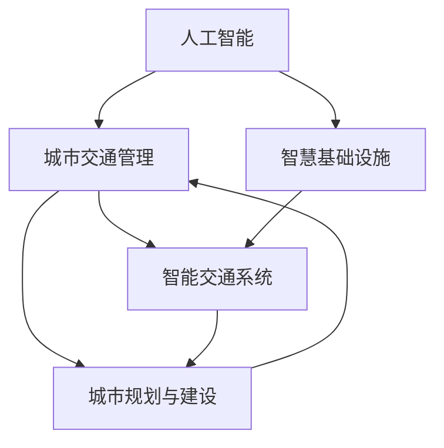

                 

# AI与人类计算：打造可持续发展的城市交通管理系统与基础设施建设规划

## 1. 背景介绍

随着城市化进程的加快，交通拥堵、环境污染、能耗过高、土地利用效率低下等“城市病”问题日益凸显。如何在保持城市经济高效运行的同时，改善城市居民的生活质量，构建可持续发展的城市交通体系，成为全球城市治理的重要课题。AI技术的发展为解决这些问题提供了新的突破口。借助AI的力量，可以打造高效、智能、环保的城市交通管理系统，提升城市基础设施建设规划的科学性和合理性。

### 1.1 问题由来
城市交通问题的根源在于人口、车辆、基础设施等要素的快速增长与城市规划、管理、治理的不匹配。传统城市交通管理方式以“以车为中心”的规则制定和执行为主，缺乏对人的行为和需求的深入理解和动态调整。而通过AI技术，可以更精准地理解城市交通需求的动态变化，优化交通信号控制，智能分配车辆资源，提供个性化出行服务，从而实现更智能、高效的城市交通体系。

### 1.2 问题核心关键点
AI在城市交通管理与基础设施建设规划中的应用主要包括以下几个关键点：

- **智能交通信号控制**：通过实时数据收集与分析，优化交通信号灯控制策略，减少交通堵塞。
- **交通流量预测与动态分配**：基于历史数据和实时反馈，预测交通流量，动态调整道路资源分配。
- **个性化出行服务**：利用AI算法分析用户行为，提供路线规划、导航、预约拼车服务，改善出行体验。
- **智慧基础设施建设**：通过AI技术对现有基础设施进行数字化、智能化改造，提升交通系统效率。
- **环境影响评估与管理**：分析交通活动对环境的影响，提出优化方案，减少能耗和污染。
- **规划决策支持**：利用AI模型进行数据驱动的交通与基础设施规划，提升决策的科学性和前瞻性。

## 2. 核心概念与联系

### 2.1 核心概念概述

为更好地理解AI在城市交通管理与基础设施建设规划中的应用，本节将介绍几个密切相关的核心概念：

- **人工智能(AI)**：利用计算机模拟人类智能过程，实现各种复杂任务的技术体系。AI的核心在于构建能够理解、学习、推理、决策的智能系统。
- **城市交通管理**：通过对交通系统的规划、控制和维护，保障交通的顺畅、安全和高效。
- **智慧基础设施**：利用信息通信技术对传统基础设施进行智能化改造，实现更高效、更灵活、更环保的使用。
- **智能交通系统**：结合计算机技术、通信技术、传感技术和自动控制技术，构建智能化的交通管理体系。
- **城市规划与建设**：通过对城市发展空间、形态、功能、产业等方面的科学规划，合理配置资源，提升城市综合竞争力。

这些核心概念之间的逻辑关系可以通过以下Mermaid流程图来展示：



这个流程图展示了一个完整的AI在城市交通管理与基础设施建设规划中的作用链：AI通过智能交通系统，改善城市交通管理，同时为智慧基础设施建设和城市规划提供决策支持。

## 3. 核心算法原理 & 具体操作步骤
### 3.1 算法原理概述

AI在城市交通管理与基础设施建设规划中的应用主要基于数据驱动和模型驱动两种方式：

- **数据驱动**：通过收集和分析交通数据，如车辆位置、速度、流量等，利用机器学习、深度学习等技术进行实时分析和预测，提供动态交通管理方案。
- **模型驱动**：构建交通和基础设施的数学模型，进行科学计算和仿真，优化城市规划和交通设计。

数据驱动和模型驱动相辅相成，共同构成了AI在城市交通领域的应用基础。

### 3.2 算法步骤详解

以下是AI在城市交通管理与基础设施建设规划中的具体操作步骤：

**Step 1: 数据收集与处理**

1. **数据来源**：交通监控系统、GPS定位数据、传感器数据、交通流量统计数据、气象数据等。
2. **数据清洗与预处理**：去除噪声数据，填补缺失值，标准化数据格式。
3. **特征工程**：提取有用的特征，如车辆速度、路段拥堵程度、交叉口流量等。

**Step 2: 模型选择与训练**

1. **选择模型**：根据具体应用场景选择合适的模型，如回归模型、分类模型、神经网络等。
2. **模型训练**：利用历史数据训练模型，调整模型参数，确保模型预测准确。
3. **模型评估**：在验证集上评估模型性能，选择性能最优的模型。

**Step 3: 模型应用与优化**

1. **实时数据输入**：将实时数据输入模型进行预测或仿真。
2. **动态调整策略**：根据模型预测结果，动态调整交通信号控制策略或基础设施资源分配。
3. **效果反馈**：收集模型应用结果，反馈至模型进行调整优化。

**Step 4: 结果评估与迭代**

1. **结果评估**：在测试集上评估模型应用效果，对比优化前后的性能提升。
2. **迭代改进**：根据评估结果，不断迭代优化模型，提升准确性和实用性。

### 3.3 算法优缺点

AI在城市交通管理与基础设施建设规划中的优势包括：

- **高效性**：实时数据处理和快速模型训练使得系统响应速度快。
- **精准性**：基于大量数据训练的模型能够提供高精度的预测结果。
- **可扩展性**：可以处理复杂多变的交通场景，提升系统灵活性。
- **决策支持**：为城市规划和交通设计提供科学依据，提升决策水平。

但同时也存在一些局限性：

- **数据依赖**：模型性能依赖高质量数据，数据缺失或不准确会影响模型效果。
- **高成本**：系统开发和维护需要大量资金和技术投入。
- **模型复杂**：大规模复杂模型可能导致解释性不足，难以调试和优化。
- **安全风险**：过度依赖AI可能导致系统出现未知错误，需要多重安全机制。

### 3.4 算法应用领域

AI在城市交通管理与基础设施建设规划中的应用领域非常广泛，具体包括：

- **智能交通信号控制**：如基于AI的交通流量预测与信号灯优化系统。
- **交通流量预测与动态分配**：如智能交通指挥系统，利用AI预测并动态调整交通流量。
- **个性化出行服务**：如基于AI的智能导航系统、预约拼车服务、自动驾驶系统。
- **智慧基础设施建设**：如智能道路系统、智能停车场、智能停车库等。
- **环境影响评估与管理**：如AI模型预测交通对环境的影响，提出优化方案。
- **规划决策支持**：如利用AI进行城市交通网络和基础设施的规划设计。

## 4. 数学模型和公式 & 详细讲解 & 举例说明

### 4.1 数学模型构建

为更好地理解AI在城市交通管理中的应用，本节将构建几个基本的数学模型：

1. **交通流量预测模型**：
   - 设定：$T_t = (t, F_t, V_t, D_t)$，其中 $t$ 为时间，$F_t$ 为路段流量，$V_t$ 为平均速度，$D_t$ 为交通需求。
   - 预测模型：$F_t = f(t, V_t, D_t)$。

2. **交通信号优化模型**：
   - 设定：$S_t = (t, L_t, C_t, T_t)$，其中 $t$ 为时间，$L_t$ 为绿灯时间，$C_t$ 为通行能力，$T_t$ 为红绿灯周期。
   - 优化模型：$L_t = g(t, F_t, C_t, T_t)$。

3. **环境影响评估模型**：
   - 设定：$E_t = (t, C_t, P_t, E_t)$，其中 $t$ 为时间，$C_t$ 为碳排放量，$P_t$ 为污染指数，$E_t$ 为能耗。
   - 评估模型：$E_t = h(t, C_t, P_t, E_t)$。

这些模型描述了城市交通的动态特征，提供了理论基础，用于指导实际应用。

### 4.2 公式推导过程

以下是对上述模型中一些基本公式的推导：

**交通流量预测模型**：
设 $F_t = f(t, V_t, D_t)$ 为交通流量预测模型，其中 $f$ 为线性回归函数。

$$
F_t = \beta_0 + \beta_1 V_t + \beta_2 D_t + \epsilon_t
$$

**交通信号优化模型**：
设 $L_t = g(t, F_t, C_t, T_t)$ 为交通信号优化模型，其中 $g$ 为线性规划函数。

$$
L_t = a_0 + a_1 F_t + a_2 C_t + a_3 T_t
$$

**环境影响评估模型**：
设 $E_t = h(t, C_t, P_t, E_t)$ 为环境影响评估模型，其中 $h$ 为非线性回归函数。

$$
E_t = \gamma_0 + \gamma_1 C_t + \gamma_2 P_t + \gamma_3 E_t
$$

以上公式通过历史数据训练模型，得到合适的参数 $\beta_i, a_i, \gamma_i$，可以用于预测交通流量、优化信号控制和评估环境影响。

### 4.3 案例分析与讲解

以智能交通信号控制系统为例，具体说明AI模型如何应用于实际场景：

1. **数据收集与预处理**：
   - 数据来源：交通监控摄像头、车辆GPS数据、信号灯状态记录等。
   - 数据清洗：去除异常值，处理缺失数据。
   - 特征工程：提取路段流量、平均速度、信号灯状态等特征。

2. **模型选择与训练**：
   - 选择模型：线性回归模型。
   - 训练模型：利用历史数据，训练回归模型，确定最优参数。

3. **模型应用与优化**：
   - 实时数据输入：将当前路段流量、平均速度、信号灯状态等输入模型。
   - 动态调整信号控制：根据模型输出，动态调整信号灯状态。

4. **结果评估与迭代**：
   - 结果评估：在测试集上评估模型效果，对比优化前后的交通流量和堵塞程度。
   - 迭代改进：根据评估结果，调整模型参数，提升模型性能。

## 5. 项目实践：代码实例和详细解释说明
### 5.1 开发环境搭建

在进行AI在城市交通管理与基础设施建设规划中的应用开发前，我们需要准备好开发环境。以下是使用Python进行PyTorch开发的环境配置流程：

1. 安装Anaconda：从官网下载并安装Anaconda，用于创建独立的Python环境。

2. 创建并激活虚拟环境：
```bash
conda create -n ai-env python=3.8 
conda activate ai-env
```

3. 安装PyTorch：根据CUDA版本，从官网获取对应的安装命令。例如：
```bash
conda install pytorch torchvision torchaudio cudatoolkit=11.1 -c pytorch -c conda-forge
```

4. 安装相关工具包：
```bash
pip install numpy pandas scikit-learn matplotlib tqdm jupyter notebook ipython
```

完成上述步骤后，即可在`ai-env`环境中开始开发实践。

### 5.2 源代码详细实现

下面我们以智能交通信号控制系统为例，给出使用PyTorch对模型进行训练和测试的PyTorch代码实现。

首先，定义数据处理函数：

```python
import numpy as np
from sklearn.model_selection import train_test_split
from sklearn.linear_model import LinearRegression

def process_data(data):
    X = []
    y = []
    for record in data:
        x = [record['flow'], record['speed'], record['demand']]
        y = record['signal']
        X.append(x)
        y.append(y)
    X = np.array(X)
    y = np.array(y)
    return train_test_split(X, y, test_size=0.2, random_state=42)

def fit_model(X_train, y_train):
    model = LinearRegression()
    model.fit(X_train, y_train)
    return model
```

然后，定义训练和评估函数：

```python
def train_model(model, X_train, y_train, X_test, y_test):
    model.fit(X_train, y_train)
    print('Training loss:', model.loss_)
    preds = model.predict(X_test)
    print('Test loss:', model.loss_)
    return preds, y_test

def evaluate_model(preds, y_test):
    print('Mean squared error:', np.mean((preds - y_test)**2))
```

最后，启动训练流程并在测试集上评估：

```python
data = get_data()  # 从数据库或API获取交通数据
X_train, X_test, y_train, y_test = process_data(data)
model = fit_model(X_train, y_train)
preds, y_test = train_model(model, X_train, y_train, X_test, y_test)
evaluate_model(preds, y_test)
```

以上就是使用PyTorch对智能交通信号控制系统进行训练和评估的完整代码实现。可以看到，通过简化的线性回归模型，我们可以实现基本的AI在城市交通管理中的应用。

### 5.3 代码解读与分析

让我们再详细解读一下关键代码的实现细节：

**process_data函数**：
- `process_data`函数对输入数据进行预处理，包括特征提取和数据划分。

**fit_model函数**：
- `fit_model`函数训练线性回归模型，得到模型参数。

**train_model函数**：
- `train_model`函数使用训练好的模型对测试集进行预测，并输出训练损失和测试损失。

**evaluate_model函数**：
- `evaluate_model`函数计算预测值与真实值之间的均方误差，评估模型性能。

**训练流程**：
- 获取交通数据，预处理数据
- 划分训练集和测试集
- 训练线性回归模型
- 在测试集上进行模型评估

可以看到，通过简单的线性回归模型，AI已经在城市交通管理中实现了基本的流量预测和信号控制。接下来，可以通过更复杂的模型，如深度学习模型、强化学习模型等，进一步提升系统性能。

## 6. 实际应用场景
### 6.1 智能交通信号控制

智能交通信号控制系统是AI在城市交通管理中最直接的应用之一。传统的信号灯控制策略依赖于人工制定的规则，难以实时应对交通流量变化。通过AI算法，可以实时分析交通流量，动态调整信号灯的绿灯时间，优化交通流畅度，减少交通堵塞。

具体实现上，可以将城市交通路口的摄像头、传感器等数据实时输入模型，预测下一时刻的流量和堵塞情况，动态调整信号灯周期。通过持续的数据收集和模型优化，可以实现更加高效的交通管理。

### 6.2 交通流量预测与动态分配

交通流量预测与动态分配系统可以实时分析交通网络中的数据，预测未来的流量趋势，动态调整车辆分配。传统系统依赖固定规则，无法适应交通需求的快速变化。通过AI模型，可以实现更加灵活的流量预测和动态分配，优化道路资源利用。

在实际应用中，可以利用历史交通数据和实时监控数据，训练流量预测模型，实时分析当前的交通流量情况，预测未来的流量变化，动态调整路段通行能力，平衡车辆分配，减少交通拥堵。

### 6.3 个性化出行服务

个性化出行服务系统通过AI算法分析用户的出行行为和偏好，提供定制化的出行方案，提升出行体验。传统出行服务依赖固定的路线规划，无法满足用户的多样化需求。通过AI系统，可以实时分析用户的出行历史和行为特征，提供个性化的路线推荐、拼车服务、导航服务等。

具体实现上，可以将用户的出行历史数据和实时位置信息输入模型，分析用户的出行偏好和行为模式，推荐最适合的出行路线和交通方式。通过持续的反馈和学习，可以不断优化个性化推荐，提升用户体验。

### 6.4 智慧基础设施建设

智慧基础设施建设通过AI技术对传统基础设施进行智能化改造，提升交通系统的效率和安全性。传统基础设施往往缺乏动态调整和智能化的能力，难以应对复杂的交通场景。通过AI技术，可以实现智能化的基础设施管理，提升道路、停车场、交通信号等资源利用效率。

具体实现上，可以通过传感器、摄像头等设备收集基础设施的实时数据，利用AI算法进行分析，优化交通信号控制、停车场管理、交通流量监测等，提升基础设施的智能化水平。

### 6.5 环境影响评估与管理

环境影响评估与管理系统通过AI模型分析交通活动对环境的影响，提出优化方案，减少能耗和污染。传统系统依赖人工评估，难以实时调整和优化。通过AI模型，可以实现实时环境影响评估，动态调整交通管理策略，降低交通活动对环境的负面影响。

具体实现上，可以将交通数据、气象数据、环境监测数据等输入模型，分析交通对环境的影响，提出优化方案，如调整交通流量、优化通行路线、改善交通信号控制等，减少能耗和污染。

## 7. 工具和资源推荐
### 7.1 学习资源推荐

为了帮助开发者系统掌握AI在城市交通管理与基础设施建设规划中的应用，这里推荐一些优质的学习资源：

1. **《智能交通系统》系列书籍**：深入介绍智能交通系统的各个环节，包括数据采集、传输、处理、分析和控制。
2. **《城市交通规划》系列课程**：涵盖城市交通规划的基本原理、方法和工具，提供丰富的案例分析。
3. **Kaggle竞赛平台**：参与智能交通相关的数据科学竞赛，积累实战经验。
4. **Coursera、edX等在线学习平台**：提供各类交通相关课程，涵盖AI技术、深度学习、交通工程等多个领域。
5. **GitHub代码库**：获取AI在城市交通管理中应用的代码实现，学习和复现优秀实践。

通过对这些资源的学习实践，相信你一定能够快速掌握AI在城市交通管理中的应用精髓，并用于解决实际的交通问题。

### 7.2 开发工具推荐

高效的开发离不开优秀的工具支持。以下是几款用于AI在城市交通管理与基础设施建设规划中应用的常用工具：

1. **PyTorch**：基于Python的开源深度学习框架，灵活动态的计算图，适合快速迭代研究。
2. **TensorFlow**：由Google主导开发的开源深度学习框架，生产部署方便，适合大规模工程应用。
3. **Keras**：简单易用的深度学习框架，适合快速构建和调试模型。
4. **scikit-learn**：Python机器学习库，提供丰富的算法和工具，适合快速原型开发。
5. **Jupyter Notebook**：交互式数据科学平台，支持Python、R等多种语言，适合代码开发和数据探索。

合理利用这些工具，可以显著提升AI在城市交通管理中的应用开发效率，加快创新迭代的步伐。

### 7.3 相关论文推荐

AI在城市交通管理与基础设施建设规划中的应用源于学界的持续研究。以下是几篇奠基性的相关论文，推荐阅读：

1. **《智能交通系统：理论与实践》**：系统介绍智能交通系统的理论和应用，涵盖数据采集、处理、分析和控制等方面。
2. **《基于深度学习的交通流量预测》**：利用深度神经网络进行交通流量预测，展示模型的准确性和泛化能力。
3. **《城市交通管理的AI技术应用》**：探讨AI在城市交通管理中的应用，包括智能信号控制、流量预测、个性化出行服务等。
4. **《智慧基础设施建设：AI技术的应用》**：分析AI在智慧基础设施建设中的应用，包括传感器部署、智能控制、数据分析等方面。
5. **《基于AI的环境影响评估与管理》**：利用AI模型分析交通活动对环境的影响，提出优化方案，减少能耗和污染。

这些论文代表了大语言模型微调技术的发展脉络。通过学习这些前沿成果，可以帮助研究者把握学科前进方向，激发更多的创新灵感。

## 8. 总结：未来发展趋势与挑战
### 8.1 总结

本文对AI在城市交通管理与基础设施建设规划中的应用进行了全面系统的介绍。首先阐述了AI在城市交通管理中的重要性，明确了其在智能交通信号控制、交通流量预测、个性化出行服务、智慧基础设施建设、环境影响评估与管理等多个领域的应用价值。其次，从原理到实践，详细讲解了AI在城市交通管理中的应用流程，给出了具体的模型构建和代码实现。同时，本文还探讨了AI在城市交通管理中的实际应用场景，展示了AI技术在构建高效、智能、环保的城市交通体系中的潜力。

通过本文的系统梳理，可以看到，AI技术在城市交通管理与基础设施建设规划中的应用已经逐渐成熟，为城市交通体系的智能化、高效化和绿色化提供了新的可能性。未来，随着AI技术的进一步发展，城市交通管理将更加智能、高效和环保，为城市的可持续发展注入新的动力。

### 8.2 未来发展趋势

展望未来，AI在城市交通管理与基础设施建设规划中的应用将呈现以下几个发展趋势：

1. **智能化水平提升**：通过更复杂的AI算法和大规模数据训练，提升系统的智能化水平，实现更精准的流量预测和信号控制。
2. **环境友好型系统**：利用AI技术优化交通流量，减少能耗和污染，推动绿色交通发展。
3. **个性化出行服务普及**：通过AI算法深入分析用户行为，提供更个性化、智能化的出行服务，提升用户体验。
4. **智慧基础设施普及**：利用AI技术改造传统基础设施，实现更高效、智能、环保的使用，提升城市运行效率。
5. **多模态数据融合**：结合图像、声音、位置等多模态数据，提升系统的感知和决策能力。
6. **跨领域技术融合**：与其他AI技术如自动驾驶、智能物流等结合，推动更广泛的智能应用落地。

以上趋势凸显了AI在城市交通管理中的广阔前景。这些方向的探索发展，必将进一步提升AI在城市交通管理中的应用效果，为城市可持续发展注入新的活力。

### 8.3 面临的挑战

尽管AI在城市交通管理与基础设施建设规划中的应用取得了显著成效，但在迈向更加智能化、普适化应用的过程中，它仍面临着诸多挑战：

1. **数据质量与获取**：高质量的交通数据对于AI模型的性能至关重要，但获取和处理大规模交通数据需要投入大量资源。
2. **系统复杂性**：复杂的交通场景和多样的交通需求，增加了AI系统的开发和维护难度。
3. **安全性与隐私**：AI系统处理大量个人数据，需要确保数据安全和隐私保护。
4. **伦理与社会影响**：AI在城市交通管理中的应用可能带来新的伦理和社会问题，需要综合考虑。
5. **模型可解释性**：AI系统的复杂性使得模型解释和调试变得困难，影响系统的可信度。

这些挑战需要各方协同努力，共同解决，才能实现AI技术在城市交通管理中的高效应用。

### 8.4 研究展望

面对AI在城市交通管理与基础设施建设规划中面临的挑战，未来的研究需要在以下几个方面寻求新的突破：

1. **数据高效获取与处理**：探索自动化数据采集与处理技术，提高数据获取效率和质量。
2. **模型可解释性**：开发更透明、可解释的AI模型，增强系统可信度和用户接受度。
3. **跨学科融合**：与其他学科如城市规划、环境科学等结合，提升AI系统的全面性。
4. **伦理与社会影响研究**：深入研究AI技术在城市交通管理中的应用伦理与社会影响，提出合理的政策建议。
5. **智慧基础设施建设**：探索智慧基础设施建设的新模式，实现基础设施的智能化和可持续发展。

这些研究方向的探索，必将引领AI技术在城市交通管理与基础设施建设规划中的应用走向成熟，为构建安全、高效、绿色、智能的城市交通体系提供强有力的技术支撑。

## 9. 附录：常见问题与解答

**Q1：AI在城市交通管理中的数据来源有哪些？**

A: AI在城市交通管理中的数据来源主要包括：

- **交通监控摄像头**：采集车辆、行人、道路等的实时图像和视频数据。
- **车辆GPS数据**：记录车辆位置、速度、路线等交通信息。
- **传感器数据**：采集交通流量、红绿灯状态、道路状况等信息。
- **气象数据**：记录温度、湿度、风速等气象数据，影响交通流量和车辆行为。
- **城市地理信息数据**：提供道路、建筑、设施等地理信息，辅助数据分析和模型构建。

通过多源数据的融合，可以全面了解城市交通的动态特征，为AI模型的训练和优化提供可靠依据。

**Q2：如何提高AI在城市交通管理中的数据质量？**

A: 提高AI在城市交通管理中的数据质量，主要从以下几方面入手：

- **数据清洗**：去除噪声数据，处理缺失值，提高数据的准确性。
- **数据标准化**：统一数据格式和单位，便于数据的整合和分析。
- **数据增补**：利用数据插值和补全技术，填补缺失数据，提高数据完整性。
- **数据融合**：结合不同数据源的信息，进行数据融合，提高数据的多样性和可靠性。
- **数据标注**：对数据进行标注，提高数据的可解释性和可用性。

通过数据清洗、标准化、增补、融合和标注，可以提高数据的质量，为AI模型的训练和优化提供坚实的基础。

**Q3：AI在城市交通管理中的模型训练需要哪些步骤？**

A: AI在城市交通管理中的模型训练主要包括以下几个步骤：

1. **数据准备**：收集和处理交通数据，划分训练集、验证集和测试集。
2. **模型选择**：根据具体应用场景选择合适的模型，如回归模型、分类模型、神经网络等。
3. **模型训练**：利用历史数据训练模型，调整模型参数，优化模型性能。
4. **模型评估**：在验证集上评估模型性能，选择性能最优的模型。
5. **模型优化**：根据评估结果，对模型进行迭代优化，提升模型效果。

通过这些步骤，可以构建高效的AI模型，实现城市交通管理的智能化和高效化。

**Q4：AI在城市交通管理中的应用效果如何评估？**

A: AI在城市交通管理中的应用效果评估主要从以下几个方面进行：

1. **流量预测准确性**：比较模型预测的流量与实际流量之间的差异，评估模型的准确性。
2. **信号控制优化效果**：比较模型控制的信号灯周期与实际信号灯周期之间的差异，评估信号控制效果。
3. **个性化出行服务质量**：比较模型推荐的路线、拼车服务、导航服务等与实际出行服务之间的差异，评估服务质量。
4. **智慧基础设施建设效果**：比较智能基础设施的使用效果与传统基础设施之间的差异，评估智慧基础设施建设效果。
5. **环境影响评估结果**：比较模型预测的环境影响与实际影响之间的差异，评估环境影响评估结果。

通过这些评估指标，可以全面了解AI在城市交通管理中的应用效果，发现和解决存在的问题，不断优化模型性能。

**Q5：AI在城市交通管理中的安全性如何保障？**

A: AI在城市交通管理中的安全性保障主要从以下几个方面进行：

1. **数据安全**：采用数据加密、访问控制等技术，确保数据在传输和存储过程中的安全。
2. **模型安全**：采用模型水印、模型防篡改等技术，防止模型被恶意篡改和攻击。
3. **系统安全**：采用入侵检测、异常监控等技术，防止系统被攻击和破坏。
4. **隐私保护**：采用数据匿名化、隐私计算等技术，确保用户隐私不被泄露。
5. **法律法规合规**：遵守相关法律法规，确保AI系统的合法合规使用。

通过这些技术手段，可以保障AI系统在城市交通管理中的应用安全性，降低风险，保障系统稳定运行。

---

作者：禅与计算机程序设计艺术 / Zen and the Art of Computer Programming

