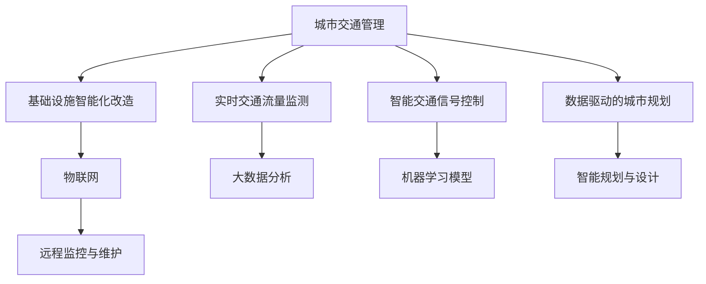

                 

# AI与人类计算：打造可持续发展的城市交通管理系统与基础设施建设规划

## 1. 背景介绍

### 1.1 问题由来

随着城市化进程的不断加快，全球各地都面临着城市交通拥堵、基础设施老旧等日益严峻的问题。这些问题不仅导致城市生活成本上升，也极大地制约了经济发展的速度和效率。然而，传统的人力管理模式已难以应对如此庞大的系统管理需求，迫切需要引入智能技术以提升城市的运行效率和可持续发展能力。

AI技术，尤其是大数据、机器学习和深度学习的飞速发展，为解决城市交通管理与基础设施建设中的诸多难题提供了新的思路和方法。通过智能化手段，可以实现对交通流量、环境污染等关键指标的实时监测与预测，为城市管理提供数据支撑；通过智能规划与设计，可以优化城市布局与资源配置，提升基础设施的利用效率和建设质量。

### 1.2 问题核心关键点

在AI驱动的城市交通管理与基础设施建设规划中，关键点包括：

- 实时交通流量监测与预测：通过AI技术，实时收集和分析交通数据，准确预测未来交通流量，为交通疏导和调度提供科学依据。
- 智能交通信号控制：利用机器学习模型，优化交通信号灯的控制策略，提高道路通行效率。
- 基础设施智能化改造：通过物联网技术，对桥梁、隧道等基础设施进行智能化改造，提升安全性和维护效率。
- 数据驱动的城市规划：基于AI技术，对大量城市数据进行分析，指导城市规划与设计。

这些关键点相互关联，共同构建起智能城市交通管理与基础设施建设的基石。

## 2. 核心概念与联系

### 2.1 核心概念概述

为了更好地理解AI与人类计算在城市交通管理与基础设施建设中的作用，本节将介绍几个核心概念：

- **城市交通管理**：指通过科技手段对城市交通进行规划、组织和调控，以提高交通效率、降低交通拥堵和环境污染。
- **基础设施建设规划**：指在城市发展中，对道路、桥梁、隧道、公交等基础设施进行科学规划和合理布局，以适应城市化进程和居民需求。
- **AI与机器学习**：指通过训练算法模型，从海量数据中学习规律，自动化地完成数据分析和决策过程。
- **物联网(IoT)**：指通过互联网将各种传感器和设备连接起来，实现对基础设施的远程监控和管理。
- **智慧城市**：指在城市管理中广泛应用AI、物联网、大数据等技术，实现高效、可持续的城市运行模式。

这些核心概念之间的逻辑关系可以通过以下Mermaid流程图来展示：



这个流程图展示了几大核心概念之间的关系：

1. 城市交通管理通过实时交通流量监测、智能交通信号控制等手段，提升道路通行效率。
2. 基础设施智能化改造通过物联网技术实现远程监控与维护，提升安全性和维护效率。
3. 数据驱动的城市规划通过大数据分析和智能规划与设计，优化城市布局和资源配置。
4. 物联网、大数据分析和机器学习模型在各个环节中发挥着重要作用。

## 3. 核心算法原理 & 具体操作步骤

### 3.1 算法原理概述

基于AI与人类计算的城市交通管理系统与基础设施建设规划，本质上是一个多学科交叉、数据驱动的决策支持系统。其核心算法原理包括：

- **实时交通流量监测与预测**：利用机器学习模型，从传感器数据中学习交通流量的规律，预测未来的流量变化。
- **智能交通信号控制**：使用强化学习等方法，优化交通信号灯的控制策略，提升道路通行效率。
- **基础设施智能化改造**：通过物联网技术，实现对基础设施的远程监控和实时数据采集，指导维护决策。
- **数据驱动的城市规划**：基于城市大数据，运用AI技术进行建模分析，提供科学的城市规划建议。

这些算法原理共同构成了城市交通管理与基础设施建设规划的决策基础。

### 3.2 算法步骤详解

基于AI与人类计算的城市交通管理系统与基础设施建设规划，一般包括以下几个关键步骤：

**Step 1: 数据收集与处理**

- 收集城市交通流量、环境污染、基础设施状态等各类数据。
- 对数据进行清洗、归一化处理，去除噪声和异常值。
- 利用传感器和监测设备，实现数据的实时采集和传输。

**Step 2: 数据建模与分析**

- 建立交通流量预测模型，使用历史数据训练模型，预测未来流量。
- 设计交通信号控制模型，通过实时流量数据调整信号灯控制策略。
- 进行基础设施状态分析，评估桥梁、隧道等结构的安全性和使用效率。
- 基于城市大数据，构建城市规划模型，进行空间布局与资源配置优化。

**Step 3: 模型训练与优化**

- 使用机器学习算法，如回归模型、决策树、神经网络等，训练交通流量预测和信号控制模型。
- 应用强化学习算法，优化交通信号控制策略，提升道路通行效率。
- 利用深度学习模型，分析基础设施状态数据，进行健康评估和维护决策。
- 结合城市大数据，运用AI技术进行建模和分析，提供科学的城市规划建议。

**Step 4: 模型部署与应用**

- 将训练好的模型部署到实际交通管理系统和基础设施监测平台。
- 实时监测交通流量、环境污染等关键指标，指导交通调度与信号控制。
- 实现基础设施的远程监控与维护，提升安全性和使用效率。
- 基于模型分析结果，指导城市规划与设计，优化城市布局与资源配置。

**Step 5: 持续优化与迭代**

- 定期收集新的数据，重新训练和优化模型，确保模型的准确性和时效性。
- 结合用户反馈和实际情况，不断调整和优化模型，提升应用效果。
- 引入新技术和新算法，提升系统的智能化水平和用户体验。

以上是基于AI与人类计算的城市交通管理系统与基础设施建设规划的一般流程。在实际应用中，还需要针对具体任务的特点，对各个环节进行优化设计，如改进数据采集方式、选择合适的优化算法等，以进一步提升系统性能。

### 3.3 算法优缺点

基于AI与人类计算的城市交通管理系统与基础设施建设规划，具有以下优点：

1. **提升交通效率**：通过实时流量监测与预测，智能交通信号控制，可以显著提升道路通行效率，减少交通拥堵。
2. **降低环境污染**：通过智能交通管理，优化车流量分布，减少车辆排放，降低环境污染。
3. **提高基础设施使用效率**：通过基础设施智能化改造和远程监控，提升桥梁、隧道等基础设施的安全性和使用效率。
4. **优化城市规划**：基于数据驱动的城市规划，可以科学指导城市布局与资源配置，提升城市运行效率。

同时，该方法也存在一定的局限性：

1. **数据质量要求高**：交通流量监测和环境污染数据的质量直接影响模型的预测和控制效果。
2. **模型复杂度较高**：高精度模型需要大量计算资源和数据存储，对硬件设备的要求较高。
3. **实施成本较高**：基础设施智能化改造和AI系统建设需要较大投入，短期内成本较高。
4. **系统维护复杂**：模型和系统的维护需要专业知识和技术支持，维护成本较高。

尽管存在这些局限性，但就目前而言，基于AI与人类计算的交通管理系统与基础设施规划方法仍是最主流的选择。未来相关研究的重点在于如何进一步降低数据和算力成本，提高模型的可靠性和可维护性，同时兼顾可解释性和伦理安全性等因素。

### 3.4 算法应用领域

基于AI与人类计算的城市交通管理系统与基础设施规划方法，在城市交通管理、环境保护、基础设施建设等领域已经得到了广泛的应用：

- **交通流量监测与控制**：应用于智能交通信号灯控制系统，实现对交通流量的实时监测和智能控制。
- **环境污染监测与治理**：应用于空气质量、水质等环境污染的监测和预警，指导环境治理措施。
- **基础设施安全与维护**：应用于桥梁、隧道等基础设施的智能化改造和远程监控，提升安全性和维护效率。
- **城市规划与设计**：应用于城市数据驱动的规划和设计，指导城市布局优化和资源配置。
- **应急管理**：应用于突发事件（如交通拥堵、事故）的应急响应和疏导，提升应急处置能力。

除了上述这些经典应用外，AI与人类计算的城市交通管理与基础设施规划方法也被创新性地应用到更多场景中，如智慧停车、共享单车、智慧垃圾处理等，为城市管理带来了全新的突破。

## 4. 数学模型和公式 & 详细讲解

### 4.1 数学模型构建

本节将使用数学语言对基于AI与人类计算的城市交通管理系统与基础设施规划过程进行更加严格的刻画。

记城市交通流量为 $f(t)$，其中 $t$ 表示时间。定义交通流量监测点 $i$ 在时间 $t$ 的监测值为 $f_i(t)$，则城市交通流量的总体数据可以表示为：

$$
\mathbf{f} = \{f_i(t)\}_{i \in I, t \in T}
$$

其中 $I$ 表示监测点的集合，$T$ 表示时间的集合。交通流量的历史数据可以表示为 $\mathbf{f}_{train}$，未来流量的预测数据可以表示为 $\mathbf{f}_{test}$。

定义交通信号控制模型为 $g(s)$，其中 $s$ 表示交通信号状态（如红绿灯状态），$g$ 映射到车辆通行效率 $e$。则交通信号控制的目标可以表示为：

$$
\mathop{\min}_{s} \mathcal{L}(e,g(s))
$$

其中 $\mathcal{L}$ 为损失函数，用于衡量信号控制状态对通行效率的影响。

基础设施状态分析模型可以表示为 $h(i)$，其中 $i$ 表示基础设施状态（如桥梁、隧道结构状况），$h$ 映射到维护成本和安全性 $c$。则基础设施状态分析的目标可以表示为：

$$
\mathop{\min}_{i} \mathcal{L}(c,h(i))
$$

其中 $\mathcal{L}$ 为损失函数，用于衡量基础设施状态对维护成本和安全性的影响。

基于城市大数据，构建城市规划模型可以表示为 $\pi(r)$，其中 $r$ 表示城市资源配置（如土地、交通网络），$\pi$ 映射到城市运行效率 $p$。则城市规划的目标可以表示为：

$$
\mathop{\max}_{r} \mathcal{P}(p,\pi(r))
$$

其中 $\mathcal{P}$ 为性能函数，用于衡量城市规划对运行效率的影响。

### 4.2 公式推导过程

以下我们以交通流量预测模型为例，推导回归模型的训练和预测公式。

假设交通流量数据 $f(t)$ 为时间 $t$ 的函数，可以表示为线性回归模型：

$$
f(t) = \alpha + \beta t + \epsilon
$$

其中 $\alpha$ 为截距，$\beta$ 为斜率，$\epsilon$ 为误差项。

将历史数据 $\mathbf{f}_{train}$ 代入模型，得到训练样本 $(t_i, f_i)$，$i \in I$。则训练目标可以表示为：

$$
\mathcal{L}(\alpha, \beta) = \frac{1}{N}\sum_{i=1}^N (f_i - (\alpha + \beta t_i))^2
$$

对 $\alpha$ 和 $\beta$ 求偏导数，得到：

$$
\frac{\partial \mathcal{L}}{\partial \alpha} = -\frac{2}{N}\sum_{i=1}^N (f_i - (\alpha + \beta t_i))
$$

$$
\frac{\partial \mathcal{L}}{\partial \beta} = -\frac{2}{N}\sum_{i=1}^N (t_i (f_i - (\alpha + \beta t_i)))
$$

将偏导数代入模型，得到参数更新公式：

$$
\alpha \leftarrow \alpha - \eta \frac{1}{N}\sum_{i=1}^N (f_i - (\alpha + \beta t_i))
$$

$$
\beta \leftarrow \beta - \eta \frac{1}{N}\sum_{i=1}^N (t_i (f_i - (\alpha + \beta t_i)))
$$

其中 $\eta$ 为学习率，$N$ 为样本数量。

模型训练过程中，采用随机梯度下降等优化算法，逐步更新参数 $\alpha$ 和 $\beta$，最小化损失函数 $\mathcal{L}$，最终得到适应未来交通流量的模型参数 $\alpha^*$ 和 $\beta^*$。在实际应用中，将新时间 $t$ 代入模型，即可计算预测的交通流量 $f(t)$。

## 5. 项目实践：代码实例和详细解释说明

### 5.1 开发环境搭建

在进行城市交通管理与基础设施规划的AI与人类计算实践前，我们需要准备好开发环境。以下是使用Python进行TensorFlow和Keras开发的环境配置流程：

1. 安装Anaconda：从官网下载并安装Anaconda，用于创建独立的Python环境。

2. 创建并激活虚拟环境：
```bash
conda create -n ai-env python=3.8 
conda activate ai-env
```

3. 安装TensorFlow：根据CUDA版本，从官网获取对应的安装命令。例如：
```bash
conda install tensorflow=2.6
```

4. 安装Keras：
```bash
pip install keras
```

5. 安装各类工具包：
```bash
pip install numpy pandas scikit-learn matplotlib tqdm jupyter notebook ipython
```

完成上述步骤后，即可在`ai-env`环境中开始AI与人类计算的实践。

### 5.2 源代码详细实现

下面我们以交通流量预测模型为例，给出使用TensorFlow和Keras进行模型训练的PyTorch代码实现。

首先，定义数据处理函数：

```python
import pandas as pd
import numpy as np

def load_data(file_path):
    data = pd.read_csv(file_path, sep=',')
    time = data['time'].values.reshape(-1, 1)
    flow = data['flow'].values.reshape(-1, 1)
    return time, flow
```

然后，定义模型：

```python
from tensorflow.keras.models import Sequential
from tensorflow.keras.layers import Dense, LSTM

model = Sequential()
model.add(LSTM(50, return_sequences=True, input_shape=(X_train.shape[1], 1)))
model.add(Dense(1))
model.compile(optimizer='adam', loss='mse')
```

接着，定义训练和评估函数：

```python
def train_model(model, X_train, y_train, X_test, y_test, epochs=10):
    model.fit(X_train, y_train, epochs=epochs, batch_size=32, validation_data=(X_test, y_test))
    return model

def evaluate_model(model, X_test, y_test):
    mse = np.mean((model.predict(X_test) - y_test) ** 2)
    print(f'Mean Squared Error: {mse:.4f}')
```

最后，启动训练流程并在测试集上评估：

```python
X_train, y_train = load_data('train.csv')
X_test, y_test = load_data('test.csv')

epochs = 10
model = train_model(model, X_train, y_train, X_test, y_test, epochs)
evaluate_model(model, X_test, y_test)
```

以上就是使用TensorFlow和Keras进行交通流量预测模型的完整代码实现。可以看到，TensorFlow和Keras的强大封装使得模型训练和评估变得简洁高效。

### 5.3 代码解读与分析

让我们再详细解读一下关键代码的实现细节：

**load_data函数**：
- 定义了数据加载函数，将CSV文件中的时间-流量数据转换为Numpy数组。

**模型定义**：
- 定义了基于LSTM的回归模型，包含一个LSTM层和一个全连接层，使用MSE损失函数和Adam优化器进行训练。

**train_model函数**：
- 定义了模型训练函数，将数据分为训练集和测试集，使用交叉验证和Adam优化器进行训练。

**evaluate_model函数**：
- 定义了模型评估函数，计算测试集上的均方误差，输出结果。

**训练流程**：
- 加载训练集和测试集，定义模型，设置训练轮数。
- 调用训练函数进行模型训练。
- 调用评估函数在测试集上评估模型性能。

可以看到，TensorFlow和Keras提供了强大的工具库，可以方便地构建、训练和评估AI与人类计算模型。开发者可以将更多精力放在数据处理、模型改进等高层逻辑上，而不必过多关注底层的实现细节。

当然，工业级的系统实现还需考虑更多因素，如模型的保存和部署、超参数的自动搜索、更灵活的任务适配层等。但核心的AI与人类计算模型构建基本与此类似。

## 6. 实际应用场景

### 6.1 智能交通信号控制

智能交通信号控制是AI与人类计算在城市交通管理中的重要应用场景。通过实时监测交通流量，动态调整信号灯的控制策略，可以显著提升道路通行效率，减少交通拥堵。

在技术实现上，可以部署大量传感器和摄像头，实时采集交通数据。利用机器学习模型，对交通流量进行预测和分析，生成最优信号控制方案。通过信号灯控制系统，自动调整信号灯状态，实现交通流的动态管理。例如，在拥堵路段增加绿灯时长，提高通行效率；在非高峰时段减少信号灯数量，减少车辆等待时间。

### 6.2 基础设施智能化改造

基础设施智能化改造是AI与人类计算在城市交通管理中的另一重要应用场景。通过物联网技术，对桥梁、隧道等基础设施进行远程监控和状态分析，可以显著提升安全性和维护效率。

在技术实现上，可以在桥梁、隧道等关键位置安装传感器和摄像头，实时采集结构状态和环境数据。利用深度学习模型，对数据进行分析和预测，识别出潜在的安全隐患。通过远程监控系统，实时监测基础设施状态，生成维护建议。例如，在桥梁结构出现异常时，立即预警，通知维护人员进行处理。

### 6.3 城市规划与设计

数据驱动的城市规划是AI与人类计算在城市管理中的重要应用场景。通过分析大量的城市数据，可以科学指导城市布局与资源配置，提升城市运行效率。

在技术实现上，可以收集城市人口、交通流量、环境污染等各类数据，构建城市大数据模型。利用AI技术，对数据进行建模和分析，生成城市规划建议。例如，根据交通流量数据，优化城市路网布局；根据人口分布，优化城市用地配置；根据环境污染数据，优化城市绿化布局。

### 6.4 未来应用展望

随着AI与人类计算技术的不断进步，基于AI与人类计算的城市交通管理系统与基础设施规划方法将呈现以下几个发展趋势：

1. **自动化和智能化水平提升**：通过更加先进的数据采集和处理技术，提升交通管理和基础设施管理的自动化和智能化水平，减少人工干预，提高系统运行效率。
2. **跨领域融合**：将AI与人类计算与物联网、大数据等技术进行融合，构建更加全面的城市管理平台，提升系统决策的科学性和准确性。
3. **实时预测与决策**：通过更加先进的机器学习和强化学习算法，提升交通流量预测和信号控制的精度，实现实时预测和决策，提高系统的响应速度。
4. **系统鲁棒性提升**：通过更加全面的数据验证和模型验证，提升系统的鲁棒性和可靠性，确保系统在各种场景下的稳定运行。
5. **用户友好性提升**：通过更加友好的用户界面和交互方式，提升系统的易用性和用户体验，增强用户对系统的信任度和满意度。

以上趋势凸显了AI与人类计算技术在城市交通管理与基础设施规划中的广阔前景。这些方向的探索发展，必将进一步提升城市交通管理系统与基础设施规划的智能化水平，为构建智慧城市提供有力支持。

## 7. 工具和资源推荐
### 7.1 学习资源推荐

为了帮助开发者系统掌握AI与人类计算在城市交通管理与基础设施建设中的原理和实践，这里推荐一些优质的学习资源：

1. 《深度学习》系列书籍：由Ian Goodfellow等作者编写，全面介绍了深度学习的理论和实践，是AI领域的经典之作。
2. CS231n《卷积神经网络》课程：斯坦福大学开设的计算机视觉课程，深入浅出地讲解了卷积神经网络的原理和应用。
3. 《智慧城市》系列文章：多篇深度文章，探讨了AI与人类计算在智慧城市中的应用场景和实现方法，涵盖了交通管理、基础设施建设等多个领域。
4. TensorFlow官方文档：TensorFlow的官方文档，提供了丰富的教程和样例，适合初学者和高级开发者。
5. Keras官方文档：Keras的官方文档，提供了简单易用的API，适合快速构建和训练模型。

通过对这些资源的学习实践，相信你一定能够系统掌握AI与人类计算在城市交通管理与基础设施建设中的应用，并用于解决实际的工程问题。

### 7.2 开发工具推荐

高效的开发离不开优秀的工具支持。以下是几款用于AI与人类计算开发的常用工具：

1. TensorFlow：由Google主导开发的深度学习框架，生产部署方便，适合大规模工程应用。
2. Keras：TensorFlow的高级API，简单易用，适合快速构建和训练模型。
3. PyTorch：基于Python的开源深度学习框架，灵活高效，适合科研和创新研究。
4. Jupyter Notebook：Python代码的交互式执行工具，支持代码编写、调试和展示。
5. Visual Studio Code：功能强大的代码编辑器，支持多种编程语言和插件。

合理利用这些工具，可以显著提升AI与人类计算的开发效率，加快创新迭代的步伐。

### 7.3 相关论文推荐

AI与人类计算技术的发展源于学界的持续研究。以下是几篇奠基性的相关论文，推荐阅读：

1. Google AI Blog：多篇介绍AI与人类计算在智慧城市中的应用，展示了最新的技术进展和实际案例。
2. IEEE Transactions on Intelligent Transportation Systems：多篇论文探讨了AI与人类计算在智能交通系统中的应用，提供了理论和实践的参考。
3. Journal of Smart Computing and Urban Society：多篇论文探讨了AI与人类计算在城市规划与设计中的应用，提供了理论和实践的参考。
4. Neural Information Processing Systems（NIPS）：多篇论文探讨了深度学习和强化学习在智能交通系统中的应用，提供了理论和实践的参考。

这些论文代表了大规模城市管理与规划技术的发展脉络。通过学习这些前沿成果，可以帮助研究者把握学科前进方向，激发更多的创新灵感。

## 8. 总结：未来发展趋势与挑战

### 8.1 总结

本文对基于AI与人类计算的城市交通管理系统与基础设施建设规划方法进行了全面系统的介绍。首先阐述了AI与人类计算在城市交通管理与基础设施建设中的研究背景和意义，明确了系统规划和设计的关键点。其次，从原理到实践，详细讲解了AI与人类计算的数学模型和关键算法，给出了模型训练和评估的完整代码实例。同时，本文还广泛探讨了AI与人类计算在智能交通控制、基础设施智能化改造、城市规划与设计等多个领域的应用前景，展示了AI与人类计算的巨大潜力。此外，本文精选了AI与人类计算技术的各类学习资源，力求为读者提供全方位的技术指引。

通过本文的系统梳理，可以看到，基于AI与人类计算的城市交通管理系统与基础设施规划方法正在成为城市管理的重要范式，极大地提升了城市运行效率和可持续发展的能力。面向未来，AI与人类计算技术还需要与其他AI技术进行更深入的融合，如自然语言处理、计算机视觉等，多路径协同发力，共同推动智慧城市建设。

### 8.2 未来发展趋势

展望未来，AI与人类计算在城市交通管理与基础设施建设中的应用将呈现以下几个发展趋势：

1. **自动化和智能化水平提升**：通过更加先进的数据采集和处理技术，提升交通管理和基础设施管理的自动化和智能化水平，减少人工干预，提高系统运行效率。
2. **跨领域融合**：将AI与人类计算与物联网、大数据等技术进行融合，构建更加全面的城市管理平台，提升系统决策的科学性和准确性。
3. **实时预测与决策**：通过更加先进的机器学习和强化学习算法，提升交通流量预测和信号控制的精度，实现实时预测和决策，提高系统的响应速度。
4. **系统鲁棒性提升**：通过更加全面的数据验证和模型验证，提升系统的鲁棒性和可靠性，确保系统在各种场景下的稳定运行。
5. **用户友好性提升**：通过更加友好的用户界面和交互方式，提升系统的易用性和用户体验，增强用户对系统的信任度和满意度。

以上趋势凸显了AI与人类计算技术在城市交通管理与基础设施规划中的广阔前景。这些方向的探索发展，必将进一步提升城市交通管理系统与基础设施规划的智能化水平，为构建智慧城市提供有力支持。

### 8.3 面临的挑战

尽管AI与人类计算技术已经取得了瞩目成就，但在迈向更加智能化、普适化应用的过程中，它仍面临着诸多挑战：

1. **数据质量问题**：交通流量监测和基础设施状态分析对数据质量要求极高，数据采集和处理的误差可能影响模型的预测和决策。
2. **模型复杂度问题**：高精度模型需要大量计算资源和数据存储，对硬件设备的要求较高，模型训练和部署成本较高。
3. **系统维护问题**：AI与人类计算系统需要专业知识和技能进行维护，维护成本较高，且系统复杂性增加了维护难度。
4. **用户隐私问题**：城市交通管理和基础设施建设需要收集大量个人数据，如何保障用户隐私和数据安全，是系统应用的重要挑战。

尽管存在这些挑战，但通过持续的技术创新和优化，AI与人类计算技术必将在城市交通管理与基础设施规划中发挥更大作用，为城市管理提供更加高效、智能和可持续的支持。

### 8.4 研究展望

未来，AI与人类计算在城市交通管理与基础设施规划中的应用研究将重点关注以下几个方向：

1. **数据驱动与智能分析**：进一步提升数据采集和处理能力，构建更加全面的城市大数据平台，提升模型的预测和决策能力。
2. **模型优化与高效训练**：研究更加高效、参数高效的模型训练方法，提升模型的训练速度和计算效率。
3. **跨领域知识融合**：将AI与人类计算与自然语言处理、计算机视觉等技术进行融合，提升系统的智能性和用户体验。
4. **模型解释与可解释性**：研究模型的可解释性，提供更加透明、可信的决策过程，增强系统的可信度和可靠性。
5. **伦理与安全保障**：研究模型的伦理和安全问题，确保系统的公平性、透明性和安全性，保障用户权益和系统安全。

这些研究方向将推动AI与人类计算技术在城市交通管理与基础设施规划中的不断进步，为构建智慧城市提供更加科学、高效和安全的支持。

## 9. 附录：常见问题与解答

**Q1：城市交通管理系统与基础设施建设规划面临哪些数据质量问题？**

A: 城市交通管理系统与基础设施建设规划的数据质量问题主要体现在以下几个方面：

1. **数据采集的准确性**：传感器和监测设备的数据采集可能存在误差，需要定期校准和维护，确保数据的准确性。
2. **数据的时效性**：交通流量、基础设施状态等数据需要实时采集和处理，以确保模型的实时预测和决策能力。
3. **数据的完整性**：数据缺失或异常值可能导致模型预测结果不准确，需要设计合理的缺失值处理和异常值检测方法。

为了提升数据质量，可以采用以下措施：

1. 使用高精度传感器和摄像头，确保数据采集的准确性。
2. 建立数据采集和处理的标准流程，定期校准和维护监测设备。
3. 设计数据清洗和预处理算法，处理缺失值和异常值，提升数据的时效性和完整性。

通过以上措施，可以显著提升数据质量，为模型训练和预测提供坚实的基础。

**Q2：城市交通管理系统与基础设施建设规划中的数据驱动与智能分析有哪些关键点？**

A: 数据驱动与智能分析是城市交通管理系统与基础设施建设规划的核心关键点，主要包括以下几个方面：

1. **数据采集与处理**：通过传感器、摄像头等设备，实时采集交通流量、基础设施状态等数据。对数据进行清洗、归一化处理，去除噪声和异常值，确保数据的质量和可靠性。
2. **数据建模与分析**：利用机器学习和深度学习模型，对数据进行建模和分析，生成预测和决策结果。常用的模型包括回归模型、分类模型、聚类模型等。
3. **模型训练与优化**：通过大量历史数据，训练模型，提升模型的预测和决策能力。应用优化算法，如梯度下降、Adam等，调整模型参数，优化模型性能。
4. **模型部署与应用**：将训练好的模型部署到实际交通管理系统和基础设施监测平台，实时监测和分析数据，生成预测和决策结果。

在数据驱动与智能分析中，数据的质量和多样性对模型的性能有直接影响。通过高质量、多样化的数据，可以提升模型的预测和决策能力，实现更加精确的交通管理和基础设施规划。

**Q3：城市交通管理系统与基础设施建设规划中的模型优化与高效训练有哪些关键点？**

A: 模型优化与高效训练是城市交通管理系统与基础设施建设规划中的重要环节，主要包括以下几个方面：

1. **模型选择与设计**：选择合适的模型架构和算法，设计合适的模型参数。常用的模型包括LSTM、CNN、RNN等。
2. **数据预处理与增强**：对数据进行预处理和增强，提升数据的多样性和复杂度，增强模型的泛化能力。常用的数据增强方法包括回译、近义替换等。
3. **训练策略与优化算法**：采用合适的训练策略和优化算法，提升模型的训练速度和精度。常用的优化算法包括梯度下降、Adam等。
4. **模型评估与验证**：设计合理的评估指标和验证集，评估模型的性能，确保模型在实际应用中的准确性和可靠性。常用的评估指标包括均方误差、准确率、召回率等。

在模型优化与高效训练中，选择合适的模型和算法，对数据进行合理的预处理和增强，应用先进的训练策略和优化算法，是提升模型性能的关键。通过以上措施，可以显著提升模型的训练速度和精度，确保模型在实际应用中的效果和稳定性。

**Q4：城市交通管理系统与基础设施建设规划中的跨领域知识融合有哪些关键点？**

A: 跨领域知识融合是城市交通管理系统与基础设施建设规划中的重要方向，主要包括以下几个方面：

1. **多模态数据融合**：将交通流量、基础设施状态等不同模态的数据进行融合，提升模型的预测和决策能力。常用的多模态融合方法包括特征级融合、数据级融合等。
2. **跨领域知识整合**：将城市规划、环境监测等跨领域知识与AI模型进行整合，提升系统的智能性和决策能力。常用的跨领域知识整合方法包括知识图谱、逻辑规则等。
3. **协同学习与迁移学习**：利用协同学习、迁移学习等技术，将不同领域模型的知识进行迁移和融合，提升模型的泛化能力和鲁棒性。常用的协同学习与迁移学习方法包括多任务学习、多模态学习等。

在跨领域知识融合中，多模态数据融合、跨领域知识整合、协同学习与迁移学习是关键点。通过以上措施，可以显著提升模型的智能性和决策能力，实现更加全面、精准的交通管理和基础设施规划。

**Q5：城市交通管理系统与基础设施建设规划中的模型解释与可解释性有哪些关键点？**

A: 模型解释与可解释性是城市交通管理系统与基础设施建设规划中的重要方向，主要包括以下几个方面：

1. **模型可视化**：利用可视化工具，将模型的内部工作机制和决策过程进行可视化展示，增强模型的可解释性。常用的可视化工具包括TensorBoard、Netron等。
2. **模型特征分析**：通过特征重要性分析，识别出模型决策的关键特征，增强模型的可解释性和透明性。常用的特征重要性分析方法包括SHAP、LIME等。
3. **用户友好的交互界面**：设计用户友好的交互界面，提供简洁明了的操作指南和决策结果，增强用户的信任度和满意度。常用的交互界面设计方法包括自然语言处理、图形界面等。

在模型解释与可解释性中，模型可视化、模型特征分析、用户友好的交互界面是关键点。通过以上措施，可以显著提升模型的可解释性和透明性，增强用户的信任度和满意度，保障系统的公平性和透明性。

---

作者：禅与计算机程序设计艺术 / Zen and the Art of Computer Programming

