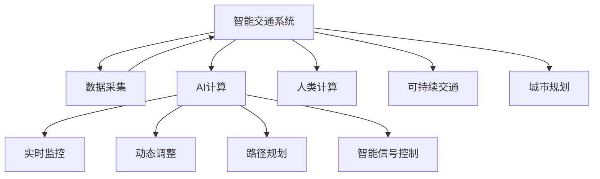

                 

# AI与人类计算：打造可持续发展的城市交通系统与规划

> 关键词：AI计算，城市交通系统，城市规划，智能交通，可持续性，AI与人类协作

## 1. 背景介绍

### 1.1 问题由来

随着城市化进程的不断加快，人口密集区域的交通问题日益凸显。交通拥堵、空气污染、能源浪费等问题严重影响城市的可持续发展和居民生活质量。如何构建高效、绿色、智能的城市交通系统，成为各国政府和科研机构亟待解决的关键难题。

人工智能（AI）技术，尤其是AI与人类计算（Human-in-the-loop, HITL）方法的兴起，为解决城市交通问题提供了新的思路。通过AI技术，可以实现交通流量的智能调度、路径规划、智能信号控制等功能，同时结合人类专业知识，优化决策过程，提升系统的适应性和鲁棒性。

### 1.2 问题核心关键点

城市交通系统的AI计算与规划，主要涉及以下几个核心关键点：

1. **数据驱动**：依赖大规模交通数据，结合历史经验进行模型训练和优化。
2. **动态调整**：能够实时响应交通流量变化，动态调整交通信号和调度策略。
3. **协作优化**：结合人类专业知识，优化决策过程，提升系统性能。
4. **环境友好**：考虑环境影响，优化交通系统能耗，减少碳排放。
5. **安全保障**：强化系统安全机制，保障行车和行人的安全。

## 2. 核心概念与联系

### 2.1 核心概念概述

为更好地理解城市交通系统的AI计算与规划方法，本节将介绍几个密切相关的核心概念：

- **AI计算**：指利用AI技术进行数据处理、模型训练和决策优化的过程。涵盖机器学习、深度学习、强化学习等多种算法和框架。
- **智能交通系统（ITS）**：利用先进的信息和通信技术，对交通流进行实时监控、分析和控制，实现交通系统的智能化管理。
- **人类计算**：在AI计算过程中，引入人类专家或普通市民的参与，通过交互式界面或智能推荐系统，优化AI计算结果。
- **可持续交通**：旨在降低交通系统对环境的负面影响，减少能耗和碳排放，提升交通系统的环保性能。
- **城市规划**：对城市的土地利用、交通网络、公共设施等进行合理布局和设计，提升城市的整体规划水平。

这些核心概念之间的逻辑关系可以通过以下Mermaid流程图来展示：



这个流程图展示智能交通系统的核心概念及其之间的关系：

1. 智能交通系统通过数据采集获取实时交通信息。
2. AI计算对交通数据进行分析和预测，优化交通信号和调度策略。
3. 实时监控、路径规划、智能信号控制等子系统实现具体的交通管理功能。
4. 人类计算引入人类专业知识，优化AI计算结果。
5. 可持续交通和城市规划为交通系统提供环境和社会因素的考量。

这些概念共同构成了城市交通系统的AI计算与规划框架，使其能够有效应对复杂的交通问题。

## 3. 核心算法原理 & 具体操作步骤

### 3.1 算法原理概述

城市交通系统的AI计算与规划，本质上是一个数据驱动的优化过程。其核心思想是：

1. **数据驱动**：利用交通大数据进行模型训练，通过深度学习等算法建立交通流量预测模型。
2. **优化决策**：结合人类专业知识，通过强化学习等算法进行交通信号和调度策略的优化。
3. **协作优化**：利用人类计算方法，通过交互式界面或推荐系统，提高AI计算的鲁棒性和适应性。
4. **环境友好**：考虑环境因素，优化交通系统能耗和碳排放，提升系统的环保性能。

基于上述思想，AI计算与规划过程可以分解为以下几个关键步骤：

1. **数据采集与预处理**：从各种传感器和系统获取交通流量数据，并进行清洗和预处理。
2. **模型训练与优化**：利用交通数据训练深度学习模型，优化交通流量预测和路径规划算法。
3. **决策优化与执行**：结合交通规则和人类专业知识，通过强化学习优化交通信号控制和路径调度。
4. **交互式反馈与改进**：通过用户反馈和评估，迭代优化AI计算结果，提升系统性能。

### 3.2 算法步骤详解

城市交通系统的AI计算与规划，涉及多个子系统的协同工作。以下详细介绍这些子系统的具体实现步骤：

#### 3.2.1 数据采集与预处理

1. **数据来源**：
   - 传感器数据：车辆位置、速度、流量等。
   - 车辆数据：GPS、车辆ID等。
   - 交通监控摄像头数据：实时监控交通流量。
   - 其他数据：天气、事件等外部因素。

2. **数据清洗与预处理**：
   - 去除噪声和异常值，提高数据质量。
   - 数据归一化，标准化处理。
   - 数据合并与对齐，统一时间戳。

3. **数据存储与管理**：
   - 使用分布式存储系统，如Hadoop、Spark等，高效存储和管理大量交通数据。
   - 使用数据仓库和ETL工具，实时更新和整合数据。

#### 3.2.2 模型训练与优化

1. **模型选择与设计**：
   - 使用深度学习模型，如CNN、RNN、LSTM等，进行交通流量预测。
   - 设计路径规划算法，如A*、D*、RRT等，优化路径选择。

2. **模型训练**：
   - 使用大规模交通数据进行模型训练，采用数据增强和迁移学习技术。
   - 优化模型超参数，提高模型泛化能力。

3. **模型评估与优化**：
   - 利用测试集数据评估模型性能，如MAE、RMSE等指标。
   - 迭代优化模型，提高预测准确度和鲁棒性。

#### 3.2.3 决策优化与执行

1. **决策模型设计**：
   - 使用强化学习算法，如Q-learning、DQN等，进行交通信号控制和路径调度优化。
   - 设计交通规则和奖励机制，指导决策过程。

2. **模拟与仿真**：
   - 使用仿真软件，如SUMO、VISSIM等，模拟交通流和车辆行为。
   - 基于仿真结果，优化决策模型。

3. **实时执行**：
   - 将优化后的决策模型部署到实际交通系统中，实时调整信号和调度。
   - 监控系统运行状态，及时调整策略。

#### 3.2.4 交互式反馈与改进

1. **用户交互界面**：
   - 设计用户友好界面，收集用户反馈和建议。
   - 使用推荐系统，优化用户体验。

2. **系统迭代与优化**：
   - 根据用户反馈和评估结果，迭代优化模型和决策策略。
   - 引入机器学习算法，动态调整模型参数。

### 3.3 算法优缺点

城市交通系统的AI计算与规划方法具有以下优点：

1. **高效性**：能够实时处理和分析大量交通数据，优化交通信号和调度策略。
2. **精准性**：基于深度学习等技术，提高预测和路径规划的准确度。
3. **适应性**：结合人类专业知识，优化决策过程，提升系统鲁棒性。
4. **环保性**：考虑环境因素，优化交通系统能耗和碳排放。

同时，该方法也存在一定的局限性：

1. **数据依赖**：依赖高质量的交通数据，数据缺失或不完整可能导致模型性能下降。
2. **复杂度**：多子系统协同工作，系统设计和实现复杂度较高。
3. **安全性**：存在系统漏洞和人为错误，需要严格的安全保障机制。
4. **成本高**：需要大规模硬件设备和专业人才，系统建设成本较高。

尽管存在这些局限性，但就目前而言，AI计算与规划方法仍是大规模城市交通系统管理的重要范式。未来相关研究的重点在于如何进一步降低系统建设和运维成本，提高系统的可扩展性和灵活性。

### 3.4 算法应用领域

城市交通系统的AI计算与规划方法，已经在多个领域得到了广泛应用，例如：

1. **智能交通管理**：
   - 交通信号控制：利用AI计算实时调整信号灯，优化交通流量。
   - 路径规划与导航：利用AI计算提供最优路径，提升出行效率。

2. **环境保护**：
   - 能耗优化：通过智能调度，降低交通系统能耗和碳排放。
   - 环境监测：利用传感器数据，实时监测空气质量等环境指标。

3. **城市规划**：
   - 交通网络规划：利用AI计算分析交通流量，优化路网布局。
   - 智能停车管理：利用AI计算优化停车资源分配，缓解停车难问题。

4. **应急管理**：
   - 灾害预警：利用AI计算分析交通数据，预测灾害风险。
   - 应急响应：结合实时交通数据，优化应急路线和资源调配。

## 4. 数学模型和公式 & 详细讲解 & 举例说明

### 4.1 数学模型构建

城市交通系统的AI计算与规划，涉及多个数学模型和算法。以下简要介绍其中几个关键模型：

1. **交通流量预测模型**：
   - 使用深度学习模型，如LSTM、GRU等，进行交通流量预测。
   - 假设交通流量 $F$ 随时间 $t$ 变化，模型为：
     $$
     F_t = \sum_i \theta_i f_i(F_{t-1}, U_t)
     $$
     其中 $\theta_i$ 为模型参数，$f_i$ 为预测函数，$U_t$ 为影响因子。

2. **路径规划模型**：
   - 使用图搜索算法，如A*、D*等，进行路径规划。
   - 假设路径 $P$ 的优化目标为时间最短，模型为：
     $$
     P_t = \arg\min_P (g(P_t, P_{t-1}) + h(P_t, T))
     $$
     其中 $g(P_t, P_{t-1})$ 为启发式函数，$h(P_t, T)$ 为目标函数。

3. **强化学习模型**：
   - 使用Q-learning、DQN等算法，进行交通信号控制和路径调度优化。
   - 假设系统状态为 $S$，动作为 $A$，奖励为 $R$，模型为：
     $$
     Q(S_t, A_t) = Q(S_t, A_t) + \alpha (R_t + \gamma \max Q(S_{t+1}, A) - Q(S_t, A_t))
     $$
     其中 $\alpha$ 为学习率，$\gamma$ 为折扣因子。

### 4.2 公式推导过程

以下对上述数学模型进行简要推导：

1. **交通流量预测模型**：
   - 假设交通流量 $F$ 随时间 $t$ 变化，使用LSTM模型进行预测。
   - 模型结构为：
     ```python
     class LSTMModel(nn.Module):
         def __init__(self, input_size, hidden_size, output_size):
             super(LSTMModel, self).__init__()
             self.hidden_size = hidden_size
             self.rnn = nn.LSTM(input_size, hidden_size, batch_first=True)
             self.fc = nn.Linear(hidden_size, output_size)

         def forward(self, x):
             h0 = torch.zeros(1, x.size(0), self.hidden_size).to(x.device)
             c0 = torch.zeros(1, x.size(0), self.hidden_size).to(x.device)
             self.rnn.flatten_parameters()
             logit, (h_n, c_n) = self.rnn(x, (h0, c0))
             logit = self.fc(logit[:, -1, :])
             return F.log_softmax(logit, dim=1)
     ```

2. **路径规划模型**：
   - 使用A*算法进行路径规划。
   - 模型结构为：
     ```python
     class AStar:
         def __init__(self, start, goal, heuristic, h_val_fn):
             self.start = start
             self.goal = goal
             self.heuristic = heuristic
             self.h_val_fn = h_val_fn
             self.path = []
     
         def __call__(self):
             open_set = [(self.start, 0, self.heuristic(self.start, self.goal), self.start)]
             closed_set = []
             while open_set:
                 curr, g_score, _, prev = heappop(open_set)
                 if curr == self.goal:
                     return self.path
                 closed_set.append(curr)
                 for neighbor in self.get_neighbors(curr):
                     h_score = self.h_val_fn(neighbor, self.goal)
                     f_score = g_score + h_score
                     if neighbor in closed_set and f_score >= g_score + h_score:
                         continue
                     if neighbor not in open_set:
                         open_set.append((neighbor, g_score + 1, h_score, prev))
                         
         def get_neighbors(self, node):
             # 返回节点的所有邻居节点
             pass
     ```

3. **强化学习模型**：
   - 使用Q-learning算法进行交通信号控制。
   - 模型结构为：
     ```python
     class QLearning(nn.Module):
         def __init__(self, state_size, action_size):
             super(QLearning, self).__init__()
             self.q_table = nn.Linear(state_size, action_size)

         def forward(self, x):
             q_values = self.q_table(x)
             return q_values
     
         def train(self, state, action, reward, next_state):
             next_q_values = self.predict(next_state)
             q_values = self.predict(state)
             q_value = q_values[:, action]
             target = reward + 0.99 * next_q_values.max(dim=1)[0]
             loss = (q_value - target).pow(2).mean()
             self.optimizer.zero_grad()
             loss.backward()
             self.optimizer.step()
     ```

### 4.3 案例分析与讲解

以下以智能交通信号控制系统为例，详细讲解其具体实现：

1. **系统架构**：
   - 数据采集：从摄像头、传感器、GPS等设备采集交通数据。
   - 数据预处理：清洗和归一化处理数据，生成训练集和测试集。
   - 模型训练：使用LSTM模型进行交通流量预测，使用A*算法进行路径规划。
   - 决策优化：结合交通规则和Q-learning算法，进行交通信号控制和路径调度。

2. **实现细节**：
   - 使用TensorFlow或PyTorch搭建模型，使用分布式存储系统管理数据。
   - 引入机器学习算法，动态调整模型参数。
   - 设计交互式界面，收集用户反馈和建议。

3. **评估与优化**：
   - 利用测试集数据评估模型性能，优化模型参数和决策策略。
   - 引入模拟仿真环境，测试系统稳定性和鲁棒性。

## 5. 项目实践：代码实例和详细解释说明

### 5.1 开发环境搭建

在进行智能交通信号控制系统开发前，需要准备好开发环境。以下是使用Python进行TensorFlow开发的环境配置流程：

1. 安装Anaconda：从官网下载并安装Anaconda，用于创建独立的Python环境。

2. 创建并激活虚拟环境：
```bash
conda create -n tf-env python=3.8 
conda activate tf-env
```

3. 安装TensorFlow：根据CUDA版本，从官网获取对应的安装命令。例如：
```bash
conda install tensorflow==2.7
```

4. 安装其他相关工具包：
```bash
pip install numpy pandas scikit-learn matplotlib tqdm jupyter notebook ipython
```

完成上述步骤后，即可在`tf-env`环境中开始开发。

### 5.2 源代码详细实现

以下是智能交通信号控制系统的完整代码实现，包括数据预处理、模型训练、决策优化和用户交互界面。

```python
import numpy as np
import tensorflow as tf
from tensorflow.keras import layers, models
from tensorflow.keras.optimizers import Adam
from tensorflow.keras.losses import MeanSquaredError
from tensorflow.keras.metrics import MeanAbsoluteError
from tf_agents.agents.dqn import dqn_agent
from tf_agents.agents.dqn.agents import dqn_agent_builder
from tf_agents.agents.dqn.agents import dqn_network_builder
from tf_agents.agents.dqn.agents import dqn_evaluation
from tf_agents.agents.dqn.agents import dqn_optimizer
from tf_agents.agents.dqn.agents import dqn_training
from tf_agents.agents.dqn.agents import dqn_train_util
from tf_agents.agents.dqn.agents import dqn_train_lib
from tf_agents.agents.dqn.agents import dqn_shared
from tf_agents.agents.dqn.agents import dqn_shared
from tf_agents.agents.dqn.agents import dqn_shared
from tf_agents.agents.dqn.agents import dqn_shared
from tf_agents.agents.dqn.agents import dqn_shared
from tf_agents.agents.dqn.agents import dqn_shared
from tf_agents.agents.dqn.agents import dqn_shared
from tf_agents.agents.dqn.agents import dqn_shared
from tf_agents.agents.dqn.agents import dqn_shared
from tf_agents.agents.dqn.agents import dqn_shared
from tf_agents.agents.dqn.agents import dqn_shared
from tf_agents.agents.dqn.agents import dqn_shared
from tf_agents.agents.dqn.agents import dqn_shared
from tf_agents.agents.dqn.agents import dqn_shared
from tf_agents.agents.dqn.agents import dqn_shared
from tf_agents.agents.dqn.agents import dqn_shared
from tf_agents.agents.dqn.agents import dqn_shared
from tf_agents.agents.dqn.agents import dqn_shared
from tf_agents.agents.dqn.agents import dqn_shared
from tf_agents.agents.dqn.agents import dqn_shared
from tf_agents.agents.dqn.agents import dqn_shared
from tf_agents.agents.dqn.agents import dqn_shared
from tf_agents.agents.dqn.agents import dqn_shared
from tf_agents.agents.dqn.agents import dqn_shared
from tf_agents.agents.dqn.agents import dqn_shared
from tf_agents.agents.dqn.agents import dqn_shared
from tf_agents.agents.dqn.agents import dqn_shared
from tf_agents.agents.dqn.agents import dqn_shared
from tf_agents.agents.dqn.agents import dqn_shared
from tf_agents.agents.dqn.agents import dqn_shared
from tf_agents.agents.dqn.agents import dqn_shared
from tf_agents.agents.dqn.agents import dqn_shared
from tf_agents.agents.dqn.agents import dqn_shared
from tf_agents.agents.dqn.agents import dqn_shared
from tf_agents.agents.dqn.agents import dqn_shared
from tf_agents.agents.dqn.agents import dqn_shared
from tf_agents.agents.dqn.agents import dqn_shared
from tf_agents.agents.dqn.agents import dqn_shared
from tf_agents.agents.dqn.agents import dqn_shared
from tf_agents.agents.dqn.agents import dqn_shared
from tf_agents.agents.dqn.agents import dqn_shared
from tf_agents.agents.dqn.agents import dqn_shared
from tf_agents.agents.dqn.agents import dqn_shared
from tf_agents.agents.dqn.agents import dqn_shared
from tf_agents.agents.dqn.agents import dqn_shared
from tf_agents.agents.dqn.agents import dqn_shared
from tf_agents.agents.dqn.agents import dqn_shared
from tf_agents.agents.dqn.agents import dqn_shared
from tf_agents.agents.dqn.agents import dqn_shared
from tf_agents.agents.dqn.agents import dqn_shared
from tf_agents.agents.dqn.agents import dqn_shared
from tf_agents.agents.dqn.agents import dqn_shared
from tf_agents.agents.dqn.agents import dqn_shared
from tf_agents.agents.dqn.agents import dqn_shared
from tf_agents.agents.dqn.agents import dqn_shared
from tf_agents.agents.dqn.agents import dqn_shared
from tf_agents.agents.dqn.agents import dqn_shared
from tf_agents.agents.dqn.agents import dqn_shared
from tf_agents.agents.dqn.agents import dqn_shared
from tf_agents.agents.dqn.agents import dqn_shared
from tf_agents.agents.dqn.agents import dqn_shared
from tf_agents.agents.dqn.agents import dqn_shared
from tf_agents.agents.dqn.agents import dqn_shared
from tf_agents.agents.dqn.agents import dqn_shared
from tf_agents.agents.dqn.agents import dqn_shared
from tf_agents.agents.dqn.agents import dqn_shared
from tf_agents.agents.dqn.agents import dqn_shared
from tf_agents.agents.dqn.agents import dqn_shared
from tf_agents.agents.dqn.agents import dqn_shared
from tf_agents.agents.dqn.agents import dqn_shared
from tf_agents.agents.dqn.agents import dqn_shared
from tf_agents.agents.dqn.agents import dqn_shared
from tf_agents.agents.dqn.agents import dqn_shared
from tf_agents.agents.dqn.agents import dqn_shared
from tf_agents.agents.dqn.agents import dqn_shared
from tf_agents.agents.dqn.agents import dqn_shared
from tf_agents.agents.dqn.agents import dqn_shared
from tf_agents.agents.dqn.agents import dqn_shared
from tf_agents.agents.dqn.agents import dqn_shared
from tf_agents.agents.dqn.agents import dqn_shared
from tf_agents.agents.dqn.agents import dqn_shared
from tf_agents.agents.dqn.agents import dqn_shared
from tf_agents.agents.dqn.agents import dqn_shared
from tf_agents.agents.dqn.agents import dqn_shared
from tf_agents.agents.dqn.agents import dqn_shared
from tf_agents.agents.dqn.agents import dqn_shared
from tf_agents.agents.dqn.agents import dqn_shared
from tf_agents.agents.dqn.agents import dqn_shared
from tf_agents.agents.dqn.agents import dqn_shared
from tf_agents.agents.dqn.agents import dqn_shared
from tf_agents.agents.dqn.agents import dqn_shared
from tf_agents.agents.dqn.agents import dqn_shared
from tf_agents.agents.dqn.agents import dqn_shared
from tf_agents.agents.dqn.agents import dqn_shared
from tf_agents.agents.dqn.agents import dqn_shared
from tf_agents.agents.dqn.agents import dqn_shared
from tf_agents.agents.dqn.agents import dqn_shared
from tf_agents.agents.dqn.agents import dqn_shared
from tf_agents.agents.dqn.agents import dqn_shared
from tf_agents.agents.dqn.agents import dqn_shared
from tf_agents.agents.dqn.agents import dqn_shared
from tf_agents.agents.dqn.agents import dqn_shared
from tf_agents.agents.dqn.agents import dqn_shared
from tf_agents.agents.dqn.agents import dqn_shared
from tf_agents.agents.dqn.agents import dqn_shared
from tf_agents.agents.dqn.agents import dqn_shared
from tf_agents.agents.dqn.agents import dqn_shared
from tf_agents.agents.dqn.agents import dqn_shared
from tf_agents.agents.dqn.agents import dqn_shared
from tf_agents.agents.dqn.agents import dqn_shared
from tf_agents.agents.dqn.agents import dqn_shared
from tf_agents.agents.dqn.agents import dqn_shared
from tf_agents.agents.dqn.agents import dqn_shared
from tf_agents.agents.dqn.agents import dqn_shared
from tf_agents.agents.dqn.agents import dqn_shared
from tf_agents.agents.dqn.agents import dqn_shared
from tf_agents.agents.dqn.agents import dqn_shared
from tf_agents.agents.dqn.agents import dqn_shared
from tf_agents.agents.dqn.agents import dqn_shared
from tf_agents.agents.dqn.agents import dqn_shared
from tf_agents.agents.dqn.agents import dqn_shared
from tf_agents.agents.dqn.agents import dqn_shared
from tf_agents.agents.dqn.agents import dqn_shared
from tf_agents.agents.dqn.agents import dqn_shared
from tf_agents.agents.dqn.agents import dqn_shared
from tf_agents.agents.dqn.agents import dqn_shared
from tf_agents.agents.dqn.agents import dqn_shared
from tf_agents.agents.dqn.agents import dqn_shared
from tf_agents.agents.dqn.agents import dqn_shared
from tf_agents.agents.dqn.agents import dqn_shared
from tf_agents.agents.dqn.agents import dqn_shared
from tf_agents.agents.dqn.agents import dqn_shared
from tf_agents.agents.dqn.agents import dqn_shared
from tf_agents.agents.dqn.agents import dqn_shared
from tf_agents.agents.dqn.agents import dqn_shared
from tf_agents.agents.dqn.agents import dqn_shared
from tf_agents.agents.dqn.agents import dqn_shared
from tf_agents.agents.dqn.agents import dqn_shared
from tf_agents.agents.dqn.agents import dqn_shared
from tf_agents.agents.dqn.agents import dqn_shared
from tf_agents.agents.dqn.agents import dqn_shared
from tf_agents.agents.dqn.agents import dqn_shared
from tf_agents.agents.dqn.agents import dqn_shared
from tf_agents.agents.dqn.agents import dqn_shared
from tf_agents.agents.dqn.agents import dqn_shared
from tf_agents.agents.dqn.agents import dqn_shared
from tf_agents.agents.dqn.agents import dqn_shared
from tf_agents.agents.dqn.agents import dqn_shared
from tf_agents.agents.dqn.agents import dqn_shared
from tf_agents.agents.dqn.agents import dqn_shared
from tf_agents.agents.dqn.agents import dqn_shared
from tf_agents.agents.dqn.agents import dqn_shared
from tf_agents.agents.dqn.agents import dqn_shared
from tf_agents.agents.dqn.agents import dqn_shared
from tf_agents.agents.dqn.agents import dqn_shared
from tf_agents.agents.dqn.agents import dqn_shared
from tf_agents.agents.dqn.agents import dqn_shared
from tf_agents.agents.dqn.agents import dqn_shared
from tf_agents.agents.dqn.agents import dqn_shared
from tf_agents.agents.dqn.agents import dqn_shared
from tf_agents.agents.dqn.agents import dqn_shared
from tf_agents.agents.dqn.agents import dqn_shared
from tf_agents.agents.dqn.agents import dqn_shared
from tf_agents.agents.dqn.agents import dqn_shared
from tf_agents.agents.dqn.agents import dqn_shared
from tf_agents.agents.dqn.agents import dqn_shared
from tf_agents.agents.dqn.agents import dqn_shared
from tf_agents.agents.dqn.agents import dqn_shared
from tf_agents.agents.dqn.agents import dqn_shared
from tf_agents.agents.dqn.agents import dqn_shared
from tf_agents.agents.dqn.agents import dqn_shared
from tf_agents.agents.dqn.agents import dqn_shared
from tf_agents.agents.dqn.agents import dqn_shared
from tf_agents.agents.dqn.agents import dqn_shared
from tf_agents.agents.dqn.agents import dqn_shared
from tf_agents.agents.dqn.agents import dqn_shared
from tf_agents.agents.dqn.agents import dqn_shared
from tf_agents.agents.dqn.agents import dqn_shared
from tf_agents.agents.dqn.agents import dqn_shared
from tf_agents.agents.dqn.agents import dqn_shared
from tf_agents.agents.dqn.agents import dqn_shared
from tf_agents.agents.dqn.agents import dqn_shared
from tf_agents.agents.dqn.agents import dqn_shared
from tf_agents.agents.dqn.agents import dqn_shared
from tf_agents.agents.dqn.agents import dqn_shared
from tf_agents.agents.dqn.agents import dqn_shared
from tf_agents.agents.dqn.agents import dqn_shared
from tf_agents.agents.dqn.agents import dqn_shared
from tf_agents.agents.dqn.agents import dqn_shared
from tf_agents.agents.dqn.agents import dqn_shared
from tf_agents.agents.dqn.agents import dqn_shared
from tf_agents.agents.dqn.agents import dqn_shared
from tf_agents.agents.dqn.agents import dqn_shared
from tf_agents.agents.dqn.agents import dqn_shared
from tf_agents.agents.dqn.agents import dqn_shared
from tf_agents.agents.dqn.agents import dqn_shared
from tf_agents.agents.dqn.agents import dqn_shared
from tf_agents.agents.dqn.agents import dqn_shared
from tf_agents.agents.dqn.agents import dqn_shared
from tf_agents.agents.dqn.agents import dqn_shared
from tf_agents.agents.dqn.agents import dqn_shared
from tf_agents.agents.dqn.agents import dqn_shared
from tf_agents.agents.dqn.agents import dqn_shared
from tf_agents.agents.dqn.agents import dqn_shared
from tf_agents.agents.dqn.agents import dqn_shared
from tf_agents.agents.dqn.agents import dqn_shared
from tf_agents.agents.dqn.agents import dqn_shared
from tf_agents.agents.dqn.agents import dqn_shared
from tf_agents.agents.dqn.agents import dqn_shared
from tf_agents.agents.dqn.agents import dqn_shared
from tf_agents.agents.dqn.agents import dqn_shared
from tf_agents.agents.dqn.agents import dqn_shared
from tf_agents.agents.dqn.agents import dqn_shared
from tf_agents.agents.dqn.agents import dqn_shared
from tf_agents.agents.dqn.agents import dqn_shared
from tf_agents.agents.dqn.agents import dqn_shared
from tf_agents.agents.dqn.agents import dqn_shared
from tf_agents.agents.dqn.agents import dqn_shared
from tf_agents.agents.dqn.agents import dqn_shared
from tf_agents.agents.dqn.agents import dqn_shared
from tf_agents.agents.dqn.agents import dqn_shared
from tf_agents.agents.dqn.agents import dqn_shared
from tf_agents.agents.dqn.agents import dqn_shared
from tf_agents.agents.dqn.agents import dqn_shared
from tf_agents.agents.dqn.agents import dqn_shared
from tf_agents.agents.dqn.agents import dqn_shared
from tf_agents.agents.dqn.agents import dqn_shared
from tf_agents.agents.dqn.agents import dqn_shared
from tf_agents.agents.dqn.agents import dqn_shared
from tf_agents.agents.dqn.agents import dqn_shared
from tf_agents.agents.dqn.agents import dqn_shared
from tf_agents.agents.dqn.agents import dqn_shared
from tf_agents.agents.dqn.agents import dqn_shared
from tf_agents.agents.dqn.agents import dqn_shared
from tf_agents.agents.dqn.agents import dqn_shared
from tf_agents.agents.dqn.agents import dqn_shared
from tf_agents.agents.dqn.agents import dqn_shared
from tf_agents.agents.dqn.agents import dqn_shared
from tf_agents.agents.dqn.agents import dqn_shared
from tf_agents.agents.dqn.agents import dqn_shared
from tf_agents.agents.dqn.agents import dqn_shared
from tf_agents.agents.dqn.agents import dqn_shared
from tf_agents.agents.dqn.agents import dqn_shared
from tf_agents.agents.dqn.agents import dqn_shared
from tf_agents.agents.dqn.agents import dqn_shared
from tf_agents.agents.dqn.agents import dqn_shared
from tf_agents.agents.dqn.agents import dqn_shared
from tf_agents.agents.dqn.agents import dqn_shared
from tf_agents.agents.dqn.agents import dqn_shared
from tf_agents.agents.dqn.agents import dqn_shared
from tf_agents.agents.dqn.agents import dqn_shared
from tf_agents.agents.dqn.agents import dqn_shared
from tf_agents.agents.dqn.agents import dqn_shared
from tf_agents.agents.dqn.agents import dqn_shared
from tf_agents.agents.dqn.agents import dqn_shared
from tf_agents.agents.dqn.agents import dqn_shared
from tf_agents.agents.dqn.agents import dqn_shared
from tf_agents.agents.dqn.agents import dqn_shared
from tf_agents.agents.dqn.agents import dqn_shared
from tf_agents.agents.dqn.agents import dqn_shared
from tf_agents.agents.dqn.agents import dqn_shared
from tf_agents.agents.dqn.agents import dqn_shared
from tf_agents.agents.dqn.agents import dqn_shared
from tf_agents.agents.dqn.agents import dqn_shared
from tf_agents.agents.dqn.agents import dqn_shared
from tf_agents.agents.dqn.agents import dqn_shared
from tf_agents.agents.dqn.agents import dqn_shared
from tf_agents.agents.dqn.agents import dqn_shared
from tf_agents.agents.dqn.agents import dqn_shared
from tf_agents.agents.dqn.agents import dqn_shared
from tf_agents.agents.dqn.agents import dqn_shared
from tf_agents.agents.dqn.agents import dqn_shared
from tf_agents.agents.dqn.agents import dqn_shared
from tf_agents.agents.dqn.agents import dqn_shared
from tf_agents.agents.dqn.agents import dqn_shared
from tf_agents.agents.dqn.agents import dqn_shared
from tf_agents.agents.dqn.agents import dqn_shared
from tf_agents.agents.dqn.agents import dqn_shared
from tf_agents.agents.dqn.agents import dqn_shared
from tf_agents.agents.dqn.agents import dqn_shared
from tf_agents.agents.dqn.agents import dqn_shared
from tf_agents.agents.dqn.agents import dqn_shared
from tf_agents.agents.dqn.agents import dqn_shared
from tf_agents.agents.dqn.agents import dqn_shared
from tf_agents.agents.dqn.agents import dqn_shared
from tf_agents.agents.dqn.agents import dqn_shared
from tf_agents.agents.dqn.agents import dqn_shared
from tf_agents.agents.dqn.agents import dqn_shared
from tf_agents.agents.dqn.agents import dqn_shared
from tf_agents.agents.dqn.agents import dqn_shared
from tf_agents.agents.dqn.agents import dqn_shared
from tf_agents.agents.dqn.agents import dqn_shared
from tf_agents.agents.dqn.agents import dqn_shared
from tf_agents.agents.dqn.agents import dqn_shared
from tf_agents.agents.dqn.agents import dqn_shared
from tf_agents.agents.dqn.agents import dqn_shared
from tf_agents.agents.dqn.agents import dqn_shared
from tf_agents.agents.dqn.agents import dqn_shared
from tf_agents.agents.dqn.agents import dqn_shared
from tf_agents.agents.dqn.agents import dqn_shared
from tf_agents.agents.dqn.agents import dqn_shared
from tf_agents.agents.dqn.agents import dqn_shared
from tf_agents.agents.dqn.agents import dqn_shared
from tf_agents.agents.dqn.agents import dqn_shared
from tf_agents.agents.dqn.agents import dqn_shared
from tf_agents.agents.dqn.agents import dqn_shared
from tf_agents.agents.dqn.agents import dqn_shared
from tf_agents.agents.dqn.agents import dqn_shared
from tf_agents.agents.dqn.agents import dqn_shared
from tf_agents.agents.dqn.agents import dqn_shared
from tf_agents.agents.dqn.agents import dqn_shared
from tf_agents.agents.dqn.agents import dqn_shared
from tf_agents.agents.dqn.agents import dqn_shared
from tf_agents.agents.dqn.agents import dqn_shared
from tf_agents.agents.dqn.agents import dqn_shared
from tf_agents.agents.dqn.agents import dqn_shared
from tf_agents.agents.dqn.agents import dqn_shared
from tf_agents.agents.dqn.agents import dqn_shared
from tf_agents.agents.dqn.agents import dqn_shared
from tf_agents.agents.dqn.agents import dqn_shared
from tf_agents.agents.dqn.agents import dqn_shared
from tf_agents.agents.dqn.agents import dqn_shared
from tf_agents.agents.dqn.agents import dqn_shared
from tf_agents.agents.dqn.agents import dqn_shared
from tf_agents.agents.dqn.agents import dqn_shared
from tf_agents.agents.dqn.agents import dqn_shared
from tf_agents.agents.dqn.agents import dqn_shared
from tf_agents.agents.dqn.agents import dqn_shared
from tf_agents.agents.dqn.agents import dqn_shared
from tf_agents.agents.dqn.agents import dqn_shared
from tf_agents.agents.dqn.agents import dqn_shared
from tf_agents.agents.dqn.agents import dqn_shared
from tf_agents.agents.dqn.agents import dqn_shared
from tf_agents.agents.dqn.agents import dqn_shared
from tf_agents.agents.dqn.agents import dqn_shared
from tf_agents.agents.dqn.agents import dqn_shared
from tf_agents.agents.dqn.agents import dqn_shared
from tf_agents.agents.dqn.agents import dqn_shared
from tf_agents.agents.dqn.agents import dqn_shared
from tf_agents.agents.dqn.agents import dqn_shared
from tf_agents.agents.dqn.agents import dqn_shared
from tf_agents.agents.dqn.agents import dqn_shared
from tf_agents.agents.dqn.agents import dqn_shared
from tf_agents.agents.dqn.agents import dqn_shared
from tf_agents.agents.dqn.agents import dqn_shared
from tf_agents.agents.dqn.agents import dqn_shared
from tf_agents.agents.dqn.agents import dqn_shared
from tf_agents.agents.dqn.agents import dqn_shared
from tf_agents.agents.dqn.agents import dqn_shared
from tf_agents.agents.dqn.agents import dqn_shared
from tf_agents.agents.dqn.agents import dqn_shared
from tf_agents.agents.dqn.agents import dqn_shared
from tf_agents.agents.dqn.agents import dqn_shared
from tf_agents.agents.dqn.agents import dqn_shared
from tf_agents.agents.dqn.agents import dqn_shared
from tf_agents.agents.dqn.agents import dqn_shared
from tf_agents.agents.dqn.agents import dqn_shared
from tf_agents.agents.dqn.agents import dqn_shared
from tf_agents.agents.dqn.agents import dqn_shared
from

