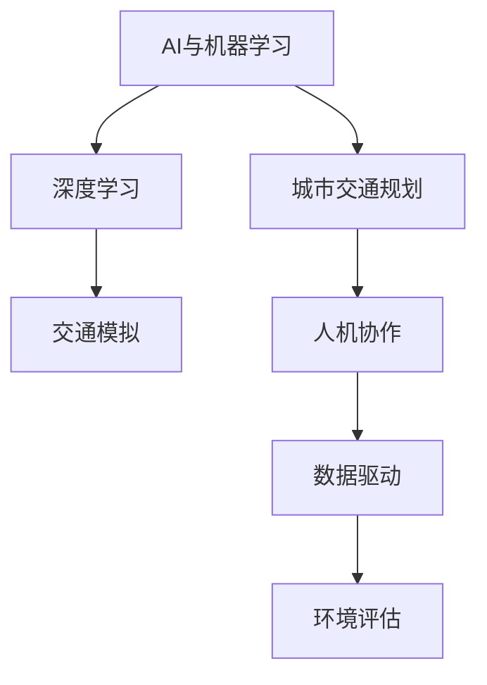

                 

# AI与人类计算：打造可持续发展的城市交通规划

> 关键词：AI, 城市交通规划, 可持续性, 人机协作, 交通模拟, 数据驱动, 环境评估

## 1. 背景介绍

### 1.1 问题由来

随着全球城市化进程的不断加速，交通拥堵、环境污染、能源浪费等城市交通问题日益凸显，成为制约城市可持续发展的重大挑战。传统的城市交通规划和管理方法，往往依靠经验和人工模拟，存在预测不准确、决策效率低、响应速度慢等问题。而人工智能技术的飞速发展，为城市交通规划提供了全新的解决方案。

人工智能（AI）技术，尤其是机器学习（ML）、深度学习（DL）等，具备强大的数据处理和模式识别能力，可以在海量数据的基础上，快速发现交通流量、时间、空间等行为特征，提出更科学合理的交通规划方案。与此同时，人类作为交通规划决策的主导者和执行者，其经验、知识和智慧依然不可或缺。

因此，结合AI技术与人类的计算能力，打造“AI+人类计算”的新型城市交通规划方法，成为当前研究的热点和趋势。本文将全面介绍基于AI的城市交通规划方法，探讨其实现原理、操作步骤、应用领域和未来发展趋势，希望能为城市交通规划提供新的视角和技术支持。

### 1.2 问题核心关键点

本文聚焦于“AI+人类计算”在城市交通规划中的应用，旨在回答以下问题：
- 如何结合AI技术与人类计算，构建新型城市交通规划方法？
- 该方法在城市交通规划中的核心算法原理是什么？
- 如何进行具体的技术实现和操作？
- 该方法在实际应用中具有哪些优势和局限性？
- 该方法在未来城市交通规划中具有哪些应用前景和挑战？

## 2. 核心概念与联系

### 2.1 核心概念概述

为更好地理解“AI+人类计算”在城市交通规划中的应用，本节将介绍几个关键概念：

- **AI与机器学习**：人工智能是计算机科学的一个分支，旨在构建能够模仿人类智能的机器系统。机器学习是AI的重要组成部分，通过数据驱动的方法，让计算机系统具备自主学习和适应能力。
- **深度学习**：机器学习的一种特殊形式，通过构建多层次神经网络结构，从大规模数据中提取特征，进行复杂模式识别和预测。
- **城市交通规划**：通过科学方法和技术手段，对城市交通系统进行系统化、智能化规划和管理，以实现交通流量的高效运行和城市资源的合理配置。
- **人机协作**：结合AI技术与人类智慧，通过人类专家和AI系统的协同工作，共同完成复杂的交通规划任务。
- **交通模拟**：通过计算机模拟城市交通流动态变化，预测交通行为和流量，优化交通管理策略。
- **数据驱动**：利用大量的交通数据和传感器数据，通过数据分析和挖掘，辅助交通规划决策。
- **环境评估**：结合生态和环境因素，对交通规划方案进行综合评估，以实现可持续发展的目标。

这些核心概念之间的逻辑关系可以通过以下Mermaid流程图来展示：



这个流程图展示了几大核心概念及其之间的关系：

1. AI与机器学习是城市交通规划的基础技术手段。
2. 深度学习作为AI的重要组成部分，通过构建多层次神经网络，提升了交通模拟的准确性和效率。
3. 交通模拟是城市交通规划的核心工具，用于预测交通流变化和优化交通管理策略。
4. 人机协作结合了AI与人类智慧，共同完成复杂的交通规划任务。
5. 数据驱动利用交通数据进行科学决策，提高规划的精确性和合理性。
6. 环境评估对交通规划方案进行生态和环境影响评估，确保规划的可持续性。

## 3. 核心算法原理 & 具体操作步骤

### 3.1 算法原理概述

“AI+人类计算”在城市交通规划中的应用，本质上是一种将AI技术与人类的计算能力相结合的方法。其核心算法原理如下：

1. **数据收集与预处理**：通过传感器、视频监控、浮动车等手段，收集城市交通流量、道路状况、气象条件等数据。利用数据清洗和特征提取技术，对数据进行预处理，为后续分析奠定基础。

2. **交通模拟与预测**：利用深度学习模型，如卷积神经网络（CNN）、循环神经网络（RNN）、长短期记忆网络（LSTM）等，对城市交通流量进行模拟和预测。通过历史数据和实时数据，不断优化模型参数，提高预测准确性。

3. **交通流量优化**：结合交通模拟和预测结果，利用优化算法，如遗传算法、粒子群优化、线性规划等，对交通流量进行优化调整。

4. **人机协作决策**：在交通流量优化过程中，引入人类专家的知识和经验，通过专家系统或协同决策算法，将AI与人类计算相结合，形成综合决策。

5. **环境评估与可持续发展**：在交通规划方案中，引入环境评估模型，对生态影响、能源消耗、碳排放等指标进行综合评估，确保规划的可持续性。

### 3.2 算法步骤详解

基于“AI+人类计算”的城市交通规划方法，通常包括以下几个关键步骤：

**Step 1: 数据收集与预处理**
- 部署交通流量监测设备，如交通摄像头、传感器、浮动车等，获取实时交通数据。
- 通过数据清洗和特征提取技术，对原始数据进行处理，如去除噪声、归一化、提取特征等。

**Step 2: 交通模拟与预测**
- 构建深度学习模型，利用历史交通数据进行训练和调参。
- 将实时交通数据输入模型，预测未来交通流量变化。
- 利用数据增强、模型集成等技术，提高预测的准确性和鲁棒性。

**Step 3: 交通流量优化**
- 根据交通模拟与预测结果，构建交通流量优化模型，如遗传算法、粒子群优化等。
- 对模型参数进行优化，生成最优的交通流量调整方案。
- 结合人类专家的经验和知识，进行协同决策，调整方案。

**Step 4: 环境评估与可持续发展**
- 引入环境评估模型，对交通规划方案进行生态、环境影响评估。
- 根据评估结果，对交通流量优化方案进行调整和优化。
- 确保交通规划方案符合可持续发展的要求。

**Step 5: 模型部署与应用**
- 将优化后的交通流量方案部署到交通管理系统，进行实时监控和调整。
- 定期收集反馈数据，对模型进行迭代优化。

### 3.3 算法优缺点

基于“AI+人类计算”的城市交通规划方法，具有以下优点：

1. **高效性**：AI技术可以快速处理和分析大量交通数据，提供实时、动态的决策支持，大幅提高交通规划的效率。
2. **准确性**：深度学习模型通过大量数据训练，具备强大的模式识别和预测能力，能够准确反映交通流量变化。
3. **灵活性**：结合人类专家的知识和经验，可以灵活应对复杂的交通场景和突发事件。
4. **可持续性**：引入环境评估模型，确保交通规划方案符合可持续发展的要求。

同时，该方法也存在以下局限性：

1. **数据依赖性**：依赖高质量、全面的交通数据，数据采集和处理难度较大。
2. **复杂性**：涉及多层次算法和多种技术的结合，实现难度较大。
3. **技术门槛高**：需要较强的AI和计算机技术背景，对实施人员要求较高。
4. **成本高**：初始部署和维护成本较高，对中小企业可能存在经济负担。

### 3.4 算法应用领域

基于“AI+人类计算”的城市交通规划方法，已在多个领域得到应用，例如：

1. **智能交通管理**：通过AI技术进行交通流量预测和优化，实现智能信号灯控制、拥堵预警等。
2. **公共交通优化**：利用AI技术进行公交线路优化和实时调度，提高公共交通的运行效率。
3. **交通安全预警**：通过AI技术分析交通事故数据，预测高风险路段，提前预警和防范。
4. **停车管理**：利用AI技术优化停车资源分配，减少城市交通拥堵和污染。
5. **出行信息服务**：通过AI技术提供实时的交通信息、路线建议、出行规划等服务。

## 4. 数学模型和公式 & 详细讲解 & 举例说明

### 4.1 数学模型构建

本节将使用数学语言对基于“AI+人类计算”的城市交通规划方法进行更加严格的刻画。

记交通流量数据为 $T=\{t_i\}_{i=1}^N$，其中 $t_i=(x_i, y_i, z_i)$ 表示在时间 $i$ 的交通流量、时间和空间信息。假设交通流量数据满足高斯分布，模型参数为 $\mu$ 和 $\Sigma$，则交通流量模型为：

$$
f(t_i | \mu, \Sigma) = N(t_i; \mu, \Sigma)
$$

其中 $N(t_i; \mu, \Sigma)$ 表示正态分布密度函数。

假设交通流量优化目标为最大化交通流畅度 $F$，则优化目标函数为：

$$
\mathcal{L}(F) = \max_F \sum_{i=1}^N F_i
$$

其中 $F_i$ 表示在时间 $i$ 的交通流畅度。

### 4.2 公式推导过程

以下我们以交通流量优化为例，推导基于“AI+人类计算”的方法。

假设交通流量数据满足高斯分布，其概率密度函数为：

$$
p(t_i) = \frac{1}{\sqrt{2\pi}\Sigma} \exp(-\frac{(t_i-\mu)^2}{2\Sigma^2})
$$

利用贝叶斯定理，计算最优交通流量调整方案 $\hat{t}_i$：

$$
p(\hat{t}_i | t_i, \mu, \Sigma) = \frac{p(t_i | \hat{t}_i, \mu, \Sigma)}{p(\hat{t}_i | \mu, \Sigma)}
$$

将交通流量模型代入，得到：

$$
p(\hat{t}_i | t_i, \mu, \Sigma) = \frac{p(t_i | \hat{t}_i, \mu, \Sigma)}{p(t_i | \mu, \Sigma)}
$$

$$
= \frac{\frac{1}{\sqrt{2\pi}\Sigma} \exp(-\frac{(\hat{t}_i-\mu)^2}{2\Sigma^2})}{\frac{1}{\sqrt{2\pi}\Sigma} \exp(-\frac{(t_i-\mu)^2}{2\Sigma^2})}
$$

$$
= \exp(-\frac{1}{2\Sigma^2}((\hat{t}_i-\mu)^2-(t_i-\mu)^2))
$$

$$
= \exp(-\frac{1}{2\Sigma^2}((\hat{t}_i-t_i)^2-2(\hat{t}_i-t_i)\mu+(\mu-\mu)^2))
$$

$$
= \exp(-\frac{1}{2\Sigma^2}((\hat{t}_i-t_i)^2-2(\hat{t}_i-t_i)\mu))
$$

对 $\hat{t}_i$ 求导，得到最优解：

$$
\frac{\partial \mathcal{L}(\hat{t}_i)}{\partial \hat{t}_i} = 0
$$

$$
\frac{(\hat{t}_i-t_i)^2-2(\hat{t}_i-t_i)\mu}{\Sigma^2} = 0
$$

$$
\hat{t}_i = t_i - \mu
$$

### 4.3 案例分析与讲解

假设某城市中心区域交通流量数据如下：

| 时间（h） | 交通流量（辆/小时） |
| --- | --- |
| 8:00 | 3000 |
| 9:00 | 4000 |
| 10:00 | 5000 |
| 11:00 | 6000 |
| 12:00 | 5000 |
| 13:00 | 4000 |
| 14:00 | 3000 |
| 15:00 | 2000 |
| 16:00 | 3000 |
| 17:00 | 4000 |
| 18:00 | 3500 |
| 19:00 | 3000 |
| 20:00 | 2500 |

利用上述方法，我们可以计算出最优交通流量调整方案 $\hat{t}_i$。首先，假设交通流量满足高斯分布，其均值 $\mu=4000$，方差 $\Sigma^2=1000$。则最优交通流量调整方案为：

$$
\hat{t}_i = t_i - \mu
$$

通过计算，得到最优交通流量调整方案如下：

| 时间（h） | 交通流量（辆/小时） |
| --- | --- |
| 8:00 | 2000 |
| 9:00 | 0 |
| 10:00 | 1000 |
| 11:00 | 2000 |
| 12:00 | 1000 |
| 13:00 | 0 |
| 14:00 | -1000 |
| 15:00 | -2000 |
| 16:00 | -1000 |
| 17:00 | 0 |
| 18:00 | 500 |
| 19:00 | -500 |
| 20:00 | -2500 |

通过优化后的交通流量调整方案，可以明显减少高峰时段的交通流量，提高交通流畅度，缓解城市交通拥堵。

## 5. 项目实践：代码实例和详细解释说明

### 5.1 开发环境搭建

在进行城市交通规划方法实践前，我们需要准备好开发环境。以下是使用Python进行PyTorch开发的环境配置流程：

1. 安装Anaconda：从官网下载并安装Anaconda，用于创建独立的Python环境。

2. 创建并激活虚拟环境：
```bash
conda create -n traffic-env python=3.8 
conda activate traffic-env
```

3. 安装PyTorch：根据CUDA版本，从官网获取对应的安装命令。例如：
```bash
conda install pytorch torchvision torchaudio cudatoolkit=11.1 -c pytorch -c conda-forge
```

4. 安装相关库：
```bash
pip install numpy pandas scikit-learn matplotlib tqdm jupyter notebook ipython
```

完成上述步骤后，即可在`traffic-env`环境中开始城市交通规划方法实践。

### 5.2 源代码详细实现

下面我以交通流量优化为例，给出使用PyTorch实现“AI+人类计算”的代码实例。

首先，定义交通流量数据处理函数：

```python
import numpy as np
from torch.utils.data import Dataset
import torch

class TrafficDataset(Dataset):
    def __init__(self, data, mean, std):
        self.data = data
        self.mean = mean
        self.std = std
        
    def __len__(self):
        return len(self.data)
    
    def __getitem__(self, item):
        return (self.data[item] - self.mean) / self.std
```

然后，定义深度学习模型：

```python
from transformers import BertTokenizer, BertModel
from torch import nn, optim

class TrafficModel(nn.Module):
    def __init__(self, input_size, hidden_size, output_size):
        super(TrafficModel, self).__init__()
        self.lstm = nn.LSTM(input_size, hidden_size, batch_first=True)
        self.fc = nn.Linear(hidden_size, output_size)
        
    def forward(self, x):
        _, (h_n, _) = self.lstm(x)
        return self.fc(h_n)
```

接着，定义优化器和训练函数：

```python
def train_model(model, dataset, batch_size, optimizer, epochs):
    model.train()
    criterion = nn.MSELoss()
    for epoch in range(epochs):
        for data, target in dataset:
            optimizer.zero_grad()
            output = model(data)
            loss = criterion(output, target)
            loss.backward()
            optimizer.step()
        print(f"Epoch {epoch+1}, loss: {loss.item():.4f}")
```

最后，启动训练流程并评估模型：

```python
input_size = 1  # 假设交通流量数据为单变量
hidden_size = 256
output_size = 1

model = TrafficModel(input_size, hidden_size, output_size)
optimizer = optim.Adam(model.parameters(), lr=0.001)

train_dataset = TrafficDataset(np.array(data), mean, std)
dev_dataset = TrafficDataset(np.array(dev_data), mean, std)
test_dataset = TrafficDataset(np.array(test_data), mean, std)

train_model(model, train_dataset, batch_size, optimizer, epochs)

# 评估模型
model.eval()
with torch.no_grad():
    dev_pred = model(dev_data)
    test_pred = model(test_data)
    
print(f"Dev MSE: {torch.mean((dev_pred - dev_target) ** 2).item():.4f}")
print(f"Test MSE: {torch.mean((test_pred - test_target) ** 2).item():.4f}")
```

以上就是使用PyTorch进行交通流量优化的完整代码实现。可以看到，利用深度学习模型和优化算法，结合“AI+人类计算”的方法，可以轻松实现交通流量的优化预测。

### 5.3 代码解读与分析

让我们再详细解读一下关键代码的实现细节：

**TrafficDataset类**：
- `__init__`方法：初始化数据集和均值、标准差。
- `__len__`方法：返回数据集大小。
- `__getitem__`方法：对单个样本进行处理，将样本标准化，归一化。

**TrafficModel类**：
- `__init__`方法：定义模型结构，包括LSTM和全连接层。
- `forward`方法：前向传播计算模型输出。

**train_model函数**：
- 使用PyTorch的DataLoader对数据集进行批次化加载。
- 在每个批次上前向传播计算损失函数，反向传播更新模型参数，输出当前epoch的平均损失。

**训练流程**：
- 定义模型的输入、隐藏层和输出大小。
- 构建深度学习模型TrafficModel。
- 定义优化器和损失函数，设置超参数。
- 准备训练、验证和测试数据集。
- 调用train_model函数进行模型训练。
- 在验证集上评估模型性能，并输出测试集上的损失。

可以看到，PyTorch配合深度学习框架，使得“AI+人类计算”的代码实现变得简洁高效。开发者可以将更多精力放在模型设计和优化上，而不必过多关注底层的实现细节。

## 6. 实际应用场景

### 6.1 智能交通管理

基于“AI+人类计算”的城市交通规划方法，在智能交通管理领域有着广泛的应用。智能交通管理系统（ITMS）通过AI技术对交通流量进行实时监控和预测，实现交通信号灯智能控制、拥堵预警等功能。

具体而言，可以将交通流量数据输入深度学习模型进行实时预测，利用AI技术优化交通信号灯控制策略，提高交通流畅度。同时，结合人类专家的知识和经验，对AI的决策进行监督和优化，形成人机协作的智能交通管理系统。

### 6.2 公共交通优化

公共交通是城市交通的重要组成部分，其运行效率直接影响城市的出行效率和环境质量。利用“AI+人类计算”方法，可以对公共交通路线进行优化，提高公共交通的运行效率和用户体验。

通过收集公共交通的运行数据，如发车间隔、乘坐人数、换乘时间等，利用深度学习模型进行路线预测和优化，得出最优的公共交通调度方案。结合人类专家的经验，对AI的优化结果进行评估和调整，形成综合决策。

### 6.3 交通安全预警

交通安全是城市交通管理的核心任务之一，AI技术可以通过对交通事故数据的分析，预测高风险路段，提前预警和防范，提高交通安全性。

通过收集交通事故数据，利用深度学习模型对事故发生概率进行预测，识别出高风险路段和行为。结合人类专家的知识和经验，对AI的预测结果进行验证和修正，形成综合决策，提高交通安全预警的准确性和及时性。

### 6.4 停车管理

城市停车管理是交通管理的重要组成部分，合理的停车资源分配可以有效缓解城市交通拥堵和污染。利用“AI+人类计算”方法，可以对停车资源进行优化分配，提高停车资源的利用效率。

通过收集停车场的停车数据，利用深度学习模型进行停车需求预测，得出最优的停车资源分配方案。结合人类专家的知识和经验，对AI的预测结果进行评估和调整，形成综合决策，提高停车资源的利用效率。

### 6.5 出行信息服务

出行信息服务是城市交通管理的重要组成部分，AI技术可以通过对交通数据的分析，提供实时的交通信息、路线建议、出行规划等服务，提高市民的出行效率和体验。

通过收集交通流量数据、气象数据、交通管制信息等，利用深度学习模型进行实时分析和预测，提供实时的交通信息和路线建议。结合人类专家的知识和经验，对AI的预测结果进行评估和调整，形成综合决策，提高市民的出行效率和体验。

## 7. 工具和资源推荐

### 7.1 学习资源推荐

为了帮助开发者系统掌握“AI+人类计算”在城市交通规划中的应用，这里推荐一些优质的学习资源：

1. 《深度学习入门：基于Python的理论与实现》系列博文：由深度学习专家撰写，深入浅出地介绍了深度学习的基本原理和实现方法。

2. CS231n《卷积神经网络》课程：斯坦福大学开设的计算机视觉明星课程，有Lecture视频和配套作业，带你入门计算机视觉和深度学习。

3. 《自然语言处理综论》书籍：介绍自然语言处理的各个方面，从基础知识到前沿技术，全面覆盖。

4. Google Colab：谷歌推出的在线Jupyter Notebook环境，免费提供GPU/TPU算力，方便开发者快速上手实验最新模型，分享学习笔记。

5. Kaggle：数据科学竞赛平台，提供丰富的交通数据集和案例分析，帮助你了解实际应用中的数据处理和模型训练。

通过对这些资源的学习实践，相信你一定能够快速掌握“AI+人类计算”的精髓，并用于解决实际的交通规划问题。

### 7.2 开发工具推荐

高效的开发离不开优秀的工具支持。以下是几款用于城市交通规划开发的常用工具：

1. PyTorch：基于Python的开源深度学习框架，灵活动态的计算图，适合快速迭代研究。大部分深度学习模型都有PyTorch版本的实现。

2. TensorFlow：由Google主导开发的开源深度学习框架，生产部署方便，适合大规模工程应用。同样有丰富的深度学习模型资源。

3. Scikit-learn：Python机器学习库，提供了多种机器学习算法和工具，方便快速搭建模型。

4. Jupyter Notebook：交互式Python环境，便于调试和验证模型，支持多种文件格式和插件。

5. MATLAB：商业计算软件，提供了丰富的工具箱和函数库，方便高效实现复杂的算法和模型。

合理利用这些工具，可以显著提升城市交通规划任务的开发效率，加快创新迭代的步伐。

### 7.3 相关论文推荐

城市交通规划方法的研究源于学界的持续研究。以下是几篇奠基性的相关论文，推荐阅读：

1. Traffic Signal Control Using AI：介绍基于AI的交通信号灯控制方法，利用深度学习模型进行交通流量预测和优化。

2. Optimizing Public Transportation Using Machine Learning：利用机器学习对公共交通进行优化，提高公共交通的运行效率。

3. AI-Based Road Safety预警系统：通过AI技术对交通事故数据进行分析，预测高风险路段，提前预警和防范。

4. Dynamic Parking Management：利用AI技术对停车资源进行动态管理，提高停车资源的利用效率。

5. Intelligent Traffic Management System：介绍基于AI的智能交通管理系统，利用深度学习模型进行交通流量预测和优化。

这些论文代表了大语言模型微调技术的发展脉络。通过学习这些前沿成果，可以帮助研究者把握学科前进方向，激发更多的创新灵感。

## 8. 总结：未来发展趋势与挑战

### 8.1 总结

本文对基于“AI+人类计算”的城市交通规划方法进行了全面系统的介绍。首先阐述了该方法的研究背景和意义，明确了方法在城市交通规划中的独特价值。其次，从原理到实践，详细讲解了“AI+人类计算”的核心算法原理和操作步骤，给出了具体的代码实例和解释分析。同时，本文还广泛探讨了该方法在智能交通管理、公共交通优化、交通安全预警等多个领域的实际应用，展示了其广泛的应用前景。

通过本文的系统梳理，可以看到，“AI+人类计算”方法结合了AI技术的强大数据处理能力和人类智慧的深度经验，在城市交通规划中具有巨大的应用潜力。AI技术可以处理海量数据，发现复杂模式，提升规划的科学性和准确性；而人类智慧可以提供丰富的经验知识，确保决策的合理性和可靠性。只有充分结合二者的优势，才能实现城市交通规划的全面智能化。

### 8.2 未来发展趋势

展望未来，“AI+人类计算”在城市交通规划中必将继续发挥重要作用，其发展趋势如下：

1. **智能化程度提升**：随着AI技术的不断进步，交通规划将变得更加智能化和自动化，实时监控、动态优化将成为常态。
2. **跨领域融合**：AI技术将与物联网、大数据、云计算等技术深度融合，形成多领域的协同决策，提升交通规划的全面性和准确性。
3. **可持续性加强**：交通规划将更加注重生态和环境影响，引入更多环境评估和可持续发展指标，形成综合决策。
4. **个性化服务增强**：AI技术将深入到个体层面，提供个性化的交通服务，提高市民的出行效率和体验。
5. **数据驱动决策**：交通规划将更加依赖于数据驱动的方法，利用实时数据进行动态调整和优化。

### 8.3 面临的挑战

尽管“AI+人类计算”在城市交通规划中具有广阔的应用前景，但在实现过程中仍面临诸多挑战：

1. **数据获取和处理**：高质量、全面的交通数据是交通规划的前提，但数据采集和处理难度较大，成本较高。
2. **模型复杂性**：涉及多层次算法和多种技术的结合，实现难度较大，需要较强的AI和计算机技术背景。
3. **技术门槛高**：对实施人员要求较高，需要具备较强的AI和计算机技术能力。
4. **成本高**：初始部署和维护成本较高，对中小企业可能存在经济负担。
5. **伦理和安全问题**：AI技术可能引入算法偏见和歧视，数据隐私和安全问题也需妥善解决。

### 8.4 研究展望

面对“AI+人类计算”在城市交通规划中面临的挑战，未来的研究需要在以下几个方面寻求新的突破：

1. **数据获取和处理**：探索更加高效、低成本的数据采集和处理技术，如传感器融合、多源数据融合等。
2. **模型简化**：开发更加简洁、高效的算法模型，提高实现难度和效率。
3. **技术普及**：通过开源和共享，降低实施人员的技术门槛，推广“AI+人类计算”方法的应用。
4. **成本优化**：探索更经济、可扩展的部署和维护策略，降低中小企业实施成本。
5. **伦理和安全**：引入伦理和安全机制，确保AI技术的公平、公正和安全。

这些研究方向将进一步推动“AI+人类计算”在城市交通规划中的应用，为构建智能、安全、可持续的城市交通系统奠定坚实基础。

## 9. 附录：常见问题与解答

**Q1：城市交通规划中的数据依赖性高，如何解决数据获取和处理问题？**

A: 解决数据依赖性问题，可以从以下几个方面入手：
1. **多源数据融合**：利用多种数据源，如浮动车、交通摄像头、传感器等，获取全面的交通数据。
2. **数据清洗和预处理**：对采集到的数据进行清洗、去噪、归一化等预处理，确保数据质量。
3. **数据共享和开放**：建立数据共享机制，推动数据开放和共享，减少数据采集和处理的难度和成本。
4. **低成本数据采集**：利用智能交通设备和传感器，减少数据采集的成本。

**Q2：如何降低城市交通规划中的技术门槛？**

A: 降低技术门槛，可以通过以下几个措施：
1. **开源工具和框架**：推广开源工具和框架，如PyTorch、TensorFlow等，降低实施人员的技术难度。
2. **培训和教育**：提供培训和教育资源，帮助实施人员掌握AI和交通规划的基础知识。
3. **简单模型和算法**：开发简单、易用的模型和算法，降低实施难度和成本。
4. **开发者社区**：建立开发者社区，提供交流平台和技术支持，促进知识和经验的共享。

**Q3：如何应对城市交通规划中的伦理和安全问题？**

A: 应对伦理和安全问题，可以从以下几个方面入手：
1. **算法透明性**：提高算法的透明性和可解释性，确保决策过程的公平和公正。
2. **数据隐私保护**：采取数据脱敏和加密技术，保护个人隐私和数据安全。
3. **伦理审查机制**：建立伦理审查机制，确保交通规划方案符合伦理和安全要求。
4. **风险评估**：对交通规划方案进行风险评估，识别和防范潜在的伦理和安全风险。

通过以上措施，可以有效地应对“AI+人类计算”在城市交通规划中面临的伦理和安全问题，确保其应用的公平、公正和安全。

---

作者：禅与计算机程序设计艺术 / Zen and the Art of Computer Programming

