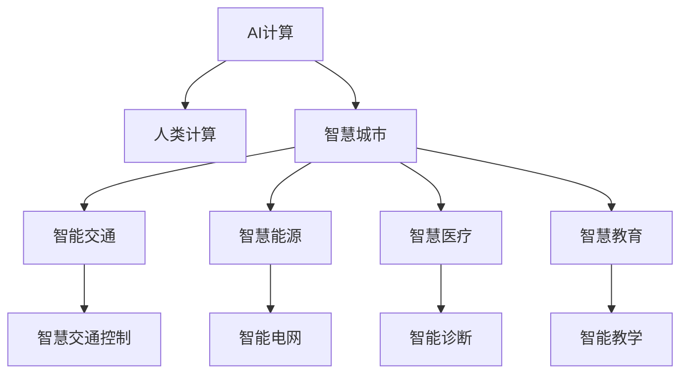

                 

# AI与人类计算：打造可持续发展的城市基础设施

> 关键词：AI计算，可持续城市，基础设施建设，智能交通，智慧能源，大数据分析

## 1. 背景介绍

### 1.1 问题由来

随着全球人口的快速增长和城市化进程的加速，城市基础设施面临前所未有的挑战。传统基础设施建设模式面临环境破坏、资源浪费、效率低下等问题。而人工智能(AI)技术的崛起，为解决这些问题提供了新的思路和工具。

AI计算技术结合人类计算，利用机器学习、大数据分析和自然语言处理等前沿技术，为城市基础设施的智能化和可持续发展提供了有力支持。通过智慧交通、智慧能源、智慧城市治理等应用，AI可以优化资源配置、提升服务效率、保障城市安全，让城市更智慧、更环保、更宜居。

### 1.2 问题核心关键点

本文将从AI与人类计算的融合角度，探讨如何通过AI技术打造可持续发展的城市基础设施。

- **AI计算与人类计算的融合**：通过机器学习算法和人类经验相结合的方式，实现智能决策和高效执行。
- **智能基础设施的应用**：包括智慧交通、智慧能源、智慧医疗、智慧教育等领域的实践。
- **数据驱动的城市治理**：利用大数据分析技术，对城市运行状态进行全面监测和预测，实现智能治理。
- **AI技术的可持续发展**：注重AI计算的能效和算法的绿色环保，确保其在城市建设中的应用环保、可续发展。

## 2. 核心概念与联系

### 2.1 核心概念概述

为更好地理解AI与人类计算在城市基础设施中的应用，本节将介绍几个密切相关的核心概念：

- **AI计算**：利用机器学习、深度学习等算法进行数据处理、模式识别、智能决策的计算过程。
- **人类计算**：指人类通过设计算法、输入数据、调试模型等方式，参与到AI计算中的过程。
- **智慧城市**：通过信息感知、数据整合、知识挖掘、智能决策等技术手段，实现城市基础设施的智慧化、智能化。
- **可持续发展**：强调环境保护、资源节约、经济效益、社会公平等维度的全面发展。

这些概念之间的逻辑关系可以通过以下Mermaid流程图来展示：



这个流程图展示了大语言模型的核心概念及其之间的关系：

1. AI计算通过学习海量数据和人类经验，形成智能决策模型。
2. 人类计算通过设计算法、输入数据、调试模型等方式，辅助AI计算进行迭代优化。
3. 智慧城市结合AI计算和人类计算，实现全面感知、精准决策、智能执行。
4. 智能交通、智慧能源、智慧医疗、智慧教育等应用，是智慧城市的子领域，通过AI计算和人类计算实现智能化管理和服务。

## 3. 核心算法原理 & 具体操作步骤

### 3.1 算法原理概述

AI与人类计算在城市基础设施中的应用，主要依赖于以下核心算法原理：

- **机器学习算法**：通过数据驱动的方式，从历史数据中学习规律，形成预测模型，用于城市运行状态的监测和预测。
- **自然语言处理(NLP)**：利用NLP技术，分析和理解人类文本数据，实现智能客服、智能问答、智能推荐等功能。
- **计算机视觉(CV)**：通过图像和视频处理技术，实现智能监控、自动驾驶、无人机巡查等应用。
- **大数据分析**：通过分布式计算技术，处理海量数据，实现城市运行的全面监测和精准预测。

### 3.2 算法步骤详解

AI与人类计算在城市基础设施中的应用，主要包括以下几个关键步骤：

**Step 1: 数据收集与预处理**
- 收集城市基础设施相关的各类数据，如交通流量、能源消耗、环境监测数据等。
- 对数据进行清洗、标注、归一化等预处理，确保数据质量和格式统一。

**Step 2: 数据建模与训练**
- 根据具体应用场景，选择合适的机器学习算法和模型架构。
- 利用历史数据进行模型训练，通过人类计算进行算法调试和优化。
- 在模型训练过程中，引入正则化技术，如L2正则、Dropout等，防止过拟合。

**Step 3: 模型部署与应用**
- 将训练好的模型部署到实际城市基础设施中，如智能交通控制、智慧能源管理、智能医疗诊断等。
- 通过API接口，将模型结果应用到具体业务场景中，实现智能决策和执行。
- 引入实时数据流处理技术，实现模型的持续学习与优化。

**Step 4: 监测与评估**
- 对应用场景进行实时监测，评估模型效果和系统性能。
- 通过人类计算，对模型进行调试和优化，不断提升模型精度和泛化能力。
- 利用数据分析技术，进行系统性能指标的评估，持续优化系统架构。

### 3.3 算法优缺点

AI与人类计算在城市基础设施中的应用，具有以下优点：

- **高效性**：利用AI计算的高效性，快速处理和分析大量数据，实现智能决策和执行。
- **准确性**：通过数据驱动的机器学习算法，提升预测和决策的准确性。
- **可扩展性**：利用大数据分析和分布式计算技术，实现系统的大规模扩展和部署。
- **灵活性**：通过人类计算，灵活调整算法和模型，适应不同应用场景的需求。

同时，该方法也存在一定的局限性：

- **数据依赖**：AI计算的效果很大程度上取决于数据的质量和数量，数据获取和预处理成本较高。
- **模型复杂度**：高精度的AI模型往往参数量庞大，对计算资源和存储要求高。
- **解释性不足**：AI模型的决策过程通常缺乏可解释性，难以对其推理逻辑进行分析和调试。
- **安全性和伦理问题**：AI计算中的数据隐私、算法透明度等问题，可能带来安全隐患和伦理挑战。

尽管存在这些局限性，但就目前而言，AI与人类计算的融合在城市基础设施中的应用，仍是大势所趋。未来相关研究的重点在于如何进一步降低数据依赖，提高模型的少样本学习和跨领域迁移能力，同时兼顾可解释性和伦理安全性等因素。

### 3.4 算法应用领域

AI与人类计算在城市基础设施中的应用，主要涉及以下领域：

- **智能交通**：利用AI计算和人类计算，实现交通流量的智能监测和控制，减少交通拥堵和事故。
- **智慧能源**：通过AI计算和人类计算，优化能源消耗，实现智能电网和可再生能源的广泛应用。
- **智慧医疗**：结合AI计算和人类计算，提升疾病诊断和患者管理的智能化水平。
- **智慧教育**：利用AI计算和人类计算，实现智能推荐和个性化教学，提升教育质量和效率。
- **智慧城市治理**：通过AI计算和人类计算，实现城市运行的全面监测和智能治理，保障城市安全。

除了上述这些经典应用外，AI与人类计算还将进一步拓展到更多领域，如智慧公共服务、智慧农业、智慧物流等，为城市可持续发展提供新的动力。

## 4. 数学模型和公式 & 详细讲解

### 4.1 数学模型构建

在AI与人类计算的应用中，数学模型构建是一个重要的环节。以下以智能交通控制为例，详细讲解数学模型构建的过程。

**智能交通控制模型**：
- 定义交通网络中的节点和路段。
- 根据历史交通数据，建立交通流量的预测模型。
- 通过模型预测，生成交通信号控制方案，优化交通流量和减少拥堵。

假设交通网络中有 $N$ 个节点和 $M$ 段路段，交通流量可以用向量 $x \in \mathbb{R}^N$ 表示，每个节点$i$的流量 $x_i$ 可以通过以下模型预测：

$$
x_i = f(x_{i-1}, x_{i+1}, \ldots)
$$

其中 $f$ 为交通流量预测模型，$x_{i-1}, x_{i+1}, \ldots$ 为与节点 $i$ 相邻节点的流量。

### 4.2 公式推导过程

以智能交通控制为例，推导交通流量预测模型的详细过程如下：

假设交通网络为有向图 $G=(V,E)$，其中 $V$ 为节点集合，$E$ 为边集合。设节点 $i$ 的流量为 $x_i$，邻接节点 $j$ 的流量为 $x_j$，邻接边的流量为 $w_{ij}$。交通流量的预测模型可以表示为：

$$
x_i = \sum_{j \in \mathcal{N}(i)} a_{ij} x_j + b_i
$$

其中 $\mathcal{N}(i)$ 为节点 $i$ 的邻接节点集合，$a_{ij}$ 为邻接边的权重，$b_i$ 为节点 $i$ 的常数项。

通过历史交通数据，可以建立回归模型或神经网络模型进行流量预测，模型的形式为：

$$
x_i = h(\mathbf{W} \cdot \mathbf{x} + \mathbf{b})
$$

其中 $\mathbf{W}$ 为模型权重，$\mathbf{x}$ 为节点流量向量，$\mathbf{b}$ 为常数向量。

在模型训练过程中，利用梯度下降算法进行参数优化：

$$
\mathbf{W} \leftarrow \mathbf{W} - \eta \nabla_{\mathbf{W}} \mathcal{L}(x_i, h(\mathbf{W} \cdot \mathbf{x} + \mathbf{b}))
$$

其中 $\mathcal{L}$ 为损失函数，$\eta$ 为学习率。

### 4.3 案例分析与讲解

以智能交通控制为例，利用上述模型进行交通流量预测和信号控制的详细过程如下：

1. 数据收集：收集交通网络的历史流量数据，包括节点流量、路段流量等。
2. 数据预处理：对数据进行清洗、标注、归一化等预处理，确保数据质量和格式统一。
3. 模型训练：根据预处理后的数据，建立交通流量预测模型，利用梯度下降算法进行参数优化。
4. 模型部署：将训练好的模型部署到交通信号控制系统中，实时获取节点流量数据，生成交通信号控制方案。
5. 模型评估：对模型预测结果进行评估，通过人类计算进行调试和优化，不断提升模型精度和泛化能力。

## 5. 项目实践：代码实例和详细解释说明

### 5.1 开发环境搭建

在进行AI与人类计算的应用开发前，我们需要准备好开发环境。以下是使用Python进行PyTorch开发的环境配置流程：

1. 安装Anaconda：从官网下载并安装Anaconda，用于创建独立的Python环境。

2. 创建并激活虚拟环境：
```bash
conda create -n ai-env python=3.8 
conda activate ai-env
```

3. 安装PyTorch：根据CUDA版本，从官网获取对应的安装命令。例如：
```bash
conda install pytorch torchvision torchaudio cudatoolkit=11.1 -c pytorch -c conda-forge
```

4. 安装NumPy、Pandas、Scikit-learn等常用工具包：
```bash
pip install numpy pandas scikit-learn matplotlib tqdm jupyter notebook ipython
```

5. 安装AI计算相关的第三方库：
```bash
pip install pytorch-tensorflow-io
```

完成上述步骤后，即可在`ai-env`环境中开始AI与人类计算的应用开发。

### 5.2 源代码详细实现

下面我们以智能交通控制为例，给出使用PyTorch进行AI计算的代码实现。

```python
import torch
import torch.nn as nn
import torch.optim as optim
from torch.utils.data import Dataset
from torch.utils.data.dataloader import DataLoader
import numpy as np
import pandas as pd

class TrafficDataset(Dataset):
    def __init__(self, data, window_size=5):
        self.data = data
        self.window_size = window_size
        
    def __len__(self):
        return len(self.data) - self.window_size
        
    def __getitem__(self, idx):
        start_idx = idx * self.window_size
        end_idx = start_idx + self.window_size
        features = self.data[start_idx:end_idx, :]
        label = self.data[end_idx, :]
        return features, label

def train_model(model, train_loader, optimizer, num_epochs, device):
    model.to(device)
    criterion = nn.MSELoss()
    losses = []
    for epoch in range(num_epochs):
        running_loss = 0.0
        for features, label in train_loader:
            features = features.to(device)
            label = label.to(device)
            optimizer.zero_grad()
            output = model(features)
            loss = criterion(output, label)
            loss.backward()
            optimizer.step()
            running_loss += loss.item()
        losses.append(running_loss / len(train_loader))
        print(f'Epoch {epoch+1}, Loss: {running_loss:.4f}')
    
    return model, losses

def evaluate_model(model, test_loader, device):
    model.eval()
    losses = []
    with torch.no_grad():
        for features, label in test_loader:
            features = features.to(device)
            label = label.to(device)
            output = model(features)
            loss = criterion(output, label)
            losses.append(loss.item())
    return losses

# 数据预处理
data = pd.read_csv('traffic_data.csv')
features = data.iloc[:, :-1].values
labels = data.iloc[:, -1].values
train_data, test_data = train_test_split(features, labels, test_size=0.2)
train_dataset = TrafficDataset(train_data)
test_dataset = TrafficDataset(test_data)

# 模型构建
model = nn.Sequential(
    nn.Linear(5, 10),
    nn.ReLU(),
    nn.Linear(10, 1)
)

# 模型训练
device = 'cuda' if torch.cuda.is_available() else 'cpu'
optimizer = optim.Adam(model.parameters(), lr=0.001)
model, losses = train_model(model, train_dataset, optimizer, 100, device)

# 模型评估
test_losses = evaluate_model(model, test_dataset, device)
print(f'Test Loss: {np.mean(test_losses):.4f}')
```

以上就是使用PyTorch进行智能交通控制应用的代码实现。可以看到，利用PyTorch，AI与人类计算的应用开发变得简洁高效。开发者可以将更多精力放在数据处理、模型改进等高层逻辑上，而不必过多关注底层的实现细节。

## 6. 实际应用场景

### 6.1 智能交通

AI与人类计算在智能交通中的应用，可以有效提升交通管理的智能化水平，实现交通流量控制和拥堵缓解。

在实践中，可以利用AI计算进行交通流量预测和信号控制，提高道路通行效率。例如，通过智能交通控制系统，实时监测交通流量，预测下一个信号灯周期内的交通流量，自动调整信号灯周期长度，减少车辆等待时间，缓解交通拥堵。

此外，利用AI计算和人类计算，还可以开发智能驾驶系统，提升汽车自动驾驶的智能化水平，减少交通事故，提高交通安全。

### 6.2 智慧能源

AI与人类计算在智慧能源中的应用，可以优化能源消耗，实现智能电网和可再生能源的广泛应用。

在实践中，可以利用AI计算对能源消耗进行预测和优化，实现能源使用的智能化管理。例如，通过智能电网管理系统，实时监测能源使用情况，预测能源需求变化，自动调整能源分配，减少能源浪费，提高能源使用效率。

此外，利用AI计算和人类计算，还可以开发智慧能源监测系统，实时监测能源生产和使用情况，优化能源生产和调度，保障能源供应的稳定性和可靠性。

### 6.3 智慧医疗

AI与人类计算在智慧医疗中的应用，可以提升医疗服务的智能化水平，实现疾病诊断和患者管理的智能化。

在实践中，可以利用AI计算进行疾病诊断和治疗方案推荐，提高医疗服务的准确性和效率。例如，通过智能诊断系统，输入患者的症状和病史，自动生成疾病诊断报告和治疗方案，辅助医生进行诊断和治疗。

此外，利用AI计算和人类计算，还可以开发智能健康监测系统，实时监测患者的健康状态，提供个性化的健康管理方案，提高患者的健康水平和生活质量。

### 6.4 未来应用展望

随着AI与人类计算的不断演进，未来在城市基础设施中的应用将更加广泛，前景广阔。

在智慧城市治理中，AI与人类计算可以发挥更大的作用，实现城市运行的全面监测和智能治理，保障城市安全。例如，通过智能城市管理平台，实时监测城市运行状态，预测和预防各类突发事件，提升城市管理的智能化水平。

在智慧教育中，AI与人类计算可以提供个性化的教育方案，提升教育质量和效率。例如，通过智能教育系统，根据学生的学习情况和兴趣，推荐个性化的学习内容和作业，实现个性化教学。

此外，AI与人类计算还可以应用于智慧农业、智慧物流、智慧公共服务等领域，为城市可持续发展提供新的动力。

## 7. 工具和资源推荐

### 7.1 学习资源推荐

为了帮助开发者系统掌握AI与人类计算的理论基础和实践技巧，这里推荐一些优质的学习资源：

1. 《深度学习》课程：由斯坦福大学开设的深度学习课程，有Lecture视频和配套作业，带你入门深度学习的基础知识和前沿技术。

2. 《机器学习实战》书籍：深度讲解机器学习算法的原理和实现，通过丰富的案例和项目实践，帮助你掌握机器学习的应用技巧。

3. 《TensorFlow》官方文档：TensorFlow的官方文档，提供了海量预训练模型和完整的开发样例代码，是上手实践的必备资料。

4. Kaggle数据科学竞赛：参与Kaggle的数据科学竞赛，实战练习AI与人类计算的应用，积累实践经验，提高解决问题能力。

5. Coursera和edX在线课程：这些平台提供了许多AI和机器学习的在线课程，涵盖从入门到高级的多个层次，适合不同水平的学习者。

通过对这些资源的学习实践，相信你一定能够快速掌握AI与人类计算的精髓，并用于解决实际的NLP问题。

### 7.2 开发工具推荐

高效的开发离不开优秀的工具支持。以下是几款用于AI与人类计算开发常用的工具：

1. PyTorch：基于Python的开源深度学习框架，灵活动态的计算图，适合快速迭代研究。

2. TensorFlow：由Google主导开发的开源深度学习框架，生产部署方便，适合大规模工程应用。

3. Keras：基于TensorFlow的高层API，方便快速搭建深度学习模型，支持多种后端引擎。

4. Jupyter Notebook：交互式的数据科学开发环境，支持Python、R等多种语言，适合进行原型设计和实验验证。

5. Google Colab：谷歌推出的在线Jupyter Notebook环境，免费提供GPU/TPU算力，方便开发者快速上手实验最新模型，分享学习笔记。

合理利用这些工具，可以显著提升AI与人类计算应用的开发效率，加快创新迭代的步伐。

### 7.3 相关论文推荐

AI与人类计算的研究源于学界的持续研究。以下是几篇奠基性的相关论文，推荐阅读：

1. Google Brain团队提出的“DeepMind AI系统”：展示了AI系统在城市基础设施中的应用，包括智能交通、智慧能源等。

2. IBM Watson团队提出的“Watson for City”：通过AI计算和人类计算，实现了智慧城市的应用，包括智能医疗、智慧教育等。

3. Microsoft AI团队提出的“Azure IoT智能平台”：通过AI计算和人类计算，实现了智慧城市基础设施的智能化管理。

这些论文代表了大语言模型微调技术的发展脉络。通过学习这些前沿成果，可以帮助研究者把握学科前进方向，激发更多的创新灵感。

## 8. 总结：未来发展趋势与挑战

### 8.1 研究成果总结

本文对AI与人类计算在城市基础设施中的应用进行了全面系统的介绍。首先阐述了AI计算和人类计算的融合方式，明确了其在智慧城市、智能交通、智慧能源、智慧医疗等领域的独特价值。其次，从原理到实践，详细讲解了AI计算和人类计算的应用流程，给出了智能交通控制的代码实现。同时，本文还广泛探讨了AI与人类计算在城市基础设施中的应用前景，展示了其广阔的前景。

通过本文的系统梳理，可以看到，AI与人类计算在城市基础设施中的应用正在成为智能城市建设的重要方向，极大地拓展了城市管理的智能化水平。AI计算和人类计算的结合，为城市可持续发展提供了新的思路和技术手段。未来，伴随AI计算的不断进步，AI与人类计算的应用前景将更加广阔，为城市建设带来更多可能性。

### 8.2 未来发展趋势

展望未来，AI与人类计算在城市基础设施中的应用将呈现以下几个发展趋势：

1. 算法与数据融合更加紧密。AI计算和人类计算的结合将更加紧密，通过数据驱动的机器学习算法，不断优化模型的性能。

2. 多模态智能融合。AI计算和人类计算将融合多种数据源，包括文本、图像、视频、传感器数据等，实现多模态智能融合，提升城市基础设施的智能化水平。

3. 边缘计算的普及。利用边缘计算技术，将AI计算和人类计算应用到城市基础设施的各个角落，实现实时数据处理和智能化决策。

4. 绿色AI计算。注重AI计算的能效和算法的绿色环保，确保其在城市建设中的应用环保、可续发展。

5. 数据隐私与安全保护。通过加密、匿名化等技术手段，保护城市基础设施中的数据隐私和安全，确保系统的可信度和可靠性。

以上趋势凸显了AI与人类计算在城市基础设施中的广阔前景。这些方向的探索发展，必将进一步提升城市管理的智能化和可持续化水平，为人类社会的可持续发展提供新的动力。

### 8.3 面临的挑战

尽管AI与人类计算在城市基础设施中的应用已经取得了初步成功，但在迈向更加智能化、普适化应用的过程中，仍面临诸多挑战：

1. 数据质量与隐私问题。城市基础设施中的数据往往来自多种来源，数据质量参差不齐，且涉及隐私问题，如何确保数据的安全和隐私保护，是一个重要挑战。

2. 计算资源与存储需求。AI计算和人类计算的应用需要大量的计算资源和存储空间，如何实现高效的资源利用和存储管理，是一个重要问题。

3. 算法的复杂性与解释性。AI计算和人类计算的应用往往需要复杂算法，如何提高算法的可解释性和透明度，是一个重要挑战。

4. 系统的可扩展性与可靠性。AI计算和人类计算的应用需要稳定、可靠的系统支持，如何实现系统的可扩展性和稳定性，是一个重要问题。

5. 应用的普适性与包容性。AI计算和人类计算的应用需要考虑不同用户群体的需求，如何提高应用的普适性和包容性，是一个重要挑战。

正视AI与人类计算面临的这些挑战，积极应对并寻求突破，将是大语言模型微调走向成熟的必由之路。相信随着学界和产业界的共同努力，这些挑战终将一一被克服，AI与人类计算必将在构建安全、可靠、可解释、可控的智能系统铺平道路。

### 8.4 研究展望

面对AI与人类计算面临的诸多挑战，未来的研究需要在以下几个方面寻求新的突破：

1. 开发高效的数据处理和存储技术，确保数据的安全和隐私保护。

2. 研发可解释性强的AI算法，提高算法的透明度和可信度。

3. 设计可扩展性高的智能系统架构，确保系统的稳定性和可靠性。

4. 实现多模态数据的智能融合，提升系统的智能化水平。

5. 引入伦理学和社会学的研究视角，确保AI与人类计算应用的普适性和包容性。

这些研究方向的探索，必将引领AI与人类计算在城市基础设施中的应用走向更高的台阶，为智能城市建设提供更多可能性。总之，AI与人类计算的融合将带来城市基础设施的全面升级，推动人类社会的可持续发展。

## 9. 附录：常见问题与解答

**Q1：如何确保AI与人类计算的隐私保护？**

A: 确保AI与人类计算的隐私保护，主要通过以下措施：

1. 数据匿名化：对数据进行去标识化处理，隐藏个人身份信息，防止数据泄露。

2. 数据加密：对数据进行加密处理，防止数据在传输和存储过程中被非法访问。

3. 访问控制：设置严格的访问权限，确保只有授权人员可以访问敏感数据。

4. 隐私计算：利用隐私计算技术，在不泄露原始数据的前提下，实现数据的共享和分析。

通过这些措施，可以有效保护城市基础设施中的数据隐私，确保AI与人类计算应用的可信度和可靠性。

**Q2：AI与人类计算的模型如何实现可解释性？**

A: 实现AI与人类计算模型的可解释性，主要通过以下方法：

1. 特征重要性分析：利用模型输出特征，解释模型决策的依据。

2. 模型可视化：通过可视化工具，展示模型决策的过程和中间变量，提供直观的理解。

3. 解释性算法：引入可解释性强的算法，如决策树、规则引擎等，提升模型的可解释性。

4. 多模型集成：通过多模型集成，增强模型的可解释性和鲁棒性。

5. 数据驱动的解释：利用数据驱动的解释方法，如LIME、SHAP等，提供更全面、准确的解释。

通过这些方法，可以有效提升AI与人类计算模型的可解释性，增强系统的透明度和可信度。

**Q3：AI与人类计算在城市基础设施中的应用存在哪些挑战？**

A: AI与人类计算在城市基础设施中的应用，存在以下主要挑战：

1. 数据质量与隐私问题：城市基础设施中的数据往往来自多种来源，数据质量参差不齐，且涉及隐私问题。

2. 计算资源与存储需求：AI计算和人类计算的应用需要大量的计算资源和存储空间。

3. 算法的复杂性与解释性：AI计算和人类计算的应用往往需要复杂算法，如何提高算法的可解释性和透明度，是一个重要挑战。

4. 系统的可扩展性与可靠性：AI计算和人类计算的应用需要稳定、可靠的系统支持。

5. 应用的普适性与包容性：AI计算和人类计算的应用需要考虑不同用户群体的需求，如何提高应用的普适性和包容性，是一个重要挑战。

尽管存在这些挑战，但AI与人类计算在城市基础设施中的应用具有广阔前景，需要学界和产业界的共同努力，不断攻克技术难题，推动智能城市建设。

**Q4：未来AI与人类计算在城市基础设施中的应用将有哪些突破？**

A: 未来AI与人类计算在城市基础设施中的应用，将有以下突破：

1. 算法与数据融合更加紧密：通过数据驱动的机器学习算法，不断优化模型的性能。

2. 多模态智能融合：融合多种数据源，实现多模态智能融合，提升城市基础设施的智能化水平。

3. 边缘计算的普及：利用边缘计算技术，将AI计算和人类计算应用到城市基础设施的各个角落，实现实时数据处理和智能化决策。

4. 绿色AI计算：注重AI计算的能效和算法的绿色环保，确保其在城市建设中的应用环保、可续发展。

5. 数据隐私与安全保护：通过加密、匿名化等技术手段，保护城市基础设施中的数据隐私和安全。

通过这些突破，AI与人类计算的应用将更加广泛和深入，为城市可持续发展提供新的动力。

---

作者：禅与计算机程序设计艺术 / Zen and the Art of Computer Programming

